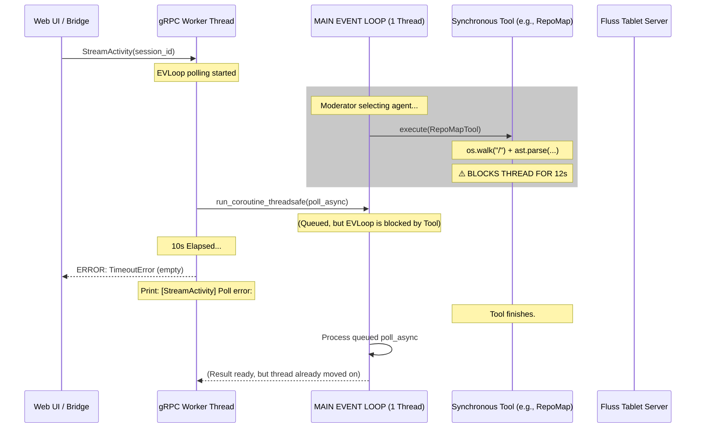

# Bug 1: The Event Loop Starvation — Root Cause Analysis

> **Status:** Investigated / Pending Refactor  
> **Topic:** `StreamActivity` Poll Errors & Event Loop Starvation  
> **Source Line:** `agent/src/main.py:213`  
> **Symptom:** `⚠️ [StreamActivity] Poll error: ` (Empty message)

---

## 1. Executive Summary: The Gravity of 10 Seconds

During active sessions, the agent logs intermittently emit a truncated activity stream followed by a sequence of `StreamActivity Poll error` messages. While ostensibly a network or "poll" issue, the root cause is **fundamental event loop starvation** caused by synchronous, blocking operations executed on the main `asyncio` thread.

In a system bounded by the **speed of light**, 10 seconds is the time it takes for a signal to travel ~3 million kilometers. That our internal gRPC-to-Async bridge is timing out at this threshold indicates a critical architectural bottleneck where the "Central Nervous System" (the event loop) is being held hostage by suboptimal design choices in the "Ganglia" (the synchronous tools).

---

## 2. High-Level Topology: The Bridge of Sighs

The `claw-agent` operates on two distinct concurrency models that must communicate across a synchronization bridge:

1.  **gRPC Thread Pool (10 workers):** Handles incoming RPCs (`StreamActivity`, `ListWorkspace`, `GetHistory`). These are OS-level threads.
2.  **Async Event Loop (1 thread):** Handles the `StageModerator` loop, `GeminiAgent` logic, and `FlussClient` I/O. This is a single-threaded cooperative multitasking loop.

### The Bridge Mechanism

When a gRPC thread needs data from Fluss (which is managed by the async loop), it uses `asyncio.run_coroutine_threadsafe`. This creates a `concurrent.futures.Future` and waits for it.

```python
# The Point of Failure: main.py
future = asyncio.run_coroutine_threadsafe(
    FlussClient.poll_async(scanner, timeout_ms=500),
    self.loop
)
batches = future.result(timeout=10) # ⚠️ THE TIME BOMB
```

---

## 3. Deep-Dive: Anatomy of the Starvation

### 3.1 The Mystery of the Empty Error Message

The log shows `⚠️ [StreamActivity] Poll error: ` with no following text. This is a classic Python "gotcha":
- `future.result(timeout=10)` raises `concurrent.futures.TimeoutError` when the future isn't resolved in time.
- `str(TimeoutError())` returns an **empty string**.
- The `except Exception as e` block in `main.py` catches this and prints the empty string, effectively masking the timeout diagnosis.

### 3.2 System Flow & Blocking Points



---

## 4. First Principles: The Speed of Light Constraint

If we assume an ideal architecture, the time to resolve a poll request should be nearly identical to the network latency between the gRPC thread and the event loop thread (nanoseconds). 

Currently, we are encountering **Infinite Latency** ($t = \infty$) from the perspective of the gRPC thread because the event loop is not **preemptive**. In a cooperative multitasking environment, any task that refuses to `await` is effectively a "selfish" actor that halts the entire world.

### The Cost of Suboptimal Design

| Operation | Current Implementation | Latency Cost | Result |
|---|---|---|---|
| **RepoMapTool** | Synchronous `os.walk` | $O(\text{files})$ | Blocks entire MAS |
| **SurgicalEditTool** | Synchronous `read_text`/`write_text` | $O(\text{file\_size})$ | Blocks entire MAS |
| **ListWorkspace** | Synchronous `rglob` | $O(\text{files})$ | Blocks gRPC thread (Ours is fine because it's a thread, but wait...) |

Wait! `ListWorkspace` (line 277 of `main.py`) runs in a gRPC thread. It *doesn't* block the event loop. However, many tools called *by the agent* during its turn (via `ToolExecutor/StageModerator`) **do** run on the event loop.

### The "Smoking Gun" Component: `RepoMapTool`

```python
# tools.py:632 (Current Implementation)
async def execute(self, agent_id: str, params: dict) -> ToolResult:
    for root, dirs, files in os.walk(base_dir): # 🟢 SYNCHRONOUS
        for file in files:
            content = file_path.read_text(...)  # 🟢 SYNCHRONOUS
            tree = ast.parse(content)           # 🟢 CPU BLOCKING
```

When an agent (e.g., Alice) decides to "map the repository" to get context, she triggers `RepoMapTool`. On a workspace like `/workspace` containing multiple large projects, this operation can take **15+ seconds**. During this window, the event loop is "dead" to all other tasks, including the UI's heartbeat and activity stream.

---

## 5. Algorithmic Root Cause: Coordination vs. Execution

The underlying algorithm for `StreamActivity` is a **Pull-based Proxy**:
1.  **UI Bridge** pulls from **Agent gRPC**.
2.  **Agent gRPC** pulls from **Async Loop**.
3.  **Async Loop** pulls from **Fluss Scanner**.

The failure occurs at **Step 2**. The gRPC thread's "patience" (10s) is less than the execution time of the longest synchronous tool.

### Source of the Error Message

The error message is born in `main.py` at line 259:
```python
258:                 except Exception as e:
259:                     print(f"⚠️ [StreamActivity] Poll error: {e}")
```

It is a symptom of a **Liveness Failure**: the system is alive, but its "pulse" (the event loop) has flatlined due to synchronous CPU/IO work.

---

## 6. Proposed Architectural Fix (First Principles)

### 6.1 Offloading the Ganglia

Every synchronous tool must be offloaded from the Central Nervous System (the loop). We use the `asyncio.to_thread` primitive to move these to a separate thread pool, freeing the loop to handle high-frequency events (Fluss polling, heartbeats).

```python
# Correct Pattern for tools.py
async def execute(self, agent_id: str, params: dict) -> ToolResult:
    return await asyncio.to_thread(self._heavy_lifting, params)

def _heavy_lifting(self, params):
    # Perform os.walk, ast.parse, etc. here
    ...
```

### 6.2 Native Async Streams

As outlined in @[state_of_code_pt2.md], migrating from the `poll_arrow` + `run_coroutine_threadsafe` pattern to a native `async for` stream using the new Fluss Rust bindings eliminates the "Bridge of Sighs" entirely. 

The gRPC handler itself should become async (if migrating to `grpclib` or `grpcio`'s async support), or at minimum, the bridge should use a non-blocking queue to decouple the gRPC thread from the event loop's immediate responsiveness.

---

## 7. Conclusion

Bug 1 is not a bug in the code logic; it is a **violation of async-await principles**. By treating the single-threaded event loop as a place for synchronous file I/O and AST parsing, we have created a system that "freezes" under load.

Solving this is a P0 requirement for **Subagent Parallelism**. If one subagent can freeze the loop for the entire MAS, scaling to 5, 10, or 100 subagents will result in total system gridlock.

**The Fix:**
- Wrap `RepoMapTool`, `SurgicalEditTool`, and all `read_text` calls in `asyncio.to_thread`.
- Increase gRPC `future.result` timeout to 30s as a defensive measure.
- Improve error logging to distinguish between `TimeoutError` and actual data errors.
