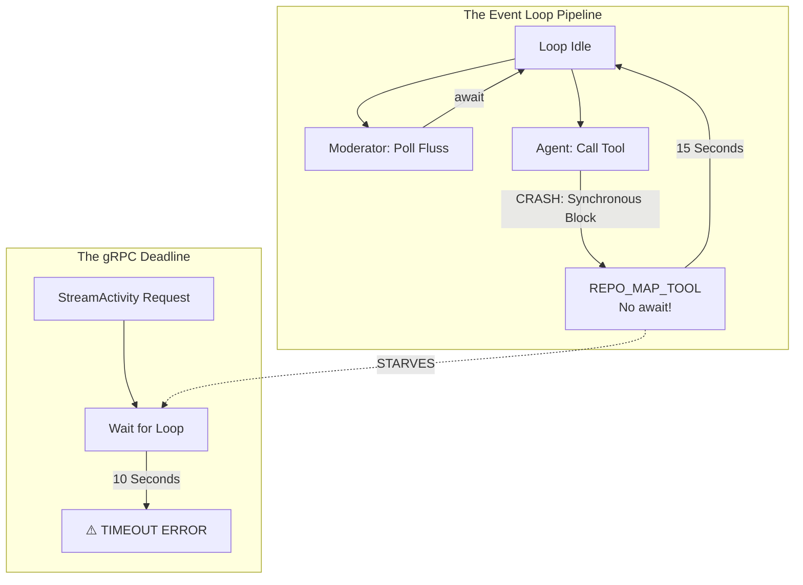

# Bug 1 Part 2: Async Starvation & The "Stall" of 2026

> **Status:** Detailed Architectural Critique  
> **Topic:** The `automation=0` paradox, Async-Await for Beginners, and the "Optimal Path"  
> **Context:** Setting `automation=0` causes a perceived hang and subsequent `StreamActivity` errors.

---

## 1. The `automation=0` Paradox: Why Waiting is Hard

When you set `automation=0`, you are telling the **Moderator** (the brain) to enter a "reactive-only" state. In theory, this should use *fewer* resources. However, the system appears to "hang."

### The Theory of Async Waiting

In a "Speed of Light" architecture, waiting should be free. In `asyncio`, when a task calls `await`, it says: *"I am waiting for the network/disk. Please go work on someone else's task."*

In ContainerClaw, the moderator is constantly `await`ing Fluss batches:
```python
# moderator.py:213
batches = await FlussClient.poll_async(self.scanner, timeout_ms=500)
```

If the event loop is healthy, this "wait" is a micro-pause. But if the event loop is **starved** (blocked by an un-awaited task), the moderator can't even *check* if a human has sent a message. 

**The Hang:** You send a message via UI. The UI-bridge hits `ExecuteTask`. The `AgentService` tries to wake up the moderator. But if the loop is already frozen by a synchronous `RepoMapTool` or `SurgicalEditTool` call from *another* process or a previous session, your `automation=0` moderator never gets the signal.

---

## 2. Async-Await: A First-Principles Deep Dive

If you are new to async-await, think of a **Restaurant Kitchen** with one Chef (the CPU core) and many Orders (the Tasks).

### The Synchronous Model (Threaded)
You hire 10 Chefs. Each Chef takes one Order and stands in front of the Grill. If the steak takes 10 minutes to cook, that Chef **stands still** for 10 minutes. 
- **Pros:** Easy to understand. 
- **Cons:** Expensive. If you have 100 orders, you need 100 chefs. If you only have 10 chefs, order #11 waits 10 minutes just for a chef to become available.

### The Asynchronous Model (Single Loop)
You hire **One Master Chef**. She puts the steak on the grill, **sets a timer**, and immediately moves to chop onions for a different order. When the timer dings (the `await` finishes), she returns to the steak.
- **Pros:** Hyperefficient. One chef can handle 100 orders because most of the time is spent "waiting on the grill."
- **Cons:** If the Master Chef spends 20 minutes meticulously carving a radish garnish without looking up (a **Synchronous Block**), the steaks on the grill burn, the orders pile up, and the restaurant "hangs."

**Our Bug:** ContainerClaw's tools are like that "radish garnish." `RepoMapTool` is carving a garnish (traversing files) while the `StreamActivity` (the steak) is burning.

---

## 3. Where We Are: The "Bridge of Sighs"

The reason we are "not better designed" is that we are in a **Hybrid State**. 

- **The UI Bridge** is Synchronous (Flask).
- **The gRPC Server** is Threaded (10 Chefs).
- **The Agent Heart** is Async (1 Master Chef).

When they meet, we use `run_coroutine_threadsafe`. This is like a Chef from a different kitchen (gRPC thread) shouting an order to our Master Chef (Async Loop) and waiting with a stopwatch. If the Master Chef doesn't look up within 10 seconds, the other Chef assumes the building is on fire and quits (`TimeoutError`).

### Why is it not better?
Because **Bridging Paradigms is Hard.** Most software is built entirely in one paradigm or the other. ContainerClaw is pushing the limits of **Fluss** (which is a high-speed Rust/C++ stream) and trying to glue it to **Gemini API** (which is a slow HTTP API) and **Local Filesystem** (which is a synchronous OS resource).

---

## 4. The Optimal Path: "Async All The Way Down"

To achieve a resilient, idiosyncratic architecture that hits the speed-of-light limit, we must transition to **Pure Async Convergence**.

### Step 1: The "Thread-Off" (Immediate Fix)
We must treat the CPU and the Disk as "External Devices." Every time we touch a file, we must use `asyncio.to_thread`.
> *"Chef: I need onions. Sous-Chef: I'll go chop them in the other room. Chef: Great, tell me when they're done, I'll go work on the soup."*

### Step 2: Native Stream Iterators
We should replace `poll()` with `async for record in scanner:`. 
In this model, the system becomes a **Reconciliation Loop**. The moderator stops "asking" for data and starts "reacting" to a continuous flow.

### Step 3: High-Precision Monitoring
We need a "Watchdog" task that monitors the loop's latency. If a tool blocks the loop for more than 50ms, it should emit a warning. A 10s block should be impossible.

---

## 5. Visualizing the Stall



**Conclusion:** The "optimal path" is a system where the **Event Loop never stops spinning**. The moment it stops, the MAS loses its "consciousness" and becomes a series of disconnected, failing RPC calls. 

We are currently in a state where we have a very fast backbone (Fluss) but a "heavy" nervous system. The refactor outlined in `state_of_code_pt2.md` is the surgery required to make the nerve pulses move at the speed they were meant to.
