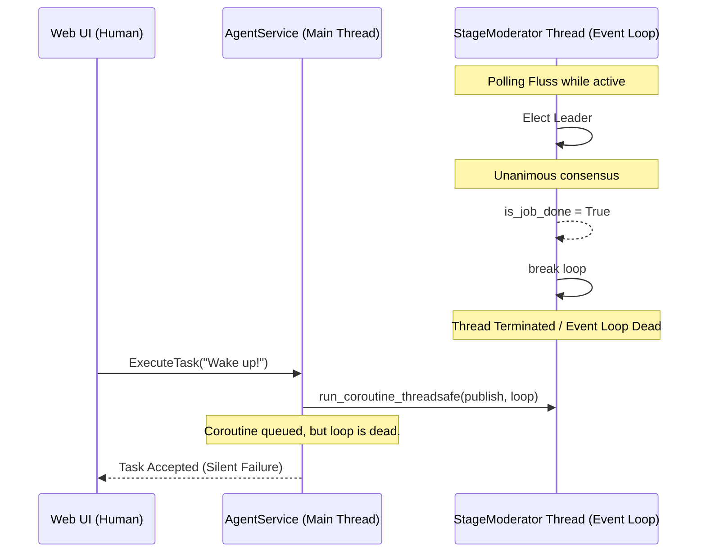
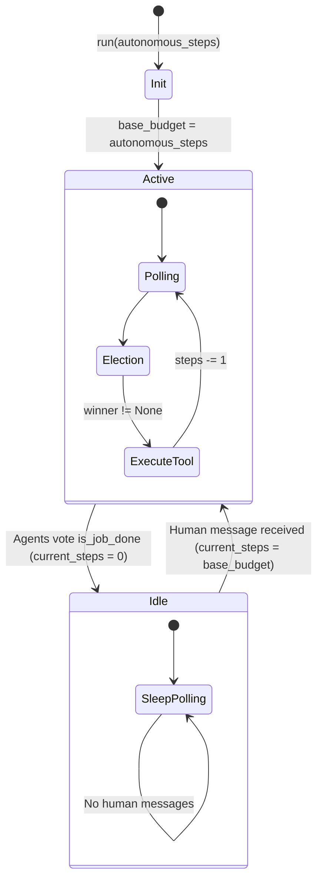

# ContainerClaw Architecture Review: Multi-Agent Completion & Resumption

## 1. Abstract
This document provides a rigorous system design and architectural review of the multi-agent task completion and resumption mechanism in ContainerClaw. Currently, when the agent cluster unanimously votes that a job is complete, they halt all activities. However, subsequent human interactions fail to restart the cluster. This review analyzes the root cause of this failure—a thread termination issue within the asynchronous event loop—and proposes a mathematically robust and system-aligned fix utilizing an "Idling vs Active" state machine and the "Baseline Capture" pattern to cleanly support task resumption.

## 2. Root Cause Analysis

### 2.1 Current Architecture & Flaw
The agent backend is orchestrated by an `AgentService` gRPC server (`agent/src/main.py`) running on the main thread. During initialization, it spawns a dedicated background thread to run the `StageModerator` asynchronous event loop:

```python
# From agent/src/main.py
self.loop = asyncio.new_event_loop()
threading.Thread(target=self._run_moderator_thread, daemon=True).start()

def _run_moderator_thread(self):
    asyncio.set_event_loop(self.loop)
    # ...
    self.loop.run_until_complete(self.moderator.run(autonomous_steps=autonomous_steps))
```

Within `moderator.py`, the `run()` function drives the entire autonomous loop via a `while True:` structure that continuously polls the Fluss log for new events. When the election subroutine returns `is_job_done == True` (meaning all agents voted to conclude the task), the `run()` function executes a `break` statement:

```python
# From agent/src/moderator.py
if is_job_done:
    print("🎉 [Moderator] Job is complete! Terminating the multi-agent loop.")
    await self.publish("Moderator", "Consensus: Task Complete.", "finish")
    break  # <--- METALLIC FLAW
```

### 2.2 The Subsystem Collapse
1. **Loop Termination:** The `break` statement immediately unrolls the `while True` loop and returns from the `run()` function.
2. **Thread Death:** Because the top-level coroutine (`moderator.run()`) has concluded, `self.loop.run_until_complete()` returns. The dedicated background thread reaches the end of its function scope and terminates.
3. **Ghost Queueing:** The gRPC server remains alive on the main thread. When a human sends a new message, the `ExecuteTask` RPC method enqueues the publish coroutine to the original event loop:
   ```python
   future = asyncio.run_coroutine_threadsafe(
       self.moderator.publish("Human", request.prompt), 
       self.loop
   )
   ```
4. **Deaf System:** Since the thread managing `self.loop` has died, the queued `publish` coroutine is never executed. The system silently ignores human input, requiring a full container restart to restore functionality.

### 2.3 Visualizing the Failure


## 3. Proposed Fix & Architectural Strategy

### 3.1 The Design Shift from "Termination" to "Idling" with Baseline Capture
Instead of treating task completion as a terminal lifecycle event for the moderator, we must treat it as a **state transition into an IDLE state**. Furthermore, relying on standard function arguments to stay constant lacks flexibility, and hardcoding defaults removes configurability. The most elegant fix leverages the **Baseline Capture** pattern.

By capturing the initial intended budget (`base_budget = autonomous_steps`) at the start of the `run` method, we ensure the `StageModerator` remembers its original configuration even after agents have spent their steps and idled. The loop should never break; instead, when `is_job_done` is achieved, the active operational budget (`current_steps`) drops to `0`. This bypasses the LLM processing gateway, leaving the system purely polling for events until a human interrupts, which directly resets the budget to the cleanly captured baseline.

### 3.2 Proposed Code Modifications

**Target File:** `agent/src/moderator.py`
**Target Location:** `async def run(...)`

_Proposed Edit:_
```python
async def run(self, autonomous_steps=0):
    # 1. Capture the "baseline" budget at entry
    # This keeps a record of the original intent (e.g., -1 for inf, 5 for limited)
    base_budget = autonomous_steps
    
    await self._replay_history()
    self.scanner = await self.table.new_scan().create_record_batch_log_scanner()
    self.scanner.subscribe(bucket_id=0, start_offset=self.last_replayed_offset)

    # ... [Init Logging] ...

    # Use the captured baseline for the initial state
    current_steps = base_budget if self.last_replayed_offset > 0 else 0

    while True:
        poll = await asyncio.to_thread(self.scanner.poll_arrow, timeout_ms=500)
        human_interrupted = False

        if poll.num_rows > 0:
            df = poll.to_pandas()
            for _, row in df.iterrows():
                # ... [History Dedup Logic] ...

                if row['actor_id'] == "Human":
                    print(f"📢 [Human said]: {row['content']}")
                    human_interrupted = True
                    # 2. Reset to the CAPTURED baseline, not a hardcoded default
                    current_steps = base_budget 
                    print(f"🔄 [Moderator] Human detected. Resetting budget to {base_budget} steps.")

        if human_interrupted or (current_steps != 0):
            # ... [Election Logic] ...

            if is_job_done:
                print("🎉 [Moderator] Job complete! Idling...")
                await self.publish("Moderator", "Consensus: Task Complete.", "finish")
                # 3. Transition to IDLE by exhausting current_steps without breaking
                current_steps = 0
                continue 

            # ... [Execution Logic] ...

        await asyncio.sleep(1)
```

### 3.3 How it Solves the Problem
By replacing `break` with the baseline capture and idling flow:
1. **Event loop remains alive:** The `while True:` loop immediately cycles back to pulling from the `scanner.poll_arrow()`.
2. **Resource efficiency:** Since `current_steps == 0` and `human_interrupted == False`, the complex inner block governing LLM calls and elections is skipped. The agent cluster idles gracefully, consuming near-zero CPU and waiting solely on Fluss IO.
3. **Immutability of Intent:** We decouple the initial configuration from runtime state. Even as `current_steps` drains to zero, the intent template is safe in `base_budget`.
4. **Support for "Infinite" Mode:** If `autonomous_steps = -1`, resetting to `-1` when a human interrupts correctly puts the system back into an infinite loop. 

### 3.4 Visualizing the State Transition
The core logical structure transforms from a linear, terminal flow to a true State Machine:



## 4. Rigorous Defense of the Code Changes

1. **Stateless Recovery:** Because the "memory" of the original execution budget securely lives inside the moderator's process lifecycle, we are not required to persist `base_budget` values out to a database or external cache.
2. **Safety:** Replacing `break` with `continue` alongside state management does not introduce infinite execution loops. The condition gating the LLM (`if human_interrupted or (current_steps != 0)`) reliably prevents autonomous loops without explicit human directives.
3. **Architectural Alignment:** This refactor keeps the system purely event-driven. The agent lifecycle runs parallel directly with the container's lifecycle.
4. **Future-Proofing for Prompt Execution:** Using a `base_budget` layout trivially allows future optimizations, such as intercepting commands in the human interrupt block (e.g., matching "Fix this, you have 10 tries") to dynamically update `base_budget` or `current_steps`.
