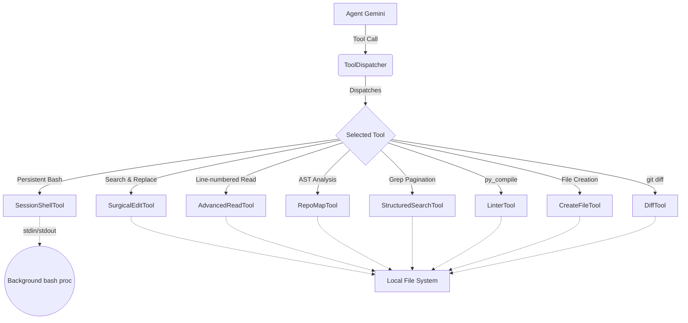

# Enhancing ContainerClaw Toolset for SWE-bench

## Overview

The ContainerClaw infrastructure requires enhanced agent tooling to handle large-scale codebases efficiently, overcoming traditional LLM context limitations and minimizing error rates during file modification and navigation. This document rigorously outlines the final system design, architecture, and implementation details for the "Lean" toolset optimized for SWE-bench:

1. `SessionShellTool` (Stateful Command Execution)
2. `AdvancedReadTool` (Line-Numbered Pagination)
3. `SurgicalEditTool` (Precise Search & Replace)
4. `CreateFileTool` (Safe File Creation)
5. `RepoMapTool` (AST-based Architectural Mapping)
6. `StructuredSearchTool` (Paginated Grep Wrapper)
7. `LinterTool` (Immediate Syntax Validation)
8. `DiffTool` (Verification of Changes)
9. `BoardTool` (Project Management)

These tools subclass the existing `Tool` interface in `agent/src/tools.py` and are designed to avoid truncation, context bloat, and statelessness—imperative requirements for complex environments like SWE-bench.

---

## Architectural Review & System Design

To prevent context-window blowouts and enable persistent, stateful navigation, the enhanced toolset bridges the gap between atomic operations and agent workflows.

### Design Principles and Rigorous Defenses

1. **Context Economy:** Sending a full 1,000+ line file back and forth to an LLM will guarantee truncation errors. `SurgicalEditTool` and `AdvancedReadTool` strictly restrict the data transfer to localized lines. By forcing unambiguous replacements (`count == 1`), `SurgicalEditTool` mathematically guarantees that edits apply accurately to the desired block, shifting the burden of verification to the tool runtime rather than the agent.
2. **State Context (Persistence):** Traditional naive shell execution (`asyncio.create_subprocess_shell` for every command) inherently loses state like `cd` or `export` parameters. The `SessionShellTool` introduces a long-lived `/bin/bash` process per agent. Commands are appended with an EOF delimiter (`echo "---DELIMITER---$?"`) to multiplex stdout/stderr, guaranteeing state continuity without external dependencies like `pexpect`.
3. **Pre-Flight Validation:** LLMs frequently produce code that contains latent compilation errors, squandering resources executing slow integration test suites. `LinterTool` acts as an immediate syntax gating mechanism (`py_compile`), shifting left the feedback cycle.
4. **Unified Environment:** To ensure that changes made during setup (like `pip install` or `export PATH=...` in `SessionShellTool`) are visible to verification tools, `DiffTool` and `TestRunnerTool` route their commands through the same persistent bash sessions. This guarantees that tests run in the identical virtualenv or environment context established by the agent.
5. **Architectural Skeleton Mapping:** `RepoMapTool` uses Python's static analysis `ast` rather than expensive token-level reading to emit highly condensed, structurally accurate skeleton maps. This gives LLMs an instantaneous "lay of the land", reducing hallucination on missing class dependencies.
6. **Tool Leanliness (Redundancy Pruning):** To prevent agents from reverting to "risky" but faster paths (like overwriting an entire file instead of using surgical edits), we have eliminated `ShellTool`, `FileReadTool`, and `FileWriteTool`. By providing exactly one "source of truth" for each capability—focused on stability and safety—the agent's policy is guided towards robust SWE-bench workflows.
7. **Resource Lifecycle Management (Cleanup):** Persistent background processes can quickly lead to zombie process leaks in a containerized environment. The `ToolDispatcher` implements a `cleanup()` hook that is automatically invoked by the `StageModerator` upon task completion (Consensus: Task Complete), ensuring all bash sessions are terminated cleanly.
8. **Token Guard & Adaptive Verbosity:** To prevent "context drift" in large-scale SWE-bench tasks, the `StageModerator` enforces a character-based history budget (proxied to ~120k tokens). Furthermore, it implements **Adaptive Verbosity**: read-heavy tools (`RepoMap`, `StructuredSearch`) are granted higher output quotas (8,000 chars) compared to execution tools, ensuring agents don't miss critical architectural details.
9. **Truncation Feedback (Agent Nudge):** When the `StageModerator` truncates a tool result to fit the context budget, it appends a distinct footer: `[TRUNCATED: Result too large...]`. This provides high-signal feedback to the agent, encouraging it to refine its search queries or use pagination (e.g., in `StructuredSearchTool`) rather than operating on partial data.
10. **Infrastructure Resilience (Retry Logic):** Autonomous loops are vulnerable to transient network failures or Gateway 503s. The `GeminiAgent` implements a 3-attempt retry loop with exponential backoff for all LLM calls. This "bulletproofs" the system against short-lived infrastructure hiccups, ensuring that long-running SWE-bench jobs are not prematurely terminated.

---

## Tool Implementations

### 1. SessionShellTool (Persistent Shell)
* **Goal:** Retains state environment across discrete tool calls.
* **Defense:** Replaces `ShellTool`. Standard subprocess initialization destroys environment changes. The implementation maintains a background bash pipe per agent. Delimiters capture precise exit codes and capture "Lost Output" from unbuffered runs. To support heavy operations (like `pip install`), the timeout is increased to a default of 60s and made explicitly configurable by the agent for specialized setup tasks.

### 2. AdvancedReadTool (Line-Numbered Pagination)
* **Goal:** Target-specific reading with prepended lines.
* **Defense:** Replaces `FileReadTool`. Line numbers act as immutable coordinates, preventing the agent from getting "lost" in large files and ensuring token economy through pagination.

### 3. SurgicalEditTool (Search & Replace)
* **Goal:** A context-safe file editor.
* **Defense:** Replaces `FileWriteTool` for modifications. Enforces exact replacements, defeats the "Line-Ending Clobber", and prevents "file nuking" truncation errors. To handle legacy repositories, it utilizes a fail-over encoding strategy (UTF-8 with a Latin-1 fallback).

### 4. CreateFileTool (Safe File Creation)
* **Goal:** Create new modules safely.
* **Defense:** Explicitly fails if the target file exists, preventing accidental overwrites of existing logic. Agent policy dictates that `create_file` is reserved for initialization, while `surgical_edit` remains the sole sanctioned tool for modifying established codebases.

### 5. RepoMapTool (AST Skeleton)
* **Goal:** Overview without the body.
* **Defense:** Provides a condensed directory map using `ast.NodeVisitor` to eliminate the "Indentation Mirage", ensuring methods are nested accurately under classes.

### 6. StructuredSearchTool (Paginated Grep)
* **Goal:** A wrapper for `grep` preventing "grep bombs".
* **Defense:** Paginates results and uses the `-m 500` constraint to resolve "Inefficiency at Scale".

### 7. LinterTool (Syntax Pre-flight)
* **Goal:** Immediate AST check.
* **Defense:** Provides millisecond-latency feedback via `py_compile` to catch syntax errors before test execution.

### 8. DiffTool (Git Verification)
* **Goal:** Sanity check using `git diff`.
* **Defense:** Allows agents to verify their own surgical edits before commit/test, providing a critical "loop of verification".

---
*Draft document completed by ContainerClaw Infrastructure System generation.*
