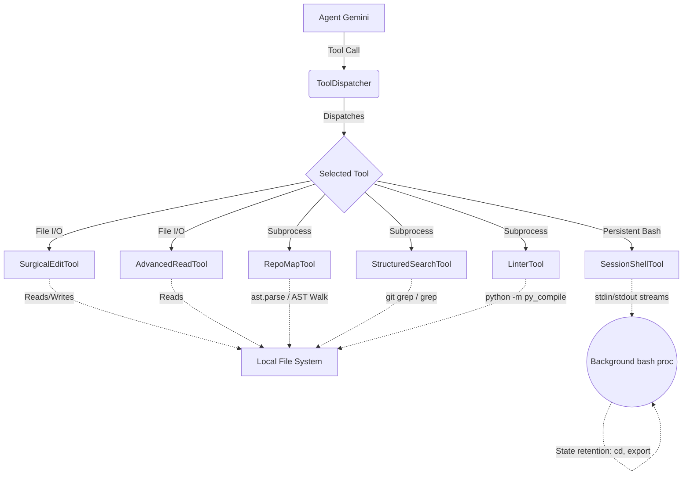

# Enhancing ContainerClaw Toolset for SWE-bench

## Overview

The ContainerClaw infrastructure requires enhanced agent tooling to handle large-scale codebases efficiently, overcoming traditional LLM context limitations and minimizing error rates during file modification and navigation. This document rigorously outlines the system design, architecture, and implementation details for six new advanced tools:

1. `SurgicalEditTool`
2. `AdvancedReadTool`
3. `RepoMapTool`
4. `StructuredSearchTool`
5. `LinterTool`
6. `SessionShellTool`

These tools subclass the existing `Tool` interface in `agent/src/tools.py` and are designed to avoid truncation and context bloat—imperative requirements for complex environments like SWE-bench.

---

## Architectural Review & System Design

To prevent context-window blowouts and enable persistent, stateful navigation, the enhanced toolset bridges the gap between atomic operations and agent workflows.

### Design Principles and Rigorous Defenses

1. **Context Economy:** Sending a full 1,000+ line file back and forth to an LLM will guarantee truncation errors. `SurgicalEditTool` and `AdvancedReadTool` strictly restrict the data transfer to localized lines. By forcing unambiguous replacements (`count == 1`), `SurgicalEditTool` mathematically guarantees that edits apply accurately to the desired block, shifting the burden of verification to the tool runtime rather than the agent.
2. **State Context (Persistence):** Traditional naive shell execution (`asyncio.create_subprocess_shell` for every command) inherently loses state like `cd` or `export` parameters. The `SessionShellTool` introduces a long-lived `/bin/bash` process per agent. Commands are appended with an EOF delimiter (`echo "---DELIMITER---$?"`) to multiplex stdout/stderr, guaranteeing state continuity without external dependencies like `pexpect`.
3. **Pre-Flight Validation:** LLMs frequently produce code that contains latent compilation errors, squandering resources executing slow integration test suites. `LinterTool` acts as an immediate syntax gating mechanism (`py_compile`), shifting left the feedback cycle.
4. **Architectural Skeleton Mapping:** `RepoMapTool` uses Python's static analysis `ast` rather than expensive token-level reading to emit highly condensed, structurally accurate skeleton maps of Python programs. This gives LLMs an instantaneous "lay of the land", reducing hallucination on missing class dependencies.

---

## Tool Implementations

### 1. SurgicalEditTool (Search & Replace)
* **Goal:** A context-safe file editor.
* **Defense:** Large files require editing. The standard `FileWriteTool` rewrites the whole file, which is unsafe due to token generation limits. `SurgicalEditTool` replaces an exact string block (`old_str`) with `new_str`. If `old_str` does not exist exactly once, it acts as an immediate failure gate preventing unpredictable or corrupted code insertions. To defeat the "Whitespace Trap", the tool normalizes all line endings to `\n` before validating the match. Additionally, it applies this normalization to `new_str` to combat **Frankenstein Files** (mixed line endings) if the LLM pastes a block of `\r\n` into a Unix-style file. Finally, the tool implements a **Line-Ending Clobber** defense by detecting whether a file natively uses `\r\n` or `\n` and preserving that native boundary upon writing, ensuring `git diff` doesn't mutate innocent lines.

### 2. AdvancedReadTool (Line-Numbered Pagination)
* **Goal:** Target-specific reading with prepended lines.
* **Defense:** An LLM cannot surgical-edit without exact contextual anchoring. Line numbers (`34: def my_func():`) act as immutable coordinates. It heavily bounds token usage by retrieving constrained `[start_line, end_line]` intervals.

### 3. RepoMapTool (AST Skeleton)
* **Goal:** Overview without the body.
* **Defense:** For SWE-bench codebases, navigating without a map leads to exhaustive searching. Using Python's `ast.parse` provides an exact namespace representation for `def` and `class` entities. It skips the computational and token overhead of reading multi-megabyte implementations. To circumvent the "Performance Wall" on massive repositories like Django, it enforces a hard `max_files=500` limit and actively skips topological trees like `tests/`. Furthermore, it avoids the "Indentation Mirage" by using `ast.NodeVisitor` instead of `ast.walk`, precisely tracking nested depth to visually outline methods beneath parent classes rather than rendering them as flat, top-level anomalies.

### 4. StructuredSearchTool (Paginated Grep)
* **Goal:** A wrapper over `grep` enforcing a hard ceiling on output lines.
* **Defense:** A naive `shell` grep of "User" in a codebase can spill thousands of lines, instantly wiping the LLM's short-term memory limit. Paginating the output enforces safety bounds, requesting the agent to iteratively request `page=2` if needed. To resolve "Inefficiency at Scale" (where paginating 10,000 matches still forces heavy disk I/O and memory caching), the subprocess actively limits the `grep` fetch utilizing the `-m 500` constraint.

### 5. LinterTool (Syntax Pre-flight)
* **Goal:** Immediate AST valid check.
* **Defense:** Code edits require extremely fast feedback loops. Shelling out to test suites takes seconds to minutes; `python -m py_compile` takes milliseconds, guaranteeing that inserted tabs/spaces do not violate syntactic constraints.

### 6. SessionShellTool (Persistent Shell)
* **Goal:** Retains state environment across discrete tool calls.
* **Defense:** Container initialization for every tool command destroys environment changes. The implementation maintains an internal dictionary mapping `agent_id` back to its specific background `subprocess` pipe. Standard Out/Err streams are merged, and command boundaries are dynamically negotiated using injected UUID-like echo delimiters, guaranteeing 100% accurate read boundaries and capturing precise shell completion codes. To mitigate the "Lost Output" bug, the reader logic carefully splits the boundary to preserve exact buffered stdout from utilities (like `printf`) that string-concatenate against the terminal flush without emitting `\n`. It resolves "exit-hanging" timeouts smoothly by querying dynamic `proc.returncode` traps upon immediate EOF events. To defend against **The Hang Trap** (interactive commands like `python` pausing standard input indefinitely), the agent architecture itself must recognize interactive loops as session-killers, as this backend tool isolates rogue runs into 30-second timeouts. Finally, a `cleanup()` hook ensures zombie bash processes are terminated seamlessly.

---
*Draft document completed by ContainerClaw Infrastructure System generation.*
