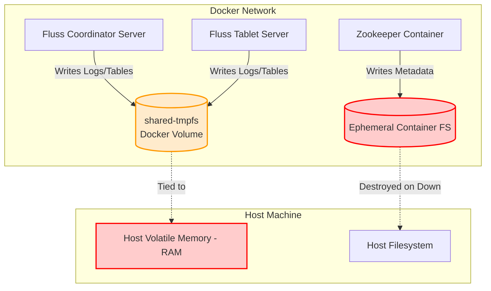
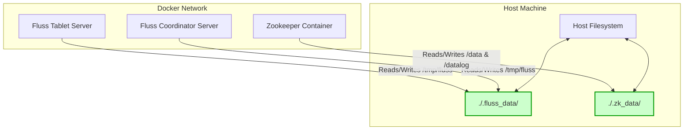

# Architectural Review: Shifting from Ephemeral to Persistent Data Storage

## 1. Executive Summary: The Permanence Problem
Currently, ContainerClaw suffers from "amnesia" when a session is spun down using `claw.sh down`. All chat history and corresponding agent states vanish entirely upon container termination or restart.

This behavior stems from two explicit configuration choices in the existing `docker-compose.yml`:
1. **Fluss Ephemeral Storage**: Apache Fluss is configured to write its data blocks to a volume named `shared-tmpfs`. This volume relies on a `tmpfs` local driver which maps entirely to volatile host RAM.
2. **Zookeeper Container Immutability**: Zookeeper is responsible for cluster state and coordinate metadata. Currently, no bound volumes exist for Zookeeper, meaning its internal state is completely destroyed when the container is taken offline.

When `claw.sh down` stops the processes, Docker natively flushes the RAM-disk (`tmpfs`) and deletes the temporary container storage backing Zookeeper. To achieve chat persistence, we must transition the storage backend to rely on the host's physical hard drive using **Bind Mounts**.

---

## 2. Architectural Paradigm Shift

The below diagrams illustrate the mechanics of how data is currently lost, and how the proposed persistent bind mount architecture resolves the problem.

### 2.1 Current Ephemeral Architecture (How data is lost)


### 2.2 Proposed Persistent Architecture (How data is retained)


---

## 3. Exhaustive Defense of Code Changes

To transition from ephemeral to persistent storage, highly specific changes must be implemented in both infrastructure definitions (`docker-compose.yml`) and operational wrappers (`claw.sh`).

### 3.1 Docker Compose Modifications

#### A. Zookeeper Persisted Volumes
Zookeeper acts as the master coordinator for Apache Fluss. Without its metadata, Fluss's underlying table logs cannot be discovered or interpreted correctly upon startup.
```yaml
# In Zookeeper Service definition
    volumes:
      - ${PROJECT_DIR:-.}/.zk_data/data:/data
      - ${PROJECT_DIR:-.}/.zk_data/datalog:/datalog
```
**Defense**: We map `/data` (where the snapshots are kept) and `/datalog` (where the transaction logs are kept) to local host paths inside `.zk_data`. This guarantees that Zookeeper survives a full container destruction.

#### B. Fluss Persistent Volumes & tmpfs Removal
Both the Coordinator and Tablet servers rely on writing internal streams and tables to the storage path `/tmp/fluss`. Currently, this is mapped to a `tmpfs` driver at the bottom of the compose file, which is actively harming persistence.
```yaml
# In both Coordinator and Tablet Server definitions
    volumes:
      - ${PROJECT_DIR:-.}/.fluss_data:/tmp/fluss

# Remove the shared-tmpfs volume block entirely
# volumes:
#   shared-tmpfs:
#     driver: local
#     ...
```
**Defense**: By pointing both Fluss services to a singular `.fluss_data` directory hosted on the physical hard drive, the data segment survives container stoppage. The removal of the `shared-tmpfs` block eliminates the possibility of memory exhaustion and memory resets.

#### C. Why Bind Mounts over Docker Named Volumes?
While Docker "Named Volumes" (e.g. `zookeeper_data:/data`) are theoretically cleaner for abstracted deployments, **Bind Mounts** (mounting literal host directories) are vastly superior for developer CLI toolkits like `claw.sh`. 

Bind mounts allow `claw.sh` to handle explicit lifecycle operations via simple bash commands (i.e. `rm -rf .fluss_data`). If we used Named Volumes, `claw.sh` would need to execute complex `docker volume rm` commands which require ensuring all containers are entirely down, running the risk of stale, orphaned volumes silently accumulating on the user's hard drive.

### 3.2 Operating Environment (claw.sh) modifications

Because we are bypassing standard ephemeral destruction routines on container spin-downs, the `.zk_data` and `.fluss_data` files will survive a simple `./claw.sh down`. To ensure the environment can still be wiped when a user explicitly runs a `purge`, the CLI tool must manually delete the physical directories we bound.

```bash
  purge)
    echo "Purging state for session: $SESSION_ID"
    rm -rf ".claw_state/$SESSION_ID"
    rm -rf ".fluss_data"  # New Addition
    rm -rf ".zk_data"     # New Addition
    echo "State cleared."
    ;;
```
**Defense**: The `purge` command is the designated clean-slate command. With persistent directories lying on the host machine, we are forced to explicitly invoke directory tree deletions to revert back to a Day 0 state. 

---

## 4. Future System Considerations (Session Scoping)

The changes defined above successfully guarantee that state **survives** between Docker sessions. However, once historical chat data is fully persistent, the application must contend with "rejoining" old sessions effectively. 

Currently, all chat interaction flows through the existing UI and agent logic in a single streaming context. The following must be addressed in subsequent lifecycle phases:

1. **Fluss Schema Updates**: The streaming tables must be updated to inherently trace messages via a `session_id` UUID attribute. This introduces multi-tenancy logic to the data persistence layer.
2. **UI & UX Navigation**: The frontend web application must offer features akin to modern LLM interfaces (e.g., ChatGPT's left sidebar) to toggle between distinct session histories.
3. **Agent State Hydration**: Agents spinning up in existing `/workspace/` directories with historical `.claw_state` files must cleanly deserialize and hydrate their working memory using the matched `session_id` retrieved via the UI.
