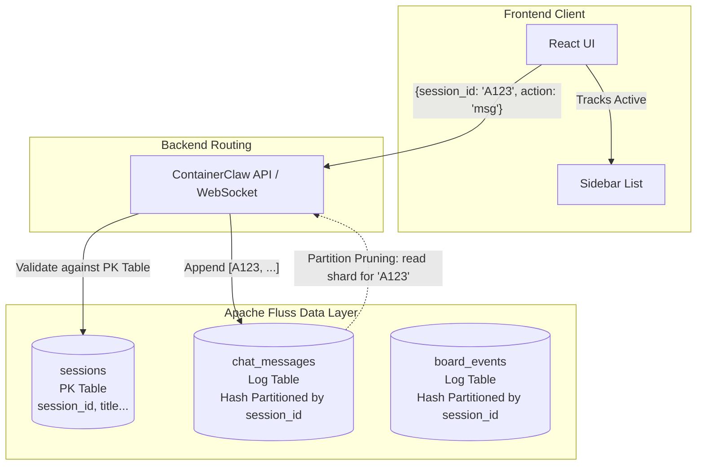
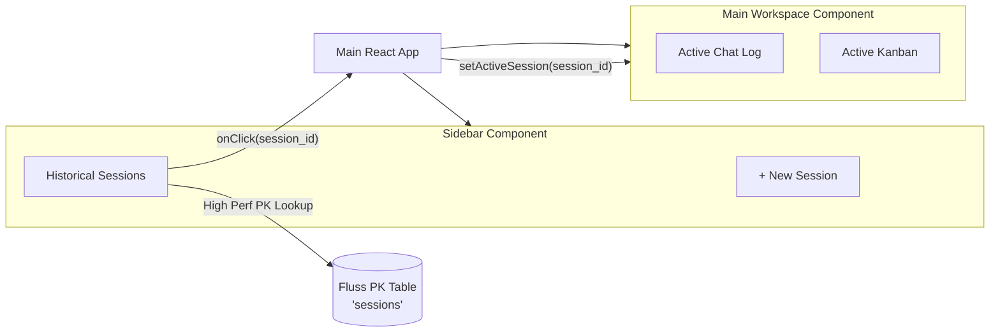
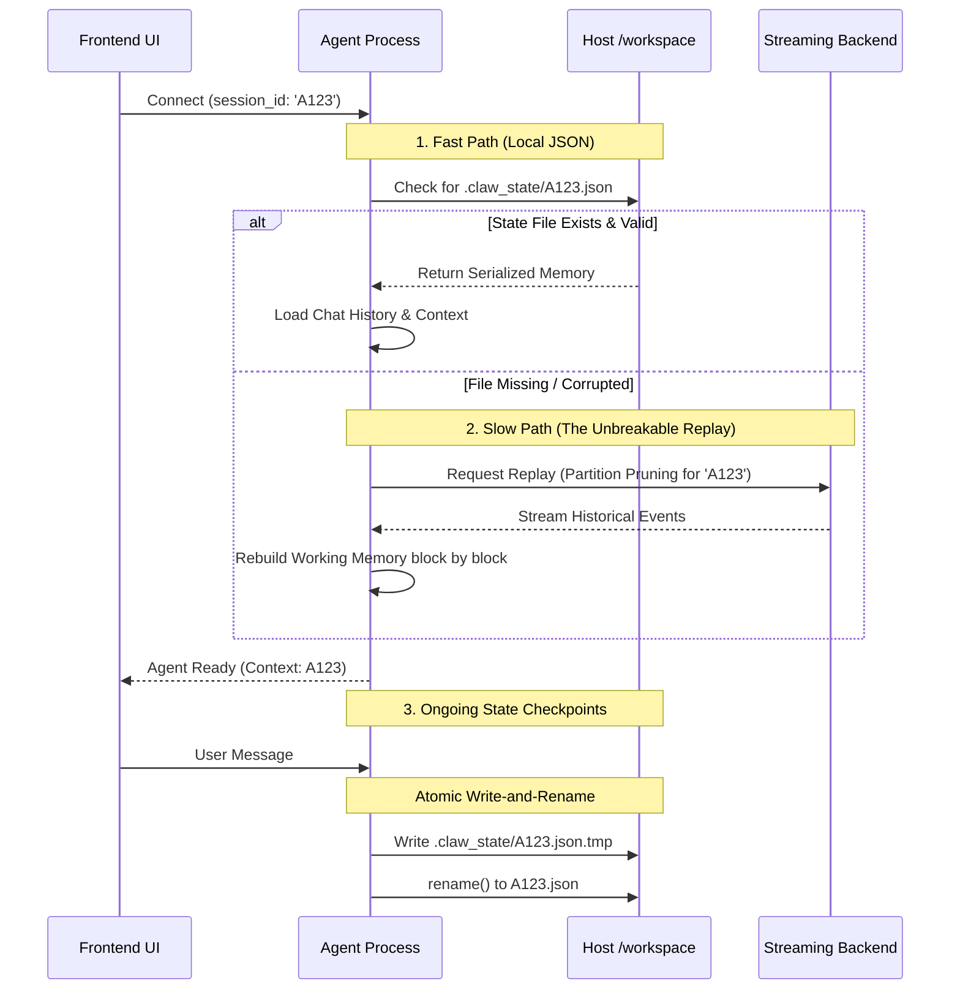

# Architectural Review: Multi-tenancy and Session Resumption

## 1. Executive Summary
Building upon the persistent storage infrastructure implemented in Phase 12, ContainerClaw now successfully retains data across container restarts. However, the application currently represents a single, continuous stream of interaction. To evolve into a robust developer workspace, ContainerClaw must support distinct, isolated chat sessions. 

This document outlines the architectural overhaul required to implement "Session Resumption." This involves introducing a robust "Session Registry" pattern at the data layer, building a session management interface in the frontend UI, and re-architecting the Agent to hydrate its context safely and efficiently based on the active session selected by the user.

---

## 2. Multi-Tenant Data Architecture (Fluss Schema Updates)

### 2.1 The Problem
In the current Fluss schema, messages and project board events are simply appended to global tables. When the Agent process attempts to replay state from Fluss, it blindly reads every record from offset zero. Without differentiation, two unrelated debugging sessions would collapse into one chaotic chat history. Additionally, dynamically fetching a massive list of unique sessions requires heavy table scans.

### 2.2 System Design: The "Session Registry" Pattern
To achieve isolated workspaces and scalable data access, we will implement a dedicated Session Metadata Table within Fluss, establishing the backend as the indestructible source of truth.

### 2.3 Required Code Changes & Defense
- **Registry Table (`sessions`)**: Introduce a Fluss **Primary Key (PK) Table**.
  - **Schema**: `session_id (PK)`, `title`, `user_id`, `created_at`, `last_active_at`.
  - **Purpose**: Serves as the global "Card Catalog." The UI queries this table to render the sidebar. This ensures session titles and metadata are portable across devices and survive local browser cache wipes.
- **Data Tables (`chat_messages` / `board_events`)**: Configure as Fluss **Log Tables**.
  - **Strategy**: Leverage **Hash Partitioning** by `session_id`.
  - **Purpose**: By using a fixed number of physical partitions (e.g., 16 or 32), we prevent "Partition Bloat" while ensuring that all data for a specific session is co-located for rapid hydration.
- **Scalable Discovery & Pruning**: 
  - **Discovery**: The UI no longer "scans" logs for sessions. It performs a high-performance PK lookup on the `sessions` table.
  - **Pruning**: The Agent utilizes **Partition Pruning**. Because the log table is hashed by `session_id`, the `record_batch_log_scanner` only hits the specific shard containing that session's data, ignoring ~95% of irrelevant network/IO traffic.

---

## 3. UI & UX Navigation (Frontend Lifecycle & Handshake)

### 3.1 The Problem
Currently, the ContainerClaw frontend acts merely as a single-page terminal equivalent. Users have no graphical means to review past work, switch contexts, or spin up a "new" chat. Previous plans to use `localStorage` for indexing are brittle and device-dependent.

### 3.2 System Design
The UI must shift to a master-detail layout paradigm, powered entirely by the backend Session Registry.

### 3.3 Required Code Changes & Defense
- **Session State Management**: Introduce a global `activeSessionId` state variable at the root level of the frontend application.
- **Handshake Validation**: Upon WebSocket connection, the backend validates the `session_id` against the `sessions` PK table. If invalid or unrecognized, the connection is rejected before any LLM context is loaded.
- **Clean Context Swaps**: A "Session Switch" in the UI triggers a **total tear-down** of the current Agent instance. The new backend instance performs a fresh Two-Tier Hydration (JSON load → Fluss Log catch-up), physically preventing across-session memory contamination.

---

## 4. Crash-Proof Agent State Hydration

### 4.1 The Problem
With persistent storage configured on the host machine, an Agent might be spun up into a `/workspace/` directory that contains hours of previous interactions from multiple distinct sessions. If the Agent crashes mid-save or experiences disk I/O interruption, the `.claw_state` memory could become corrupted irrecoverably.

### 4.2 System Design
The Agent's lifecycle must be fundamentally tied to the active session, implementing three layers of defense to guarantee persistence survives crashes.

### 4.3 Required Code Changes & Defense
- **Namespaced State Files**: The Agent's state saving mechanism must target `.claw_state/<session_id>.json` rather than a singular global file.
- **Atomic State Saves**: When the Agent checkpoints to `.claw_state/<session_id>.json`, it must use an **Atomic Write-and-Rename** strategy (Write to `.tmp` → `rename()`). This prevents a crash mid-save from leaving a corrupted, unreadable JSON file.
- **Two-Tier Hydration Logic**:
  1. **Fast-path**: Attempt to `json.load()` the session-specific state file to instantly restore LLM context and tool queues.
  2. **Slow-path (The "Unbreakable" Replay)**: If the JSON state file is missing or corrupted, the Agent falls back to the Fluss Source of Truth. It replays the specific `session_id` log from the partitioned stream to reconstruct the exact state of the Project Board and Chat History flawlessly.

---

## 5. Architectural Advantages

**Why this is the "Best" Approach:**
1. **Scalability:** You avoid the "Small File Syndrome" of creating thousands of physical partitions by utilizing Hash Partitioning for the backend log tables.
2. **Portability:** The user’s workspace metadata and titles follow them universally to any browser or machine via the backend-driven `sessions` PK registry.
3. **Durability:** The architecture provides three robust layers of defense: The live in-memory state, the Atomic JSON checkpoint, and the immutable Fluss event log.
