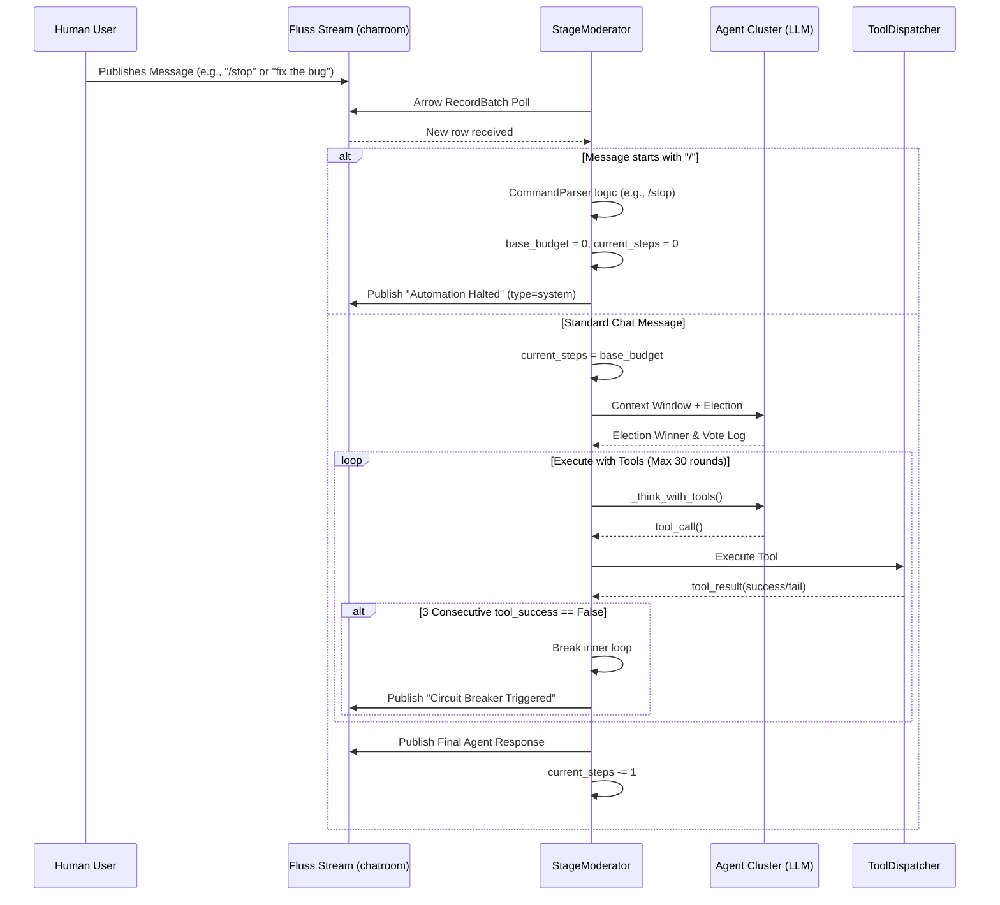

# Part 14: Analyzing Prompting and Action Loops & Mitigating Runaway Agent States

## 1. Current Architecture: Session Initialization and Event Flow

The ContainerClaw multi-agent system uses a strictly log-driven architecture built on top of Fluss streams. All interactions, whether from humans, agents, or internal system events, are mediated through these event streams.

### Startup and Initialization (`main.py`)
1. **Session Creation:** When a UI client initiates a chat, a `CreateSession` gRPC call writes a new session record into the `containerclaw.sessions` PK (now Log) table. 
2. **Moderator Bootstrapping:** `AgentService._get_moderator()` instantiates a `StageModerator` for the `session_id`. The moderator initializes the roster of Gemini Agents (Alice, Bob, Carol, David, Eve) and attaches the `ToolDispatcher` (ConchShell). It then runs its asyncio loop (`moderator.run(autonomous_steps)`).
3. **Fluss Replay:** Upon startup, `StageModerator._replay_history()` queries the `sessions` table for the session start time, then positions a Arrow RecordBatch scanner to read from `containerclaw.chatroom`. It reconstructs the `self.all_messages` in-memory context window sequentially.

### The Moderator Action Loop (`moderator.py`)
The `StageModerator` utilizes an asynchronous `while True` loop to act as the maestro:
1. **Poll Fluss:** Continuously polls the `chatroom` scanner.
2. **Event Detection:** If an `actor_id="Human"` event is detected, a state flag `human_interrupted` is fired, and `current_steps` is forcibly reset back to `base_budget` (the default autonomous step limit, often infinite or `5`).
3. **Trigger Phase:** As long as `current_steps > 0` or a human just spoke:
    - **Election:** The context window is passed to `elect_leader()`. The agents vote amongst themselves for 3 rounds or until consensus is reached, deciding who should speak next or if the job is complete.
    - **Execution (`_execute_with_tools`):** The winning agent is invoked. Utilizing the Gemini native function-calling protocol (force `ANY` mode), they enter a sub-loop capable of iterating up to `config.MAX_TOOL_ROUNDS` (30). They execute tools, read the `functionResponse`, and call more tools until they return a final text summary.
    - **Decrement Budget:** `current_steps` is reduced by 1.

---

## 2. Technical Debt: The "Echo Chamber" and Input Parsing Gaps

Our observations indicate two highly disruptive behavioral failures stemming from the current architecture.

### Issue A: The Runaway Echo Chamber
When agents encounter an ambiguous problem, they frequently trap themselves in endless cycles. 
- **The Execution Sub-Loop Vulnerability:** Inside `_execute_with_tools()`, an agent can execute up to 30 tool calls *per turn*. If `grep` or `pytest` fails repeatedly, the agent might blindly brute-force the tool without pausing to ask for human guidance.
- **The Election Loop Trap:** Even if the agent ends their tool phase, the outer loop continues as long as `current_steps > 0`. Since agents want to be helpful, they will continuously vote to keep trying. 

### Issue B: The Inverted Interrupt Logic (No /stop)
Currently, there is no command parser. If an agent goes rogue and the human frantically types `stop please!`, the system blindly ingests this message as `actor_id="Human"`.
- **The Core Bug:** `moderator.py` dictates that *any* human message resets the loop token budget: 
  `current_steps = base_budget`.
- If `base_budget` is `-1` (infinite), telling the agents to "stop" actually **keeps the loop running infinitely**. The agents read "stop please!", analyze it as an abstract conversational input, and continue trying to perform work.

---

## 3. Proposed Architectural Solution

To reclaim deterministic control over the agent clusters, we must introduce a **Command Interception Layer** and implement systemic **Circuit Breakers**. 

### 3.1. Command Intercept Layer (Bash-Style Directives)
We will introduce slash-commands processed natively by the `StageModerator` *before* they poison the context window. 

When `poll_arrow` reads a human message starting with `/`:
* `/stop`: Immediately forces `base_budget = 0` and `current_steps = 0`. The moderator halts the loop and publishes an `<action>` event: `[System] Autonomy halted by user.`
* `/automation=X`: Parses an integer, setting both `base_budget = X` and `current_steps = X`. This allows a human to grant the agents exactly `N` steps before they auto-pause.

These command events will still be injected into the LLM `all_messages` context window as `role="user"` since they are minimal. This ensures that when the page is refreshed, the `/stop` or `/automation` command appears seamlessly in the chat history at the exact timestamp it was issued, avoiding the need for complex filtering logic.

### 3.2. Circuit Breakers (Anti-Echo Mechanisms)
We will retain `config.MAX_TOOL_ROUNDS` at 30 to allow sufficient iterations for complex SWE tasks. However, the aforementioned circuit breaker (and the global `autonomous_steps` limit) will prevent agents from silently looping up to and over the 30-round limit without yielding.

### Mermaid Architectural Diagram

## 4. Rigorous Defense of Code Changes

1. **Why intercept commands at the Moderator level rather than `main.py` (gRPC)?**
   By intercepting commands after they are written to Fluss but before processing, we ensure the commands are permanently recorded in the immutable stream log. If we bounce the server, the replay logic can replay the `/automation=5` command and accurately restore the `base_budget`. Filtering at `main.py` would decouple state from the log.
2. **Why keep slash commands in the LLM context window?**
   While system control commands aren't strictly conversational, they are minimal. Filtering them out of `all_messages` while still rendering them in the UI would require diverging the frontend stream from the backend LLM context. Processing them natively as `actor_id="Human"` is an elegant workaround that avoids huge refactors and ensures that the UI and LLM state stay perfectly synchronized.
3. **Why use deterministic circuit breakers instead of LLM self-reflection?**
   When an LLM enters an echo chamber, its self-reflection becomes corrupted by its own poor assumptions. A hard Python integer counter guarantees that the loop will terminate, preserving tokens, avoiding target API rate-limits, and preventing terminal lockups.
