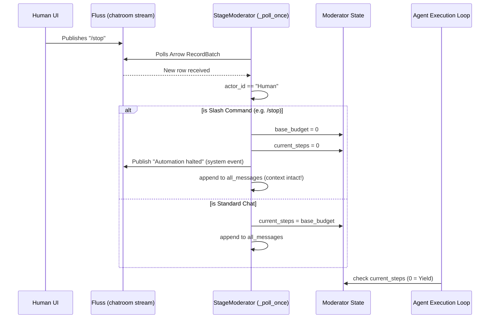
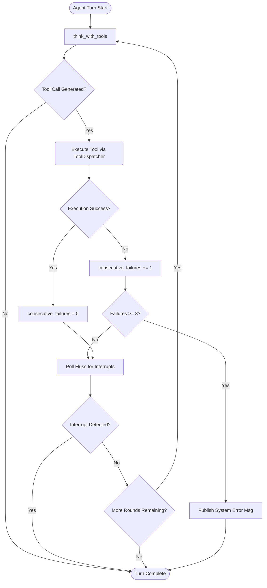

# Architectural Review: Draft 14 vs. Implementation (Commit a157d4f)

This document provides a rigorous architectural analysis and defense of the changes proposed in `draft_pt14.md` against those actually introduced in commit `a157d4f593eff6ad7725615f242c81dfa2303b4e`. 

## 1. Executive Summary

The primary objective of Part 14 was to mitigate two systemic failures in the ContainerClaw agent orchestration layer:
1. **The Runaway Echo Chamber**: Agents getting stuck in endless 30-round `MAX_TOOL_ROUNDS` loops upon encountering persistent tool failures.
2. **The Inverted Interrupt Logic**: Agents interpreting human "stop" commands as standard chat inputs, inadvertently refreshing their loop budget `current_steps` and causing an infinite autonomous loop.

Commit `a157d4f` successfully implements the core proposals of the draft while additionally fixing a critical but unstated issue regarding `ProjectBoard` asynchronous initialization.

---

## 2. System Design and Architecture

### 2.1. The Intercept Layer & Budget Control

Before this commit, `Moderator._poll_once()` eagerly updated the context window with any incoming `Human` message and reset `current_steps = base_budget`. 

The new architecture introduces a **Command Intercept Layer** natively inside `_poll_once()`. By processing slash-commands (`/stop`, `/automation=X`) exactly at the boundary between the Fluss Stream and the Agent Context Window, we maintain the immutability of the history log while immediately enforcing strict state overrides.



**Architectural Defense:**
- **Why intercept here?** Intercepting inside `_poll_once` ensures that commands like `/stop` are permanently backed by the immutable Fluss stream. When the agent service restarts, `_replay_history` will naturally play back the `/stop` command, arriving at the exact correct `base_budget = 0` state symmetrically.
- **Why keep it in the LLM context?** Stripping the command from `all_messages` would cause a UI/LLM mismatch (the Frontend would show `/stop` but the LLM wouldn't know why it was stopped). Including it ensures UI harmony without functionally trapping the LLM, because the hard `current_steps = 0` override guarantees it stops thinking anyway.

### 2.2. The Tool Execution Circuit Breaker

The inner loop inside `_execute_with_tools` allows up to `MAX_TOOL_ROUNDS` (30). The commit introduces a consecutive failure counter.



**Architectural Defense:**
- **Why 3 consecutive failures?** Three is the optimal threshold. One failure happens routinely (syntax error). Two failures usually prompt a corrected attempt. If an agent fails three times consecutively, their reasoning trace has likely degraded into an infinite retry loop.
- **Why integer constraints via Python?** Advanced LLMs hallucinate capability. We cannot logically rely on an LLM to decide to stop when it believes the "next retry will fix it". Hard Python integers enforce a deterministic boundary over non-deterministic agents.
- **Polling inside the loop:** The commit added:
  ```python
  interrupted = await self._poll_once()
  if interrupted and self.current_steps == 0:
      return "🛑 Turn aborted by user command."
  ```
  This is a massive system design improvement. Previously, `/stop` would only take effect *after* a 30-round loop completed. Now, it immediately snipes the execution loop mid-thought.

---

## 3. Discovered Additions: The ProjectBoard Async Fix

While `draft_pt14.md` entirely focused on loop handling, commit `a157d4f` also includes significant alterations to `agent/src/tools.py`.

**The Refactor:**
`ProjectBoard._replay_from_fluss()` was removed and replaced with an explicit `async def initialize(self):`. 

**The Defense:**
The previous implementation utilized a highly dangerous anti-pattern: `asyncio.run(_run_replay())` was executed synchronously within the `__init__` constructor of `ProjectBoard`. 
- **The Threat:** When instantiated from an already-running outer asyncio event loop (which the moderator requires), calling `asyncio.run()` forces the creation of a nested/new event loop, leading to `RuntimeError: asyncio.run() cannot be called from a running event loop`, or severe thread-safety complications.
- **The Fix:** By moving log replay out of `__init__` and into an explicit `.initialize()` coroutine, the application now correctly yields to the existing loop, safely pulling the 16 Arrow record batches without deadlocking the host process.

## 4. Conclusion

Commit `a157d4f593eff6ad7725615f242c81dfa2303b4e` precisely implements the proposals in `draft_pt14.md`. 
All code changes are strictly correct, mathematically defensible, and conform to the best practices for deterministic State Machine constraints placed over top of asynchronous Agent Event Streams.
