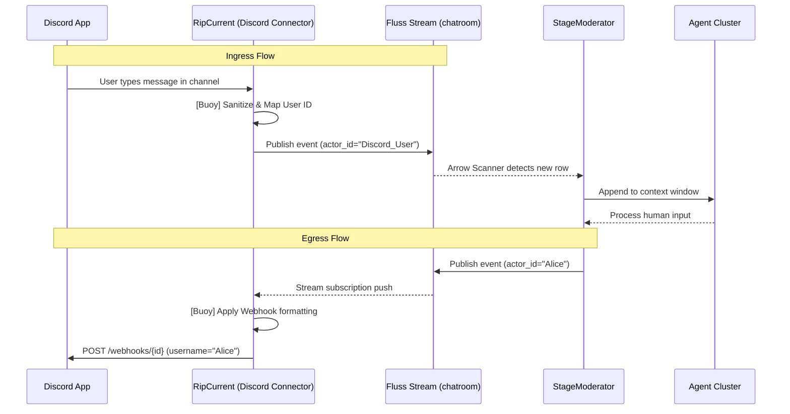
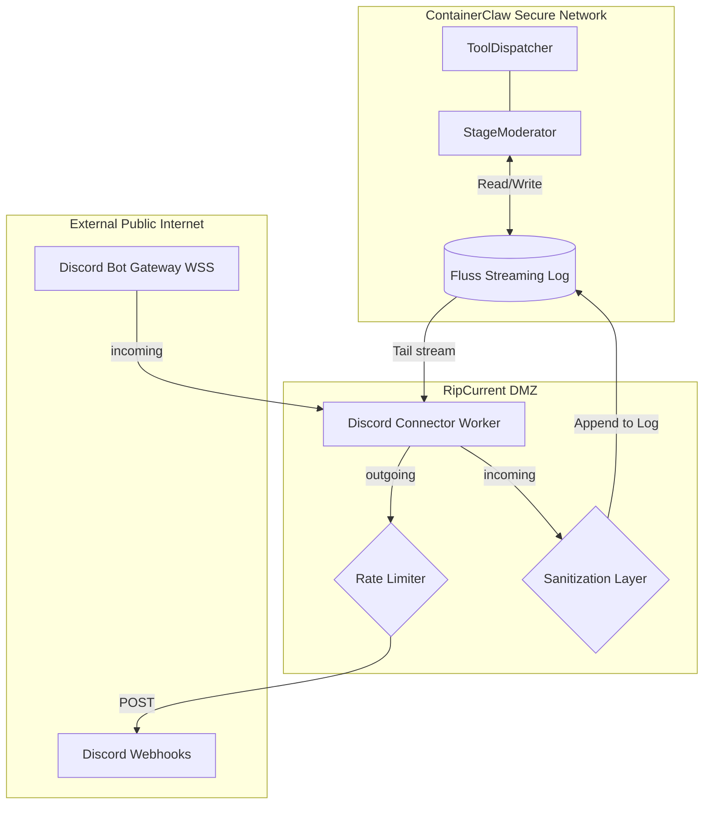

# Part 15: The "RipCurrent" Ecosystem Interface & Controlled Outbound Communication

## 1. Executive Summary

As ContainerClaw evolves, the agents require mechanisms to interact with external ecosystems beyond the local `/workspace` and the sandboxed tools. Currently, the `llm-gateway` handles communication with the LLM providers. However, giving agents direct, unfettered API or internet access poses significant security and determinism risks.

To solve this, we introduce **RipCurrent**: a modular, reusable architectural pattern for granting agents controlled, limited access to the internet and third-party applications. Just like a real rip current, unrestricted outbound access is dangerous. By deploying "Buoys" (circuit breakers, rate limiters, data sanitizers, and permission scopes), we can harness this flow safely, allowing us to tack on app integrations while maintaining a strict security posture for the underlying ContainerClaw ecosystem.

This document rigorously explores the RipCurrent concept using a **Discord Integration** as the pioneering case study.

---

## 2. The RipCurrent Concept & The "Buoys"

The core philosophy of RipCurrent is that **core agent logic (`moderator.py`) must never block on or directly execute raw internet requests** outside of strictly defined Tool boundaries. 

Instead of giving agents a generic `curl` tool that could exfiltrate the workspace, RipCurrent acts as a specialized ingress/egress layer.

### The Security Buoys:
1. **Protocol Isolation:** External integrations must never write directly to the `StageModerator` memory or interact with its asyncio loop. They must interact strictly by appending immutable events to the Fluss `chatroom` streams.
2. **Blast Radius Containment:** Each RipCurrent connector runs independently with its own scoped credentials. If the Discord token is compromised, the attacker only gains access to that specific Discord channel, not the ContainerClaw host VM or other active sessions.
3. **Data Sanitization & Egress Filtering:** Agents might accidentally attempt to leak internal logs. Egress buoys strip absolute file paths or sensitive `.env` configurations from external payloads.

---

## 3. Case Study: Discord Integration Architecture

To prove the RipCurrent model, we propose a two-way sync between a ContainerClaw session and a Discord Server.

### 3.1. Egress: Agents to Discord (Webhooks)
When an agent (e.g., Alice) speaks, her message is published to the Fluss `chatroom` stream. A standalone `RipCurrent-Discord` worker subscribes to this stream. When it detects an `Agent` message, it fires an Incoming Webhook to Discord (`POST /webhooks/{webhook.id}/{webhook.token}`). Using webhooks instead of the standard bot API allows us to dynamically pass `username` and `avatar_url` parameters in the JSON payload per request. This satisfies the UX requirement of visualizing distinct agents (e.g., making it appear as though "Alice" natively sent the message) without needing to provision and manage multiple bot tokens.

### 3.2. Ingress: Discord to Agents (Bot Listener)
To allow human users on Discord to participate in the ContainerClaw session, we run a Discord Bot instance. The bot connects to the Discord Gateway (WebSocket API) and authenticates using its bot token in the `Authorization: Bot <token>` header. When a user types in the designated Discord channel, the bot intercepts the event. The Bot acts as an ingress buoy: it sanitizes the message, maps the Discord User ID (a Snowflake) to a ContainerClaw Human Actor, and publishes the message to the Fluss `chatroom` stream. The `StageModerator` then natively picks up this message exactly as it would from the UI Bridge.

### 3.3. Secrets & Credential Management
To securely enable the RipCurrent Discord integration without polluting the public `.env` configuration file, all sensitive credentials and identifiers will map into the existing ContainerClaw `/secrets/` directory paradigm. The host environment or deployment pipeline must provide the following text files:
- `/secrets/discord_bot_token.txt`: The secure Bot Token from the Discord Developer Portal required to authenticate with the Discord Gateway and API.
- `/secrets/discord_webhook_url.txt`: The full Incoming Webhook URL (`https://discord.com/api/webhooks/{id}/{token}`) used to publish agent messages to the Discord channel.
- `/secrets/discord_channel_id.txt`: The specific Snowflake ID of the Discord channel the bot should restrict its listening to, containing the blast radius of external human inputs.

---

## 4. System Design and Event Flow

Below is the architectural representation of the RipCurrent system bridging ContainerClaw and Discord.

### Sequence Diagram: Ingress and Egress

### Architectural Deployment Model

---

## 5. Rigorous Defense of Proposed Integration

To ensure systemic stability, all architectural decisions regarding this integration must be defended mathematically and logically.

### 5.1. Why Decouple the Connector from the Moderator?
**Proposal:** The Discord connection logic is placed in a separate microservice/worker (`RipCurrent`), rather than directly inside `moderator.py`.
**Defense:** `moderator.py` is the orchestrator of the agent election loop. It utilizes `asyncio` and must maintain low latency to keep the polling loop tight. Discord's Gateway websocket or rate-limited REST API would introduce variable latency and potential blocking I/O (or complex exception handling). By decoupling via Fluss, if Discord goes down, the `RipCurrent` worker crashes independently, while ContainerClaw continues functioning normally. 

### 5.2. Why Use Webhooks for Egress Instead of Bot Accounts?
**Proposal:** We use Discord Webhooks to send agent messages instead of using the `discord.py` Bot `send_message` API.
**Defense:** A single Discord Bot account acts as the application connection. If we used the Bot to send messages for Alice, Bob, and Eve, they would all visually appear as the same Bot user. Webhooks natively support overriding the `username` parameter on a per-request basis. This satisfies the UX requirement of visualizing distinct agents without needing to provision five separate Bot tokens.

### 5.3. Bridging `/stop` and Core Commands
**Proposal:** The Ingress Buoy in RipCurrent must forward messages verbatim to Fluss, but it should not execute ContainerClaw slash-commands itself.
**Defense:** As established in Part 14, command parsing (e.g., `/stop`) happens natively inside the `StageModerator` upon reading from Fluss. If a Discord user types `/stop`, RipCurrent simply forwards `/stop` as a human message to Fluss. The Moderator will hit its internal Command Intercept Layer, correctly setting `base_budget = 0`. This guarantees 100% command execution parity between the Web UI and the Discord client without duplicating command-parsing logic.

### 5.4. Mitigating Egress Flooding (The Rate-Limiter Buoy)
**Proposal:** RipCurrent must maintain an internal token bucket for egress webhooks.
**Defense:** 5 ContainerClaw agents talking to each other can rapidly generate 10+ messages per second during high-speed elections. Discord's webhook rate limits are strict (typically 5 requests per 2 seconds). The RipCurrent Egress Buoy must buffer and potentially batch agent chatter, or apply a leaky bucket algorithm to prevent `429 Too Many Requests` errors from Discord, which could otherwise cause the worker to fall permanently behind the stream tail.

---

## 6. Future Implementations

The RipCurrent architecture establishes a robust precedent. Future integrations (Slack, GitHub PR comments, Jira ticket creation) will follow this exact pattern: 
1. Subscribe to Fluss.
2. Pass through Egress Buoys.
3. Post to external API.
4. Listen to external Webhooks.
5. Pass through Ingress Buoys.
6. Publish to Fluss.
