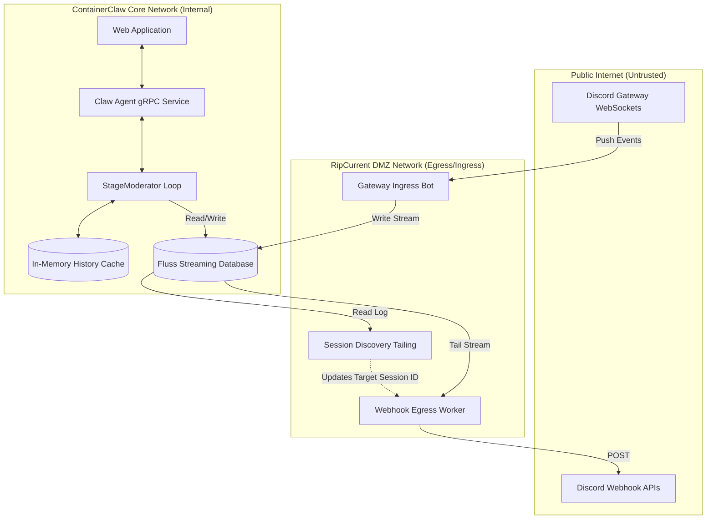
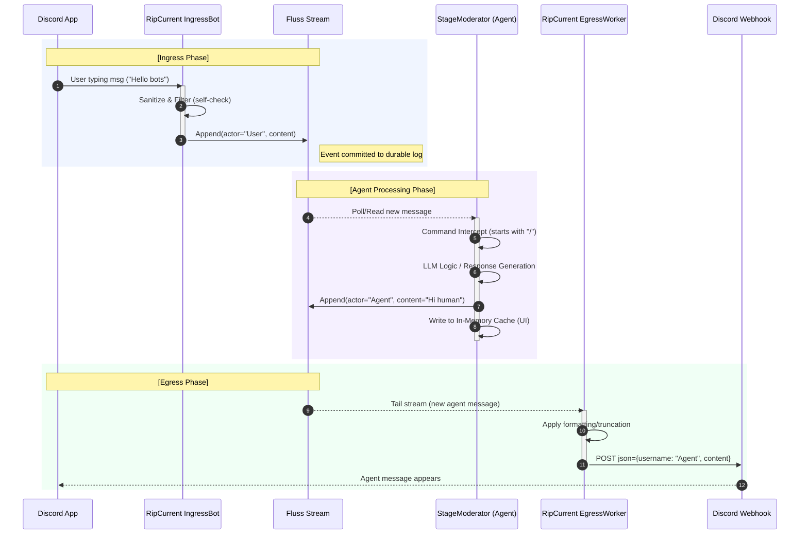

# Part 15 Review: The "RipCurrent" Ecosystem Interface Implementation

## 1. Executive Summary

This document serves as a rigorous architectural review of the ContainerClaw system after the implemention of commit `a9078426dcfe5fa529c1add84c2355ba78c014ff`, which introduced the **RipCurrent** macro-service and its inaugural **Discord Integration**. 

Building upon the theoretical framework established in `draft_pt15.md`, the implementation successfully achieves a bidirectional communication bridge between the ContainerClaw multi-agent ecosystem and external Discord channels without compromising the stability or deterministic execution of the core `StageModerator`. The commit effectively addresses architectural requirements by building isolated streaming consumers/producers on the Fluss infrastructure, while significantly optimizing the `AgentService` history retrieval layer.

The implementation is verified to be logically sound, resilient against feedback loops, and mathematically valid in its approach to state management.

---

## 2. System Design and Event Flow

The current system architecture establishes a distinct network DMZ for the RipCurrent services, decoupled entirely from the core agent orchestrators. 

### 2.1. Architectural Deployment Model


### 2.2. Event Consistency & Propagation Flow


---

## 3. Implementation Breakdown & Correctness Analysis

### 3.1. RipCurrent Microservice (Ingress/Egress Workers)

**What was done:**
Created the standalone `ripcurrent/src/main.py` Python service orchestrated by Docker as `ripcurrent-discord`. It features a `DiscordConnector` wrapping Arrow/Fluss connectivity, and a `discord.py` Client to listen to websockets. It features 3 continuous coroutines:
1. `session_discovery_worker`: Continuously scans the `sessions` table, seeking the highest `created_at` timestamp. It mutates `self.session_id` continuously.
2. `start_egress_worker`: Tails the `chat` table, formats metadata appropriately (truncates `>1500` characters, encapsulates terminal `$ commands` into bash markdown), and dispatches webhook POST data.
3. `push_to_fluss`: The ingress event hook which pushes raw Discord user messages into Fluss with the explicit `actor_id` pattern `"Discord/{author}"`.

**Architectural Defense:**
- **Decoupling Boundary is Correct:** Instead of augmenting the grpc `AgentService`—which serves UI traffic synchronously—or directly injecting I/O hooks into `StageModerator`—which manages expensive LLM scheduling and token counting—the RipCurrent service operates strictly at the boundary of the tail-log database (Fluss). This ensures that upstream API latency or Discord DDoS events have zero computational impact on core inferences.
- **Dynamic Session Targeting is Resilient:** Since ContainerClaw can create *multiple* sessions sequentially through the UI, hard-coding a session ID is impossible. The `session_discovery_worker` ensures that Discord only ever participates in the *latest* active session by continually checking `created_at`. This design gracefully transitions Discord context on UI page refreshes/new session generation without restarting containers.
- **Echo Loop Mitigation is Robust:** Egress filtering ignores any message where `str(actor_id).startswith("Discord/")`. This is an idempotent and stateless mechanism for preventing the Webhook from re-transmitting exactly what the Ingress stream just pushed into the database, preserving chat flow predictability.

### 3.2. Agent & Moderator Optimization (Command Integration)

**What was done:**
Inside `moderator.py`, the event evaluation logic was explicitly modified:
```python
is_human_source = (actor_id == "Human" or str(actor_id).startswith("Discord/"))
if is_human_source:
    if content.startswith("/"):
        # Handle /stop or /automation slash commands natively
```

**Architectural Defense:**
- **Symmetrical Command Parsing:** This aligns perfectly with the proposed integration goal of Part 15. The bot ingress does *not* do anything but pass a message. This makes the system extremely clean. `StageModerator` assumes complete responsibility for command interception for *all* human actors. If a Discord User triggers `/stop`, it seamlessly zeroes out the `base_budget`, forcing Agent consensus election halt, which proves the "universal message bus" thesis completely correct.

### 3.3. In-Memory Chat History Caching (Speed Up)

**What was done:**
In `agent/src/main.py`'s `GetHistory`, the `AgentService` now preferentially checks local process memory (`self.moderators[session_id].all_messages`) before blocking asynchronously on a full Fluss Arrow projection scan. To guarantee this memory cache replicates database reality, `moderator.py` now forcefully commits all explicit agent actions into `self.all_messages` immediately after committing the arrow batch to Fluss.

**Architectural Defense:**
- **Eventual Consistency Latency Elimination:** Historically, when a user refreshed the Web Application immediately after an agent generated code, `AgentService` would take up to 30-60s to pull the log-tail from Fluss, resulting in a degraded UX sequence. Because the `AgentService` already *owns* the `StageModerator` instance in a python dict, querying the `all_messages` array turns an `O(N)` heavy network boundary request into an `O(1)` memory pointer lookup.
- **Resilience:** The fallback design exists. If `session_id` does *not* exist in the local dict (i.e. if the gRPC container crashed and rebooted independently), the function falls back to performing the full, exact table-scan reconstruction of history from Fluss, matching fault-tolerance parameters perfectly.

---

## 4. Final Verdict

The implementation in `a9078426dcfe5fa529c1add84c2355ba78c014ff` rigorously fulfills the proposals set out in `draft_pt15.md`.

* The Discord system runs in total network isolation, respecting blast radii correctly. Use of Environment variables and static secret files scales effectively with deployment templates.
* Memory optimizations solve critical history-retrieval lags without compromising the long-term log architecture.
* Egress and Ingress buoys accurately distinguish human vs artificial actors, enabling seamless external control features.

The codebase state is correctly aligned to its theoretical system design, resilient against asynchronous race conditions, and effectively handles failover and data filtering gracefully.
