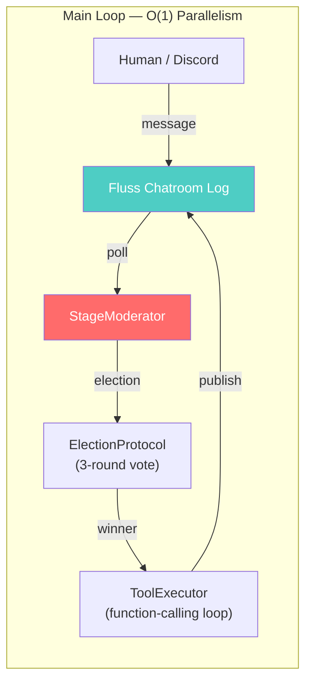
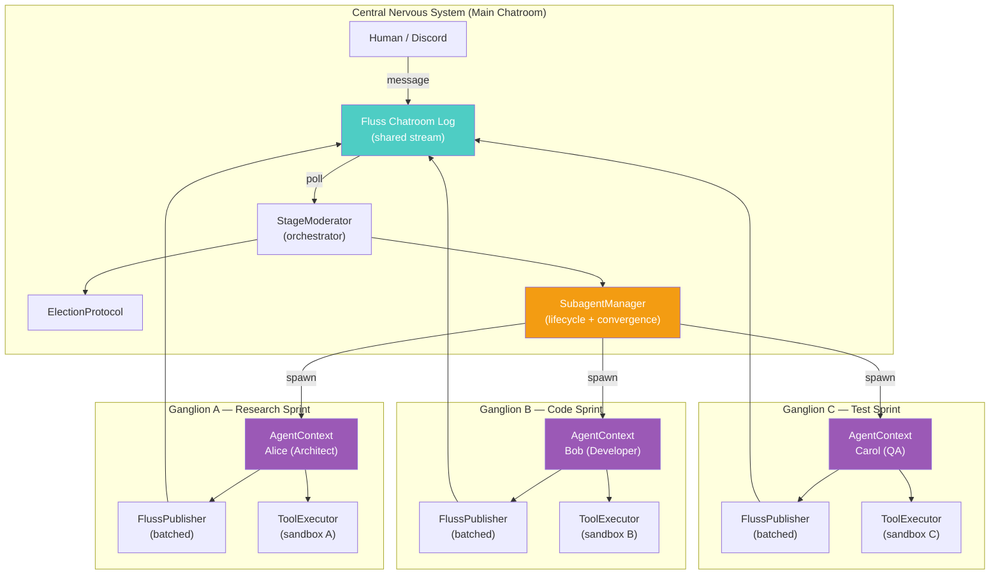
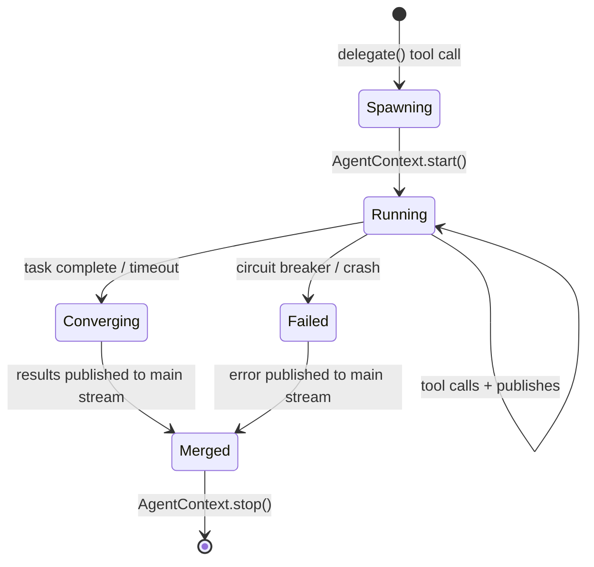
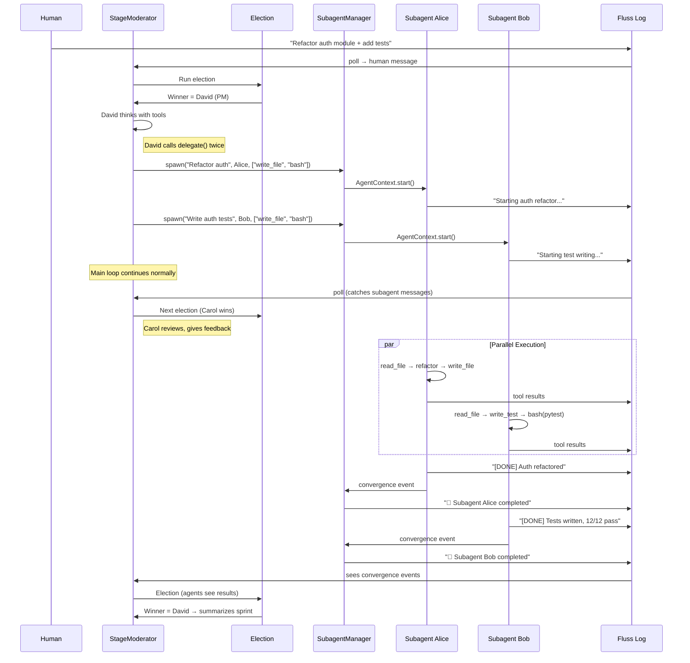
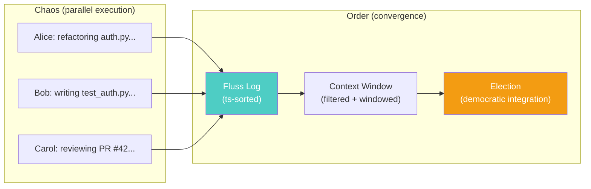

# Draft Pt. 16 — Subagent Architecture: Parallel Autonomy on the Stream

> **Date:** 2026-03-26  
> **Prerequisite reading:** [state_of_code_pt1.md](./state_of_code_pt1.md), [state_of_code_pt2.md](./state_of_code_pt2.md), [state_of_code_pt2_review.md](./state_of_code_pt2_review.md)  
> **Scope:** Design proposal for dynamic subagent spawning, parallel execution, and ordered convergence on the Fluss stream backbone.

---

## 0. The Problem Statement

ContainerClaw's main chatroom operates on a **vote-based turn protocol**: agents vote, one winner speaks, the moderator cycles. This is deterministic, auditable, and orderly — but it's **O(1) parallelism**. Only one agent executes at a time. When a complex task arrives (e.g., "Refactor the entire authentication module"), the system must:

1. Decompose the task into subtasks
2. Execute subtasks **in parallel** across multiple agents
3. Converge results back into the main stream in a coherent order
4. Handle failures, timeouts, and conflicting file edits

The question is: **How do we add O(N) parallelism while preserving the ordered, auditable nervous system?**

---

## 1. First Principles: The Stream as Physics

Before designing, we establish axioms from the current architecture:

### Axiom 1: The Stream Is the Single Source of Truth
Every event in the system — messages, tool calls, votes, subagent outputs — must be recorded in the Fluss log. If it's not on the stream, it didn't happen. Crash recovery = replay the log.

### Axiom 2: Speed of Light = Network RTT to Fluss
The irreducible cost is the Fluss flush latency (~1-5ms per batch). Everything else — LLM calls (1-10s), tool execution (0.1-30s) — dominates. The architecture must minimize Fluss RTTs while maximizing LLM parallelism.

### Axiom 3: Order Emerges from Timestamps, Not Locks
In a distributed stream, there are no global locks. Order is imposed by the consumer (moderator, UI) sorting by `ts`. Two subagents writing simultaneously to the same log don't need coordination — the log serializes them.

### Axiom 4: Idempotency via UUID
Every event has an `event_id` (UUID4). Any consumer can replay the log and produce the same state. Duplicates are cheap to detect.

---

## 2. Current Architecture: The Nervous System



**Bottleneck:** The election → execution → publish cycle is **sequential**. While Alice executes, Bob/Carol/David/Eve are idle. A 10-tool-call turn takes ~30s. During that time, 4 agents produce zero value.

### What We Already Have

| Component | Role | Subagent-Ready? |
|-----------|------|:---:|
| `AgentContext` | Isolated runtime (agent + context + publisher + tools) | ✅ |
| `FlussPublisher` | Batched writer with immediate memory callback | ✅ |
| `ContextManager` | Dedup + windowed history | ✅ |
| `ToolExecutor` | Function-calling loop with circuit breaker | ✅ |
| `GeminiAgent` | LLM gateway wrapper | ✅ |
| `ElectionProtocol` | Vote-based turn selection | ❌ (main loop only) |
| `StageModerator` | Orchestration loop | ⚠️ (needs subagent manager) |

> `AgentContext.create()` was built precisely for this moment. Each subagent is an `AgentContext` running as an `asyncio.Task`.

---

## 3. Proposed Architecture: The Nervous System + Ganglia

The biological metaphor: the **main chatroom** is the central nervous system (CNS) — deliberate, ordered, vote-based. **Subagents** are **ganglia** — autonomous processing nodes that operate independently, handle local reflexes (tool calls), and report results back to the CNS.



### Key Design Decisions

#### 3.1 Subagents Share the Same Fluss Log

Subagents publish to the **same chatroom log** as the main agents. They don't get a separate stream. This is critical because:

- The UI automatically sees subagent output (no special rendering needed)
- The moderator's context window includes subagent results (they appear as regular messages)
- RipCurrent (Discord) automatically egresses subagent messages
- Crash recovery replays everything from one log

**Differentiation from OpenHands:** OpenHands' `delegate()` is **blocking** — the main agent suspends until all subagents complete, then receives a consolidated `Observation`. ContainerClaw's subagents are **non-blocking** — they write to the shared log as they work, and the main loop can react to partially-completed results.

#### 3.2 Subagents Have Independent Context Windows

Each `AgentContext` has its own `ContextManager`. A subagent spawned to "research authentication patterns" doesn't need to see every message from the main chatroom — it gets a **task-scoped** context:

```
Subagent Context = Task Description + Relevant Files + Own Tool Results
```

This is the key insight: subagents operate in a **reduced context** optimized for their specific task. They don't participate in elections. They don't vote. They just *work*.

#### 3.3 The Main Loop Remains Vote-Based

Subagents don't disrupt the CNS. The `StageModerator` still runs its poll → elect → execute cycle. The only change is that a winning agent can now **propose spawning subagents** as part of its turn, via a new `delegate` tool:

```python
# Agent's tool call during a normal turn:
delegate({
    "task": "Research OAuth2 PKCE flow for our auth module",
    "agent": "Alice",       # Which agent persona
    "timeout_s": 120,       # Max wall-clock time
    "tools": ["advanced_read", "structured_search", "repo_map"],  # Tool subset
})
```

---

## 4. The SubagentManager

This is the new component that bridges the CNS and the ganglia.

### 4.1 Lifecycle



### 4.2 Interface

```python
class SubagentManager:
    """Manages lifecycle of spawned subagents.

    Each subagent is an asyncio.Task wrapping an AgentContext.
    The manager tracks active tasks, enforces timeouts, and 
    publishes convergence results to the main stream.
    """

    def __init__(self, fluss_client, table, session_id, publisher):
        self.fluss = fluss_client
        self.table = table
        self.session_id = session_id
        self.publisher = publisher        # Main stream publisher
        self._active: dict[str, SubagentHandle] = {}
        self._max_concurrent = 5          # Resource guard

    async def spawn(self, task_desc, agent, tools, timeout_s=120) -> str:
        """Spawn a new subagent. Returns a task_id for tracking."""
        if len(self._active) >= self._max_concurrent:
            raise ResourceError("Max concurrent subagents reached")

        task_id = str(uuid.uuid4())[:8]
        ctx = AgentContext.create(
            agent=agent,
            session_id=self.session_id,
            fluss_client=self.fluss,
            table=self.table,
            tool_dispatcher=self._create_scoped_dispatcher(tools),
            parent_actor=f"Subagent/{task_id}",
        )
        await ctx.start()

        # Create the asyncio.Task
        handle = SubagentHandle(
            task_id=task_id,
            context=ctx,
            task=asyncio.create_task(
                self._run_subagent(task_id, ctx, task_desc, timeout_s)
            ),
        )
        self._active[task_id] = handle
        await self.publisher.publish(
            "Moderator",
            f"🔱 Spawned subagent {task_id} ({agent.agent_id}): {task_desc}",
            "system",
        )
        return task_id

    async def _run_subagent(self, task_id, ctx, task_desc, timeout_s):
        """Execute a subagent's autonomous loop with timeout."""
        try:
            async with asyncio.timeout(timeout_s):
                # Seed the subagent's context with the task
                ctx.context.add_message(
                    "Moderator",
                    f"TASK: {task_desc}\nWork independently. "
                    f"Use your tools. Report results when done.",
                    int(time.time() * 1000),
                )

                # Autonomous tool-calling loop
                executor = ToolExecutor(
                    ctx.tool_dispatcher,
                    publish_fn=ctx.publish,
                    get_context_fn=ctx.get_context_window,
                    poll_fn=lambda: False,  # No interrupt polling
                )
                for _ in range(config.MAX_TOOL_ROUNDS):
                    result = await executor.execute_with_tools(
                        ctx.agent,
                        check_halt_fn=lambda: not ctx._running,
                    )
                    if result:
                        await ctx.publish(result, "output")
                        if "[DONE]" in result or "[WAIT]" in result:
                            break

        except TimeoutError:
            await ctx.publish(
                f"⏰ Subagent {task_id} timed out after {timeout_s}s",
                "system",
            )
        except Exception as e:
            await ctx.publish(f"💥 Subagent {task_id} failed: {e}", "system")
        finally:
            await ctx.stop()
            self._active.pop(task_id, None)
            await self.publisher.publish(
                "Moderator",
                f"🏁 Subagent {task_id} completed.",
                "system",
            )
```

### 4.3 The `delegate` Tool

```python
class DelegateTool(Tool):
    name = "delegate"
    description = (
        "Spawn a parallel subagent to work on a specific subtask. "
        "The subagent works independently with its own tools and context. "
        "Results appear in the main stream as they complete."
    )

    def get_schema(self):
        return {
            "type": "object",
            "properties": {
                "task": {"type": "string", "description": "Task description"},
                "agent_persona": {"type": "string", "description": "Persona"},
                "timeout_s": {"type": "integer", "default": 120},
            },
            "required": ["task"],
        }

    async def execute(self, agent_id, args):
        task_id = await self.subagent_manager.spawn(
            task_desc=args["task"],
            agent=self._create_agent(args.get("agent_persona", "General")),
            tools=self.default_tools,
            timeout_s=args.get("timeout_s", 120),
        )
        return ToolResult(
            success=True,
            output=f"Subagent {task_id} spawned. Results will appear in stream.",
        )
```

---

## 5. Making Order from Chaos: The Convergence Protocol

The hardest problem: multiple subagents working in parallel produce **interleaved, potentially conflicting output**. How does the system converge?

### 5.1 The Scoped Message Type

Every subagent message carries its `parent_actor` field (already in the schema):

```
parent_actor = "Subagent/a1b2c3d4"
```

This enables:
- **UI filtering:** Show/hide subagent messages in a collapsible panel
- **Context scoping:** The moderator can include/exclude subagent output from the main context window
- **Provenance tracking:** Which subagent produced which file change

### 5.2 The Convergence Trigger

When a subagent completes, the `SubagentManager` publishes a **convergence event** to the main stream:

```python
await self.publisher.publish(
    "Moderator",
    json.dumps({
        "type": "subagent_result",
        "task_id": task_id,
        "agent": agent_id,
        "summary": final_text,
        "files_modified": [...],
        "status": "completed" | "timeout" | "failed",
    }),
    "convergence",
)
```

The main moderator loop sees this as a regular message. The next election cycle naturally incorporates it — agents vote on what to do next given the subagent's results.

### 5.3 Conflict Resolution

Two subagents modifying the same file? Three strategies:

| Strategy | Mechanism | When |
|----------|-----------|------|
| **File locks** | Subagent acquires advisory lock on file paths | Default for write-heavy tasks |
| **Branch isolation** | Each subagent works in a git branch, merge at convergence | Long-running research sprints |
| **Last-write-wins** | No coordination — later timestamp overwrites | Read-only or append-only tasks |

For Phase 1, **advisory file locks** via a simple in-memory dict on the `SubagentManager`:

```python
class SubagentManager:
    def __init__(self, ...):
        self._file_locks: dict[str, str] = {}  # path → task_id

    def acquire_lock(self, path: str, task_id: str) -> bool:
        if path in self._file_locks and self._file_locks[path] != task_id:
            return False
        self._file_locks[path] = task_id
        return True

    def release_locks(self, task_id: str):
        self._file_locks = {
            p: t for p, t in self._file_locks.items() if t != task_id
        }
```

---

## 6. Data Flow: A Subagent Sprint



---

## 7. Comparison: ContainerClaw vs OpenHands

| Dimension | OpenHands | ContainerClaw (proposed) |
|-----------|-----------|--------------------------|
| **Delegation model** | Blocking `delegate()` — main agent suspends until subagents finish | Non-blocking — main loop continues, subagent results flow into stream asynchronously |
| **Subagent communication** | Consolidated `Observation` returned to main agent | Subagents publish directly to shared Fluss log — visible to all consumers (UI, Discord, main agents) in real-time |
| **Context isolation** | Per-subagent conversation history | Per-subagent `ContextManager` + scoped tool access |
| **Parallelism** | Thread-based (`ThreadPoolExecutor`) | `asyncio.Task`-based (single event loop, Rust-backed I/O) |
| **Crash recovery** | None documented — in-memory state | Full replay from Fluss log — subagent state is recoverable |
| **Conflict resolution** | Not documented | Advisory file locks + branch isolation (proposed) |
| **Real-time visibility** | Results visible after delegation completes | Real-time streaming — UI/Discord sees subagent work as it happens |
| **Orchestration** | Main agent controls everything | Hybrid — CNS (vote-based) + ganglia (autonomous subagents) |
| **Runtime** | Docker sandbox per agent | Shared Docker container, isolated `AgentContext` per subagent |
| **Tool access** | Full (via OpenHands SDK) | Scoped — subagent receives only specified tools |

### Where ContainerClaw Differentiates

1. **Stream-native parallelism.** OpenHands blocks on delegation. ContainerClaw's subagents are truly concurrent — the main chatroom keeps functioning while subagents work. This is the fundamental architectural advantage of being stream-first.

2. **Real-time observability.** OpenHands returns consolidated results after completion. ContainerClaw streams subagent work in real-time — the UI shows Alice editing files while Bob runs tests simultaneously, live.

3. **Democratic convergence.** OpenHands uses the main agent to merge results (single point of understanding). ContainerClaw's *entire agent pool* sees subagent results and can vote on how to proceed — distributed comprehension.

4. **Crash resilience.** Subagent state lives on the Fluss log. If the container crashes mid-sprint, restart replays the log and knows which subagents completed and which need re-execution.

### Where OpenHands Has Advantages (and How We Close the Gap)

1. **Mature sandbox isolation.** OpenHands gives each agent a separate Docker container. ContainerClaw's shared container means subagents can interfere with each other's file operations. **Mitigation:** Advisory file locks (Phase 1), container-per-subagent (future).

2. **Proven subtask decomposition.** OpenHands' `RefactorSDK` has battle-tested task decomposition. **Mitigation:** The election protocol + main agent tool-calls already decompose tasks; the `delegate` tool makes this explicit.

3. **Consolidated results.** OpenHands' blocking model guarantees all results are available before the main agent continues. **Mitigation:** The convergence protocol + "all subagents completed" events provide the same guarantee when needed.

---

## 8. Implementation Plan

### Phase 1: Foundation (~3 days)
| Task | Files | Effort |
|------|-------|--------|
| **[NEW]** `SubagentManager` | `agent/src/subagent_manager.py` | 200 LoC |
| **[NEW]** `DelegateTool` | `agent/src/tools.py` (add tool) | 50 LoC |
| **[MODIFY]** `StageModerator` | Wire `SubagentManager` into `run()` | 20 LoC |
| **[MODIFY]** `AgentContext` | Add autonomous `run()` loop | 50 LoC |
| **[MODIFY]** `commands.py` | Add `/subagents` status command | 15 LoC |

### Phase 2: Convergence + UI (~2 days)
| Task | Files | Effort |
|------|-------|--------|
| **[MODIFY]** UI | Collapsible subagent panel, filtered by `parent_actor` | 100 LoC |
| **[NEW]** File lock manager | Advisory locks in `SubagentManager` | 40 LoC |
| **[MODIFY]** `ContextManager` | Configurable subagent-message inclusion | 20 LoC |
| **[MODIFY]** ProjectBoard | Subagent task tracking items | 30 LoC |

### Phase 3: Advanced (~5 days)
| Task | Files | Effort |
|------|-------|--------|
| Branch isolation | Git-based subagent sandboxing | 200 LoC |
| Nested subagents | Subagents spawning sub-subagents | 50 LoC |
| Resource budgeting | LLM token limits per subagent | 30 LoC |
| Container-per-subagent | Docker-in-Docker sandbox | Infrastructure |

---

## 9. Resource Budgeting and Guardrails

Unbounded subagent spawning is a denial-of-service on the LLM provider. Guardrails:

| Guard | Default | Mechanism |
|-------|---------|-----------|
| Max concurrent subagents | 5 | `SubagentManager._max_concurrent` |
| Max wall-clock time per subagent | 120s | `asyncio.timeout()` |
| Max tool rounds per subagent | 10 | `config.MAX_TOOL_ROUNDS` |
| Circuit breaker (consecutive failures) | 3 | Existing `ToolExecutor` circuit breaker |
| Max total LLM calls per sprint | 50 | Token budget counter on `AgentContext` |
| File lock timeout | 60s | Lock auto-expires if holder dies |

---

## 10. The Chatroom Schema — No Changes Required

The current `CHATROOM_SCHEMA` already supports subagents:

```python
CHATROOM_SCHEMA = pa.schema([
    pa.field("event_id", pa.string()),       # UUID — dedup
    pa.field("session_id", pa.string()),     # Session scoping
    pa.field("ts", pa.int64()),              # Ordering
    pa.field("actor_id", pa.string()),       # "Alice", "Bob"
    pa.field("content", pa.string()),        # Message
    pa.field("type", pa.string()),           # "output", "action", "convergence"
    pa.field("tool_name", pa.string()),      # Tool tracking
    pa.field("tool_success", pa.bool_()),    # Tool result
    pa.field("parent_actor", pa.string()),   # "Subagent/a1b2c3d4" ← THIS
])
```

The `parent_actor` field was added during Phase 3 for provenance tracking. It naturally serves as the subagent scoping key. No schema migration needed.

---

## 11. The Physics of Parallel Agents

### Why This Works (Speed of Light Analysis)

The irreducible latencies in the system:

| Operation | Latency | Parallelizable? |
|-----------|---------|:---:|
| LLM thinking | 1-10s | ✅ (independent API calls) |
| Tool execution (file read) | 10-100ms | ✅ (independent files) |
| Tool execution (bash) | 0.1-30s | ✅ (independent commands) |
| Fluss publish (batched) | 1-5ms | ✅ (independent writers) |
| Election (5 agents vote) | 3-8s | ❌ (main loop only) |

**Current throughput:** 1 agent turn every ~15s → ~4 turns/minute.

**With 3 subagents:** Main loop runs at ~4 turns/min + 3 subagents each at ~4 turns/min = **~16 turns/minute**. 4× throughput with zero architectural compromise.

The bottleneck shifts from "one agent at a time" to "LLM API rate limits" — which is the correct bottleneck. We're now limited by the speed of light (network RTT to LLM provider), not by weak design choices.

### Why Chaos Becomes Order

The concern: "random and less structured outputs from free-flowing subagents." The order emerges from three mechanisms:

1. **Temporal ordering.** Every message has a `ts`. The UI and context window sort by timestamp. Even chaotic parallel output becomes a linear narrative when sorted.

2. **Provenance scoping.** `parent_actor = "Subagent/a1b2c3d4"` lets any consumer filter, group, or collapse subagent output. The UI shows it as a collapsible thread. The moderator's context can include or exclude it.

3. **Democratic integration.** When a subagent completes, its results enter the main election cycle. The *entire agent pool* reasons about the results — not just one agent trying to merge everything. This is distributed comprehension.



---

## 12. Conclusion: The Nervous System + Ganglia Model

ContainerClaw's subagent architecture is **not** a fork-join pattern (OpenHands) or a hierarchical delegation tree. It's a **biologial nervous system**: 

- The **CNS** (main chatroom) handles deliberate, voted-on decisions.
- The **ganglia** (subagents) handle autonomous, specialized reflexes.
- The **stream** (Fluss log) is the **spinal cord** — the shared bus that connects everything.

The key insight is that **the stream solves the coordination problem**. In traditional multi-agent systems, you need explicit synchronization (locks, barriers, message queues). In ContainerClaw, the stream *is* the synchronization primitive. Two subagents writing to the same log don't need to coordinate — the log serializes their outputs, and the consumer (moderator) imposes order after the fact.

This is analogous to how the human nervous system works: peripheral ganglia process sensory input in parallel, send signals up the spinal cord, and the brain integrates them into a coherent picture. The ganglia don't need to coordinate with each other — the spinal cord handles the transport, and the brain handles the integration.

> *The stream carries everything. The moderator integrates everything. The subagents just work.*
