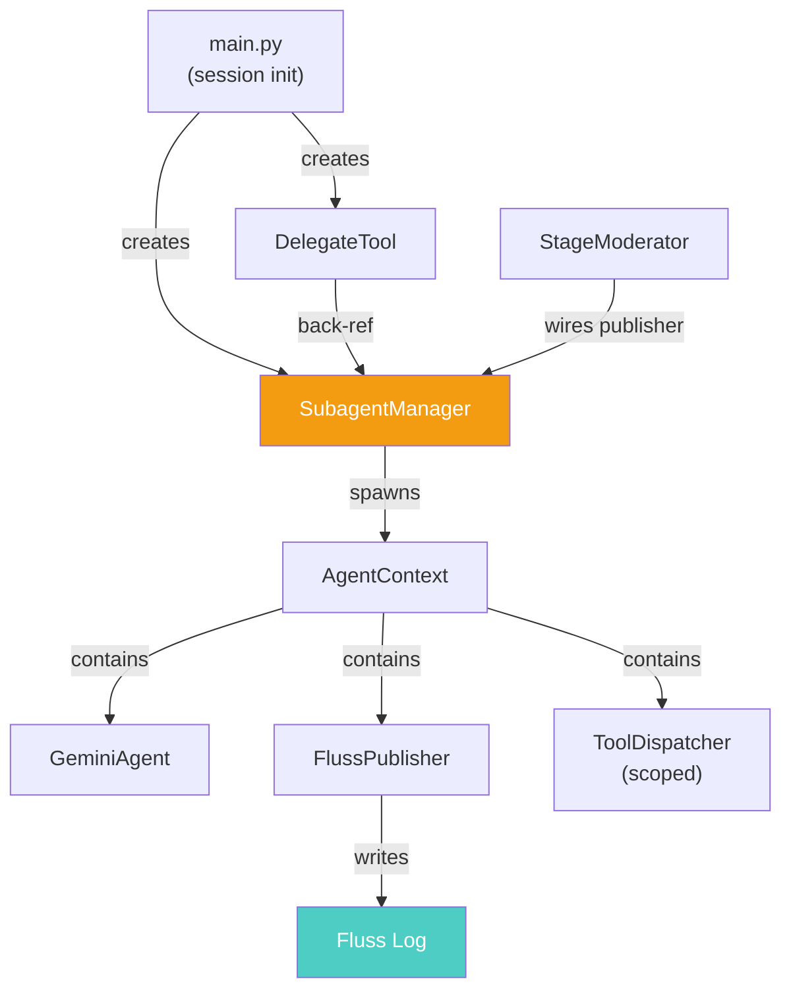

# Subagent Phase 1: Foundation — Walkthrough

## New Files

### [subagent_manager.py](file:///.../containerclaw/agent/src/subagent_manager.py) (284 LoC)
- `SubagentManager.spawn()` — creates [GeminiAgent](file:///.../containerclaw/agent/src/agent.py#18-326) + [AgentContext](file:///.../containerclaw/agent/src/agent_context.py#28-132), launches `asyncio.Task`
- [_run_subagent()](file:///.../containerclaw/agent/src/subagent_manager.py#148-238) — autonomous tool-calling loop with `asyncio.timeout`, circuit breaker, [DONE]/[STUCK] exit signals
- [cancel()](file:///.../containerclaw/agent/src/subagent_manager.py#246-253) / [cancel_all()](file:///.../containerclaw/agent/src/subagent_manager.py#254-258) — graceful Task cancellation
- [get_status()](file:///.../containerclaw/agent/src/subagent_manager.py#259-269) — human-readable summary for `/subagents` command
- Advisory file locks: [acquire_lock()](file:///.../containerclaw/agent/src/subagent_manager.py#272-278) / [release_locks()](file:///.../containerclaw/agent/src/subagent_manager.py#279-284)
- Convergence events published to main stream on completion

## Modified Files

### [tools.py](file:///.../containerclaw/agent/src/tools.py) — Added [DelegateTool](file:///.../containerclaw/agent/src/tools.py#867-957) (96 LoC)
- Agents call `delegate(task="...", persona="...", timeout_s=120, tools=[...])` to spawn subagents
- Non-blocking — returns immediately with `task_id`
- Back-references [SubagentManager](file:///.../containerclaw/agent/src/subagent_manager.py#45-284) (wired in [main.py](file:///.../containerclaw/agent/src/main.py))

### [main.py](file:///.../containerclaw/agent/src/main.py) — Wiring
- [DelegateTool](file:///.../containerclaw/agent/src/tools.py#867-957) added to all agents' tool lists
- [SubagentManager](file:///.../containerclaw/agent/src/subagent_manager.py#45-284) created per-session, wired to `moderator.subagent_manager`
- Publisher reference deferred to `moderator.run()`

### [moderator.py](file:///.../containerclaw/agent/src/moderator.py) — Publisher bridge
- `SubagentManager.publisher` set after [FlussPublisher](file:///.../containerclaw/agent/src/publisher.py#18-156) init in [run()](file:///.../containerclaw/agent/src/moderator.py#171-277)

### [commands.py](file:///.../containerclaw/agent/src/commands.py) — 2 new commands
- `/subagents` — shows active subagent status
- `/cancel_subagent=<task_id>` — cancels a specific subagent

## Architecture

> [!IMPORTANT]
> Requires `claw.sh clean && claw.sh up` due to new Python module.
