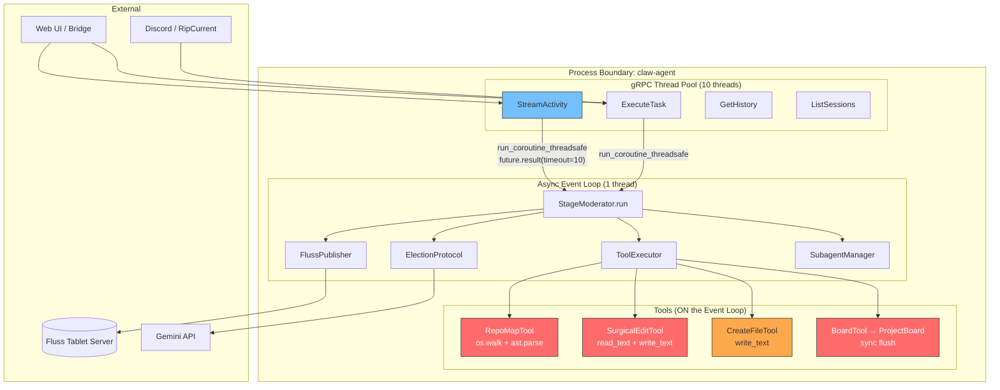
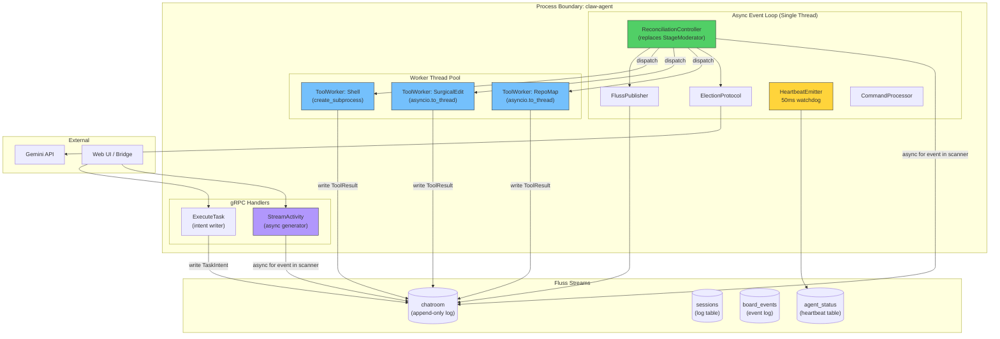
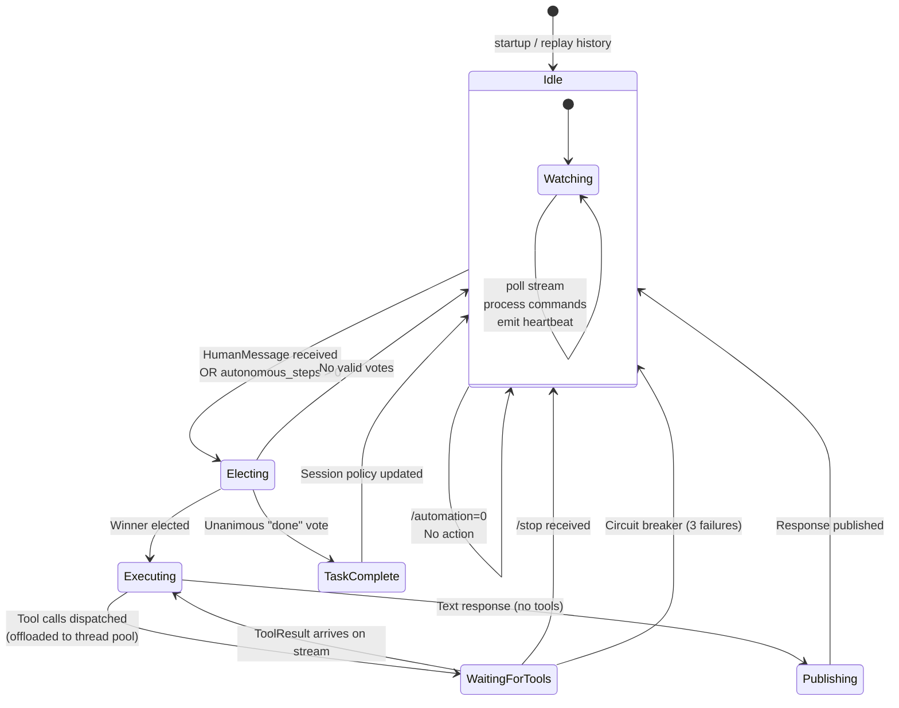
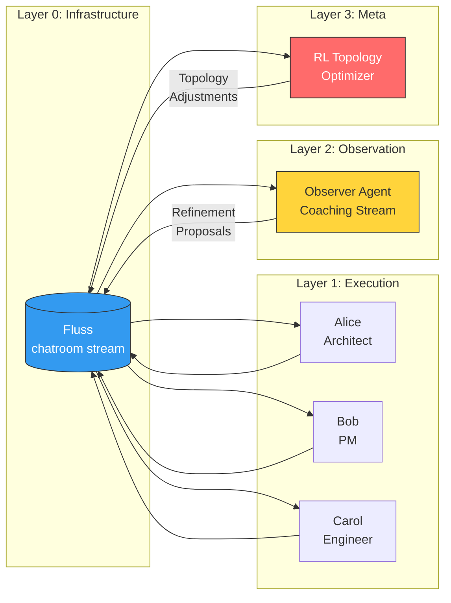

# Draft Part 17: From Orchestration to Stream Topology — The Reconciliation Pivot

> **Status:** Architectural Proposal  
> **Lineage:** bug_1.md → bug_1_pt2.md → bug_1_pt3.md → bug_1_pt4.md → **this document**  
> **Problem Class:** Topological Starvation in a Hybrid-Paradigm MAS  
> **Goal:** Derive, from first principles, the minimal set of architectural changes that shift ContainerClaw from an imperative orchestration engine to a stream-centric reconciliation backbone — bounded only by the speed of light, not by design choices.

---

## 0. Premise: What "Hanging" Really Means

The symptom is simple: the system hangs. But "hanging" in a distributed streaming system is **not** a single failure — it is a **topological knot** where multiple causal chains converge into mutual starvation. Bug 1 (parts 1–4) progressively uncovered three entangled layers of this knot:

| Layer | Bug Doc | Root Cause | Metric |
|:---|:---|:---|:---|
| **L1: The Bridge** | bug_1 | `run_coroutine_threadsafe` + `future.result(timeout=10)` | gRPC thread times out waiting for a blocked event loop |
| **L2: The Blockade** | bug_1_pt2 | Synchronous `os.walk`/`ast.parse`/`read_text` on the event loop | Event loop latency jumps from ~0ns to ~15s |
| **L3: The Paradigm** | bug_1_pt4 | Imperative poll→elect→execute couples Liveness to Execution | Idle state (`automation=0`) is indistinguishable from deadlock |

**Thesis:** Layers 1 and 2 are symptomatic. Layer 3 is the disease. Fixing L1 and L2 without addressing L3 will produce a faster system that still fundamentally conflates *orchestration* (deciding what to do) with *execution* (doing it), guaranteeing that new tools, agents, or integrations will re-introduce topological knots.

---

## 1. First Principles: The Speed-of-Light Budget

### 1.1 The Physical Constraint

In an ideal system, the latency between any two components is bounded by the propagation delay of the medium. For in-process communication (thread ↔ thread), this is on the order of **nanoseconds**. For network communication (container ↔ container), the bound is the RTT of the local Docker bridge (~100μs).

The **Speed-of-Light Budget** for any operation is:

$$t_{operation} = t_{propagation} + t_{serialization} + t_{computation}$$

| Component | $t_{propagation}$ | $t_{serialization}$ | $t_{computation}$ |
|:---|:---|:---|:---|
| Event loop → gRPC thread | ~100ns | ~0 (shared memory) | ~0 |
| Agent → Fluss | ~100μs | ~50μs (Arrow IPC) | ~1ms (batch write) |
| Agent → LLM (Gemini) | ~200ms | ~5ms (JSON) | ~2-30s (inference) |

The only operation that *should* take seconds is **LLM inference**. Everything else — stream reads, tool dispatch, state updates — should complete within the propagation + serialization budget (~1ms total).

### 1.2 Where the Budget Is Violated

In the current architecture, the event loop carries operations that have **unbounded** $t_{computation}$:

```
RepoMapTool.execute():
  os.walk("/workspace")         →  O(files) ≈ 15s
  ast.parse(content)            →  O(file_size) per file

SurgicalEditTool.execute():
  path.read_text()              →  O(file_size)
  path.write_text()             →  O(file_size)

ProjectBoard._publish_event():
  self._writer.flush()          →  Synchronous Fluss write (blocking I/O)
```

These operations consume the event loop's **entire time quantum**. In a cooperative multitasking system, this means:

$$t_{loop\_latency} = \max(t_{task_i}) \text{ for all concurrently scheduled tasks}$$

When $t_{task_i}$ = 15s (RepoMapTool), the loop is frozen. The gRPC thread's `future.result(timeout=10)` expires before the loop can even *schedule* the poll coroutine.

---

## 2. Anatomy of the Current Architecture

### 2.1 Component Topology (As-Is)



### 2.2 The Three Knots

**Knot 1: The Bridge of Sighs** (`main.py:209-213`)

```python
# gRPC thread (one of 10) tries to schedule work on the event loop
future = asyncio.run_coroutine_threadsafe(
    FlussClient.poll_async(scanner, timeout_ms=500),
    self.loop
)
batches = future.result(timeout=10)  # ← THE KNOT
```

The gRPC thread has a 10-second patience. The event loop may be blocked for 15+ seconds. The cross-thread future is the **coupling point** where two paradigms clash.

**Knot 2: The Synchronous Ganglion** (`tools.py:632-671`)

```python
async def execute(self, agent_id: str, params: dict) -> ToolResult:
    for root, dirs, files in os.walk(base_dir):   # ← SYNC on event loop
        for file in files:
            content = file_path.read_text(...)     # ← SYNC on event loop
            tree = ast.parse(content)              # ← CPU-bound on event loop
```

Despite the `async def` signature, the body is **entirely synchronous**. The `await` contract is violated — this function never yields control back to the event loop.

**Knot 3: The Imperative Loop** (`moderator.py:212-276`)

```python
while True:
    batches = await FlussClient.poll_async(self.scanner, timeout_ms=500)
    human_interrupted = await self._process_batches(batches)
    if human_interrupted or (self.current_steps != 0):
        # ... Election ...
        # ... Tool Execution (may block for 15s+) ...
        # ... Publish result ...
    await asyncio.sleep(1)  # ← Only yields here
```

The moderator **serializes** polling, election, execution, and publishing into a single sequential pipeline. While the agent is executing tools (potentially for 30+ seconds across multiple tool rounds), the loop cannot:
- Process incoming human messages
- Respond to `/stop` commands
- Service `StreamActivity` poll requests
- Update agent heartbeats

---

## 3. The Target Architecture: Stream-Centric Reconciliation

### 3.1 Design Principles

The shift from orchestration to reconciliation is governed by four axioms:

1. **The Stream Is the Truth.** All state transitions — intents, elections, tool results, status updates — are records in Fluss. In-memory state is a *cache* of the stream, never the source of truth.

2. **The Loop Never Blocks.** No operation on the event loop may exceed 50ms. Anything that might — LLM calls, file I/O, subprocess execution — is offloaded to a thread pool or process pool.

3. **Intent ≠ Execution.** Writing "I want to run RepoMapTool" to the stream is a nanosecond operation. Actually running `os.walk` is a seconds-long operation. These must be decoupled.

4. **Idle Is a Valid State.** When `automation=0`, the system should consume near-zero CPU while remaining fully responsive to commands. An idle system is a system where every coroutine is `await`ing an I/O event — not a system where the loop is spinning on `asyncio.sleep(1)`.

### 3.2 Target Topology (To-Be)



---

## 4. The Three Surgeries

### 4.1 Surgery 1: Thread-Offloading the Ganglia (Untying Knot 2)

**Rationale:** This is the highest-ROI, lowest-risk change. It does not alter control flow, dataflow, or the gRPC interface. It only changes *where* synchronous code runs.

**The Principle:** Any function body that contains synchronous I/O or CPU-bound computation must be wrapped in `asyncio.to_thread()`. This schedules the work on the default `ThreadPoolExecutor`, freeing the event loop to continue servicing coroutines.

**File: `tools.py` — `RepoMapTool.execute`** (lines 625-673)

```python
# CURRENT (event loop starvation)
async def execute(self, agent_id: str, params: dict) -> ToolResult:
    for root, dirs, files in os.walk(base_dir):    # BLOCKS
        for file in files:
            content = file_path.read_text(...)      # BLOCKS
            tree = ast.parse(content)               # BLOCKS

# PROPOSED (event loop free)
async def execute(self, agent_id: str, params: dict) -> ToolResult:
    return await asyncio.to_thread(self._build_map)

def _build_map(self) -> ToolResult:
    """Runs entirely in a worker thread — never touches the event loop."""
    base_dir = Path("/workspace")
    output_lines = []
    parsed_files = 0
    max_files = 500
    try:
        for root, dirs, files in os.walk(base_dir):
            dirs[:] = [d for d in dirs if not d.startswith('.')
                       and d not in ('venv', '__pycache__', 'node_modules', ...)]
            for file in files:
                if parsed_files >= max_files:
                    output_lines.append(f"\n... Limit reached ({max_files}).")
                    return ToolResult(success=True, output="\n".join(output_lines))
                if not file.endswith(".py"):
                    continue
                file_path = Path(root) / file
                parsed_files += 1
                try:
                    content = file_path.read_text(errors="ignore")
                    tree = ast.parse(content)
                    # ... AST visitor logic unchanged ...
                except Exception:
                    pass
        return ToolResult(success=True, output="\n".join(output_lines) or "No Python files found.")
    except Exception as e:
        return ToolResult(success=False, output="", error=f"Repo map failed: {e}")
```

**Defense:** `asyncio.to_thread` delegates to `loop.run_in_executor(None, func)`, which uses the process-global `ThreadPoolExecutor`. The GIL ensures thread-safety for pure-Python objects. The event loop remains free to service `poll_async`, `StreamActivity`, and command processing. Cost: one context switch (~1μs) per tool invocation — negligible against the 15s blocking cost.

**File: `tools.py` — `SurgicalEditTool.execute`** (lines 526-572)

```python
# PROPOSED
async def execute(self, agent_id: str, params: dict) -> ToolResult:
    return await asyncio.to_thread(self._perform_edit, params)

def _perform_edit(self, params: dict) -> ToolResult:
    """File I/O in worker thread."""
    path = Path("/workspace") / params.get("path", "")
    # ... validation logic unchanged ...
    content = path.read_text(encoding="utf-8")
    # ... replacement logic unchanged ...
    path.write_text(new_content, encoding="utf-8", newline="")
    return ToolResult(success=True, output=f"Successfully replaced ...")
```

**File: `tools.py` — `CreateFileTool.execute`** (lines 491-508)

```python
# PROPOSED
async def execute(self, agent_id: str, params: dict) -> ToolResult:
    return await asyncio.to_thread(self._create, params)

def _create(self, params: dict) -> ToolResult:
    path = Path("/workspace") / params.get("path", "")
    # ... validation and write in thread ...
```

**File: `tools.py` — `AdvancedReadTool.execute`** (lines 590-611)

```python
# PROPOSED
async def execute(self, agent_id: str, params: dict) -> ToolResult:
    return await asyncio.to_thread(self._read_lines, params)

def _read_lines(self, params: dict) -> ToolResult:
    # ... path validation + read_text + line extraction in thread ...
```

**File: `tools.py` — `ProjectBoard._publish_event`** (lines 253-275)

```python
# CURRENT (synchronous flush on event loop)
def _publish_event(self, action, item_id, ...):
    self._writer.write_arrow_batch(batch)
    self._writer.flush()   # ← SYNCHRONOUS BLOCKING I/O

# PROPOSED: Make _publish_event async
async def _publish_event(self, action, item_id, ...):
    batch = pa.RecordBatch.from_arrays([...], schema=self._pa_schema)
    await asyncio.to_thread(self._flush_batch, batch)

def _flush_batch(self, batch):
    self._writer.write_arrow_batch(batch)
    self._writer.flush()
```

> [!IMPORTANT]
> This change propagates to `create_item`, `update_status`, and `delete_item` — all callers of `_publish_event` must become `async`. Since `BoardTool.execute` is already `async`, this is a natural upward propagation.

**Impact Diagram — Before vs After Surgery 1:**

```mermaid
gantt
    title Event Loop Timeline During Tool Execution
    dateFormat X
    axisFormat %s

    section Before (Blocked)
    RepoMapTool (os.walk + ast.parse): active, 0, 15000
    poll_async QUEUED : crit, 0, 15000
    StreamActivity TIMEOUT : crit, 10000, 15000
    poll_async executes : active, 15000, 15500

    section After (Free)
    to_thread(RepoMapTool) dispatched : milestone, 0, 0
    poll_async executes : active, 0, 500
    StreamActivity served : active, 500, 1000
    poll_async executes : active, 1000, 1500
    RepoMapTool completes (in thread): milestone, 15000, 15000
```



### 4.2 Surgery 2: Eliminating the Bridge of Sighs (Untying Knot 1)

**Rationale:** Even with Surgery 1, every gRPC handler still uses `run_coroutine_threadsafe` to cross from its thread into the event loop. This bridge adds latency, introduces timeout brittleness, and creates a fundamental paradigm mismatch.

**The Design:** Replace the synchronous gRPC thread pool with **async gRPC handlers** that live directly on the event loop. Alternatively, if migrating away from `grpcio` is too disruptive, we implement a **queue-based decoupling** that eliminates hard timeouts.

#### Option A: Async gRPC via `grpcio` asyncio support

`grpcio` >= 1.46 supports native async servers:

```python
# PROPOSED: main.py — serve() function

import grpc.aio  # Native async gRPC

async def serve():
    fluss_client = FlussClient(config.FLUSS_BOOTSTRAP_SERVERS)
    await fluss_client.connect()

    server = grpc.aio.server()
    agent_service = AgentService(fluss_client)
    agent_pb2_grpc.add_AgentServiceServicer_to_server(agent_service, server)
    server.add_insecure_port('0.0.0.0:50051')
    await server.start()
    print("🚀 Agent gRPC Server Online (async) on port 50051.")
    await server.wait_for_termination()

if __name__ == "__main__":
    asyncio.run(serve())
```

With this, `StreamActivity` becomes a native async generator:

```python
# PROPOSED: main.py — StreamActivity (async native)

async def StreamActivity(self, request, context):
    session_id = request.session_id
    start_ts = int(time.time() * 1000) - 2000
    seen_keys = set()

    yield agent_pb2.ActivityEvent(
        timestamp=ms_to_iso(int(time.time() * 1000)),
        type="thought",
        content=f"Connected to session: {session_id}"
    )

    scanner = await self._create_sse_scanner(start_ts)

    while self.is_running:
        if context.cancelled():
            break
        # DIRECT await — no bridge, no timeout, no future
        batches = await FlussClient.poll_async(scanner, timeout_ms=500)
        if not batches:
            continue
        for poll in batches:
            # ... same filtering/dedup logic ...
            yield agent_pb2.ActivityEvent(...)
```

**Defense:** By eliminating `run_coroutine_threadsafe`, we remove the entire failure mode of Bug 1. There is no cross-thread future, no timeout, and no `TimeoutError` with an empty message. The gRPC handler and the Fluss poller share the same event loop — the latency between them is the coroutine scheduling overhead (~100ns).

**Critical consideration:** The event loop must **never block** for this to work. This is why Surgery 1 is a **prerequisite** — without thread-offloaded tools, an async gRPC server would make the problem *worse*, because now the gRPC handlers themselves would be starved.

#### Option B: Queue-Based Decoupling (Incremental Path)

If full async gRPC migration is too disruptive, an intermediate step decouples gRPC threads from the event loop using an `asyncio.Queue`:

```python
# INTERMEDIATE: StreamActivity with Queue

async def _stream_pump(self, session_id, queue: asyncio.Queue, scanner):
    """Runs on the event loop, feeds batches to the queue."""
    while True:
        batches = await FlussClient.poll_async(scanner, timeout_ms=500)
        if batches:
            await queue.put(batches)
        else:
            await queue.put(None)  # Heartbeat (empty)

def StreamActivity(self, request, context):
    """gRPC thread reads from queue — never blocks the event loop."""
    session_id = request.session_id
    queue = asyncio.Queue(maxsize=100)

    # Start the pump on the event loop
    future = asyncio.run_coroutine_threadsafe(
        self._stream_pump(session_id, queue, scanner), self.loop
    )

    while self.is_running and context.is_active():
        try:
            # Queue.get is thread-safe with a timeout
            batches = asyncio.run_coroutine_threadsafe(
                queue.get(), self.loop
            ).result(timeout=30)  # Much higher timeout, or None
            if batches is None:
                continue  # Heartbeat
            # ... process and yield ...
        except concurrent.futures.TimeoutError:
            continue  # No data, keep alive
```

**Trade-off:** Option A is architecturally clean but requires migrating all gRPC handlers to async. Option B preserves the threading model but significantly reduces timeout pressure by decoupling the poll from the handler.

### 4.3 Surgery 3: The Reconciliation Controller (Untying Knot 3)

**Rationale:** The current `StageModerator.run()` is a monolithic imperative loop that polls, elects, executes, and publishes in strict sequence. This creates a fundamental coupling: while the agent is *executing*, the moderator cannot *observe*. The system's "consciousness" is suspended during every tool call.

**The Principle (K8s Controller Pattern):** The moderator should be a **reconciliation controller** that:
1. Watches the stream continuously (never blocks)
2. Computes the *desired state* from stream events
3. Takes the minimal action to converge *current state* toward *desired state*
4. **Never waits** for an action to complete — results arrive as stream events

#### The State Machine



#### Separation of Concerns

| Current (Monolithic) | Proposed (Decomposed) | Runs On |
|:---|:---|:---|
| `StageModerator.run()` polls Fluss | `StreamWatcher` — dedicated coroutine that feeds a channel | Event loop |
| `StageModerator._process_batches()` checks for commands | `CommandProcessor` — watches for `/stop`, `/automation=N` | Event loop |
| `ElectionProtocol.run_election()` calls LLM | `ElectionProtocol` — unchanged, but triggered by event | Event loop (LLM call is async) |
| `ToolExecutor.execute_with_tools()` runs tools | `ToolWorker` — executes via `asyncio.to_thread` | Worker thread pool |
| `FlussPublisher.publish()` writes results | `FlussPublisher` — unchanged (already async) | Event loop |
| N/A | `HeartbeatEmitter` — writes liveness to `agent_status` | Event loop |

#### The Reconciliation Loop (Pseudocode)

```python
# PROPOSED: reconciler.py

class ReconciliationController:
    """Watches the Fluss stream and reconciles state.
    
    The controller NEVER blocks. It reacts to events and dispatches
    work to the appropriate subsystem. Tool execution is offloaded
    to the thread pool. Election is a fast async LLM call.
    """

    async def run(self):
        await self._replay_history()
        await self.publish("Moderator", "MAS Online.", "thought")

        while True:
            # 1. Poll the stream (non-blocking, 500ms timeout)
            batches = await FlussClient.poll_async(self.scanner, timeout_ms=500)
            events = self._extract_events(batches)

            for event in events:
                # 2. Update context (always, regardless of state)
                self.context.add_message(event.actor, event.content, event.ts)

                # 3. Process commands (always responsive)
                if event.is_human and await self.commands.dispatch(event.content, self):
                    continue

                # 4. Reconcile based on current state
                match self.state:
                    case State.IDLE:
                        if event.is_human or self.should_auto_step():
                            self.state = State.ELECTING
                            asyncio.create_task(self._run_election())

                    case State.WAITING_FOR_TOOLS:
                        if event.is_tool_result:
                            # Tool result arrived — feed back to agent
                            asyncio.create_task(self._continue_execution(event))

            # 5. Emit heartbeat (zero-cost if idle)
            await self._heartbeat()
```

**Defense:** The critical invariant is that the `while True` loop body **never contains a blocking call**. Every long-running operation (`_run_election`, `_continue_execution`) is dispatched as a separate `asyncio.Task`. The loop itself only does three things:
1. Poll Fluss (async, 500ms max)
2. Update context (in-memory, O(1))
3. Dispatch tasks (create_task, ~100ns)

This means the loop cycle time is bounded at ~500ms (the poll timeout), regardless of whether agents are executing, elections are running, or tools are processing files. The system is **always responsive** to commands, always emitting heartbeats, and always streaming events to the UI.

#### /stop Under Reconciliation

In the current architecture, `/stop` sets `self.current_steps = 0`, but if the agent is mid-tool-execution, the moderator can't check this variable until the tool returns (potentially 15+ seconds later).

Under reconciliation:

```python
# In CommandProcessor
async def _handle_stop(self, content, controller):
    controller.state = State.IDLE
    controller.base_budget = 0
    controller.current_steps = 0
    
    # Cancel any running execution tasks
    if controller._execution_task:
        controller._execution_task.cancel()
    
    # Cancel all subagents
    if controller.subagent_manager:
        await controller.subagent_manager.cancel_all()
    
    await controller.publish("Moderator", "🛑 Halted.", "system")
```

Because tool execution runs in a separate `asyncio.Task` (which itself delegates to `asyncio.to_thread`), the cancellation is **immediate**. The event loop is free; the `Task.cancel()` raises `CancelledError` in the coroutine at the next `await` point (which is `asyncio.to_thread`, meaning the coroutine is cancelled but the thread finishes naturally — file I/O is not interrupted mid-write, preventing corruption).

---

## 5. The Stream as the Universal Bus

### 5.1 From Poll-Based to Watch-Based

The current architecture uses a pull-based polling loop:

```
UI → gRPC thread → run_coroutine_threadsafe → event loop → poll_async → Fluss
```

Each hop adds latency and timeout risk. The target architecture collapses this to:

```
ReconciliationController → async for batch in scanner → Fluss
```

For the gRPC `StreamActivity` handler (with async gRPC):

```
StreamActivity handler → async for batch in scanner → Fluss → yield to UI
```

Two independent consumers of the same stream, both living on the event loop, both non-blocking.

### 5.2 Heartbeat Table

To solve the "is the system alive?" question, we introduce a dedicated `agent_status` Fluss table:

```python
AGENT_STATUS_SCHEMA = pa.schema([
    ("session_id", pa.string()),
    ("agent_id", pa.string()),
    ("state", pa.string()),          # "idle", "electing", "executing", "suspended"
    ("last_heartbeat", pa.int64()),  # ms timestamp
    ("current_task", pa.string()),   # description of what the agent is doing
])
```

The `HeartbeatEmitter` is a lightweight coroutine:

```python
async def _heartbeat_loop(self, interval_s=5.0):
    while True:
        await self._write_heartbeat()
        await asyncio.sleep(interval_s)
```

**Defense:** This transforms "is the system hung?" from a question that requires **inference** (parsing error logs, checking timeouts) to a question that requires a simple **stream lookup**: "When was the last heartbeat?" If no heartbeat has been received in 30 seconds, the system is definitively hung, and the UI can display this state.

### 5.3 Topological Knots: Streams Watching Streams

The reconciliation pattern naturally extends to **hierarchical observation**. Each agent loop is a stream consumer that also produces to the same (or different) streams:



The "knot" is tied when the output of one agent becomes the input for another, creating a feedback loop. This is **only safe** under the reconciliation model, because:

1. Each agent independently polls the stream at its own cadence
2. No agent blocks another — they share the stream, not the event loop
3. The stream's append-only semantics guarantee causal ordering
4. Convergence is guaranteed because each agent's actions reduce the delta between `DesiredState` and `CurrentState`

---

## 6. Migration Roadmap

### Phase 0: Immediate Stabilization (Surgery 1 Only)

**Effort:** ~2 hours. **Risk:** Minimal. **Impact:** Eliminates event loop starvation.

| File | Change | Lines Affected |
|:---|:---|:---|
| `tools.py` | Wrap `RepoMapTool.execute` in `asyncio.to_thread` | 625-673 |
| `tools.py` | Wrap `SurgicalEditTool.execute` in `asyncio.to_thread` | 526-572 |
| `tools.py` | Wrap `AdvancedReadTool.execute` in `asyncio.to_thread` | 590-611 |
| `tools.py` | Wrap `CreateFileTool.execute` in `asyncio.to_thread` | 491-508 |
| `tools.py` | Make `ProjectBoard._publish_event` async + `to_thread` | 253-275 |
| `main.py` | Catch `TimeoutError` explicitly in `StreamActivity` | 258-260 |

### Phase 1: Bridge Elimination (Surgery 2)

**Effort:** ~1 day. **Risk:** Medium (gRPC interface change). **Impact:** Removes bridge timeout failures entirely.

| File | Change |
|:---|:---|
| `main.py` | Migrate `AgentService` to `grpc.aio` async handlers |
| `main.py` | Replace `serve()` with `async def serve()` + `asyncio.run()` |
| `main.py` | Remove all `run_coroutine_threadsafe` calls |
| `main.py` | Remove dedicated event loop thread (`_run_event_loop`) |

### Phase 2: Reconciliation Controller (Surgery 3)

**Effort:** ~3 days. **Risk:** High (control flow redesign). **Impact:** Achieves full decoupling of liveness from execution.

| Component | Change |
|:---|:---|
| `reconciler.py` [NEW] | `ReconciliationController` — state machine replacing `StageModerator.run()` |
| `moderator.py` | Deprecated or refactored to delegate to `ReconciliationController` |
| `schemas.py` | Add `AGENT_STATUS_SCHEMA` |
| `heartbeat.py` [NEW] | `HeartbeatEmitter` coroutine |
| `fluss_client.py` | Add `create_status_table` for heartbeat table initialization |

### Phase 3: Stream Topology (Future)

**Effort:** ~1 week. **Risk:** Experimental. **Impact:** Unlocks observer agents and RL topology optimization.

| Component | Change |
|:---|:---|
| Observer Agent layer | Dedicated agents consuming and annotating other agents' streams |
| RL Topology Optimizer | Dynamic agent persona/tool allocation based on stream metrics |
| StreamingInput integration | Cross-agent token-level streaming (vLLM-style) |

---

## 7. Why This Differs From Kubernetes

Kubernetes reconciles **containers**: static units of compute with well-defined resource requirements. ContainerClaw reconciles **intelligence**: dynamic streams of inference with unbounded context requirements.

| Dimension | Kubernetes | ContainerClaw (Proposed) |
|:---|:---|:---|
| **Unit of Work** | Pod (container) | Agent Turn (LLM call + tool chain) |
| **State Store** | etcd (key-value) | Fluss (append-only log) |
| **Reconciliation Target** | CPU/RAM allocation | Intent → Action → Outcome |
| **Failure Mode** | Pod crash → restart | Agent stall → cancel + re-elect |
| **Scaling Axis** | Replica count | Stream fan-out (observer tiers) |
| **Speed Bound** | Network RTT | LLM inference time |

The critical distinction is that K8s Controllers are **idempotent**: running the same reconciliation twice produces the same result. ContainerClaw's agents are **non-deterministic**: running the same election twice may produce a different winner. This means the stream must record **both** the intent and the decision, so that recovery after a crash can resume from the last recorded decision, not re-derive it.

---

## 8. Conclusion: The Speed-of-Light Path

The hanging pattern is not a bug — it is the inevitable consequence of three architectural decisions:

1. **Coupling two concurrency paradigms** (threads and coroutines) via `run_coroutine_threadsafe`
2. **Running unbounded computation** (file I/O, AST parsing) on a cooperative scheduler
3. **Serializing orchestration and execution** in a single-threaded loop

The fix, derived from first principles:

1. **Surgery 1** (L2): Offload all blocking I/O to `asyncio.to_thread`. The event loop's time budget drops from 15s to <1ms per tool call.
2. **Surgery 2** (L1): Migrate to `grpc.aio` or use queue-based decoupling. The cross-paradigm bridge is eliminated.
3. **Surgery 3** (L3): Replace the imperative loop with a reconciliation controller. The system becomes a state machine driven by stream events, not a pipeline driven by function calls.

After all three surgeries, the only operation in the system that takes more than 1ms is **LLM inference** — which is the one operation we *cannot* optimize, because it is bounded by the speed of light between our container and Google's data center, plus the computational cost of attention over the context window.

Everything else — Fluss reads, tool dispatch, command processing, heartbeats, UI streaming — completes within the speed-of-light budget. The system's "consciousness" (the event loop) never sleeps, never blocks, and never misses a heartbeat.

**The stream is not just a log of what happened. It is the specification of what should happen.** When every component of the MAS — agents, tools, observers, the moderator itself — reads from and writes to the same stream, the system becomes a **self-healing topological knot**: any single failure is visible to every other component, and reconciliation is automatic.

This is the architecture that allows ContainerClaw to scale from 5 agents to 50, from one session to hundreds, and from a single workspace to a fleet — bounded only by physics, not by design.
