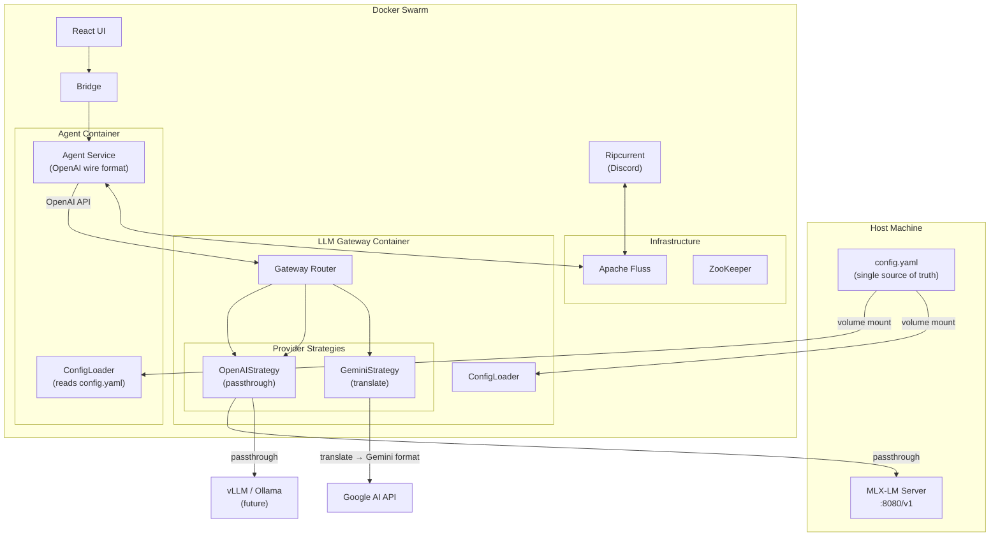
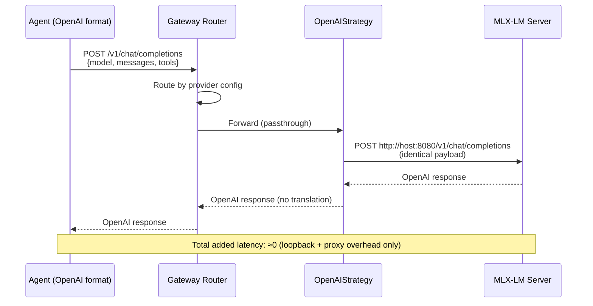
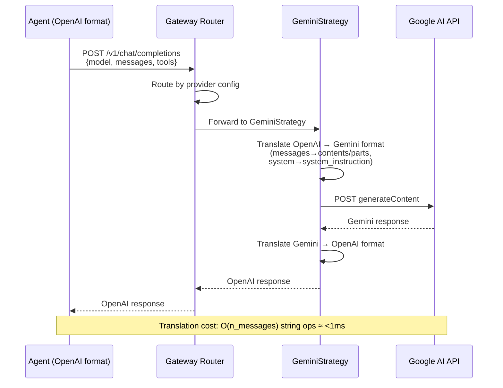
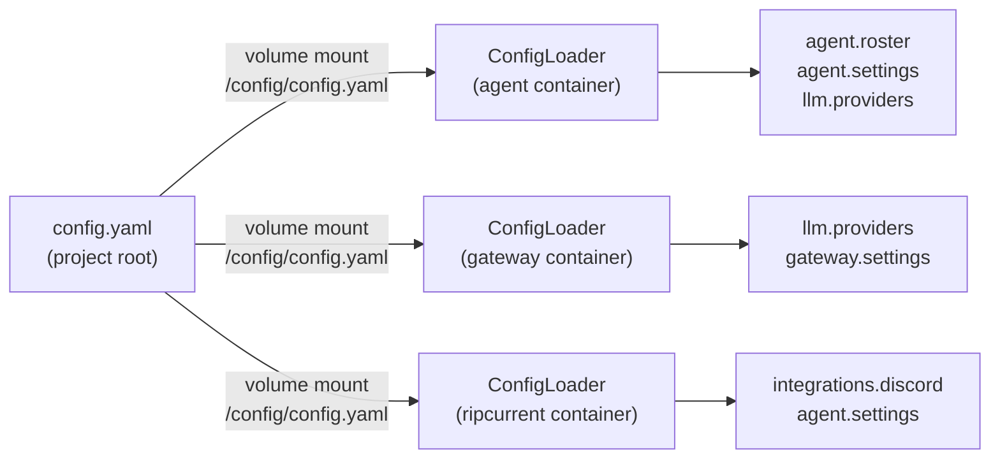
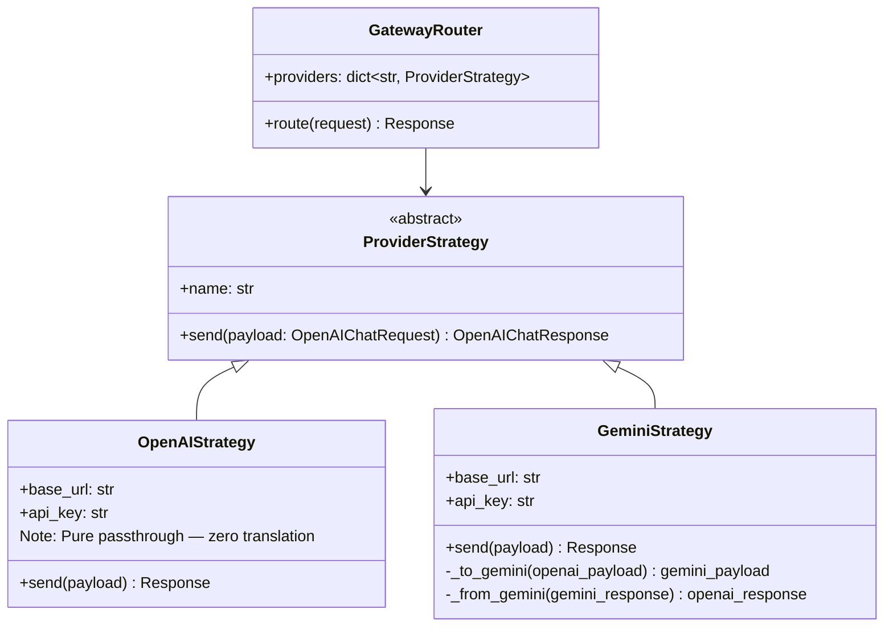

# Draft Pt.18 — Modular LLM Backend & Unified Configuration Refactor

> **Scope**: Refactor ContainerClaw from a Gemini-only, env-var-scattered system into a
> provider-agnostic, OpenAI-wire-compatible architecture with centralized YAML configuration
> and first-class local inference support (MLX).
>
> **Philosophy**: Start from first principles. The speed of light — not legacy design choices — is
> the only acceptable limiting factor.

---

## Table of Contents

1. [Problem Statement — What Is Broken and Why](#1-problem-statement)
2. [First Principles Analysis](#2-first-principles-analysis)
3. [Target Architecture](#3-target-architecture)
4. [Detailed Component Design](#4-detailed-component-design)
   - 4.1 [Unified `config.yaml`](#41-unified-configyaml)
   - 4.2 [Config Loader (`config_loader.py`)](#42-config-loader)
   - 4.3 [LLM Gateway Refactor — Provider Strategy Pattern](#43-llm-gateway-refactor)
   - 4.4 [Agent Refactor — OpenAI Wire Protocol](#44-agent-refactor)
   - 4.5 [Agent Roster — Declarative Configuration](#45-agent-roster)
   - 4.6 [Docker & Secrets Integration](#46-docker--secrets-integration)
5. [Migration Inventory — Every Hard-Coded Value](#5-migration-inventory)
6. [Implementation Phases](#6-implementation-phases)
7. [Risk Analysis & Mitigations](#7-risk-analysis--mitigations)
8. [Verification Plan](#8-verification-plan)

---

## 1. Problem Statement

### 1.1 The Gateway Is Hard-Wired to Gemini

`llm-gateway/src/main.py` has a single route (`/v1/chat/completions`) that:

- Constructs a Google-native `generateContent` URL with the API key as a query parameter (line 60)
- Builds a `google_payload` with `contents`, `system_instruction`, `generationConfig` — all Gemini-specific fields (lines 74–82)
- Forwards directly to `generativelanguage.googleapis.com` (line 86)

There is **no abstraction layer**. Adding a second provider requires forking the entire handler.

### 1.2 The Agent Speaks Gemini Natively

`agent/src/agent.py` (`GeminiAgent`) formats every message as:

```python
{"role": "model"/"user", "parts": [{"text": "..."}]}
```

This is the Gemini `contents` format. The OpenAI format is:

```python
{"role": "assistant"/"user", "content": "..."}
```

The `_call_gateway()` method sends `system_instruction` as a raw string, `contents` as the nested parts array, and `generationConfig` — all Google-proprietary fields.

### 1.3 Configuration Is Scattered Across 5+ Locations

| Location | What it holds | How it's loaded |
|---|---|---|
| `.env` / `.env.example` | `DEFAULT_MODEL`, `LLM_GATEWAY_URL`, `AUTONOMOUS_STEPS`, `CONCHSHELL_ENABLED`, `MAX_TOOL_ROUNDS`, etc. | Docker Compose `env_file` / `environment` |
| `agent/src/config.py` | Same values, re-read via `os.getenv()` with defaults | Python `import config` |
| `agent/src/main.py` L103–108 | Agent names, personas, API key loading | Hard-coded Python |
| `docker-compose.yml` L17–23, L67–69 | Gateway URL, Fluss bootstrap, rate limits | Docker Compose `environment` |
| `secrets/*.txt` | API keys | Docker Secrets mounted at `/run/secrets/` |
| `ripcurrent/src/main.py` L22–26 | Discord tokens, Fluss bootstrap, session ID | `get_secret()` + `os.getenv()` |

### 1.4 The Agent Roster Is Hard-Coded

```python
# agent/src/main.py lines 103-108
agents = [
    GeminiAgent("Alice", "Software architect.", api_key),
    GeminiAgent("Bob", "Project manager.", api_key),
    GeminiAgent("Carol", "Software engineer.", api_key),
    GeminiAgent("David", "Software QA tester.", api_key),
    GeminiAgent("Eve", "Business user.", api_key)
]
```

Adding, removing, or reassigning agents requires editing Python source. There is no way to give different agents different models or providers.

### 1.5 Local Inference (MLX) Is Stranded

The working MLX test (`scripts/mlx_batch_test.py`) uses the **OpenAI Python client**:

```python
client = AsyncOpenAI(base_url="http://127.0.0.1:8080/v1", api_key="mlx-is-cool")
await client.chat.completions.create(
    model="Qwen2.5-3B-Instruct-4bit",
    messages=[{"role": "user", "content": prompt}],
)
```

This proves that MLX-LM's built-in server already speaks the OpenAI API. But the gateway and agent cannot use it because they are locked to the Gemini wire format.

---

## 2. First Principles Analysis

### 2.1 The Speed of Light as the Constraint

The **only physically irreducible latency** in an LLM call is:

```
T_total = T_proxy_overhead + T_network_latency + T_TTFT + (N_tokens × T_per_token)
```

Where:
- **`T_proxy_overhead`**: Gateway routing + serialization/deserialization (JSON→Dict→JSON). For OpenAI passthrough, this is ≈0. For Gemini translation, this involves O(n_messages) string ops — negligible (<1ms), but the JSON parse/serialize cycle is where hidden milliseconds accumulate.
- **`T_network_latency`**: For local inference (MLX on Apple Silicon), ≈0 (loopback). For cloud APIs, bounded by `distance / c` plus TLS overhead.
- **`T_TTFT`**: Time to first token — model-dependent, irreducible.
- **`N_tokens × T_per_token`**: Token generation — model-dependent, irreducible.

Everything except `T_TTFT` and token generation must be **O(1) with negligible constant factors**.

**Design consequence**: The gateway should add ≈0 overhead for local calls and ≈1 RTT overhead for cloud calls. By using the OpenAI passthrough for MLX, `T_proxy_overhead ≈ 0`. For Gemini, the O(n) string manipulation is negligible, but minimizing JSON round-trips is critical.

### 2.2 The OpenAI Wire Format as Universal Language

Every major inference framework speaks OpenAI-compatible:

| Provider | OpenAI-Compatible? | Native Format |
|---|---|---|
| OpenAI | ✅ (canonical) | — |
| MLX-LM `server` | ✅ | — |
| vLLM | ✅ | — |
| Ollama | ✅ | — |
| llama.cpp `server` | ✅ | — |
| Google Gemini | ❌ | `contents/parts` |
| Anthropic Claude | ❌ | `messages` (similar but different) |

**Design consequence**: Standardize on OpenAI as the **internal wire protocol**. Translate only at the boundary — only when calling a non-OpenAI-compatible upstream (e.g., Gemini). For OpenAI-compatible backends (MLX, vLLM, Ollama), the gateway becomes a transparent proxy with zero translation cost.

#### 2.2.1 Chat Completions API vs Responses API

OpenAI now offers two APIs: the legacy **Chat Completions** (`/v1/chat/completions`) and the newer **Responses** (`/v1/responses`). The Responses API is recommended for new projects and provides better reasoning model performance, built-in tools, and stateful context.

However, for ContainerClaw's gateway, **we standardize on the Chat Completions wire format** because:

1. **Universal compatibility** — MLX-LM, vLLM, Ollama, and llama.cpp all implement `/v1/chat/completions`. None implement `/v1/responses`.
2. **Simpler translation** — The `messages` array format maps cleanly to Gemini's `contents` format. The Responses API uses `input`/`output` items with internally-tagged polymorphism, which would complicate the translation layer.
3. **Function calling compatibility** — Chat Completions uses `{type: "function", function: {name, parameters}}` for tool definitions. The Responses API uses `{type: "function", name, parameters}` (internally-tagged). Our agents' tool schemas map directly to the Chat Completions format.
4. **Future migration path** — When/if local inference servers adopt the Responses API, the strategy pattern makes this a per-provider change, not an architectural one.

### 2.3 Configuration as Data, Not Code

Agent count, personas, model assignments, LLM endpoints — these are **deployment parameters**, not business logic. Encoding them in Python source or flat env vars violates separation of concerns.

**Design consequence**: A single `config.yaml` at the project root defines:
- LLM provider endpoints and credentials references
- Agent roster (names, personas, model assignments)
- System tuning (rate limits, timeouts, tool rounds, history depth)
- Feature flags (ConchShell, autonomous mode)

---

## 3. Target Architecture

### 3.1 System Overview



### 3.2 Data Flow — LLM Call (Local MLX)



### 3.3 Data Flow — LLM Call (Cloud Gemini)



### 3.4 Configuration Flow



---

## 4. Detailed Component Design

### 4.1 Unified `config.yaml`

**Location**: `ContainerClaw/config.yaml` (project root)

This file replaces `.env`, `agent/src/config.py`, and all hard-coded values.

```yaml
# ContainerClaw Configuration — Single Source of Truth
# ====================================================

# --- LLM Provider Definitions ---
llm:
  providers:
    mlx-local:
      type: openai          # Uses OpenAI-compatible API (passthrough)
      base_url: "http://host.docker.internal:8080/v1"
      api_key: "mlx-is-cool"  # MLX doesn't validate keys
      models:
        - "Qwen2.5-3B-Instruct-4bit"
        - "Qwen2.5-72B-Instruct-4bit"

    gemini-cloud:
      type: gemini           # Requires translation layer
      base_url: "https://generativelanguage.googleapis.com/v1beta"
      api_key_secret: "gemini_api_key"   # References Docker Secret
      models:
        - "gemini-2.5-flash"
        - "gemini-2.5-flash-lite"
        - "gemini-3-flash-preview"
      settings:
        thinking_level: "HIGH"           # Gemini 3 thinking
        max_output_tokens: 8192

    openai-cloud:
      type: openai
      base_url: "https://api.openai.com/v1"
      api_key_secret: "openai_api_key"
      models:
        - "gpt-4o"
        - "gpt-4o-mini"

  # Default provider + model (used when agent config doesn't specify)
  default_provider: "mlx-local"
  default_model: "Qwen2.5-3B-Instruct-4bit"

# --- Agent Roster ---
agents:
  roster:
    - name: "Alice"
      persona: "Software architect."
      provider: "mlx-local"               # Override per agent
      model: "Qwen2.5-3B-Instruct-4bit"
    - name: "Bob"
      persona: "Project manager."
      # inherits default_provider / default_model
    - name: "Carol"
      persona: "Software engineer."
    - name: "David"
      persona: "Software QA tester."
    - name: "Eve"
      persona: "Business user."

  settings:
    max_history_messages: 100
    max_history_chars: 480000
    max_tool_rounds: 30
    autonomous_steps: -1
    conchshell_enabled: true

# --- Gateway Settings ---
gateway:
  port: 8000
  rate_limit_rpm: 60
  max_tokens_per_request: 8192
  retry:
    max_attempts: 3
    backoff_factor: 1
    status_forcelist: [429, 500, 502, 503, 504]
  connection_pool:
    pool_connections: 10
    pool_maxsize: 10

# --- Infrastructure ---
infrastructure:
  fluss:
    bootstrap_servers: "coordinator-server:9123"
  session:
    default_id: "default-session"

# --- Integrations ---
integrations:
  discord:
    bot_token_secret: "discord_bot_token"
    webhook_url_secret: "discord_webhook_url"
    channel_id_secret: "discord_channel_id"

# --- UI ---
ui:
  port: 3000
```

**Why YAML over TOML/JSON**: YAML supports comments (critical for operator documentation), multi-line strings (future prompt definitions), and anchors/aliases for DRY configuration. It is the standard for Docker Compose, Kubernetes, and Fluss itself.

### 4.2 Config Loader

**New file**: `shared/config_loader.py` — shared via Docker volume mount across all containers.

> **Review Note (§1 — Shared Volume vs. Copy)**: The original design proposed copying `config_loader.py` into each container, creating a maintenance trap where updates to config parsing logic could diverge. **Accepted fix**: The `shared/` directory is volume-mounted into all containers at `/app/shared`, ensuring a single source of truth for the config loader. This eliminates the risk of "update one, forget the other" drift while keeping zero external dependencies.

> **Review Note (§3 — Pydantic Validation)**: The original design used plain `dataclasses`. **Accepted fix**: We use **Pydantic `BaseModel`** instead for automatic type coercion, validation, and fail-fast error messages. A typo like `rate_limit_rpm: "sixty"` will produce a clear `ValidationError` at container startup rather than a cryptic `TypeError` at runtime. This adds `pydantic` to requirements but eliminates an entire class of silent config bugs.

```python
"""
Unified configuration loader for ContainerClaw.

Loads config.yaml from /config/config.yaml (Docker mount) or
falls back to environment variables for backward compatibility.
"""

import os
import yaml
from pathlib import Path
from pydantic import BaseModel, Field, field_validator
from typing import Optional

CONFIG_PATH = os.getenv("CLAW_CONFIG_PATH", "/config/config.yaml")

class ProviderConfig(BaseModel):
    name: str
    type: str                    # "openai" | "gemini"
    base_url: str
    api_key: str = ""            # Resolved from secret or inline
    api_key_secret: str = ""     # Docker secret name
    models: list[str] = []
    settings: dict = {}

class AgentConfig(BaseModel):
    name: str
    persona: str
    provider: str = ""           # Provider name (resolved to ProviderConfig)
    model: str = ""              # Model override

class ClawConfig(BaseModel):
    providers: dict[str, ProviderConfig]
    agents: list[AgentConfig]
    default_provider: str
    default_model: str
    # Agent settings
    max_history_messages: int = 100
    max_history_chars: int = 480000
    max_tool_rounds: int = 30
    autonomous_steps: int = -1
    conchshell_enabled: bool = True
    # Gateway settings
    gateway_port: int = 8000
    rate_limit_rpm: int = 60
    # Infrastructure
    fluss_bootstrap_servers: str = "coordinator-server:9123"
    session_id: str = "default-session"

    @field_validator("agents")
    @classmethod
    def validate_agent_providers(cls, agents, info):
        """Fail-fast: every agent must reference a valid provider."""
        providers = info.data.get("providers", {})
        default = info.data.get("default_provider", "")
        for agent in agents:
            effective_provider = agent.provider or default
            if effective_provider and effective_provider not in providers:
                raise ValueError(
                    f"Agent '{agent.name}' references unknown provider "
                    f"'{effective_provider}'. Available: {list(providers.keys())}"
                )
        return agents

def _resolve_secret(secret_name: str) -> str:
    """Read a Docker secret from /run/secrets/."""
    try:
        return Path(f"/run/secrets/{secret_name}").read_text().strip()
    except Exception:
        return ""

def load_config() -> ClawConfig:
    """Load and validate the unified configuration."""
    if not Path(CONFIG_PATH).exists():
        # Fallback: build config from env vars (backward compatibility)
        return _from_env()

    with open(CONFIG_PATH) as f:
        raw = yaml.safe_load(f)

    # Parse providers
    providers = {}
    for name, prov in raw.get("llm", {}).get("providers", {}).items():
        api_key = prov.get("api_key", "")
        if not api_key and prov.get("api_key_secret"):
            api_key = _resolve_secret(prov["api_key_secret"])
        providers[name] = ProviderConfig(
            name=name,
            type=prov["type"],
            base_url=prov["base_url"],
            api_key=api_key,
            api_key_secret=prov.get("api_key_secret", ""),
            models=prov.get("models", []),
            settings=prov.get("settings", {}),
        )

    # Parse agents
    default_prov = raw.get("llm", {}).get("default_provider", "")
    default_model = raw.get("llm", {}).get("default_model", "")
    agent_settings = raw.get("agents", {}).get("settings", {})
    agents = []
    for entry in raw.get("agents", {}).get("roster", []):
        agents.append(AgentConfig(
            name=entry["name"],
            persona=entry["persona"],
            provider=entry.get("provider", default_prov),
            model=entry.get("model", default_model),
        ))

    # Pydantic validates on construction — bad types or missing
    # providers will raise ValidationError immediately
    return ClawConfig(
        providers=providers,
        agents=agents,
        default_provider=default_prov,
        default_model=default_model,
        max_history_messages=agent_settings.get("max_history_messages", 100),
        max_history_chars=agent_settings.get("max_history_chars", 480000),
        max_tool_rounds=agent_settings.get("max_tool_rounds", 30),
        autonomous_steps=agent_settings.get("autonomous_steps", -1),
        conchshell_enabled=agent_settings.get("conchshell_enabled", True),
        gateway_port=raw.get("gateway", {}).get("port", 8000),
        rate_limit_rpm=raw.get("gateway", {}).get("rate_limit_rpm", 60),
        fluss_bootstrap_servers=(
            raw.get("infrastructure", {})
               .get("fluss", {})
               .get("bootstrap_servers", "coordinator-server:9123")
        ),
        session_id=(
            raw.get("infrastructure", {})
               .get("session", {})
               .get("default_id", "default-session")
        ),
    )

def _from_env() -> ClawConfig:
    """Backward-compatible: build ClawConfig from env vars."""
    # ... mirrors current agent/src/config.py behavior ...
    pass
```

**Key design decisions**:

1. **`_resolve_secret()`** maintains the Docker Secrets pattern — API keys never live in the YAML as plaintext for production. The YAML references secret names; the loader resolves them.
2. **`_from_env()` fallback** — existing `.env`-based deployments keep working during migration.
3. **Pydantic `BaseModel`** — automatic type coercion/validation with fail-fast errors at startup. The `validate_agent_providers` validator ensures no agent references a non-existent provider.
4. **Shared volume mount** — `shared/config_loader.py` is mounted at `/app/shared` in all containers, not copied. One source file, one truth.

### 4.3 LLM Gateway Refactor

**Architecture**: Strategy Pattern. The gateway becomes a thin router that delegates to provider-specific strategy classes.



#### 4.3.1 `llm-gateway/src/main.py` — Refactored

> **Review Note (§2 — Flask vs. FastAPI)**: The reviewer correctly identified that synchronous Flask + `requests.Session()` creates a bottleneck when multiple agents fire concurrent LLM calls. However, for **Phase 1-2**, Flask is retained to minimize the blast radius of changes (the current gateway is already Flask). The strategy pattern is framework-agnostic — upgrading to FastAPI + `httpx.AsyncClient` in a follow-up phase requires only changing the gateway's HTTP layer, not the strategies themselves. This is explicitly noted as a Phase 7 optimization.

```python
# The NEW gateway — provider-agnostic router
app = Flask(__name__)

from config_loader import load_config
from providers.openai_strategy import OpenAIStrategy
from providers.gemini_strategy import GeminiStrategy

STRATEGY_MAP = {
    "openai": OpenAIStrategy,
    "gemini": GeminiStrategy,
}

cfg = load_config()
strategies = {}
for name, prov in cfg.providers.items():
    cls = STRATEGY_MAP.get(prov.type)
    if cls:
        strategies[name] = cls(prov)

@app.route('/v1/chat/completions', methods=['POST'])
def proxy():
    data = request.json
    provider_name = data.pop("provider", cfg.default_provider)
    strategy = strategies.get(provider_name)
    if not strategy:
        return {"error": f"Unknown provider: {provider_name}"}, 400
    return strategy.send(data)
```

#### 4.3.2 `llm-gateway/src/providers/openai_strategy.py`

```python
class OpenAIStrategy:
    """Passthrough for OpenAI-compatible backends (MLX, vLLM, Ollama, OpenAI)."""

    def __init__(self, provider_config):
        self.base_url = provider_config.base_url
        self.api_key = provider_config.api_key
        self.session = self._build_session()

    def send(self, payload: dict) -> tuple[dict, int]:
        headers = {"Authorization": f"Bearer {self.api_key}"}
        url = f"{self.base_url}/chat/completions"
        res = self.session.post(url, json=payload, headers=headers, timeout=300)
        return res.json(), res.status_code
```

**Zero translation**. The agent sends OpenAI format; the backend expects OpenAI format. The gateway is a transparent authenticated proxy.

#### 4.3.3 `llm-gateway/src/providers/gemini_strategy.py`

```python
class GeminiStrategy:
    """Translates OpenAI wire format ↔ Gemini generateContent format."""

    def send(self, payload: dict) -> tuple[dict, int]:
        gemini_payload = self._to_gemini(payload)
        model = payload.get("model", "gemini-2.5-flash")
        url = f"{self.base_url}/models/{model}:generateContent?key={self.api_key}"
        res = self.session.post(url, json=gemini_payload, timeout=300)
        return self._from_gemini(res.json()), res.status_code

    def _to_gemini(self, openai_payload: dict) -> dict:
        """OpenAI messages → Gemini contents/parts."""
        contents = []
        system_instruction = ""
        for msg in openai_payload.get("messages", []):
            if msg["role"] == "system":
                system_instruction = msg["content"]
            else:
                role = "model" if msg["role"] == "assistant" else "user"
                contents.append({"role": role, "parts": [{"text": msg["content"]}]})

        gemini = {"contents": contents}
        if system_instruction:
            gemini["system_instruction"] = {"parts": [{"text": system_instruction}]}

        # Map tools (OpenAI function format → Gemini function_declarations)
        if openai_payload.get("tools"):
            gemini["tools"] = self._convert_tools(openai_payload["tools"])

        return gemini

    def _from_gemini(self, gemini_response: dict) -> dict:
        """Gemini response → OpenAI chat completion response."""
        # Extract text and function_calls, map to OpenAI choices format
        ...
```

**This is where ALL the Gemini-specific logic lives** — isolated in one file. The rest of the system never sees Gemini's wire format.

### 4.4 Agent Refactor — OpenAI Wire Protocol (Chat Completions)

**Current**: `GeminiAgent._call_gateway()` builds Gemini payloads.
**Target**: Rename to `LLMAgent` and build OpenAI Chat Completions payloads.

#### Key Changes to `agent/src/agent.py`

| Current (Gemini) | Target (OpenAI Chat Completions) |
|---|---|
| `GeminiAgent` class name | `LLMAgent` |
| `{"role": "model"/"user", "parts": [{"text": ...}]}` | `{"role": "assistant"/"user", "content": ...}` |
| `system_instruction` as raw string | `{"role": "system", "content": ...}` in messages |
| `generationConfig` | `temperature`, `max_tokens` top-level |
| `tools: [{function_declarations: [...]}]` | `tools: [{type: "function", function: {name, description, parameters}}]` |
| `tool_config: {function_calling_config: {mode: "ANY"}}` | `tool_choice: "required"` (or `"auto"` for default) |
| Response: `candidates[0].content.parts[*].text` | Response: `choices[0].message.content` |
| Response: `candidates[0].content.parts[*].functionCall` | Response: `choices[0].message.tool_calls[*].function.{name,arguments}` |
| `functionResponse` parts for multi-turn | `{"role": "tool", "tool_call_id": "...", "content": "..."}` messages |

#### OpenAI Tool Calling Wire Format (Chat Completions)

Per the OpenAI function calling docs, the multi-turn tool call flow is:

1. **Request tools definition**: Each tool uses `{type: "function", function: {name, description, parameters, strict}}`. Set `strict: true` + `additionalProperties: false` for reliable schema adherence.
2. **Response with tool calls**: `choices[0].message.tool_calls` is an array of `{id, type: "function", function: {name, arguments}}`. The `arguments` field is a JSON-encoded string.
3. **Submit tool results**: Append a message with `{role: "tool", tool_call_id: "<id>", content: "<result>"}` for each call.
4. **Parallel calls**: The model may return multiple `tool_calls` in a single response. All must be resolved before the next turn. Set `parallel_tool_calls: false` to force sequential calls.
5. **Tool choice**: `tool_choice: "auto"` (default), `"required"` (force call), `"none"` (disable), or `{type: "function", function: {name: "..."}}` (force specific function).

The agent also needs a `provider` field read from config, passed in the gateway request:

```python
class LLMAgent:
    def __init__(self, agent_id, persona, provider, model, gateway_url):
        self.agent_id = agent_id
        self.persona = persona
        self.provider = provider    # e.g., "mlx-local"
        self.model = model          # e.g., "Qwen2.5-3B-Instruct-4bit"
        self.gateway_url = f"{gateway_url}/v1/chat/completions"
```

### 4.5 Agent Roster — Declarative Configuration

**Current** (`agent/src/main.py` L103–108):

```python
agents = [
    GeminiAgent("Alice", "Software architect.", api_key),
    ...
]
```

**Target** (`agent/src/main.py`):

```python
from config_loader import load_config

cfg = load_config()

agents = []
for agent_cfg in cfg.agents:
    provider = cfg.providers.get(agent_cfg.provider or cfg.default_provider)
    agents.append(LLMAgent(
        agent_id=agent_cfg.name,
        persona=agent_cfg.persona,
        provider=agent_cfg.provider or cfg.default_provider,
        model=agent_cfg.model or cfg.default_model,
        gateway_url=cfg.llm_gateway_url,
    ))
```

Now adding a 6th agent or switching Carol to GPT-4o is a YAML edit — no code changes.

### 4.6 Docker & Secrets Integration

#### `docker-compose.yml` Changes

```yaml
services:
  claw-agent:
    volumes:
      - ./config.yaml:/config/config.yaml:ro   # NEW: mount config
      - ./workspace:/workspace:rw
      - ./.claw_state:/state:rw
    environment:
      - PYTHONUNBUFFERED=1
      - CLAW_CONFIG_PATH=/config/config.yaml    # NEW
      # Remove all LLM_GATEWAY_URL, DEFAULT_MODEL, etc.

  llm-gateway:
    volumes:
      - ./config.yaml:/config/config.yaml:ro    # NEW: mount config
    environment:
      - CLAW_CONFIG_PATH=/config/config.yaml    # NEW
      # Remove RATE_LIMIT_RPM, MAX_TOKENS_PER_REQUEST, etc.

    # For local MLX: the gateway needs to reach the host
    extra_hosts:
      - "host.docker.internal:host-gateway"
```

Secrets remain as Docker Secrets (the YAML references them by name, the config loader resolves them at runtime via `/run/secrets/`).

---

## 5. Migration Inventory

Every hard-coded value that must move to `config.yaml`:

| Current Location | Value | Config YAML Path |
|---|---|---|
| `.env` `DEFAULT_MODEL` | `gemini-3-flash-preview` | `llm.default_model` |
| `.env` `LLM_GATEWAY_URL` | `http://llm-gateway:8000` | Computed from `gateway.port` |
| `.env` `MAX_HISTORY_MESSAGES` | `100` | `agents.settings.max_history_messages` |
| `.env` `MAX_TOOL_ROUNDS` | `30` | `agents.settings.max_tool_rounds` |
| `.env` `CONCHSHELL_ENABLED` | `true` | `agents.settings.conchshell_enabled` |
| `.env` `AUTONOMOUS_STEPS` | `-1` | `agents.settings.autonomous_steps` |
| `.env` `RATE_LIMIT_RPM` | `60` | `gateway.rate_limit_rpm` |
| `.env` `MAX_TOKENS_PER_REQUEST` | `8192` | `gateway.max_tokens_per_request` |
| `.env` `ALLOWED_MODELS` | `gemini-2.5-flash*` | `llm.providers.*.models` |
| `.env` `FLUSS_BOOTSTRAP_SERVERS` | `coordinator-server:9123` | `infrastructure.fluss.bootstrap_servers` |
| `.env` `UI_PORT` | `3000` | `ui.port` |
| `agent/src/config.py` `MAX_HISTORY_CHARS` | `480000` | `agents.settings.max_history_chars` |
| `agent/src/main.py` L103–108 | Agent names/personas | `agents.roster[*]` |
| `agent/src/main.py` L97–98 | API key from `/run/secrets/` | `llm.providers.*.api_key_secret` |
| `agent/src/agent.py` L24 | `gateway_url` construction | `LLMAgent.__init__` from config |
| `llm-gateway/src/main.py` L33–44 | Retry/pool config | `gateway.retry.*`, `gateway.connection_pool.*` |
| `llm-gateway/src/main.py` L58 | Default model | `llm.default_model` |
| `llm-gateway/src/main.py` L66–72 | Gemini thinking config | `llm.providers.gemini-cloud.settings` |
| `ripcurrent/src/main.py` L22–26 | Discord secrets, Fluss bootstrap | `integrations.discord.*`, `infrastructure.fluss.*` |
| `docker-compose.yml` L21–23 | Env var pass-through | Removed — config.yaml mount |
| `docker-compose.yml` L67–69 | Gateway env vars | Removed — config.yaml mount |
| `ripcurrent/src/fluss_helpers.py` L14–24 | Duplicated `CHATROOM_SCHEMA` | (Already in `schemas.py` — unify import) |

---

## 6. Implementation Phases

### Phase 1: Config Foundation (No Behavioral Changes)

1. Create `config.yaml` at project root
2. Create `shared/config_loader.py`
3. Add `pyyaml` to `agent/requirements.txt` and `llm-gateway` Dockerfile
4. Mount `config.yaml` into containers via `docker-compose.yml`
5. Replace `agent/src/config.py` to use `config_loader.load_config()`
6. **Test**: Existing Gemini flow still works identically

### Phase 2: Gateway Strategy Pattern

1. Create `llm-gateway/src/providers/` package
2. Extract current Gemini logic into `gemini_strategy.py`
3. Create `openai_strategy.py` (transparent proxy)
4. Refactor `llm-gateway/src/main.py` to use router + strategies
5. Add `provider` field to gateway request schema
6. **Test**: Gemini calls work through the new strategy layer

### Phase 3: Agent Wire Protocol Migration

1. Rename `GeminiAgent` → `LLMAgent`
2. Rewrite `_format_history()` to emit OpenAI messages
3. Rewrite `_call_gateway()` to send OpenAI payload with `provider` field
4. Rewrite `_extract_text()` and `_extract_function_calls()` for OpenAI response format
5. Rewrite `_think_with_tools()` to use OpenAI tool format
6. Rewrite `_send_function_responses()` for OpenAI multi-turn tool protocol
7. Update `SubagentManager` to use `LLMAgent`
8. **Test**: Full election + tool cycle works through new wire format

### Phase 4: Declarative Agent Roster

1. Replace hard-coded agent list in `agent/src/main.py` with config-driven loop
2. Support per-agent `provider` and `model` overrides
3. Remove API key threading from `main.py` → `_init_moderator`
4. **Test**: Add/remove agents via `config.yaml`, verify election works

### Phase 5: MLX Local Inference Integration

1. Start MLX server: `python -m mlx_lm server --model ./Qwen2.5-3B-Instruct-4bit --port 8080`
2. Set `llm.default_provider: mlx-local` in `config.yaml`
3. Add `extra_hosts: ["host.docker.internal:host-gateway"]` to gateway compose
4. **Test**: End-to-end task completion using local Qwen model

### Phase 6: Cleanup

1. Remove `.env.example` LLM-related entries (keep `PROJECT_DIR` only)
2. Delete `agent/src/config.py` (replaced by `config_loader`)
3. Update `README.md` with new setup instructions
4. Update `claw.sh` to validate `config.yaml` exists

---

## 7. Risk Analysis & Mitigations

| Risk | Impact | Mitigation |
|---|---|---|
| **Gemini function calling protocol differs from OpenAI** | Tool use breaks during migration | `GeminiStrategy._to_gemini()` handles full tool format translation; Phase 2 tests validate tool round-trips before touching agent code |
| **MLX doesn't support function calling natively** | Agents can't use tools with local models | See §7.1 below for detailed mitigation |
| **YAML syntax errors break all containers** | System fails to start | Pydantic `ClawConfig` validation catches type errors at startup; `_from_env()` fallback; `claw.sh up` validates YAML before `docker compose up` |
| **Docker `host.docker.internal` not available on Linux** | MLX unreachable from containers | Use `extra_hosts` directive; document Linux workaround (`--add-host`) |
| **Breaking change to gateway API** | Bridge, agent, scripts break simultaneously | Gateway maintains backward compatibility during Phase 2 (old format still accepted, auto-detected) |
| **Ripcurrent schema duplication** | `fluss_helpers.py` diverges from `schemas.py` | Phase 6 cleanup: ripcurrent imports from shared config module, or schema is duplicated intentionally with a version check |
| **Agent references non-existent provider** | "Carol" agent created without a brain | `ClawConfig.validate_agent_providers()` Pydantic validator fails-fast at startup with a clear error |

### 7.1 MLX Function Calling Parity

> **Review Note (§5)**: The reviewer correctly noted that models like Qwen 2.5 are capable of function calling when the prompt is formatted correctly, even on "dumb" local servers.

The MLX-LM server (`mlx_lm.server`) exposes an OpenAI-compatible `/v1/chat/completions` endpoint. Whether it supports the `tools` field depends on the model and the server's implementation:

1. **Best case**: The MLX server passes the `tools` JSON through to the model's chat template, and the model (e.g., Qwen 2.5) generates valid `tool_calls` in its response. This works out of the box with the OpenAI passthrough strategy.
2. **Degraded case**: The MLX server ignores the `tools` field or the model doesn't generate structured tool calls. In this case, the `OpenAIStrategy` can inject a **ReAct-style prompt template** that formats the available tools as text in the system message, instructing the model to output JSON tool calls in a parseable format.
3. **Fallback case**: Set `conchshell_enabled: false` per-provider in config to disable tools entirely for that provider.

**Implementation**: The `OpenAIStrategy` will check if the provider has a `settings.tool_prompt_injection: true` flag. If set, it injects tool definitions into the system prompt as a formatted text block before forwarding. This ensures agents retain agentic capabilities even on backends that don't natively handle the `tools` field.

---

## 8. Verification Plan

### 8.1 Unit Tests

```bash
# Config loader
python -m pytest tests/test_config_loader.py -v
# Tests: load from YAML, fallback to env, secret resolution, missing fields

# Strategy translation
python -m pytest tests/test_gemini_strategy.py -v
# Tests: OpenAI→Gemini→OpenAI round-trip for messages, tools, function calls

# Agent wire format
python -m pytest tests/test_llm_agent.py -v
# Tests: _format_history produces valid OpenAI messages
```

### 8.2 Integration Tests

```bash
# Phase 2: Gateway routes correctly
curl -X POST http://localhost:8000/v1/chat/completions \
  -H "Content-Type: application/json" \
  -d '{"provider":"mlx-local","model":"Qwen2.5-3B-Instruct-4bit",
       "messages":[{"role":"user","content":"Hello"}]}'

# Phase 5: Full MLX round-trip
python scripts/mlx_batch_test.py  # Already works — validates MLX server

# Phase 4: Dynamic roster
# 1. Edit config.yaml to add a 6th agent "Frank"
# 2. ./claw.sh restart
# 3. Verify election includes Frank
```

### 8.3 Configuration Consistency Check

> **Review Note (Verification Plan Addition)**: Added a pre-flight consistency check script.

A startup validation script (`scripts/validate_config.py`) runs before container launch:

```bash
python scripts/validate_config.py config.yaml
```

This script:
1. Parses `config.yaml` via `load_config()` (Pydantic validation catches type errors)
2. Verifies every agent in `roster` has a valid `provider` and `model` defined in `llm.providers`
3. Verifies every referenced `api_key_secret` has a corresponding file in `secrets/`
4. Reports all errors at once (not fail-on-first) for operator convenience

`claw.sh up` calls this script before `docker compose up`.

### 8.4 End-to-End Smoke Test

1. `./claw.sh up` with `mlx-local` as default provider
2. Open `http://localhost:3000`
3. Submit task: "Read the README and summarize it"
4. Verify: Election runs, agent uses tools, response appears in UI
5. Switch `config.yaml` to `gemini-cloud`, restart, repeat
6. Both providers produce valid responses

---

## Appendix A: File Change Summary

| File | Action | Description |
|---|---|---|
| `config.yaml` | **NEW** | Single source of truth for all configuration |
| `shared/config_loader.py` | **NEW** | YAML parser + secret resolver (copied into containers) |
| `llm-gateway/src/providers/__init__.py` | **NEW** | Provider strategy package |
| `llm-gateway/src/providers/openai_strategy.py` | **NEW** | Passthrough strategy for OpenAI-compatible backends |
| `llm-gateway/src/providers/gemini_strategy.py` | **NEW** | Translation strategy for Gemini API |
| `llm-gateway/src/main.py` | **MODIFY** | Replace monolithic handler with strategy router |
| `agent/src/agent.py` | **MODIFY** | `GeminiAgent` → `LLMAgent`, OpenAI wire format |
| `agent/src/main.py` | **MODIFY** | Config-driven roster, remove hard-coded agents |
| `agent/src/config.py` | **DELETE** | Replaced by `config_loader` |
| `agent/src/tool_executor.py` | **MODIFY** | Update imports (`GeminiAgent` → `LLMAgent`) |
| `agent/src/subagent_manager.py` | **MODIFY** | Update imports, pass provider config |
| `agent/src/moderator.py` | **MODIFY** | Update imports |
| `docker-compose.yml` | **MODIFY** | Add config mount, `extra_hosts`, remove env vars |
| `.env.example` | **MODIFY** | Strip LLM config (keep `PROJECT_DIR` only) |
| `ripcurrent/src/main.py` | **MODIFY** | Use config_loader for settings |
| `README.md` | **MODIFY** | New setup instructions |

## Appendix B: Future Work (Out of Scope)

These items are explicitly **deferred** to future refactors:

1. **Prompt templates in config.yaml** — Moving agent system instructions, election prompts, and tool descriptions into the YAML. This enables prompt versioning and A/B testing without code deploys.

2. **SELF.md / MEMORY.json** — Per-agent persistent memory files that survive across sessions. Would be referenced in config.yaml as paths.

3. **Telemetry & Observability** — Structured logging of every LLM API call: latency, token counts, provider, model, cost. Enables per-agent performance dashboarding.

4. **FastAPI + httpx migration (Phase 7)** — Replace Flask with FastAPI and `requests.Session` with `httpx.AsyncClient` in the gateway. This eliminates the synchronous bottleneck where concurrent agent requests are handled one-by-one. The strategy pattern is framework-agnostic, so this is a drop-in replacement for the HTTP layer. Priority: after Phases 1-6 are stable.

5. **OpenAI Responses API migration** — When local inference servers adopt the Responses API (`/v1/responses`), individual provider strategies can be updated to use the new API shape (richer tool semantics, stateful context, encrypted reasoning) without changing the agent code.

## Appendix C: Review Feedback Disposition

| # | Feedback | Disposition | Action |
|---|---|---|---|
| §1 | Copied module maintenance trap | **Accepted** | Changed to shared volume mount (`shared/` → `/app/shared` in all containers) |
| §2 | Flask sync bottleneck | **Noted, deferred** | Valid concern. Flask retained for Phase 1-2 to minimize blast radius. FastAPI migration added as Phase 7 / Appendix B item 4. Strategy pattern is framework-agnostic. |
| §3 | Pydantic config validation | **Accepted** | `ClawConfig` and sub-models switched from `dataclass` to `pydantic.BaseModel`. Added `validate_agent_providers` cross-validation. |
| §5 | MLX function calling parity | **Accepted, expanded** | Added §7.1 with three-tier mitigation (native support → ReAct prompt injection → fallback disable). Added `tool_prompt_injection` provider setting. |
| — | Revised latency equation | **Accepted** | Updated §2.1 with decomposed `T_total` equation including `T_proxy_overhead`, `T_TTFT`, per-token terms. |
| — | Consistency check script | **Accepted** | Added §8.3 with pre-flight `validate_config.py` script and `claw.sh` integration. |
