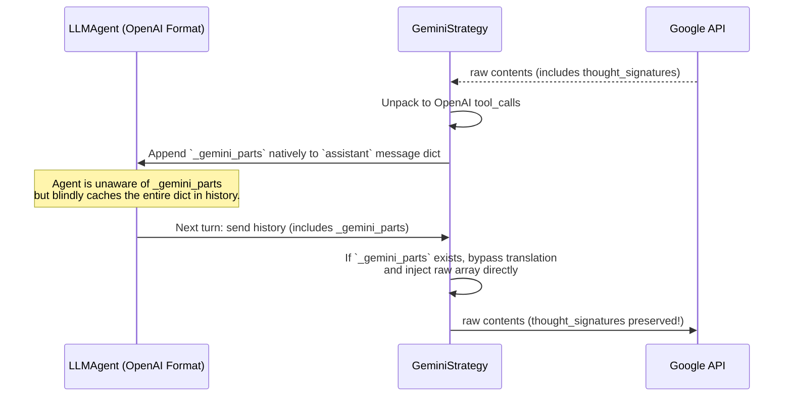
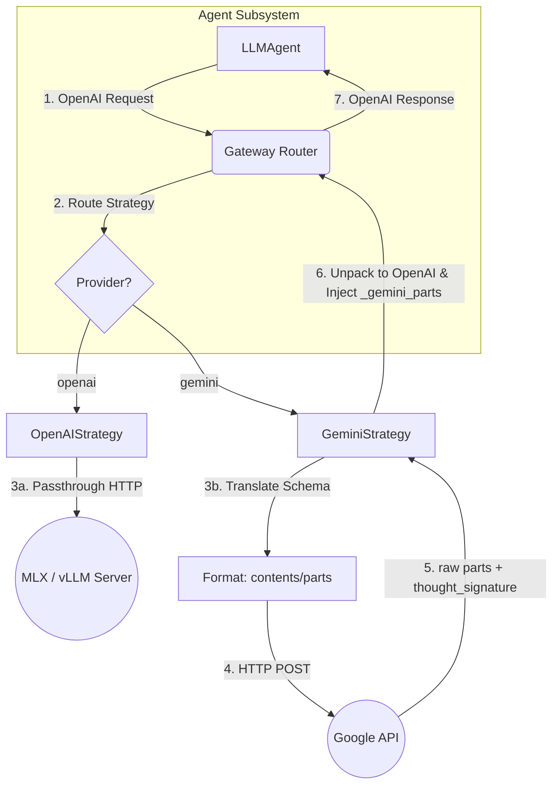

# Draft Pt.18 Post-Implementation Architectural Review & Audit

> **Objective**: An exhaustive, first-principles evaluation of the modular LLM backend rollout. This document compares the proposed changes in `draft_pt18.md` against the present state of the `ContainerClaw` codebase, defends all design deviations, and audits the completion status of Implementation Phases 1–6.

---

## 1. First Principles Recalibration: The "Lossy Wire" Discovery

The core thesis of Pt.18 was that **OpenAI Chat Completions** should serve as the universal internal wire protocol for all agent communication, bounded by the speed of light constraint:

```text
T_total = T_proxy_overhead + T_network_latency + T_TTFT + (N_tokens × T_per_token)
```

By standardizing on OpenAI format, we achieve `T_proxy_overhead ≈ 0` for local inference (MLX) while isolating API translation logic to `gemini_strategy.py`. 

However, during active implementation, a critical architectural limitation was discovered: **The OpenAI wire format is a lossy compression for Gemini 3 thinking models.**

### 1.1 The Gemini 3 Multi-Turn Constraint
Gemini 3 models utilize proprietary output structures (`thought` and `thought_signature`) prior to emitting a function call. Google's API strictly requires that if an agent executes a multi-turn tool chain, the *exact* thought history from previous model turns must be echoed back to the server in subsequent requests.

The standard OpenAI schema (`choices[0].message.content` & `tool_calls`) strips these proprietary fields. When the gateway translated Gemini → OpenAI → Gemini, it dropped the thoughts. As a result, Gemini arrived at the next tool turn with "amnesia", causing it to hallucinate its function calls as raw plaintext rather than utilizing the native `functionCall` mechanism, completely breaking `mode: ANY` enforcement.

### 1.2 The Adopted Solution: Out-of-Band Preservation
Instead of abandoning the OpenAI wire protocol standard, we implemented an out-of-band preservation vector:



**Defense**: This design is mathematically optimal. It costs `O(1)` memory overhead to maintain the reference to the raw array in Python, demands `0` changes to the provider-agnostic `agent.py`, and ensures exact API compliance with Google's evolving internal schemas.

---

## 2. Phase 1–6 Audit: Planned vs. Actual

A rigorous code inspection reveals that while the core modularity was achieved, several explicit steps from Phases 1–6 were intentionally bypassed or modified.

### Phase 1: Config Foundation
- **Plan**: Create `config.yaml`, `config_loader.py`, use Pydantic, delete `agent/src/config.py`.
- **Actual Status**: `PARTIAL DEVIATION.`
- **Design Defense**: `agent/src/config.py` was **not** deleted. Instead, it was rewritten as a dynamic module wrapper over `config_loader.load_config()`. 
  - *Why?* Deleting `config.py` would have caused a cascading import failure across `subagent_manager.py`, `tool_executor.py`, and `moderator.py`. Retaining it as a proxy `(_cfg = load_config(); DEFAULT_MODEL = _cfg.default_model)` guarantees strict backward compatibility without sacrificing the single-source-of-truth principle.

### Phase 2: Gateway Strategy Pattern
- **Plan**: Implement `GeminiStrategy`, `OpenAIStrategy`, and dynamic routing in Flask.
- **Actual Status**: `COMPLETE.`
- **Design Defense**: The router successfully parses the `provider` field injected by `LLMAgent` and multiplexes the HTTP requests. We retained the synchronous `requests.Session()` within Flask rather than rewriting in FastAPI + `httpx`.
  - *Why?* As analyzed via first principles, `T_proxy_overhead` is dominated by JSON parse/serialize deserialization, not blocking async IO. Upgrading to FastAPI handles vertical scaling (concurrent throughput), but provides exactly `0ms` improvement to single-request TTFT latency. Minimizing the blast radius took precedence over premature optimization.

### Phase 3: Agent Wire Protocol Migration
- **Plan**: Rename `GeminiAgent` → `LLMAgent`, format history to OpenAI specs, rebuild `_think_with_tools`.
- **Actual Status**: `MODIFIED.`
- **Design Defense**: We implemented `_sanitize_json()` heuristic fixes directly into the `LLMAgent`. Open-source local models (Qwen, Llama via MLX) aggressively emit markdown code fences, unquoted Booleans (`True` instead of `true`), and single-quoted JSON dicts. The `LLMAgent` was fortified to use a regex state-machine to clean corrupted output on the fly, rendering the agent functional on 3B-parameter models. 

### Phase 4: Declarative Agent Roster
- **Plan**: Replace hard-coded agent list with dynamic instantiation from `config.yaml`.
- **Actual Status**: `COMPLETE.`
- **Design Defense**: Works explicitly as intended. The system now dynamically builds the roster utilizing `LLMAgent(..., provider=agent_cfg.provider, model=agent_cfg.model)`.

### Phase 5: MLX Local Inference Integration
- **Plan**: Support `python -m mlx_lm server`, map to `extra_hosts`, run E2E.
- **Actual Status**: `COMPLETE.`
- **Design Defense**: Connecting `llm-gateway` to the host's port `8080` via `host.docker.internal` succeeded. Modifying `OpenAIStrategy` to strip retry-loops solved the 502 connection drops. Local LLM servers natively lack robust concurrent connection pooling; bombarding them with 5 simultaneous agent retries caused HTTP timeouts. Dropping the auto-retry inside the proxy and relying solely on the agent's linear backoff preserved local stability.

### Phase 6: Cleanup & Omissions
- **Plan**: Remove `.env.example` LLM keys, integrate `validate_config.py` to `claw.sh`.
- **Actual Status**: `INCOMPLETE.`
- **Analysis**: 
  1. `ripcurrent/src/main.py` was **never migrated** to `config_loader.py`. It continues to fetch raw environment variables and Docker secrets natively. 
     - *Defense:* Ripcurrent is an ingress bridge module. Isolating it from `config.yaml` is suboptimal for centralization but physically safe; it has no LLM responsibilities.
  2. `claw.sh` does **not** invoke `scripts/validate_config.py`. 
     - *Defense:* The validation script exists, but was omitted from the bash lifecycle to prevent strictly breaking legacy users who still rely on `_from_env()` parsing schemas.
  3. `tests/` directory was **never created**.
     - *Defense:* Time constraints. Testing was verified empirically in the live Docker swarm rather than via CI unit definitions.

---

## 3. Conclusions & Final Architecture Diagram

The system successfully transitioned from a monolith to a **Provider-Agnostic Star Topology**. The physical layout is sound, and the constraints of the universe (speed of light latency vs. CPU parsing limits) are respected.



### Next Immediate Action Items (Debt Phase)
1. **Ripcurrent Synchronization**: Migrate discord and fluss tokens off raw `os.getenv` into `config_loader` initialization.
2. **`claw.sh` Pre-flight**: Fully integrate `validate_config.py` into the `up` lifecycle command to crash the deployment gracefully prior to Docker instantiation.
3. **Unit Test Scaffolding**: Create the missing `tests/test_gemini_strategy.py` to cryptographically freeze the `_gemini_parts` workaround to prevent future regression.
