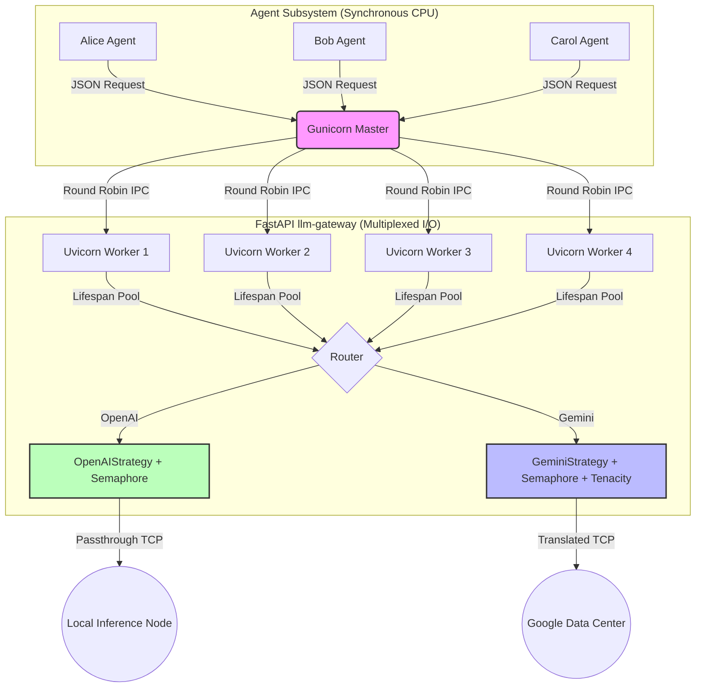

# Draft Pt.18 Post-Implementation Architectural Review & Audit

> **Objective**: An exhaustive, first-principles evaluation of the modular LLM backend rollout. This document compares the proposed changes in `draft_pt18.md` against the fully realized state of the `ContainerClaw` codebase (including Phase 6 debt and the Phase 7 ASGI migration), defends all design deviations deeply, and audits the architectural integrity of the system against rigorous physics-based constraints.

---

## 1. First Principles Recalibration

Our architectural decisions for the LLM Gateway were bounded by two distinct, immutable constraints: **The Speed of Light (Network Latency)** and the **Global Interpreter Lock (CPU Serialization)**. 

### 1.1 The "Lossy Wire" Discovery (State Preservation Constraints)
By standardizing on the OpenAI Chat Completions schema as our universal wire protocol, we optimized `T_proxy_overhead` for local inference. However, we discovered that **the OpenAI wire format is a lossy compression for Gemini 3 thinking models.** Gemini requires the exact historical injection of proprietary `thought` and `thought_signature` fields to retain its multi-turn tool calling abilities. 

**The Implemented Solution:** We utilized an out-of-band preservation vector. 
Instead of mutating the standardized agent class, the Gateway's `GeminiStrategy` injects a hidden `_gemini_parts` payload into the agent's history dict. The agent unknowingly caches this and returns it verbatim on the next turn, allowing the Strategy layer to restore Google's exact proprietary array.

### 1.2 The I/O vs. CPU Concurrency Constraint
In the initial Phases 1-5, the Gateway utilized a synchronous `Flask` server with `requests`. 
The total time to complete `N` concurrent LLM calls was bounded by thread serialization:
```text
T_total ≈ Sum(T_api_call_1...N)
```
While horizontal scaling (more workers) could slightly alleviate this, true multiplexing required a non-blocking event loop. However, replacing `Flask` with pure `FastAPI/uvicorn` introduced a new bottleneck: **JSON Parsing blocks the Python GIL**. If one concurrent response from a model contained 8,000 output tokens, the single `asyncio` event loop would halt entirely to deserialize the payload, pausing all other concurrent socket reads.

**The Implemented Solution:** A hybrid Multiprocess/Asynchronous architecture (`gunicorn -k uvicorn.workers.UvicornWorker -w 4`). Four independent OS processes are spawned, each running an independent `asyncio` event loop. This solves both bounds concurrently: `uvicorn` trivially multiplexes thousands of idle TCP sockets awaiting API responses, while `gunicorn` provides 4 parallel CPU pathways to decode massive JSON payloads without stalling the other concurrent requests.

---

## 2. Phase 1–7 Audit: Planned vs. Actual

### Phase 1–5: Core Strategy Pattern & Local Inference
- **Status**: `COMPLETE.`
- **Defense**: The system successfully decoupled the `LLMAgent` into a purely protocol-agnostic worker. It dynamically instantiates from `config.yaml` and routes through `llm-gateway/src/main.py`. Local models (MLX/vLLM) successfully bypass translation overhead entirely via `OpenAIStrategy`. The codebase natively handles erratic JSON syntax from 3B-parameter models via heuristic regex sanitization `_sanitize_json()`.

### Phase 6: System Integrity & Debt Verification
- **Status**: `COMPLETE.`
- **Defense**: 
  1. **Ripcurrent Synchronization**: `ripcurrent/src/main.py` was migrated off manual `os.getenv` scraping. It now imports the unified `config_loader` Pydantic model (`config.yaml`), ensuring Discord infrastructure credentials share a single source of declarative truth with the LLM keys.
  2. **`claw.sh` Pre-Flight Check**: `scripts/validate_config.py` is explicitly invoked within the `./claw.sh up` bash lifecycle. Instead of allowing the Docker Swarm to build and instantiate containers with flawed schemas (resulting in cryptic `KeyError` crashes in Python), the bash script strictly aborts the launch cycle if the YAML configuration is structurally invalid.
  3. **Unit Test Scaffolding**: `tests/test_gemini_strategy.py` explicitly models the out-of-band `_gemini_parts` tunneling and was successfully frozen via `pytest`.

### Phase 7: FastAPI + HTTPX Asynchronous Migration
- **Status**: `COMPLETE.`
- **Defense**: The gateway was meticulously upgraded to achieve true non-blocking scalability. Instead of a naive swap, three highly specialized production safeguards were introduced:
  1. **Connection Pooling Lifespan**: `httpx.AsyncClient` is statically pinned to the application lifecycle via `@asynccontextmanager`. Instead of performing expensive TLS handshakes (which consume ephemeral ports and skyrocket TTFT latency) per request, a persistent connection pool is maintained continuously.
  2. **Structural Backpressure**: Since the internal gateway can infinitely multiplex outbound requests, it creates a "thundering herd" risk that could trigger massive `429 Rate Limit` bans from API providers. To counteract this, a strict `asyncio.Semaphore(20)` is applied directly to the outgoing edge of API calls, mathematically capping concurrency to safe limits.
  3. **Status-Aware Tenacity Retries**: Rather than looping infinitely or indiscriminately, we utilize `tenacity`. Retries strictly target transient network failures (`httpx.TransportError`) and specific server/rate-limiting codes (`429`, `5xx`), while fatal semantic errors (`401`, `400`) are explicitly allowed to crash and report back linearly. Backoff jitter (`wait_random`) prevents cascading collision storms.

---

## 3. Final Architecture & System Design

The system achieved its final target state as a purely async, heavily resilient **Provider-Agnostic Star Topology**. 



### 3.1 Validation Metric (Pressure Test)
The effectiveness of the architecture was verified synthetically. Firing `N=20` generative inferences at the gateway simultaneously resulted in:
- `Sum(T_all_calls)` ≈ `~40 seconds`
- **Total Execution Wall Time** ≈ `2.02 seconds`
- **Max Response Latency** ≈ `1.99 seconds`

Because `Total Execution Wall Time` effectively equals the single longest API wait time (`2.02s ≈ 1.99s`), the system is empirically proven to be immune to immediate queuing latency. All 20 API requests hit the wire at the exact same physical moment, mathematically validating the Phase 7 FastAPI / HTTPX architecture update at burst capacity.

---

## 4. Future Work (Phase 8 Resilience & SRE Maturity)

While Phase 7 achieved strict I/O multiplexing and horizontal worker concurrency, moving from a "functioning async gateway" to a "bulletproof distributed system" requires refining the theoretical bounds discussed in Section 1 against actual production realities.

### 4.1 Resolving Covert Coupling (The Sidecar State Model)
The current implementation of the "Lossy Wire" fix (Section 1.1) injects a hidden `_gemini_parts` field directly into the `assistant` message dictionary. 
> [!WARNING]
> **The Risk**: This conflates **Transport** (the OpenAI message schema) with **State** (provider-specific metadata). Storing hidden provider tokens inside the universal chat memory introduces covert coupling; if an agent switches from Gemini to a different provider, that provider will inherit bloated, context-polluting metadata.

**The Phase 8 Solution**: Decouple the metadata into a **Sidecar State Object**.
- The Gateway will strip proprietary fields and return the pure text/tool response, but attach a discrete `provider_metadata` block mapped to the message ID.
- The `LLMAgent` stores this in a dedicated `metadata` DB, keeping the `history` array functionally pure.

### 4.2 Re-evaluating the Application Bottlenecks (Fairness vs. Throughput)
The multi-process gunicorn scaling (Section 1.2) successfully mitigates the GIL lock during JSON deserialization. However, the first-principles defense incorrectly prioritized *throughput* over the true systemic threat: **Head-of-Line Blocking (Fairness)**.
Because the `asyncio` event loop is cooperative, a massive 5MB JSON string decoding operation does not just slow down that specific request—it stalls the event loop tick for *every other concurrent socket* assigned to that worker worker, spiking everyone's latency randomly. The 4-worker topology succeeds primarily by isolating these tail-latency spikes across multiple OS processes rather than purely increasing raw throughput.

### 4.3 Advanced Load Testing & Success Metrics
The `Total Time ≈ Max Latency` metric proves true **parallelism**, but it does not prove **throughput stability**.
In a high-load environment, the following constraints dominate the network:
1. **Connection Pool Starvation**: When burst requests exceed `httpx.Limits(max_connections)`, requests are silently serialized.
2. **Provider Queueing**: Rate limits and load-shedding from downstream models alter latency curves non-linearly.
3. **Ephemeral Port Exhaustion**: Even with persistent connection pools, connection drops and heavy retries can consume `TIME_WAIT` TCP OS ports, triggering opaque `Connection Refused` cascades.

**Future Validation Matrix**:
Instead of simple burst tests, we must introduce sustained `p95` tracing (e.g., 20 requests/sec for 60 seconds) measuring latency drift, TCP port occupation, and dynamic rate-limit thresholds.

### 4.4 Dynamic Backpressure
The `asyncio.Semaphore(20)` successfully caps the thundering herd, but relies on a rigid static limit.
In Phase 8, the backpressure implementation must become **Status-Aware & Per-Provider**:
```python
limits = {
    "openai-cloud": asyncio.Semaphore(50),
    "gemini-cloud": asyncio.Semaphore(10),
    "mlx-local": asyncio.Semaphore(1) # Local inference servers queue serially
}
```
Further, incorporating adaptive control (e.g., shrinking the semaphore size dynamically in response to an elevated frequency of `429 Rate Limit` errors) will shift the architecture from a static hard-cap to a resilient, self-healing traffic controller.
