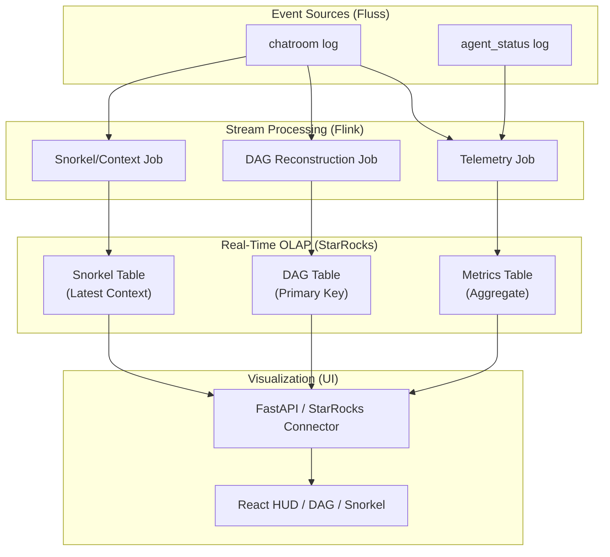

# Draft Pt.19 — Real-Time Telemetry: Flink-StarRocks Analytics Pipeline

> **Scope**: Implement a high-performance observability layer for ContainerClaw using Apache Flink for stream processing and StarRocks for real-time OLAP. This enables the "Snorkel" (context window debugger), the "Agentic DAG" (swarm visualization), and live system metrics.
>
> **Philosophy**: Observability is not an afterthought; it is the feedback loop that prevents agentic entropy. The "Speed of Light" constraint dictates that the time from an agent's thought to its visualization must be sub-second, requiring a zero-blocked, push-based analytics architecture.

---

## 1. Problem Statement

### 1.1 The Fluss "Scan" Bottleneck
Currently, the `FlussClient.fetch_history` and `list_sessions` methods rely on log scanners. To reconstruct a session or find the latest state, the system must:
1. Discover buckets.
2. Poll batches of Arrow data.
3. Manually deduplicate/sort in Python memory.

As the number of agents and subagents grows, this $O(N)$ scanning approach introduces linear latency increases, making real-time "Snorkel" views (the actual context window of an agent) and "Live DAG" updates impossible at scale.

### 1.2 Lack of Structural Inference
The raw `chatroom` table stores flat events. It does not natively represent the **hierarchy** of subagents (e.g., Agent Alice spawning Subagent Alice-1). Reconstructing the "Tree of Thoughts" or the "Agentic DAG" requires stateful processing that Fluss, as a storage layer, is not designed to perform.

### 1.3 Metrics Blindness
There is currently no way to query aggregate system health (e.g., "What is the tool success rate across all agents in the last 5 minutes?") without scanning the entire Fluss log and performing manual aggregations.

---

## 2. First Principles Analysis

### 2.1 The Latency of Perception
For a human operator to effectively "Moderator" a swarm, the UI must reflect the swarm's state within the human perceptual window (~100-200ms).
```
T_vis = T_event_emit + T_ingest + T_process + T_query + T_render
```
To minimize `T_vis`, we must eliminate `T_query` latency by moving from **Pull-on-Demand** (scanning Fluss) to **Push-to-State** (StarRocks Primary Key tables).

### 2.2 The State vs. Stream Duality
- **The Stream (Fluss)**: The immutable record of what happened. Essential for reproducibility and audit trails.
- **The State (StarRocks)**: The materialized view of the "Now." Essential for the UI and Agent Awareness.

**Design Consequence**: We treat Flink as the "State Machine" that consumes the Fluss stream and updates the StarRocks "Current State" in real-time.

---

## 3. Target Architecture

**The "Run" Boundary**: To track discrete tasks, the system generates a `run_id` upon a human prompt and closes it upon `is_done`. This `run_id` is propagated through all Flink jobs to allow for clean trajectory analysis and distinguish individual attempts from broader session metrics.



---

## 4. Detailed Component Design (MVP Integration)

### 4.1 Flink Job: The DAG Reconstructor
**Logic**: Consumes `chatroom` events. It watches for `type="spawn"` or messages with a `parent_actor` field. 
- **State**: Maintains a `KeyedState` of active agent IDs and their parent-child relationships.
- **Output**: Sinks an adjacency list `(parent_id, child_id, status)` to StarRocks.
- **Defense**: Doing this in Flink ensures that even if events arrive out of order (due to async subagents), the stateful processing guarantees a consistent tree structure.

### 4.2 StarRocks Schema: The "Snorkel" Table
The Snorkel requires the "actual context window." Instead of the UI asking "give me everything and I'll filter," we use StarRocks **Primary Key (PK) tables**.

```sql
CREATE TABLE agent_context_snorkel (
    agent_id VARCHAR(64),
    session_id VARCHAR(64),
    run_id VARCHAR(64),
    context_json JSON,
    last_updated_at DATETIME
) ENGINE=OLAP
PRIMARY KEY(agent_id, session_id)
DISTRIBUTED BY HASH(agent_id);
```

**Defense**: By using a PK table, Flink simply issues an `UPSERT`. The UI query becomes a simple $O(1)$ point-lookup: `SELECT context_json FROM snorkel WHERE agent_id = 'Alice'`. This is the "Speed of Light" optimization.

### 4.3 Live Flink Metrics (The StarRocks "Speed Layer")
We utilize Flink's windowing capabilities to calculate:
- **Throughput**: Tokens per second (TPS).
- **Tool Efficiency**: `SUM(tool_success) / COUNT(tool_calls)`.
- **Latency**: Time between `election_start` and `output_published`.

These are sunk into a StarRocks table with a `1s` granularity, allowing the HUD to show "Sparklines" of agent performance.

---

## 5. Future Scope: Agentic Intelligence

Once the core Flink-StarRocks pipeline is integrated and stable, the system should be expanded to transition from an observer into a self-optimizing harness.

### 5.1 Graph Property Inference
Enhance the DAG Reconstructor to analyze swarm behavior in-stream:
- **Loop Detection**: Flag a `loop_stall` if Flink detects a cycle where the same agent is re-elected with an identical context hash.
- **Critical Path Length**: Measure the sum of latencies along the longest chain of agent dependencies to identify swarm bottlenecks.

### 5.2 The "Active" Snorkel (Metadata & Signal)
Enhance the `agent_context_snorkel` table with:
- **Metadata JSON**: Track token counts, truncation flags (if the context was pruned), and signal-to-noise ratio estimates.
- **Context Growth Rate**: Track runtime context expansion to predict when an agent might lose coherence or hit model limits.

### 5.3 Trajectory Intelligence Metrics
To measure if the agent is "smart" (not just system health), compute:
- **Trajectory Efficiency**: Steps taken vs. minimum steps required (based on regression baselines).
- **Branching Factor**: How many subagents/tasks are spawned per node (measuring swarm complexity).
- **Redundancy Rate**: How often an agent repeats a tool call with the same parameters.

### 5.4 Failure Attribution Job
Create a semantic Flink job that monitors for errors or `is_done=false` stalls to explain *why* a run failed:
- Assign blame using heuristics (e.g., `tool_failure`, `context_overflow`, `loop_stall`, or `model_logic_error`).
- Sink to a `failure_analysis` table in StarRocks to eliminate manual log-digging by operators.

### 5.5 Policy Feedback Loop
- Use StarRocks' analytics to update an `agent_policy_state` (e.g., "Tool X is failing today, advise agents to avoid it").
- Feed this state globally back to the agents bridging the gap between monitoring and dynamic self-correction.

---

## 6. Implementation Phases (MVP)

### Phase 1: StarRocks & Flink Infrastructure
1. Deploy StarRocks (FE/BE) and Flink (JobManager/TaskManager) via `docker-compose.yml`.
2. Define the StarRocks tables for `metrics`, `dag_edges`, and `agent_snorkel`.
3. **Verification**: Manually insert a row into StarRocks and verify the React UI reflects it in <50ms.

### Phase 2: Flink-Fluss Connector
1. Implement the `FlussSource` in Flink to consume the `chatroom` Arrow stream.
2. Create the first Flink Job: **Simple Throughput**.
3. **Verification**: Ensure every message written to Fluss by `LLMAgent` increments the count in StarRocks.

### Phase 3: The Snorkel (Context Materialization)
1. Flink Job logic: For each `agent_id`, maintain a `ListState` of the last $N$ messages.
2. Every time a new message arrives, update the state and sink the full `context_json` to the StarRocks PK table.
3. **Verification**: Open the Snorkel tab in the UI; it should show the exact history `LLMAgent` is currently using for its next prompt.

### Phase 4: The Agentic DAG
1. Flink Job logic: Parse `actor_id` and `parent_actor`.
2. Construct the graph edges and sink to StarRocks.
3. Update the UI to use a graph-rendering library (e.g., `react-flow`) to pull from the `dag_edges` table.

---

## 7. Risk Analysis & Mitigations

| Risk | Impact | Mitigation |
|---|---|---|
| **Backpressure** | If Flink slows down, the UI lags behind reality. | Monitor Flink's `checkpointAlignmentTime`. Scale Flink TaskManagers horizontally. |
| **State Size / Explosion** | Keeping 100k messages in Flink state for the Snorkel could consume RAM and crash State Backend. | Implement a **4-hour State TTL** for active runs. Use **Sliding Windows** for metrics. Use Flink's `RocksDBStateBackend` to spill state to disk while keeping the "Hot" window in memory. |
| **Data Consistency** | StarRocks PK table might miss an update. | Flink provides "Exactly-Once" semantics via two-phase commit sinks to StarRocks. |

---

## 8. Verification Plan

### 8.1 Latency Smoke Test
1. Send a message in Discord (RipCurrent).
2. Measure time until the "Live Metrics" HUD in the Web UI increments.
3. **Target**: <250ms.

### 8.2 Consistency Check
1. Run a complex task involving multiple subagents.
2. Compare the `dag_edges` table in StarRocks with the manual audit of the Fluss `chatroom` log.
3. **Target**: 100% structural parity.

### 8.3 Snorkel Accuracy
1. Pause an agent mid-thought.
2. Verify the `context_json` in StarRocks matches the `messages` array generated by `LLMAgent._format_history()`.