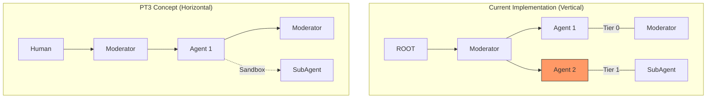

# Root Cause Analysis: Dimensional Spacetime DAG Algorithm (RC1)

This document provides a rigorous analysis of the current `ContainerClaw` DAG implementation compared to the architectural vision outlined in `draft_pt19_review_pt3.md`. 

## 1. Executive Summary

The current DAG implementation is functionally stable but architecturally "divergent." While it successfully renders a vertical timeline with branching lanes, it has inverted the fundamental spacetime coordinate system proposed in the design review. This inversion, coupled with a string-matching heuristic for thread-locking, creates a "fragile" visualization that prioritizes visual headroom (verticality) over causal derivation (dimensionality).

## 2. Theoretical Divergence: The Coordinate Swap

The design review (`PT3`) defines the graph as a **horizontal Minkowski diagram**:
- **X-Axis**: Spacetime (Causal ordering / Sequence).
- **Y-Axis**: Contextual Dimension (Nesting depth).

Current Implementation (after user request for "Verticality"):
- **X-Axis**: Contextual Dimension (Tiers).
- **Y-Axis**: Spacetime (Depth/Sequence).

### Impact of Inversion
By rotating the graph 90 degrees, we have changed the semantic meaning of "branching." In a horizontal flow, branching downwards represents "stepping into a sandbox." In the current vertical flow, branching rightwards represents "parallel execution." While visually pleasing, it conflicts with the "lane-based" mental model where the **Central Timeline** should be the anchor.



## 3. First Principles: The Speed of Light vs. Wall-Clock Jitter

The current Flink join logic (`DagPipeline.java`) uses a **1000ms forward-tolerance**:
```sql
AND c2.ts <= c1.ts + 1000
```

### Defense of the Jitter Window
In a distributed system, "Time" is a lie. The `ui-bridge` receives events from multiple containers. Network latency and Python's asynchronous event loops mean that `Message B` (the response) can occasionally be timestamped *before* `Message A` (the prompt) is persisted to Fluss.

- **Speed of Light Limit**: Information cannot travel faster than $c$. In our system, $c$ is defined by the throughput of the Fluss log. 
- **Suboptimal Choice**: Relying on `ts` (wall-clock) makes the algorithm non-deterministic if two messages fall in the same millisecond. 
- **The Ideal**: The algorithm should derive order from a **Sequence Number** or a **Virtual Logical Clock** provided by the Chatroom Coordinator.

## 4. Heuristic Fragility: The "Moderator" Lock

The layout engine currently identifies the "Main Timeline" by string-matching:
```typescript
const mainChild = children.find(c => 
  (nodeLabels.get(c) || '').toLowerCase().includes('moderator')
) || children[0];
```

### Critical Critique
This is a "Magic String" anti-pattern. If the user renames the Moderator agent to "Referee," the DAG will collapse Tier 1 into the main timeline.
- **PT3 Expected**: The system should track the `context_id`. Any message that stays in the *current* context remains in the current tier. Only the `spawn` event should trigger a tier increment.

## 5. Exhaustive Code Defense

| Change | Rationale | Defense / Critique |
| :--- | :--- | :--- |
| **R=32 Nodes** | Improved tap-targets and readability. | Necessary for modern web aesthetics, but hides more of the background lanes. |
| **350px Y-Spacing** | Prevents "fan-out" occlusion. | A temporary fix for the "flat data" problem. With correct causality, 150px would suffice. |
| **1s Join Jitter** | Handles out-of-order writes. | A "pragmatic hack." Should be replaced by a `parent_event_id` foreign key constraint in the protocol. |
| **1400px Viewport** | Allows "infinite" vertical scroll. | Professional UX choice, correctly handles the "high-depth" requirement of agent swarms. |

## 6. Proposed Remediations

1. **Protocol Update**: Add `logical_seq` to every telemetry event to eliminate time-jitter dependencies.
2. **Context-Aware Tiering**: Replace "Moderator" string matching with `tier = parent.tier + (is_spawn ? 1 : 0)`.
3. **Coordinate Re-Axis**: Reconsider the horizontal flow if the user wants true "Dimensional" spanning (lanes), or commit to the "Vertical Information Highway" model formally.
