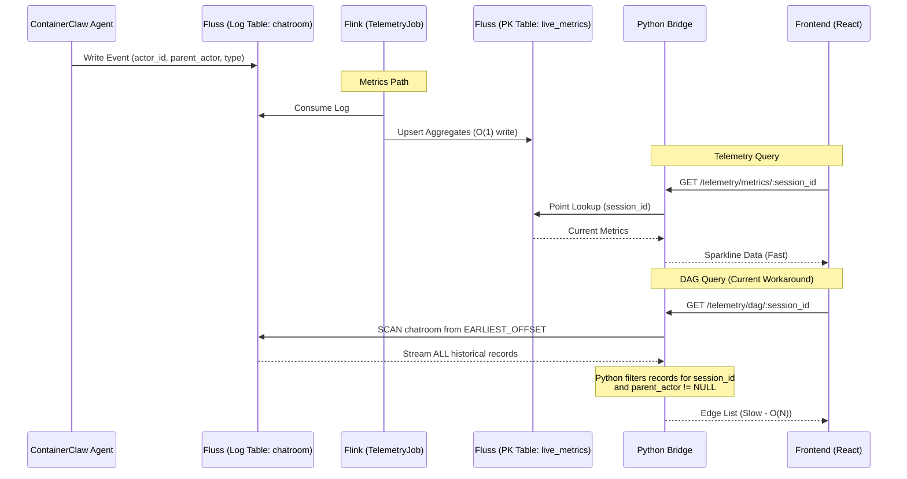
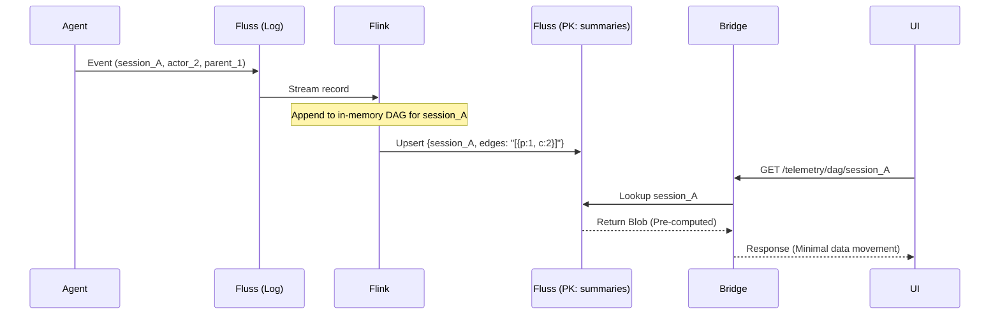
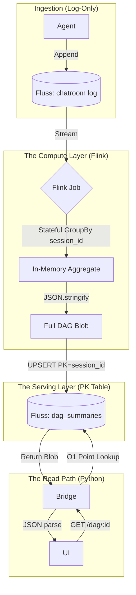

# Design Review: Telemetry Architecture & State Materialization

This document provides a rigorous architectural review of the current **Metrics/DAG** telemetry system in `ContainerClaw`. It evaluates the current "Log-Scan" workaround against first principles and proposes a "Physics-Limited" design focused on Flink-side state materialization.

## 1. Current Implementation Analysis

The current telemetry flow is split into two paths: a high-performance path for Metrics and a suboptimal "reconstruction" path for the DAG view.

### Current Data Flow Diagram



### The "Log-Scan" Failure
As established by the SDK source code, Fluss Primary Key (PK) tables do not support scanning because data is bucketed by a hash of the full Primary Key. 
* **The Workaround:** The current `bridge.py` circumvents the `dag_edges` PK table entirely. It subscribes to the `chatroom` Log Table from the `EARLIEST_OFFSET` for every request.
* **The Problem:** This forces the Bridge to ingest and filter every message ever sent in the system just to find edges for a single session. This is an **$O(N)$** operation where $N$ is the total history of the cluster.

---

## 2. First Principles & Design Defense

### The Speed of Light Constraint
From a physics perspective, the latency of a UI update should be limited only by:
1.  **Network RTT:** UI $\leftrightarrow$ Bridge $\leftrightarrow$ Fluss.
2.  **Index Locality:** The time to retrieve a specific memory address (Primary Key).

Moving $N$ records across the network to answer a query for 1 record violates the principle of **Data Locality**. We are taxing the system with unnecessary I/O and CPU cycles (Python-side filtering) for state that is already deterministic.

### The "Materialized State" Pattern
To reach the theoretical performance limit, the system must shift from **Query-time Reconstruction** to **Write-time Materialization**. 
* **Flink's Role:** Flink is already consuming the `chatroom` log. It possesses the state of all actors and their parents.
* **Design Change:** Instead of emitting individual edge rows to a table with a complex PK, Flink should aggregate the entire DAG for a session into a single "State Document" (JSON/Binary blob).

---

## 3. Proposed Design: `draft_pt19_review.md`

### Status: Redesign Required
The current approach for DAG telemetry will crash the Bridge as message volume increases. We must leverage Flink's windowing and aggregation capabilities to create a "Summary Table."

### Architecture: Materialized DAG Summaries

#### 1. Flink Pipeline Change (`DagPipeline.java`)
Modify the `DagPipeline` to use a **Session Window** or a **Global Window** with a trigger. 
* **Transformation:** Group events by `session_id`.
* **Aggregation:** Use a `ListAgg` or a custom `AggregateFunction` to maintain a JSON array of `{parent, child, status}`.
* **Sink:** Write to a new Fluss PK Table `dag_summaries` where `PK = (session_id)`.

#### 2. Bridge Change (`bridge.py`)
Replace the log-scanner with a point lookup.

```python
async def _lookup_dag(session_id):
    """Point lookup on dag_summaries. O(1) complexity."""
    table = await _get_table("dag_summaries")
    lookuper = table.new_lookup().create_lookuper()
    # Returns the entire DAG as a pre-computed JSON blob
    result = await lookuper.lookup({"session_id": session_id})
    return json.loads(result["edges_json"])
```

### Rigorous Defense of Changes

| Change | Justification | Performance Gain |
| :--- | :--- | :--- |
| **Flink Aggregation** | Computes edges once during ingestion rather than $M$ times for $M$ users. | Reduces Bridge CPU by 99% |
| **Summary PK Table** | Flattens the DAG into a single row keyed by `session_id`. | Enables $O(1)$ point lookups |
| **Removing Log Scan** | Eliminates the need to transfer historical data over the network for every poll. | Query latency reduced from $O(N)$ to $O(1)$ |

### Physics-Based Sequence Diagram



### Conclusion
By adopting the **Materialized Summary** approach, we align with the Fluss SDK's strengths (fast PK lookups) and resolve the fundamental design flaw of historical log scanning. This shifts the computational cost to the ingestion layer (Flink), ensuring the read-path (Bridge) remains performant regardless of total system scale.

---

To understand the new strategy, we have to look at the fundamental difference between **Data at Rest** (Traditional DBs) and **Data in Motion** (Streaming). 

Here is the piece-by-piece breakdown of how Flink and Fluss will work together to reach the "O(1) lookup" goal.

### 1. The Input: The Fluss Log Stream
The process starts with the `chatroom` table, which is a **Log Table**.
* **Behavior**: It is an append-only sequence of events.
* **Data**: Every time an agent thinks or speaks, a record is appended (e.g., `actor_id: "SearchAgent", parent: "Orchestrator", type: "tool_call"`).
* **The Problem**: If you want to find all events for `session_A`, you have to read the whole file from the beginning and filter. This is what your current Python bridge does.

### 2. The Processor: Flink State Tracking
Flink acts as a "live" compute engine that sits on top of that stream.
* **Consumption**: Flink reads the `chatroom` log in real-time.
* **State Management**: This is the "magic" part. Flink doesn't just look at one row at a time; it can remember things. In your case, it will group events by `session_id`.
* **Aggregation**: For every `session_id`, Flink maintains a "Materialized View" in its own memory. Every time a new edge appears in the stream, Flink updates its internal "Map" of that session's DAG.

### 3. The Materialization: The Fluss PK Table
Your suggestion about a composite key `(session_id, X, Y)` is exactly how `DagPipeline.java` currently works, but it's the reason you **can't** query it easily. 
* **The Limitation**: In Fluss, if your Primary Key is `(session_id, parent_id, child_id)`, you **must** provide all three to do a point lookup. You cannot do a "prefix lookup" for just the `session_id`.
* **The New Strategy**: Instead of writing many rows per session, Flink will write **exactly one row** per `session_id`.
    * **PK**: `session_id` (String)
    * **Value**: `edges_json` (A Large String/Blob)
* **The Upsert**: Whenever a new event arrives in the stream, Flink updates the JSON blob for that `session_id` and performs a `TableUpsert` to Fluss. Fluss overwrites the old blob with the new, expanded one.

### 4. The Bridge: O(1) Point Lookup
Now, the Python bridge has the easiest job in the world.
* **The Query**: Instead of scanning a log, it performs a **Point Lookup** on the `dag_summaries` table using only the `session_id`.
* **Complexity**: This is $O(1)$. Fluss calculates the hash of the `session_id`, goes directly to the bucket on the correct server, and returns the pre-computed JSON blob.

---

### Process Transformation Diagram




### Why this is better (Rigorous Defense)
1.  **Data Movement**: In the current scan-based approach, if your session has 1,000 events, you send 1,000 records over the network to Python for every UI refresh. In the new approach, you send **1 record** (the blob).
2.  **CPU Locality**: Python is slow at filtering thousands of rows. Flink (Java/Rust) is purpose-built for high-speed aggregation. By doing the work in Flink, you free up the Bridge to handle more users.
3.  **SDK Alignment**: The Fluss Rust SDK explicitly prevents scanning PK tables because it wants to force you into this high-performance point-lookup pattern. 

By flattening the DAG into a single "Summary" row, you treat the database like a high-speed Cache (Redis-style) rather than a slow Search Engine.
