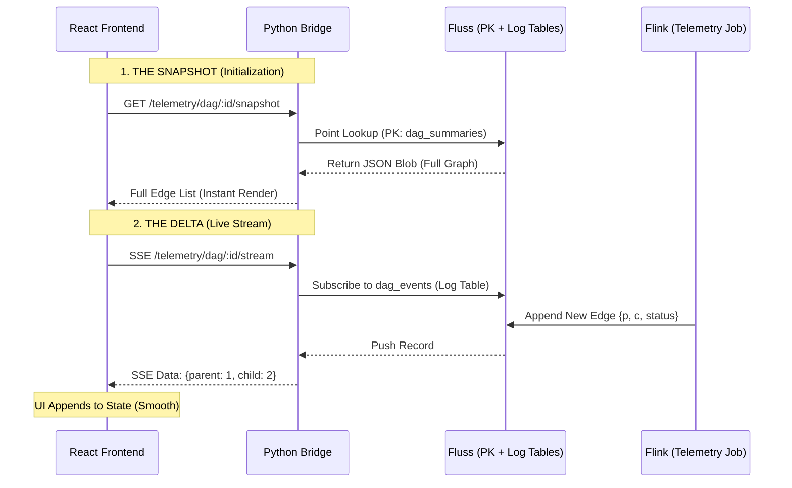

# Design Review: Hybrid Snapshot + Delta Telemetry (SSE)

This document provides a rigorous architectural review of the proposed **Hybrid Snapshot + Delta** telemetry system for `ContainerClaw`. It moves away from the suboptimal $O(N)$ log-scan approach to a physics-limited design that provides both immediate state recovery and near-zero-latency updates.

## 1. Architectural Overview: The Hybrid Synchronization Pattern

To achieve a "Swarm" visualization that is both reliable (handles refreshes) and real-time (instant node appearance), we decouple the **State of the World** from the **Stream of Changes**.



---

## 2. Underlying Mechanics: E2E Breakdown

The transition to this model requires changes across the entire stack. We shift the computational burden to **Flink** to ensure the **Bridge** remains a lightweight $O(1)$ router.

### A. Fluss Table Design (The "Materialized" Schema)
We replace the single `dag_edges` PK table with two complementary structures:

| Table Name | Type | Primary Key | Purpose |
| :--- | :--- | :--- | :--- |
| `dag_summaries` | **PK Table** | `session_id` | Stores the **entire** DAG as a JSON string for $O(1)$ point-lookups. |
| `dag_events` | **Log Table** | N/A | An append-only stream of individual edge updates for real-time SSE tailing. |

### B. Flink Pipeline Logic (`DagPipeline.java`)
In the current implementation, Flink emits individual rows for every edge. In the new model, Flink becomes the **state-keeper**.

1.  **Stateful Processing**: Flink consumes the `chatroom` log. It uses a `KeyedProcessFunction` keyed by `session_id`.
2.  **State Accumulation**: Flink maintains a `MapState<String, Edge>` containing every edge discovered for that session.
3.  **Dual Emission**:
    * **To `dag_summaries` (Snapshot)**: On every new event, Flink serializes the *entire* internal map to a JSON string and **upserts** the single row for that `session_id`.
    * **To `dag_events` (Delta)**: Flink emits just the single new edge to the log table.

### C. Python Bridge Implementation (`bridge.py`)
The Bridge now has two responsibilities, matching the UI's dual-path:

1.  **The Snapshot Endpoint**:
    * Uses `lookuper.lookup({"session_id": session_id})`.
    * This is the "Physics-Limited" maximum speed for state recovery—a direct memory fetch from a Fluss Tablet Server.
2.  **The SSE Stream Endpoint**:
    * Instead of scanning from `EARLIEST_OFFSET`, it starts a `RecordBatchLogScanner` at the **current LATEST offset**.
    * It filters the stream for the requested `session_id` and pushes new records to the UI as they appear.

---

## 3. Defense of the Design (Architectural Review)

### Why is this "Physics-Limited"?
* **Latency**: The time from an Agent creating a sub-agent to the UI showing a node is limited only by Flink's processing window and the SSE push. We eliminate the 2-second polling "jitter".
* **Bandwidth**: After the initial snapshot, network traffic is reduced to the size of a single edge (approx. 100 bytes) rather than the entire graph.

### How does it handle scale?
In the current "Log-Scan" approach, the Bridge CPU usage grows linearly with the total history of the cluster. In this hybrid design, Bridge CPU usage is:
1.  **Fixed** for the snapshot (one lookup).
2.  **Proportional only to current activity** for the stream.

### Addressing the "Statefulness" Concern
The user concern regarding page refreshes is mitigated by the **`dag_summaries`** table. Because Flink is constantly materializing the current state of the world into a PK table, the system is technically **Event Sourced**. The "Snapshot" is simply a cached view of the event stream that allows new or refreshed clients to join without replaying the entire history of the cluster.

---

## 4. Implementation Checklist

1.  **Fluss**: Create the `dag_summaries` (PK) and `dag_events` (Log) tables in `TelemetryJob.java`.
2.  **Flink**: Update `DagPipeline.java` to use an `AggregateFunction` that collects edges into a JSON blob and a side-output for deltas.
3.  **Bridge**: Add a new SSE route `/telemetry/dag/:id/stream` that tails the `dag_events` log.
4.  **UI**: Update `DagView.tsx` to call the snapshot API on mount, then establish the SSE connection to listen for `DagEdge` updates.

This design transforms the telemetry system from a "Batch-style Poller" into a "Streaming-native Observer," aligning the architecture with the real-time nature of agentic swarms.

---

## Appendix: Technical Implementation Details (Flink & Bridge)

### 1. State-Managed DAG Generation (Flink)
To move beyond stateless SQL, the `DagPipeline` must be refactored into a stateful **`KeyedProcessFunction`** within the Flink DataStream API. This allows Flink to maintain the "Current Truth" of the swarm in its own fault-tolerant state.

* **Keying**: Data is partitioned by `session_id` using `keyBy(event -> event.sessionId)`. This ensures all events for a single session are processed by the same parallel operator instance.
* **Internal State**: Flink utilizes a `MapState<String, DagEdge>` where the key is a composite string of `parent_id + child_id`.
    * **Fault Tolerance**: This state is backed by Flink's distributed snapshots (Checkpoints), ensuring that even if a TaskManager crashes, the DAG is not lost and does not need to be replayed from the beginning of the `chatroom` log.
* **The Logic**:
    ```java
    // High-level logic for the KeyedProcessFunction
    public void processElement(ChatEvent event, Context ctx, Collector<DagSummary> out) {
        if (event.parent_actor != null) {
            String edgeKey = event.parent_actor + "->" + event.actor_id;
            DagEdge edge = new DagEdge(event.parent_actor, event.actor_id, deriveStatus(event.type));
            
            // Update internal state
            dagState.put(edgeKey, edge);
            
            // Emit Delta to Side Output (for real-time SSE)
            ctx.output(deltaTag, edge);
            
            // Emit Full Snapshot to Main Output (for PK Table)
            List<DagEdge> allEdges = new ArrayList<>(dagState.values());
            out.collect(new DagSummary(event.session_id, jsonMapper.writeValueAsString(allEdges)));
        }
    }
    ```

### 2. Dual-Output Pushing (Fluss Sinks)
Flink maintains two separate sinks to satisfy the requirements of both immediate recovery (Snapshots) and low-latency updates (Deltas).

* **Snapshot Sink (PK Table)**: The main output of the operator writes to the `dag_summaries` table. Every time an edge is added, the operator serializes the *entire* list of edges into a JSON blob.
    * **Fluss Mechanism**: This uses the `TableUpsert` builder. Fluss handles this as a high-speed overwrite of the row keyed by `session_id`.
* **Delta Sink (Log Table)**: The side-output emits only the single `DagEdge` record to the `dag_events` log table. 
    * **Fluss Mechanism**: This uses the `TableAppend` builder. It is an append-only operation that provides the sequence needed for SSE tailing.

### 3. Subscription Mechanics (Bridge & UI)
The subscription process is what finally eliminates the 2-second polling latency.

* **Step 1: Snapshot Fetch**: Upon component mounting, the Bridge performs a point-lookup on the `dag_summaries` table using `TableLookup`. This returns the JSON blob, which the UI uses to hydrate its initial state.
* **Step 2: Delta Subscription**: The Bridge then opens a `RecordBatchLogScanner` on the `dag_events` table.
    * **Offset Strategy**: The Bridge subscribes using `LATEST_OFFSET`. This ensures the UI only receives edges created *after* the initial snapshot was taken, avoiding duplicate rendering.
    * **Filtering**: The Bridge applies a lightweight filter on the stream to only push events where `record.session_id == active_session_id`.

### 4. Convergence & Scalability
This implementation achieves the "Physics-Limit" by ensuring that:
1.  **Read Cost is Constant**: No matter how large the cluster's history grows, the initial load is always a single $O(1)$ lookup.
2.  **Write Cost is Minimal**: Data movement over the network for updates is restricted to the "change" (the delta) rather than the "state" (the whole graph).
3.  **Fault Tolerance is Native**: By using Flink's internal state and Fluss's persistent tables, the entire telemetry system can recover from a complete power failure without losing the "Swarm" state.