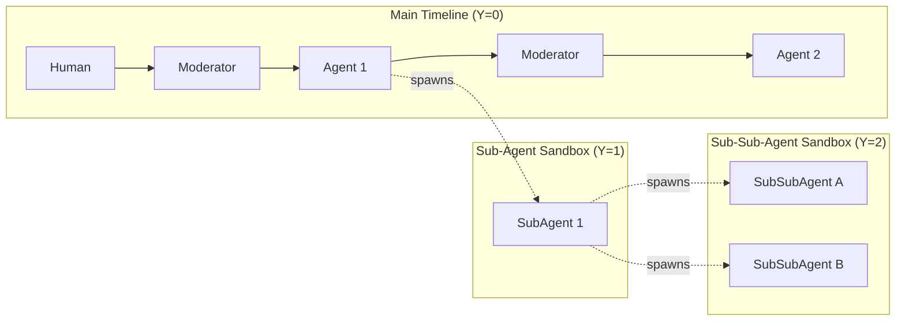

# Design Review: The Dimensional Spacetime DAG (Part 3)

This document provides a rigorous architectural review of the telemetry visualization pipeline for `ContainerClaw`. It outlines the transition from a collapsed organizational chart into a **Dimensional Spacetime Graph**, where the main conversational loop is preserved as a continuous timeline, and sub-agents branch into distinct spatial dimensions corresponding to their **Depth of Nesting**.

## 1. The Core Problem: Conflating Time with Hierarchy

Standard graph visualization algorithms (like the Breadth-First Search layer assigner previously used in `DagView.tsx`) fail for Agentic Swarms because they treat all causal relationships equally. 

If we use standard BFS to unroll the graph, the UI will mix main-thread responses with sub-agent spawns on the same layout layer. This creates a tangled web that obscures the most critical piece of UX: **The Primary Voting/Moderation Loop.**

To accurately represent the swarm, the graph cannot just be a web; it must be a multi-dimensional timeline. 

## 2. First Principles: The Physics of the Swarm

If we view the swarm's execution as a physical system bounded by the speed of light, an event (a message or action) has two properties:
1.  **When it happened (Time):** The sequential order of operations.
2.  **Where it happened (Depth of Context):** The execution sandbox (Main Chatroom vs. Sub-Agent level vs. Sub-Sub-Agent level).

Therefore, our coordinate system must map directly to these physical properties:
* **The X-Axis (Time / Causality):** Represents the strict sequence of events. Moving rightwards means moving forward in time.
* **The Y-Axis (Nesting Tier):** Represents the depth of the context sandbox. The primary interaction loop (Human $\rightarrow$ Moderator $\rightarrow$ Primary Agent $\rightarrow$ Moderator) remains fixed at $Y=0$. Any sub-agents spawned from the main timeline live parallel to each other at $Y=1$. Any sub-sub-agents spawned by them live at $Y=2$, and so forth.

### The Desired Topology (Stratified Spacetime DAG)



---

## 3. The Implementation Mechanics

To achieve this geometry without hardcoding Agent names, the system must deterministically calculate the $(X, Y)$ coordinates based on the shape of the event stream. 

### Step 1: Unrolling Causality via Compound Keys (Flink)
As established, time must be unrolled. Flink cannot emit `{parent: "Moderator", child: "Agent 1"}`. It must emit strictly unique events to prevent graph collapse.

**The Action:** The `DagPipeline.java` must concatenate the Agent ID with the exact Message/Event ID or precise nanosecond timestamp.

```sql
-- Inside Flink's getSnapshotInsertSql / getDeltaInsertSql
'parent' VALUE CONCAT(parent_actor, '|', parent_message_id),
'child' VALUE CONCAT(actor_id, '|', current_message_id)
```
**Defense:** This guarantees that `Moderator` speaking at $t_1$ is a distinct node from `Moderator` speaking at $t_2$, unrolling the sequence into an infinite horizontal line.

### Step 2: Stratified Dimensional Routing (React UI Layout Engine)
The core change resides in the layout math within `DagView.tsx`. We abandon the BFS layering and implement a **Nesting-Tier Layout Algorithm**.

**The Action:** We calculate $X$ by global chronological sequence (or causal depth), and $Y$ by tracking the "Tier" of the graph traversal. We also add a minor local collision-resolution step in case two sibling agents are spawned at the exact same coordinate.

```typescript
// Conceptual logic for DagView.tsx's useMemo block

// 1. Assign Y-Coordinates based on Nesting Tier
const nodeTiers = new Map<string, number>();

function assignTiers(nodeId: string, currentTier: number) {
    if (!nodeTiers.has(nodeId)) {
        nodeTiers.set(nodeId, currentTier);
    }
    
    const children = edges.filter(e => e.parent === nodeId);
    
    if (children.length === 1) {
        // Sequential turn (e.g., Human -> Moderator -> Agent 1). 
        // Maintain current tier.
        assignTiers(children[0].child, currentTier);
    } else if (children.length > 1) {
        // A spawn event has occurred.
        // The main thread continues at the current tier (e.g., returning to Moderator)
        const mainThreadChild = children.find(c => c.child.startsWith('Moderator')) || children[0];
        assignTiers(mainThreadChild.child, currentTier);
        
        // ALL spawned sub-agents drop down EXACTLY one tier (currentTier + 1)
        // They live in parallel within this new conceptual sandbox.
        const subAgents = children.filter(c => c !== mainThreadChild);
        subAgents.forEach(sub => {
            assignTiers(sub.child, currentTier + 1);
        });
    }
}

// Start from Root
const rootNode = findRoot(edges);
assignTiers(rootNode, 0);

// 2. Map to SVG coordinates with localized collision resolution
const X_SPACING = 150;
const Y_TIER_SPACING = 120;
const Y_LOCAL_OFFSET = 40; // Spacing for siblings on the exact same X/Y coordinate

const coordinateMap = new Map<string, {x: number, y: number}>();

nodes.map(node => {
    const baseX = calculateChronologicalDepth(node.id) * X_SPACING;
    const baseTierY = nodeTiers.get(node.id) * Y_TIER_SPACING;
    
    // Collision resolution: If another node already occupies this exact (X, Tier), 
    // shift this one down slightly within the tier band to avoid visual overlap.
    let finalY = baseTierY;
    while (Array.from(coordinateMap.values()).some(coord => coord.x === baseX && coord.y === finalY)) {
        finalY += Y_LOCAL_OFFSET;
    }
    
    coordinateMap.set(node.id, { x: baseX, y: finalY });
    
    return {
        ...node,
        x: baseX,
        y: finalY
    };
});
```

### Defense of the Layout Algorithm
1.  **Stratified Architecture:** By mapping Y directly to nesting depth (`currentTier + 1`), the graph visually resembles a multi-lane highway or a CI/CD pipeline. All Level-1 sub-agents operate in parallel within the same horizontal "lane," making the reasoning architecture instantly legible.
2.  **Maintains the Core Loop:** Because the algorithm explicitly checks if a branch returns to the `Moderator` (or simply follows the single-child path), the primary voting/turn-taking loop is locked securely to $Y=0$. It will draw as a perfect, straight horizontal line across the top of the visualization.
3.  **Graceful Parallelism:** When multiple agents are spawned simultaneously, they are assigned the same $X$ (time) and same $Y$ (tier). The localized collision resolution loop simply stacks them neatly within that tier's band, displaying them as a parallel cluster.
4.  **Visualizes Lifespans:** The spawned sub-agents branch off into their designated tier. Because they dump their output directly into the shared context (rather than routing a directed arrow *back* to the Moderator), their branch simply terminates. This perfectly visualizes their Time-To-Live (TTL)—they spin up, execute, and die within their specific layer of abstraction.