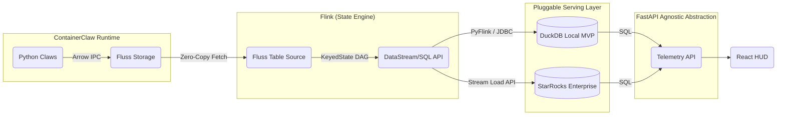
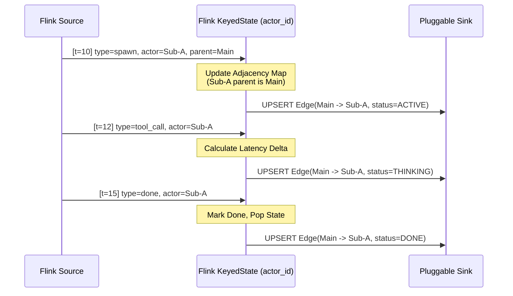

# ContainerClaw Telemetry Strategy: The Dual-Tier Speed-of-Light Architecture
**(Solution Proposal for Draft Pt.19)**

This document serves as the low-level implementation plan for the ContainerClaw telemetry stack. It rigorously outlines and defends the transition from simple scan-based polling to a **dual-tier** stateful streaming data architecture driven by Apache Fluss, Apache Flink, and a pluggable Serving Layer (DuckDB or StarRocks).

---

## 1. First Principles: The "Speed of Light" Limit

To visualize a swarm of asynchronous AI agents, the latency of observability cannot lag behind the agents' thought processes. In high-velocity generation, an agent can spit out multiple thoughts per second. 

We model the total system latency prior to rendering as:
$$T_{visual} = T_{network} + T_{serialize} + T_{process} + T_{query}$$

### The Sub-Optimal Baseline
In the legacy python-scanning model (`fluss_client.py` pulling $N$ events directly):
- $T_{serialize}$: Python spends significant CPU converting Arrow IPC blocks to dictionary format.
- $T_{process}$: Python rebuilds state trees (DAGs) repeatedly for every UI refresh.
- $T_{query}$: $O(N)$ linear scans against the Fluss coordinator.

### The Optimal Target
By isolating stateful computation into Flink, and querying directly from an OLAP engine:
- $T_{serialize} \to 0$ (Zero-copy Arrow reads from Fluss into Flink).
- $T_{process} \to 0$ (Graph inferences occur eagerly as streams, never at query time).
- $T_{query} \to O(1)$ (Direct index lookups).

---

## 2. The Dual-Tier Architecture Pipeline

We recognize that scaling to enterprise Kubernetes (K8s) is distinct from running an MVP locally on a developer laptop. Thus, the Flink Sink and the Serving Layer are **pluggable**. The React UI and FastAPI backend remain entirely agnostic to the underlying engine.



---

## 3. Infrastructure Topology: Local vs Enterprise

### 3.1 Tier 1: Local Laptop MVP (DuckDB)
For single-laptop deployments driven by `docker-compose`, spinning up a distributed MPP database like StarRocks is unnecessarily resource-intensive.
- **Why DuckDB?**: It is an in-process SQL OLAP engine. By sinking Flink state into a local `telemetry.duckdb` file, we achieve analytical query speeds without maintaining JVMs, Frontend nodes, or Backend nodes.
- **Topology**: The `docker-compose.yml` only runs a lightweight Flink cluster (JobManager + TaskManager). The FastAPI backend natively imports `duckdb.connect('telemetry.duckdb')` to serve queries.

### 3.2 Tier 2: Enterprise Grade K8s Scale (StarRocks)
When the swarm scales across hundreds of pods, the telemetry database must handle massive horizontal reads/writes.
- **Why StarRocks?**: It handles true high-concurrency micro-batch UPSERTs via the `Stream Load` API, distributing the read-load natively across backend nodes.

---

## 4. Data Ingestion: The Fluss-Flink Connector

The bridge between raw AI outputs and Flink is identically managed regardless of the serving tier, utilizing the `fluss-flink` connector.

### 4.1 Flink SQL DDL
We dynamically register the Fluss log buckets as a native Flink streaming table:

```sql
CREATE TABLE chatroom (
    event_id STRING,
    session_id STRING,
    run_id STRING,
    actor_id STRING,
    parent_actor STRING,
    event_type STRING,
    ts TIMESTAMP(3),
    payload STRING,
    WATERMARK FOR ts AS ts - INTERVAL '2' SECOND
) WITH (
    'connector' = 'fluss',
    'bootstrap.servers' = 'coordinator-server:9123',
    'table.name' = 'chatroom'
);
```

**Defense**: Creating watermarks allows Flink to robustly handle out-of-order latency variations from asynchronous agents before committing graph state.

---

## 5. Stateful Compute: The DAG Reconstructor

Flink utilizes `KeyedState` to hold the swarm's lineage, computing graph edges before they are ever queried.



**Defense (State TTL)**: To prevent linear RAM growth and `OutOfMemoryError`s in Flink TaskManagers, we enforce a strict 4-hour `StateTtlConfig` inside RocksDB.

---

## 6. Data Serving & Pluggable Sinks

The implementation requires the Flink sink to be a configurable toggle.

### 6.1 The DuckDB Sink (Local MVP)
For the MVP, a PyFlink job utilizes the native DuckDB Python library (e.g., `duckdb.connect()`) or the JDBC connector.
Using Python's DuckDB library, we can execute extremely fast ingestion natively from DataFrames or Arrow buffers emitted by Flink:
```python
import duckdb
conn = duckdb.connect('telemetry.duckdb')
# Upsert Flink buffer directly using relation API or raw SQL
conn.execute("INSERT OR REPLACE INTO snorkel VALUES (?, ?, ?, ?, ?)", [agent_id, session_id, run_id, context_json, ts])
```
**Defense**: DuckDB operates locally without network roundtrips for the FastAPI backend, preserving the $T_{network}$ budget. The FastAPI layer simply queries `telemetry.duckdb` directly, delivering high-performance OLAP metrics to a single developer laptop with near-zero idle compute cost.

### 6.2 The StarRocks Sink (Enterprise)
For K8s deployments, we utilize Flink's StarRocks connector with extreme velocity micro-batching (`sink.buffer-flush.interval-ms = 500`). 
By strictly enforcing **Primary Key Tables** with `enable_persistent_index = "true"`, StarRocks bypasses typical column-scans, performing direct index lookups. When the UI asks for an agent's context window, it runs in $O(1)$ sub-millisecond query execution.

---

## 7. Wrap Up: Deriving the Implementation

To physically implement this dual-tier architecture:
1. **Config Toggle**: Expose `infrastructure.telemetry.engine` mapping to either `duckdb` (default) or `starrocks` in `config.yaml`.
2. **Dynamic Docker Profiles**:
   - `docker-compose --profile local-telemetry up` spins up Flink and mounts a volume for `telemetry.duckdb`.
   - `docker-compose --profile enterprise-telemetry up` spins up StarRocks and Flink.
3. **Agnostic FastAPI**: Wrap the python backend data retrieval in a repository pattern that switches its connection pool. If `duckdb`, use `duckdb.connect()`. If `starrocks`, use standard endpoints (e.g., `asyncpg` / `MySQLdb`). Both engines share almost identical SQL syntax for our analytical reads.
