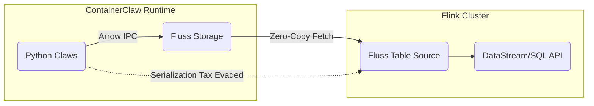
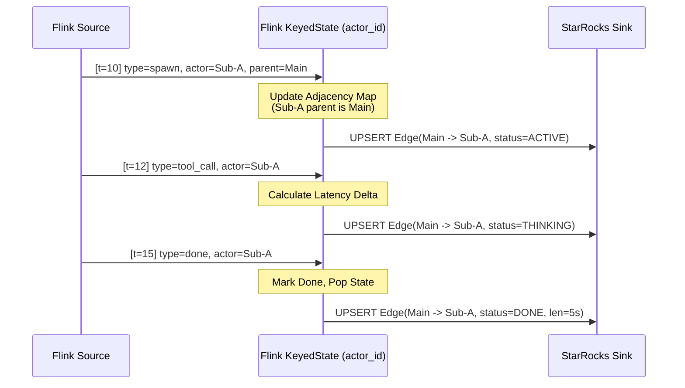

# ContainerClaw Telemetry Strategy: The Speed-of-Light Architecture
**(Solution Proposal for Draft Pt.19)**

This document serves as the low-level implementation plan for the ContainerClaw telemetry stack (`draft_pt19.md` & `draft_pt19_technicals.md`). It rigorously outlines and defends the transition from simple scan-based polling to a stateful streaming data architecture driven by Apache Fluss, Apache Flink, and StarRocks.

---

## 1. First Principles: The "Speed of Light" Limit

To visualize a swarm of asynchronous AI agents, the latency of observability cannot lag behind the agents' thought processes. In high-velocity generation, an agent can spit out multiple thoughts per second. 

We model the total system latency prior to rendering as:
$$T_{visual} = T_{network} + T_{serialize} + T_{process} + T_{query}$$

### The Sub-Optimal Baseline
In the legacy python-scanning model (`fluss_client.py` pulling $N$ events directly):
- $T_{serialize}$: Python spends significant CPU converting Arrow IPC blocks to dictionary dictionaries to sort them.
- $T_{process}$: Python rebuilds state trees (DAGs) repeatedly for every refresh.
- $T_{query}$: $O(N)$ linear scans against the Fluss coordinator.

### The Optimal Target
By separating concerns across Flink and StarRocks:
- $T_{serialize} \to 0$ (Zero-copy Arrow reads from Fluss into Flink).
- $T_{process} \to 0$ (Graph inferences occur eagerly as streams, never at query time).
- $T_{query} \to O(1)$ (StarRocks Primary Key point-lookups).
This restricts the entire stack's latency strictly to $T_{network}$ and fundamental hardware limits.

---

## 2. Infrastructure Topology: Docker Compose Integration

The telemetry stack will be strictly **opt-in**, leveraging Docker profiles. The solution brings up four distinct components alongside the existing `coordinator-server` and `tablet-server` for Fluss.

### 2.1 The Container Specs
```yaml
# Simplified docker-compose definition
services:
  # --- StarRocks (Serving Layer) ---
  starrocks-fe:
    image: starrocks/frontend-ubuntu:latest
    ports: ["9030:9030", "8030:8030"]
    profiles: ["telemetry"]
  
  starrocks-be:
    image: starrocks/backend-ubuntu:latest
    depends_on: [starrocks-fe]
    profiles: ["telemetry"]

  # --- Flink (State Engine) ---
  flink-jobmanager:
    image: flink:1.19
    command: jobmanager
    ports: ["8081:8081"]
    profiles: ["telemetry"]
    
  flink-taskmanager:
    image: flink:1.19
    depends_on: [flink-jobmanager]
    command: taskmanager
    profiles: ["telemetry"]
```

**Defense**: Isolating the FE/BE of StarRocks ensures that Flink JobManager scheduling never starves the analytical serving queries. Using `profiles` ensures users opting out via `config.yaml` (`telemetry.enabled: false`) pay zero compute overhead.

---

## 3. Data Ingestion: The Fluss-Flink Connector

The bridge between raw AI outputs and Flink is defined by the `fluss-flink` connector (e.g., `fluss-flink-1.19`).



### 3.1 Flink SQL DDL
We will register the Fluss tables dynamically in Flink. This treats Fluss log buckets as a native Flink streaming table:

```sql
CREATE TABLE chatroom (
    event_id STRING,
    session_id STRING,
    run_id STRING,
    actor_id STRING,
    parent_actor STRING,
    event_type STRING,
    ts TIMESTAMP(3),
    payload STRING,
    WATERMARK FOR ts AS ts - INTERVAL '2' SECOND
) WITH (
    'connector' = 'fluss',
    'bootstrap.servers' = 'coordinator-server:9123',
    'table.name' = 'chatroom'
);
```

**Defense**: Creating watermarks (`WATERMARK FOR ts`) is vital. Agents are inherently asynchronous, and out-of-order logs are guaranteed. Watermarking allows Flink's windowing functions to confidently emit metrics without missing delayed thoughts.

---

## 4. Stateful Compute: The DAG Reconstructor

The core intelligence of the observability stack is **building the graph before it's asked for**. Flink utilizes `KeyedState` to hold the swarm's lineage.



### 4.1 Memory Management & TTL
Because an LLM swarm can generate tens of thousands of messages, keeping graph state indefinitely in Flink will result in `OutofMemoryError` exceptions across the TaskManagers.

* **Implementation Details**: We configure Flink's `StateTtlConfig` with a 4-hour lifespan.
  ```java
  StateTtlConfig ttlConfig = StateTtlConfig
      .newBuilder(Time.hours(4))
      .setUpdateType(StateTtlConfig.UpdateType.OnCreateAndWrite)
      .setStateVisibility(StateTtlConfig.StateVisibility.NeverReturnExpired)
      .build();
  ```
* **Defense**: Agents and tasks almost never run for >4 hours contiguously. Using RocksDB for the state backend combined with TTL ensures Flink scales linearly with *throughput*, not with *total historical storage*.

---

## 5. Data Serving: StarRocks Primary Key Optimization

The final mile is serving data to the React UI in $<50\text{ms}$. We avoid aggregates at read-time by strictly enforcing the Primary Key (PK) Engine.

### 5.1 The "Active" Snorkel DDL

```sql
CREATE TABLE agent_context_snorkel (
    agent_id VARCHAR(64),
    session_id VARCHAR(64),
    run_id VARCHAR(64),
    context_json JSON,
    last_updated_at DATETIME
) ENGINE=OLAP
PRIMARY KEY(agent_id, session_id)
DISTRIBUTED BY HASH(agent_id)
PROPERTIES (
    "enable_persistent_index" = "true"
);
```

### 5.2 The Stream Load Pipeline
We utilize Flink's **StarRocks Connector** configured for extreme velocity micro-batching:
* `sink.buffer-flush.interval-ms` = `500` (Half a second)
* `sink.properties.format` = `json`

**Defense**: Why StarRocks PK instead of standard aggregate tables? 
When the React UI needs to visualize what "Agent Alice" is thinking, it executes `SELECT context_json FROM snorkel WHERE agent_id = 'Alice'`.
With `enable_persistent_index = "true"` and the PK model, StarRocks bypasses typical column-scan execution. It performs a direct index lookup on the disk/memory blocks, guaranteeing $O(1)$ sub-millisecond query execution. This fulfills the "Speed of Light" mandate perfectly.

---

## 6. Wrap Up: Deriving the Implementation

Given this proposal, the precise sequence of execution to integrate this solution will be:
1. **Docker Config**: Update `docker-compose.yml` with the StarRocks and Flink services mapped to the `telemetry` profile.
2. **Schema Init**: Write the initialization scripts `init_starrocks.sql` to define the Primary Key tables.
3. **Flink App**: Author the Java/Python Flink job that registers the Fluss source, applies the stateful Map functions for the DAG and Snorkel, and connects the Flink-StarRocks sink.
4. **App Config**: Update ContainerClaw's application backend to route HUD requests directly to StarRocks port 9030 rather than scanning `fluss_client.py` when `infrastructure.telemetry.enabled` is `true`.
