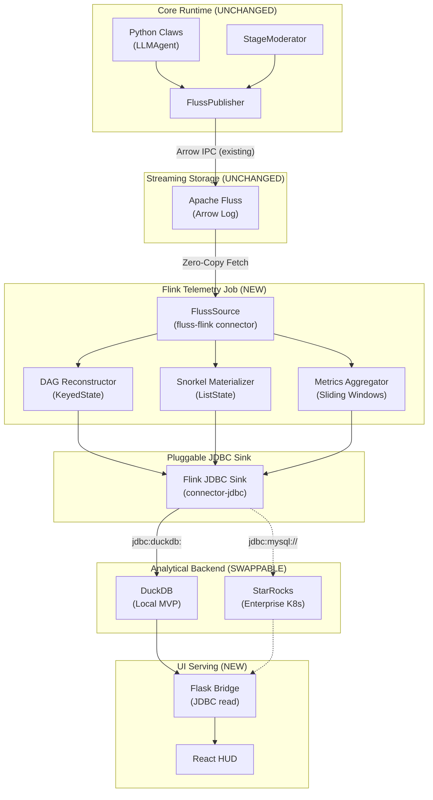
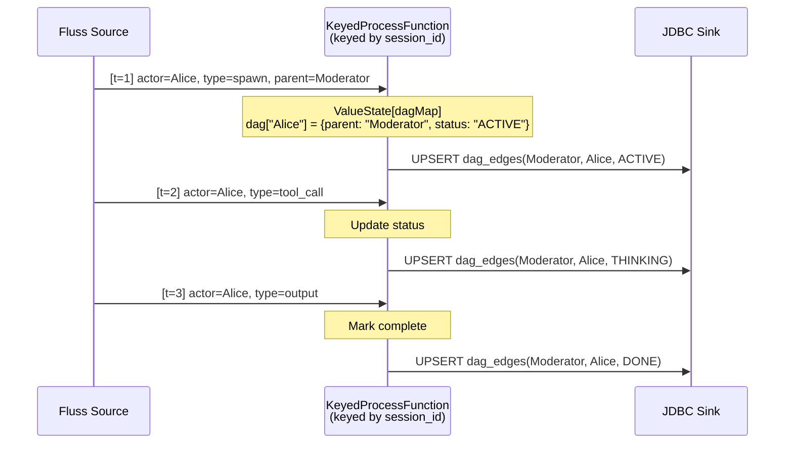
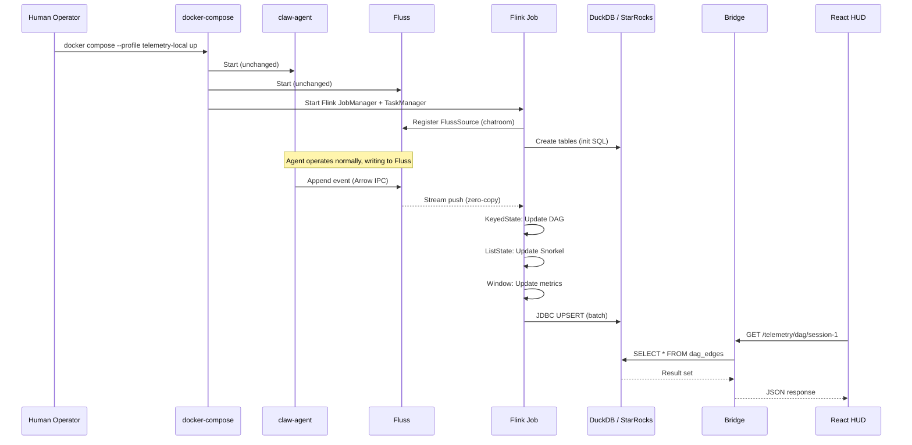

# ContainerClaw Telemetry: The Agnostic Flink Pipeline
**(Solution Proposal Pt.2 — Sink-Agnostic Architecture)**

> **Thesis**: The ContainerClaw core runtime (Python agents, `FlussPublisher`, `StageModerator`) must be **entirely ignorant** of the telemetry stack. All intelligence — DAG reconstruction, context materialization, metric aggregation — lives in a Flink job that reads from Fluss and writes to a **pluggable JDBC sink**. The sink is either DuckDB (local) or StarRocks (enterprise). The core agent code has **zero telemetry imports, zero telemetry writes, zero telemetry awareness**. This is the only architecture that satisfies the Speed of Light constraint while maintaining deployment flexibility.

---

## 1. First Principles: Why the Core Must Be Blind

### 1.1 The Latency Budget
$$T_{visual} = T_{emit} + T_{network} + T_{process} + T_{query}$$

The agent's job is to minimize $T_{emit}$ — the time to write an event to Fluss. Every additional concern (dual-writes to DuckDB, telemetry hooks, in-process aggregation) increases $T_{emit}$ and violates the Speed of Light principle. The agent must do **one thing**: append Arrow records to Fluss. Everything else is someone else's problem.

### 1.2 The Coupling Argument
If the agent imports `duckdb` or `telemetry.py`, then:
- The agent's Docker image grows with analytical dependencies.
- A DuckDB write failure can block or crash agent execution.
- Swapping backends requires modifying agent code.
- The agent's `requirements.txt` becomes a dependency graveyard.

**Design Consequence**: The agent writes to Fluss. Period. A **separate process** (Flink) consumes the Fluss stream and materializes state into the analytical backend. The agent never knows this process exists.

### 1.3 The Separation of Concerns
```
Agent Runtime (Python)     →  Writes to Fluss (Arrow IPC)
Flink Cluster (JVM)        →  Reads from Fluss, computes DAG/Snorkel/Metrics
Analytical Backend (JDBC)  →  Stores materialized state (DuckDB or StarRocks)
UI Bridge (Python/Flask)   →  Reads from Analytical Backend via JDBC/SQL
```

Each layer has exactly **one dependency on the layer before it**. No skip connections, no dual-writes, no back-channels.

---

## 2. The Agnostic Architecture



**Defense**: The only new dependency on the agent runtime is... nothing. The Flink job is a completely separate JVM application deployed via `docker-compose`. The bridge reads from the analytical backend using the same JDBC driver abstraction regardless of engine.

---

## 3. The Pluggable Sink: JDBC Abstraction

The key architectural insight is that **both DuckDB and StarRocks support JDBC**. Flink's `flink-connector-jdbc` module provides a generic JDBC sink that works with any JDBC-compliant database. The swap is a **configuration change**, not a code change.

### 3.1 DuckDB JDBC (Local MVP)
DuckDB provides a JDBC driver (`org.duckdb.DuckDBDriver`) that Flink can use directly:
```sql
-- Flink SQL sink definition (DuckDB)
CREATE TABLE dag_edges_sink (
    session_id STRING, parent_id STRING, child_id STRING,
    status STRING, updated_at BIGINT
) WITH (
    'connector' = 'jdbc',
    'url' = 'jdbc:duckdb:/state/telemetry.duckdb',
    'table-name' = 'dag_edges'
);
```

### 3.2 StarRocks JDBC (Enterprise)
StarRocks exposes a MySQL-compatible JDBC interface on port 9030:
```sql
-- Flink SQL sink definition (StarRocks)
CREATE TABLE dag_edges_sink (
    session_id STRING, parent_id STRING, child_id STRING,
    status STRING, updated_at BIGINT
) WITH (
    'connector' = 'jdbc',
    'url' = 'jdbc:mysql://starrocks-fe:9030/containerclaw',
    'table-name' = 'dag_edges',
    'username' = 'root',
    'password' = ''
);
```

### 3.3 The Swap Mechanism
The Flink job reads its sink configuration from an environment variable or a mounted config file:

```yaml
# telemetry-config.yaml (mounted into Flink JobManager)
sink:
  engine: "duckdb"  # or "starrocks"
  duckdb:
    jdbc_url: "jdbc:duckdb:/state/telemetry.duckdb"
  starrocks:
    jdbc_url: "jdbc:mysql://starrocks-fe:9030/containerclaw"
    username: "root"
```

The Flink job's `main()` reads this config and dynamically registers the sink tables. **The DAG reconstruction logic, the Snorkel materializer, and the metrics aggregator are identical regardless of sink.** Only the `WITH (...)` clause changes.

---

## 4. Flink Job Design: Stateful Stream Processing

The Flink job is a single Java/Scala application with three logical pipelines sharing the same `FlussSource`.

### 4.1 Source: The Fluss Connector
Using the native `fluss-flink` connector (e.g., `fluss-flink-1.20`), we register the chatroom as a Flink streaming table:

```sql
CREATE TABLE chatroom (
    event_id STRING,
    session_id STRING,
    ts BIGINT,
    actor_id STRING,
    content STRING,
    `type` STRING,
    tool_name STRING,
    tool_success BOOLEAN,
    parent_actor STRING,
    WATERMARK FOR ts AS ts - 2000
) WITH (
    'connector' = 'fluss',
    'bootstrap.servers' = 'coordinator-server:9123',
    'table.path' = 'containerclaw.chatroom'
);
```

**Defense (Watermarks)**: The `WATERMARK FOR ts AS ts - 2000` declaration (2-second slack) is critical. LLM agents are inherently asynchronous — a subagent's `spawn` event may arrive after its parent's `tool_call` due to network jitter. The watermark ensures Flink's windowing operators hold state long enough to catch late arrivals without blocking the pipeline.

### 4.2 Pipeline A: DAG Reconstructor



**Implementation**: A `KeyedProcessFunction<String, Row, Row>` keyed by `session_id`. It maintains a `MapState<String, DagNode>` where `DagNode` stores `(parent_id, status, first_seen_ts)`. On each event:
1. If `parent_actor` is non-empty, upsert the edge.
2. If `type` is `"spawn"`, set status to `ACTIVE`.
3. If `type` is `"output"` or `"finish"`, set status to `DONE`.
4. Emit the updated edge to the JDBC sink.

**State TTL**: 4-hour `StateTtlConfig` prevents unbounded memory growth:
```java
StateTtlConfig ttlConfig = StateTtlConfig
    .newBuilder(Time.hours(4))
    .setUpdateType(StateTtlConfig.UpdateType.OnCreateAndWrite)
    .setStateVisibility(StateTtlConfig.StateVisibility.NeverReturnExpired)
    .build();
```

### 4.3 Pipeline B: Snorkel Materializer

For each `(agent_id, session_id)`, maintains the last N messages as a JSON array and upserts the entire context window to the sink on every new message.

**Implementation**: A `KeyedProcessFunction` keyed by a composite key `(actor_id, session_id)`. Uses a `ListState<String>` bounded to `max_history_messages` (from config, default 100). On each event where `actor_id` matches the key:
1. Append the message's `content` to the `ListState`.
2. If the state exceeds N messages, evict the oldest.
3. Serialize the full state to JSON.
4. Emit an upsert row `(agent_id, session_id, context_json, ts)` to the JDBC sink.

### 4.4 Pipeline C: Metrics Aggregator

Uses Flink's native **Sliding Window** operator to compute:
- **TPS**: `COUNT(*)` per 1-second tumbling window.
- **Tool Efficiency**: `SUM(CASE WHEN tool_success THEN 1 ELSE 0 END) / COUNT(tool_name)` where `tool_name` is non-empty.
- **Latency**: Derived from timestamp gaps between `election` and `output` events.

```sql
INSERT INTO live_metrics_sink
SELECT
    session_id,
    TUMBLE_START(ts_col, INTERVAL '1' SECOND) AS window_start,
    COUNT(*) AS total_messages,
    COUNT(CASE WHEN tool_name <> '' THEN 1 END) AS tool_calls,
    COUNT(CASE WHEN tool_success THEN 1 END) AS tool_successes
FROM chatroom
GROUP BY session_id, TUMBLE(ts_col, INTERVAL '1' SECOND);
```

---

## 5. Infrastructure: Docker Compose Profiles

The telemetry stack is **entirely opt-in** via Docker Compose profiles. The core services (`claw-agent`, `llm-gateway`, `coordinator-server`, `tablet-server`, `ui`, `ui-bridge`) are unchanged.

### 5.1 Local MVP Profile (`telemetry-local`)

```yaml
services:
  flink-jobmanager:
    image: flink:1.20
    command: standalone-job --job-classname com.containerclaw.telemetry.TelemetryJob
    ports: ["8081:8081"]
    profiles: ["telemetry-local"]
    volumes:
      - ${PROJECT_DIR:-.}/.claw_state:/state:rw
      - ${PROJECT_DIR:-.}/telemetry/telemetry-config.yaml:/config/telemetry-config.yaml:ro
      - ${PROJECT_DIR:-.}/telemetry/jars:/opt/flink/lib/telemetry:ro
    environment:
      TELEMETRY_CONFIG: /config/telemetry-config.yaml
      FLINK_PROPERTIES: |
        jobmanager.rpc.address: flink-jobmanager
        state.backend: rocksdb
        state.checkpoints.dir: file:///state/flink-checkpoints
    networks: [internal]

  flink-taskmanager:
    image: flink:1.20
    command: taskmanager
    depends_on: [flink-jobmanager]
    profiles: ["telemetry-local"]
    volumes:
      - ${PROJECT_DIR:-.}/.claw_state:/state:rw
      - ${PROJECT_DIR:-.}/telemetry/jars:/opt/flink/lib/telemetry:ro
    environment:
      FLINK_PROPERTIES: |
        jobmanager.rpc.address: flink-jobmanager
        taskmanager.numberOfTaskSlots: 4
        state.backend: rocksdb
    networks: [internal]
```

**Defense**: The Flink containers mount the same `.claw_state` volume as the agent. This allows the DuckDB file (`/state/telemetry.duckdb`) to be written by Flink and read by the bridge. No network round-trip for the analytical backend — just shared filesystem I/O.

### 5.2 Enterprise Profile (`telemetry-enterprise`)

```yaml
services:
  starrocks-fe:
    image: starrocks/frontend-ubuntu:latest
    ports: ["9030:9030", "8030:8030"]
    profiles: ["telemetry-enterprise"]
    networks: [internal]

  starrocks-be:
    image: starrocks/backend-ubuntu:latest
    depends_on: [starrocks-fe]
    profiles: ["telemetry-enterprise"]
    networks: [internal]

  flink-jobmanager:
    # Same as local, but with starrocks config
    profiles: ["telemetry-enterprise"]
    ...

  flink-taskmanager:
    profiles: ["telemetry-enterprise"]
    ...
```

### 5.3 Activation via `claw.sh`

The `claw.sh` lifecycle manager is updated with a `--telemetry` flag:

```bash
# claw.sh up (default — core only, no telemetry)
./claw.sh up

# claw.sh up with local telemetry (DuckDB)
./claw.sh up --telemetry local

# claw.sh up with enterprise telemetry (StarRocks)
./claw.sh up --telemetry enterprise
```

The `up` case in `claw.sh` translates `--telemetry local` to `docker compose --profile telemetry-local up -d --build` and `--telemetry enterprise` to `docker compose --profile telemetry-enterprise up -d --build`. The `down`, `purge`, and `clean` commands are also updated to tear down the telemetry containers.

---

## 6. UI Bridge: Read Path

### 6.1 Why Flask (Not FastAPI) — Defense

The bridge currently uses Flask with synchronous gRPC calls. For the new telemetry endpoints, the question is whether to migrate to FastAPI.

**Decision: Keep Flask.** Rationale:
- The telemetry read path is a **sub-millisecond local DuckDB query** or a **sub-10ms StarRocks PK lookup**. There is no I/O-bound workload that benefits from `async/await`.
- The existing gRPC calls to the agent are already synchronous and blocking. Migrating them to async would require rewriting **every existing endpoint** — a full bridge rewrite that's out of scope.
- Flask's `threaded=True` mode (already active) handles concurrent requests via OS threads, which is sufficient for the expected QPS (a single UI polling at 1-2 Hz).
- The telemetry endpoints are **pure SQL reads** — they complete before a context switch would even matter.

**When to reconsider**: If the bridge needs to handle 100+ concurrent WebSocket connections or Server-Sent Events for real-time push, FastAPI with `uvicorn` would be the right migration. That is a Phase 2 concern.

### 6.2 Connection Factory

```python
import os

def get_telemetry_connection():
    """Return a DB-API 2.0 connection based on the configured engine."""
    engine = os.getenv("TELEMETRY_ENGINE", "")
    if not engine:
        return None  # Telemetry not enabled
    if engine == "duckdb":
        import duckdb
        return duckdb.connect(
            os.getenv("TELEMETRY_DUCKDB_PATH", "/state/telemetry.duckdb"),
            read_only=True
        )
    elif engine == "starrocks":
        import pymysql
        return pymysql.connect(
            host=os.getenv("STARROCKS_HOST", "starrocks-fe"),
            port=int(os.getenv("STARROCKS_PORT", "9030")),
            user="root", database="containerclaw"
        )
    else:
        raise ValueError(f"Unknown telemetry engine: {engine}")
```

### 6.3 Endpoints

```python
@app.route("/telemetry/dag/<session_id>")
def telemetry_dag(session_id):
    conn = get_telemetry_connection()
    if not conn:
        return {"status": "error", "message": "Telemetry not enabled"}, 404
    rows = conn.execute(
        "SELECT parent_id, child_id, status FROM dag_edges WHERE session_id = ?",
        [session_id]
    ).fetchall()
    return {"status": "ok", "edges": [dict(zip(["parent","child","status"], r)) for r in rows]}

@app.route("/telemetry/snorkel/<agent_id>/<session_id>")
def telemetry_snorkel(agent_id, session_id):
    conn = get_telemetry_connection()
    if not conn:
        return {"status": "error", "message": "Telemetry not enabled"}, 404
    row = conn.execute(
        "SELECT context_json FROM agent_context_snorkel WHERE agent_id = ? AND session_id = ?",
        [agent_id, session_id]
    ).fetchone()
    return {"status": "ok", "context": row[0] if row else None}

@app.route("/telemetry/metrics/<session_id>")
def telemetry_metrics(session_id):
    conn = get_telemetry_connection()
    if not conn:
        return {"status": "error", "message": "Telemetry not enabled"}, 404
    rows = conn.execute(
        "SELECT window_start, total_messages, tool_calls, tool_successes FROM live_metrics WHERE session_id = ? ORDER BY window_start DESC LIMIT 60",
        [session_id]
    ).fetchall()
    return {"status": "ok", "metrics": [dict(zip(["ts","msgs","calls","successes"], r)) for r in rows]}
```

**Defense**: The SQL syntax is identical for DuckDB and StarRocks (both support standard SQL with `?` parameter binding). The connection factory is the **only** place where the engine choice matters. All endpoint logic is engine-agnostic. When telemetry is not configured, endpoints return a clean 404 rather than crashing.

---

## 7. Config Integration

### 7.1 `config.yaml` (Updated)

```yaml
infrastructure:
  telemetry:
    enabled: true
    engine: "duckdb"        # "duckdb" or "starrocks"
    duckdb:
      path: "/state/telemetry.duckdb"
    starrocks:
      host: "starrocks-fe"
      port: 9030
  flink:
    host: "flink-jobmanager"
    port: 8081
  fluss:
    bootstrap_servers: "coordinator-server:9123"
```

### 7.2 Impact on Core Code

**None.** The `config.yaml` telemetry block is read by:
1. The `claw.sh` `--telemetry` flag (human operator selects the docker profile).
2. The Flink job's `telemetry-config.yaml` (mounted separately).
3. The bridge's `TELEMETRY_ENGINE` environment variable.

The agent's `config_loader.py`, `main.py`, `publisher.py`, `moderator.py`, and `agent.py` require **zero modifications**. The agent writes to Fluss exactly as it does today. The telemetry pipeline is a **side-car architecture** that observes the stream without perturbing it.

---

## 8. File Manifest

| File | Action | Owner | Description |
|---|---|---|---|
| `agent/src/*` | **UNTOUCHED** | Core | No changes to any agent code |
| `shared/config_loader.py` | **UNTOUCHED** | Core | No changes to config loader |
| `claw.sh` | **MODIFY** | Infra | Add `--telemetry local\|enterprise` flag |
| `docker-compose.yml` | **MODIFY** | Infra | Add Flink + DuckDB/StarRocks profiles |
| `telemetry/telemetry-config.yaml` | **NEW** | Infra | Flink job sink configuration |
| `telemetry/jars/` | **NEW** | Infra | Flink job JAR + JDBC driver JARs |
| `telemetry/src/` | **NEW** | Flink | Java Flink job (DAG, Snorkel, Metrics) |
| `telemetry/pom.xml` | **NEW** | Flink | Maven build for the Flink job |
| `telemetry/init_duckdb.sql` | **NEW** | Infra | DuckDB schema initialization |
| `telemetry/init_starrocks.sql` | **NEW** | Infra | StarRocks schema initialization |
| `bridge/src/bridge.py` | **MODIFY** | Bridge | Add `/telemetry/*` endpoints |
| `bridge/requirements.txt` | **MODIFY** | Bridge | Add `duckdb` and/or `pymysql` |
| `config.yaml` | **MODIFY** | Config | Add `telemetry` block |

---

## 9. Execution Sequence



---

## 10. Risk Analysis

| Risk | Impact | Mitigation |
|---|---|---|
| **DuckDB single-writer** | Flink is the only writer; bridge reads in read-only mode. No contention. | DuckDB WAL mode supports concurrent readers with a single writer. |
| **Flink overhead on laptop** | JobManager + TaskManager consume ~1GB RAM. | Use `taskmanager.memory.process.size: 512m` for local profile. Document minimum specs. |
| **JDBC driver compatibility** | DuckDB JDBC is relatively new. | Pin to a tested version in `pom.xml`. Integration test in CI. |
| **State explosion** | Long-running sessions accumulate Flink state. | 4-hour `StateTtlConfig`. RocksDB state backend spills to disk. |
| **Latency budget** | Flink → JDBC → Bridge adds hops. | DuckDB file is local (no network). StarRocks PK index is $O(1)$. Both satisfy <50ms target. |
