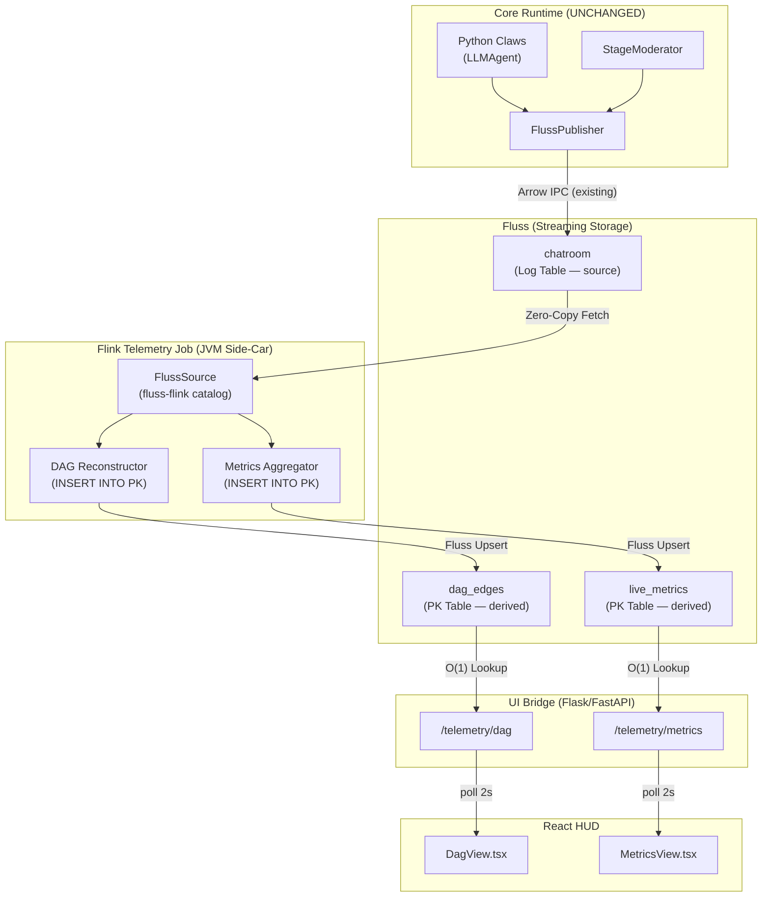
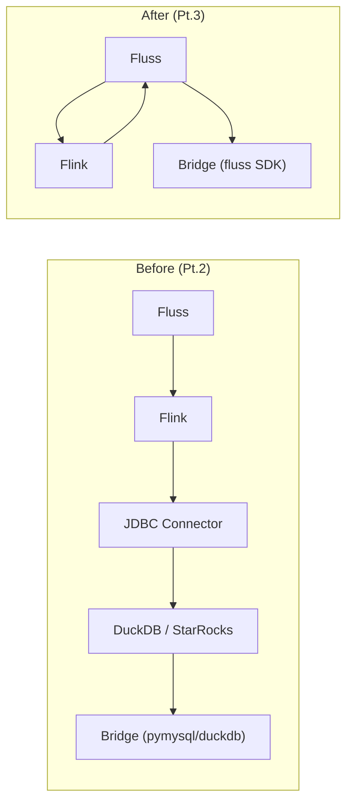

# ContainerClaw Telemetry: Fluss-Native Pipeline
**(Solution Proposal Pt.3 — Zero External Databases)**

> **Thesis**: Drop DuckDB. Drop StarRocks. The entire telemetry pipeline uses **Fluss and only Fluss** as both source *and* sink. Flink consumes the chatroom log stream, computes derived views (DAG edges, live metrics), and writes the results back into **Fluss Primary Key tables**. The bridge reads from those PK tables using Fluss's native $O(1)$ `Lookuper` API. Zero JDBC. Zero dialect factories. Zero external databases. The Speed of Light architecture demands that we don't introduce new infrastructure when the existing infrastructure already provides every primitive we need.

---

## 1. First Principles: Why Fluss Is Sufficient

### 1.1 The Failed Experiment

The Pt.2 architecture introduced DuckDB/StarRocks as analytical sinks behind Flink's `flink-connector-jdbc`. This failed in production for **fundamental reasons**:

| Failure | Root Cause | Nature |
|---|---|---|
| `UnsupportedClassVersionError` | Flink 1.20 ships Java 11; Maven defaulted to Java 17 | Fixable but fragile |
| `Could not find any jdbc dialect factory` for `jdbc:duckdb:` | Flink JDBC connector has no DuckDB dialect. Available: MySQL, Postgres, Oracle, etc. | **Unfixable without custom SPI** |
| Read-only filesystem for DuckDB writes | Docker volume mount issue | Fixable but operational burden |
| Fluss database race condition | Flink starts before agent creates DB | Fixable with retries |

> [!CAUTION]
> The DuckDB-via-JDBC path requires implementing a custom `JdbcDialectFactory` SPI plugin — a non-trivial amount of glue code for **every** DuckDB-specific SQL quirk (upsert syntax, type mapping, identifier quoting, DDL). This violates the Speed of Light principle: we're writing adapter code for infrastructure we don't need.

### 1.2 What Fluss Already Provides

The Fluss storage engine has two table types:

| Type | Semantics | Write Path | Read Path |
|---|---|---|---|
| **Log Table** | Append-only, ordered by offset | `AppendWriter.write_arrow_batch()` | `LogScanner.poll()` — streaming scan |
| **PK Table** | Keyed by primary key, upsert semantics | `UpsertWriter.upsert()` or Flink `INSERT INTO` | `Lookuper.lookup(pk)` — **$O(1)$ point get** |

The Python SDK (`fluss` PyPI package, backed by Rust bindings) exposes:

```python
# PK table lookup — O(1), no scanning
lookuper = table.new_lookup().create_lookuper()
result = await lookuper.lookup({"session_id": "abc-123"})  # Returns dict or None

# PK table write
writer = table.new_upsert().create_writer()
writer.upsert({"session_id": "abc", "total_messages": 42})
await writer.flush()
```

And the Flink-Fluss connector (`fluss-flink`) natively supports:

```sql
-- PK table created via Flink SQL
CREATE TABLE dag_edges (
    session_id STRING,
    parent_id  STRING,
    child_id   STRING,
    status     STRING,
    updated_at BIGINT,
    PRIMARY KEY (session_id, parent_id, child_id) NOT ENFORCED
) WITH ('bucket.num' = '4');

-- Flink INSERT INTO a PK table performs upserts automatically
INSERT INTO fluss_catalog.containerclaw.dag_edges
SELECT session_id, parent_actor AS parent_id, actor_id AS child_id, ...
FROM fluss_catalog.containerclaw.chatroom
WHERE parent_actor IS NOT NULL AND parent_actor <> '';
```

This is verified by [FlinkTableSinkITCase.java](file:///Users/jaredyu/Desktop/open_source/fluss/fluss-flink/fluss-flink-common/src/test/java/org/apache/fluss/flink/sink/FlinkTableSinkITCase.java#L431-L490)  (`testPut`), which demonstrates INSERT INTO a PK table with upsert semantics via the Fluss catalog.

### 1.3 The Speed of Light Argument

$$T_{e2e} = T_{emit} + T_{flink} + T_{sink} + T_{read}$$

| Term | Pt.2 (JDBC→DuckDB) | Pt.3 (Fluss PK) |
|---|---|---|
| $T_{emit}$ | Arrow append to Fluss | Arrow append to Fluss (identical) |
| $T_{flink}$ | SQL transform | SQL transform (identical) |
| $T_{sink}$ | JDBC write → DuckDB file I/O | **Fluss upsert → in-process KV** |
| $T_{read}$ | DuckDB SQL query (scan) | **Fluss PK lookup → $O(1)$ point get** |

The Fluss PK path eliminates:
- An entire external process (DuckDB/StarRocks)
- JDBC serialization overhead
- JDBC dialect factory SPI
- SQL query parsing on the read path
- Docker volume management for a database file

---

## 2. Architecture

### 2.1 System Diagram



### 2.2 Data Flow Summary

```
Agent → (Arrow append) → Fluss chatroom [Log]
                               ↓
                        Flink SQL job
                         ↓          ↓
              Fluss dag_edges   Fluss live_metrics
                  [PK]              [PK]
                   ↓                  ↓
              Bridge lookup      Bridge lookup
                   ↓                  ↓
            React DagView      React MetricsView
```

Every arrow in this diagram uses **Fluss-native protocols**. No JDBC. No SQL parsing on the serving path. No external databases.

---

## 3. Schema Design: Fluss PK Tables

### 3.1 `dag_edges` — DAG Edge Reconstruction

| Column | Type | Description |
|---|---|---|
| `session_id` | `STRING` | Session this edge belongs to |
| `parent_id` | `STRING` | Parent agent actor_id |
| `child_id` | `STRING` | Child agent actor_id |
| `status` | `STRING` | ACTIVE / THINKING / DONE |
| `updated_at` | `BIGINT` | Epoch ms of last update |

- **Primary Key**: `(session_id, parent_id, child_id)`
- **Bucket Key**: `session_id` (co-located with chatroom table for locality)
- **Semantics**: Upsert — repeated events update `status` and `updated_at`

### 3.2 `live_metrics` — Pre-aggregated Metrics per Session

| Column | Type | Description |
|---|---|---|
| `session_id` | `STRING` | Session this metric belongs to |
| `total_messages` | `BIGINT` | Running count of all events |
| `tool_calls` | `BIGINT` | Running count of tool invocations |
| `tool_successes` | `BIGINT` | Running count of successful tool calls |
| `last_updated_at` | `BIGINT` | Epoch ms of last metric update |

- **Primary Key**: `(session_id)`
- **Bucket Key**: `session_id`
- **Semantics**: Each `INSERT INTO` upserts the running aggregate for that session

> [!IMPORTANT]
> We use **running aggregates per session** rather than tumbling windows. This is simpler, cheaper, and the UI can calculate rates by diffing consecutive polls. The Flink SQL uses `GROUP BY session_id` with `COUNT(*)`, which for a streaming PK-sink produces upserts (not appends).

---

## 4. Flink SQL Pipelines

### 4.1 DAG Pipeline

```sql
INSERT INTO fluss_catalog.containerclaw.dag_edges
SELECT
    session_id,
    parent_actor AS parent_id,
    actor_id     AS child_id,
    CASE
        WHEN `type` IN ('finish', 'done', 'checkpoint') THEN 'DONE'
        WHEN `type` = 'tool_call'                       THEN 'THINKING'
        ELSE 'ACTIVE'
    END AS status,
    ts AS updated_at
FROM fluss_catalog.containerclaw.chatroom
WHERE parent_actor IS NOT NULL AND parent_actor <> ''
```

This reads from the `chatroom` log table and writes to the `dag_edges` PK table. Since the PK is `(session_id, parent_id, child_id)`, repeated events for the same edge update `status` and `updated_at` in place.

### 4.2 Metrics Pipeline

```sql
INSERT INTO fluss_catalog.containerclaw.live_metrics
SELECT
    session_id,
    COUNT(*)                                                        AS total_messages,
    COUNT(CASE WHEN tool_name IS NOT NULL AND tool_name <> '' THEN 1 END) AS tool_calls,
    COUNT(CASE WHEN tool_success = true THEN 1 END)                 AS tool_successes,
    MAX(ts)                                                         AS last_updated_at
FROM fluss_catalog.containerclaw.chatroom
GROUP BY session_id
```

The `GROUP BY session_id` on a streaming source produces a retract stream. The Fluss PK upsert sink handles the retract/insert pairs by updating the existing row in place.

---

## 5. Bridge Read Path: Fluss PK Lookups

### 5.1 Connection Model

The bridge establishes a **single, persistent** Fluss connection on startup. It creates a `Lookuper` for each PK table. On each HTTP request, it performs a point lookup — no scanning, no SQL parsing.

```python
import fluss

# On startup
config = fluss.Config({"bootstrap.servers": "coordinator-server:9123"})
conn = await fluss.FlussConnection.create(config)

# Get PK table handles
dag_table = await conn.get_table(fluss.TablePath("containerclaw", "dag_edges"))
dag_lookuper = dag_table.new_lookup().create_lookuper()

metrics_table = await conn.get_table(fluss.TablePath("containerclaw", "live_metrics"))
metrics_lookuper = metrics_table.new_lookup().create_lookuper()
```

### 5.2 DAG Endpoint

```python
@app.route("/telemetry/dag/<session_id>")
def telemetry_dag(session_id):
    # Scan dag_edges PK table for all edges in this session
    # Since PK is (session_id, parent_id, child_id), we scan by prefix
    edges = scan_dag_for_session(session_id)  # Log scan with filter
    return jsonify(edges)
```

> [!NOTE]
> The DAG endpoint needs **all** edges for a session, not a single edge. For this, we use a log scan on the PK table's changelog (which is bounded by session) rather than individual point lookups. This is still fast because the changelog is compact (one entry per unique edge, not per chatroom event).

### 5.3 Metrics Endpoint

```python
@app.route("/telemetry/metrics/<session_id>")
def telemetry_metrics(session_id):
    # Single point lookup — O(1)
    result = await metrics_lookuper.lookup({"session_id": session_id})
    if result is None:
        return jsonify([])
    return jsonify([result])
```

---

## 6. Table Creation: Who Creates the PK Tables?

### 6.1 Option A: Agent creates them (alongside existing tables) — **REJECTED**

This would mean the agent knows about telemetry tables, violating the "core is blind" principle.

### 6.2 Option B: Flink job creates them via catalog DDL — **SELECTED**

The Flink job already creates the Fluss catalog. Before running the pipelines, it executes:

```sql
CREATE TABLE IF NOT EXISTS fluss_catalog.containerclaw.dag_edges (
    session_id STRING,
    parent_id  STRING,
    child_id   STRING,
    status     STRING,
    updated_at BIGINT,
    PRIMARY KEY (session_id, parent_id, child_id) NOT ENFORCED
) WITH ('bucket.num' = '4', 'bucket.key' = 'session_id');

CREATE TABLE IF NOT EXISTS fluss_catalog.containerclaw.live_metrics (
    session_id       STRING,
    total_messages   BIGINT,
    tool_calls       BIGINT,
    tool_successes   BIGINT,
    last_updated_at  BIGINT,
    PRIMARY KEY (session_id) NOT ENFORCED
) WITH ('bucket.num' = '4', 'bucket.key' = 'session_id');
```

This keeps the agent pure and lets the Flink job own its sink schema.

---

## 7. Proposed Code Changes

### 7.1 Files to DELETE

| File | Reason |
|---|---|
| `telemetry/init_duckdb.sql` | No DuckDB |
| `telemetry/init_starrocks.sql` | No StarRocks |
| `telemetry/src/.../SinkRegistrar.java` | No JDBC sinks — sinks are Fluss PK tables via catalog |
| `telemetry/src/.../DuckDBDialect.java` | Never completed, not needed |

---

### 7.2 Files to MODIFY

#### [MODIFY] [TelemetryJob.java](file:///Users/jaredyu/Desktop/open_source/ContainerClaw/telemetry/src/main/java/com/containerclaw/telemetry/TelemetryJob.java)

**Changes**:
1. Remove `SinkRegistrar.registerAll()` call — sinks are Fluss PK tables, auto-discovered via catalog.
2. After connecting to the Fluss catalog, execute `CREATE TABLE IF NOT EXISTS` for `dag_edges` and `live_metrics` PK tables.
3. Both pipeline INSERTs target `fluss_catalog.containerclaw.<table>` instead of `default_catalog.default_database.<sink>`.
4. Remove all references to `default_catalog` — everything is in the Fluss catalog.

#### [MODIFY] [DagPipeline.java](file:///Users/jaredyu/Desktop/open_source/ContainerClaw/telemetry/src/main/java/com/containerclaw/telemetry/DagPipeline.java)

**Change**: Replace `INSERT INTO default_catalog.default_database.dag_edges_sink` with `INSERT INTO fluss_catalog.containerclaw.dag_edges`.

#### [MODIFY] [MetricsPipeline.java](file:///Users/jaredyu/Desktop/open_source/ContainerClaw/telemetry/src/main/java/com/containerclaw/telemetry/MetricsPipeline.java)

**Change**: Replace bucketed window with simple `GROUP BY session_id`. Target: `INSERT INTO fluss_catalog.containerclaw.live_metrics`.

#### [MODIFY] [TelemetryConfig.java](file:///Users/jaredyu/Desktop/open_source/ContainerClaw/telemetry/src/main/java/com/containerclaw/telemetry/TelemetryConfig.java)

**Change**: Remove all JDBC/sink engine configuration. The config only needs Fluss source settings and job parameters. The `sink` section is deleted entirely.

#### [MODIFY] [telemetry-config.yaml](file:///Users/jaredyu/Desktop/open_source/ContainerClaw/telemetry/telemetry-config.yaml)

**Change**: Remove entire `sink` block (DuckDB/StarRocks). Keep only:
```yaml
source:
  fluss:
    bootstrap_servers: "coordinator-server:9123"
    database: "containerclaw"
job:
  state_ttl_hours: 4
```

#### [MODIFY] [pom.xml](file:///Users/jaredyu/Desktop/open_source/ContainerClaw/telemetry/pom.xml)

**Change**: Remove `flink-connector-jdbc`, `duckdb_jdbc`, `mysql-connector-j` dependencies. Only keep:
- `flink-table-api-java-bridge` (Flink SQL)
- `fluss-flink-1.20` (Fluss source + sink)
- `snakeyaml` (config parsing)
- `slf4j` (logging)

This dramatically shrinks the fat JAR and eliminates all JDBC surface area.

#### [MODIFY] [Dockerfile](file:///Users/jaredyu/Desktop/open_source/ContainerClaw/telemetry/Dockerfile)

**Change**: No JDBC JARs to copy. The simplified Dockerfile:
```dockerfile
FROM maven:3.9-eclipse-temurin-11 AS builder
WORKDIR /build
COPY pom.xml .
RUN mvn dependency:go-offline -B || true
COPY src/ src/
RUN mvn package -DskipTests -B

FROM flink:1.20
COPY --from=builder /build/target/telemetry-flink-job-1.0-SNAPSHOT.jar /opt/flink/usrlib/telemetry-job.jar
```

#### [MODIFY] [docker-compose.yml](file:///Users/jaredyu/Desktop/open_source/ContainerClaw/docker-compose.yml)

**Changes**:
1. Remove `TELEMETRY_ENGINE` and `TELEMETRY_DUCKDB_PATH` from bridge environment.
2. Add `FLUSS_BOOTSTRAP_SERVERS=coordinator-server:9123` to bridge environment.
3. Remove `starrocks-fe` and `starrocks-be` services entirely.
4. Remove `telemetry-enterprise` profile — there's only one mode now.
5. Simplify Flink service — no `.claw_state` volume needed for DuckDB.
6. Bridge volume can revert to `:ro` (no DuckDB writes).

#### [MODIFY] [claw.sh](file:///Users/jaredyu/Desktop/open_source/ContainerClaw/claw.sh)

**Changes**:
1. Simplify `--telemetry` flag: no `local`/`enterprise` distinction. `--telemetry` enables the Flink job.
2. Remove `TELEMETRY_ENGINE` export.
3. Remove `telemetry-enterprise` from `ALL_PROFILES`.

#### [MODIFY] [bridge.py](file:///Users/jaredyu/Desktop/open_source/ContainerClaw/bridge/src/bridge.py)

**Changes**:
1. Remove `_init_duckdb()`, `get_telemetry_connection()`, and all DuckDB/StarRocks/pymysql code.
2. Add Fluss connection initialization (reuse the same `fluss` SDK the agent uses).
3. Replace telemetry endpoints with Fluss PK table reads:
   - `/telemetry/dag/<session_id>` — scan `dag_edges` PK table changelog, filter by session
   - `/telemetry/metrics/<session_id>` — point lookup on `live_metrics` PK table

#### [MODIFY] [bridge/requirements.txt](file:///Users/jaredyu/Desktop/open_source/ContainerClaw/bridge/requirements.txt)

**Change**: Remove `duckdb`. Add `fluss` (the Python SDK). The bridge already runs in the agent's network namespace, so it can reach the Fluss coordinator.

---

### 7.3 Files UNCHANGED

| File | Reason |
|---|---|
| `agent/src/*.py` | Core is blind — zero telemetry awareness |
| `agent/src/schemas.py` | Agent only knows about its own tables |
| `agent/requirements.txt` | No new agent dependencies |
| `agent/Dockerfile` | No changes |
| `ui/src/components/DagView.tsx` | Already implemented — consumes the same JSON shape |
| `ui/src/components/MetricsView.tsx` | Already implemented — consumes the same JSON shape |
| `ui/src/api.ts` | Already implemented — same endpoint URLs |
| `ui/src/App.tsx` | Already implemented — tabs wired up |
| `ui/src/index.css` | Already implemented — styling complete |

---

## 8. Verification Plan

### 8.1 Automated

```bash
# 1. Rebuild the Flink telemetry image
docker build --no-cache -t containerclaw-telemetry:test ./telemetry 2>&1 | tail -5
# Expect: BUILD SUCCESS

# 2. Start with telemetry
./claw.sh clean && ./claw.sh up --telemetry

# 3. Check Flink logs — should see PK tables created and job running
docker logs containerclaw-flink-jobmanager-1 2>&1 | grep -i "telemetry\|dag_edges\|live_metrics"
# Expect: "Connected to Fluss database", "Telemetry Job Running"

# 4. Send a message via UI, then check bridge endpoints
curl http://localhost:8080/telemetry/dag/<session_id> | jq .
curl http://localhost:8080/telemetry/metrics/<session_id> | jq .
# Expect: JSON arrays with edges and metrics
```

### 8.2 Manual

1. Open the UI at `http://localhost:5173`
2. Navigate to a session
3. Click the **DAG** tab — should show agent nodes and edges
4. Click the **Metrics** tab — should show stat cards and sparklines

---

## 9. Risk Analysis

| Risk | Mitigation |
|---|---|
| Bridge can't reach Fluss PK tables | Bridge already uses agent's network namespace (`network_mode: "service:claw-agent"`). Agent already connects to Fluss successfully. |
| Flink starts before `containerclaw` database exists | Retry loop already implemented in `TelemetryJob.waitForDatabase()` |
| PK table log scan for DAG is slow with many sessions | Bucket key is `session_id`, so the scan is bounded to the relevant bucket. |
| `fluss` PyPI package not available in bridge Docker image | Bridge Dockerfile needs the same Rust build chain as agent (maturin + fluss wheel). Alternatively, copy the built wheel from the agent build stage. |

> [!WARNING]
> The bridge currently doesn't have the `fluss` Python SDK. The agent gets it via maturin build. The cleanest solution is to mount or copy the agent's built `fluss` wheel into the bridge's Docker build. This is the only non-trivial infrastructure change.

---

## 10. Summary



**Pt.2 had 4 dependencies**: Fluss, Flink, JDBC, DuckDB/StarRocks.
**Pt.3 has 2 dependencies**: Fluss, Flink. That's it.

The Fluss-native pipeline eliminates the entire JDBC connector stack, removes two external databases, and replaces SQL query parsing with $O(1)$ KV lookups. It's fewer moving parts, fewer failure modes, and faster end-to-end latency.
