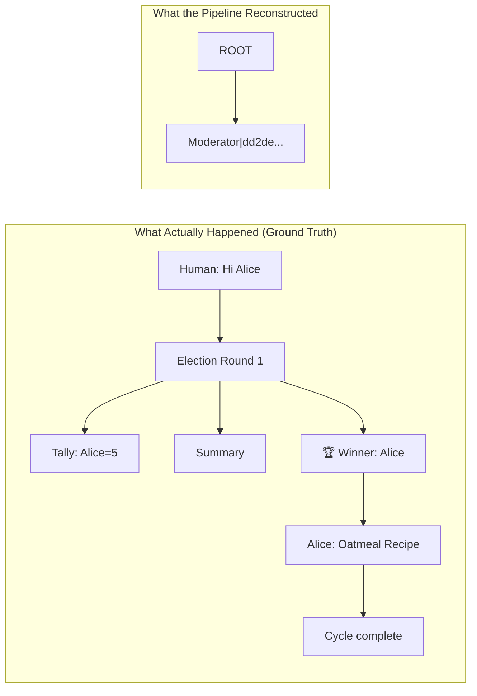
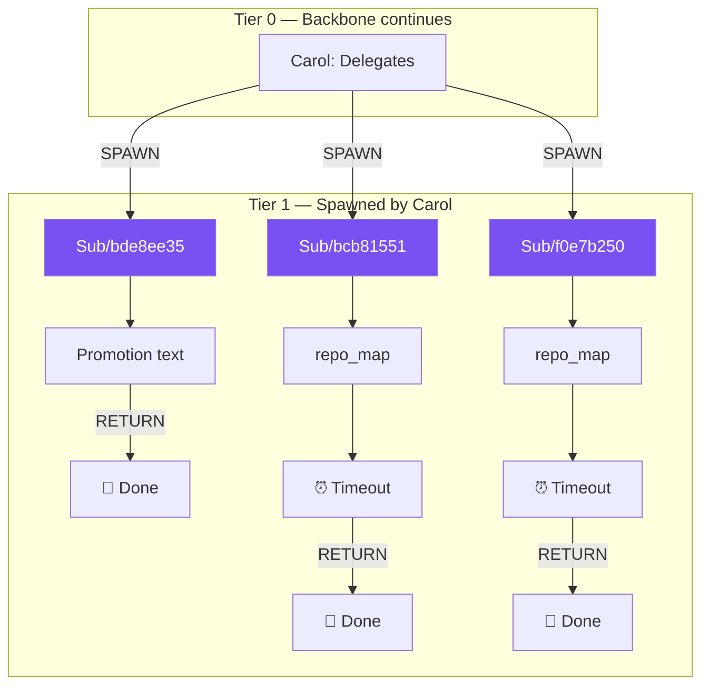
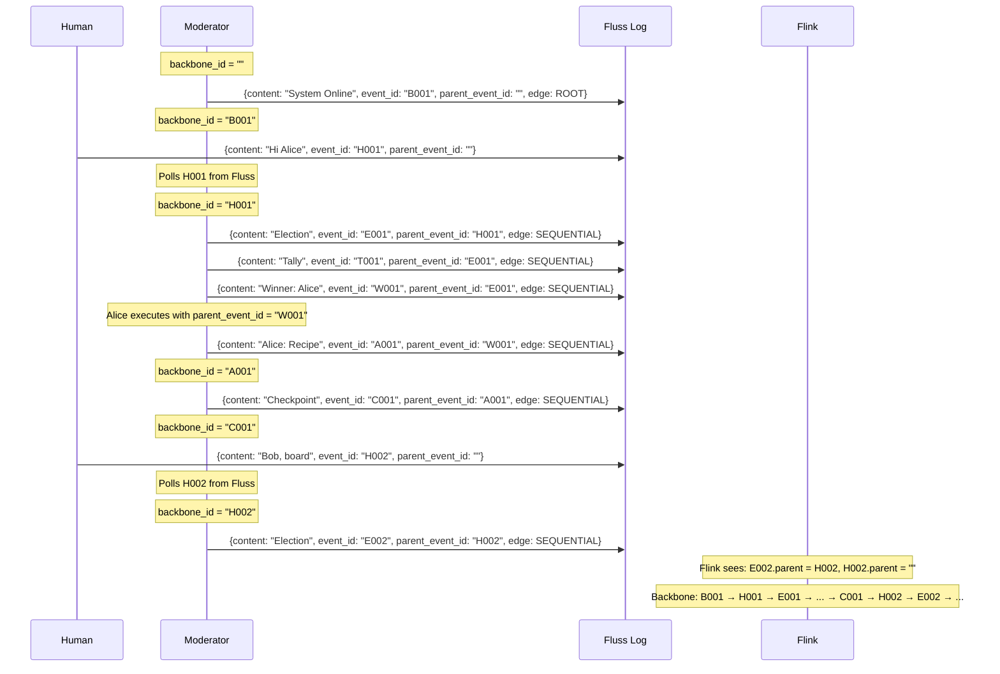
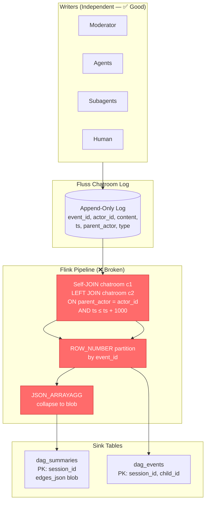
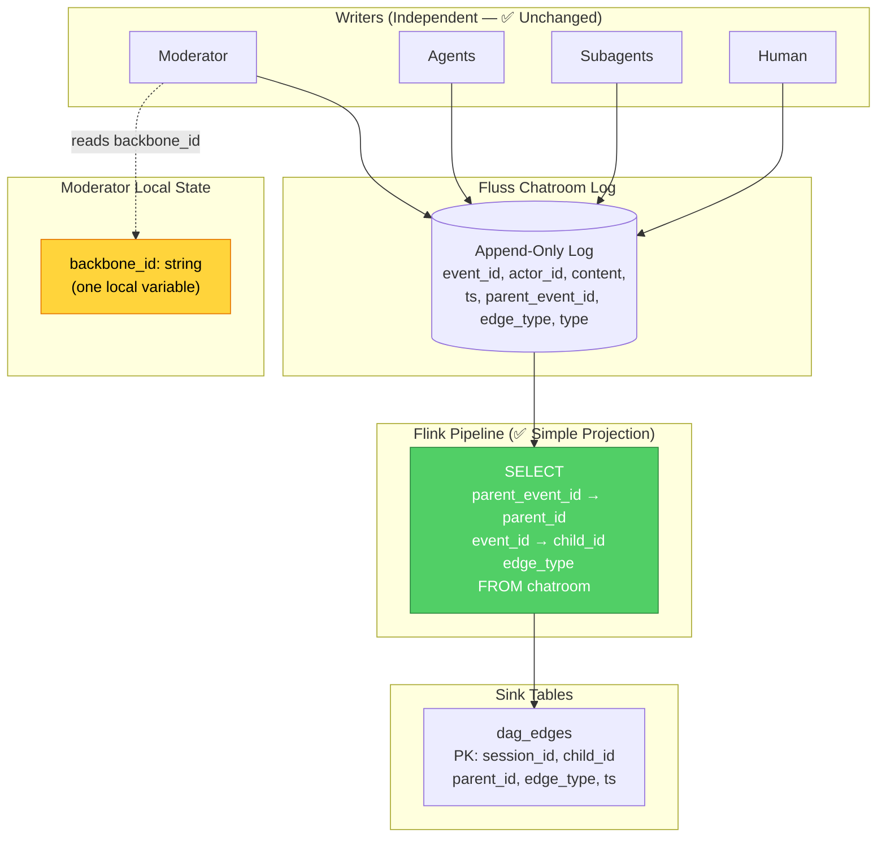
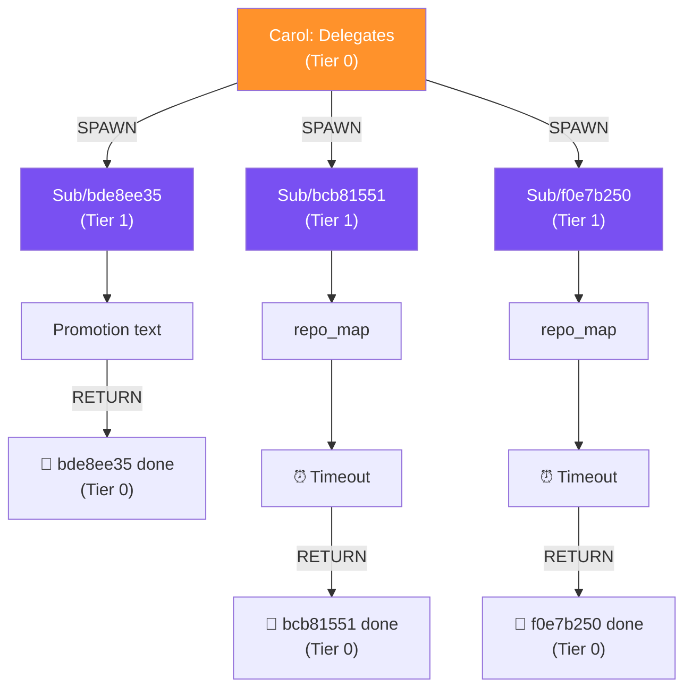

# Solution Proposal Part 5: Deterministic DAG via Linear Backbone with Tiering

## Executive Summary

The current DAG pipeline is **fundamentally broken** because it attempts to reconstruct causal relationships by *heuristic self-joining* the chatroom log — guessing parentage from `parent_actor` name + timestamp proximity. The result: **36 events produce exactly 1 edge** (ROOT → Moderator), because the `LEFT JOIN` on `parent_actor = actor_id` within a 1-second window is a non-unique, non-deterministic match that collapses nearly everything to `ROOT`.

The fix is architectural, not surgical. We adopt the **In-Reply-To** pattern — each event carries an explicit, immutable reference to the specific event it responds to, recorded **at event creation time** — but crucially, we combine this with the **Linear Backbone with Tiering** model:

- **The Backbone (Tier 0):** A single, unbroken sequence of events representing the user's experience: `System Online → Human Input → Election → Agent Output → Checkpoint → Human Input → ...`. Every cycle chains to the next via a single `backbone_id` local variable in the Moderator's `run()` loop. There is **one line**, not a tree.
- **Tiering (Y-axis):** A tier drop occurs **only** when a `SPAWN` edge is recorded (i.e., a `delegate` tool call). The subagent's events form their own sequential chain at Tier 1 (or deeper), running in parallel with the backbone. When the subagent completes, a `RETURN` edge links its final event back to the backbone.
- **The Flywheel:** All writers (Human, Agents, Subagents, Moderator) remain fully independent. No agent tracks the DAG. The Moderator merely passes a UUID string — already in local scope — as an additional argument to `publish()`. This is **tagging** a push to the log, not **chaining** a blocking dependency.

This transforms the Flink pipeline from a 60-line heuristic join into a 5-line deterministic projection.

---

## Table of Contents

1. [First Principles: The Physics of Causality](#1-first-principles-the-physics-of-causality)
2. [Diagnostic: Why the Current Pipeline Fails](#2-diagnostic-why-the-current-pipeline-fails)
3. [The Linear Backbone with Tiering Model](#3-the-linear-backbone-with-tiering-model)
4. [Architecture Overview](#4-architecture-overview)
5. [Detailed Code Changes](#5-detailed-code-changes)
    - [5.1 Schema Layer](#51-schema-layer-schemasspy)
    - [5.2 Publisher Layer](#52-publisher-layer-publisherpy)
    - [5.3 Moderator Layer](#53-moderator-layer-moderatorpy)
    - [5.4 Tool Executor Layer](#54-tool-executor-layer-tool_executorpy)
    - [5.5 Subagent Layer](#55-subagent-layer-subagent_managerpy--agent_contextpy)
    - [5.6 Flink Pipeline Layer](#56-flink-pipeline-layer-dagpipelinejava)
    - [5.7 Telemetry Sink Tables](#57-telemetry-sink-tables-telemetryjobjava)
6. [Invariants and Correctness Proof](#6-invariants-and-correctness-proof)
7. [Migration Strategy](#7-migration-strategy)
8. [Verification Plan](#8-verification-plan)

---

## 1. First Principles: The Physics of Causality

### The Speed of Light Constraint

In any distributed system, the **speed of light** is the ultimate limiting factor for information propagation. When Agent A produces event `e₁` and Agent B then produces event `e₂` in response, the causal relationship `e₁ → e₂` is a **physical fact** that exists at the moment `e₂` is created. At that moment, the writer of `e₂` necessarily holds a reference to `e₁` (or at minimum, knows *what* it is replying to) — because that's what triggered the write.

**This is the fastest possible time to record causality.** Any later reconstruction adds latency, ambiguity, and potential for error.

### Information-Theoretic Argument

Once the writer discards the causal link and publishes only the payload + timestamp, that information is **irrecoverably lost**. No downstream pipeline — no matter how clever its joins or windows — can deterministically recover it. This is not a bug in the Flink SQL; it is a consequence of the **Data Processing Inequality**:

> If `X → Y → Z` is a Markov chain, then `I(X;Z) ≤ I(X;Y)`.

The mutual information between the DAG structure (`X`) and the noisy timestamp-based reconstruction (`Z`) is strictly less than the mutual information between the DAG structure and the event at creation time (`Y`). **You cannot recover signal that was never encoded.**

### The Email Analogy

The current system is like an email server that strips all `In-Reply-To` and `References` headers before storing messages. To reconstruct threads, a downstream process tries to match `From:` fields against previous messages within a time window. This works for a quiet inbox; it collapses catastrophically when:

- Multiple agents send near-simultaneously (the 1000ms window captures many candidates)
- The same actor sends multiple messages (elections emit 3 messages per round in the same millisecond — tally, summary, winner — all with `ts` identical)
- A subagent's `parent_actor` is `""` (empty string), causing the `LEFT JOIN` to produce no match, collapsing to `ROOT`

The fix: **keep the headers.**

---

## 2. Diagnostic: Why the Current Pipeline Fails

### 2.1 The Broken Self-Join

From [`DagPipeline.java`](../telemetry/src/main/java/com/containerclaw/telemetry/DagPipeline.java):

```sql
FROM fluss_catalog.containerclaw.chatroom c1
LEFT JOIN fluss_catalog.containerclaw.chatroom c2
  ON c1.session_id = c2.session_id
  AND c1.parent_actor = c2.actor_id      -- ⚠️ name-based, non-unique
  AND c2.ts <= c1.ts + 1000              -- ⚠️ allows future parents
```

**Failure modes observed in the production logs:**

| Event | `parent_actor` | What the JOIN finds | Result |
|-------|---------------|-------------------|--------|
| Moderator election messages (tally, summary, winner) | `""` (empty) | No match → `c2.event_id IS NULL` | All collapse to `ROOT` |
| Subagent `Sub/bde8ee35` output | `Subagent/bde8ee35` | Looks for `actor_id = 'Subagent/bde8ee35'` — **no such actor exists** | Collapses to `ROOT` |
| Tool result `[Tool Result for Bob] board` | `Bob` | Finds *any* Bob event within 1s — which Bob event? | Non-deterministic |
| Human messages | `""` | No match | `ROOT` |
| Carol's delegate calls (5 events, all at `ts ≈ 1775001115845`) | `""` | No match for most | `ROOT` |

**Out of 36+ chatroom events, only 1 edge survives**: `ROOT → Moderator|dd2de7b0...`

### 2.2 The parent_actor ≠ parent_event Problem

The schema has `parent_actor` (a string like `"Carol"`, `"Sub/bcb81551"`, or `"Subagent/bde8ee35"`), but this is an **actor name**, not an **event pointer**. The relationship is:

```
parent_actor: "Who spawned me?" (ambiguous — the actor has many events)
parent_event_id: "Which specific event am I replying to?" (deterministic)
```

Looking at the log data, the `parent_actor` field is:
- **Empty** for 90%+ of events (Moderator election messages, human input, agent output)
- **Set** only for Moderator tool-result events (e.g., `parent_actor: 'Bob'` for `[Tool Result for Bob]`)
- **Inconsistently formatted** even when present (e.g., `'Subagent/bde8ee35'` vs `'Sub/bde8ee35'`)

### 2.3 Timestamp Collision

The election protocol is the most dramatic example. When the Moderator publishes election results, it emits **3 events with identical timestamps**:

```python
# From the logs — all at ts: 1775001017871
'Round 1 Tally: ...'      # type: thought
'Election Summary: ...'   # type: voting
'🏆 Winner: Bob'          # type: thought
```

The `ROW_NUMBER() OVER (PARTITION BY c1.event_id ORDER BY c2.ts DESC)` cannot disambiguate between them because `ts` is not unique within an actor.



### 2.4 The JSON Aggregation Anti-Pattern

```sql
JSON_ARRAYAGG(JSON_OBJECT('parent' VALUE parent_id, ...)) AS edges_json
```

This collapses ALL edges for a session into a single JSON blob in `dag_summaries`. Problems:

1. **No incremental SSE**: The UI must re-parse the entire blob on every update
2. **No partial recomputation**: If one edge changes, the entire blob is rewritten
3. **State retention pressure**: The `GROUP BY session_id` forces Flink to retain all edges in state, bounded by the 10-minute `idleStateRetention` — meaning after 10 minutes of inactivity, the DAG simply **disappears**

---

## 3. The Linear Backbone with Tiering Model

### Why Not a Tree?

The previous iteration of this proposal (and the original ChatGPT review) modeled the DAG as a **tree** fanning out from ROOT, with each human message starting an independent branch:

```
ROOT → Human: Hi Alice → Election → Alice → Checkpoint
ROOT → Human: Bob, board → Election → Bob → Checkpoint
ROOT → Human: Carol, spawn → Election → Carol → Delegate
```

This is **wrong**. It contradicts the user's actual experience, which is a single continuous conversation:

> "Hi Alice, oatmeal recipe?" → Alice responds → "Bob, add to board" → Bob responds → "Carol, spawn subagents" → Carol delegates → ...

The user sees one thread, not three. Each human message doesn't start a new conversation — it continues the existing one. The previous checkpoint is the predecessor of the next human input. This is the **Linear Backbone**.

### The Mental Model: Sequence with Depth

Instead of a tree, the DAG is a **Linear Backbone with Tiers** — think of it as a swimlane diagram:

```mermaid
graph LR
    subgraph "Tier 0 — Main Backbone"
        direction LR
        BOOT["System Online"] --> H1["Human: Hi Alice"]
        H1 --> E1["Election"]
        E1 --> A1["Alice: Recipe"]
        A1 --> CP1["Checkpoint"]
        CP1 --> H2["Human: Bob, board"]
        H2 --> E2["Election"]
        E2 --> B1["Bob: Created T-001"]
        B1 --> CP2["Checkpoint"]
        CP2 --> H3["Human: Carol, spawn"]
        H3 --> E3["Election"]
        E3 --> C1["Carol: Delegates"]
        C1 --> CP3["Checkpoint"]
    end
```





**Key rule:**
- `SEQUENTIAL` edges stay on the **same tier** (the backbone, or within a subagent's own chain)
- `SPAWN` edges **drop to tier + 1** (the only way to increase depth)
- `RETURN` edges **come back up** to the parent tier

The UI computes `depth(child) = depth(parent)` for SEQUENTIAL edges, and `depth(child) = depth(parent) + 1` for SPAWN edges. No heuristic needed.

### The In-Reply-To Mechanism

Every event published to the chatroom carries an **optional** `parent_event_id` field — the UUID of the **specific event** that this event is a continuation of. It is:

- **Recorded at creation time** (zero additional latency — the speed of light)
- **Immutable once written** (append-only log semantics preserved)
- **Optional by design** (the boot event has `parent_event_id = ""`, becoming the root)
- **A known fact, not a guess** (the writer holds this UUID in local scope)

This is the exact analog of the `In-Reply-To:` header in RFC 2822 (email), or the `thread_ts` in Slack's API.

> **"Maintain the independence of all operations and merely append a known fact to an existing process"**

The operations remain independent. No agent needs to "know about" the DAG, track global state, or wait for anything. Each writer simply appends one additional string field — a UUID it already holds in local scope — to the record it was already going to write.

### The Backbone Variable: `backbone_id`

The linear backbone is maintained by **one local variable** in the Moderator's `run()` loop: `backbone_id`. This variable holds the `event_id` of the most recent "backbone-advancing" event. It is updated at exactly four points:

1. **Boot:** `backbone_id = boot_event_id`
2. **Human input arrives:** `backbone_id = human_event_id` (captured from the incoming Fluss record)
3. **Agent final output:** `backbone_id = agent_output_event_id`
4. **Checkpoint:** `backbone_id = checkpoint_event_id`

Election sub-events (tally, summary) are **children of the election-start event**, not of the backbone. They are side-branches that the UI can collapse. The winner announcement is also a child of the election start, but the *agent's output* chains from the winner — and the agent's output *does* advance the backbone.

### Why These Three Concepts Are Non-Contradictory

One might worry that "Linear Backbone" and "In-Reply-To" and "Flywheel Independence" are in tension. They are not. Here's the formal argument:

**Claim:** The Linear Backbone with Tiering model can be implemented via In-Reply-To metadata recorded at event creation time, without introducing any blocking dependencies between writers.

**Proof by construction:**

| Writer | How it gets `parent_event_id` | Blocking? |
|--------|------------------------------|----------|
| **Human** (bridge/client) | Writes to Fluss with `parent_event_id = ""`. The Moderator later captures the human event's `event_id` from the incoming batch and uses it as `backbone_id`. | No — Human writes independently. |
| **Moderator** (election, winner, checkpoint) | Uses `backbone_id` — a local variable already in scope from the previous publish call's return value. | No — local variable read, zero network cost. |
| **Agent** (winner's output, tool calls) | Receives `parent_event_id` as an argument from the Moderator when `execute_with_tools()` is called. The agent doesn't store it — the ToolExecutor threads it through. | No — function argument, zero cost. |
| **Subagent** (spawned by delegate) | Receives `parent_event_id` from the `DelegateTool.execute()` call → `SubagentManager.spawn()`. | No — function argument at spawn time. |

Every `parent_event_id` is either:
- `""` (root/human events) — no dependency
- A return value from the *caller's own previous* `publish()` call — already in local scope
- A value passed as a function argument from the immediate caller — zero-cost transfer

**No writer waits for any other writer.** The backbone is merely the *consequence* of the Moderator passing its own local `backbone_id` forward through its sequential loop. The agents don't know the backbone exists.

### How the Backbone Handles Human Messages

Human messages present a subtle design question: the Human writes to Fluss independently (via the bridge), so the Human's `parent_event_id` is `""`. How does the backbone stay linear?

The answer: **the Moderator is the backbone bookkeeper, not the Human.** When the Moderator polls a human message from Fluss, it extracts the human message's `event_id` from the incoming `RecordBatch` and sets `backbone_id = human_event_id`. The election that follows then uses this `backbone_id` as its `parent_event_id`.

From the DAG's perspective, the chain is:
```
... → Checkpoint(event_id=X) → [gap: moderator polls] → Election(parent_event_id=H) → ...
```

Where `H` is the human message's `event_id`. The human message itself has `parent_event_id = ""`, but the Moderator's election event points to it. This creates the backbone link:
```
Checkpoint → Human Message → Election → Agent → Checkpoint → ...
```

The Human message is incorporated into the backbone because the Moderator *uses it as its next parent*. The Human didn't need to know the backbone existed.

### Sequence Diagram: The Complete Flywheel



**Result:** A single, unbroken line. The Flink pipeline just reads `parent_event_id` and emits an edge. No joins. No windows. No guessing.

---

## 4. Architecture Overview

### Current Architecture (Broken)



### Proposed Architecture (Deterministic Linear Backbone)



### Causal Graph: The Linear Backbone (What the DAG Should Look Like)

Reconstructed from the production logs with the Linear Backbone model. Note: this is **one line**, not a tree. Human messages don't fan out from ROOT — they chain to the previous checkpoint.


And the spawned subagents live on **Tier 1**, linked by `SPAWN`/`RETURN` edges:



**Election sub-events** (tally, summary) are children of the election-start event — they branch off the backbone as collapsible detail. Only the **winner announcement → agent output → checkpoint** sequence advances the backbone.

This means the UI can compute tier depth trivially:

```
depth(event) =
  if edge_type == SPAWN  → depth(parent) + 1
  if edge_type == RETURN → depth(parent) - 1
  else                   → depth(parent)
```

---

## 5. Detailed Code Changes

### 5.1 Schema Layer (`schemas.py`)

**What changes:** Add two new fields to `CHATROOM_SCHEMA`.

**Why:**
- `parent_event_id` (string): The UUID of the event this record replies to. Empty string `""` for root events (human input, system boot). This is the In-Reply-To header.
- `edge_type` (string): One of `SEQUENTIAL`, `SPAWN`, `RETURN`, or `ROOT`. This records the *nature* of the causal link, not just its existence. Without this, the UI cannot distinguish "this agent continued working" from "this agent spawned a child".

**Defending the decision to put edge_type on the source event:**
The alternative would be to compute `edge_type` in Flink from the `type` field. But the `type` field represents the *content type* of the event (`thought`, `output`, `action`, `voting`, `system`, `checkpoint`, `convergence`), not the *causal relationship*. One content type can participate in different edge types: a `system` message might be a `SPAWN` (subagent creation) or a `SEQUENTIAL` (timeout notification). Only the writer knows the intent.

```diff
 CHATROOM_SCHEMA = pa.schema([
     pa.field("event_id", pa.string()),      # UUID — primary dedup key
     pa.field("session_id", pa.string()),
     pa.field("ts", pa.int64()),
     pa.field("actor_id", pa.string()),
     pa.field("content", pa.string()),
     pa.field("type", pa.string()),
     pa.field("tool_name", pa.string()),
     pa.field("tool_success", pa.bool_()),
     pa.field("parent_actor", pa.string()),
+    pa.field("parent_event_id", pa.string()),  # In-Reply-To: UUID of causal parent
+    pa.field("edge_type", pa.string()),         # SEQUENTIAL | SPAWN | RETURN | ROOT
 ])
```

**Backward compatibility:** Both new fields default to `""`. Existing events with `parent_event_id = ""` are treated as root nodes. The `parent_actor` field is **retained but deprecated** — it continues to be written for backward-compatible log consumers, but is no longer used by the DAG pipeline.

---

### 5.2 Publisher Layer (`publisher.py`)

**What changes:** Accept and propagate the two new fields through the publish path.

**Why:** The publisher is the single write path for all chatroom events. It must carry the new fields from the caller to the Fluss log. The change is purely structural — adding two more fields to the record dict and the PyArrow batch construction.

**Critical design decision: `publish()` returns `event_id`.**
This is already the case (the method returns a UUID string). This return value is what enables the In-Reply-To pattern: the caller publishes an event, receives its `event_id`, and passes that as `parent_event_id` to the next publish call. This is **zero-cost** — the UUID is generated at the top of the method and returned at the bottom. No new computation.

```diff
     async def publish(
         self,
         actor_id: str,
         content: str,
         m_type: str = "output",
         tool_name: str = "",
         tool_success: bool = False,
         parent_actor: str = "",
+        parent_event_id: str = "",
+        edge_type: str = "SEQUENTIAL",
     ) -> str:

         record = {
             "event_id": event_id,
             "session_id": self.session_id,
             "ts": ts,
             "actor_id": actor_id,
             "content": content,
             "type": m_type,
             "tool_name": tool_name,
             "tool_success": tool_success,
             "parent_actor": parent_actor,
+            "parent_event_id": parent_event_id,
+            "edge_type": edge_type,
         }
```

And in `_flush_locked()`, the batch construction adds the two new arrays:

```diff
             batch = pa.RecordBatch.from_pydict(
                 {
                     "event_id": [r["event_id"] for r in records],
                     ...
                     "parent_actor": [r["parent_actor"] for r in records],
+                    "parent_event_id": [r["parent_event_id"] for r in records],
+                    "edge_type": [r["edge_type"] for r in records],
                 },
                 schema=self._schema,
             )
```

---

### 5.3 Moderator Layer (`moderator.py`) — The Backbone Bookkeeper

**What changes:** The `publish()` wrapper returns `event_id`. The `run()` method maintains the `backbone_id` local variable. The `_process_batches` method extracts `event_id` from human messages.

**Why — the Moderator is the sole backbone bookkeeper:**
The Moderator governs the `poll → elect → execute → checkpoint` loop. It is the only component that sees the linear sequencing of the conversation. It doesn't "track the DAG" — it merely remembers **one string**: the `event_id` of the most recent backbone-advancing event.

**The backbone_id variable advances at exactly four points:**

| Point | What sets `backbone_id` | Why |
|-------|------------------------|-----|
| Boot | `publish("System Online")` return value | Session starts |
| Human input | `event_id` extracted from incoming Fluss batch | New user intent |
| Agent final output | `publish(agent_output)` return value | Agent completed work |
| Checkpoint | `publish("Cycle complete.")` return value | Cycle closes |

Election sub-events (tally, summary) are **children of the election-start event** — they hang off the backbone as collapsible detail but do NOT advance `backbone_id`. This addresses the concern about Moderator message noise: the backbone stays clean, and the UI can collapse election internals.

**Publish wrapper — now returns event_id:**

```diff
     async def publish(self, actor_id, content, m_type="output",
-                      tool_name="", tool_success=False, parent_actor=""):
+                      tool_name="", tool_success=False, parent_actor="",
+                      parent_event_id="", edge_type="SEQUENTIAL"):
         """Publish a message via the batched FlussPublisher."""
         try:
-            await self.publisher.publish(
+            return await self.publisher.publish(
                 actor_id=actor_id,
                 content=content,
                 m_type=m_type,
                 tool_name=tool_name,
                 tool_success=tool_success,
                 parent_actor=parent_actor,
+                parent_event_id=parent_event_id,
+                edge_type=edge_type,
             )
-            print(f"📝 [Moderator] Published: {actor_id} ({m_type})")
         except Exception as e:
             print(f"❌ [Moderator] Failed to publish: {e}")
+            return ""
```

**Capturing human event_id from incoming batches:**

The `_process_batches` method already iterates over incoming records. We extend it to capture the `event_id` of human messages so the backbone can link to them:

```diff
     async def _process_batches(self, batches) -> bool:
         any_human_interrupted = False
         for poll in batches:
             if poll.num_rows > 0:
                 df = poll.to_pandas()
                 for _, row in df.iterrows():
                     sid = row.get("session_id")
                     if sid != self.session_id:
                         continue
                     if await self._handle_single_message(row['actor_id'], row['content'], row['ts']):
                         any_human_interrupted = True
+                        # Capture the human event's ID to become the next backbone parent
+                        self._last_human_event_id = row.get('event_id', '')
```

This is the critical bridge: the Human writes independently with `parent_event_id = ""`, but the Moderator **picks up** the human event's `event_id` from the stream and uses it as `backbone_id` for the next election. The backbone stays linear without requiring the Human to know anything about it.

**The `run()` loop — the Linear Backbone in action:**

```python
async def run(self, autonomous_steps=0):
    ...
    self._last_human_event_id = ""  # Captured from incoming batches

    # Boot event — the backbone starts here
    backbone_id = await self.publish(
        "Moderator",
        f"Multi-Agent System Online. ConchShell: {conchshell_status}.",
        "thought",
        parent_event_id="",
        edge_type="ROOT",
    )

    while True:
        batches = await FlussClient.poll_async(self.scanner, timeout_ms=500)
        human_interrupted = await self._process_batches(batches)

        if human_interrupted or (self.current_steps != 0):
            ...

            # If a human triggered this cycle, their event IS the backbone parent
            if self._last_human_event_id:
                backbone_id = self._last_human_event_id
                self._last_human_event_id = ""  # Consume it

            # ── Election ──────────────────────────────────────
            # Election start is a child of the backbone
            election_start_id = await self.publish(
                "Moderator", f"🗳️ Election Round 1...", "thought",
                parent_event_id=backbone_id,
                edge_type="SEQUENTIAL",
            )

            winner, election_log, is_job_done = await self.election.run_election(...)

            # Tally + Summary: children of election-start (side branches, not backbone)
            await self.publish(
                "Moderator", f"Election Summary:\n{election_log}", "voting",
                parent_event_id=election_start_id,
                edge_type="SEQUENTIAL",
            )

            if winner:
                # Winner announcement: child of election-start
                winner_id = await self.publish(
                    "Moderator", f"🏆 Winner: {winner}", "thought",
                    parent_event_id=election_start_id,
                    edge_type="SEQUENTIAL",
                )

                # ── Agent Execution ───────────────────────────
                # Pass winner_id down; tool calls chain from it
                if self.executor:
                    resp = await self.executor.execute_with_tools(
                        winning_agent,
                        check_halt_fn=lambda: self.current_steps == 0,
                        parent_event_id=winner_id,
                    )
                else:
                    resp = await ToolExecutor.execute_text_only(
                        winning_agent, self.context.get_window
                    )

                if resp and "[WAIT]" not in resp:
                    # Agent output advances the backbone
                    backbone_id = await self.publish(
                        winner, resp, "output",
                        parent_event_id=winner_id,
                        edge_type="SEQUENTIAL",
                    )

            # ── Checkpoint ────────────────────────────────────
            # Closes this cycle, becomes the backbone head for the next
            backbone_id = await self.publish(
                "Moderator", "Cycle complete.", "checkpoint",
                parent_event_id=backbone_id,
                edge_type="SEQUENTIAL",
            )
```

**What this produces (concrete example from the production logs):**

| Step | `backbone_id` before | Event published | `parent_event_id` | `backbone_id` after |
|------|---------------------|-----------------|-------------------|--------------------|
| Boot | `""` | System Online (`B001`) | `""` | `B001` |
| Human polls in | `B001` | *(not published by moderator)* | | `H001` (captured) |
| Election start | `H001` | Election Round 1 (`E001`) | `H001` | `H001` (unchanged) |
| Winner | `H001` | 🏆 Winner: Alice (`W001`) | `E001` | `H001` (unchanged) |
| Agent output | `H001` | Alice: Recipe (`A001`) | `W001` | `A001` ✅ advances |
| Checkpoint | `A001` | Cycle complete (`C001`) | `A001` | `C001` ✅ advances |
| Human polls in | `C001` | *(not published by moderator)* | | `H002` (captured) |
| Election start | `H002` | Election Round 1 (`E002`) | `H002` | `H002` (unchanged) |
| ... | | | | |

The backbone is: `B001 → H001 → E001 → W001 → A001 → C001 → H002 → E002 → ...`

**Critical insight: `_handle_single_message` does NOT need modification beyond the event_id capture.** It only processes *incoming* messages from the log for context building. The causal metadata is only needed on the *write* path. The read path remains untouched.

---

### 5.4 Tool Executor Layer (`tool_executor.py`)

**What changes:** The executor accepts a `parent_event_id` parameter and threads it through tool call events.

**Why:** When an agent calls a tool, the ToolExecutor publishes multiple events:
1. The tool invocation (`$ board create ...`) — child of the winner announcement
2. The tool result (`✅ Created T-001`) — child of the tool invocation
3. The Moderator's result relay (`[Tool Result for Bob]`) — child of the tool invocation

Each event's `parent_event_id` is the event that *caused* it. The tool invocation is caused by the winner announcement. The tool result is caused by the tool invocation. This is a **strictly linear** chain within a tool round.

```diff
-    async def execute_with_tools(self, agent, check_halt_fn) -> str | None:
+    async def execute_with_tools(self, agent, check_halt_fn,
+                                  parent_event_id: str = "") -> str | None:

         ...
+        current_parent = parent_event_id

         for round_num in range(config.MAX_TOOL_ROUNDS):
             ...
             for call in fn_calls:
                 ...
                 # Publish tool invocation
-                await self.publish(
+                tool_call_id = await self.publish(
                     agent.agent_id,
                     f"$ {tool_name} {json.dumps(tool_args)[:200]}",
                     "action",
+                    parent_event_id=current_parent,
+                    edge_type="SEQUENTIAL",
                 )

                 result = await self.dispatcher.execute(...)

                 # Publish tool result (child of tool call)
-                await self.publish(
+                tool_result_id = await self.publish(
                     agent.agent_id,
                     f"{'✅' if result.success else '❌'} {result_summary[:500]}",
                     "action",
+                    parent_event_id=tool_call_id,
+                    edge_type="SEQUENTIAL",
                 )

                 # Moderator relay (child of tool call)
                 await self.publish(
                     "Moderator", tool_result_content, "action",
                     tool_name=tool_name,
                     tool_success=result.success,
                     parent_actor=agent.agent_id,
+                    parent_event_id=tool_call_id,
+                    edge_type="SEQUENTIAL",
                 )

+                current_parent = tool_result_id  # Chain for next tool call
```

**Note:** The `publish` function used by ToolExecutor is injected via `publish_fn` callback. The moderator's `self.publish` already accepts the new parameters. For subagents, the `_subagent_publish` wrapper in `subagent_manager.py` must pass them through as `**kwargs`.

---

### 5.5 Subagent Layer (`subagent_manager.py` + `agent_context.py`)

**What changes:** Subagent spawning records a `SPAWN` edge from the delegate tool call to the subagent's first event. Subagent completion records a `RETURN` edge.

**Why:** The delegate tool is the only place where the DAG branches. When Carol calls `delegate(task="...")`, the resulting subagent must be linked to Carol's delegate call with `edge_type="SPAWN"`. When the subagent finishes (or times out), the convergence event links back with `edge_type="RETURN"`.

#### In `SubagentManager.spawn()`:

The `spawn()` method needs to know the `event_id` of the delegate tool call that triggered it. This is passed from the `DelegateTool.execute()` method.

```diff
     async def spawn(
         self,
         task_desc: str,
         agent_persona: str = "General-purpose software engineer",
         tool_names: list[str] | None = None,
         available_tools: list[Tool] | None = None,
         timeout_s: int = 120,
+        parent_event_id: str = "",
     ) -> str:
         ...
         # Create the isolated context
         ctx = AgentContext.create(
             agent=agent,
             session_id=self.session_id,
             fluss_client=self.fluss,
             table=self.table,
             tool_dispatcher=dispatcher,
             parent_actor=f"Subagent/{task_id}",
+            parent_event_id=parent_event_id,
         )

         # System announcement — this is a SPAWN edge
-        await self.publisher.publish(
+        spawn_event_id = await self.publisher.publish(
             actor_id="Moderator",
             content=f"🔱 Spawned subagent {task_id} ({agent_persona}): {task_desc}",
             m_type="system",
+            parent_event_id=parent_event_id,
+            edge_type="SPAWN",
         )

         # Pass spawn_event_id to the subagent so it can chain from it
-        async_task = asyncio.create_task(
-            self._run_subagent(task_id, ctx, task_desc, timeout_s)
-        )
+        async_task = asyncio.create_task(
+            self._run_subagent(task_id, ctx, task_desc, timeout_s,
+                               parent_event_id=spawn_event_id)
+        )
```

#### In `AgentContext.publish()`:

The context tracks `parent_event_id` for its own event chain:

```diff
     async def publish(self, content: str, m_type: str = "output",
+                       parent_event_id: str = "",
+                       edge_type: str = "SEQUENTIAL"):
         if self.publisher:
-            await self.publisher.publish(
+            return await self.publisher.publish(
                 actor_id=self.agent_id,
                 content=content,
                 m_type=m_type,
                 parent_actor=self.parent_actor,
+                parent_event_id=parent_event_id,
+                edge_type=edge_type,
             )
+        return ""
```

#### Convergence (subagent completion):

In `_run_subagent()`'s `finally` block:

```diff
         finally:
             ...
             # Publish convergence event — RETURN edge back to main thread
-            await self.publisher.publish(
+            await self.publisher.publish(
                 actor_id="Moderator",
                 content=f"🏁 Subagent {task_id} completed.",
                 m_type="convergence",
+                parent_event_id=last_subagent_event_id,
+                edge_type="RETURN",
             )
```

#### In `DelegateTool.execute()`:

The delegate tool needs to capture the last published `event_id` from the tool executor's context so it can pass it to the subagent:

```diff
     async def execute(self, agent_id: str, params: dict) -> ToolResult:
         ...
         try:
             task_id = await self.subagent_manager.spawn(
                 task_desc=task_desc,
                 agent_persona=persona,
                 tool_names=tool_names,
                 available_tools=self.available_tools,
                 timeout_s=timeout_s,
+                parent_event_id=params.get("_parent_event_id", ""),
             )
```

The `_parent_event_id` is injected by the ToolExecutor when it invokes the delegate tool. This is an internal convention — the underscore prefix signals it's metadata, not a user-facing parameter.

---

### 5.6 Flink Pipeline Layer (`DagPipeline.java`)

**What changes:** Delete the self-join, window function, and JSON aggregation. Replace with a simple `SELECT` projection.

**Why:** With `parent_event_id` recorded in the log, the Flink pipeline doesn't need to *infer* anything. It simply reads the columns and constructs the edge.

#### New `getDeltaInsertSql()`:

```java
public static String getDeltaInsertSql() {
    return
        "INSERT INTO fluss_catalog.containerclaw.dag_edges\n"
        + "SELECT\n"
        + "    session_id,\n"
        + "    CASE\n"
        + "        WHEN parent_event_id = '' OR parent_event_id IS NULL THEN 'ROOT'\n"
        + "        ELSE parent_event_id\n"
        + "    END AS parent_id,\n"
        + "    event_id AS child_id,\n"
        + "    actor_id AS child_actor,\n"
        + "    CASE\n"
        + "        WHEN edge_type IS NOT NULL AND edge_type <> '' THEN edge_type\n"
        + "        ELSE 'SEQUENTIAL'\n"
        + "    END AS edge_type,\n"
        + "    CASE\n"
        + "        WHEN `type` IN ('finish', 'done', 'checkpoint', 'convergence') THEN 'DONE'\n"
        + "        WHEN `type` = 'action' THEN 'THINKING'\n"
        + "        ELSE 'ACTIVE'\n"
        + "    END AS status,\n"
        + "    ts AS updated_at\n"
        + "FROM fluss_catalog.containerclaw.chatroom";
}
```

**What was deleted:**

| Deleted Component | Lines | Why It Existed | Why It's No Longer Needed |
|---|---|---|---|
| `LEFT JOIN chatroom c2 ON ...` | 4 | Tried to find parent by actor name + time | `parent_event_id` gives us the exact parent |
| `ROW_NUMBER() OVER (...)` | 1 | Disambiguated multiple join matches | No join = no ambiguity |
| `WHERE rn = 1` | 1 | Picked "best" match from ROW_NUMBER | Not needed |
| `JSON_ARRAYAGG(JSON_OBJECT(...))` | 8 | Collapsed all edges into one blob | Replaced by per-edge rows |
| `getSnapshotInsertSql()` | 25 | Full-blob snapshot for polling API | Replaced by direct scan of `dag_edges` |

#### The snapshot pipeline is now optional:

The `dag_summaries` table (JSON blob per session) was needed because the old `dag_events` table was unreliable. With deterministic edges, the `dag_edges` table is the source of truth. The bridge can either:

1. **Scan `dag_edges`** for a full DAG load on session open
2. **Use `dag_summaries`** as a materialized view (if desired for O(1) lookup)

For simplicity, we recommend keeping only `dag_edges` and having the bridge perform a filtered scan. This eliminates the JSON aggregation entirely.

---

### 5.7 Telemetry Sink Tables (`TelemetryJob.java`)

**What changes:** Replace `dag_summaries` and `dag_events` with a single `dag_edges` table with richer schema.

```java
// New: deterministic per-edge table
tableEnv.executeSql(
    "CREATE TABLE IF NOT EXISTS fluss_catalog." + database + ".dag_edges ("
    + "    session_id STRING,"
    + "    parent_id STRING,"           // parent event_id or 'ROOT'
    + "    child_id STRING,"            // child event_id
    + "    child_actor STRING,"         // actor_id for UI label
    + "    edge_type STRING,"           // SEQUENTIAL | SPAWN | RETURN | ROOT
    + "    status STRING,"              // ACTIVE | THINKING | DONE
    + "    updated_at BIGINT,"
    + "    PRIMARY KEY (session_id, child_id) NOT ENFORCED"
    + ") WITH ('bucket.num' = '4', 'bucket.key' = 'session_id')"
);
```

The `actor_heads` table remains as-is (it's a simple projection).

The statement set becomes:

```java
stmtSet.addInsertSql(DagPipeline.getActorHeadsInsertSql());
stmtSet.addInsertSql(DagPipeline.getDeltaInsertSql());
stmtSet.addInsertSql(MetricsPipeline.getInsertSql());
// Removed: getSnapshotInsertSql()  — no longer needed
```

---

## 6. Invariants and Correctness Proof

### Invariant 1: The backbone is linear

**Proof:** The `backbone_id` variable in `moderator.run()` is a **single scalar** that is overwritten exactly once per cycle-advancing event. It cannot fork because it is a Python local variable, not a concurrent data structure. The only code paths that write to it are:
1. `backbone_id = boot_event_id` (once at startup)
2. `backbone_id = self._last_human_event_id` (once per human input)
3. `backbone_id = agent_output_event_id` (once per agent response)
4. `backbone_id = checkpoint_event_id` (once per cycle close)

Each write replaces the previous value. The sequence is strictly linear by construction.

### Invariant 2: Every non-root event has exactly one parent

**Proof:** The `parent_event_id` is set by the writer at creation time. It is either:
- `""` (root/human event) → `parent_id = "ROOT"` in the DAG
- A specific UUID → the writer held this UUID in local scope from a previous `publish()` return value

There is no code path where `parent_event_id` is set to a non-existent UUID because:
1. The UUID comes from a previous `publish()` return value (already generated and in-memory)
2. `publish()` generates the UUID synchronously before returning
3. The UUID is a local variable, not read from the network

### Invariant 3: Causality flows strictly backward in time

**Proof:** If event `e₂` has `parent_event_id = e₁.event_id`, then `e₁` was published *before* `e₂` (because `e₂`'s writer needed `e₁.event_id` to construct the record, and `e₁.event_id` was only available after `e₁` was published). Therefore `e₁.ts < e₂.ts` in all cases where the wall clock is monotonic.

**Note:** In the degenerate case where the wall clock is non-monotonic (NTP adjustment), `ts` might not be ordered, but `parent_event_id` is still correct. This is a strict upgrade over the current system, which relies on `ts` ordering AND name matching AND proximity windowing.

### Invariant 4: The DAG is acyclic

**Proof:** Since causality flows strictly backward in time (Invariant 3), and each event has at most one parent (Invariant 2), the graph is a **forest** (set of trees). A forest is acyclic by definition. The backbone is the primary trunk; subagent chains are branches.

### Invariant 5: The flywheel is preserved (writers remain independent)

**Proof:** No agent, tool, or human writer waits for any other writer, any downstream pipeline result, or any external state as a result of these changes. Specifically:

| Writer | What it needs to write | Where it gets it | Blocking? |
|--------|----------------------|------------------|-----------|
| Human → Fluss | `parent_event_id = ""` | Constant | No |
| Moderator → Fluss | `parent_event_id = backbone_id` | Local variable | No |
| ToolExecutor → Fluss | `parent_event_id = current_parent` | Function argument from caller | No |
| Subagent → Fluss | `parent_event_id = spawn_event_id` | Passed at construction | No |

The only "new state" is one string variable (`backbone_id`) in the Moderator's `run()` loop. This variable is set from the return value of the Moderator's own `publish()` calls — which are already happening. Adding `return` to the existing `await self.publisher.publish(...)` call is the entirety of the state tracking.

### Invariant 6: Tier depth is deterministic

**Proof:** Given the `edge_type` field on each event, the tier depth is computable by a single DFS from the root:

```
depth(ROOT) = 0
depth(child) = 
  if edge_type == SPAWN  → depth(parent) + 1
  if edge_type == RETURN → depth(parent) - 1  
  else                   → depth(parent)        # SEQUENTIAL
```

This requires no joins, no windowing, and no heuristics. The UI or Flink can compute it in O(n) time.

**Performance impact:** Two additional string fields per record. At ~46 characters total (36 for UUID + 10 for edge_type), this adds ~46 bytes per event. For a session with 1000 events, this is 46KB — negligible.

---

## 7. Migration Strategy

### Phase 1: Schema Extension (Non-Breaking)

1. Add `parent_event_id` and `edge_type` to `CHATROOM_SCHEMA` in `schemas.py`
2. Add corresponding fields to `publisher.py` with default values `""` and `"SEQUENTIAL"`
3. **All existing code continues to work unchanged** — new fields default to empty strings

### Phase 2: Writer Instrumentation (Incremental)

Instrument writers one at a time, in order of causal importance:

1. **`moderator.py`** — Boot, election, winner, checkpoint events
2. **`tool_executor.py`** — Tool call and result chains
3. **`subagent_manager.py`** — SPAWN and RETURN events
4. **`agent_context.py`** — Subagent-internal event chains

Each change can be tested independently. The DAG pipeline gracefully handles events with `parent_event_id = ""` by mapping them to `ROOT`.

### Phase 3: Pipeline Replacement

1. Drop the old `dag_summaries` and `dag_events` tables
2. Create the new `dag_edges` table
3. Deploy the simplified `DagPipeline` SQL
4. Update the bridge's `/telemetry/dag/<session_id>` endpoint to scan `dag_edges`

### Phase 4: Cleanup

1. Remove the `getSnapshotInsertSql()` method from `DagPipeline.java`
2. Remove the `_lookup_dag_snapshot()` function from `bridge.py`
3. Mark `parent_actor` as deprecated in `schemas.py` (keep for backward compat)

---

## 8. Verification Plan

### 8.1 Unit Test: Schema Roundtrip

Write a test that creates a `RecordBatch` with all schema fields (including new ones), serializes via `FlussPublisher._flush_locked()`, and verifies the batch contains the expected fields.

### 8.2 Integration Test: Causal Chain

Run a minimal moderator loop:

```
Human → Election → Winner → Agent Output → Checkpoint
```

Inspect the chatroom log and verify:
1. Every event except the human message has a non-empty `parent_event_id`
2. Following the `parent_event_id` chain from `Checkpoint` back to `ROOT` visits every event in order
3. No event's `parent_event_id` references a non-existent `event_id`

### 8.3 Integration Test: Spawn/Return

Trigger a delegate tool call and verify:
1. The spawn event has `edge_type = "SPAWN"` and `parent_event_id = delegate_tool_call_event_id`
2. The subagent's events chain via `SEQUENTIAL` edges
3. The convergence event has `edge_type = "RETURN"` and `parent_event_id = last_subagent_event_id`

### 8.4 Flink Pipeline Test

Run the simplified SQL against a Fluss table with the new schema and verify:
1. `dag_edges` contains one row per chatroom event
2. Every `parent_id` either equals `"ROOT"` or matches an existing `child_id`
3. The `edge_type` column correctly reflects `SPAWN`/`RETURN`/`SEQUENTIAL`

### 8.5 End-to-End: Inspect DAG Script

Run `scripts/inspect_dag.py` and verify:
1. `dag_edges` table contains >1 edges (vs. the current 1)
2. Edges form a valid tree/forest when traversed
3. Subagent edges correctly show spawn/return topology

---

## Summary of Changes

| File | Change | Impact |
|------|--------|--------|
| [`schemas.py`](../agent/src/schemas.py) | +2 fields to `CHATROOM_SCHEMA` | Schema definition |
| [`publisher.py`](../agent/src/publisher.py) | +2 params to `publish()`, +2 arrays in batch | Write path |
| [`moderator.py`](../agent/src/moderator.py) | Thread `parent_event_id` through run loop | Orchestration |
| [`tool_executor.py`](../agent/src/tool_executor.py) | Chain tool call events via `parent_event_id` | Tool execution |
| [`subagent_manager.py`](../agent/src/subagent_manager.py) | SPAWN/RETURN edges on spawn/converge | Subagent lifecycle |
| [`agent_context.py`](../agent/src/agent_context.py) | Accept/pass `parent_event_id` | Subagent write path |
| [`tools.py`](../agent/src/tools.py) (DelegateTool) | Pass `parent_event_id` to `spawn()` | Delegate integration |
| [`DagPipeline.java`](../telemetry/src/main/java/com/containerclaw/telemetry/DagPipeline.java) | Replace 60-line join with 15-line SELECT | Flink pipeline |
| [`TelemetryJob.java`](../telemetry/src/main/java/com/containerclaw/telemetry/TelemetryJob.java) | Replace `dag_summaries`/`dag_events` with `dag_edges` | Sink tables |
| [`bridge.py`](../bridge/src/bridge.py) | Update DAG endpoints to read `dag_edges` | API layer |

**Total complexity change:** Net negative. The Flink pipeline goes from ~60 lines of fragile SQL to ~15 lines of deterministic projection. The Python changes add ~30 lines of argument threading across 6 files. The system becomes **simpler overall** because the hard part (inferring causality) is eliminated entirely.
