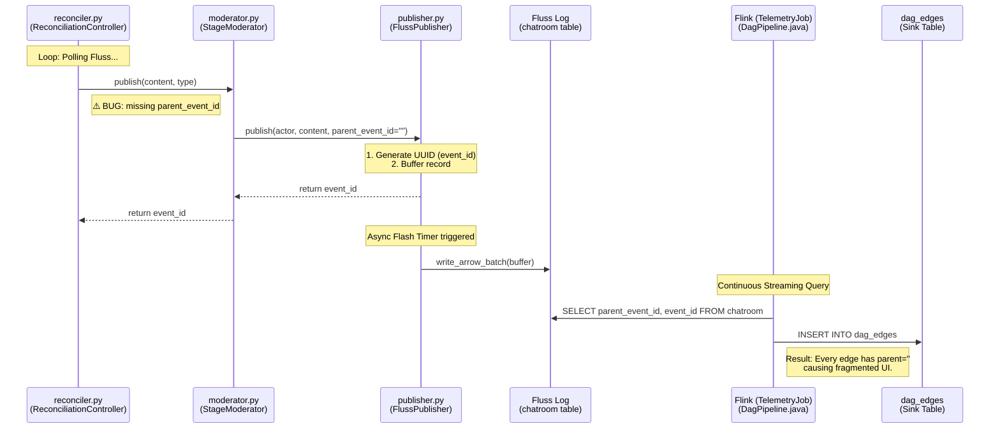
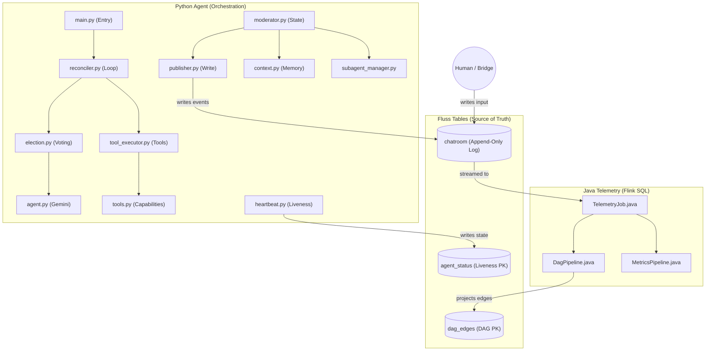
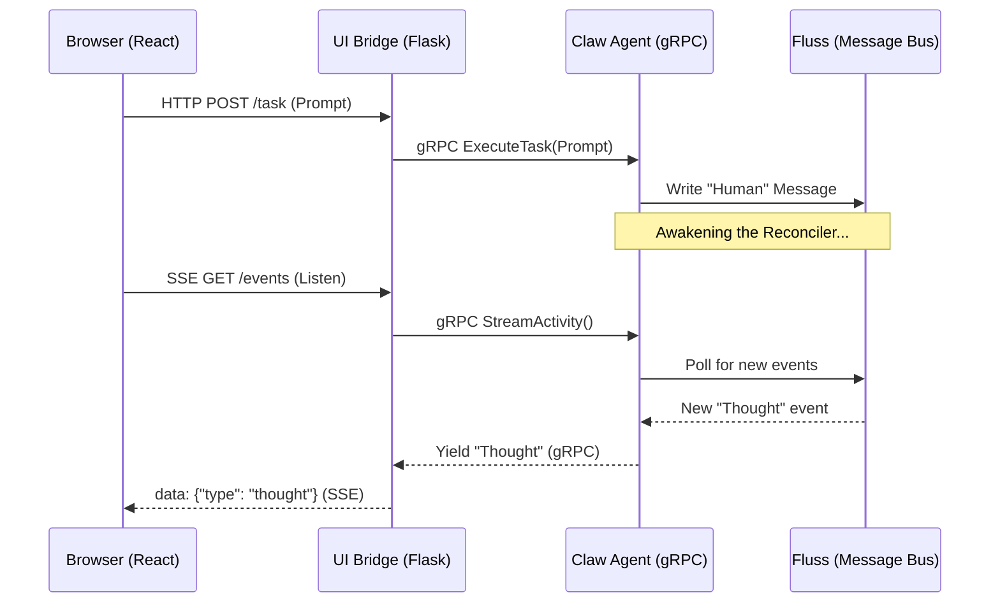

# Solution Proposal Part 6: Reworking the Deterministic DAG from First Principles

---

## 0. Conceptual Core: Understanding Event-Sourced Streaming

If you are coming from a traditional Python background (Flask, Django, imperative scripts), this architecture can feel like a "wall." This section explains the paradigm shift we are making.

### A. Request-Response vs. Event-Sourcing
- **The Old Way (Request-Response)**: Agent A calls a function, waits for a result, and then acts. The "state" lives in memory or a database row.
- **The New Way (Event-Sourcing)**: Agent A "shouts" an event into a log (**Fluss**). It doesn't wait for anyone. Downstream, another component (**Flink**) "overhears" that shout and reacts. 
- **Why it's hard**: In traditional Python, you have a call stack. In streaming, the "stack" is just a series of timestamps in a log. If you don't explicitly record who is replying to whom (**the baton**), that information is lost forever.

### B. The Async State Machine (The Reconciler)
- **The Problem**: Normal Python loops block. If an agent takes 60 seconds to "think," your entire app is frozen.
- **The Solution**: We use a **Non-blocking Reconciler**. It checks the log every 500ms, updates its internal state machine, and moves on. 
- **The Pain Point**: Because the Reconciler is "forgetful" by design (it only cares about the current tick), it is very easy to lose the **backbone_id**. If you don't store that baton in `self.backbone_id`, every loop iteration thinks it's starting from scratch.

### C. The DAG is a "Mirror," not a "Program"
- **Key Insight**: The DAG is not "running" the agents. It is a **projection** of the facts recorded in the log.
- **Analogy**: If the log is a series of diary entries, the DAG is the family tree drawn after reading those entries. If the diary entries don't say "I am the son of X," the family tree will just be a list of disconnected names.

---

## 1. Technical Background: Async and Await

Since `reconciler.py` relies heavily on cooperative multitasking, here is a breakdown of the technical concepts:

### A. The "Chef" Analogy (Concurrency vs. Parallelism)
- **Normal Python (Synchronous)**: Imagine a chef who starts boiling water and **stands there staring at it** until it's done before they even chop the onions. The kitchen is inefficient because the chef is "blocked."
- **Async Python (Asynchronous)**: Our chef starts the water, sets a timer (**`await`**), and immediately chops onions. When the timer pings, they go back to the water. The kitchen is efficient because the chef is never idle.

### B. Keywords to Know
- **`async def`**: Declares a **Coroutine**. Calling it doesn't run the code immediately; it just creates a "recipe" for the task.
- **`await`**: The pause button. It says "I am waiting for this Network I/O (Fluss/LLM). Stop here, let other tasks run, and come back to me when this is ready."
- **`asyncio.create_task()`**: The "Background" button. In `reconciler.py`, we use this to start an Agent Execution task while the main loop continues to watch for heartbeats and `/stop` commands.

### C. Why Debugging is Hard
1.  **Silent Failures**: If a background task crashes, it might not print a traceback unless we explicitly check for it.
2.  **Forgotten Awaits**: If you call `self.publish()` but forget the `await`, the message is **never sent**, but Python won't raise an error immediately. You'll just see a warning about a "coroutine was never awaited."
3.  **Global Blockage**: If you use `time.sleep(1)` instead of `await asyncio.sleep(1)`, you have just frozen every agent in the entire system for one second.

---

## 2. The End-to-End DAG Process: Role Definitions

To rebuild correctly, we must align on the role of every component in the "Feedback Flywheel":

### A. Fluss (The Source of Truth)
- **Role**: High-performance, append-only event log.
- **Responsibility**: Storing `chatroom` events.
- **DAG Metadata**: Every record in the `chatroom` table now includes:
    - `event_id`: A unique UUID for the event.
    - `parent_event_id`: The `event_id` of the direct causal predecessor.
    - `edge_type`: The nature of the link (`ROOT`, `SEQUENTIAL`, `SPAWN`, `RETURN`).

### B. Moderator / Reconciler (The Causal Engine)
- **Role**: The orchestrator of the multi-agent loop.
- **Responsibility**: **Authoring causality.**
- **Mechanism**: The Moderator maintains a local variable `backbone_id`.
    - When it publishes a "backbone" event (Checkpoint, Agent Output), it uses the current `backbone_id` as the parent and updates `backbone_id` to the new event's ID.
    - When a Human speaks, the Moderator captures that Human event's ID and makes it the new `backbone_id`.
- **Current Failure**: The `ReconciliationController` in `reconciler.py` is currently **ignoring** this logic, causing all events to have empty parents.

### C. Flink (The Projector)
- **Role**: Stream processor.
- **Responsibility**: **Projection, not Reconstruction.**
- **Mechanism** (`DagPipeline.java`): Flink no longer tries to "guess" parents using self-joins. It simply runs a `SELECT parent_event_id, event_id FROM chatroom` and inserts the results into the `dag_edges` sink table.
- **Benefit**: Zero-latency, deterministic, and extremely cheap to run.

### D. UI (The Visualizer)
- **Role**: Presentation layer.
- **Responsibility**: Rendering the `dag_edges` as a graph.
- **Mechanism**: Uses the `edge_type` to decide if an event stays on the same "swimlane" (`SEQUENTIAL`) or drops to a deeper tier (`SPAWN`).

---

## 2. Re-analyzing the Linear Backbone Model

The reason our DAGs felt "off" is that we previously modeled them as a tree branching out from `ROOT`. In reality, a conversation with agents is a **sequence of cycles**.

### The Backbone Invariant
1.  **System Start** → `ROOT` edge.
2.  **Human Input** → Becomes the new head of the backbone.
3.  **Election/Winner** → Branch off the backbone (side-detail).
4.  **Agent Output** → Advances the backbone.
5.  **Checkpoint** → Advances the backbone.

### The Problem: The "Reconciler Gap"
While `StageModerator.run` (in `moderator.py`) was partially updated with this logic, the system has migrated to use `ReconciliationController.run` (in `reconciler.py`) for its non-blocking state machine. 

**`reconciler.py` is currently a "causal void":**
- It does not track `backbone_id`.
- It does not capture `_last_human_event_id` during polling.
- It calls `self.mod.publish` with default arguments.

---

## 3. Step-by-Step Rebuild Plan

We will rebuild the DAG logic piece by piece to ensure stability.

### Phase 1: Causal Metadata in Reconciler
- Implement `backbone_id` tracking in `ReconciliationController`.
- Update `_process_batches` to extract `event_id` from human messages.
- Update all `publish` calls to pass `parent_event_id` and `edge_type`.

### Phase 2: Tool & Subagent Propagation
- Ensure `ToolExecutor` threads the `parent_event_id` through every tool call and result.
- Ensure `SubagentManager` uses the `SPAWN` and `RETURN` edge types correctly.

### Phase 3: Flink Pipeline Verification
- Confirm that `DagPipeline.java` is correctly projecting all edges.
- Ensure the sink table `dag_edges` is being populated with the correct UUID pairings.

---

---

## 4. The Great Migration: Moderator vs. Reconciler

To understand why the DAG broke, we have to look at the architectural shift that occurred recently.

### The Old World: `moderator.py` (Imperative & Blocking)
The original loop was a single, long-running `while True` loop in `StageModerator.run()`. 
- **The Logic**: It was purely sequential. `poll() -> elect() -> execute() -> checkpoint()`.
- **The Backbone**: Because it was one continuous function, it was easy to keep a local variable `backbone_id` and pass it from one line to the next.
- **The Problem**: This loop was **blocking**. If an agent took 30 seconds to think, the entire system hung. You couldn't send a `/stop` command or see a heartbeat because the thread was busy.

### The New World: `reconciler.py` (Reactive & State-Machine Driven)
We migrated to the `ReconciliationController` to make the system responsive. 
- **The Logic**: The main loop now runs every 500ms and manages a **State Machine** (`IDLE`, `ELECTING`, `EXECUTING`). 
- **The Backbone**: When this code was written, the "causal baton" (the `backbone_id`) was accidentally dropped. It wasn't moved from the local variable in `moderator.py` into the new class structure.
- **The Result**: The `reconciler` starts an election, but it has no memory of what the previous "backbone" event was. It just publishes everything with `parent_event_id = ""`.

### Why it feels "Hard" (but isn't)
The difficulty isn't in the logic; it's in the **Task Separation**.
- In `reconciler.py`, the actual work happens in a background task: `_run_election_and_execute`.
- To fix the DAG, we need to move `backbone_id` from a "local variable" (which dies when a function ends) to an **Instance Property** (`self.backbone_id`) that travels with the Controller.

### Code-Level Comparison: The Missing Link

**Old Correct Logic (`moderator.py`):**
```python
# The ID is captured and passed line-by-line
backbone_id = await self.publish("Boot", edge_type="ROOT")
...
election_id = await self.publish("Election", parent_event_id=backbone_id)
```

**Current Broken Logic (`reconciler.py`):**
```python
# The ID is returned by publish() but thrown away (_)
await self.mod.publish("Boot") 
...
# Later, in a different task scope:
await self.mod.publish("Election") # parent_event_id defaults to ""
```

---

## 5. Visualizing the Current DAG Population Flow

The following diagram traces the path of an event from creation in the Python agent to its appearance in the Telemetry DAG table.



### Script/Function Breakdown:

| Script | Function | Role |
| :--- | :--- | :--- |
| `reconciler.py` | `run()` | The main loop. Should capture `backbone_id`. |
| `moderator.py` | `publish()` | Passthrough to the publisher; returns UUID. |
| `publisher.py` | `publish()` | Generates UUID and buffers for batching. |
| `publisher.py` | `_flush_locked()`| Writes Arrow batches to Fluss network. |
| `TelemetryJob.java`| `main()` | Sets up Flink environment and statement sets. |
| `DagPipeline.java` | `getEdgesInsertSql()`| Defines the SQL projection of causal metadata. |

---

---

## 6. Diagnostic Review: Where Did the Logic Fail?

You mentioned it feels like we're hitting a wall. Let's look at the three layers of the "Flywheel" to see where the signal is being lost:

### A. The Schema/Publisher Layer (The "Headers") — ✅ SUCCESS
- **Status**: Correctly implemented. 
- **Analysis**: We successfully added `parent_event_id` and `edge_type` to `schemas.py` and `publisher.py`. The "headers" exist in the protocol. If we pass them, they reach Fluss.

### B. The Projector Layer (Flink SQL) — ✅ SUCCESS
- **Status**: Correctly implemented.
- **Analysis**: `DagPipeline.java` is doing exactly what a projector should do: mirroring the source material. It reads the causal metadata and puts it into the `dag_edges` table. It isn't "building" the DAG; it's simply exposing the recorded facts.

### C. The Writer Layer (Reconciler) — ❌ FATAL FAILURE
- **Status**: Broken / Unimplemented.
- **Analysis**: The `ReconciliationController` (`reconciler.py`) moved the system to a state-machine loop, but it **discarded the backbone logic**. 
    - It publishes "Election Start", but doesn't tell the publisher it's a child of the Checkpoint.
    - It publishes "Winner", but doesn't tell the publisher it's a child of the Election.
- **Result**: Since the writer sends `parent_event_id = ""`, Flink (correctly) projects `parent_id = "ROOT"`. 

### D. The UI Layer (Visualizer) — ⚠️ FRAGMENTED
- **Status**: Confused.
- **Analysis**: Because the Reconciler sent "blank" parents, the UI receives a list of edges that all look like `ROOT -> Event`. The visual wall you're hitting is just the UI faithfully rendering the "flat" reality that the Reconciler is writing.

### Final Verdict: "Total System Disconnect"
We built the container (Schema) and the window (Flink), but the **engine (Reconciler)** is currently dumping all its data on the floor instead of threading it together. We don't need to change Flink or the UI yet; we need to **fix the Author.**

---

### E. The "Empty Parent" Problem: Why are they all ''?

Looking at your logs, every single event in the `chatroom` table has `parent_event_id: ''`. Here is exactly why that is happening:

1.  **The Default Assumption**: In `moderator.py`, the `publish` method was updated to accept `parent_event_id`. To avoid breaking the rest of the system during the migration, it defaults to `""`.
2.  **The Missing Baton**: In a deterministic DAG, the Moderator must act like a relay racer, passing the "backbone ID" (the `event_id` of the previous message) to the next `publish` call. 
3.  **The Reconciler Gap**: The `ReconciliationController` in `reconciler.py` is the current loop runner. It calls `self.mod.publish()`, but it **never passes the baton.** 
    *   It does not store the `event_id` returned by previous `publish` calls.
    *   It does not look up the `event_id` of incoming human messages.
    *   Because it passes no arguments, the publisher uses the default `""`.

**The result is a "Causal Void"**: The author (Reconciler) is writing a diary where every page says "This is the first page." Flink is just the mirror—it can't show a thread that wasn't recorded.

---

## 7. Open Questions for Re-analysis

> [!IMPORTANT]
> **What should happen if multiple subagents are spawned simultaneously?**
> Currently, the "Linear Backbone" works best for sequential turns. If Agent A spawns 3 subagents, do they all return to the same point on the backbone, or do they chain together?
> **Proposal**: Parallel children should all have the *same* `parent_event_id` (the delegate call) and `edge_type=SPAWN`.

> [!WARNING]
---

## 7. Component Directory: agent/src/

As the system has evolved, here is a mapping of the current core components and their responsibilities:

| File | Component | Responsibility |
| :--- | :--- | :--- |
| `main.py` | CLI Entry | Orchestrates startup, Fluss connection, and loop selection. |
| `reconciler.py` | State Machine | **The New Loop.** Non-blocking reconciliation of the multi-agent state. |
| `moderator.py` | Orchestrator | Logic for replaying history and high-level publishing. |
| `agent.py` | Gemini Agent | The LLM wrapper for thinking, voting, and summarizing. |
| `election.py` | Voting Protocol| Implements the 3-round democratic election logic. |
| `tool_executor.py`| Tool Engine | Manages rounds of tool calls and result publishing. |
| `publisher.py` | Batched Writer | buffers and flushes Arrow records to Fluss on a timer. |
| `subagent_manager.py`| Tier Manager | Spawns and tracks sub-conversations (Tier 1+). |
| `tools.py` | Tool Definitions| The concrete implementation of all agent capabilities. |
| `schemas.py` | Tables | The single source of truth for all Fluss table schemas. |
| `context.py` | Context Window | Builds the prompt history for agent inference. |
| `fluss_client.py` | Fluss Wrapper | Low-level connection and scanning management. |
| `commands.py` | Slash Commands | Parsers for `/stop`, `/automation`, `/budget`, etc. |
| `heartbeat.py` | Liveness | Periodically writes agent state to the `agent_status` table. |
| `config.py` | Settings | Loads configuration from `config.yaml` and environment. |
| `agent_context.py`| Subagent Context| Specialized history building for tiered sub-tasks. |

---

## 9. Lifecycle: The Story of a Conversation Cycle

Even though the code is asynchronous, it follows a logical "story." Here is the high-level function call chain for a single turn:

### 1. The Spark (gRPC & Fluss)
- **`main.py`**: The UI sends a message to the `ExecuteTask` gRPC handler.
- **`moderator.py`**: The moderator's `publish()` method is called to write the "Human" message into the **Fluss** `chatroom` table.

### 2. The Watcher (The Reconciler)
- **`reconciler.py`**: The `ReconciliationController` is already running in the background. It polls Fluss every 500ms using `FlussClient.poll_async`.
- **`reconciler.py`**: It sees your new message! It sets `human_interrupted = True` and transitions from `IDLE` to `ELECTING`.

### 3. The Choice (Election)
- **`reconciler.py`**: Dispatches the background task `_run_election_and_execute()`.
- **`election.py`**: Calls `run_election()`. It asks all agents to vote on who should respond.
- **`agent.py`**: Each agent's `_vote()` method is called, which pings the LLM. 
- **`moderator.py`**: The election results (tally, summary, winner) are published to Fluss.

### 4. The Action (Execution)
- **`reconciler.py`**: Sets state to `EXECUTING`.
- **`tool_executor.py`**: Calls `execute_with_tools()`. 
- **`tools.py`**: If the agent decides to use a tool (like `board` or `repo_map`), the `ToolDispatcher` runs the tool logic and publishes the result.

### 5. The Response (Publishing)
- **`agent.py`**: The winner's `_think()` method is called for the final output.
- **`moderator.py`**: The agent's response is published to Fluss (`type="output"`). 
- **`reconciler.py`**: Sets state to `PUBLISHING`.

### 6. The Closure (Checkpoint)
- **`reconciler.py`**: The task finishes. It publishes "Cycle complete" to Fluss.
- **`reconciler.py`**: Transitions back to `IDLE` and waits for either the next human message or the next autonomous step.

---

## 10. Component Relationship Diagram
log: The Source of Truth

The system centers around an append-only log architecture. Below is the mapping of each table, its schema, and how it is derived.

### 1. `chatroom` (The Source Log)
- **Purpose**: The immutable audit trail of the entire conversation. Acts as the primary input for all telemetry.
- **Derived by**: 
    - `moderator.py` / `reconciler.py`: Publishes thoughts, election results, and checkpoints.
    - `bridge.py` / `client.py`: Publishes human messages.
- **Key Schema**: `event_id` (UUID), `parent_event_id` (Causality), `edge_type` (DAG type), `actor_id`, `content`, `type`, `ts`.

### 2. `dag_edges` (The Projection)
- **Purpose**: A deterministic mapping of the causal graph. Used by the UI to render the DAG.
- **Derived by**:
    - `DagPipeline.java` (Flink SQL): Performs a non-blocking projection of `parent_event_id` -> `child_id` pairs from the `chatroom` table.
- **Key Schema**: `parent_id` (PK part), `child_id` (PK part), `edge_type`, `status`.

### 3. `actor_heads` (The Cursor Table)
- **Purpose**: Tracks the most recent event for every actor. Used for "last seen" indicators and context building.
- **Derived by**:
    - `DagPipeline.java` (Flink SQL): Simple projection of the most recent `ts` and `event_id` per `actor_id`.
- **Key Schema**: `session_id` (PK), `actor_id` (PK), `last_event_id`, `last_ts`.

### 4. `agent_status` (The Liveness Stream)
- **Purpose**: Real-time monitoring of agent health and current activity.
- **Derived by**:
    - `heartbeat.py` (`HeartbeatEmitter`): Periodically emits state snapshots (idle, electing, executing).
- **Key Schema**: `agent_id`, `state`, `last_heartbeat`, `current_task`.

### 5. `live_metrics` (The Aggregator)
- **Purpose**: High-level session statistics (e.g., "15 messages, 3 tool calls, 100% success").
- **Derived by**:
    - `MetricsPipeline.java` (Flink SQL): Continuous aggregation (COUNT/SUM) of the `chatroom` log.
- **Key Schema**: `session_id` (PK), `total_messages`, `tool_calls`, `tool_successes`.

### 6. `sessions` (The Registry)
- **Purpose**: Metadata for session discovery and resumption.
- **Derived by**:
    - `main.py` / `main.java`: Created once at the start of a new `session_id`.
- **Key Schema**: `session_id` (PK), `title`, `created_at`, `last_active_at`.

### 7. `board_events` (The Mutation Log)
- **Purpose**: Specialized log for project board activity (tasks, items, milestones).
- **Derived by**:
    - `tools.py` (`BoardTool`): Every tool call that modifies board state appends a record here.
- **Key Schema**: `action` (create/update/delete), `item_id`, `item_type`, `title`, `status`, `assigned_to`.

---

## 8. Component Relationship Diagram

The following diagram shows how the individual scripts and services interact to form the "Feedback Flywheel":



### System Flow Logic (Pseudocode)

```python
# 1. Boot Environment
backbone_id = moderator.publish("System Online", edge_type="ROOT", parent="")

# 2. The Reconciliation Loop
while True:
    records = fluss.poll(timeout=500)
    
    # 3. Capture Human Input (Head of the Backbone)
    if records.has_human_message:
        backbone_id = records.last_human_message.event_id
        
    # 4. Starting a Turn
    if should_activate(records):
        # Election: Branching off the backbone
        election_id = moderator.publish("🗳️ Election", parent=backbone_id)
        winner, log = election.run(parent=election_id)
        
        # Winner: Final leaf of the election branch
        winner_id = moderator.publish(f"🏆 {winner}", parent=election_id)
        
        # 5. Agent Execution
        if winner:
            # Tool rounds: Chaining from the winner ID
            # ($ list_files) -> (✅ files) -> ([Tool Result] files)
            response = executor.run(agent=winner, parent=winner_id)
            
            # 6. Advance the Backbone
            # The agent's final output links back to the WINNER
            backbone_id = moderator.publish(response, parent=winner_id)
            
        # 7. Close the Cycle
        # The checkpoint links back to the AGENT OUTPUT
        backbone_id = moderator.publish("Cycle Complete", parent=backbone_id)
```

---

## 9. Component Directory: telemetry (Java/Flink)

| File | Component | Responsibility |
| :--- | :--- | :--- |
| `TelemetryJob.java` | Main Entry | Sets up the Flink environment, Fluss catalog, and statement set. |
| `DagPipeline.java` | DAG Logic | SQL projections for `dag_edges` and `actor_heads`. |
| `MetricsPipeline.java` | Metrics Logic| SQL logic for live message and tool performance stats. |
| `TelemetryConfig.java` | Config Loader | Reads YAML configuration for bootstrap servers and database. |

---

Viewed bridge.py:1-505

That's exactly right. You've hit on the core reason why the **UI Bridge** exists. Here is the breakdown of how that communication flow works:

### 1. gRPC as the "Internal Backbone"
gRPC is used for communication **between containers** (the Bridge and the Agent). 
*   **Why gRPC?** It’s extremely fast, uses binary serialization (Protobuf), and supports native streaming. In [agent/src/main.py](file:///.../ContainerClaw/agent/src/main.py), you saw the gRPC server defined. In [bridge/src/bridge.py](file:///.../ContainerClaw/bridge/src/bridge.py), you see the gRPC client (the "Stub").
*   **The Problem:** Standard browsers can't easily speak "raw" gRPC. They prefer standard HTTP or WebSockets.

### 2. The Bridge as a "Translator"
The Bridge acts as a translator so the UI doesn't have to deal with gRPC. 
*   **Streaming Activity**: When the UI wants updates, it opens a standard **SSE (Server-Sent Events)** connection to the Bridge (`/events/<session_id>`). 
*   **The Handshake**: The Bridge then opens a **gRPC stream** to the Agent (`stub.StreamActivity`). As the Agent pushes new "thoughts" or "tool outputs" over gRPC, the Bridge wraps them in JSON and pushes them to your browser via SSE (see `bridge.py:L89-L98`).

### 3. The `ExecuteTask` Trigger
When you type a prompt in the UI and hit enter, this happens:
1.  **UI Request**: The UI sends a standard HTTP POST to the Bridge's `/task` endpoint.
2.  **Bridge Proxy**: The Bridge's `proxy_task` function receives this and immediately calls the Agent's gRPC `ExecuteTask` method.
3.  **Agent Async Execution**: On the Agent side, `ExecuteTask` is an `async` function. 
    *   It first writes your message (the "Human" message) into the **Fluss** message bus.
    *   Writing to Fluss is what "wakes up" the **Reconciler**. If the agent was idle, it sees a new message in the log and goes, "Oh, I have work to do!" and starts its thinking loop.

### Visualization of the Flow


So, the **Bridge** is essentially a "dumb" proxy that makes the high-performance gRPC world of the Agent accessible to the web-friendly world of the UI.

---

Viewed reconciler.py:1-313

The **Reconciler** is the heart of the "Agentic Flywheel." While it's not a separate OS process (it runs as an `asyncio` task inside the `claw-agent` container), it is the **primary controller loop** that drives the entire system.

Here’s a breakdown of its responsibilities and how it handles the Fluss stream:

### 1. The "Observer" of the Fluss Stream
The Reconciler is indeed the component that "watches" the Fluss stream. Every ~500ms, it polls the message bus:
```python
# reconciler.py:L125
batches = await FlussClient.poll_async(self.mod.scanner, timeout_ms=500)
human_interrupted = await self.mod._process_batches(batches)
```
If it sees a new message from a "Human" (or a Discord bridge), it sets a flag and decides whether it needs to "wake up" and start an agent cycle.

### 2. Main Responsibilities
The Reconciler's job is to move the system through a controlled state machine:

*   **State Management**: It tracks whether the system is `IDLE`, `ELECTING` (picking which agent speaks next), `EXECUTING` (the agent is thinking/using tools), or `SUSPENDED` (stopped by a user). 
*   **Responsiveness (The "Anti-Hang" Mechanism)**: Because it dispatches the LLM work as a background task (`_run_election_and_execute`), the main loop **never stops**. This means if you send a `/stop` command while an agent is in the middle of a 30-second LLM call, the Reconciler will see that command immediately and can cancel the LLM task.
*   **Autonomous Budgeting**: It manages the "fuel" for the agent. If you give it a budget of 10 steps, the Reconciler decrements that budget every turn. Once it hits 0, it puts the agent into `IDLE` state until a human provides more input.
*   **Buffering Interrupts**: If a human types a message *while* an agent is already thinking, the Reconciler doesn't ignore it. it sets `self._pending_human_interrupt = True`. As soon as the current agent finishes, the Reconciler immediately triggers a new election to respond to the human.
*   **Heartbeat Proof-of-Life**: It communicates with a [heartbeat.py](file:///.../ContainerClaw/agent/src/heartbeat.py) module to write its current state back to Fluss. This is how the UI knows to show "Thinking..." or "Voting..." in real-time.

### Why is it called a "Reconciler"?
The name comes from patterns like Kubernetes. Instead of a simple "if/then" loop, it constantly asks:
1.  **What is the desired state?** (e.g., "The human asked a question, I have a budget of 5 steps.")
2.  **What is the current state?** (e.g., "I am currently idle.")
3.  **How do I reconcile them?** (e.g., "I will trigger an election task and transition to the ELECTING state.")

In short: **`main.py`** starts the server, but **`reconciler.py`** is the project manager that makes sure the agents actually do their work and stay responsive to you.