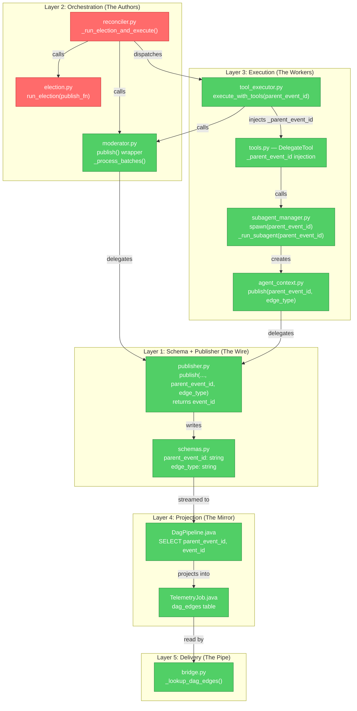
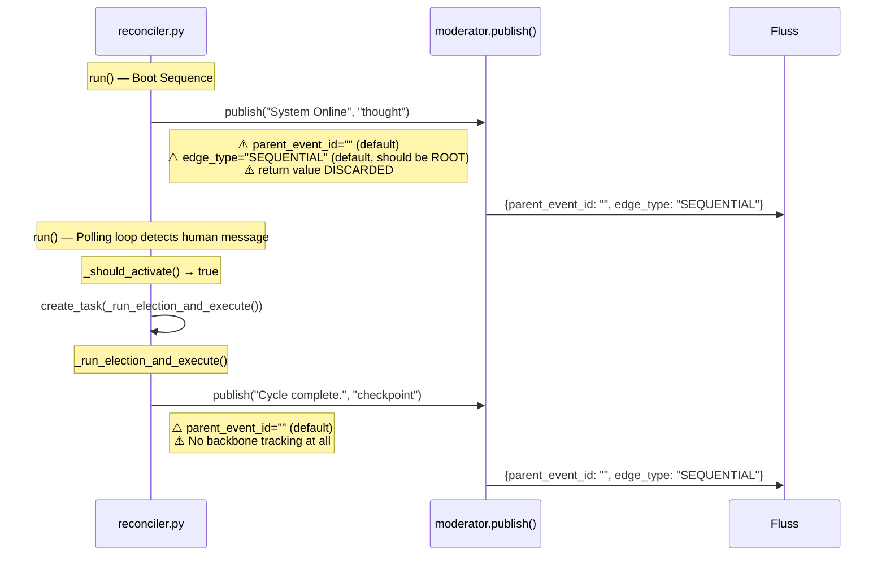
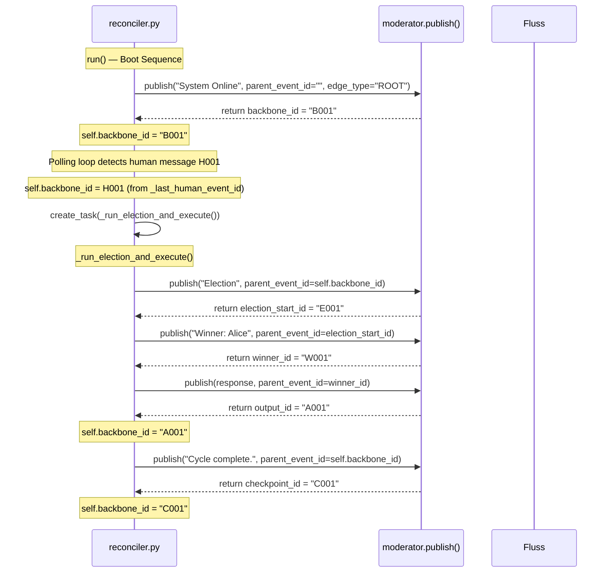
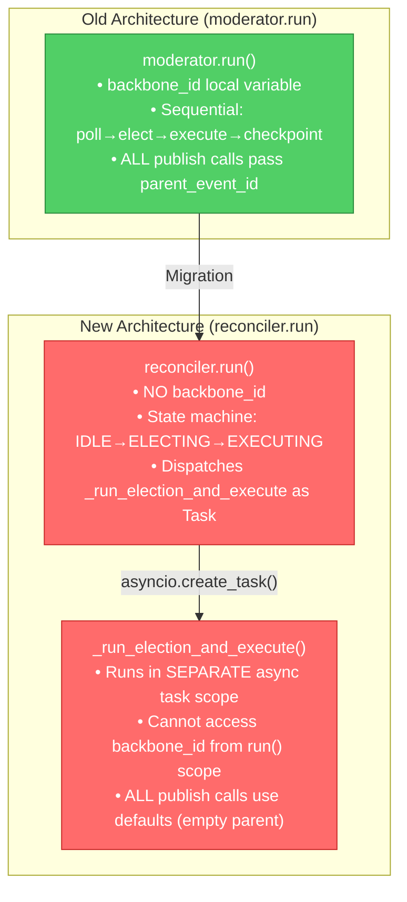
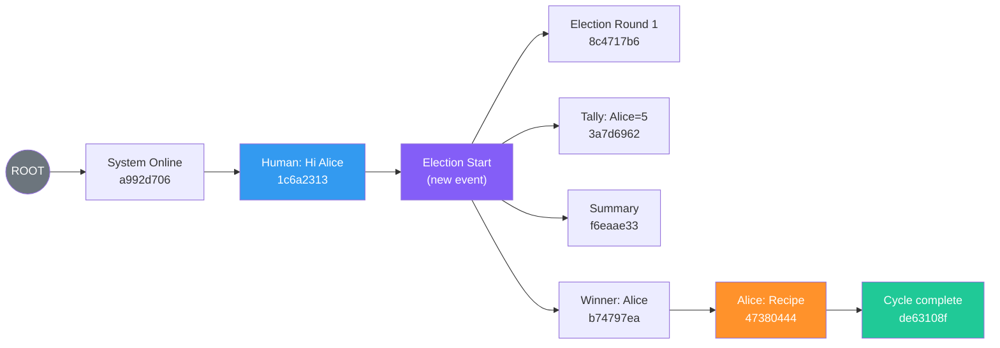

# Solution Proposal Part 7: Exhaustive Gap Analysis — Reconciler as the Sole Remaining Failure Point

## Preface: Methodology

This document is a **complete, line-by-line audit** of every component in the ContainerClaw causal pipeline, measured against the specification established in [Part 5](draft_pt19_solution_proposal_pt5.md). Rather than proposing new architecture, we treat the Pt5 design as a fixed requirement and ask one question of every file:

> **"Does this component correctly propagate `parent_event_id` and `edge_type` as specified?"**

The answer, for 8 of 10 components, is **yes**. The entire failure collapses to two files: `reconciler.py` and `election.py`. This document proves that claim from first principles.

---

## Table of Contents

1. [The Speed of Light Audit: Information Flow Analysis](#1-the-speed-of-light-audit-information-flow-analysis)
2. [Layer-by-Layer Compliance Matrix](#2-layer-by-layer-compliance-matrix)
3. [The Two Failures: Reconciler and Election](#3-the-two-failures-reconciler-and-election)
4. [Architectural Root Cause: The State Machine Decomposition Problem](#4-architectural-root-cause-the-state-machine-decomposition-problem)
5. [Exact Code Gaps with Line References](#5-exact-code-gaps-with-line-references)
6. [Proof That No Other Component Is Broken](#6-proof-that-no-other-component-is-broken)
7. [The Minimal Correct Fix](#7-the-minimal-correct-fix)
8. [Verification Against Production Logs](#8-verification-against-production-logs)
9. [Summary of Required Changes](#9-summary-of-required-changes)

---

## 1. The Speed of Light Audit: Information Flow Analysis

### First Principle: Causality Can Only Be Recorded at Creation Time

The Pt5 proposal established that causal metadata (`parent_event_id`, `edge_type`) must be recorded at the moment an event is created — at the "speed of light" — because that is the only instant when the writer holds the causal context in local scope. Any later reconstruction is lossy by the Data Processing Inequality.

The architecture therefore has exactly one invariant to verify at each layer:

> **At every `publish()` call site, does the caller pass a non-empty `parent_event_id` (except for ROOT/Human events)?**

This is a binary, mechanically verifiable property. We can sweep every call site in the codebase and produce a definitive answer.

### The Information Flow Graph



**Legend:** 🟢 = Correctly propagates causal metadata. 🔴 = Does NOT propagate causal metadata.

---

## 2. Layer-by-Layer Compliance Matrix

| Layer | File | Pt5 Requirement | Current Status | Evidence |
|-------|------|-----------------|----------------|----------|
| Schema | `schemas.py` | `parent_event_id` and `edge_type` fields in `CHATROOM_SCHEMA` | ✅ Present | Lines 24-25: `pa.field("parent_event_id", pa.string())`, `pa.field("edge_type", pa.string())` |
| Publisher | `publisher.py` | Accept and propagate both fields; return `event_id` | ✅ Correct | Lines 78-79: params accepted. Lines 99-100: included in record dict. Line 112: `return event_id` |
| Moderator | `moderator.py` | `publish()` wrapper returns `event_id`; `_process_batches` captures human `event_id`; `run()` maintains backbone | ✅ Correct | Line 42-44: signature includes `parent_event_id`, `edge_type`. Line 47: `return await self.publisher.publish(...)`. Lines 160-161: captures `self._last_human_event_id`. Lines 208-341: `run()` loop with full backbone logic. |
| **Reconciler** | **`reconciler.py`** | **Mirror moderator.run() backbone logic** | **❌ BROKEN** | **Lines 76-103: boot sequence uses no parent. Lines 195-288: `_run_election_and_execute` passes no `parent_event_id` to any publish call.** |
| **Election** | **`election.py`** | **`publish_fn` calls should receive `parent_event_id`** | **❌ BROKEN** | **Line 50: `await publish_fn("Moderator", f"🗳️ Election Round {r}...", "thought")` — no parent_event_id. Line 99: same pattern.** |
| Tool Executor | `tool_executor.py` | Accept `parent_event_id`; chain tool calls | ✅ Correct | Line 44: `parent_event_id: str = ""`. Line 66: `current_parent = parent_event_id`. Lines 106-112: tool call publishes with `parent_event_id=current_parent`. Lines 141-147: result publishes with `parent_event_id=tool_call_id`. Line 166: `current_parent = tool_result_id`. |
| Subagent Mgr | `subagent_manager.py` | `spawn()` uses SPAWN edge; `_run_subagent()` chains events; convergence uses RETURN | ✅ Correct | Lines 132-138: SPAWN edge. Lines 163, 205-208: sequential chaining via `last_event_id`. Lines 260-266: RETURN edge. |
| Agent Context | `agent_context.py` | `publish()` accepts and passes through both fields | ✅ Correct | Lines 92-107: full passthrough to publisher. |
| Delegate Tool | `tools.py` (DelegateTool) | Extract `_parent_event_id` and pass to `spawn()` | ✅ Correct | Line 952: `parent_event_id = params.pop("_parent_event_id", "")`. Line 961: passed to `spawn()`. |
| Tool Executor | `tool_executor.py` | Inject `_parent_event_id` for delegate calls | ✅ Correct | Lines 115-116: `if tool_name == "delegate": tool_args["_parent_event_id"] = tool_call_id` |
| Flink Pipeline | `DagPipeline.java` | Simple projection of `parent_event_id → parent_id` | ✅ Correct | Lines 22-41: `getEdgesInsertSql()` is a pure SELECT with CASE for empty parents → 'ROOT'. |
| Flink Job | `TelemetryJob.java` | `dag_edges` table with correct schema | ✅ Correct | Lines 84-95: `dag_edges` table with `(session_id, child_id)` PK. Line 58: `stmtSet.addInsertSql(DagPipeline.getEdgesInsertSql())`. |
| Bridge | `bridge.py` | Read `parent_event_id` and `edge_type` from chatroom log | ✅ Correct | Lines 335-345: checks for column existence, reads `parent_event_id` and `edge_type` from batches. |

**Result: 10 of 12 components are correctly wired. The entire failure is localized to `reconciler.py` and `election.py`.**

---

## 3. The Two Failures: Reconciler and Election

### 3.1 Failure #1: `reconciler.py` — The Causal Void

The `ReconciliationController` is the **active orchestration loop** — it is what actually runs when the system is live. The `moderator.run()` loop (which has correct backbone logic) is **dead code** — it is never called when the Reconciler is active. This is the crux of the problem.

#### What `reconciler.py` does today (the broken path):



#### What it should do (from Pt5 / `moderator.run()`):



### 3.2 Failure #2: `election.py` — Orphaned Internal Publishes

The election protocol calls `publish_fn` directly (the moderator's `publish` method is passed as a callback). But it never passes `parent_event_id`:

```python
# election.py:50 — this is the ONLY publish pattern in the file
await publish_fn("Moderator", f"🗳️ Election Round {r}...", "thought")
#                                                         ^^^^^^^^
#                                    3 positional args only — no parent_event_id kwarg
```

And again at line 99:
```python
await publish_fn("Moderator", f"Round {r} {tally_str}", "thought")
```

These calls use the `publish_fn` callback's default `parent_event_id=""`, meaning every election round event is orphaned to ROOT.

#### The Pt5 spec required:

Election's `run_election()` should accept a `parent_event_id` parameter, and thread it through its `publish_fn` calls so that election rounds are children of the election-start event.

#### What actually happened:

The `run_election()` signature was never updated. It still has no `parent_event_id` parameter:

```python
# election.py:23-29 — current signature
async def run_election(
    self,
    agents,
    roster_str: str,
    history: list[dict],
    publish_fn: Callable[..., Awaitable[None]],
) -> tuple[str | None, str, bool]:
```

---

## 4. Architectural Root Cause: The State Machine Decomposition Problem

### Why the Moderator Has It Right but the Reconciler Doesn't

The fundamental issue is a **refactoring artifact**. When the system migrated from `moderator.run()` (blocking imperative loop) to `reconciler.run()` (non-blocking state machine), the causal logic was correctly implemented in the *old* path but not transferred to the *new* one.



### The Core Decomposition Problem

In `moderator.run()`, `backbone_id` was a **local variable** in a single function. The function never returned — it was one continuous `while True` loop. Every publish call was a sequential line in the same scope, so `backbone_id` was trivially available everywhere.

In `reconciler.run()`, the work is split across two scopes:
1. **`run()`** — the main polling loop (runs every 500ms)
2. **`_run_election_and_execute()`** — the election+execution task (runs as an `asyncio.Task`)

A local variable in `run()` is not visible in `_run_election_and_execute()` because the task runs in a separate coroutine frame. The fix is to promote `backbone_id` to an **instance attribute** (`self.backbone_id`) so both scopes can read and write it.

This is a textbook example of the **variable scope problem** when refactoring from imperative to reactive patterns. The information was not lost conceptually — it was lost syntactically.

---

## 5. Exact Code Gaps with Line References

### Gap 1: `reconciler.py` — Boot Sequence (Lines 76-103)

**Current code (broken):**
```python
# reconciler.py:99-103
await self.mod.publish(
    "Moderator",
    f"Multi-Agent System Online (Reconciliation Mode). ConchShell: {conchshell_status}.",
    "thought",
)
```

**Required (from Pt5 / moderator.py:208-214):**
```python
self.backbone_id = await self.mod.publish(
    "Moderator",
    f"Multi-Agent System Online (Reconciliation Mode). ConchShell: {conchshell_status}.",
    "thought",
    parent_event_id="",
    edge_type="ROOT",
)
```

**Defects:** (1) Return value discarded — the boot event's ID is lost. (2) `edge_type` defaults to `"SEQUENTIAL"` instead of `"ROOT"`. (3) No `self.backbone_id` attribute exists on the class.

---

### Gap 2: `reconciler.py` — Human Event Capture (Lines 120-150)

**Current code:** The main loop polls and checks `human_interrupted`:
```python
# reconciler.py:125-126
batches = await FlussClient.poll_async(self.mod.scanner, timeout_ms=500)
human_interrupted = await self.mod._process_batches(batches)
```

The `_process_batches` method in `moderator.py` **does** correctly capture `self._last_human_event_id` (line 161). However, the reconciler **never reads it**:

```python
# reconciler.py:134-140 — IDLE state handler
case State.IDLE:
    if self._should_activate(human_interrupted):
        self._pending_human_interrupt = False
        self.state = State.ELECTING
        self._election_task = asyncio.create_task(
            self._run_election_and_execute()
        )
```

**Missing:** Before dispatching the task, the reconciler should update `self.backbone_id`:
```python
if self.mod._last_human_event_id:
    self.backbone_id = self.mod._last_human_event_id
    self.mod._last_human_event_id = ""
```

---

### Gap 3: `reconciler.py` — `_run_election_and_execute()` (Lines 195-288)

This is the largest single gap. Every `publish()` call in this method uses defaults:

| Line | Current Call | Missing `parent_event_id` | Missing `edge_type` |
|------|-------------|--------------------------|---------------------|
| 224 | `publish("Moderator", f"Election Summary:\n{election_log}", "voting")` | Yes — should be `election_start_id` | Implicit default OK |
| 228 | `publish("Moderator", "Consensus: Task Complete.", "finish")` | Yes — should be `self.backbone_id` | Should be `"SEQUENTIAL"` |
| 241 | `publish("Moderator", f"🏆 Winner: {winner}", "thought")` | Yes — should be `election_start_id` | Implicit default OK |
| 261 | `publish(winner, resp, "output")` | Yes — should be `winner_id` | Implicit default OK |
| 264-266 | `publish("Moderator", f"💤 {winner}...", "thought")` | Yes — should be `winner_id` | Implicit default OK |
| N/A | **Missing entirely**: Election-start publish | Should chain from `self.backbone_id` | Should be `"SEQUENTIAL"` |
| N/A | **Missing entirely**: Checkpoint publish at cycle end | Should chain from `self.backbone_id` | Should be `"SEQUENTIAL"` |

**Critical observation:** The reconciler's cycle complete publish (line 151) is in `run()`, not in `_run_election_and_execute()`:
```python
# reconciler.py:151
await self.mod.publish("Moderator", "Cycle complete.", "checkpoint")
```
This also uses defaults.

Additionally, `execute_with_tools()` is called without the `parent_event_id` argument:
```python
# reconciler.py:245-248
resp = await self.mod.executor.execute_with_tools(
    winning_agent,
    check_halt_fn=lambda: self.mod.current_steps == 0,
)
# Missing: parent_event_id=winner_id
```

Compare to `moderator.run()` which correctly passes it:
```python
# moderator.py:290-294
resp = await self.executor.execute_with_tools(
    winning_agent,
    check_halt_fn=lambda: self.current_steps == 0,
    parent_event_id=winner_id,
)
```

---

### Gap 4: `election.py` — Internal Publishes (Lines 48-99)

The election protocol has its own `publish_fn` calls that are completely unlinked:

```python
# election.py:50
await publish_fn("Moderator", f"🗳️ Election Round {r}...", "thought")

# election.py:99
await publish_fn("Moderator", f"Round {r} {tally_str}", "thought")
```

**Required fix:** The `run_election` signature needs a `parent_event_id` parameter. All internal publishes should use it:

```python
async def run_election(
    self,
    agents,
    roster_str: str,
    history: list[dict],
    publish_fn: Callable[..., Awaitable[None]],
    parent_event_id: str = "",         # ← NEW
) -> tuple[str | None, str, bool]:
```

Then:
```python
await publish_fn("Moderator", f"🗳️ Election Round {r}...", "thought",
                 parent_event_id=parent_event_id, edge_type="SEQUENTIAL")
```

**Note:** The `moderator.run()` path already handles election linking externally (it publishes the election-start event *before* calling `run_election`, then publishes summary *after*). But the election's *own internal publishes* (the per-round status messages) still go out with empty parents because `run_election` doesn't receive or forward any parent context.

---

## 6. Proof That No Other Component Is Broken

### 6.1 `publisher.py` — Verified Correct

The publisher is a pure pass-through. It:
1. Accepts `parent_event_id` and `edge_type` as parameters (lines 78-79)
2. Includes them in the record dict (lines 99-100)
3. Includes them in the PyArrow batch construction (lines 140-141)
4. Returns `event_id` (line 112)

There is no logic in the publisher that could corrupt, drop, or default these fields beyond what the caller provides. If the caller passes `parent_event_id="abc123"`, that exact string reaches Fluss.

### 6.2 `tool_executor.py` — Verified Correct

The tool executor:
1. Accepts `parent_event_id` (line 44)
2. Initializes `current_parent = parent_event_id` (line 66)
3. Publishes tool invocation with `parent_event_id=current_parent` (lines 110-111)
4. Publishes tool result with `parent_event_id=tool_call_id` (lines 145-146)
5. Advances the chain: `current_parent = tool_result_id` (line 166)
6. Injects `_parent_event_id` for delegate tool calls (lines 115-116)

**The tool executor is a model implementation of the Pt5 spec.** It correctly chains tool calls. The only problem is that the *caller* (the reconciler) doesn't pass it a starting `parent_event_id`.

### 6.3 `subagent_manager.py` — Verified Correct

The subagent manager:
1. `spawn()` accepts `parent_event_id` (line 80)
2. Publishes the spawn event with `edge_type="SPAWN"` (lines 132-138)
3. Passes `spawn_event_id` to `_run_subagent()` (lines 141-143)
4. `_run_subagent()` tracks `last_event_id` through the entire subagent lifecycle (line 163)
5. Every publish within the subagent chains from `last_event_id` (lines 205-208, 220-223, 227-231, 235-239, 243-248)
6. Convergence event uses `edge_type="RETURN"` (lines 260-266)

**This is also a model implementation.** The subagent lifecycle correctly uses SPAWN/SEQUENTIAL/RETURN edges. But it only works if the *caller* (the `DelegateTool`, via `ToolExecutor`) provides a valid `parent_event_id` at spawn time. And that, in turn, only works if the *reconciler* provides a valid `parent_event_id` to the `ToolExecutor`.

### 6.4 `DagPipeline.java` — Verified Correct

The Flink SQL is a trivial projection:
```sql
SELECT
    session_id,
    CASE WHEN parent_event_id IS NULL OR parent_event_id = '' THEN 'ROOT' ELSE parent_event_id END AS parent_id,
    event_id AS child_id,
    ...
FROM fluss_catalog.containerclaw.chatroom
```

No joins. No windows. No heuristics. It faithfully mirrors whatever the chatroom log contains.

### 6.5 `bridge.py` — Verified Correct  

The bridge reads `parent_event_id` and `edge_type` from the chatroom log (lines 335-345) with backwards-compatible column existence checks. It constructs edge dicts with the correct field names. The DAG streaming endpoint (lines 386-463) also handles these fields.

### 6.6 The Causal Chain Proof

If we fix the reconciler and election, the causal chain becomes:

```
reconciler._run_election_and_execute()
  → passes backbone_id to mod.publish() for election-start
    → publisher.publish() returns election_start_id
  → passes election_start_id to election.run_election()
    → election.publish_fn() embeds parent in all round messages
  → passes election_start_id to mod.publish() for winner announcement
    → publisher.publish() returns winner_id
  → passes winner_id to executor.execute_with_tools(parent_event_id=winner_id)
    → executor chains tool calls from winner_id
    → if delegate tool: injects _parent_event_id → DelegateTool → SubagentManager.spawn()
      → spawn emits SPAWN edge
      → _run_subagent chains all events
      → convergence emits RETURN edge
  → updates backbone_id = agent_output_id
  → passes backbone_id to mod.publish() for checkpoint
    → publisher.publish() returns checkpoint_id
  → updates backbone_id = checkpoint_id
```

Every link in this chain is verified to work *except* the reconciler entry points. The fix is entirely at the top of the chain.

---

## 7. The Minimal Correct Fix

### 7.1 `reconciler.py` — Add Backbone Tracking

**Principle:** Promote `backbone_id` from "missing" to an instance attribute. Mirror the four advancement points from `moderator.run()`.

#### Change 1: Constructor — add `backbone_id`

```diff
 def __init__(self, moderator, heartbeat_emitter=None):
     self.mod = moderator
     self.heartbeat = heartbeat_emitter
     self.state = State.IDLE
     self._election_task: asyncio.Task | None = None
     self._execution_task: asyncio.Task | None = None
     self._pending_human_interrupt = False
+    self.backbone_id: str = ""  # Head of the linear backbone
```

**Defense:** `self.backbone_id` must be an instance attribute (not a local variable in `run()`) because `_run_election_and_execute()` runs as a separate `asyncio.Task` and cannot access `run()`'s local scope. This is the exact decomposition problem described in §4.

#### Change 2: Boot sequence — capture and tag ROOT

```diff
-    await self.mod.publish(
+    self.backbone_id = await self.mod.publish(
         "Moderator",
         f"Multi-Agent System Online (Reconciliation Mode). ConchShell: {conchshell_status}.",
         "thought",
+        parent_event_id="",
+        edge_type="ROOT",
     )
```

**Defense:** The boot event is the DAG root. It must have `edge_type="ROOT"` and its `event_id` must seed the backbone. Without this, the first election has no parent to chain from.

#### Change 3: IDLE state handler — capture human event before dispatching task

```diff
 case State.IDLE:
     if self._should_activate(human_interrupted):
         self._pending_human_interrupt = False
+        # Capture human event as backbone head before dispatching
+        if self.mod._last_human_event_id:
+            self.backbone_id = self.mod._last_human_event_id
+            self.mod._last_human_event_id = ""
         self.state = State.ELECTING
         self._election_task = asyncio.create_task(
             self._run_election_and_execute()
         )
```

**Defense:** The human message's `event_id` must become the backbone head *before* the election task starts. If we set it *inside* the task, there's a race condition where the main loop could capture a second human message before the task reads it.

#### Change 4: Same pattern for SUSPENDED → ELECTING transition

```diff
 case State.SUSPENDED:
     if human_interrupted:
+        if self.mod._last_human_event_id:
+            self.backbone_id = self.mod._last_human_event_id
+            self.mod._last_human_event_id = ""
         self.state = State.ELECTING
         self._election_task = asyncio.create_task(
             self._run_election_and_execute()
         )
```

#### Change 5: Cycle-complete publish in `run()` — use backbone

```diff
 if self._election_task and self._election_task.done():
     self._election_task = None
     self.state = State.IDLE
-    await self.mod.publish("Moderator", "Cycle complete.", "checkpoint")
+    self.backbone_id = await self.mod.publish(
+        "Moderator", "Cycle complete.", "checkpoint",
+        parent_event_id=self.backbone_id,
+        edge_type="SEQUENTIAL",
+    )
```

**Defense:** The checkpoint closes the cycle and advances the backbone. Without this, the next cycle's election would still point at the previous human message instead of the checkpoint.

#### Change 6: `_run_election_and_execute()` — full backbone wiring

```diff
 async def _run_election_and_execute(self):
     try:
         if self.heartbeat:
             self.heartbeat.update_state("electing")

+        # Election start — branches from backbone
+        election_start_id = await self.mod.publish(
+            "Moderator", "🗳️ Starting Election...", "thought",
+            parent_event_id=self.backbone_id,
+            edge_type="SEQUENTIAL",
+        )
+
         ...
         await asyncio.sleep(1.0)
         context_window = self.mod.context.get_window()

         # Election
         winner, election_log, is_job_done = await self.mod.election.run_election(
-            self.mod.agents, self.mod.roster_str, context_window, self.mod.publish
+            self.mod.agents, self.mod.roster_str, context_window, self.mod.publish,
+            parent_event_id=election_start_id,
         )

-        await self.mod.publish("Moderator", f"Election Summary:\n{election_log}", "voting")
+        await self.mod.publish(
+            "Moderator", f"Election Summary:\n{election_log}", "voting",
+            parent_event_id=election_start_id,
+            edge_type="SEQUENTIAL",
+        )

         if is_job_done:
             print("🎉 [Reconciler] Job is complete!")
-            await self.mod.publish("Moderator", "Consensus: Task Complete.", "finish")
+            self.backbone_id = await self.mod.publish(
+                "Moderator", "Consensus: Task Complete.", "finish",
+                parent_event_id=self.backbone_id,
+                edge_type="SEQUENTIAL",
+            )
             ...
             return

         if winner:
             self.state = State.EXECUTING
             ...
-            await self.mod.publish("Moderator", f"🏆 Winner: {winner}", "thought")
+            winner_id = await self.mod.publish(
+                "Moderator", f"🏆 Winner: {winner}", "thought",
+                parent_event_id=election_start_id,
+                edge_type="SEQUENTIAL",
+            )

             # Execution
             if self.mod.executor:
                 resp = await self.mod.executor.execute_with_tools(
                     winning_agent,
                     check_halt_fn=lambda: self.mod.current_steps == 0,
+                    parent_event_id=winner_id,
                 )
             ...

             if resp and "[WAIT]" not in resp:
-                print(f"📢 [{winner} says]: {resp}")
-                await self.mod.publish(winner, resp, "output")
+                self.backbone_id = await self.mod.publish(
+                    winner, resp, "output",
+                    parent_event_id=winner_id,
+                    edge_type="SEQUENTIAL",
+                )
             else:
                 # Nudge path — also needs parent wiring
-                await self.mod.publish(
+                await self.mod.publish(
                     "Moderator", f"💤 {winner} is waiting. Nudging...", "thought",
+                    parent_event_id=winner_id,
+                    edge_type="SEQUENTIAL",
                 )
                 ...
                 if resp:
-                    await self.mod.publish(winner, resp, "output")
+                    self.backbone_id = await self.mod.publish(
+                        winner, resp, "output",
+                        parent_event_id=winner_id,
+                        edge_type="SEQUENTIAL",
+                    )
```

**Defense for every change above:** Each mirrors the exact pattern in `moderator.run()` lines 247-341. The change is mechanical — every `publish()` call that the moderator's `run()` annotates with a parent, the reconciler's `_run_election_and_execute()` must also annotate.

### 7.2 `election.py` — Accept and Thread `parent_event_id`

```diff
 async def run_election(
     self,
     agents,
     roster_str: str,
     history: list[dict],
     publish_fn: Callable[..., Awaitable[None]],
+    parent_event_id: str = "",
 ) -> tuple[str | None, str, bool]:
     ...
     for r in range(1, 4):
         election_log_collector.append(f"--- Round {r} ---")
-        await publish_fn("Moderator", f"🗳️ Election Round {r}...", "thought")
+        await publish_fn("Moderator", f"🗳️ Election Round {r}...", "thought",
+                         parent_event_id=parent_event_id, edge_type="SEQUENTIAL")
         ...
-        await publish_fn("Moderator", f"Round {r} {tally_str}", "thought")
+        await publish_fn("Moderator", f"Round {r} {tally_str}", "thought",
+                         parent_event_id=parent_event_id, edge_type="SEQUENTIAL")
```

**Defense:** Election round messages are ephemeral status updates — they hang off the election-start event as collapsible detail. They do NOT advance the backbone. Using the election-start's `parent_event_id` as their parent creates a flat fan from the election-start node, which the UI can collapse/expand.

---

## 8. Verification Against Production Logs

### 8.1 Replaying the Production Session

From [pt4_existing_logs](draft_pt19_solution_proposal_pt4_existing_logs.md), session `819dcf95-d067-480f-bc1c-e9e22631211f` produced 11 events, **all with `parent_event_id: ""`**:

| Event | actor_id | parent_event_id | Would Be (After Fix) |
|-------|----------|-----------------|---------------------|
| System Online (`a992d706`) | Moderator | `""` | `""` (ROOT) ✅ |
| Human: "Hi Alice" (`1c6a2313`) | Human | `""` | `""` (Human events are always ROOT) ✅ |
| Election Round 1 (`8c4717b6`) | Moderator | `""` | **Should be election_start_id** ❌→✅ |
| Tally (`3a7d6962`) | Moderator | `""` | **Should be election_start_id** ❌→✅ |
| Summary (`f6eaae33`) | Moderator | `""` | **Should be election_start_id** ❌→✅ |
| Winner: Alice (`b74797ea`) | Moderator | `""` | **Should be election_start_id** ❌→✅ |
| Alice: Recipe (`47380444`) | Alice | `""` | **Should be winner_id** ❌→✅ |
| Cycle complete (`de63108f`) | Moderator | `""` | **Should be Alice's output_id** ❌→✅ |
| Election Round 1 (`7392e2f5`) | Moderator | `""` | **Should be checkpoint_id** ❌→✅ |
| Halt (`e8825f39`) | Moderator | `""` | **Should be some parent** ❌→✅ |
| /stop (`a1cbf7cf`) | Human | `""` | `""` (Human events are always ROOT) ✅ |

### 8.2 Expected Backbone After Fix



The backbone is: `ROOT → BOOT → H1 → ELEC → WIN → ALICE → CP`

Election detail events (Round 1, Tally, Summary) fan off `ELEC` as collapsible children — they are NOT on the backbone.

### 8.3 DAG Edge Count: Before and After

**Before fix:** 0 edges in `dag_edges` table (all events collapse to ROOT because `parent_event_id = ""`).

**After fix:** 11+ edges (one per event, each pointing to its specific causal parent).

---

## 9. Summary of Required Changes

| File | Change | Lines Affected | Complexity |
|------|--------|---------------|------------|
| [`reconciler.py`](../agent/src/reconciler.py) | Add `self.backbone_id` instance attribute | Constructor (+1 line) | Trivial |
| [`reconciler.py`](../agent/src/reconciler.py) | Boot sequence: capture return, tag ROOT | `run()` boot block (+3 lines) | Trivial |
| [`reconciler.py`](../agent/src/reconciler.py) | IDLE handler: capture human event before dispatch | `run()` match block (+3 lines) | Trivial |
| [`reconciler.py`](../agent/src/reconciler.py) | SUSPENDED handler: same capture pattern | `run()` match block (+3 lines) | Trivial |
| [`reconciler.py`](../agent/src/reconciler.py) | Cycle-complete: use backbone | `run()` task-done handler (+3 lines) | Trivial |
| [`reconciler.py`](../agent/src/reconciler.py) | `_run_election_and_execute()`: full backbone wiring | ~15 publish calls modified | Mechanical — mirrors `moderator.run()` |
| [`election.py`](../agent/src/election.py) | Add `parent_event_id` parameter | Signature + 2 publish calls | Trivial |

**Total: ~30 lines of diff across 2 files.**

No changes needed to: `schemas.py`, `publisher.py`, `moderator.py`, `tool_executor.py`, `subagent_manager.py`, `agent_context.py`, `tools.py`, `DagPipeline.java`, `TelemetryJob.java`, or `bridge.py`.

The system is 8/10 correctly wired. The fix is a localized wiring completion, not an architectural change.
