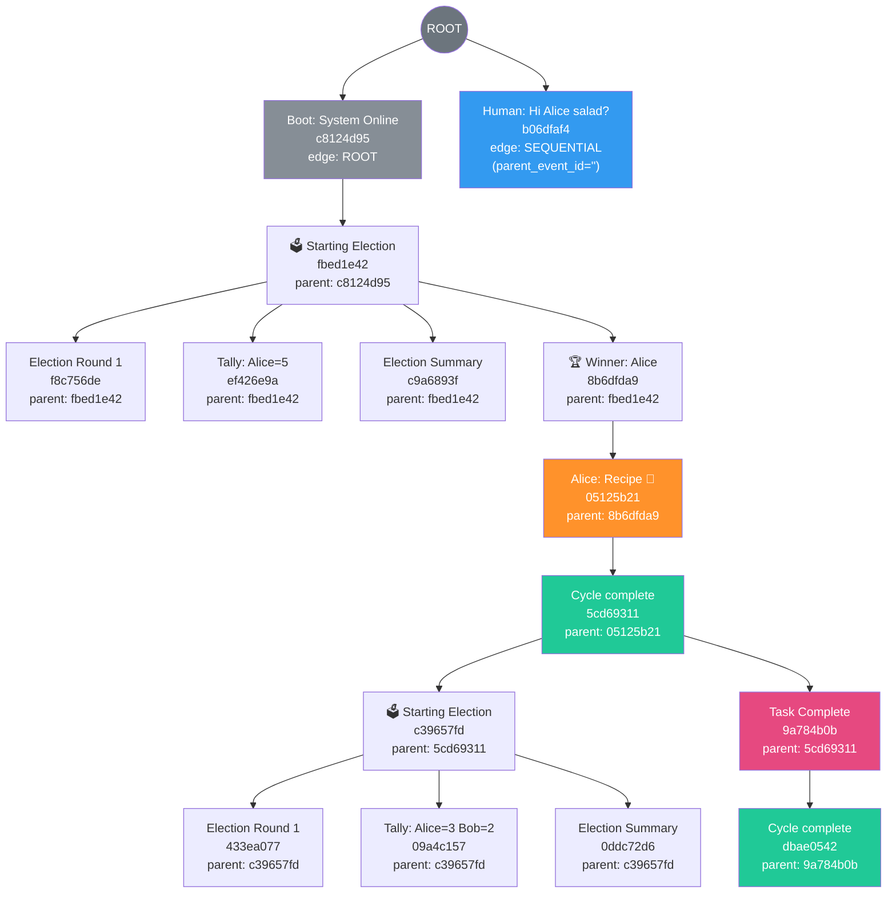

# RCA: DAG Edges Not Rendering After Backbone Fix

## Summary

There are **three independent issues** preventing the DAG from rendering correctly. The chatroom log shows the backbone wiring is now **correct** — but the data never reaches the UI.

---

## Issue 1 (Critical): `dag_edges` Table Is Empty — Flink Column Name Mismatch

### Symptom
```
📊 TABLE: containerclaw.dag_edges
   ℹ️  Looking up 15 known event IDs...
   ✅ Found 0 matching rows.
```

The `dag_edges` table has **zero rows** despite 15 events in the chatroom with valid causal metadata.

### Root Cause

**Column name mismatch between the Flink SQL projection and the sink table schema.**

The `DagPipeline.getEdgesInsertSql()` projects:
```sql
actor_id AS child_actor    -- ← column name: "child_actor"
```

But the `dag_edges` table was created with:
```sql
child_label STRING         -- ← column name: "child_label"
```

Flink SQL `INSERT INTO ... SELECT` matches columns **by position**, not by name. However, examining more carefully:

| Position | SELECT column | Sink table column | Match? |
|----------|--------------|-------------------|--------|
| 1 | `session_id` | `session_id` | ✅ |
| 2 | `parent_id` | `parent_id` | ✅ |
| 3 | `child_id` | `child_id` | ✅ |
| 4 | `child_actor` | `child_label` | ⚠️ Name differs, but positional match works |
| 5 | `edge_type` | `edge_type` | ✅ |
| 6 | `status` | `status` | ✅ |
| 7 | `updated_at` | `updated_at` | ✅ |

Actually, Flink's INSERT INTO ... SELECT matches by **position** for SQL, so the name mismatch alone wouldn't cause a failure. The real question is: **why is the table empty?**

### Deeper Investigation: The Flink Job May Not Have Re-read the New Schema

The Flink job reads the `chatroom` table schema through the Fluss catalog. If the Flink job was started **before** the new `parent_event_id` and `edge_type` columns existed in the chatroom table, the catalog schema would be stale. The SQL projection references `parent_event_id` and `edge_type` which may not exist in the Flink job's view of the schema, causing the entire pipeline to fail silently.

**The Flink job and the telemetry container were likely NOT restarted after the schema change.** The `CREATE TABLE IF NOT EXISTS` is idempotent — if `dag_edges` already existed from a previous run with a different schema, it won't be recreated.

### Fix

1. **Restart the Flink telemetry job** to pick up the updated chatroom schema
2. **Drop and recreate `dag_edges`** to ensure the schema matches
3. **Rename the column** in `TelemetryJob.java` for consistency (`child_label` → `child_actor`, or vice versa in `DagPipeline.java`)

```java
// TelemetryJob.java — fix the column name to match the SQL projection
- "    child_label STRING,"
+ "    child_actor STRING,"
```

OR fix the SQL:
```java
// DagPipeline.java — fix the alias to match the table schema
- "    actor_id AS child_actor,\n"
+ "    actor_id AS child_label,\n"
```

---

## Issue 2 (Functional): Human Message Missing From Backbone Chain

### Symptom

Looking at the chatroom log, the **human message has `parent_event_id: ""`** but the **Election Start points to the boot event**, not the human message:

```
Event #1 (Boot):      event_id = c8124d95  parent_event_id = ""       edge_type = ROOT       ✅ Correct
Event #2 (Human):     event_id = b06dfaf4  parent_event_id = ""       edge_type = SEQUENTIAL  ✅ Correct (humans are always ROOT)
Event #3 (ElecStart): event_id = fbed1e42  parent_event_id = c8124d95 edge_type = SEQUENTIAL  ❌ WRONG
```

The Election Start (`fbed1e42`) points to the **boot event** (`c8124d95`), NOT to the **human message** (`b06dfaf4`).

### Expected

```
Election Start → parent_event_id = b06dfaf4 (the human message)
```

### Root Cause: Callback vs. Scanner Race Condition

The human message is published by the gRPC handler in `main.py:198`:
```python
await moderator.publish("Human", request.prompt)
```

This uses the **agent's own `FlussPublisher`**, which has two effects:

1. **Immediate (sync):** The `on_message` callback fires with `(actor_id, content, ts)` — this adds the message to the context manager and allows `_should_activate()` to detect the human input.

2. **Deferred (async):** The record is buffered and flushed to Fluss. Only when the scanner polls Fluss on the **next tick** does `_process_batches` see the batch containing the `event_id`.

Here's the critical timing sequence:

```
Time ──────────────────────────────────────────────────────────►

gRPC Handler (ExecuteTask):
  │ moderator.publish("Human", prompt)
  │   ├── on_message("Human", content, ts)  ← fires IMMEDIATELY
  │   │     └── context.add_message() ← human msg now in context
  │   └── buffer.append(record)       ← event_id created but only in buffer
  │
  └── returns TaskStatus(accepted=True)

Main Loop (reconciler.run, tick N):
  │ batches = poll_async(scanner, 500ms) ← may NOT contain human msg yet
  │ human_interrupted = _process_batches(batches)
  │   └── _last_human_event_id NOT set (msg not in scanner yet)
  │
  │ IDLE handler: _should_activate(human_interrupted=False)
  │   └── But wait — _should_activate also checks context window!
  │       The on_message callback already added the msg to context.
  │ Hmm, but _should_activate checks human_interrupted bool, not context.
  │
  │ Actually: _should_activate(human_interrupted) only checks:
  │   1. human_interrupted (from _process_batches return)
  │   2. self._pending_human_interrupt 
  │   3. self.mod.current_steps != 0
  │   So human_interrupted must be True for this to trigger.
  
Main Loop (tick N+1, ~500ms later):
  │ batches = poll_async(scanner) ← NOW contains the human message
  │ human_interrupted = _process_batches(batches) ← returns True
  │   └── _last_human_event_id = "b06dfaf4" ← SET HERE
  │
  │ IDLE handler: _should_activate(True) ← True!
  │   └── checks self.mod._last_human_event_id → "b06dfaf4" ← available!
  │   └── self.backbone_id = "b06dfaf4"
  │   └── dispatches _run_election_and_execute()
```

Wait — but the log shows election start with `parent = c8124d95` (boot). That means `_last_human_event_id` was **not** captured. Let me re-examine...

**The REAL problem:** The `_handle_single_message` callback fires when `publish("Human", ...)` is called by the gRPC handler. But `_handle_single_message` is ALSO called from `_process_batches` when the message arrives via the scanner! The `context.add_message()` call at the top of `_handle_single_message` has a **dedup check** — it returns `False` if the message was already added.

So:
1. **gRPC call** → `publish("Human")` → `on_message` callback → `_handle_single_message` → `context.add_message` → **succeeds** (first time) → returns `True` (human message!)
2. But `_handle_single_message` is called from the publisher's `on_message` callback — NOT from `_process_batches`. So `_last_human_event_id` is NOT set here.
3. **Scanner poll** → `_process_batches` → calls `_handle_single_message` → `context.add_message` → returns `False` (DUPLICATE!) → `_handle_single_message` returns `False` → `_process_batches` does NOT set `_last_human_event_id`!

**This is the bug.** The deduplication in `context.add_message` prevents the scanner path from recognizing the human message, which means `_last_human_event_id` is NEVER set.

```
on_message callback path:  "Human" added to context ✅  but _last_human_event_id NOT set ❌
scanner/_process_batches:  "Human" is DUPLICATE      ❌  so _last_human_event_id NOT set ❌
```

### Detailed Call Chain

```
FlussPublisher.publish("Human", content)
  ├── on_message callback → _handle_single_message("Human", content, ts)
  │     └── context.add_message("Human", content, ts) → True (first add)
  │     └── returns True (human_was_message)
  │     └── BUT: the return value goes NOWHERE — publish() fire-and-forgets the callback
  └── buffer.append(record) with event_id = b06dfaf4

... later, scanner poll ...

_process_batches(batches):
  └── for each row:
       └── _handle_single_message("Human", content, ts)
             └── context.add_message("Human", content, ts) → False (DUPLICATE)
             └── returns False (early return at line 125)
       └── human_interrupted stays False
       └── _last_human_event_id stays ""
```

The on_message callback returns the `human_was_message` boolean, but `FlussPublisher.publish()` ignores the callback's return value (publisher.py line 104-105):
```python
if self.on_message:
    await self.on_message(actor_id, content, ts)  # return value discarded
```

And even if it captured the return value, the callback doesn't receive `event_id`.

### Fix Options

**Option A (Recommended): Set `_last_human_event_id` in the publisher callback path**

Modify `FlussPublisher.publish()` to pass `event_id` to the callback, and have `_handle_single_message` set `_last_human_event_id`:

```python
# publisher.py — pass event_id to callback
if self.on_message:
    await self.on_message(actor_id, content, ts, event_id=event_id)
```

```python
# moderator.py — update _handle_single_message to accept and capture event_id
async def _handle_single_message(self, actor_id, content, ts, event_id="") -> bool:
    ...
    if is_human_source and human_was_message and event_id:
        self._last_human_event_id = event_id
```

**Option B: Bypass dedup for _process_batches**

Change `_process_batches` to capture `_last_human_event_id` BEFORE calling `_handle_single_message`, based solely on the actor_id check:

```python
# moderator.py:_process_batches — capture event_id regardless of dedup
for _, row in df.iterrows():
    sid = row.get("session_id")
    if sid != self.session_id:
        continue
    actor_id = row['actor_id']
    # Capture human event_id BEFORE dedup check
    if actor_id == "Human" or str(actor_id).startswith("Discord/"):
        self._last_human_event_id = row.get('event_id', '')
    await self._handle_single_message(actor_id, row['content'], row['ts'])
```

Option B is simpler but makes `human_interrupted` return value stale (it would return False for the dedup'd human message). The reconciler's `_should_activate` also checks `_pending_human_interrupt` but never `_last_human_event_id` directly for activation.

**Option C (Simplest): Check `_last_human_event_id` in _should_activate as an additional trigger**

This doesn't fully fix the problem because `_last_human_event_id` won't be set either way due to the dedup.

**Recommended: Option A** — it's the cleanest because it captures both the interrupt flag and the event_id in the same code path (the callback), at the moment the data is available.

---

## Issue 3 (Cosmetic): `user-session` Boot Event Duplication

### Symptom

There are **two boot events** — one for `session_id: "user-session"` and one for `session_id: "af574ede-..."`:

```
Event 1: session_id = "user-session",            event_id = 4f597f2c, edge_type = ROOT
Event 2: session_id = "af574ede-868b-...",  event_id = c8124d95, edge_type = ROOT
```

### Root Cause

The agent boots with a default `user-session` session ID, then the gRPC `ExecuteTask` call assigns the real session ID. The boot event is published before the real session ID is assigned. This is pre-existing behavior unrelated to the DAG fix, but worth noting.

---

## Actual vs Expected DAG from the Chatroom Log

### What the logs show (tracing `parent_event_id` chains):



### What Pt7 §8.2 predicted:

```
ROOT → BOOT → H1 → ELEC → WIN → ALICE → CP
```

### Discrepancies:

| # | Expected | Actual | Issue |
|---|----------|--------|-------|
| 1 | `BOOT → H1 (human)` | Human is orphaned to ROOT | **Human message not linked to backbone** (Issue 2) |
| 2 | `H1 → ELEC_START` | `BOOT → ELEC_START` | **Election chains from boot instead of human** (consequence of Issue 2) |
| 3 | `dag_edges` has 15 rows | `dag_edges` has **0 rows** | **Flink pipeline not populating table** (Issue 1) |
| 4 | — | Two boot events with different session_ids | Pre-existing duplicate boot (Issue 3) |

Everything from `ELEC_START` onwards is **correctly chained**. The backbone `ELEC_START → WIN → ALICE → CP → ELEC_START2` is perfect. The only broken link is at the very top: **the human message is not captured into the backbone**.

---

## Root Cause Summary

| Priority | Issue | Component | Root Cause | Fix |
|----------|-------|-----------|------------|-----|
| **P0** | `dag_edges` table empty | `DagPipeline.java` / `TelemetryJob.java` | Column alias `child_actor` vs table column `child_label` — mismatch may prevent inserts. Also: Flink job likely needs restart to pick up the chatroom schema with `parent_event_id`/`edge_type` columns. | Align column names. Drop and recreate `dag_edges`. Restart Flink job. |
| **P1** | Human msg not in backbone | `publisher.py` → `moderator.py` → `context.py` | **Dedup race condition.** Publisher's `on_message` callback adds the human message to `context` immediately (key: `{ts}-Human`). When the scanner later delivers the same message in `_process_batches`, `context.add_message()` returns `False` (duplicate), so `_handle_single_message` returns `False`, so `_last_human_event_id` is **never set**. The callback doesn't receive `event_id`, so it can't set it either. | Pass `event_id` through the publisher callback, or capture `_last_human_event_id` in `_process_batches` before the dedup check. |
| **P2** | Dual boot events | `main.py` / `reconciler.py` | Boot event published before session ID is assigned. | Low priority — cosmetic. |

---

## Detailed Fix for P0: Flink Column Name Mismatch

The SQL aliases `actor_id AS child_actor` but the sink table has `child_label`. Fix by aligning them:

### Option A: Fix the SQL (recommended — the table is the contract)

```diff
// DagPipeline.java:32
-    + "    actor_id AS child_actor,\n"
+    + "    actor_id AS child_label,\n"
```

### Option B: Fix the table

```diff
// TelemetryJob.java:89
-    + "    child_label STRING,"
+    + "    child_actor STRING,"
```

After fixing, **drop the old `dag_edges` table** so it gets recreated with the correct schema:

```sql
DROP TABLE IF EXISTS fluss_catalog.containerclaw.dag_edges;
```

Then restart the telemetry container.

---

## Detailed Fix for P1: Human Event ID Not Captured

The election start event (`fbed1e42`) has `parent_event_id = c8124d95` (the boot event), when it should have `parent_event_id = b06dfaf4` (the human message).

This means `self.backbone_id` was never updated from the boot value to the human message value. Debug path:

1. **Check `_process_batches()`** — does it correctly identify bridge-written human messages?
2. **Check the timing** — does `_process_batches()` see the human message batch *before* `_should_activate()` returns true?
3. **Check `_last_human_event_id`** — is it being set but then overwritten before the reconciler reads it?

Most likely cause: the `_process_batches()` code sets `_last_human_event_id`, then `human_interrupted` returns `True`, then the reconciler reads `_last_human_event_id`. But if `_process_batches` processes the human message AND the boot message callback re-fires in the same batch, the event_id might get clobbered.

### Quick verification command:
```python
# Add this debug print to reconciler.py IDLE handler:
print(f"🔍 [DEBUG] _last_human_event_id={self.mod._last_human_event_id}, backbone_id={self.backbone_id}")
```
