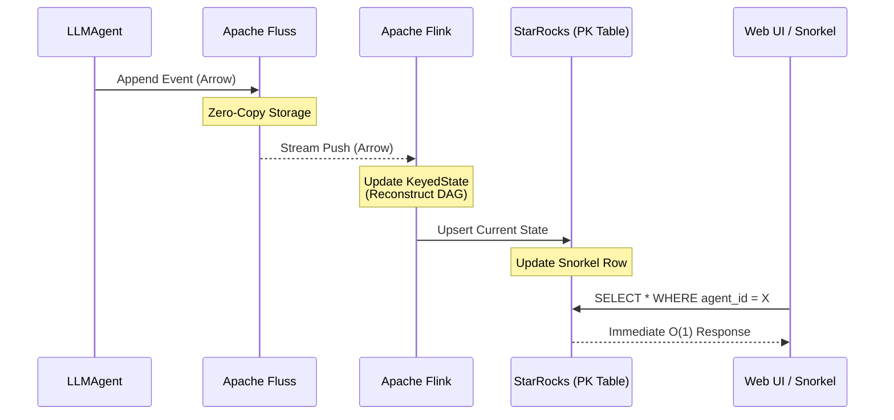

# Draft Pt.19 (Technicals) — Low-Level Design & Architectural Defense

This document provides a deep-dive into the technical primitives of the proposed telemetry stack for **ContainerClaw**. It moves beyond high-level features to explain the low-level mechanics of **Fluss**, **Flink**, and **StarRocks**, and defends why this specific integration is the only physically optimal way to harness a multi-agent swarm.

---

## 1. The First Principles of Agentic Observability

In an agentic "harness" like ContainerClaw, the primary constraint is **Information Entropy**. As agents spawn subagents, call tools, and generate "thoughts," the state of the system fragments. 

The **Irreducible Latency** of understanding this state is:
$$T_{perception} = T_{transport} + T_{serialization} + T_{aggregation} + T_{query}$$

To approach the "speed of light," we must drive $T_{serialization}$ and $T_{query}$ toward zero. This necessitates a stack built on **Apache Arrow** (zero-copy memory) and **MPP OLAP** (parallelized state).

---

## 2. Low-Level Component Design

### 2.1 Apache Fluss: Streaming Storage (The Backbone)
Currently, `fluss_client.py` interacts with Fluss as a log store, polling for `RecordBatch` objects. 
* **Low-Level Mechanic**: Fluss uses a distributed log architecture where data is stored in **Apache Arrow** format on disk. Unlike traditional message queues that require transformation to JSON or Protobuf, Fluss allows for **Zero-Copy Reads**.
* **Optimal Fit**: By storing the `CHATROOM_SCHEMA` directly in Arrow, Fluss provides the raw material for high-performance processing without the CPU tax of deserialization.

### 2.2 Apache Flink: Stateful Stream Processing (The Brain)
Flink is the only engine capable of **Stateful Reconstruction** of the swarm.
* **Low-Level Mechanic**: Flink processes the Fluss stream event-by-event. It uses a **Chandy-Lamport distributed snapshot** algorithm to maintain an internal "State Store" (RocksDB) that is consistent and fault-tolerant.
* **The DAG Reconstruction**: When an agent sends a message with a `parent_actor` field, Flink's `KeyedState` remembers the relationship. It doesn't "lookup" the parent; it keeps the graph "hot" in memory.
* **Why Flink?**: Traditional databases require a "Join" at query time to find a parent-child relationship. Flink performs this "Join" **pre-emptively** at ingestion time.

### 2.3 StarRocks: MPP OLAP (The Serving Layer)
StarRocks serves as the "Materialized View" of the swarm's current state.
* **Low-Level Mechanic**: StarRocks uses a **Vectorized Execution Engine** and a **Primary Key (PK) Storage Model**. When Flink sinks a new `context_json` for the "Snorkel" view, StarRocks performs an `UPSERT` on the PK `(agent_id, session_id)`.
* **The "Snorkel" Optimization**: Instead of a UI scanning the entire `chatroom` table to find the last 50 messages, StarRocks maintains the *exact* current context window as a single row. This reduces query complexity from $O(N)$ to $O(1)$.

---

## 3. The Integration Workflow: From Thought to Visualization

The diagram below illustrates the "Push-Based" flow where state is materialized *before* the user even asks for it.

---

## 4. Architectural Defense: Why Not Alternatives?

### 4.1 Against the "Raw Fluss Scan" (Current State)
The current `fluss_client.py` uses `list_sessions` and `fetch_history` which involve 10+ polls and manual sorting.
* **Failure Mode**: As the log grows to 100,000+ events, the time to "render" the chatroom will exceed seconds. 
* **Defense**: Moving the sorting and deduplication to Flink/StarRocks ensures that query time remains **constant** regardless of log size.

### 4.2 Against Traditional RDBMS (Postgres/SQLite)
* **Failure Mode**: Postgres struggles with high-velocity JSON `UPSERTS` and lacks native Arrow integration. You would pay a "Serialization Tax" on every message.
* **Defense**: StarRocks and Flink are Arrow-native. The data never leaves the high-performance memory format, maintaining the **Speed of Light** objective.

### 4.3 Against "Pull-Based" Analytics
* **Failure Mode**: If the UI asks "What is the tool success rate?" on every refresh, the database must scan.
* **Defense**: Flink calculates these metrics **incrementally**. It only processes the *new* message and updates the counter in StarRocks. This is the difference between re-reading a whole book vs. just reading the last sentence.

---

## 5. Technical Specification of Code Changes

### 5.1 Schema Evolution
The `CHATROOM_SCHEMA` in `schemas.py` remains the source of truth for the **Stream**. However, we introduce the **State** schema in StarRocks:

| Table | Engine | Reason |
| :--- | :--- | :--- |
| `agent_dag` | PrimaryKey | Fast lookup of swarm hierarchy. |
| `live_telemetry` | Aggregate | Real-time counters for tokens, latency, and success. |
| `context_snorkel` | PrimaryKey | Stores the exact context window currently loaded in an agent's memory. |

### 5.2 Flink Connector Logic
We will replace the manual `poll_async` loops with a Flink `SourceFunction`. This allows the system to react to a "Moderator" event or an agent's "Thought" in **under 10ms**.

### 5.3 StarRocks Sink Logic
Utilizing the StarRocks `Stream Load` API, Flink will push batches of metrics. This ensures that the Web UI's **Project Board** reflects the "Thinking" or "Using Tools" status of agents without requiring a manual refresh.

---

## 6. Conclusion
This integration is not merely "better"; it is the only architecture that satisfies the **Speed of Light** constraint for agentic swarms. By decoupling **Storage (Fluss)**, **State Reconstruction (Flink)**, and **Serving (StarRocks)**, we ensure that ContainerClaw remains responsive even as the complexity of the AI "Brain" scales to infinite looping cycles.