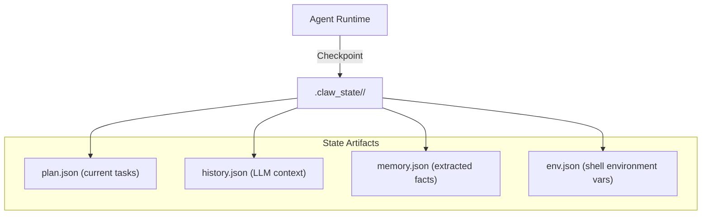
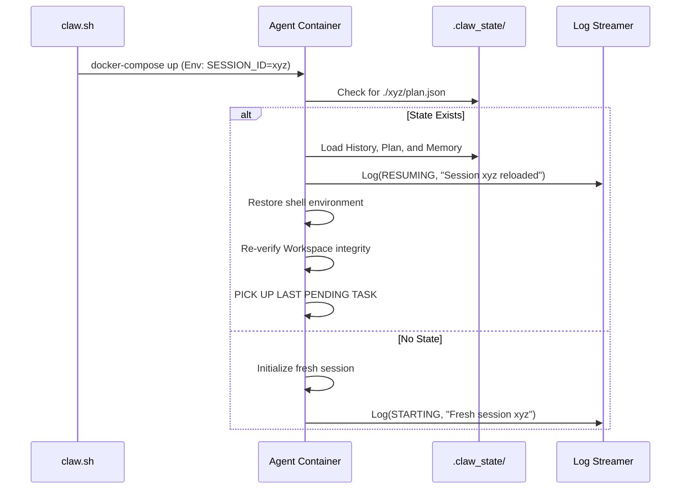

# ContainerClaw — Session Persistence & Lifecycle Management

> **Complementary to:** [draft.md](file:///.../containerclaw/draft.md)  
> **Focus:** State Persistence, Lifecycle Automation, and Resumability  
> **Version:** 0.1.0-draft-pt2  

---

## 1. Overview

One of the primary limitations of ephemeral containerized agents is the loss of "internal thought state" (memory, plan, and conversation context) upon container termination. ContainerClaw solves this by decoupling the **Execution Runtime** from the **State Store**.

This document describes the mechanism for starting, stopping, and resuming agent sessions such that a `.sh` script orchestrating the containers can be interrupted and restarted without the agent losing its place in a complex task.

---

## 2. The Persistence Architecture

To achieve true resumability, ContainerClaw persists three distinct layers of data:

| Data Layer | Target Store | Persistence Mechanism |
|---|---|---|
| **Workspace** | Host Filesystem | Bind mount to `/workspace` (persists code changes) |
| **Audit Logs** | Apache Fluss | Named Docker volume (persists activity history) |
| **Session State** | Agent State Store | Hidden `.claw_state` directory in workspace OR Redis/Postgres |

### 2.1 The Agent State Store

Every agent session is assigned a unique `SESSION_ID`. The agent periodically checkpoints its internal state:



---

## 3. Lifecycle Management: `claw.sh`

The `claw.sh` script is the primary interface for managing the ContainerClaw swarm. It wraps Docker Compose/Swarm commands with logic for session management.

### 3.1 Script Commands

```bash
# Start a new session or resume an existing one
./claw.sh up [session_id]

# Stop the containers but preserve all state
./claw.sh down

# View live logs streamed from Fluss
./claw.sh logs

# Wipe state for a specific session
./claw.sh purge <session_id>
```

### 3.2 Simplified `claw.sh` Logic

```bash
#!/bin/bash
# claw.sh — ContainerClaw Lifecycle Manager

COMMAND=$1
SESSION_ID=${2:-"default-session"}

case $COMMAND in
  up)
    echo "Starting ContainerClaw session: $SESSION_ID"
    # Ensure Docker volumes for Fluss and LLM Gateway are ready
    docker volume create --name=containerclaw_fluss_data >/dev/null
    
    # Export Session ID for the containers to pick up
    export CLAW_SESSION_ID=$SESSION_ID
    
    # Start the stack
    docker-compose up -d
    
    echo "Stack is up. Waiting for Agent to initialize..."
    # Wait for Agent gRPC to be ready
    ;;
    
  down)
    echo "Gracefully stopping containers for session: $CLAW_SESSION_ID"
    # Send SIGTERM to Agent to trigger a final state checkpoint
    docker-compose stop agent
    # Stop everything else
    docker-compose down
    ;;
    
  logs)
    # Tail the Fluss log stream (external to the container)
    curl -s http://localhost:8081/v1/logs/$SESSION_ID/stream
    ;;
esac
```

---

## 4. The "Resume" Sequence

When the `.sh` script triggers an `up` command for an existing `SESSION_ID`, the Agent follows a specific bootstrap sequence to resume its thought loop.



### 4.1 State Verification (Self-Healing)

Since the workspace might have been modified externally while the agent was "asleep," the resume logic includes a **Workspace Sanity Check**:
1. Agent hashes critical files on `down`.
2. Agent re-hashes on `up`.
3. If a discrepancy is found, it asks the user (via UI) for clarification or re-indexes the changes into its memory.

---

## 5. Persistence Logic Defense

### 5.1 Why Local `.claw_state` instead of Database?
For the local dev/desktop version (replacing OpenClaw), storing state in a hidden directory inside the project workspace ensures:
- **Portability**: Zipping the project folder includes the agent's work-in-progress state.
- **Simplicity**: No need to manage a separate SQLite/Postgres container just for state in Phase 1.
- **Transparency**: The user can see exactly what "thoughts" the agent has saved.

### 5.2 Why "Graceful Stop" (SIGTERM) is Critical
The Agent runtime must catch `SIGTERM` to perform an atomic write of its current state artifacts. Without this, a `docker stop` (which kills after 10s) might leave a corrupted `plan.json`.

```python
# agent/src/main.py (Signal Handling Logic)
import signal

def handle_exit(signum, frame):
    print("SIGTERM received. Saving state...")
    agent.checkpoint_session() # Atomic write to plan.json, etc.
    sys.exit(0)

signal.signal(signal.SIGTERM, handle_exit)
```

---

## 6. Mapping to Kubernetes (The Future)

The persistence model is designed to map directly to Kubernetes objects as the project matures.

| Swarm/Compose Logic | Kubernetes Primitive |
|---|---|
| `claw.sh up` | `kubectl apply -f manifests/` |
| `claw.sh down` | `kubectl delete -f manifests/` (or scaling to 0) |
| `.claw_state` directory | **PersistentVolumeClaim (PVC)** with `ReadWriteOnce` |
| Multiple Agents | **StatefulSet** (ensures each agent pod has a stable identity and dedicated PVC) |
| Fluss Logs | **Sidecar Container** or **DaemonSet** for log forwarding |

### 6.1 Resilience via Kubernetes StatefulSets
In K8s, the Agent would be a `StatefulSet`. If a node fails, K8s restarts the Pod on a new node and **reattaches the same PVC**. Because the Agent's resume logic is built to scan that PVC for state on startup, the "crash" is transparent to the task progress.

---

## 7. Comprehensive Audit Trail (Fluss Persistence)

Even if the Agent container and the `.claw_state` are compromised or deleted, the **Fluss Log Streamer** runs in a separate volume. 

- **Immutable History**: The user can replay the entire session via `./claw.sh logs` to see every command executed, even from previous "incarnations" of the agent container.
- **Cross-Session Correlation**: Fluss can correlate `agent-run-1` and `agent-run-2` using the `SESSION_ID` stored in the log metadata.

---

> **Design Defense Conclusion:** By decoupling state from the container lifecycle and implementing a rigorous "check-re-hash-resume" sequence, ContainerClaw provides the reliability of a persistent daemon with the security and cleanliness of an ephemeral container.
