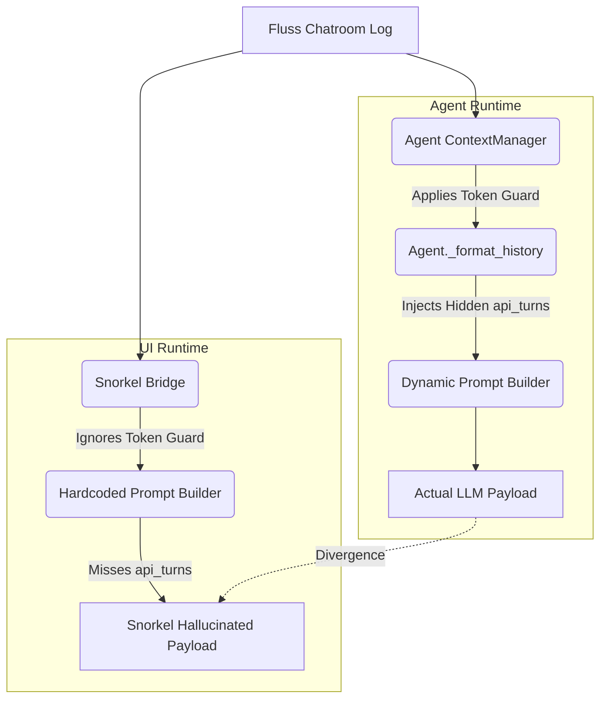
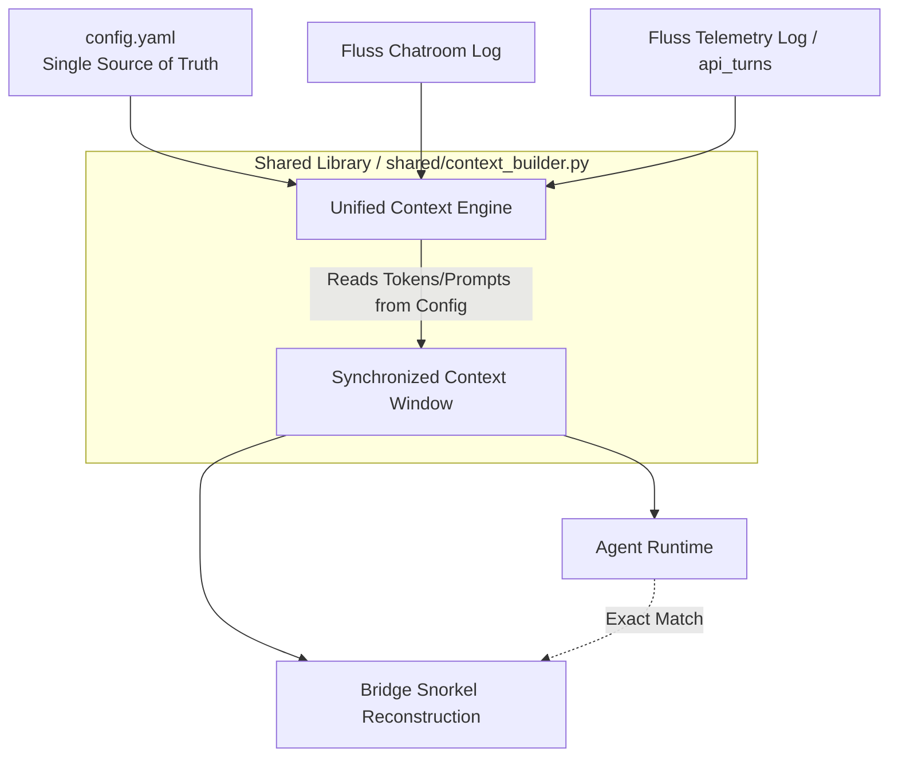

# Draft Pt 20: The True Context Window & Config-Driven Synchronization (draft_pt20_actual_context.md)

## 1. First Principles: Causality and Information Propagation
When architecting a distributed multi-agent system, we must derive our design from first principles. The fundamental limit of information transfer—the speed of light—dictates how quickly state changes propagate across our event streams. In an optimal system, latency is bounded only by network physics and hardware limits. 

However, suboptimal design choices in context reconstruction introduce artificial delays and "causality violations," where the UI (Snorkel) observes a state that the agent never actually experienced. If the agent and the UI derive their reality from different algorithms or desynchronized parameters, their shared reality fragments. To ensure deterministic "wave function collapse" across all observers (agents and the UI) at any given timestamp, they must share an identical, synchronized reference frame. 

Currently, `ContainerClaw` violates this principle. The UI’s "Snorkel" feature hallucinates a context window that diverges sharply from the empirical reality processed by the agent.

## 2. The Context Discrepancy: Empirical Reality vs. Snorkel Approximation

A rigorous audit of `agent/src/agent.py`, `agent/src/context.py`, and `bridge/src/bridge.py` reveals three critical divergence vectors where Snorkel fails to represent the true context window.

### 2.1 The Token Guard Blindspot
* **Agent Reality:** `ContextManager.get_window()` enforces a strict "Token Guard" (`char_limit = config.MAX_HISTORY_CHARS`). The agent walks backward through the message list and cleanly amputates history the millisecond the token budget is exhausted.
* **Snorkel Illusion:** The `_lookup_snorkel_perspective` in the bridge only enforces `max_history_messages = 100`. If an agent receives 5 massive code blocks that exhaust the token limit in 10 messages, the agent drops the remaining 90. Snorkel blindly displays all 100, deceiving the developer into believing the agent has context it does not.

### 2.2 System Prompt Drift
* **Agent Reality:** The agent dynamically weaves its capabilities into the system prompt at runtime. In `_think_with_tools`, the prompt mutates to include the exact schemas of available tools and conditional instructions (`"You have access to tools: [{tool_names}]..."`).
* **Snorkel Illusion:** The bridge hardcodes a static, anemic fallback: `persona = "You are a helpful assistant."` and `perspective = [{"role": "system", "content": f"You are {actor_id}... Persona: {persona}."}]`. The crucial tool schemas and operational directives are entirely absent from the UI.

### 2.3 The Missing Multi-Turn Hidden State (`_api_turns`)
* **Agent Reality:** When executing OpenAI function calls, the agent accumulates an internal array (`self._api_turns`) containing intermediate `role: "tool"` responses. This allows the model to "show its work" and execute consecutive tool calls before yielding the floor.
* **Snorkel Illusion:** These intermediate API turns are never published to the primary `chatroom` Fluss log. Because Snorkel reconstructs history purely by tailing the `chatroom` table, these internal reasoning loops are invisible. The UI sees the agent wake up, and suddenly output an answer, completely blind to the intermediate tool responses the agent evaluated.

## 3. Architectural Redesign: The Config-Driven Unified Context

To resolve these causality violations, all context generation must be extracted from localized code (`agent.py` and `bridge.py`) and centralized into the shared `config.yaml`. Both the execution layer and the presentation layer must use the exact same pure function to project the event log into an LLM payload.

### 3.1 Proposed Configuration Schema (`config.yaml`)
We must migrate prompt engineering to the declarative config:

```yaml
# config.yaml (Unified Prompt & Context Directives)
agents:
  context_rules:
    max_history_messages: 100
    max_history_chars: 480000
  prompts:
    system_base: "You are {agent_id}, participating in a multi-agent software engineering team. Persona: {persona}."
    tool_injection: "You have access to tools: [{tool_names}]. Use them when you need to take action."
    moderator_injection: "CRITICAL: If the Moderator just announced you won the election, you SHOULD contribute."
  roster:
    - name: "Alice"
      persona: "Software architect."
```

### 3.2 Diagram: Current Flawed Architecture


### 3.3 Diagram: Proposed Unified Architecture


## 4. Defense of Code Changes & Implementation Path

1.  **Extract Context Logic to a Shared Library (`shared/context_builder.py`):**
    * *Defense:* Duplicating context formatting across `agent.py` and `bridge.py` guarantees eventual drift. By creating a unified `ContextBuilder.build_payload(events, config, actor_id)`, both the runtime and the UI are mathematically guaranteed to evaluate the same inputs against the same rules.
2.  **Persist `_api_turns` to a Telemetry Table in Fluss:**
    * *Defense:* If the agent maintains hidden state in RAM, Snorkel can never be a true observer. Every intermediate `role: "tool"` execution must be pushed to a dedicated `tool_executions` Fluss topic. The `ContextBuilder` will multiplex the `chatroom` events with `tool_executions` events based on exact timestamps.
3.  **Strict Token Guard in the Shared Module:**
    * *Defense:* The UI must simulate the exact character truncation. The shared `ContextBuilder` will apply the `char_limit` budget universally. If Snorkel renders a message, the developer knows with 100% certainty the agent received those exact bytes.