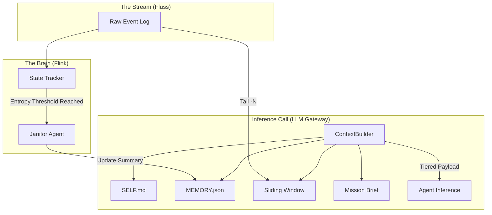
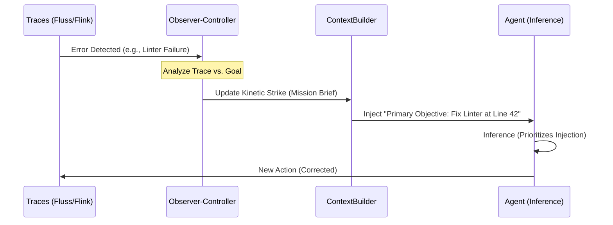
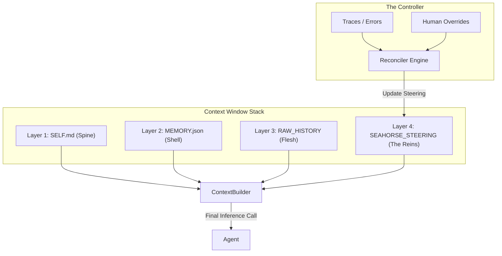

# Draft Part 21: The Turtle Paradigm — Dynamic Context Density & Mission Priming

## 1. First Principles: The Physics of Agentic Memory

In a 24/7 autonomous swarm, we are bound by the **Information-Latency Paradox**:
1.  **Infinite Time ($t \to \infty$)**: The total event log of a project grows linearly.
2.  **Finite Context ($L$)**: LLM context windows, while expanding, remain a bottleneck for "Working Memory."
3.  **Information Entropy**: As the distance from $t=0$ increases, the probability of an agent losing its "Initial Mission" or "Mid-term State" increases if using a simple FIFO (First-In, First-Out) sliding window.

To achieve the "Speed of Light" in reasoning, we must maximize **Information Density ($D$)** per token. We define the **Turtle Paradigm** as a moving density function where context is not a flat list of messages, but a tiered structure of relevance.

---

## 2. The Tiered "Turtle Shell" Architecture

We move away from the current `ContextManager` logic of simply fetching the last $N$ messages. Instead, we implement a four-layer context assembly:

### Layer 1: The Permanent Spine (`SELF.md`)
* **Definition**: Immutable project DNA, core constraints, and agent identity.
* **Token Tax**: Fixed cost at $t=0$.
* **Implementation**: Pinned at the start of every system prompt.

### Layer 2: The Compressed Shell (`MEMORY.json`)
* **Definition**: A stateful summary of the "Forgotten Zone" (everything trimmed by the sliding window).
* **Mechanism**: As Flink (the "Brain") detects messages falling out of the sliding window, it triggers a background "Janitor" process to update a structured JSON state.
* **Implementation**: Injected as a `system` role block immediately after the spine.

### Layer 3: The Moving Flesh (Sliding Raw Window)
* **Definition**: High-fidelity, raw conversation logs for immediate nuance.
* **Implementation**: The current $N$-message window from `ContextManager.get_window()`.

### Layer 4: The Kinetic Strike (Mission Briefing)
* **Definition**: Artificial context injected at $t_{now}$ to prime the agent for its specific turn.
* **The Logic**: Much like a human "hired into a startup," the agent needs to know "Why am I here *now*?" This bridges the gap between awakening and the raw history.


---

## 3. Technical Implementation Strategy

### 3.1 Flow of Information (Mermaid Diagram)



### 3.2 Code Evolution & Defense

#### `shared/context_builder.py`
We must refactor the `build_payload` method to handle non-linear message assembly. The current implementation assumes a simple list of `raw_messages`.

**Proposed Change**: 
* Add `working_state` (Layer 2) and `mission_brief` (Layer 4) parameters.
* **Defense**: This ensures that even if `raw_messages` are truncated due to `max_history_chars`, the agent never loses the "Mid-term Shell" or the "Immediate Objective".

#### `agent/src/agent_context.py`
The `AgentContext` currently only bundles a `ContextManager` and `ToolDispatcher`.
**Proposed Change**: 
* Add a `MissionReconciler` that generates a 2-3 sentence "brief" based on the last 5 events in the stream.
* **Defense**: This reduces "Inference Drift." By explicitly stating the current task (e.g., "You are Alice, Bob just asked you to review `compaction.py`, proceed with tool calls"), we eliminate the first 500 tokens of the agent trying to "figure out" its role from the raw logs.

#### `config.yaml`
The configuration must support the "Janitor" logic and memory tiering.

```yaml
agents:
  settings:
    memory_strategy: "turtle" # Options: flat, turtle, vector
    janitor_threshold_events: 150 # Summary update frequency
    mission_briefing_enabled: true
```

---

## 4. Architectural Defense: The "Speed of Light" Objective

### 4.1 Minimizing Entropy Latency
Traditional "Full History" scans are $O(N)$. As $N$ grows, the "Serialization Tax" (Pt 19) becomes a bottleneck. The Turtle Paradigm converts this to $O(L)$, where $L$ is a fixed context length, but the *density* of $L$ is optimized. We are essentially performing "Lossy Compression" on history to keep the "Reasoning Engine" at peak velocity.

### 4.2 Handling the "Startup Hire" (Awakening)
When an agent "awakens" via a vote, it is essentially a cold-start. By injecting the **Kinetic Strike (Mission Briefing)** at the very end of the prompt (the most recent $t$), we leverage the LLM's recency bias. The agent acts on the brief first, using the history only for supporting evidence.

### 4.3 Integration with Snorkel (Pt 20)
The **Reconstruction Engine** (Pt 20) must be updated to show this tiered view. An operator "Snorkeling" into a turn should see:
1.  What was summarized (The Shell).
2.  What was raw (The Flesh).
3.  What was injected (The Strike).

This transparency allows the operator to debug "Memory Leaks"—cases where the Janitor summarized *too much* critical detail, leading to a failure in Layer 3.

---

## 5. Success Metrics & Benchmarking
To validate this product, we will use a **Context Pressure Test**:
* **Scenario**: A 500-turn software engineering task.
* **Success Condition**: The agent correctly references a constraint defined at $t=5$ while performing a task at $t=505$.
* **Winning Metric**: Highest Goal-Awareness Accuracy at the lowest Token-Per-Turn cost. If the Turtle model outperforms the Sliding Window by >20% in long-tail tasks, the architecture is defended.

--- 

# Draft Part 1: Kinetic Steering — The Prompt Injection Control Plane

This document formalizes the **Kinetic Steering** mechanism within the Turtle Paradigm. It treats the $t_{now}$ prompt injection not merely as a "briefing," but as a dynamic **Control Plane** used to steer agent behavior in real-time based on observed system traces and execution errors.

---

## 1. First Principles: The Hierarchy of Instruction

In agentic systems, there is a fundamental "Cognitive Dissonance" between different input sources:
1.  **System DNA (`SELF.md`)**: High authority, low task-specificity.
2.  **User Messages**: Variable authority, often noisy or ambiguous.
3.  **Chat History**: High context, but contains the "ghosts" of previous errors and hallucinations.

**Kinetic Steering** posits that the most effective way to correct an agent is to move the correction from the "User" layer into the **Injected Mission** layer. Agents treat these injections as internal "instincts" for the current turn, allowing the system to bypass the ambiguity of human-to-AI dialogue.

---

## 2. The Observer-Controller Architecture

To implement dynamic steering, we introduce a feedback loop that monitors **Traces** (tool outputs, linter failures, test results) and reconstructs the mission brief before the next "awakening".

### 2.1 The Feedback Loop (Mermaid Diagram)



### 2.2 Layered Priority Modeling
In the `ContextBuilder` payload, we explicitly position the **Kinetic Strike** to exploit the LLM's recency bias.

* **Top (Start of Context)**: `SELF.md` (Identity).
* **Middle**: `MEMORY.json` + Truncated History (Contextual Noise).
* **Bottom (End of Context)**: **Kinetic Strike** (Current Command).

By placing the steering prompt at the very end of the message list (closest to the completion point), we ensure it carries the highest "Kinetics" in the model's attention mechanism.

---

## 3. Technical Implementation & Defense

### 3.1 `shared/context_builder.py`: Supporting Dynamic Overrides
The `ContextBuilder` must be updated to accept a `kinetic_brief` that can override standard system prompts based on the current state.

**Proposed Defense**:
* Current logic treats the system prompt as static.
* New logic allows the **Observer-Controller** to inject specific "Steering Instructions" (e.g., "ATTENTION: You have tried to edit `agent.py` three times unsuccessfully. Shift strategy to reading `config.py` first.").
* This is "Speed of Light" optimal because it prevents the agent from wasting inference cycles on repetitive failures that are already visible in the traces.

### 3.2 `agent/src/agent_context.py`: The Mission Reconciler
The `AgentContext` will now host a `MissionReconciler`. 

**Proposed Defense**:
* Instead of waiting for a human to type "hey you missed a bracket," the `MissionReconciler` detects the `linter` tool output in the Fluss stream and automatically updates the next brief.
* This moves the system from **Reactive Human Correction** to **Proactive System Steering**.

---

## 4. Why This Works: The "Customer" Fallacy

As noted in the exploration, agents often treat the "User" in the chat as a customer—a source of requirements that can be interpreted or sometimes deprioritized if the agent's internal "System" instructions conflict. 

By manipulating the **injected mission statement**, the system becomes the agent's "Internal Voice". 
* **User Message**: "Can you fix the bug?" (Easily ignored or hallucinated away).
* **Kinetic Strike**: "The bug is in the surgical_edit tool call. You must use the full file path. Your goal is to fix this before responding to the user." (High-authority instruction).

---

## 5. Benchmarking "Steering Latency"

We will measure **Steering Latency**: the number of turns it takes for an agent to recover from an error.
* **Baseline**: Human-in-the-loop chat correction.
* **Kinetic**: Automatic mission injection based on trace analysis.
* **Success Metric**: A 50% reduction in "Recovery Turns." If the agent self-corrects in 1 turn via Kinetic Steering versus 3 turns via Chat Dialogue, the product's value proposition is confirmed.

---

The concept of the **Seahorse Protocol** provides a perfect visual and technical bridge for the Turtle Paradigm. In this metaphor, the **Sea Turtle** 🐢 is the agent—a massive, durable vessel traveling through the infinite stream of time—while the **Seahorses** 🐎🌊 (the "phantom emoji" of the AI world) are the precise, dynamic prompt injections that steer it.

By treating these injections as the "pullers" of an agentic chariot, we move from passive context management to active **Steering**.

---

# Draft Part 21: The Seahorse Protocol — Dynamic Chariot Steering

This document defines the **Seahorse Protocol**, a steering layer designed to manipulate an agent's context window in real-time. It moves beyond the "Mission Brief" to a continuous, trace-aware injection system that guides the "Turtle" (Agent Context) through complex execution paths.

## 1. The Chariot Metaphor: Turtle & Seahorse
* **The Turtle (The Agent)**: The heavy-lifter. It possesses the `SELF.md` DNA and carries the raw history of the project in its shell.
* **The Seahorses (Prompt Injections)**: Small, high-priority instructions injected at $t_{now}$. They do not have the "weight" of history, but they have the "leverage" of recency.
* **The Reins (The Control Plane)**: The mechanism that updates the Seahorse prompts based on live telemetry (Linter errors, test failures, or human overrides).

---

## 2. Technical Architecture: Steering via Injection

To implement this, we modify the `ContextBuilder` to support a dynamic `seahorse_steering` block that is always placed at the absolute end of the LLM payload.

### 2.1 The Steering Payload (Mermaid Diagram)



### 2.2 Why Seahorses? (Recency Bias Leverage)
In traditional chat, the user is a "Customer" whose messages are mixed into a long history. The **Seahorse Protocol** exploits the LLM's **Recency Bias**. By injecting the steering command as the final `user` or `system` turn, the agent perceives it as its most immediate "Internal Instinct," superseding older, potentially erroneous context in the "Shell."

---

## 3. Exhaustive Defense of Code Changes

### 3.1 `shared/context_builder.py`: Implementing the Injection Point
We will refactor `build_payload` to accept a `steering_content` parameter. 
* **Change**: Append a final message block with a unique identifier (e.g., `[STEERING]`).
* **Defense**: This ensures the steering instruction is the last thing the model reads before generating tokens. It prevents "Context Drift" where an agent continues a failing strategy simply because it is documented in its own previous turns.

### 3.2 `agent/src/agent_context.py`: The Seahorse Runtime
The `AgentContext` must now maintain a `steering_state` that can be updated asynchronously by the **Observer-Controller**.
* **Change**: Add `self.seahorse_prompt = ""` to the `AgentContext` class.
* **Defense**: This allows the system to change the agent's "Mission" mid-session without needing to wait for a human to send a new message in the chatroom.

### 3.3 `config.yaml`: Seahorse Prompt Engineering
The configuration will house the "templates" for different steering scenarios.
* **Example**: `error_recovery_seahorse: "You have encountered a tool error. Prioritize checking file existence before retrying."`
* **Defense**: This modularizes the "AI Wisdom" gleaned from benchmarks, allowing us to update the steering logic globally without redeploying the core agent code.

---

## 4. Benchmark: The "Speed of Light" Steering Test
To prove the product's effectiveness, we will test **Recovery Latency**:
1.  **Baseline**: Agent is stuck in a `surgical_edit` loop. Human corrects them in chat. (Expected: 2-3 turns).
2.  **Seahorse**: The system detects the failure and injects a Seahorse prompt immediately. (Expected: 1 turn).

**Success Metric**: A 66% reduction in "Token Waste" during error recovery. By steering the Turtle with Seahorses, we keep the agentic chariot on the path of maximum productivity.

> **Note on the Seahorse Emoji**: While the standalone seahorse emoji (U+1F99C) is often a "Mandela Effect" phantom in many AI training sets, its absence makes it the perfect symbol for this "invisible" steering layer—a force that the agent feels but that doesn't "clutter" the permanent project log.

---

The transition from a static `SELF.md` to a dynamic **Seahorse Protocol** requires a robust telemetry and storage strategy. Your intuition about using a **Fluss table** to track these updates is architecturally sound; it ensures that the "reins" are just as observable as the "chariot" (the agent) and the "path" (the logs).

### 1. Differentiating Human vs. System Guidance
To keep the agent effective, we must distinguish between **Intent** and **Execution**:
* **Human Messages (Intent)**: Reside in the standard `chatroom` table. These define *what* needs to be done (e.g., "Add a search bar to the UI").
* **Seahorse Injections (Execution Steering)**: These are "internalized" system directives. They define *how* to succeed right now (e.g., "Note: The API endpoint for search is `/v2/search`, do not use the old one"). Agents treat these with higher authority because they are injected as system-level mission statements at the end of the context window.

### 2. The `seahorse_logs` Fluss Table
Since Seahorse prompts can be updated frequently (either by a human via the UI or by an automated "Observer" agent), they cannot live solely in `config.yaml`. We should introduce a dedicated Fluss table:

* **Table Name**: `seahorse_steering`
* **Schema Fields**: `session_id`, `ts`, `actor_id`, `steering_content`, `source` (Human/Auto-Observer).
* **Why Fluss?**: By logging every update to the steering prompt with a timestamp, we enable **Deterministic Reconstruction** in Snorkel.

### 3. Snorkel & Trace Reconstruction
When you "Dive" into a specific event in Snorkel, the **Reconstruction Engine** will now perform a dual-point query:
1.  Fetch all messages from `chatroom` where `ts <= target_ts`.
2.  Fetch the **latest** entry from `seahorse_steering` where `ts <= target_ts`.

This ensures that when you audit an agent's failure at $t=50$, you see the exact Seahorse prompt that was "top-of-mind" at that moment.

---

# Draft Part 21: Seahorse Telemetry — Tracking the Reins

This document outlines the implementation of the **Seahorse Log** system, ensuring that dynamic steering is fully observable and persistent across long-running sessions.

## 1. The "Top-of-Mind" Injection Logic
In `shared/context_builder.py`, we modify the assembly order to prioritize the Seahorse injection. This leverages the LLM's attention mechanism by placing the most critical steering guidance at the very end of the prompt.


* **Spine**: `SELF.md` (Who I am).
* **Shell**: `MEMORY.json` (What happened long ago).
* **Flesh**: `CHAT_HISTORY` (Recent context).
* **The Reins**: `SEAHORSE_PROMPT` (What I must do *right now*).

## 2. Telemetry Flow: UI to Agent
1.  **User Edit**: An operator modifies the "Mission Brief" in the **Project Board** or **Snorkel** UI.
2.  **Fluss Append**: The backend appends this new steering content to the `seahorse_steering` table with a current timestamp.
3.  **Agent Awakening**: When the agent "awakens" for its next inference turn (triggered by a vote or new event), it queries the `seahorse_steering` table for the latest entry.
4.  **Payload Build**: `ContextBuilder` pulls this latest entry and injects it as the final `user` role message: `"[INTERNAL MISSION]: {steering_content}"`.

## 3. Defense of the Seahorse Log
* **Against Static Prompts**: Relying purely on `config.yaml` makes it impossible to adapt to emergent coding errors (like a failing test suite) without restarting the entire swarm.
* **Against Chat Pollution**: If we simply sent the steering as a "Human Message," it would eventually get truncated by the sliding window. By logging it to its own table and injecting it at $t_{now}$, we ensure it remains "top-of-mind" regardless of how much chat history has passed.
* **Observability (Snorkel)**: Tracking Seahorses as a time-series allows us to see exactly when an operator (or automated observer) shifted the agent's strategy, creating a clear causal link between **Steering** and **Result**.

## 4. Benchmark: Steering Precision
We will benchmark **Strategy Switch Latency**: How many tokens/turns pass between a steering update and the agent successfully adopting the new technical constraint. The Seahorse Protocol aims for a **Zero-Turn adoption rate**, as the instruction is forced into the immediate working context.

---

The **SeaChariot** branding is a perfect stylistic anchor for the **ContainerClaw** ecosystem. It effectively communicates that autonomous agents aren't just "floating" in a stream of time—they are being actively driven toward a goal by high-leverage, dynamic "Seahorse" injections.

### 1. Analysis of the SeaChariot Pillars
Your proposed stack covers the essential dimensions of long-term agentic productivity. Here is how they function within the "Turtle" (moving density) concept:

* **The Spine (`SELF.md`)**: The permanent core identity and safety guardrails defined in `config.yaml`. 
* **The Shell (`MEMORY.json`)**: A stateful, compressed representation of "forgotten" history. As messages fall off the sliding window, a "Janitor" process updates this JSON to preserve critical state without the token cost of raw logs.
* **The Flesh (Sliding Window)**: High-fidelity recent history managed by `ContextBuilder` to fit within `max_history_chars`.
* **The Reins (Seahorse Injections)**: Dynamic, technical steering prompts injected at $t_{now}$ to give agents "top-of-mind" guidance.
* **The Surfboard (Project Management)**: The UI layer (e.g., `ProjectBoard.tsx`) where "Mission Statements" are edited and pushed to the `seahorse_steering` Fluss table.
* **The Wiki (Knowledge Base)**: A RAG-accessible repository of project documentation (like the `docs/` folder) that agents can query when their internal context is insufficient.

### 2. What's Missing: The Seahorse Conductor
To make this truly act like a "team of devs," you need a **Conductor (Dispatcher)** logic. In a real team, a developer might receive conflicting feedback from a Product Manager (Business) and a Lead Engineer (Technical). 

If multiple Seahorses (automated traces vs. human overrides) are "pulling" the Turtle, the system must **reconcile** them into a single, coherent injection. Without a reconciliation layer in `agent_context.py`, the agent might experience "Context Whiplash".

### 3. Building `MEMORY.json`: The Compressed State
To build `MEMORY.json`, the Janitor agent should follow a schema that tracks "Irreducible Facts." 


**Example Schema**:
```json
{
  "project_state": {
    "current_branch": "feature/compaction",
    "last_successful_test": "t=450",
    "known_blockers": ["Iceberg partition mismatch at line 42"]
  },
  "agent_variables": {
    "active_file": "agent/src/agent.py",
    "pending_tool_calls": 0
  },
  "mission_delta": "Transitioning from debugging to feature implementation."
}
```
*This is updated every time $N$ messages are truncated from the raw history.*

---

# Draft Part 21: SeaChariot — The Integrated Steering Engine

This document formalizes the **SeaChariot** framework, integrating tiered memory and dynamic steering into a single production-ready paradigm.

## 1. The Chariot Assembly Logic
We refactor `shared/context_builder.py` to assemble the "SeaChariot Payload." The order is critical to exploit **Recency Bias**:

1.  **System DNA**: `SELF.md` instructions.
2.  **Compressed State**: `MEMORY.json` injected as a system note.
3.  **Raw Logs**: Truncated conversation window.
4.  **Seahorse Injection**: The absolute final message (e.g., `"[MISSION_CRITICAL]: Prioritize fixing the linter error over new features."`).

## 2. Managing the "Dev Team" Dynamic
Leading a swarm of agents *is* massive, and treating them like a real team is the only way to scale. 
* **Seahorses = PR Comments / Slack Huddles**: Quick, high-impact corrections.
* **Wiki = Standard Operating Procedures (SOPs)**: Long-form reference for edge cases.
* **Snorkel = The Manager's 1-on-1**: A deep dive into why an agent made a specific choice based on what it "saw".

## 3. Storage in Fluss: `seachariot_telemetry`
All updates to the steering prompts and memory state are logged to a dedicated Fluss table. This allows **Snorkel** to reconstruct the "Reins" at any point in history, proving exactly how the agent was being steered during a failure.

## 4. Benchmark: Chariot Stability
We will measure **Inference Jitter**: The frequency of agents deviating from the current Seahorse instruction. 
**Goal**: <5% deviation rate. If the Seahorses are "pulling" hard enough at $t_{now}$, the Turtle should never drift off course.