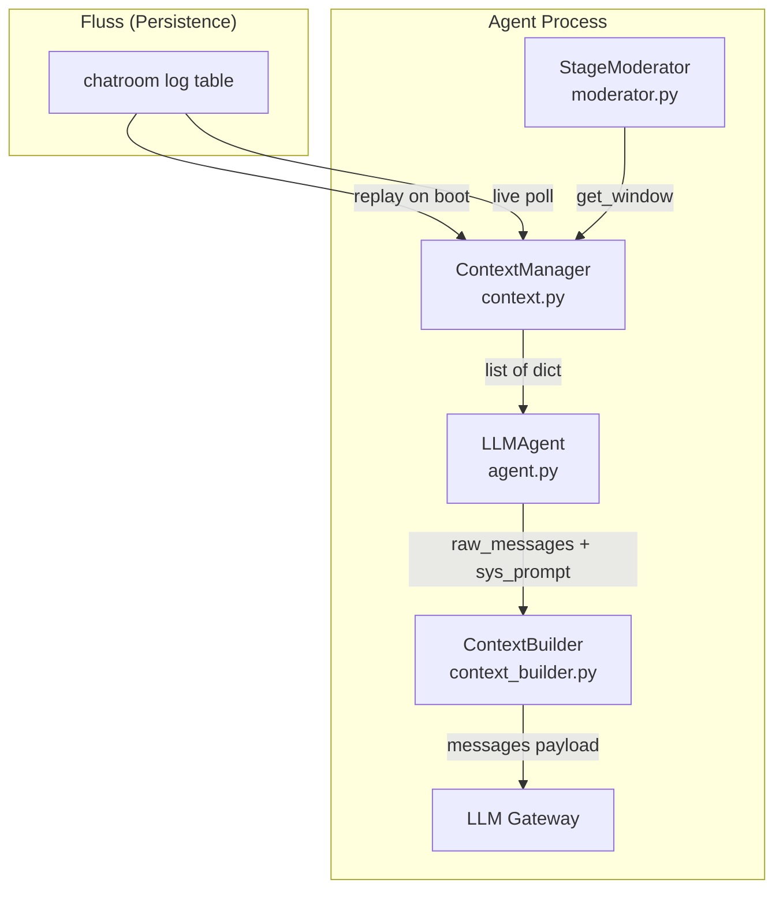
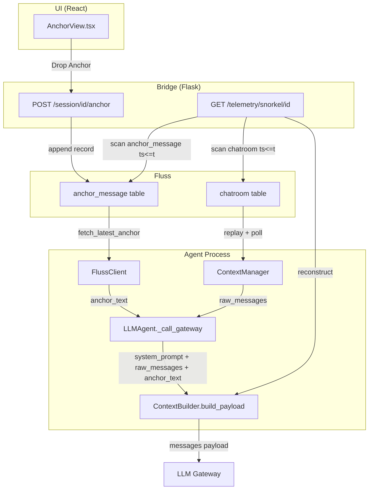

# Implementation Plan: Anchor Tab & SELF.md Integration

> Derived from exhaustive codebase analysis. All references are to actual files, functions, and line numbers in the ContainerClaw repository. Every change is defended from first principles.

---

## 0. Executive Summary

This document proposes the minimal, correct set of changes to implement:

1. **SELF.md (The Spine)**: A static, per-agent identity document prepended to the system prompt.
2. **Anchor Message**: A dynamic, human-authored steering message postpended as the final token in the context window.
3. **Snorkel Reconstruction**: Bit-perfect replay of the context window at any historical timestamp, accounting for the variable-length anchor's effect on the chat history budget.

---

## 1. First Principles: How the Context Window is Built Today

Before proposing changes, we must trace the exact path from "raw Fluss events" to "LLM inference call" and understand every variable that affects the output.

### 1.1 The Inference Call Chain

Every LLM call in the system flows through a single chokepoint:

```
agent.py:_call_gateway()  →  ContextBuilder.build_payload()  →  HTTP POST to gateway
```

Concretely, at `agent/src/agent.py:80-88`:

```python
from shared.context_builder import ContextBuilder

messages = ContextBuilder.build_payload(
    raw_messages=history,       # list[dict] from ContextManager
    config=config.CONFIG,       # ClawConfig (carries max_history_chars, max_history_messages)
    actor_id=self.agent_id,     # "Alice", "Bob", etc.
    system_prompt=sys_instr,    # Formatted prompt template from config.yaml
    extra_turns=extra_turns     # Multi-turn tool calling state (OpenAI protocol)
)
```

The `history` parameter is always `self.context.get_window()` from the moderator's `ContextManager`, called at `moderator.py:254` or `tool_executor.py:58,190`.

### 1.2 The ContextBuilder Algorithm (Current State)

At `shared/context_builder.py:7-59`, the payload is assembled with a **priority-based character budget**:

```
┌─────────────────────────────────────────────────────────┐
│  1. System Prompt (always included, budget deducted)    │  ← config.yaml template
│  2. Extra Turns (tool call state, budget deducted)      │  ← OpenAI multi-turn protocol
│  3. Chat History (reverse-chronological, fits budget)   │  ← Fluss chatroom log
└─────────────────────────────────────────────────────────┘
```

The budget calculation is:

```
Budget_total = config.max_history_chars                        # 480,000 chars
Budget_remaining = Budget_total - len(system_prompt)
Budget_remaining -= sum(len(turn.content) for turn in extra_turns)
# Then iterate history in reverse, fitting messages until budget exhausted
```

**Critical observation**: There is currently **no postpended message**. The anchor concept does not exist in the code.

### 1.3 The System Prompt Assembly

The `sys_instr` string passed to `_call_gateway` is assembled differently depending on the call site:

| Call Site | Template Used | Format Args |
|---|---|---|
| `_vote()` (L146-151) | `config.prompts.vote` | `agent_id`, `persona`, `roster` |
| `_think()` (L173-178) | `config.prompts.think` | `agent_id`, `persona` |
| `_think_with_tools()` (L189-194) | `config.prompts.think_with_tools` | `agent_id`, `persona`, `tool_names` |
| `_send_function_responses()` (L275-278) | `config.prompts.send_function_responses` | `agent_id`, `persona` |

These templates are defined in `config.yaml:46-81` and loaded via `shared/config_loader.py` into `PromptsConfig`.

**SELF.md integration point**: The `persona` field is currently a single-line string (e.g., `"Software architect."`). SELF.md would replace or augment this with a rich, multi-line identity document.

### 1.4 Where the Context Window Gets Its Messages



The `ContextManager` (`context.py:12-70`) maintains an in-memory list of all messages, deduplicating by `event_id`. The `get_window()` method returns the last `max_history_messages` entries (default 100).

The `ContextBuilder` then applies the **character budget** on top of this message-count limit, potentially truncating further.

---

## 2. The Snorkel Reconstruction Problem

### 2.1 How Snorkel Reconstructs Today

At `bridge/src/bridge.py:571-676`, the `_lookup_snorkel_perspective()` function performs a **stateless reconstruction**:

1. Scan the `chatroom` Fluss table for all events where `ts <= target_ts` and `session_id = S`.
2. Look up the agent's `persona` and `tool_set` from the **current** `config.yaml` (loaded at bridge startup).
3. Format the system prompt using the **current** `config.prompts.think_with_tools` template.
4. Call `ContextBuilder.build_payload()` with the **current** `config.max_history_chars` and `config.max_history_messages`.

### 2.2 The Existing Staleness Risk

Even without the anchor, Snorkel already has a correctness gap: if you change `max_history_chars` from 480,000 to 240,000 in `config.yaml`, **all historical reconstructions immediately use the new value**. The reconstruction becomes inaccurate for any event that occurred under the old budget.

This is acceptable today because `max_history_chars` rarely changes. But the Anchor Protocol introduces a **per-inference variable** that changes the effective budget on every "Drop Anchor" event.

### 2.3 The Anchor's Effect on the Budget

With the anchor postpended, the budget equation becomes:

```
Budget_total = max_history_chars
Budget_for_history = Budget_total - len(system_prompt) - len(anchor_text) - len(extra_turns)
```

If the anchor is 500 characters, the history gets 500 fewer characters. If the anchor is 5,000 characters, the history loses 5,000 characters — potentially dropping several messages from the visible window.

**This means**: Two inference calls at timestamps `t1` and `t2` with the same chat history but different anchor lengths will produce **different context windows**. Snorkel must reproduce this exactly.

---

## 3. Analysis: Do We Need a New Column?

### 3.1 The Reconstruction Inputs

To reconstruct the context window at timestamp $t$, Snorkel needs:

| Input | Source | Available? |
|---|---|---|
| Chat history up to $t$ | `chatroom` Fluss table | ✅ Already available |
| System prompt template | `config.yaml` → `PromptsConfig` | ⚠️ Current config only |
| `max_history_chars` | `config.yaml` → `ClawConfig` | ⚠️ Current config only |
| `max_history_messages` | `config.yaml` → `ClawConfig` | ⚠️ Current config only |
| Anchor text at $t$ | `anchor_message` Fluss table | ✅ **New table, log scan** |
| Extra turns (tool state) | Not persisted | ❌ **Not available** |

### 3.2 The Log-Only Approach (No New Column)

**Claim**: We do NOT need a `max_history_chars` column on the `anchor_message` table, because the anchor content is the only new variable, and we can recover it from the log.

**Proof**: At reconstruction time $t$, the algorithm is:

1. Scan `chatroom` for events where `session_id = S` and `ts <= t`. → **Deterministic**.
2. Scan `anchor_message` for the latest record where `session_id = S` and `ts <= t`. → **Deterministic** (append-only log, latest-wins).
3. Read `max_history_chars` and `max_history_messages` from the current config. → **Same value as at inference time, assuming config hasn't changed**.
4. Compute `ContextBuilder.build_payload(raw_messages, config, actor_id, system_prompt, anchor_text)`.

The reconstruction is **exact** if and only if `max_history_chars` has not changed between the inference event and the reconstruction request.

### 3.3 The Verdict

**For the MVP**: The log-only approach is sufficient. The `anchor_message` table records the anchor content and timestamp. Snorkel reconstructs by looking up the latest anchor at $t$ and feeding it to the same `ContextBuilder.build_payload()`.

**For Phase 2** (config versioning): If you anticipate changing `max_history_chars` frequently, you could add a `config_snapshot` column (JSON) to the `anchor_message` table that captures the budget parameters at "Drop Anchor" time. But this is over-engineering for the MVP.

**Recommendation**: Proceed without a new column. The `anchor_message` table stores `(session_id, ts, content, author)` — this is sufficient for bit-perfect reconstruction as long as `max_history_chars` is stable.

---

## 4. Architecture: The Modified Inference Pipeline

### 4.1 Data Flow with Anchor



### 4.2 The Modified ContextBuilder

The core change is to `shared/context_builder.py`. The anchor text is injected as the **absolute last message** in the payload, after all history and extra turns:

```
┌──────────────────────────────────────────────────────────────────────┐
│  1. System Prompt (role: system)                                    │  ← Spine + template
│  2. Chat History (role: user/assistant, reverse-fit to budget)      │  ← Fluss chatroom
│  3. Extra Turns (role: assistant/tool, multi-turn protocol)         │  ← Tool calling state
│  4. Anchor Message (role: user, FINAL position)                     │  ← anchor_message table
└──────────────────────────────────────────────────────────────────────┘
```

**Why last?** In transformer attention, the final tokens in the sequence have the highest influence on the next-token prediction. By placing the anchor at the absolute end, we maximize its steering effect — it is literally the last thing the model "reads" before generating.

**Budget priority**: The anchor is budgeted **before** history, alongside the system prompt:

```
budget = max_history_chars - len(system_prompt) - len(anchor_text) - len(extra_turns)
```

This means a larger anchor automatically squeezes the history window. This is the correct behavior: the operator is explicitly choosing to prioritize steering precision over historical context depth.

---

## 5. SELF.md Integration

### 5.1 What SELF.md Is

SELF.md is a per-agent static identity document. Unlike the single-line `persona` field in `config.yaml`, it contains:

- Detailed behavioral guidelines
- Domain expertise boundaries
- Communication style rules
- Safety constraints and guardrails

### 5.2 Where It Lives

SELF.md files are stored in the workspace at a conventional path:

```
/workspace/.claw/agents/{agent_name}/SELF.md
```

Or, for the MVP, as a single shared document:

```
/workspace/.claw/SELF.md
```

### 5.3 How It Integrates

SELF.md content is prepended to the system prompt. The integration point is `agent.py:_call_gateway()`, which currently formats `sys_instr` from `config.yaml` templates.

The modified flow:

```python
# In agent.py:_call_gateway() — conceptual
spine = self._load_spine()  # Read SELF.md from disk or cache
sys_instr_with_spine = spine + "\n\n" + sys_instr
```

The `ContextBuilder.build_payload()` receives this combined string as `system_prompt`. The budget deduction already accounts for `len(system_prompt)`, so a larger spine naturally compresses the history window.

### 5.4 Caching Strategy

SELF.md is static for the lifetime of a session. It should be read once at agent initialization (in `main.py:_init_moderator()`) and cached on the `LLMAgent` instance:

```python
agent.spine = Path("/workspace/.claw/SELF.md").read_text() if Path("/workspace/.claw/SELF.md").exists() else ""
```

---

## 6. Detailed Change Specification

### 6.1 `agent/src/schemas.py` — New Table Schema

**Rationale**: Follow the existing pattern of defining all Fluss schemas in one file.

```python
# ── Anchor Message Table ────────────────────────────────────────────
# Append-only log of human steering directives.
# Latest record per session is the "active" anchor.
# Bucket key: session_id
ANCHOR_MESSAGE_SCHEMA = pa.schema([
    pa.field("session_id", pa.string()),
    pa.field("ts", pa.int64()),               # ms timestamp of when anchor was dropped
    pa.field("content", pa.string()),          # The anchor message text
    pa.field("author", pa.string()),           # Which operator set it (for audit)
])
ANCHOR_MESSAGE_TABLE = "anchor_message"
```

**Why no `max_history_chars` column?** See Section 3. The budget parameters are stable config values. If they change, it's a config deployment event — not an anchor drop. We can version configs separately if needed in Phase 2.

---

### 6.2 `agent/src/fluss_client.py` — Table Bootstrap & Fetch

**Changes**:

1. Import the new schema and table name constants.
2. Add `self.anchor_table` initialization in `connect()` (after `self.status_table`, line 74).
3. Implement `fetch_latest_anchor(session_id)` — scan the anchor log and return the latest content.

**`fetch_latest_anchor` implementation**:

The `anchor_message` table is an append-only log. To find the "latest" anchor for a session, we must scan all records with `session_id = S` and return the one with the highest `ts`. This is O(n) over the anchor log, but the log is expected to be small (humans anchor infrequently — tens to low hundreds of records per session).

```python
async def fetch_latest_anchor(self, session_id: str) -> str:
    """Return the content of the most recent anchor_message for a session.
    
    Returns empty string if no anchor has been set.
    """
    scanner = await self.create_scanner(self.anchor_table)
    latest_ts = -1
    latest_content = ""
    empty_polls = 0
    while empty_polls < 5:
        batches = await self.poll_async(scanner, timeout_ms=500)
        if not batches:
            empty_polls += 1
            continue
        empty_polls = 0
        for batch in batches:
            sid_arr = batch["session_id"]
            ts_arr = batch["ts"]
            content_arr = batch["content"]
            for i in range(batch.num_rows):
                if sid_arr[i].as_py() != session_id:
                    continue
                ts = ts_arr[i].as_py()
                if ts > latest_ts:
                    latest_ts = ts
                    content = content_arr[i].as_py()
                    latest_content = content.decode("utf-8") if isinstance(content, bytes) else str(content)
    return latest_content
```

**Performance concern**: This full-scan approach is acceptable because:
- Anchor drops are infrequent (human operator action).
- The table is small.
- This is called once per inference cycle, not in a hot loop.

For Phase 2, a Fluss PK table keyed by `(session_id)` with CDC scanning would provide O(1) lookups. But the current Fluss Python SDK doesn't support CDC scanning on PK tables (noted in `schemas.py:29-30`), so we use a log table.

---

### 6.3 `shared/context_builder.py` — Anchor Injection

**This is the most critical change.** The `build_payload` function must:

1. Accept an optional `anchor_text` parameter.
2. Deduct `len(anchor_text)` from the budget **before** fitting history.
3. Append the anchor as the **final message** in the payload.

**Modified function signature**:

```python
@staticmethod
def build_payload(
    raw_messages: list[dict],
    config: ClawConfig,
    actor_id: str,
    system_prompt: str,
    extra_turns: list[dict] | None = None,
    anchor_text: str = "",          # NEW
) -> list[dict]:
```

**Modified budget calculation**:

```python
budget = config.max_history_chars - len(system_prompt) - len(anchor_text)
# ... existing extra_turns deduction ...
# ... existing history fitting loop ...
messages_payload.extend(final_history)
messages_payload.extend(extra)

# Anchor is ALWAYS the final message
if anchor_text:
    messages_payload.append({"role": "user", "content": f"[ANCHOR — Operator Directive]: {anchor_text}"})
```

**Why `role: "user"`?** The anchor represents a human directive. Using `"system"` would merge it with the system prompt at the start of the sequence, defeating the purpose of postpending. Using `"user"` places it as the final conversational turn the model responds to.

**Backward compatibility**: `anchor_text=""` (default) produces zero budget deduction and no appended message. All existing call sites work unchanged.

---

### 6.4 `agent/src/agent.py` — Wiring the Anchor Fetch

**Problem**: `_call_gateway` is a sync-style method that doesn't have access to the `FlussClient`. The `FlussClient` is owned by the `StageModerator` / `AgentService`, not the `LLMAgent`.

**Solution**: Pass the anchor text as a parameter, not by making the agent fetch it. The moderator (which owns the `FlussClient`) fetches the anchor and passes it down.

**Change to `_call_gateway`**:

```python
async def _call_gateway(self, sys_instr, history, is_json=False,
                         tools=None, tool_choice=None,
                         extra_turns=None, anchor_text=""):    # NEW param
    from shared.context_builder import ContextBuilder

    messages = ContextBuilder.build_payload(
        raw_messages=history,
        config=config.CONFIG,
        actor_id=self.agent_id,
        system_prompt=sys_instr,
        extra_turns=extra_turns,
        anchor_text=anchor_text,                                # NEW
    )
    # ... rest unchanged ...
```

**Propagation**: `_think_with_tools`, `_vote`, `_think`, `_send_function_responses`, and `_reflect` all call `_call_gateway`. They each need an `anchor_text` parameter threaded through. This is mechanical but necessary.

Alternatively, set `self.anchor_text` on the `LLMAgent` instance from the moderator before each execution cycle. This avoids changing every method signature:

```python
# In moderator.py, before election/execution:
for agent in self.agents:
    agent.anchor_text = await self.fluss.fetch_latest_anchor(self.session_id)
```

Then in `_call_gateway`:

```python
anchor = getattr(self, 'anchor_text', "")
messages = ContextBuilder.build_payload(..., anchor_text=anchor)
```

**Why this approach?** It's less invasive. The anchor is a session-level concern, not a per-call concern. Setting it once per cycle on the agent instance is correct because the anchor doesn't change mid-inference.

---

### 6.5 `agent/src/moderator.py` — Fetch Before Each Cycle

**Where**: In the main loop at line 238, before the election starts (line 258), fetch the latest anchor and set it on all agents:

```python
# Line ~253, after context_window = self.context.get_window()
anchor_text = await self.fluss.fetch_latest_anchor(self.session_id)
for agent in self.agents:
    agent.anchor_text = anchor_text
```

This ensures every agent in the election and execution cycle operates with the same anchor text. The fetch is once per cycle, not once per agent.

---

### 6.6 `bridge/src/bridge.py` — Anchor Write Endpoint & Snorkel Update

#### 6.6.1 POST `/session/<session_id>/anchor`

New endpoint for the UI to write anchor updates:

```python
@app.route("/session/<session_id>/anchor", methods=["POST"])
def set_anchor(session_id):
    data = request.json or {}
    content = data.get("content", "")
    author = data.get("author", "operator")
    try:
        _run_async(_write_anchor(session_id, content, author))
        return {"status": "ok"}
    except Exception as e:
        return {"status": "error", "message": str(e)}, 500


async def _write_anchor(session_id, content, author):
    table = await _get_table("anchor_message")
    if table is None:
        raise Exception("anchor_message table not available")
    
    import pyarrow as pa
    batch = pa.RecordBatch.from_arrays([
        pa.array([session_id], type=pa.string()),
        pa.array([int(time.time() * 1000)], type=pa.int64()),
        pa.array([content], type=pa.string()),
        pa.array([author], type=pa.string()),
    ], schema=ANCHOR_MESSAGE_SCHEMA)
    
    writer = table.new_append().create_writer()
    writer.write_arrow_batch(batch)
    if hasattr(writer, "flush"):
        await writer.flush()
```

#### 6.6.2 GET `/session/<session_id>/anchor`

Read the current anchor for display in the UI:

```python
@app.route("/session/<session_id>/anchor")
def get_anchor(session_id):
    try:
        content = _run_async(_fetch_latest_anchor_bridge(session_id))
        return {"status": "ok", "content": content}
    except Exception as e:
        return {"status": "error", "message": str(e)}, 500
```

#### 6.6.3 Snorkel Reconstruction Update

At `bridge.py:669-674`, the `_lookup_snorkel_perspective()` function must also fetch the historical anchor and pass it to `ContextBuilder.build_payload()`:

```python
# After events are collected and sorted (line 650):
anchor_text = await _fetch_anchor_at_timestamp(session_id, target_ts_ms)

perspective = ContextBuilder.build_payload(
    raw_messages=events,
    config=CONFIG,
    actor_id=actor_id,
    system_prompt=sys_prompt,
    anchor_text=anchor_text,        # NEW
)
```

The `_fetch_anchor_at_timestamp()` function scans the `anchor_message` log for the latest record where `ts <= target_ts_ms` — identical logic to `fetch_latest_anchor` but with a temporal bound.

---

### 6.7 UI Changes

#### 6.7.1 `ui/src/App.tsx` — New Tab

At line 16, update the `TabId` union type:

```typescript
type TabId = 'chatroom' | 'explorer' | 'dag' | 'metrics' | 'snorkel' | 'anchor';
```

Add the tab button in the tab bar (after Snorkel, ~line 272) and the content renderer (after SnorkelView, ~line 309):

```tsx
{activeTab === 'anchor' && (
  <AnchorView sessionId={activeSessionId} events={events} />
)}
```

#### 6.7.2 `ui/src/components/AnchorView.tsx` — New Component

Two-pane layout:
- **Top pane**: Last N messages from `events` prop (already available from the SSE stream).
- **Bottom pane**: Textarea bound to the current anchor, fetched via `GET /session/{id}/anchor`.
- **Template dropdown**: Populated from a static list (or from config in Phase 2).
- **"Drop Anchor" button**: `POST /session/{id}/anchor` with the textarea content.

#### 6.7.3 `ui/src/api.ts` — New API Functions

```typescript
export const fetchAnchor = async (sessionId: string): Promise<string> => { ... };
export const setAnchor = async (sessionId: string, content: string): Promise<void> => { ... };
```

---

## 7. Snorkel Reconstruction: Formal Derivation

Given:
- Session $S$
- Target timestamp $t$ (the event being inspected)
- Agent $A$ (the actor who generated the event)

The reconstructed context window $W(S, t, A)$ is computed as:

$$W(S, t, A) = \text{ContextBuilder.build\_payload}(R, C, A, P(A), \emptyset, \alpha(S, t))$$

Where:
- $R = \{r \in \text{chatroom} \mid r.\text{session\_id} = S \wedge r.\text{ts} \le t\}$, sorted by `ts` ascending
- $C = \text{ClawConfig}$ (current config — assumed stable)
- $P(A) = \text{format}(\text{config.prompts.think\_with\_tools}, A.\text{id}, A.\text{persona}, A.\text{tools})$
- $\alpha(S, t) = \max_{r \in \text{anchor\_message}} \{r.\text{content} \mid r.\text{session\_id} = S \wedge r.\text{ts} \le t\}$

The budget constraint is:

$$|P(A)| + |\alpha(S,t)| + \sum_{m \in H} |m| \le C.\text{max\_history\_chars}$$

Where $H \subseteq R$ is the subset of history messages that fit within the remaining budget after deducting the system prompt and anchor.

**Key insight**: The only new lookup is $\alpha(S, t)$ — a temporal scan of the `anchor_message` log. All other inputs are identical to the current reconstruction. The `ContextBuilder.build_payload()` function, with the new `anchor_text` parameter, produces the exact same result whether called live (by the agent) or in reconstruction (by Snorkel). This is because the function is **pure** — it has no side effects or hidden state.

---

## 8. Risk Analysis

### 8.1 Config Drift (Pre-existing)

If `max_history_chars` changes between inference and reconstruction, the replay is inaccurate. This risk exists today and is not introduced by the anchor. Mitigation for Phase 2: config versioning.

### 8.2 Extra Turns Not Persisted

The `extra_turns` parameter (multi-turn tool calling state) is not persisted to Fluss. This means Snorkel cannot reconstruct the exact context for mid-tool-loop inferences. This is a pre-existing gap unrelated to the anchor.

### 8.3 Anchor Scan Performance

The `anchor_message` log is scanned in full for each reconstruction. For sessions with many anchor drops, this could be slow. Mitigation: the anchor log is expected to be small (human-operated, not automated).

---

## 9. File Change Summary

| File | Change Type | Description |
|---|---|---|
| `agent/src/schemas.py` | MODIFY | Add `ANCHOR_MESSAGE_SCHEMA`, `ANCHOR_MESSAGE_TABLE` |
| `agent/src/fluss_client.py` | MODIFY | Bootstrap `anchor_table`, add `fetch_latest_anchor()` |
| `shared/context_builder.py` | MODIFY | Add `anchor_text` param, budget deduction, postpend logic |
| `agent/src/agent.py` | MODIFY | Thread `anchor_text` through `_call_gateway()` |
| `agent/src/moderator.py` | MODIFY | Fetch anchor per cycle, set on agents |
| `bridge/src/bridge.py` | MODIFY | New endpoints, update Snorkel reconstruction |
| `ui/src/App.tsx` | MODIFY | Add `'anchor'` to `TabId`, render `AnchorView` |
| `ui/src/api.ts` | MODIFY | Add `fetchAnchor()`, `setAnchor()` |
| `ui/src/components/AnchorView.tsx` | NEW | Two-pane anchor control component |
| `config.yaml` | MODIFY | Add `anchor_templates` under `ui:` section |

### SELF.md Changes (Separate from Anchor):

| File | Change Type | Description |
|---|---|---|
| `agent/src/main.py` | MODIFY | Read SELF.md at agent init, cache on `LLMAgent` |
| `agent/src/agent.py` | MODIFY | Prepend `self.spine` to `sys_instr` in `_call_gateway` |
| `bridge/src/bridge.py` | MODIFY | Read SELF.md for Snorkel reconstruction |

---

## 10. Implementation Order

1. **`schemas.py`** → Define the schema (no runtime effect).
2. **`fluss_client.py`** → Bootstrap the table and implement fetch.
3. **`context_builder.py`** → Add `anchor_text` parameter (backward-compatible default).
4. **`agent.py`** → Thread anchor through `_call_gateway`.
5. **`moderator.py`** → Fetch and inject per cycle.
6. **`bridge.py`** → Endpoints + Snorkel update.
7. **`AnchorView.tsx` + `api.ts` + `App.tsx`** → UI.
8. **SELF.md** → Agent init + Snorkel.
9. **`config.yaml`** → Anchor templates.

Each step is independently testable. Steps 1-5 can be verified by running the agent and checking logs for anchor injection. Step 6 can be verified via curl. Step 7 is a UI-only change.
