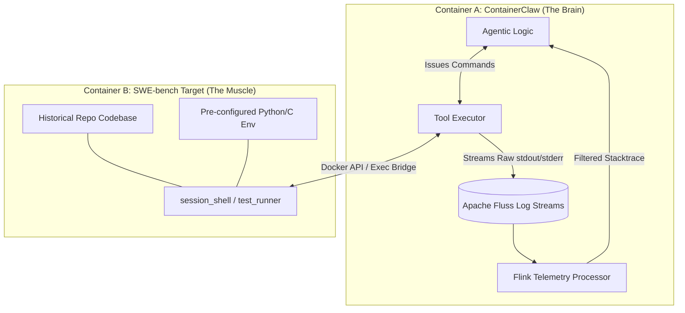

## Architecture Review: The SWE-bench Sidecar Pattern

### 1. First Principles & The Theoretical Limit

To design an optimal evaluation architecture, we must break the problem down to its fundamental physics. The objective is to generate a valid Git patch to resolve a specific issue. 

The theoretical limit (the "speed of light" for this system) is dictated by three factors:
1.  **Token Generation Speed:** The inference latency of the underlying LLM.
2.  **I/O Latency:** The time it takes to read a file, apply a change, and execute a test.
3.  **Context Density:** The ratio of useful information (stack traces, specific code lines) to noise (pip install logs, test harness output) in the context window.

Suboptimal design choices, such as forcing an agent to natively configure its own Python environment or blocking synchronous execution on a 10-minute test suite, artificially inflate I/O latency and destroy Context Density. 

By strictly adhering to a **Separation of Concerns**, we push the system toward its physical limits. The agent framework must be an isolated, high-throughput orchestrator (The Brain). The target repository must be a disposable, pre-configured execution sandbox (The Muscle). The communication between them should be limited strictly to the speed of the local Docker bridge network (sub-millisecond I/O).

### 2. Compare & Contrast: Existing Paradigms vs. The Sidecar

#### The Standard SWE-bench Paradigm (Monolithic)
In the default SWE-bench evaluation harness, the agent logic and the target repository are often tightly coupled or executed via standard synchronous subprocesses. 
* **The Flaw:** When `runtests.py` fails, it dumps 15,000 lines of `stdout`. A synchronous wrapper waits for the process to terminate, captures the entire string, and feeds it back to the agent. This blows out the context window, causing hallucination or truncation. It treats bash output as a static string rather than a stateful stream.

#### The ContainerClaw Paradigm (Sidecar + Telemetry)
The Sidecar pattern physically isolates the framework from the target. The agent operates in a pristine environment. When it calls a tool, the framework translates that into a remote execution command.
* **The Advantage:** Instead of capturing standard output synchronously, the framework intercepts the raw bytes across the Docker bridge and pipes them directly into a real-time observability layer (Apache Fluss/Flink). The telemetry layer filters the noise, aggregates the stack traces, and returns a high-density summary to the agent.

### 3. System Architecture Diagram



### 4. Implementation Details & Defended Code Changes

To transition to this architecture, modifications are required at the Tool Executor layer and the Orchestration layer. 

#### A. Orchestration (`scripts/swe_bench/workspace_setup.py`)
Currently, you need to spin up the agent container. Now, the setup must orchestrate a *pair* of containers per evaluation instance.

**Code Change:** Update the workspace setup to pull and run the specific SWE-bench image (e.g., `sweb.eval.x86_64.django_10097`) alongside the ContainerClaw container. They must share a Docker network.
**Defense:** We cannot build the environment dynamically. SWE-bench provides pre-compiled images with the correct historical dependencies. Pulling the image guarantees environment determinism. Placing them on the same Docker bridge network ensures network I/O latency between the containers is on the order of microseconds, adhering to our speed-of-light constraints.

#### B. Tool Executor Overhaul (`agent/src/tool_executor.py`)
The `session_shell`, `view_file`, `edit_file`, and `run_tests` tools must no longer execute locally.

**Code Change:** Refactor `session_shell` to use the Docker SDK (e.g., `docker.APIClient().exec_create()` and `exec_start()`). 
```python
# Conceptual Implementation
def execute_remote_shell(container_id: str, command: str, fluss_topic: str):
    exec_id = docker_client.exec_create(container=container_id, cmd=command, tty=False)
    output_stream = docker_client.exec_start(exec_id, stream=True)
    
    # Asynchronous generator pushing directly to telemetry
    for chunk in output_stream:
        fluss_client.produce(topic=fluss_topic, payload=chunk)
```
**Defense:** Blocking on a subprocess run is a critical failure point. By utilizing Docker's streaming API, the `tool_executor` immediately hands the raw byte stream off to the Apache Fluss topic. This prevents memory bloat in the Python process and allows Flink to begin processing the telemetry (stripping ANSI codes, truncating repetitive loops) while the tests are still running.

#### C. The Test Harness Wrapper (`scripts/swe_bench/sitecustomize.py` / `tools.py`)
Agents struggle to know the specific test command for 500 different repositories.

**Code Change:** Provide a high-level `run_instance_tests()` tool to the agent. This tool looks up the `test_cmd` from the SWE-bench manifest for the current instance and injects it into the remote shell.
**Defense:** The agent's cognitive load should be spent on synthesizing code patches, not deciphering the undocumented testing architecture of a 2018 repository. Abstracting the test trigger maximizes the agent's focus on the actual diff generation.

### 5. Conclusion

Implementing the sidecar pattern transforms the agent from a frustrated system administrator into a focused software engineer. By routing the target container's chaotic `stdout`/`stderr` through a robust, stream-centric observability pipeline, the framework ensures the agent's context window remains dense with actionable telemetry rather than flooded with dependency warnings. This architectural split is precisely what enables high-fidelity performance scaling across the SWE-bench verified benchmark.