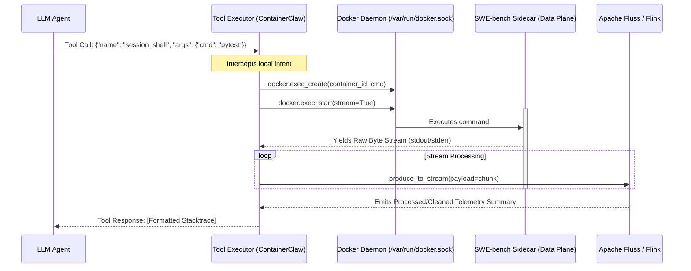

## Architecture Review: The Watertight Abstraction & Dynamic Enclaves

### 1. First Principles: The Control Plane vs. The Data Plane

In distributed systems, the speed of light (and bounded compute resources) dictates that a system must separate its orchestration logic from its execution workloads to prevent cascading failures. 

If an autonomous agent operates within the exact same OS process and environment as the untrusted, historical code it is modifying, it violates the principle of **Fault Isolation**. 
* **Dependency Collision:** Modern asynchronous frameworks (like the ContainerClaw agent, Apache Fluss clients, and gRPC) cannot coexist in the same Python namespace as a deprecated 2019 Django environment. Forcing them to share a container guarantees unresolvable pip conflicts.
* **Process Fragility:** If a test harness triggers a segmentation fault or a memory leak (OOM), it kills the container. If the agent lives in that container, its brain dies with the code.

By separating the system into a **Control Plane** (ContainerClaw Workspace) and a **Data Plane** (SWE-bench Sidecar), we achieve theoretical maximums for stability. The agent survives the catastrophic failure of the environment it is testing.

### 2. The Abstraction Illusion: VS Code Remote-SSH Mental Model

To maximize the agent's "Context Density" (the ratio of useful reasoning tokens to meta-instructional noise), the agent must **not** be aware of the container orchestration. 

Prompting the LLM to "manage a remote Docker sidecar" burns valuable tokens and forces the model to synthesize network routing logic rather than Python patches. Instead, the framework provides a watertight illusion: the agent believes it is operating locally. 

#### Sequence Diagram: The Tool Execution Bridge


### 3. Implementation Plan & Code Defenses

To achieve this without blocking the main event loop, we must modify the execution layer to proxy commands over the Docker socket and pipe them directly into the log streams.

#### A. Orchestration Upgrades (`docker-compose.swebench.yml` & `workspace_setup.py`)
The execution harness must dynamically provision the Data Plane network.

**Proposed Changes:**
1. Mount the host's Docker socket into the ContainerClaw agent container: `-v /var/run/docker.sock:/var/run/docker.sock`.
2. The `workspace_setup.py` script pulls the specific SWE-bench image and attaches it to the same Docker bridge network as ContainerClaw.

**Exhaustive Defense:**
Network latency over a Docker bridge (veth pairs) is sub-millisecond, adhering to our speed-of-light constraints. Mounting the Docker socket grants ContainerClaw orchestration privileges (acting as the Control Plane) without requiring "Docker-in-Docker" (DinD), which is historically unstable and introduces massive storage driver overhead.

#### B. Tool Executor Refactor (`agent/src/tool_executor.py`)
Tools like `session_shell`, `edit_file`, and `run_tests` must be rewritten as proxies.

**Proposed Changes:**
Instead of `subprocess.run()`, utilize the `docker` Python SDK to stream output dynamically into Apache Fluss.

```python
import docker
from shared.fluss_client import produce_to_stream

docker_client = docker.from_env()

def execute_remote_shell(command: str, target_container_id: str, fluss_topic: str):
    """
    Executes command in the isolated Data Plane and streams telemetry to the Control Plane.
    """
    exec_log = docker_client.api.exec_create(
        container=target_container_id,
        cmd=["/bin/bash", "-c", command],
        tty=False
    )
    
    output_stream = docker_client.api.exec_start(
        exec_id=exec_log['Id'],
        stream=True
    )
    
    # Speed-of-light constraint: Do not hold bytes in memory. 
    # Immediately flush to the Fluss telemetry layer.
    for chunk in output_stream:
        produce_to_stream(topic=fluss_topic, payload=chunk)
```

**Exhaustive Defense:**
Using `subprocess.run()` is synchronous and inherently vulnerable to hanging on interactive prompts (e.g., `git log` pagination). By leveraging `exec_start(stream=True)`, the Tool Executor becomes completely non-blocking. It delegates the responsibility of handling massive 10,000-line test outputs to the Flink telemetry layer. This prevents the Python process from encountering memory exhaustion and protects the agent's context window from blowing out.

### 4. Generalizing for the Enterprise: Dynamic Tool Sandboxes

While this architecture solves the immediate SWE-bench requirements, it naturally extends ContainerClaw into an enterprise-grade framework.

By abstracting the target in the `tool_executor`, ContainerClaw can treat sidecars as ephemeral, on-demand compute enclaves. Instead of a monolithic 15GB base image containing Python, Node.js, Java, and Terraform, the agent can issue a `request_sandbox(runtime="node:18")` command. 

ContainerClaw acts as the ultimate stream-centric orchestrator—spinning up secure, isolated execution environments, proxying the agent's commands into them, and filtering the resulting chaos through its telemetry pipelines before the agent ever sees it.