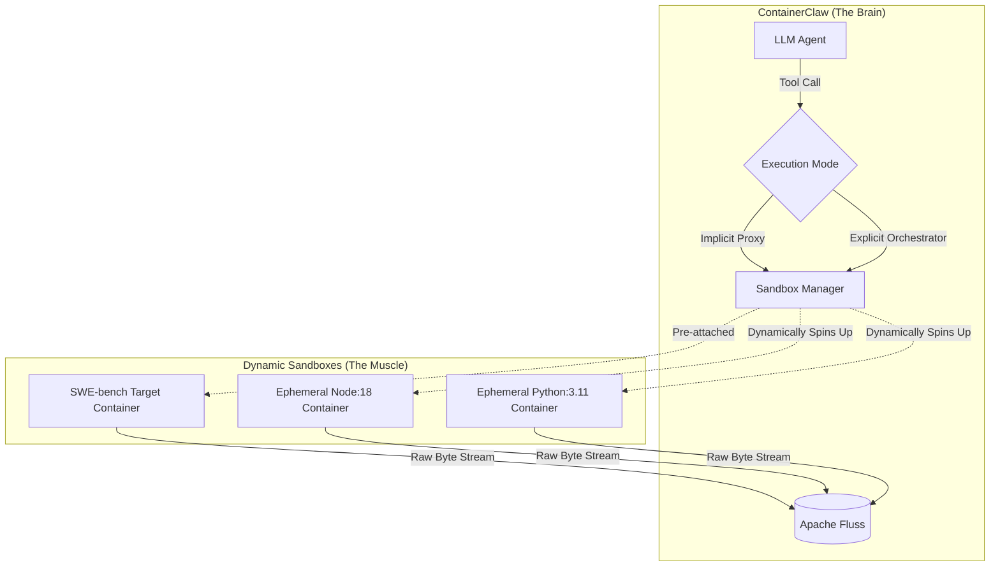

## Architecture Review: Generalizing Dynamic Enclaves & The Awareness Continuum

While the SWE-bench evaluation requires a strict "Implicit Proxy" pattern (where the agent is unaware of the sidecar), an enterprise deployment of ContainerClaw requires dynamic, polyglot execution. 

To bridge this gap without bifurcating the codebase, the framework must treat sidecars not as a hardcoded SWE-bench hack, but as a generalized **Dynamic Tool Sandbox System**. The critical architectural dial is the agent's **Contextual Awareness**.

### 1. The Awareness Continuum: Configurable Abstraction

We control the agent's perception of the execution environment via a configuration flag in the agent's profile (e.g., `execution_mode: "implicit_proxy" | "explicit_orchestrator"`).

#### Mode A: Implicit Proxy (The "Unaware" Agent)
* **Mechanism:** The agent believes it is running locally. Standard tools like `session_shell` or `edit_file` are seamlessly intercepted and routed to a pre-defined, static target container.
* **Primary Use Case (Legacy Auditing / Benchmarks):** SWE-bench. If an agent is tasked with fixing a 2019 Django bug, making it aware of Docker networking burns reasoning tokens. It must act as a pure software engineer operating within a single assumed OS.
* **Blast Radius:** The agent cannot create new sandboxes; it is locked into the single environment provided by the `workspace_setup.py` orchestrator.

#### Mode B: Explicit Orchestrator (The "Aware" Agent)
* **Mechanism:** The agent is fully aware it is a control plane orchestrator. It is stripped of local `session_shell` access. Instead, it is granted a higher-order tool: `execute_in_sandbox(runtime_image: str, command: str)`.
* **Primary Use Case (Enterprise Polyglot Pipelines):** A data engineering agent tasked with an end-to-end pipeline. It might need to run a Python script to pull data, an `npm` script to build a dashboard, and a Terraform plan to deploy infrastructure.
* **Blast Radius:** The agent dynamically provisions ephemeral containers. Each action occurs in a perfectly isolated, purpose-built runtime that self-destructs upon completion. 

### 2. Architectural Diagram: The Sandbox Router

The `ToolExecutor` acts as a router. Depending on the configuration, it either proxies implicitly or provisions dynamically, but *always* routes the raw standard output back through the Apache Fluss telemetry layer.



### 3. Code Implementation: The Sandbox Manager

To achieve this elegantly, the `tool_executor.py` must be upgraded. We introduce a `SandboxManager` that handles the Docker daemon interactions, and we adapt the tools based on the active configuration.

**Refactoring `agent/src/tool_executor.py`:**

```python
import docker
import uuid
from shared.fluss_client import produce_to_stream
from agent.src.config import get_agent_config

docker_client = docker.from_env()

class SandboxManager:
    def __init__(self):
        self.config = get_agent_config()
        # In SWE-bench mode, this is populated by workspace_setup.py
        self.default_target = self.config.get("DEFAULT_TARGET_CONTAINER_ID")

    def stream_execution(self, container_id: str, command: str, topic: str):
        """Speed-of-light boundary: streams bytes directly to Fluss without blocking."""
        exec_log = docker_client.api.exec_create(
            container=container_id, cmd=["/bin/bash", "-c", command], tty=False
        )
        stream = docker_client.api.exec_start(exec_id=exec_log['Id'], stream=True)
        for chunk in stream:
            produce_to_stream(topic=topic, payload=chunk)

    def execute_implicit(self, command: str, topic: str):
        """Used for SWE-bench (Unaware Mode). Routes to the static sidecar."""
        if not self.default_target:
            raise RuntimeError("Implicit execution requested but no target attached.")
        self.stream_execution(self.default_target, command, topic)

    def execute_explicit(self, image: str, command: str, topic: str):
        """Used for Enterprise (Aware Mode). Provisions ephemeral sandboxes."""
        sandbox_id = f"sandbox-{uuid.uuid4().hex[:8]}"
        
        # Provision an ephemeral, network-isolated container
        container = docker_client.containers.run(
            image=image,
            name=sandbox_id,
            detach=True,
            tty=True,
            network_mode="none", # Strict isolation constraint
            mem_limit="512m"     # Compute constraint
        )
        try:
            self.stream_execution(container.id, command, topic)
        finally:
            # Enforce ephemeral lifecycle
            container.remove(force=True)

# ---------------------------------------------------------
# Dynamic Tool Bindings provided to the LLM
# ---------------------------------------------------------
sandbox_manager = SandboxManager()

def session_shell(command: str, topic: str):
    """
    Tool schema provided if execution_mode == 'implicit_proxy'
    The agent thinks this runs locally.
    """
    sandbox_manager.execute_implicit(command, topic)

def execute_in_sandbox(image: str, command: str, topic: str):
    """
    Tool schema provided if execution_mode == 'explicit_orchestrator'
    The agent explicitly defines the runtime.
    """
    sandbox_manager.execute_explicit(image, command, topic)
```

### 4. Defense of the Design

1.  **Single Unified Pipeline:** By routing both implicit and explicit executions through `stream_execution()`, the downstream telemetry processors (Flink) do not need to know *where* the logs came from. The observation pipeline remains perfectly uniform.
2.  **Strict Lifecycle Management:** In Explicit Mode, the `finally` block guarantees that enterprise sidecars are destroyed immediately after use. This prevents zombie containers from suffocating the host system's compute limits during multi-agent orchestration.
3.  **Adaptive Context Density:** By making the awareness configurable at the router level, the LLM system prompt can be radically simplified. We eliminate the need for complex prompt engineering (e.g., "If you are on task A, pretend you are local, but on task B, use docker"). The framework structurally enforces the correct cognitive paradigm for the given task.