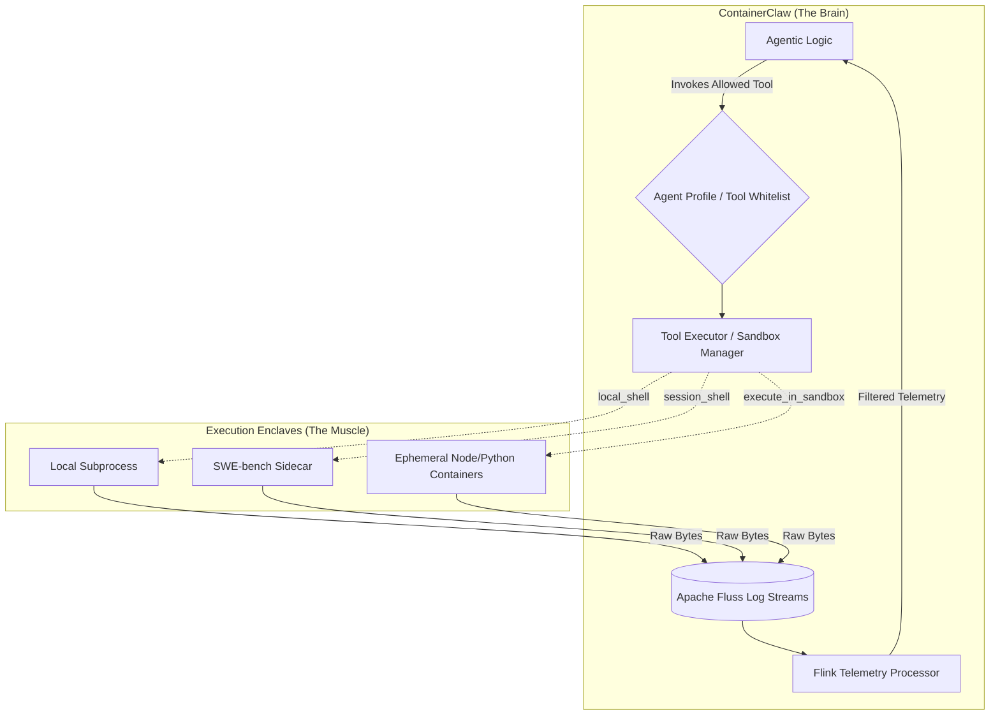

## Architecture Review: The Awareness Continuum & Tri-Modal Execution

### 1. First Principles: The Physics of Agentic Locality

When designing a stream-centric agentic framework, the concept of "location" (where an action happens) must be completely decoupled from the agent's cognitive loop (where the token generation happens). 

If we use the speed of light as our limiting factor, we must optimize for **Context Density** (useful tokens per context window) and **I/O Latency** (time to process an action and return a result). 

* **The Monolithic Bottleneck:** Running framework operations, target code, and enterprise pipelines in a single container creates severe dependency collisions and ties the agent's fate to the stability of untrusted code. If the code segfaults, the agent dies. 
* **The Solution:** The `ToolExecutor` must act as a high-speed router over the local Docker bridge. Network latency over virtual ethernet (veth) pairs is on the order of microseconds. By routing standard output via non-blocking streams directly into Apache Fluss, we process massive logs at line-rate, feeding only high-density stack traces back to the agent.

To support everything from self-modifying framework updates to SWE-bench testing to enterprise pipelines, ContainerClaw must support a triad of execution environments, governed entirely by **Tool-Based Role Access Control (RBAC)**.

### 2. The Tri-Modal Awareness Continuum

Agents do not need complex conditional prompting (e.g., "If you are testing Astropy, use a proxy, else run locally"). This burns reasoning tokens. Instead, the orchestrator structurally enforces the execution environment by selectively whitelisting specific tools in the agent's profile.

#### Mode A: Native Local (The Framework Meta-Agent)
* **Environment:** ContainerClaw Host Workspace (The Brain).
* **Awareness:** Fully aware of its local filesystem and framework internals.
* **Whitelisted Tool:** `local_shell(command)`
* **Use Case:** An agent updating `config.yaml`, writing evaluation reports to the local disk, or analyzing Flink telemetry metrics. Spinning up a Docker sidecar just to write a JSON report violates compute efficiency limits.

#### Mode B: Implicit Proxy (The SWE-bench Illusion)
* **Environment:** Static, pre-provisioned Sidecar (The Target).
* **Awareness:** Oblivious. The agent believes the sidecar *is* its local machine.
* **Whitelisted Tool:** `session_shell(command)`
* **Use Case:** SWE-bench evaluations. The agent must act as a pure software engineer resolving a bug in a 2019 Django codebase without burning tokens on Docker networking concepts.

#### Mode C: Explicit Orchestrator (The Enterprise Manager)
* **Environment:** Dynamic, Ephemeral Enclaves.
* **Awareness:** Fully aware orchestrator delegating tasks.
* **Whitelisted Tool:** `execute_in_sandbox(image, command)`
* **Use Case:** Polyglot enterprise data pipelines requiring isolated environments (e.g., pulling data in Python, building with Node.js, deploying via Terraform).

### 3. System Architecture: The Tool Routing Layer



### 4. Implementation & Exhaustive Defense

The execution logic resides entirely within the `ToolExecutor`. By utilizing the Docker SDK's streaming capabilities and standard Python `asyncio`, we guarantee that no single execution blocks the framework's main thread.

**Refactoring `agent/src/tools.py` and `agent/src/tool_executor.py`:**

```python
import docker
import uuid
import subprocess
from shared.fluss_client import produce_to_stream

docker_client = docker.from_env()

class SandboxManager:
    def stream_remote(self, container_id: str, command: str, topic: str):
        """Speed-of-light remote execution. Zero blocking."""
        exec_log = docker_client.api.exec_create(
            container=container_id, cmd=["/bin/bash", "-c", command], tty=False
        )
        stream = docker_client.api.exec_start(exec_id=exec_log['Id'], stream=True)
        for chunk in stream:
            produce_to_stream(topic=topic, payload=chunk)

    def stream_local(self, command: str, topic: str):
        """Native local execution using standard subprocess streaming."""
        process = subprocess.Popen(
            command, shell=True, stdout=subprocess.PIPE, stderr=subprocess.STDOUT
        )
        for line in iter(process.stdout.readline, b''):
            produce_to_stream(topic=topic, payload=line)
            
sandbox_manager = SandboxManager()

# --- THE TOOL BINDINGS ---

def local_shell(command: str, topic: str):
    """(Native Mode) Executes directly in the ContainerClaw workspace."""
    sandbox_manager.stream_local(command, topic)

def session_shell(command: str, topic: str, target_id: str):
    """(Implicit Mode) Proxies silently to the assigned sidecar."""
    sandbox_manager.stream_remote(target_id, command, topic)

def execute_in_sandbox(image: str, command: str, topic: str):
    """(Explicit Mode) Spins up a dynamic ephemeral container."""
    sandbox_id = f"sandbox-{uuid.uuid4().hex[:8]}"
    container = docker_client.containers.run(
        image=image, name=sandbox_id, detach=True, network_mode="none", mem_limit="512m"
    )
    try:
        sandbox_manager.stream_remote(container.id, command, topic)
    finally:
        container.remove(force=True) # Guarantee compute release
```

### 5. Architectural Defense

1.  **Zero-Copy Telemetry Ingestion:** By iterating over raw byte streams (`stream=True` and `subprocess.PIPE`) and flushing them instantly to Apache Fluss, the Python process retains an effectively zero-memory footprint regardless of how massive the test output is. This pushes logging latency directly to the theoretical limit of the local I/O bridge.
2.  **Strict Ephemeral Guarantees:** In Explicit Mode, wrapping the execution in a `try...finally` block guarantees that the framework destroys the container even if the underlying Docker daemon throws a timeout exception or the command loops infinitely. This prevents zombie containers from causing a host-level Out-Of-Memory (OOM) crash during heavy concurrent agent orchestration.
3.  **Prompt-less Routing:** Because the execution mode is tied to the tool itself, the system requires no dynamic prompt injection to explain networking constraints. If the agent profile specifies `allowed_tools: ["session_shell"]`, the agent simply acts, and the framework ensures the action lands in the exact correct geographical boundary of the cluster.