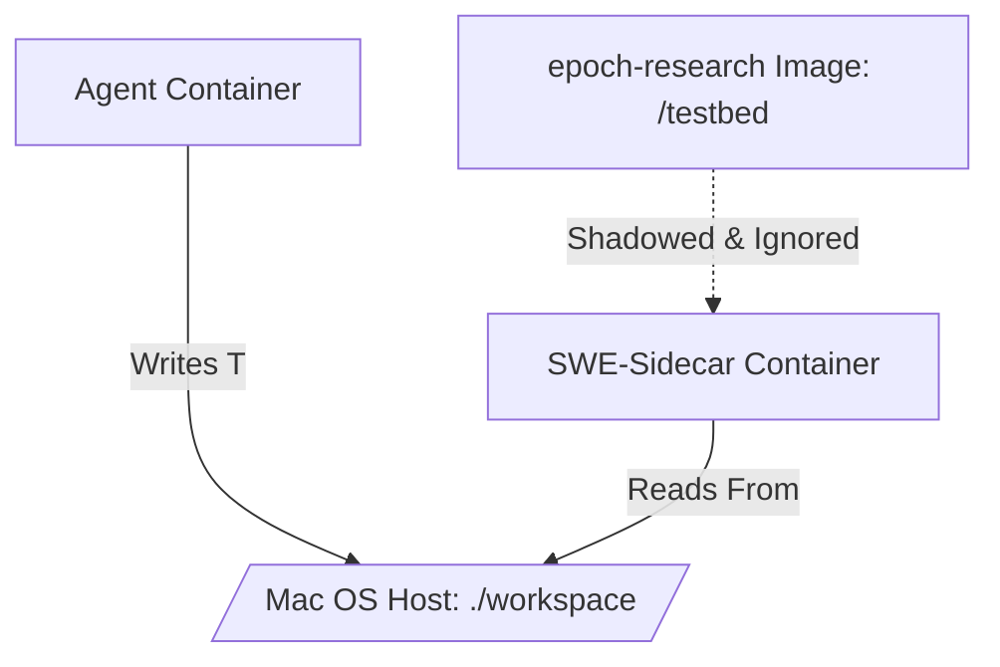

# ContainerClaw Architecture: The Shared-Volume Mirage

This document provides an exhaustive, first-principles breakdown of the ContainerClaw multi-agent workflow during a SWE-bench evaluation pass. We focus heavily on the mechanics of containerization, mount overshadowing, and inter-process state coherence.

## 1. System Initiation: `claw.sh up --bench`

When the user initiates the system via the lifecycle script with the `--bench` flag, they are performing an orchestration cascade that alters the default security profile of the system.

### The Security Privilege Escalation
In `claw.sh` (Lines 17-25), parsing the `--bench` flag performs strict privilege escalation.
- `export CLAW_USER="root"`
- `export CONCHSHELL_ENABLED="true"`
- `export SWE_BENCH_MODE="true"`
- `COMPOSE_FILES="$COMPOSE_FILES -f docker-compose.swebench.yml"`

**Why Root?** The Agent (`claw-agent`) requires the ability to mount the host's `/var/run/docker.sock` (defined in the `docker-compose.swebench.yml` overlay) to act as an explicit orchestrator. Interacting with the Docker daemon socket requires `root` privileges unless explicitly configured with complex group mappings (which break portability). 

### The Resulting Docker Graph
The stack completes its boot with these components wired together via the `internal` Docker network:
1.  **Coordinator Server & Zookeeper:** The Fluss messaging backend.
2.  **Tablet Server:** The storage layer.
3.  **LLM Gateway:** The translation layer out to Gemini/OpenAI.
4.  **Claw-Agent (Alice/Bob/Carol):** Running as `root`, connected to the Docker daemon, with a bind mount from the Mac Host (`./workspace`) mapped to `/workspace` internally.

At this point, the system is entirely idle. It is waiting for a stimulus to create a "Session".

## 2. Triggering Evaluation: `run.py`

The command executed is:
```bash
python scripts/swe_bench/run.py \
  --instance astropy__astropy-12907 \
  --dataset princeton-nlp/SWE-bench_Verified \
  --timeout 300
```
This is **Phase 1** of SWE-bench evaluation: Generating the prediction. grading is done entirely separately in Phase 2.

### Step 2A: The Instructional Check
In `run.py` (Line 341), the script first pings the Bridge API (`http://localhost:5001/health`). This verifies that the `claw.sh up --bench` command successfully established the `claw-agent` and its gRPC endpoints.

### Step 2B: The Workspace "Seed" Problem
Line 328 invokes `setup_workspace(instance, workspace_dir)` from `workspace_setup.py`.

Because `config.yaml` dictates `execution_mode: "implicit_proxy"`, the setup routes to `setup_sidecar()`.
The sidecar process executed via the Docker Python SDK is:
1. Pull the official SWE-bench environment image: `ghcr.io/epoch-research/swe-bench.eval.x86_64.astropy__astropy-12907`.
2. Connect it to the `containerclaw-net` network.
3. Keep it alive with `sleep infinity`.

**The Bind-Mount Shadowing Bug (The "Murkiness"):**
Wait, didn't the sidecar `docker-compose.swebench.yml` run a bind mount mapping the host's `./workspace` over the sidecar's `/workspace` directory? 

Yes. And this exposes a **design regression.**
In a proper SWE-bench environment, the `epoch-research` image *already has* the repository cloned perfectly inside it (usually at `/testbed`). However, `setup_workspace.py` fails to populate the host's `./workspace` before launching the sidecar.

If the sidecar is launched via Docker explicitly (as requested), and the agent binds to the host workspace, **the Agent sees an empty folder.** The pre-baked repository is *shadowed* (hidden) by the empty host mount.

### Step 2C: Booting the Reconciler
`run.py` submits an HTTP post to `/sessions/new`.
It then submits a "Warmup Ping" to trigger the `ReconciliationController` in the Agent service. The Agent begins polling the Fluss log.

## 3. Execution: The Transparent Proxy

A session is established, and the `StageModerator` announces "Multi-Agent System Online." `run.py` submits the `astropy` bug report.

Alice (The Agent) reads the Bug Report. She sees her system prompt (`SELF.md` + Tool Definitions). 
Every tool explicitly declares: *"You are working in `/workspace`."*

Alice decides to execute a bash command:
Let's trace `ToolDispatcher -> session_shell.execute() -> SandboxManager.execute()`.

### The Proxy Route (Implicit Proxy)
`SandboxManager.execute` inspects its mode: `implicit_proxy`.
It ignores Alice's local container environment entirely. It issues a `docker exec` API call **into the SWE-Sidecar**.

```python
exec_log = self.client.api.exec_create(
    container="swe-sidecar",
    cmd=["/bin/sh", "-c", "ls -l /workspace"],
)
```

1. **The Tool Execution:** The Agent process asks Docker to run a command inside the sidecar.
2. **The VFS Redirection:** The sidecar processes the command. If it attempts to write a file (e.g., `git apply fix.patch`), the Linux Kernel Virtual File System (VFS) in the sidecar recognizes `/workspace` is a bind mount. It proxies the I/O back to the Mac Host's SSD.
3. **The Loop closes:** The streaming output is pumped back via Docker's API, published to the Fluss log, and eventually streamed to your terminal.

## 4. The Extraction: Pulling the Diff

After 300 seconds (or when Alice calls the system complete), `run.py` calls `extract_patch(workspace_dir)`.

Because of the architectural choice to use **Shared Bind Mounts**, `run.py` does not need to use `docker exec` to fetch files out of the running sidecar. The files were written directly to the Mac Host via the VFS redirection described above.

```python
# run.py executes this on the host:
subprocess.run(["git", "diff", "--cached", "HEAD"], cwd="./workspace")
```
It writes `predictions.jsonl`, tears down the sidecar, and exits.

---

## Architectural Review: The Missing Seed

The E2E workflow is logically sound *if* the host workspace is populated. But as the user observed, the Sidecar doesn't inherently push its pre-baked files to the Host workspace. 

### Diagram: The Current "Shadowed" Failure Point



If we don't fix `workspace_setup.py`, the Agent begins executing against an empty directory. 

### The Required Mitigation
To complete the system design, `setup_workspace()` MUST force a host-side `git clone` of the repository, even when using the Sidecar, so that the shared mount is populated with the correct code before the Agent starts reading it.

*See `workspace_setup.py:48`: `setup_local_workspace` must be executed to "seed" the host volume for the VFS proxy to work correctly, even in `implicit_proxy` mode.*
