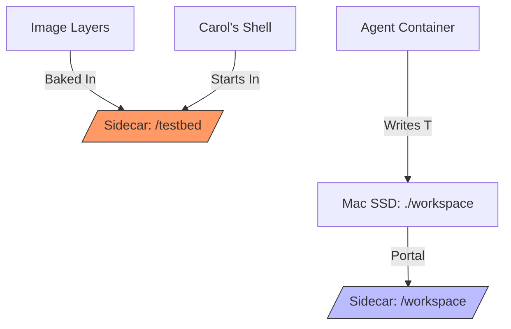
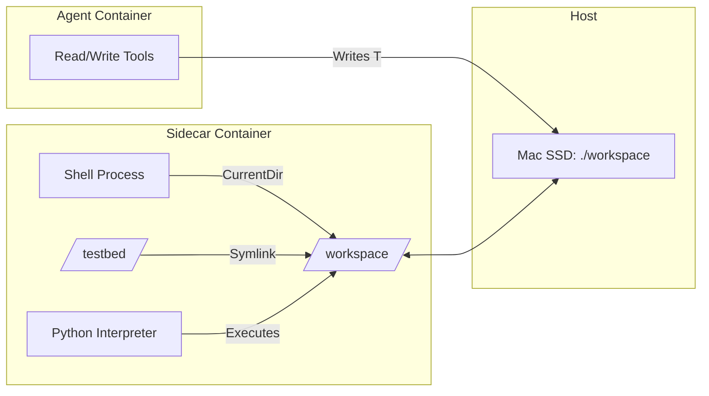

# ContainerClaw Architecture: Unifying the Split-Brain Workspace

This document provides a first-principles derivation of the "Shared Volume Mirage" and the architectural mitigations required to synchronize a multi-container agent system.

## 1. First Principles: The Space-Time Constraint of Repositories

In a distributed agent system, the "Speed of Light" limiting factor for developer velocity is **State Coherence**. 

If Agent A (the brain) and Sidecar S (the execution environment) have separate copies of a repository (e.g. via `docker cp` or network sync), any edit made by A must be propagated to S. This introduces latency (O(N) file size) and "Split-Brain" risk where A and S are looking at different versions of reality.

**The Solution:** The **Shared Volume (VFS Proxy)**. By bind-mounting a single host directory into both containers, we achieve "Instantaneous" propagation. Information doesn't move; the Virtual File System (VFS) simply maps two different virtual addresses to the same physical bits on the Mac SSD.

## 2. The Geometry of Confusion: The "Two Rooms" Problem

A Docker container is not a "blank slate"; it is a layered file system. 

### The Image Layer (The "Original Furniture")
The `epoch-research` sidecar image contains a pre-baked repository at `/testbed`. These bits are immutable and isolated from the host.

### The Mount Layer (The "New Portal")
We mount the Mac's `./workspace` to `/workspace` inside the sidecar. This creates a **Dual-Identity Space**. Inside the container, there are now two copies of the "same" code:
1.  `/testbed`: Internal, static, and "dead" to the host.
2.  `/workspace`: External, live, and "mirrored" to the host.

### Diagram: The Disconnected Reality

In the failure state observed in the logs, the Agent wrote its fix to the **Live Portal** (`/workspace`), but her shell commands (Carol) were dropping into the **Baked Foyer** (`/testbed`).

## 3. Architectural Defense: Unifying the Virtual Space

To solve this without sacrificing the modularity of either the sidecar or the agent, we implemented three distinct mitigations.

### A. Context Injection (`sandbox.py`)
**Change:** Forced `workdir=config.WORKSPACE_ROOT` in `exec_create`.
**Defense:** Instead of allowing the sidecar image to dictate the Foyer (`WORKDIR /testbed`), the infrastructure forces the agent's shell to land in the Portal room (`/workspace`). This ensures that Alice's "writes" and Carol's "reads" happen in the same virtual path, targeting the same host-mapped bits.

### B. Host VFS Seeding (`workspace_setup.py`)
**Change:** Execute `setup_local_workspace` even in Sidecar mode.
**Defense:** Because a bind-mount **shadows** the internal directory (an empty host folder hides the baked images), we "Seed" the host before the sidecar boots. This ensures the Shared Volume is rich with code before the portal is even opened.

### C. The Compatibility Wormhole (Symlink)
**Change:** `ln -s /workspace /testbed`.
**Defense:** Many internal SWE-bench scripts have the path `/testbed` hardcoded into their logic. By creating a symlink, we allow these legacy scripts to continue functioning while secretly redirecting their I/O to our shared Mac portal.

## 4. Final Coherent State: The Unified Flow

With these changes, the system achieves **Zero-Latency State Coherence.**

### Result:
When the Agent runs `python reproduce_issue.py`, the shell starts in `/workspace`, finds the file written by the Host-connected tool, and executes against the "Live" bits. Cohesive reality is achieved, and the "Split-Brain" is healed.
