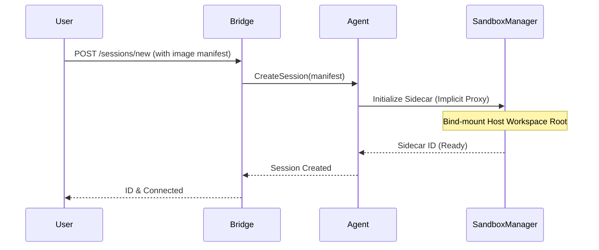
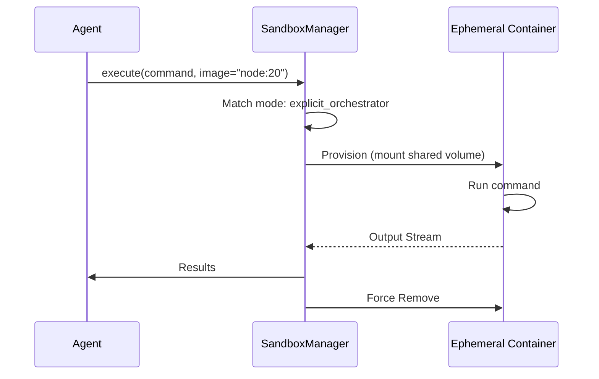
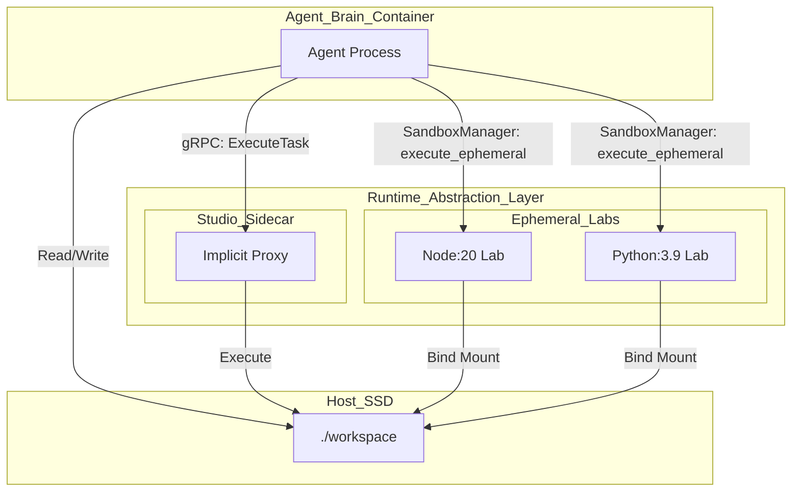
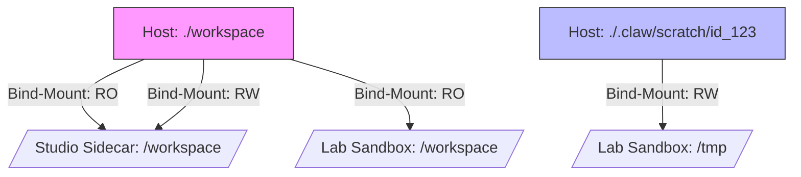

# ContainerClaw Architecture: The Dual-Gated Execution Abstraction

This document provides a first-principles derivation of the **Dynamic Execution Environment**, a system design that allows for both user-specified workspace parity and agent-autonomous task isolation.

## 1. First Principles: The Velocity of State Coherence

In any distributed developer ecosystem, the fundamental limiting factor is not the CPU clock speed, but the **Latency of State Coherence**. If the "Brain" (the Agent) and the "Brawn" (the Execution Environment) do not share an identical, zero-latency view of the file system, the system enters a "Split-Brain" state where commands are executed against stale bits.

The "Speed of Light" constraint here dictates that we cannot afford to synchronize files across container boundaries using network protocols or `docker cp`. Therefore, the **Shared Volume Mirage** must be the universal constant: a single physical directory on the host SSD mapped into every virtual space.

## 2. The Awareness Continuum: From Studio to Lab

The execution architecture is categorized by the **Awareness Continuum**, which defines how the infrastructure routes commands:

1.  **The Studio (Implicit Proxy / Sidecar):** A long-lived, high-parity environment defined by the user. It represents the "Production-like" space where the agent spends 90% of its time.
2.  **The Lab (Explicit Orchestrator / Ephemeral):** Short-lived, task-specific containers spun up by the agent to isolate high-risk operations or test multi-version compatibility.

## 3. Architectural Design: Dual-Gated Provisioning

We implement a dual-gated system to balance user control with agentic autonomy.

### A. Gate 1: User-Driven Session Manifest
The human user defines the primary environment during session initialization. This is handled at the `bridge` layer.

* **Logic:** The user provides an image or Dockerfile path.
* **Defense:** This ensures **Environmental Parity**. The user knows the project's requirements (e.g., specific OS headers for Apache Fluss bindings). By allowing the user to specify this, we avoid the agent wasting cycles attempting to "fix" a broken environment that simply lacked the correct base image.

### B. Gate 2: Agent-Driven Task Isolation
The `SandboxManager` provides an abstraction for the agent to escalate execution into a separate container.

* **Logic:** The agent can trigger `execute_ephemeral(image, command)`.
* **Defense:** This provides **Failure Isolation**. If the agent needs to run a destructive cleanup script or verify a build on a different Python version, it can spin up a "Lab" container without corrupting the "Studio" sidecar's state.

## 4. Mermaid Derived Logic

### Session Initialization (User-Driven)

### Task Execution (Agent-Driven Ephemeral)

## 5. Defense of Code Changes

### Path Invariance in `execute_remote`
**Implementation:** Every execution call in `sandbox.py` must explicitly set `workdir=config.WORKSPACE_ROOT`.
**Defense:** If the Agent writes to `./src/main.py` on the host, the `execute_remote` call must land in the same virtual path regardless of whether it's the User's "Studio" or the Agent's "Lab". Without this, the agent would lose track of its own edits when switching containers.

### Lazy-Loading the Docker Client
**Implementation:** The `client` property in `SandboxManager` is only initialized upon a container-based tool call.
**Defense:** This preserves **Native Fallback**. If the user is running a simple local session without Docker installed, the agent can still operate in `native` mode without the bridge crashing on startup.

### Decoupling Sidecar Config from Agent State
**Implementation:** `config.py` acts as a thin wrapper that sources the `sidecar_config` from the central `config.yaml`.
**Defense:** This allows the `bridge` to dynamically update the `default_target_id` per session without requiring a re-deployment of the agent binary. It transforms the sidecar from a "hardcoded dependency" into a "pluggable resource".

-------

# ContainerClaw Architecture: The Runtime Abstraction Layer (RAL)

This document derives the transition from a static sidecar implementation to a generalized **Runtime Abstraction Layer (RAL)**. We move beyond the "Split-Brain" fix for specific benchmarks toward a first-principles architecture for multi-tier agentic execution.

## 1. First Principles: The Coherence-Latency Tradeoff

In any distributed developer ecosystem, the fundamental limit to velocity is **State Coherence**. The "Speed of Light" constraint manifests here as the time required to synchronize a file change between the "Thinking" entity (Agent) and the "Executing" entity (Runtime).

* **Network Sync (The Slow Path):** Using `docker cp` or `rsync` introduces $O(N)$ latency where $N$ is the repository size. This creates a temporal gap where the Agent's mental model of the code is "ahead" of the Runtime's physical state.
* **The Shared Volume Mirage (The Zero-Latency Path):** By mapping two virtual addresses (Container A and Container B) to the same physical bits on the host SSD, the synchronization time is effectively zero. Coherence is instantaneous because there is only one source of truth.

## 2. The Architectural Defect: Static Over-Specialization

The current implementation of `SandboxManager` is "hard-wired" for the `implicit_proxy` mode with a single `default_target_id`. This creates two failure modes in generalized usage:
1.  **Environment Rigidity:** A human user cannot easily swap the execution environment (e.g., from a Python sidecar to a Rust sidecar) without manual config edits.
2.  **Task Pollution:** If an Agent needs to run a destructive test or an incompatible library, it must do so in the primary sidecar, risking the "Studio" environment's integrity.

## 3. The Solution: The Runtime Continuum Abstraction

We propose a dual-layer execution model that separates the **Developer Studio** from the **Testing Lab**.

### A. The "Studio" (Primary Sidecar)
The user defines a long-lived environment where the Agent "lives." This environment is initialized via a **Runtime Manifest** (Dockerfile or Image) provided at session creation.
* **Defense:** This maintains the "Shared Volume Mirage" for the duration of the session, allowing the user to use a local IDE (Cursor/VS Code) on the same bits the Agent is manipulating.

### B. The "Lab" (Ephemeral Sandboxes)
The Agent is granted the autonomy to spin up "child" containers via the `explicit_orchestrator` mode for isolated tasks.
* **Defense:** This allows for agentic workflow optimization. An Agent can verify its work against multiple versions (e.g., testing a library against both Python 3.9 and 3.11) without polluting the "Studio."

## 4. Defending the Code Transformation

### I. SandboxManager Evolution
The `SandboxManager` must be refactored to treat the `default_target` not as a static ID, but as a session-scoped resource.
* **Change:** Replace `self.default_target = self.sidecar_config.default_target_id` with a registry lookup.
* **Defense:** This allows the `bridge.py` to provision a specific sidecar for a specific user session without cross-session interference.

### II. The gRPC Manifest Protocol
The `CreateSession` gRPC call must be expanded.
* **Change:** Add `string runtime_image` to `CreateSessionRequest`.
* **Defense:** This empowers the human user to dictate the "Law of the Land." If a user is working on a C++ project, they can pass `gcc:latest`, and the RAL ensures the Agent's shell is immediately context-aware of that environment.

### III. Tool-Driven Orchestration
Agents must be given a `provision_env` tool.
* **Change:** Expose the `execute_ephemeral` logic through the `tools.py` interface.
* **Defense:** This removes the bottleneck of human intervention. If the Agent recognizes a task requires a specific database version for a smoke test, it can orchestrate its own "Lab" environment, execute the test against the shared `WORKSPACE_ROOT`, and collect results without affecting the primary "Studio".

## 5. Result: Zero-Latency State Coherence

By standardizing the `WORKSPACE_ROOT` across all layers of the continuum, we achieve a **Unified Reality**. Whether a command runs in the user's "Studio" or the Agent's "Lab," it always points to the same physical bits. The "Split-Brain" is not just healed; it is replaced by a multi-faceted, coherent execution engine.

------------

This draft formalizes the **Runtime Abstraction Layer (RAL)** and addresses your critical observations regarding **Namespace Collisions** and **Human-Agent Collaboration** on environment manifests.

---

# draft_pt22_pt6.md: The Runtime Abstraction Layer (RAL)

## 1. First Principles: The Speed of Light as a Constraint
In a multi-agent system, the "Speed of Light" is the latency of **Coherence**. If an Agent writes code in Container A and must execute it in Container B, any synchronization mechanism that isn't a Virtual File System (VFS) mapping introduces $O(N)$ delay. 

ContainerClaw utilizes the **Shared Volume Mirage** to achieve zero-latency coherence. However, as the system moves from a single static sidecar to a generalized RAL, we encounter two secondary constraints:
1.  **Spatial Collision:** Multiple execution contexts writing to the same physical bits.
2.  **Intent Injection:** The need for humans to define the "Law of the Land" (the environment) while Agents orchestrate the "Science" (the tests).

## 2. Collision Mitigation: The "Namespaced Artifact" Pattern
You correctly identified that a single shared `/workspace` leads to naming conflicts (e.g., multiple `pytest` runs overwriting the same `.pyc` or log files). 

### The Solution: Overlay Mounting
We refine the `SandboxManager` to implement a "Shared Source, Private Sink" geometry:
* **Shared Root:** The host `./workspace` is mounted as **Read-Only** or **Shared Source** in ephemeral containers.
* **Namespaced Scratchpad:** Each ephemeral container is assigned a unique `sandbox_id`. A specific subfolder, `./workspace/.claw/scratch/<sandbox_id>`, is bind-mounted to the container's internal `/output` or used as the `TMPDIR`.

## 3. Human Intent: The "Environment Manifest" Registry
To allow humans to "choose" configurations, ContainerClaw adopts a standardized **Manifest Registry** within the project itself.

### The Convention: `.claw/runtimes/`
* **Location:** Human users place `Dockerfile` or `docker-compose.override.yml` files in a `.claw/runtimes/` directory at the root of the workspace.
* **Selection:** The `bridge.py` is updated to expose a `/runtimes` endpoint, allowing the UI to list available environments.
* **Agent Awareness:** Agents are informed via their system prompt that they can "upgrade" their session by switching the `implicit_proxy` target to one of these human-provided manifests.

## 4. Architectural Defense: Why This Evolution?

### I. SandboxManager (Ephemerality vs. Persistence)
The current `execute_ephemeral` implementation in `sandbox.py` creates a container and runs a command.
* **Defense:** By adding namespacing, we prevent a "Dirty Build" state where a failed ephemeral test leaves broken binaries that crash the primary "Studio" environment.

### II. Bridge.py (The Configuration Portal)
The `bridge.py` currently loads a unified `CONFIG`. 
* **Defense:** We must extend the `CreateSession` gRPC request to include a `runtime_profile` key. This allows the human to specify, at the moment of creation, whether the session is a "Rust-High-Performance" environment or a "Python-Data-Science" environment, rather than relying on a static `default_target_id`.

### III. The "Shared Volume Mirage" as the Anchor
Standardizing on `config.WORKSPACE_ROOT` across all `exec_create` calls ensures that the Agent's "mental map" of the file system never shifts, even if the underlying container does.

---

## 5. Summary Table: RAL Execution Matrix

| Mode | Target | Lifetime | VFS Geometry | Use Case |
| :--- | :--- | :--- | :--- | :--- |
| **Native** | Local Mac | Persistent | Native SSD | Internal Log Meta-tasks |
| **Implicit Proxy** | Studio Sidecar | Session-long | Full RW Bind-mount | Primary Dev / Human-Agent Pairing |
| **Explicit Orchestrator**| Lab Sandbox | Task-only | RO Source + Unique RW Scratch | Isolated Testing / Matrix Verification |

The RAL allows the system to scale from a single "Split-Brain" fix to a **Runtime Continuum** where the environment is as fluid as the code itself, yet always anchored to a coherent physical reality.

---

**Follow-up:** Should the `implicit_proxy` sidecar be automatically restarted if it crashes, or should the Agent have a `repair_environment` tool to handle sidecar health?