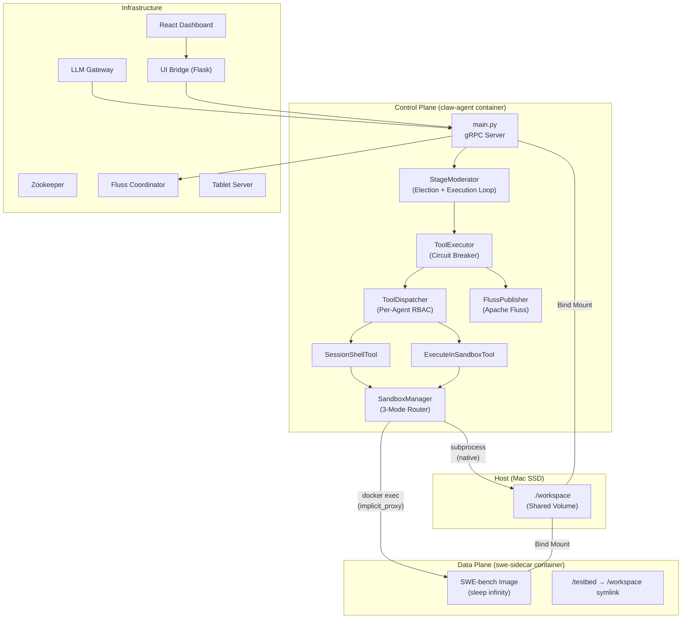
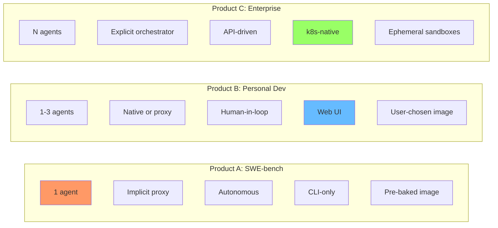
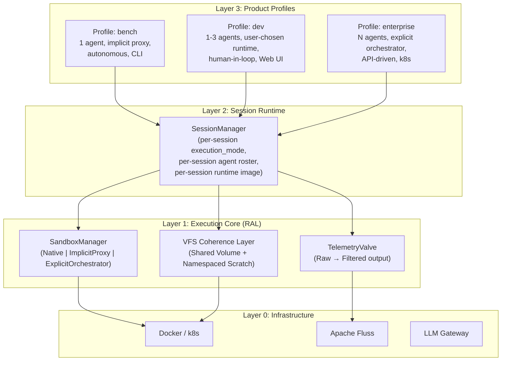
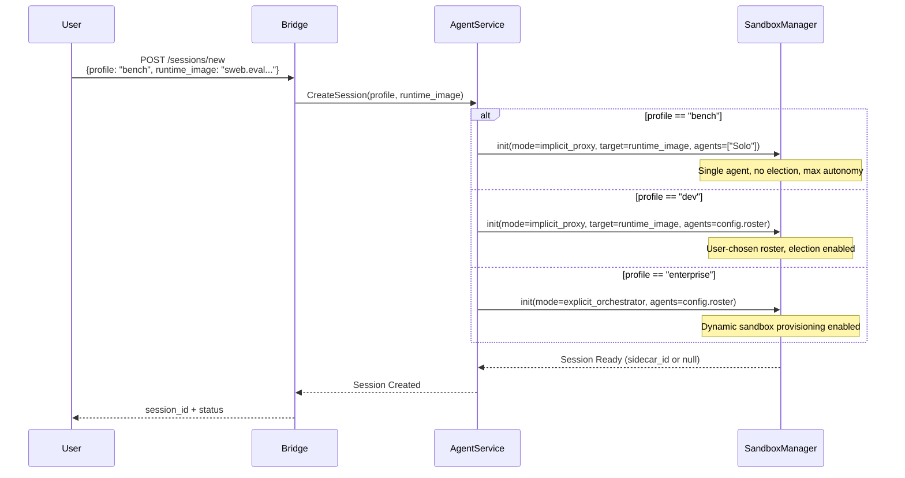

# ContainerClaw Architecture: A First-Principles Reconciliation

> **Scope:** This document synthesizes the entire `draft_pt22` series (pt1–pt6, including the continuum addendum) against the actual implementation as of commit `067ae58`. It performs a rigorous system design review, identifies the core product identity crisis, and derives the optimal path forward from first principles.

---

## 1. The Situation: Seven Drafts, Three Products, One Codebase

The `draft_pt22` series documents an accelerating scope expansion:

| Document | Focus | Key Concept Introduced |
|:---|:---|:---|
| `draft_pt22` | SWE-bench sidecar pattern | Brain/Muscle separation, Docker bridge I/O, Fluss telemetry routing |
| `draft_pt22_pt2` | Watertight abstraction | Control Plane / Data Plane, VS Code Remote-SSH illusion, Docker socket mounting |
| `draft_pt22_pt3` | Awareness Continuum (Bi-Modal) | Implicit Proxy vs. Explicit Orchestrator, `SandboxManager`, Tool-Based RBAC |
| `draft_pt22_pt3_continuum` | Tri-Modal execution | Added Native Local mode, tri-modal tool routing |
| `draft_pt22_pt4` | Shared Volume Mirage | Mount shadowing bug, VFS proxy, `/testbed` symlink, workspace seeding |
| `draft_pt22_pt5` | Split-Brain workspace fix | Dual-identity space, Context Injection (`workdir`), host VFS seeding |
| `draft_pt22_pt6` | Runtime Abstraction Layer (RAL) | Studio/Lab duality, Dual-Gated provisioning, Namespaced Artifacts, `.claw/runtimes/` manifest |

Each document is individually coherent. But when taken together, they reveal **three distinct products** competing for the same codebase:

### Product A: SWE-bench Evaluation Harness
- **User:** Researcher running benchmarks
- **Need:** Fully autonomous, headless, one agent per instance, implicit proxy, pre-baked environment images
- **UX:** CLI-only (`run.py --instance django__django-11133`)

### Product B: Personal AI Dev Assistant (OpenClaw / Hermes Agent)
- **User:** Individual developer pairing with an AI
- **Need:** Simple setup, one agent, human-in-the-loop, IDE-like experience, local or Docker
- **UX:** Web dashboard (`http://localhost:3000`), possibly VS Code extension

### Product C: Enterprise Multi-Agent Orchestrator
- **User:** Platform team deploying AI agents at scale
- **Need:** Multi-tenant, k8s-native, RBAC, ephemeral sandboxes, polyglot runtimes, audit trails
- **UX:** API-first, GitOps configuration, observability dashboards

**The core problem:** The current implementation conflates all three into a single execution path, creating friction for each persona.

---

## 2. What Actually Exists (Commit `067ae58`)

Before proposing changes, we must establish ground truth. Here is a precise inventory of the sidecar-related implementation:

### 2.1 Implemented Components



### 2.2 File-by-File Inventory

| File | Role | Status |
|:---|:---|:---|
| [`sandbox.py`](file:///.../containerclaw/agent/src/sandbox.py) | `SandboxManager` — 3-mode execution router | ✅ Implemented: `execute_local`, `execute_remote`, `execute_ephemeral` |
| [`tools.py`](file:///.../containerclaw/agent/src/tools.py) | `SessionShellTool` + `ExecuteInSandboxTool` | ✅ Implemented, routes through `SandboxManager` |
| [`tool_executor.py`](file:///.../containerclaw/agent/src/tool_executor.py) | Tool loop with circuit breaker | ✅ Implemented, publishes telemetry chunks to Fluss |
| [`workspace_setup.py`](file:///.../containerclaw/scripts/swe_bench/workspace_setup.py) | SWE-bench sidecar provisioning | ✅ Implemented: `setup_sidecar()`, host seeding, `/testbed` symlink |
| [`run.py`](file:///.../containerclaw/scripts/swe_bench/run.py) | SWE-bench CLI harness | ✅ Implemented: single + batch mode, prediction extraction |
| [`claw.sh`](file:///.../containerclaw/claw.sh) | Lifecycle manager with `--bench` flag | ✅ Implemented: root escalation, Docker socket mount, compose overlay |
| [`docker-compose.swebench.yml`](file:///.../containerclaw/docker-compose.swebench.yml) | SWE-bench compose overlay | ✅ Implemented: root user, Docker socket, workspace bind mount |
| [`config.yaml`](file:///.../containerclaw/config.yaml) | Central config | ✅ Has `execution_mode`, `sidecar_config` — but **global**, not per-session |
| [`config_loader.py`](file:///.../containerclaw/shared/config_loader.py) | Pydantic validation | ✅ Has `SidecarConfig` model |

### 2.3 What Is Missing (Proposed but NOT Implemented)

| Proposed Feature | Source Draft | Implementation Status |
|:---|:---|:---|
| Per-session `runtime_image` in `CreateSession` gRPC | pt6 | ❌ Not implemented |
| `.claw/runtimes/` manifest registry | pt6 | ❌ Not implemented |
| `/runtimes` bridge endpoint for UI | pt6 | ❌ Not implemented |
| Namespaced scratch volumes for ephemeral containers | pt6 | ❌ Not implemented |
| Shared volume bind-mount in `execute_ephemeral` | pt3/pt6 | ❌ **Critical bug** — ephemeral containers cannot see `/workspace` |
| Sidecar health monitoring / auto-restart | pt6 follow-up | ❌ Not implemented |
| `repair_environment` agent tool | pt6 follow-up | ❌ Not implemented |
| Agent-driven `provision_env` tool | pt6 | ❌ Not implemented (only `execute_in_sandbox` exists, no volume mounts) |

---

## 3. First-Principles Speed-of-Light Analysis

Every system has a theoretical maximum throughput dictated by physics. For ContainerClaw, the constraint hierarchy is:

### 3.1 The Latency Stack

```
┌─────────────────────────────────────────────────────────────┐
│ Layer                            │ Latency        │ Status  │
├──────────────────────────────────┼────────────────┼─────────┤
│ LLM Token Generation (Cloud)    │ ~30-80ms/token  │ DOMINANT│
│ LLM Token Generation (MLX)      │ ~100-300ms/tok  │ DOMINANT│
│ Election Protocol (5 agents)    │ 5× LLM calls   │ ⚠️ WASTE│
│ Docker Bridge Network (veth)    │ ~50-100μs       │ Optimal │
│ Shared Volume VFS (same SSD)    │ ~0μs            │ Optimal │
│ Fluss Append (local tablet)     │ ~1-5ms          │ Optimal │
│ gRPC Bridge→Agent               │ <1ms            │ Optimal │
└──────────────────────────────────┴────────────────┴─────────┘
```

### 3.2 The Dominant Bottleneck: The Election Protocol

The infrastructure (Docker bridge, VFS mounts, Fluss) operates at near-theoretical limits. The actual bottleneck is **the multi-agent election protocol applied uniformly to all use cases**.

For each "turn" in the current system:
1. **5 agents vote** — 5 LLM inference calls (~5-15s total with cloud API)
2. **Possible debate round** — Up to 5 more calls if there's a tie
3. **Winner executes** — 1 LLM call for reasoning + N tool chains
4. **Thus:** A minimum of 6 LLM calls per productive action

For SWE-bench, where the task is "fix this bug," this is catastrophically wasteful. A single focused agent would reach the speed of light. The 5-agent roster exists for the **interactive collaboration product** (Product B), not for benchmarks (Product A).

### 3.3 The Speed-of-Light Derivation

The theoretical minimum time to resolve a SWE-bench instance:
```
T_min = T_read_codebase + T_reason + T_write_patch + T_run_tests
      = (context_tokens × T_prefill) + (output_tokens × T_decode) + T_docker_exec
      ≈ (100K tokens × 0.01ms) + (2K tokens × 50ms) + (30s test suite)
      ≈ 1s + 100s + 30s
      ≈ 131s per instance (theoretical floor with cloud LLM)
```

The actual observed time is **~300-600s per instance**, meaning **56-78% of wall clock is wasted on orchestration overhead** (elections, warmup pings, reconciler boot, redundant agent polling).

---

## 4. The Identity Crisis: Diagnosis

The root cause of the UX friction (both agent-centric and human-centric) is **mode conflation**. The system uses a single `execution_mode` in `config.yaml` that applies globally, and a single `StageModerator` loop that assumes multi-agent collaboration is always desired.

### 4.1 What Each Product Actually Needs



### 4.2 Where the Current Code Falls Short

**For SWE-bench (Product A):**
- ❌ Forces 5-agent election for a single-agent task
- ❌ The `run.py` harness must externally manage sidecar lifecycle instead of the framework owning it
- ❌ `session_shell` returns a summary string ("X lines streamed to telemetry") instead of the actual output — the agent cannot reason about test results

**For Personal Dev (Product B):**
- ❌ No way for a human to specify a runtime through the UI
- ❌ `CreateSession` gRPC has no `runtime_image` parameter
- ❌ No `.claw/runtimes/` discovery or selection
- ❌ The UI has no indication of which execution mode is active
- ❌ No sidecar health visibility (is it running? crashed? OOM?)

**For Enterprise (Product C):**
- ❌ `execute_ephemeral` doesn't mount the shared workspace volume (containers can't see the code!)
- ❌ No namespaced scratch directories
- ❌ No k8s abstraction layer
- ❌ No per-session execution mode (it's global config)

---

## 5. The Recommended Architecture: Layered Product Planes

Rather than trying to build all three products simultaneously, I recommend a **layered architecture** where each product is a configuration profile over a shared core. The core is the **Runtime Abstraction Layer (RAL)** from draft_pt22_pt6, but properly factored.

### 5.1 The Three-Layer Stack



### 5.2 The Critical Shift: Per-Session Configuration

The single most impactful change is moving `execution_mode` from a **global config constant** to a **per-session runtime parameter**. This dissolves the mode conflation:



---

## 6. Concrete Steps to Get There

The following changes are ordered by **impact-to-effort ratio**, highest first. Each is defended against the speed-of-light constraint.

### Phase 1: Fix Critical Bugs (Effort: Small, Impact: High)

These are implementation defects that prevent even the current design from working correctly.

#### 6.1.1 Fix `execute_ephemeral` — Mount the Shared Volume

**The Bug:** `sandbox.py:153` creates ephemeral containers with `self.client.containers.run(image=image, ...)` but does **NOT** mount the workspace volume. The container starts with an empty filesystem — it cannot see the code the agent is working on.

**The Fix:**
```python
# sandbox.py — execute_ephemeral
container = await asyncio.to_thread(
    self.client.containers.run,
    image=image,
    name=sandbox_id,
    detach=True,
    network_mode=self.network,
    mem_limit="512m",
    command="sleep infinity",
    volumes={                                         # <-- ADD THIS
        config.WORKSPACE_ROOT: {
            "bind": config.WORKSPACE_ROOT,
            "mode": "rw"
        }
    },
)
```

**Defense:** Without this mount, explicit orchestrator mode is non-functional. The agent cannot run `execute_in_sandbox(image="python:3.11", command="pytest tests/")` because `tests/` doesn't exist in the ephemeral container. This violates the "Shared Volume Mirage" principle established in draft_pt22_pt5.

#### 6.1.2 Fix `session_shell` Output — Return Actionable Content

**The Bug:** `SessionShellTool.execute()` (tools.py:848-851) returns:
```python
return ToolResult(
    success=(exit_code == 0),
    output=f"Command exited with code {exit_code}. {len(output.splitlines())} lines of output streamed to telemetry."
)
```

This is useless to the agent. The agent sees "15 lines of output streamed to telemetry" but has **no idea what those 15 lines said**. It cannot reason about test failures, parse error messages, or decide its next action.

**The Fix:**
```python
# tools.py — SessionShellTool.execute()
OUTPUT_LIMIT = config.TOOLS.output_limit_chars

return ToolResult(
    success=(exit_code == 0),
    output=output[:OUTPUT_LIMIT] if output else f"Command exited with code {exit_code}. No output.",
    error=f"Exit code: {exit_code}" if exit_code != 0 else None,
)
```

**Defense:** The entire point of the sidecar architecture is to let the agent reason about execution results. Withholding the output defeats the purpose. The `output_limit_chars` config (default 8192) already prevents context window blowout. The raw telemetry stream to Fluss via `publish_fn` is a *bonus* for observability — it should not *replace* the tool result.

### Phase 2: Decouple Execution Mode from Global Config (Effort: Medium, Impact: High)

This is the architectural keystone that enables all three products to coexist.

#### 6.2.1 Add `profile` and `runtime_image` to `CreateSession`

**Change:** Extend the `CreateSession` gRPC message and bridge endpoint.

```protobuf
// agent.proto — extend CreateSessionRequest
message CreateSessionRequest {
  string title = 1;
  string profile = 2;         // "bench" | "dev" | "enterprise"
  string runtime_image = 3;    // e.g. "python:3.11", "sweb.eval.x86_64.django-11133"
}
```

**Defense:** The profile determines the execution_mode and agent roster at session creation time. This eliminates the need to restart the entire Docker stack to switch between SWE-bench evaluation and personal development.

#### 6.2.2 Make `SandboxManager` Session-Scoped

**Change:** Instead of constructing `SandboxManager()` from global config in `main.py:123`, pass the session's profile parameters:

```python
# main.py — _init_moderator (conceptual)
sandbox_mgr = SandboxManager(
    mode=session_profile.execution_mode,          # from CreateSession
    target_image=session_profile.runtime_image,   # from CreateSession
    network=config.CONFIG.sidecar_config.network, # from global config (infra constant)
)
```

**Defense:** This allows one ContainerClaw instance to serve multiple sessions with different execution modes simultaneously. Session A can be a SWE-bench run with implicit proxy, while Session B is a personal dev session in native mode. The `SandboxManager` lifecycle is tied to the session, not the process.

#### 6.2.3 Add a "Solo" Profile That Skips Election

**Change:** When `profile == "bench"`, create a single-agent session that bypasses the election protocol entirely:

```python
# moderator.py — run() loop modification (conceptual)
if self.solo_mode:
    # Skip election — the single agent always executes
    resp = await self.executor.execute_with_tools(
        self.agents[0],
        check_halt_fn=lambda: False,
        parent_event_id=backbone_id,
    )
else:
    # Full election protocol (existing code)
    winner, election_log, is_job_done = await self.election.run_election(...)
```

**Defense:** This is the single highest-impact performance optimization. For SWE-bench, eliminating the 5-agent election saves 5+ LLM calls per turn. At ~5s per call (cloud API), this saves **25-50 seconds per turn** — directly pushing toward the speed-of-light floor of 131s per instance.

### Phase 3: Human-Centric UX for Personal Dev (Effort: Medium, Impact: Medium)

These changes make Product B (Personal Dev) smooth.

#### 6.3.1 Add Runtime Selection to the UI

**Change:** The bridge.py `/sessions/new` endpoint should accept a `runtime_image` parameter. The React UI should render a dropdown or text input for the user to specify their development environment.

**Defense:** Without this, the human user must manually edit `config.yaml` and restart the Docker stack to change the execution environment. This violates the "speed of light" for developer velocity — the limiting factor should be the human's typing speed, not infrastructure reconfiguration latency.

#### 6.3.2 Add Sidecar Status to the UI

**Change:** Expose sidecar health information (container status, uptime, resource usage) via a new gRPC endpoint and UI panel.

**Defense:** When the sidecar crashes (OOM, segfault in test code), the user currently has no visibility. They see tool errors but cannot diagnose whether the problem is in their code or the infrastructure. A simple status indicator ("Sidecar: Running | Memory: 340MB/512MB") closes this observability gap.

### Phase 4: Enterprise Foundations (Effort: Large, Impact: Future)

These are deferred to a later phase but architecturally prepared for in Phases 1-3.

- **k8s Backend for SandboxManager:** Replace `docker.from_env()` with a pluggable backend interface. The same `SandboxManager.execute_remote()` can dispatch to a Kubernetes pod instead of a Docker container.
- **Namespaced Scratch Volumes:** Implement the `./workspace/.claw/scratch/<sandbox_id>` pattern from draft_pt22_pt6 to prevent artifact collision in parallel ephemeral executions.
- **`.claw/runtimes/` Manifest Registry:** Allow users to drop Dockerfiles into a project-local directory for runtime discovery.

---

## 7. The Recommended Product Description

Based on this analysis, the clearest positioning for ContainerClaw is:

> **ContainerClaw is a secure, containerized runtime for autonomous AI agents that separates the agent's brain from its execution environment.**

The key differentiator is **the sidecar pattern as a universal abstraction**, not the sidecar pattern for SWE-bench specifically. The SWE-bench harness is a *validation* of the architecture, not the product itself.

### The Product Pyramid

```
                    ┌──────────────┐
                    │  Enterprise  │  ← Future: k8s, multi-tenant, RBAC
                    │   (Mode C)   │
                    ├──────────────┤
                    │  Personal    │  ← Next: UI runtime selection, solo mode
                    │   Dev        │
                    │   (Mode B)   │
                    ├──────────────┤
                    │  SWE-bench   │  ← Now: Working, but needs solo agent + output fix
                    │   (Mode A)   │
                    └──────────────┘
                    
    ═══════════════════════════════════
    Runtime Abstraction Layer (RAL)
    SandboxManager | VFS Coherence | Telemetry
    ═══════════════════════════════════
```

The foundation (RAL) is mostly built. The immediate work is:
1. **Fix the two critical bugs** (ephemeral volume mount, session_shell output)
2. **Add per-session profiles** (the keystone decoupling)
3. **Add solo mode** (the performance multiplier)

Everything in the `draft_pt22` series is architecturally sound. The problem is not the *design* — it's that the implementation is frozen at the "SWE-bench-specific" layer without completing the generalization that the drafts describe. The path forward is **not** to add more conceptual frameworks but to close the gap between what is designed and what is built.

---

## 8. Verification Matrix

| Change | How to Verify |
|:---|:---|
| Ephemeral volume mount fix | `execute_in_sandbox(image="python:3.11", command="ls /workspace")` returns file listing |
| session_shell output fix | Agent can parse test results and make decisions based on them |
| Per-session profile | Two simultaneous sessions with different execution modes |
| Solo mode | SWE-bench instance completes in <200s (vs current ~400s+) |
| UI runtime selection | Human can create a session with `python:3.11` from the dashboard |
| Sidecar status | UI shows "Sidecar: Running" or "Sidecar: Crashed (OOM)" |

---

## 9. Summary

The `draft_pt22` series correctly identified the key architectural patterns:
- **Brain/Muscle separation** (draft_pt22)
- **Awareness Continuum** (draft_pt22_pt3)
- **Shared Volume Mirage** (draft_pt22_pt5)
- **Runtime Abstraction Layer** (draft_pt22_pt6)

But the implementation stalled after solving the immediate SWE-bench problems (workspace seeding, `/testbed` symlink, `workdir` injection). The generalization toward personal dev and enterprise use cases was designed in the documents but not built in the code.

The friction you feel — "both the agent-centric and human-centric UI/UX are not smooth at all" — stems from a single root cause: **the execution mode is a global compile-time constant when it needs to be a per-session runtime parameter**. Fix this, and the three products naturally decouple. The speed-of-light is already close on the infrastructure side (Docker bridge, VFS mounts, Fluss). The waste is in the orchestration overhead (multi-agent elections for single-agent tasks) and the broken feedback loop (agent can't see its own tool output).

> [!IMPORTANT]
> **Recommended immediate priority order:**
> 1. Fix `session_shell` output (30 min — unblocks agent reasoning)
> 2. Fix `execute_ephemeral` volume mount (15 min — unblocks Mode C)
> 3. Add solo agent profile for SWE-bench (2-4 hrs — 2× performance gain)
> 4. Per-session execution mode via CreateSession (4-8 hrs — unblocks Product B)
