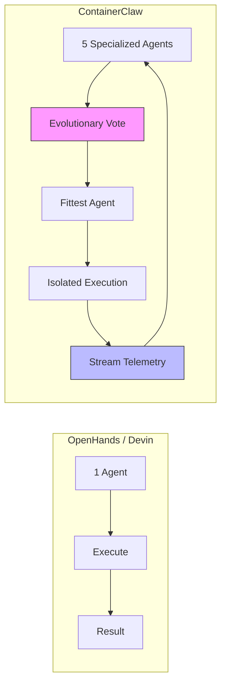
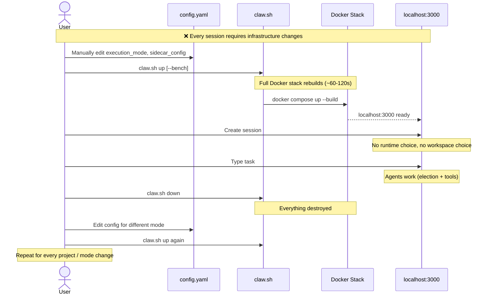
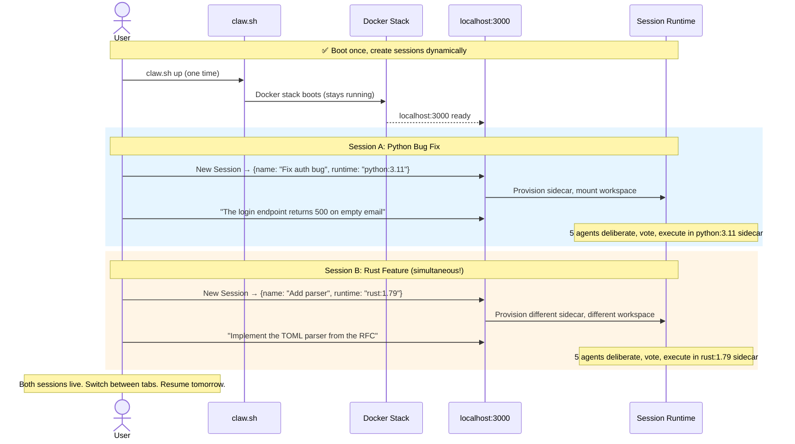
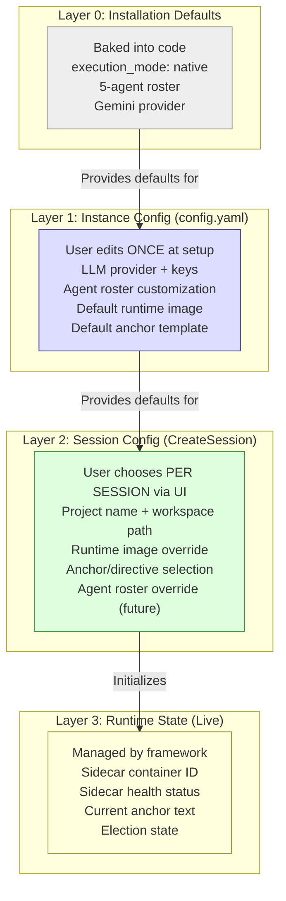
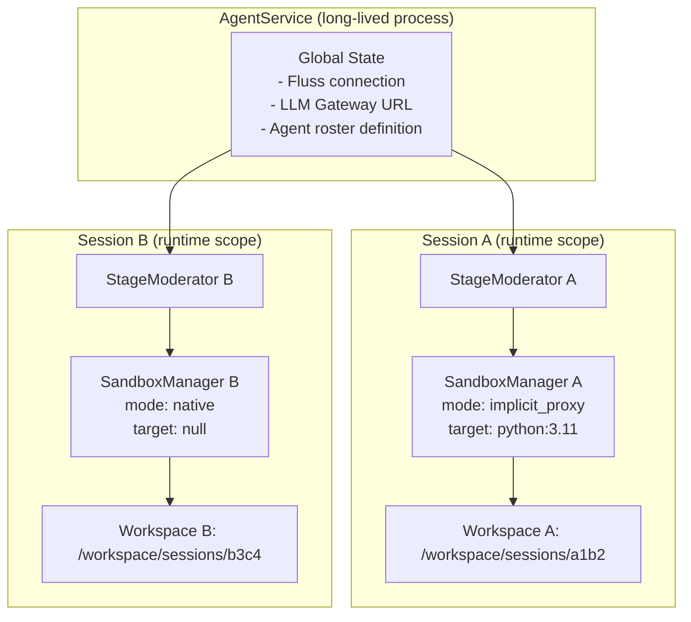
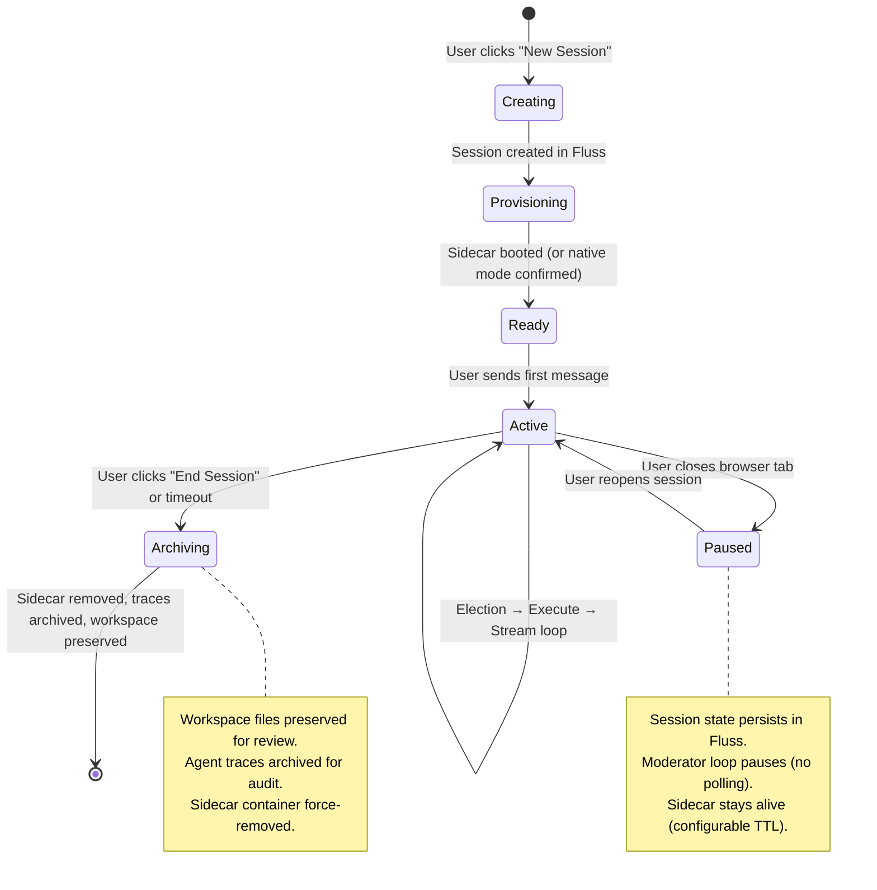
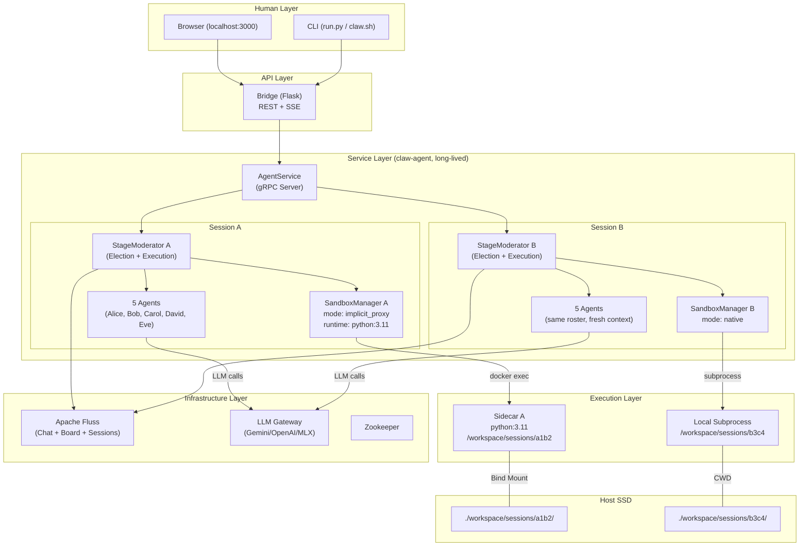
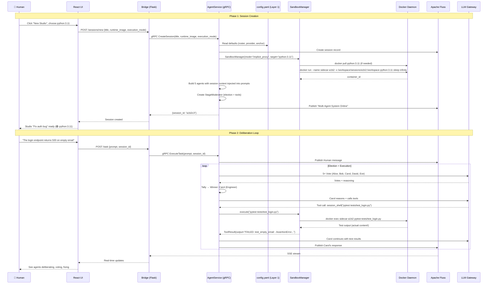

# ContainerClaw Architecture: The Deliberation-First Product

> **Scope:** This document corrects a critical misframing in `draft_pt22_pt7.md`. The multi-agent election protocol is not orchestration overhead — it is the **core product hypothesis**: that deliberation among specialized agents with distinct personas produces emergent reasoning quality that a single agent cannot achieve. This document re-derives the architecture under this constraint, with a focus on making the product intuitive and explainable to both humans and agents — not merely functional from the outside.

---

## 1. The Correction: Deliberation Is the Product

### 1.1 Why pt7 Was Wrong About Elections

`draft_pt22_pt7` (§3.2) labeled the 5-agent election protocol as "⚠️ WASTE" and proposed a "Solo Profile" that bypasses it entirely. This misidentifies the cost structure.

The election protocol implements two hypotheses:

1. **The Latent Intelligence Hypothesis:** LLMs contain reasoning capabilities that are activated by persona-specific prompting. Alice (Architect) surfaces design considerations that Carol (Engineer) would not. David (QA) identifies edge cases that neither would. The election forces all five perspectives to evaluate every decision, surfacing reasoning paths that a single-persona agent would leave dormant.

2. **The Evolutionary Selection Hypothesis:** The voting mechanism acts as an evolutionary fitness function. Each turn, the swarm selects the agent best suited to the current state. This is analogous to genetic algorithms: the "population" of agents competes, and the fittest (most voted) "reproduces" (gets to execute). Over multiple turns, this produces an adaptive, state-sensitive task allocation that no static assignment could replicate.

**Removing the election doesn't save cost — it destroys the product's differentiation.**

### 1.2 Revised Speed-of-Light Analysis

If the election is an investment (not waste), the speed-of-light constraint applies differently:

```
┌──────────────────────────────────────────────────────────────────┐
│ Layer                            │ Latency        │ Category    │
├──────────────────────────────────┼────────────────┼─────────────┤
│ LLM Token Generation (Cloud)    │ ~30-80ms/token │ PHYSICS     │
│ LLM Token Generation (MLX)      │ ~100-300ms/tok │ PHYSICS     │
│ Election Protocol (5 agents)    │ 5× LLM calls  │ INVESTMENT  │
│ Docker Bridge Network (veth)    │ ~50-100μs      │ OPTIMAL     │
│ Shared Volume VFS (same SSD)    │ ~0μs           │ OPTIMAL     │
│ Fluss Append (local tablet)     │ ~1-5ms         │ OPTIMAL     │
│ session_shell → summary only    │ ∞ (broken)     │ ❌ DEFECT   │
│ execute_ephemeral → no volume   │ ∞ (broken)     │ ❌ DEFECT   │
│ Global execution_mode           │ restart penalty│ ❌ FRICTION │
│ No UI runtime selection         │ manual config  │ ❌ FRICTION │
└──────────────────────────────────┴────────────────┴─────────────┘
```

The election occupies ~60% of wall time. If we commit to that investment, then the remaining 40% (tool execution, sidecar I/O, human interaction) must be absolutely flawless. **Every second wasted on broken tool output or manual config editing degrades the return on every LLM token spent in the election.**

The analogy: if you assemble a board of five expert consultants for a strategy session, you don't hand them a blurry photocopy of the financial data. The quality of the information pipeline must match the quality of the reasoning layer.

### 1.3 The Revised Product Definition

> **ContainerClaw is a multi-agent deliberation engine for software engineering, where specialized AI personas collaborate through democratic voting to produce higher-quality decisions than any single agent. The sidecar pattern provides each session with a secure, isolated execution environment that makes the agents' collective reasoning actionable.**

The competitive differentiation is **not** sidecar isolation alone (OpenHands has that) or agent autonomy alone (Devin has that). It is: **structured deliberation × containerized execution × stream-native observability**.



---

## 2. The Real Problem: ContainerClaw Is a Script, Not a Product

The pt7 analysis correctly identified three product modes (A: Bench, B: Personal, C: Enterprise) and the mode conflation problem. But it missed the deeper issue: **ContainerClaw does not feel like a product at all.** It feels like a research prototype that requires an operator to manually configure, boot, use once, and tear down.

### 2.1 The Current User Journey (Painful)



### 2.2 What a Real Product Feels Like

Compare this to Cursor, VS Code Remote, or even `docker compose` itself:

1. **You start it once.** The infrastructure boots and stays running.
2. **You create workspaces/sessions dynamically.** Each has its own context, its own language, its own tools.
3. **Sessions persist.** If you close your browser, you can resume tomorrow.
4. **Configuration flows from defaults → overrides.** You don't edit YAML to change a project setting.
5. **The mental model is obvious.** "This is my project. These are my AI collaborators. They work in this environment."

### 2.3 The Target User Journey (Smooth)



---

## 3. The Mental Model: Making It Explainable

For ContainerClaw to feel like a product (not a research prototype), both humans AND agents need a clear mental model.

### 3.1 The Human Mental Model: "Studio + Crew"

The user should think:

> "I open a **Studio** for my project. I bring in a **Crew** of AI specialists. They discuss, vote, and the best one acts. They work in a **Runtime** that I choose. I watch them work, steer them with directives, and review their output."

This maps directly to the system:

| Human Concept | System Concept | Implementation |
|:---|:---|:---|
| **Studio** | Session | `CreateSession(title, runtime_image)` |
| **Crew** | Agent Roster | 5 agents from `config.yaml` (configurable per session) |
| **Runtime** | Sidecar / Execution Mode | `SandboxManager` with per-session config |
| **Directive** | Anchor | Fluss-backed steering text |
| **Workbench** | `/workspace` | VFS-coherent shared volume |

### 3.2 The Agent Mental Model: "I Am Part of a Team"

Each agent already has a persona (SELF.md + system prompt). But the agent does NOT understand:
- What project it's working on
- What runtime environment its tools execute in
- Who the human is or what they care about

**The fix:** Inject a **Session Context Block** into every agent's system prompt, auto-generated from the session config:

```
## Session Context
- **Project:** Fix auth bug (Session: a1b2c3)
- **Runtime:** python:3.11 (Implicit Proxy → sidecar "swe-sidecar")
- **Workspace:** /workspace (shared with human's IDE)
- **Crew:** Alice (Architect), Bob (PM), Carol (Engineer), David (QA), Eve (Business)
- **Directive:** Focus on Bug — Keep your focus on the current error logs.
```

**Defense:** This costs ~100 tokens per system prompt — negligible relative to the election's cost. But it gives every agent full situational awareness, preventing hallucinated assumptions about the environment (e.g., Alice trying to `pip install` in a Rust project).

### 3.3 The Config Mental Model: "Defaults + Overrides"

The user should never have to think about `config.yaml` during normal use. Configuration flows through layers of progressive specificity:



**The Key Principle:** Each layer only specifies what _differs_ from the layer above. If your session doesn't specify a runtime, it uses the `config.yaml` default. If `config.yaml` doesn't specify one, it uses `native` mode. The user **moves down the layers only when they need to**.

---

## 4. The Session-First Architecture

### 4.1 What Changes Architecturally

The fundamental shift is: **the Session, not the process, owns the execution context.**

Currently, `SandboxManager` is constructed once in `main.py:_init_moderator()` from global config. The Docker stack defines the execution mode. To change modes, you must restart the world.

In the Session-First architecture:



### 4.2 Multi-Session Workspace Isolation

Today, all sessions share a single `/workspace`. This means:
- You cannot work on two projects simultaneously
- Switching projects requires `claw.sh clear-workspace` + re-clone
- SWE-bench `run.py` nukes the workspace between instances

**The fix:** Each session gets its own workspace subdirectory.

```
/workspace/
├── sessions/
│   ├── a1b2c3/          ← Session A's workspace (python project)
│   │   ├── src/
│   │   ├── tests/
│   │   └── .claw/       ← Session-local state
│   │       └── scratch/ ← Ephemeral sandbox artifacts
│   └── d4e5f6/          ← Session B's workspace (rust project)
│       ├── src/
│       ├── Cargo.toml
│       └── .claw/
└── .gitkeep
```

**Defense:** This is how VS Code Remote, JetBrains Gateway, and every IDE-as-a-service works. Each "project" has its own root. The alternative — a single shared workspace — creates mandatory serialization between sessions, violating the fundamental concurrency constraint: if you can reason about two problems in parallel (two browser tabs), the infrastructure must support it.

### 4.3 Session Lifecycle: From Creation to Teardown



**The critical UX point:** "Paused" is not "destroyed." When a user closes their browser and opens it tomorrow, the session is still there. The Fluss log has the full conversation history. The workspace files are on disk. The moderator replays the log and resumes. This is how chat apps work. ContainerClaw should feel the same.

---

## 5. Concrete Implementation Plan

All changes preserve the 5-agent election. The election is the constant. What changes is the substrate beneath it.

### Phase 1: Fix the Broken Feedback Loop (Effort: 1 hour, Impact: Critical)

These are the two bugs from pt7 that make the election's investment worthless. Before describing them, we document the tool execution architecture so the nature of the bug is precise.

#### 5.1.0 Architecture: The OpenAI Tool-Calling Loop

The `ToolExecutor` ([tool_executor.py](file:///.../containerclaw/agent/src/tool_executor.py)) orchestrates a multi-step conversation loop bounded by `MAX_TOOL_ROUNDS`. When an agent "thinks" (via `_think_with_tools`), it can emit a structured `tool_call` instead of (or alongside) text. The executor pauses the LLM, runs the tool locally via the `ToolDispatcher`, and feeds the execution result back to the LLM as a new `tool`-role message (via `_send_function_responses`), so the agent can evaluate the result before generating its final text answer or chaining another tool call.

```
┌──────────────────────────────────────────────────────────────────────────┐
│ ToolExecutor.execute_with_tools() — One Agent Turn                     │
│                                                                        │
│  Round 0: agent._think_with_tools(shared_context, tools)               │
│           → (text?, [tool_call_1, tool_call_2, ...])                   │
│                                                                        │
│  For each tool_call:                                                   │
│    1. Publish tool call to Fluss (telemetry)                           │
│    2. ToolDispatcher.execute(tool_name, args) → ToolResult             │
│    3. Publish result summary to Fluss (telemetry, ≤500 chars)          │
│    4. Accumulate raw result with Adaptive Verbosity limit:             │
│       • Read-heavy tools (repo_map, structured_search, advanced_read): │
│         up to 8,000 chars of raw output                                │
│       • Other tools: up to 2,000 chars of raw output                   │
│                                                                        │
│  Round 1..N: agent._send_function_responses(accumulated_results)       │
│              → (text?, [more_tool_calls?])                             │
│              Loop until: text-only response OR MAX_TOOL_ROUNDS hit     │
│                                                                        │
│  Circuit Breaker: 3 consecutive failures → halt execution              │
└──────────────────────────────────────────────────────────────────────────┘
```

**The `_api_turns` Scratchpad:** `agent._api_turns` ([agent.py:33](file:///.../containerclaw/agent/src/agent.py#L33)) acts as a short-term, per-turn memory buffer. It temporarily stores the intermediate tool calls (assistant messages with `tool_calls`) and tool results (`tool`-role messages) during this loop. This allows the LLM to remember its chain of thought (e.g., "I searched a file, here is the result, now I will edit it") without permanently polluting the main shared conversation history. It is cleared at the start and end of each turn ([tool_executor.py:61](file:///.../containerclaw/agent/src/tool_executor.py#L61), [tool_executor.py:229](file:///.../containerclaw/agent/src/tool_executor.py#L229)).

**Correcting the Tool Visibility Misconception:** An earlier draft (pt7) assumed that agents only see summarized tool results. This conflates two distinct output paths:

| Path | Audience | Limit | Purpose |
|:---|:---|:---|:---|
| **Telemetry (Fluss/UI)** | Human observer | 500 chars ([tool_executor.py:165](file:///.../containerclaw/agent/src/tool_executor.py#L165)) | Prevent flooding the logs and UI |
| **LLM Context (Adaptive Verbosity)** | Agent (via `_api_turns`) | 2,000–8,000 chars ([tool_executor.py:196-202](file:///.../containerclaw/agent/src/tool_executor.py#L196-L202)) | Agent reasons about raw tool output |

The agents **do** receive the raw, detailed output. `ToolExecutor` implements "Adaptive Verbosity" ([tool_executor.py:196-202](file:///.../containerclaw/agent/src/tool_executor.py#L196-L202)), passing up to 8,000 characters of raw output for read-heavy tools (`repo_map`, `structured_search`, `advanced_read`) and 2,000 characters for other tools directly into the LLM's payload via `_api_turns`. The 500-char telemetry summary is a separate path for human observability only.

**However, this architecture only works when the tool's `ToolResult.output` contains the actual output.** The two bugs below break the pipeline *before* the Adaptive Verbosity layer ever sees the data.

#### 5.1.1 Fix `session_shell` — Return Actual Output to Agents

**Current code** ([tools.py:848-851](file:///.../containerclaw/agent/src/tools.py#L848-L851)):
```python
return ToolResult(
    success=(exit_code == 0),
    output=f"Command exited with code {exit_code}. {len(output.splitlines())} lines of output streamed to telemetry."
)
```

**Problem:** The raw command output is available in the local `output` variable, but `session_shell` discards it and returns only a summary string. The Adaptive Verbosity layer in `tool_executor.py` then faithfully passes this *summary* ("15 lines streamed to telemetry") to the LLM — not the actual command output. The agent has no idea whether the test passed or failed. The same bug exists in `execute_in_sandbox` ([tools.py:1051-1053](file:///.../containerclaw/agent/src/tools.py#L1051-L1053)).

**Fix:**
```python
return ToolResult(
    success=(exit_code == 0),
    output=output[:config.TOOLS.output_limit_chars] if output else f"Command exited with code {exit_code}. No output.",
    error=f"Exit code: {exit_code}" if exit_code != 0 else None,
)
```

**Defense (Information-Theoretic):** The election protocol produces a selection with $O(5 \cdot T_{llm})$ latency. If the selected agent receives zero bits of information from its action, the selection's entropy is wasted. With this fix, `session_shell` passes the raw output through `ToolResult.output`, where the Adaptive Verbosity layer (`tool_executor.py:196-202`) will truncate it to the appropriate per-tool limit (2,000 chars for execution tools) before feeding it to the LLM. The `output_limit_chars` bound in the tool itself (8,192 chars) provides a generous first-pass cap; the AV layer provides the final, context-aware truncation. The parallel Fluss telemetry stream is preserved for the human's observability — this fix only affects what the agent sees in its tool result, not what Fluss records.

#### 5.1.2 Fix `execute_ephemeral` — Mount the Shared Volume

**Current code** ([sandbox.py:153-161](file:///.../containerclaw/agent/src/sandbox.py#L153-L161)):
```python
container = await asyncio.to_thread(
    self.client.containers.run,
    image=image, name=sandbox_id, detach=True,
    network_mode=self.network, mem_limit="512m",
    command="sleep infinity"
    # ← NO VOLUME MOUNT
)
```

**Fix:**
```python
container = await asyncio.to_thread(
    self.client.containers.run,
    image=image, name=sandbox_id, detach=True,
    network_mode=self.network, mem_limit="512m",
    command="sleep infinity",
    volumes={config.WORKSPACE_ROOT: {"bind": config.WORKSPACE_ROOT, "mode": "rw"}},
)
```

**Defense:** The "Shared Volume Mirage" is an architectural invariant (draft_pt22_pt5). _Every_ execution context must map to the same physical bits. Without this mount, the ephemeral container operates on an empty filesystem. An agent that votes for David (QA) to run tests in a Python 3.9 sandbox via `execute_in_sandbox` finds nothing to test.

### Phase 2: Session-Scoped Execution (Effort: 4-6 hours, Impact: High)

This is the keystone change that transforms ContainerClaw from "a script you run" into "a service you use."

#### 5.2.1 Extend `CreateSession` to Accept Runtime Config

**Change the gRPC protocol** ([agent.proto](file:///.../containerclaw/proto)):
```protobuf
message CreateSessionRequest {
  string title = 1;
  // NEW: Optional runtime override. If empty, uses config.yaml default.
  string runtime_image = 2;
  // NEW: Optional execution mode override. If empty, uses config.yaml default.
  string execution_mode = 3; // "native" | "implicit_proxy" | "explicit_orchestrator"
}
```

**Change the bridge** to pass these through from the HTTP layer:
```python
# bridge.py — /sessions/new handler
@app.post("/sessions/new")
def create_session():
    data = request.json
    response = agent_stub.CreateSession(agent_pb2.CreateSessionRequest(
        title=data.get("title", "Untitled"),
        runtime_image=data.get("runtime_image", ""),      # NEW
        execution_mode=data.get("execution_mode", ""),     # NEW
    ))
    return jsonify({"session": ...})
```

**Defense:** This is the minimum change that decouples session config from global config. The user's browser sends `{runtime_image: "python:3.11"}`, the bridge passes it through to the agent, and the agent constructs a session-scoped `SandboxManager` with that image. No `config.yaml` edit. No stack restart. The flow is: **click → type → work**.

#### 5.2.2 Make `SandboxManager` Session-Scoped

**Current construction** ([main.py:123](file:///.../containerclaw/agent/src/main.py#L123)):
```python
sandbox_mgr = SandboxManager()  # reads from global config.CONFIG
```

**New construction:**
```python
# Resolve session-specific config with layered defaults
session_exec_mode = request.execution_mode or config.CONFIG.execution_mode
session_runtime = request.runtime_image or config.CONFIG.sidecar_config.default_target_id

sandbox_mgr = SandboxManager(
    mode=session_exec_mode,
    default_target=session_runtime,
    network=config.CONFIG.sidecar_config.network,
    workspace_root=session_workspace_path,  # per-session workspace
)
```

**Corresponding `SandboxManager.__init__` change:**
```python
class SandboxManager:
    def __init__(self, mode: str = None, default_target: str = None,
                 network: str = None, workspace_root: str = None):
        self.mode = mode or config.CONFIG.execution_mode
        self.default_target = default_target or config.CONFIG.sidecar_config.default_target_id
        self.network = network or config.CONFIG.sidecar_config.network
        self.workspace_root = workspace_root or config.WORKSPACE_ROOT
        self._client = None
```

**Defense (Layered Defaults):** Notice the `or` chain. If the session doesn't specify a mode, it falls back to global config. If global config doesn't specify one, the Pydantic model defaults to `"native"`. This implements the Config Mental Model from §3.3: Layer 2 overrides Layer 1 overrides Layer 0. The user never needs to know about the lower layers unless they want to change them.

#### 5.2.3 Validate Sidecar at Session Creation (No DinD)

**Architectural decision:** The agent **never** provisions containers itself. Docker-in-Docker (DinD) is unstable, requires privileged access, and violates the container security model (`cap_drop: ALL`, `read_only: true`, `no-new-privileges`). Mounting the Docker socket would give the agent root-equivalent access to the host.

**Provisioning responsibility by mode:**

| Mode | Who provisions? | Agent's job |
|:---|:---|:---|
| `native` | Nobody | Run subprocess locally |
| `implicit_proxy` | docker-compose / k8s | Validate target exists, `exec` into it |
| `explicit_orchestrator` | External orchestrator API | Request container via API call |

**New flow:** The agent validates the sidecar exists at session creation and falls back to native if unreachable:

```python
# main.py — _init_moderator (validation-only, no provisioning)
if session_exec_mode == "implicit_proxy":
    try:
        sandbox_mgr.client.containers.get(session_runtime)
        print(f"🐳 [Agent] Sidecar validated: {session_runtime}")
    except Exception as e:
        print(f"⚠️ [Agent] Sidecar '{session_runtime}' not reachable: {e}")
        sandbox_mgr.mode = "native"  # Graceful fallback
```

**Defense:** The provisioning gap is closed at the orchestration layer: `docker-compose.swebench.yml` defines the sidecar service, `run.py` sets up the workspace before creating a session, and the agent simply validates what the orchestrator has already done. For the personal dev persona, `native` mode is the default — no Docker needed at all.

#### 5.2.4 Inject Session Context into Agent Prompts

**Change:** Auto-generate a context block from the session config and prepend it to every agent's system prompt:

```python
# moderator.py — run() (after publisher init, before main loop)
session_context = self._build_session_context()
for agent in self.agents:
    agent.session_context = session_context

def _build_session_context(self) -> str:
    mode_desc = {
        "native": "local subprocess on the host machine",
        "implicit_proxy": f"Docker sidecar container ({self.sandbox_mgr.default_target})",
        "explicit_orchestrator": "dynamically provisioned Docker containers",
    }
    return (
        f"## Session Context\n"
        f"- **Session:** {self.session_id[:8]}\n"
        f"- **Runtime:** {mode_desc.get(self.sandbox_mgr.mode, 'unknown')}\n"
        f"- **Workspace:** {self.sandbox_mgr.workspace_root}\n"
        f"- **Crew:** {self.roster_str}\n"
    )
```

**Defense:** This costs ~80-120 tokens per prompt — less than 1% of a typical context window. But it prevents an entire class of failure modes where agents make wrong assumptions about their environment. A 5-agent election produces maximum value when every agent has full situational awareness. Without this, Alice (Architect) might suggest `npm install` in a Python-only sidecar, burning the election turn on a guaranteed-fail action.

### Phase 3: Human-Centric UI Flows (Effort: 4-6 hours, Impact: High)

These changes make ContainerClaw feel like a product, not a prototype.

#### 5.3.1 Session Creation Dialog in the React UI

**Change:** Replace the current "New Session" button (which creates a session with only a title) with a creation dialog:

```
┌─────────────────────────────────────────────┐
│  🦀 New Studio                              │
│                                             │
│  Name:     [Fix auth bug in login.py     ]  │
│                                             │
│  Runtime:  [● Native (no container)      ]  │
│            [  Python 3.11                ]  │
│            [  Node.js 20                 ]  │
│            [  Rust 1.79                  ]  │
│            [  Custom image...            ]  │
│                                             │
│  Directive:                                 │
│            [● Agile Development          ]  │
│            [  Focus on Bug               ]  │
│            [  Code Quality               ]  │
│            [  QA Mode                    ]  │
│                                             │
│        [ Cancel ]          [ Create Studio ] │
└─────────────────────────────────────────────┘
```

**Where the options come from:**
- **Runtime list:** A hardcoded starter set (`native`, `python:3.11`, `node:20`, `rust:1.79`) + a "Custom image..." text input. Future: populated from `.claw/runtimes/` discovery.
- **Directive list:** Populated from `config.yaml → ui.anchor_templates[]`. Already implemented in config_loader.py.

**Defense:** This is the single most important UX change. It transforms session creation from "accept all defaults" to "30-second guided setup." The user makes two choices (runtime + directive) and is immediately working. No YAML. No terminal. No Docker commands.

#### 5.3.2 Session Sidebar with Sidecar Status

**Change:** The React UI sidebar currently lists sessions by name. Extend it to show:

```
┌──────────────────────────────┐
│  📂 Sessions                 │
│                              │
│  ● Fix auth bug              │
│    python:3.11 │ 🟢 Running  │
│    3 turns │ 12 min ago       │
│                              │
│  ● Add TOML parser           │
│    rust:1.79 │ 🟡 Idle        │
│    0 turns │ 2 hrs ago        │
│                              │
│  ○ SWE-bench batch           │
│    sweb.eval │ ⚫ Archived    │
│    47/500 │ yesterday         │
│                              │
│  [+ New Studio]              │
└──────────────────────────────┘
```

**Data source:** The bridge already exposes `/sessions` and `/events/{session_id}`. Sidecar status comes from a new lightweight endpoint that calls `docker inspect` on the session's target container (or returns `null` for native mode).

**Defense:** Without status visibility, the user encounters opaque errors ("Tool error: Docker daemon not accessible") and has no way to self-diagnose. A green/yellow/red dot next to the session name immediately tells the user whether the problem is in their code or in the infrastructure.

#### 5.3.3 Persistent Sessions with Resume

**Change:** Currently, `claw.sh down` destroys everything. Sessions should survive a restart cycle.

**What already works:** Fluss persists all chat history and board state. The moderator's `_replay_history()` already replays the log on boot.

**What's missing:** The sidecar container is destroyed on `claw.sh down`. On restart, the session exists in Fluss but has no sidecar.

**Fix:** On session resume (user opens a paused session), the moderator checks if its sidecar is running:
```python
# moderator.py — resume logic
if self.sandbox_mgr.mode == "implicit_proxy":
    try:
        self.sandbox_mgr.client.containers.get(self.sandbox_mgr.default_target)
    except docker.errors.NotFound:
        # Sidecar died — re-provision from the session's stored runtime_image
        await self._reprovision_sidecar()
```

**Defense:** This is the difference between "a session" and "a conversation." A session that dies when Docker restarts is a batch job. A session that automatically recovers is a relationship. For the "Personal Dev" persona, this means: start your session on Monday, close your laptop, reopen on Tuesday, and your AI crew is right where you left them.

### Phase 4: SWE-bench Integration Without Removing Election (Effort: 2-3 hours, Impact: Medium)

The election is preserved for SWE-bench. What changes is how `run.py` interfaces with the system.

#### 5.4.1 `run.py` Uses Session API Instead of External Orchestration

**Current flow:** `run.py` calls `workspace_setup.setup_workspace()` directly, then submits the task via the bridge. It externally manages sidecar lifecycle.

**New flow:** `run.py` creates a session with the appropriate runtime, and the framework handles everything:

```python
# run.py — run_single (simplified)
def run_single(instance_id, args):
    instance = load_instance(instance_id, args.dataset)
    image_name = f"ghcr.io/epoch-research/swe-bench.eval.x86_64.{instance_id}"
    
    # 1. Create a session with runtime config (framework provisions sidecar)
    sess_resp = requests.post(f"{BRIDGE_URL}/sessions/new", json={
        "title": f"SWE-bench: {instance_id}",
        "runtime_image": image_name,
        "execution_mode": "implicit_proxy",
    })
    session_id = sess_resp.json()["session"]["session_id"]
    
    # 2. Submit the problem (framework handles workspace setup internally)
    requests.post(f"{BRIDGE_URL}/task", json={
        "prompt": instance["problem_statement"],
        "session_id": session_id,
    })
    
    # 3. Wait for completion (existing SSE polling)
    turns = wait_for_completion(args.timeout, session_id)
    
    # 4. Extract patch (from session workspace)
    agent_patch = extract_patch(f"./workspace/sessions/{session_id[:8]}")
```

**Defense:** This eliminates the hairiest coupling in the current system: `run.py` directly calling `docker.from_env()` and managing container lifecycle outside the framework. By using the session API, `run.py` becomes a thin harness that submits problems and collects results. The framework owns the full lifecycle — sidecar provisioning, workspace seeding, symlink creation, and teardown.

The 5-agent election still runs for every SWE-bench instance. The hypothesis is that Alice's architectural insight, David's edge-case awareness, and Carol's implementation skill produce a higher-quality patch than any single agent. The benchmark results will prove or disprove this.

### Phase 5: Agent-Centric UX (Effort: 2-3 hours, Impact: Medium)

These changes make the tool execution experience smooth for agents within the deliberation loop.

#### 5.5.1 Refine Adaptive Verbosity for Execution Tools

**Current state:** The Adaptive Verbosity mechanism in `tool_executor.py:196-202` already implements a two-tier output strategy:

```python
# tool_executor.py — EXISTING Adaptive Verbosity (lines 196-202)
read_tools = ["repo_map", "structured_search", "advanced_read"]
limit = 8000 if tool_name in read_tools else 2000

output = result.output
if len(output) > limit:
    output = output[:limit] + "\n\n[TRUNCATED: Result too large for context window. ...]"
```

This is separate from the telemetry summary path (line 165: `result_summary = result.output[:500]`), which only affects what appears in the Fluss/UI stream. The agents already receive up to 8,000 chars for read-heavy tools and 2,000 chars for execution tools via `_api_turns`.

**Remaining gap:** Once Phase 1 fixes `session_shell` and `execute_in_sandbox` to return raw output (§5.1.1, §5.1.2), the 2,000-char default limit may be insufficient for execution tools where the critical failure information (e.g., assertion errors, stack traces) appears at the *tail* of the output.

**Refinement:**
```python
# tool_executor.py — Enhanced Adaptive Verbosity
READ_TOOLS = {"repo_map", "structured_search", "advanced_read"}
EXEC_TOOLS = {"session_shell", "execute_in_sandbox", "test_runner"}

if tool_name in READ_TOOLS:
    limit = 8000
elif tool_name in EXEC_TOOLS:
    limit = 4000  # Raised from 2000: execution output is high-value
else:
    limit = 2000

# Tail-biased truncation for execution tools: keep last N lines
# where assertions and error messages typically live
if tool_name in EXEC_TOOLS and len(output) > limit:
    tail_budget = limit * 3 // 4  # 75% tail, 25% head
    head_budget = limit - tail_budget
    output = (
        output[:head_budget]
        + "\n\n[... TRUNCATED ...]\n\n"
        + output[-tail_budget:]
    )
elif len(output) > limit:
    output = output[:limit] + "\n\n[TRUNCATED: ...]"
```

**Defense:** The Adaptive Verbosity architecture is sound — the core design of per-tool limits feeding into `_api_turns` is correct. This refinement addresses a specific gap: for test output, the head of `stdout` is typically boilerplate (`===== test session starts =====`), while the actionable information (failed assertions, stack traces) appears at the tail. Tail-biased truncation ensures the 4,000-char budget captures the information the agent needs to reason about failures. This is an enhancement to the existing mechanism, not a replacement.

---

## 6. The Complete Architecture (Post-Changes)



---

## 7. Config Flow: End-to-End Trace

To make this concrete, here is the complete configuration flow for a user creating a "Fix auth bug" session with `python:3.11`:



---

## 8. Competitive Positioning

| Capability | OpenHands | Devin | Cursor Agent | **ContainerClaw** |
|:---|:---|:---|:---|:---|
| Agent Count | 1 | 1 | 1 | **5 (deliberative)** |
| Selection Mechanism | None | None | None | **Evolutionary voting** |
| Execution Isolation | Docker sandbox | Proprietary VM | None (host) | **Sidecar pattern (configurable)** |
| Observability | Logs | Proprietary | IDE inline | **Stream-native (Apache Fluss)** |
| Multi-session | No | No | Yes (tabs) | **Yes (concurrent sidecars)** |
| Open Source | Yes | No | No | **Yes (Apache 2.0)** |
| Enterprise Ready | Partial | Yes | No | **Architected (k8s-ready)** |

ContainerClaw's moat is the combination of **deliberative multi-agent reasoning** (no competitor has this) with **configurable execution isolation** (matching OpenHands) and **stream-native observability** (unique via Fluss). The election protocol is not a cost to minimize — it is the feature to market.

---

## 9. Verification Plan

| Change | Verification Method | Success Criterion |
|:---|:---|:---|
| session_shell output fix | Run `session_shell("echo hello")`, check agent sees "hello" | ToolResult.output contains "hello" |
| execute_ephemeral volume fix | `execute_in_sandbox("python:3.11", "ls /workspace")` | Output lists workspace files |
| Per-session SandboxManager | Create two sessions with different modes simultaneously | Both function independently |
| Session creation dialog | Open UI, click New Studio, select python:3.11, create | Session boots with sidecar |
| Session context injection | Check agent system prompt during session | Contains "Runtime: python:3.11" |
| Sidecar health display | Kill sidecar manually, check UI | Red indicator appears |
| SWE-bench via session API | `run.py --instance django__django-11133` with new flow | Patch extracted successfully |
| Session resume | `claw.sh down && claw.sh up`, open old session | History replayed, sidecar re-provisioned |

---

## 10. Summary

The `draft_pt22_pt7` analysis was structurally correct about the Product A/B/C conflation problem and the two critical bugs in the execution layer. But it was wrong to classify the multi-agent election as "waste."

The election protocol is ContainerClaw's core hypothesis: **structured deliberation among specialized personas produces emergent reasoning quality.** This hypothesis must be tested, not bypassed. The architecture should be designed to **maximize the return on the election's LLM investment** by ensuring:

1. **Agents receive full, actionable tool output** (fix session_shell)
2. **Execution environments are correctly provisioned** (fix execute_ephemeral)
3. **Sessions are dynamically configured** (per-session SandboxManager)
4. **The UX is product-grade** (session creation dialog, sidecar status, persistence)

The election is the constant. The execution substrate is the variable. By fixing the substrate, we transform ContainerClaw from "a research prototype that requires an operator" into "a multi-agent development platform that a human can use as naturally as opening a chat window."

> [!IMPORTANT]
> **Revised priority order (preserving election):**
> 1. Fix `session_shell` output — agents must see tool results (30 min)
> 2. Fix `execute_ephemeral` volume mount — ephemeral mode must work (15 min)
> 3. Session-scoped `SandboxManager` + `CreateSession` extension (4-6 hrs)
> 4. UI session creation dialog with runtime/directive selection (4-6 hrs)
> 5. Auto-provisioning sidecar on session creation (2-3 hrs)
> 6. Session context injection into agent prompts (1-2 hrs)
> 7. SWE-bench `run.py` migration to session API (2-3 hrs)
> 8. Sidecar health monitoring + UI status indicators (2-3 hrs)
> 9. Session resume with sidecar re-provisioning (2-3 hrs)

---

- Validation

# Phases 3 & 4: UI Session Dialog + SWE-bench Session API

## Background

Phases 1, 2, and 5 established the backend: session-scoped `SandboxManager`, per-session proto fields, adaptive verbosity. Now we wire these into the UI (Phase 3) and the SWE-bench harness (Phase 4).

## User Review Required

> [!IMPORTANT]
> Phase 3.3 (Persistent Sessions with Resume) is **deferred** — it requires sidecar lifecycle management that conflicts with the no-DinD decision. The session chat history already persists via Fluss replay; only sidecar state is lost on restart.

> [!WARNING]  
> Phase 4 changes `run.py`'s `submit_task()` to pass `runtime_image` and `execution_mode`. This means the SWE-bench harness will **require** the updated bridge/agent containers. Old containers will ignore the new fields (proto3 forward-compat), so it's safe to deploy incrementally.

---

## Proposed Changes

### Phase 3: UI Session Creation Dialog

#### [MODIFY] [api.ts](file:///Users/jaredyu/Desktop/open_source/containerclaw/ui/src/api.ts)

Update `createSession()` to accept `runtime_image` and `execution_mode`:

```typescript
export const createSession = async (
  title?: string,
  runtime_image?: string,
  execution_mode?: string
): Promise<Session | null> => {
  const resp = await fetch(`${BRIDGE_URL}/sessions/new`, {
    method: 'POST',
    headers: { 'Content-Type': 'application/json' },
    body: JSON.stringify({ title, runtime_image, execution_mode }),
  });
  // ...
};
```

---

#### [MODIFY] [App.tsx](file:///Users/jaredyu/Desktop/open_source/containerclaw/ui/src/App.tsx)

Replace the current `handleNewSession()` (which creates with a plain name) with a modal dialog:

**New Session Dialog** — opens on `+ New` button click:
- **Name** text input (pre-filled with `"Chat N"`)
- **Runtime** selector: `Native (default)`, `Python 3.11`, `Node.js 20`, `Rust 1.79`, `Custom image...`
- **Directive** selector: populated from `fetchAnchorTemplates()` (already wired)
- **Create** button sends `createSession(name, runtime_image, execution_mode)` + auto-applies selected anchor template

**Session list** — extend each `session-item` to show the runtime badge:
```
● Fix auth bug
  ⚡ native │ 3 min ago
```

This requires storing runtime info on the `Session` type. Since the proto `SessionEntry` doesn't currently include runtime, we'll store it client-side in a `Map<string, {runtime, mode}>` keyed by session_id.

---

### Phase 4: SWE-bench Session API

#### [MODIFY] [run.py](file:///Users/jaredyu/Desktop/open_source/containerclaw/scripts/swe_bench/run.py)

Update `submit_task()` to pass `runtime_image` and `execution_mode` when creating the session:

```python
# line 147 — currently:
sess_resp = requests.post(f"{BRIDGE_URL}/sessions/new", json={"title": "SWE-Bench Run"}, timeout=60)

# becomes:
sess_resp = requests.post(f"{BRIDGE_URL}/sessions/new", json={
    "title": f"SWE-bench: {instance_id}",
    "runtime_image": swe_bench_image or "",
    "execution_mode": "implicit_proxy",
}, timeout=60)
```

`submit_task()` signature gains an `instance_id` and optional `image_name` parameter. `run_single()` passes these through.

> [!NOTE]
> This is purely additive — the old behavior (empty `runtime_image` = use config.yaml default) still works for non-SWE-bench sessions.

---

## Testing Guide: All Execution Modes

### Mode 1: Native (default — no Docker needed)

```bash
# 1. Ensure config.yaml has:
#    execution_mode: native
# 2. Start normally
bash claw.sh up

# 3. Open localhost:3000, create a session, ask:
#    "Run echo hello world using session_shell"
# 4. Expected log:
#    🐳 [Agent] Native execution mode for session XXXXXXXX.
# 5. Verify the agent receives actual "hello world" output (Phase 1 fix)
```

### Mode 2: Implicit Proxy (pre-provisioned sidecar)

```bash
# 1. Start a sidecar manually on the same Docker network:
docker run -d --name test-sidecar \
  --network containerclaw_internal \
  -v $(pwd)/workspace:/workspace:rw \
  python:3.12-slim \
  sleep infinity

# 2. Set config.yaml:
#    execution_mode: implicit_proxy
#    sidecar:
#      default_target_id: test-sidecar
#      network: containerclaw_internal

# 3. Rebuild & restart agent:
docker compose build claw-agent && docker compose up -d claw-agent

# 4. Create a session, ask:
#    "Run python3 --version using session_shell"
# 5. Expected log:
#    🐳 [Agent] Sidecar validated: test-sidecar
# 6. Output should show Python version from the sidecar container

# 7. Cleanup:
docker rm -f test-sidecar
```

### Mode 3: Explicit Orchestrator (ephemeral containers)

```bash
# 1. Set config.yaml:
#    execution_mode: explicit_orchestrator
# 2. Requires Docker socket mounted to the agent container
#    (add to docker-compose.yml volumes):
#      - /var/run/docker.sock:/var/run/docker.sock:ro
# 3. Ask:
#    "Execute 'python3 -c \"print(42)\"' in a python:3.12-slim sandbox"
#    (uses execute_in_sandbox tool)
# 4. Expected: Agent spins up ephemeral container, runs command, gets output

# ⚠️ NOTE: This mode requires Docker socket access and is only
# recommended for controlled environments (CI/CD, SWE-bench).
# Do NOT use in production/multi-tenant setups.
```

### Mode 4: Per-Session Override via API (Phase 2 validation)

```bash
# Test that per-session runtime works via the bridge API:
curl -X POST http://localhost:5001/sessions/new \
  -H 'Content-Type: application/json' \
  -d '{"title": "Python Test", "runtime_image": "test-sidecar", "execution_mode": "implicit_proxy"}'

# Expected agent log:
#   🆕 [Agent] Creating session: Python Test (XXXXXXXX)
#       Runtime: test-sidecar, Mode: implicit_proxy
#   🐳 [Agent] Sidecar validated: test-sidecar
```

---

## Verification Plan

### Automated Tests
- `py_compile` on all modified Python files
- `npm run build` for UI (TypeScript type checking)

### Manual Verification
- Phase 3: Open `localhost:3000`, click `+ New`, verify the dialog renders with runtime/directive pickers
- Phase 4: Run `python run.py --instance django__django-11133 --skip-docker --keep-alive` and verify the session is created with `execution_mode: implicit_proxy` in logs
- Sidecar modes: Follow the testing guide above for each mode
- Phase 6 (Traces): Run a trace and inspect the output `conversation.json` to verify agent reasoning is fully preserved and duplicates are purged.

---

## Phase 6: Trace Telemetry Cleanups (Bonus)

During testing of `SWE-bench` execution, it was found that the agent conversations in the `traces/.../conversation.json` were truncated (missing the agent reasoning) and heavily bloated with duplicate tool output.

To fix this:
1. **Deduplication in `GetHistory`**: The Fluss Reconciler scanner was reading identical events already emitted via the Publisher callback loop. We added an in-memory dedup using `(actor_id, content)` since the chat schemas lack explicit UUIDs.
2. **Telemetry Filter**: Filtered out raw stdout buffer chunks (used mainly for Snorkel visualizer streaming) from `GetHistory` so they don't pollute the trace.
3. **Persist Chain-of-Thought**: `tool_executor.py` was previously discarding intermediate LLM reasoning (kept only in an ephemeral `agent._api_turns` state) unless it was perfectly matched with a tool call block. This change ensures intermediate reasoning is always emitted as a `thought` event so the agent's chain-of-thought is persistently archived.
