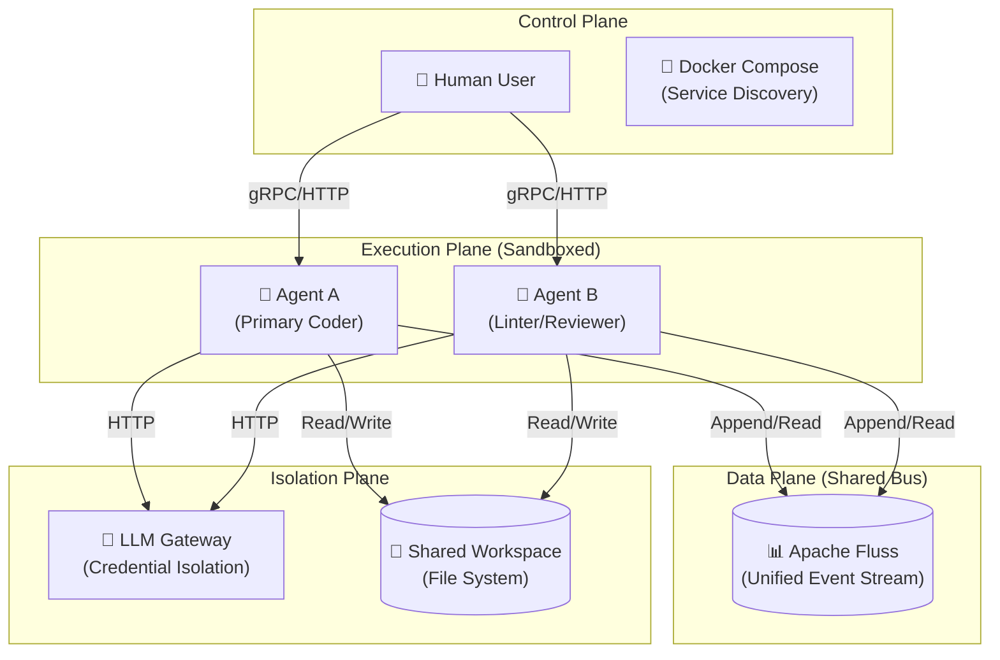
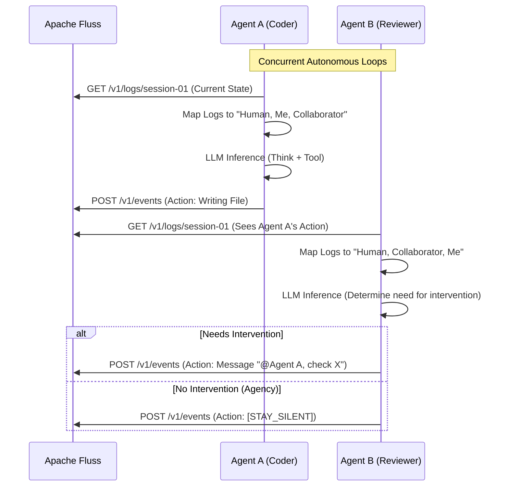

# ContainerClaw — Multi-Agent Collaboration: Architectural Rigor

> **Complementary to:** [draft.md](file:///.../containerclaw/docs/draft.md), [draft_pt2.md](file:///.../containerclaw/docs/draft_pt2.md), and [draft_pt3.md](file:///.../containerclaw/docs/draft_pt3.md)  
> **Focus:** Technical Defense, Shared Bus Architecture, and Agency Mechanics  
> **Version:** 0.1.0-draft-pt4  

---

## 1. Architectural Evolution: The Bus-Centric Model

Phase 3 introduces a fundamental shift in ContainerClaw's topology. We are moving from a set of isolated spokes to a **Bus-Centric Architecture** where Apache Fluss serves as the "Common Knowledge Base" and communication medium.

### 1.1 Component Relationship Model
In this model, the "truth" of the session is not held by any single agent, but by the Fluss event stream.

---

## 2. The Chatroom Sequence (Synchronous View)

To achieve the "Chatroom" effect, we use **Log-to-History Mapping**. Every agent poll result from Fluss is transformed into a natural language transcript that populates the LLM's `messages` array, creating a multiplexed perspective of the shared session.

---

## 3. Systematic Defense of the Implementation

The following design decisions are required to ensure the stability and coherence of the multi-agent system.

### 3.1 Persistent Identity via Actor ID
**Requirement**: Every event in Fluss must be tagged with an `actor_id` and `actor_type`.
**Defense**: Without explicit attribution, the mapping logic in the agents cannot distinguish between "Self" and "Collaborator." This would lead to a "Mirror Hallucination" where agents treat their own previous actions as if they were performed by someone else, or vice versa.

### 3.2 Chronological Truth via History Re-mapping
**Requirement**: Agents do not maintain an internal `history` list; instead, they reconstruct the transcript on every loop iteration from the Fluss source.
**Defense**: This ensures that even if Agent A's loop is faster than Agent B's, they both strictly adhere to the same chronological truth. It eliminates "state drift" between independent agent memories and ensures that feedback from one agent is immediately "heard" by the other.

### 3.3 Selective Participation via Agency Flag (`wait`)
**Requirement**: The LLM response schema must include a `wait` or `stay_silent` action.
**Defense**: In a real chatroom, forced responses lead to noise. If Agent B determines Agent A is performing correctly, a mandatory response (even a thought) can clutter the shared history and trigger unnecessary re-processing. The `wait` action allows for silent observation, which is critical for scaling beyond two agents.

---

## 4. Multi-Agent Scalability

While the MVP starts with two agents (Primary Coder and Secondary Reviewer), the **Bus-Centric Architecture** is designed for horizontal scaling:

1.  **Specialized Persona**: Adding a "Security Auditor" agent simply requires launching another container with a specific security-focused system prompt.
2.  **Stateless Execution**: Since the state is in Fluss and the Project Workspace, agents can be restarted, scaled, or replaced without session loss.
3.  **Conflict Resolution**: As agents share the `/workspace`, future iterations will integrate a distributed lock manager into the Fluss stream (e.g., `lock_acquired` events) to coordinate file access.

---

> **Design Defense Conclusion:** By elevating Apache Fluss from a logging sink to a shared communication bus, ContainerClaw moves from single-agent silos to a collaborative, human-like workflow environment that is technically robust and architecturally scalable.
