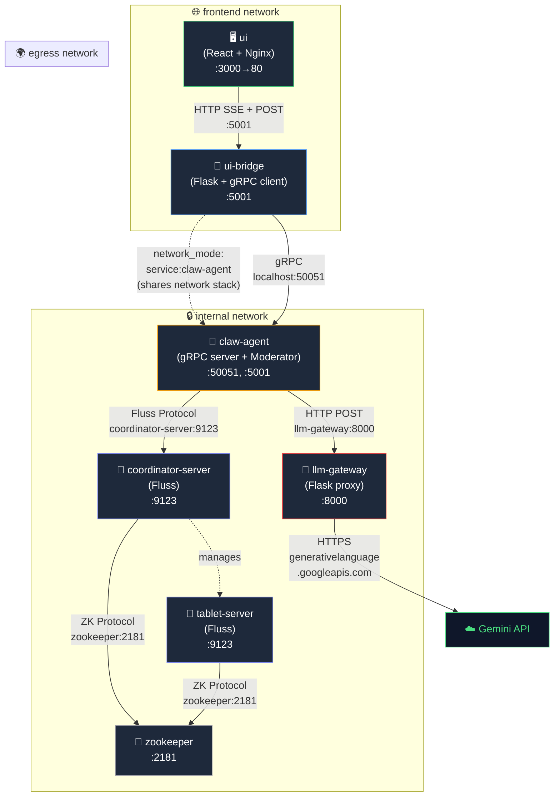
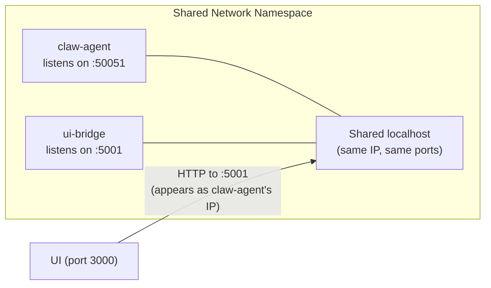
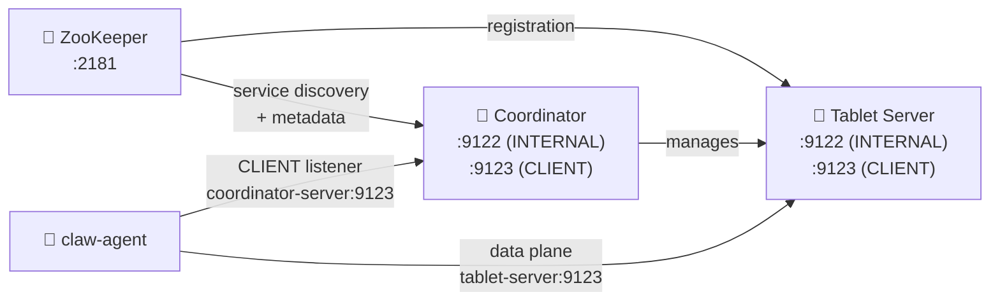
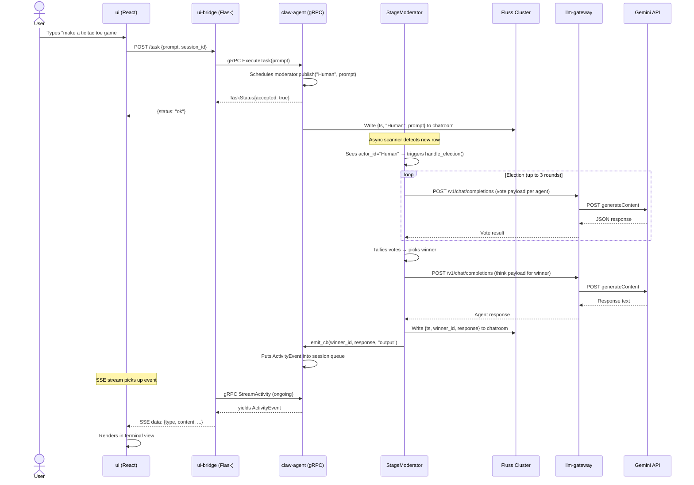
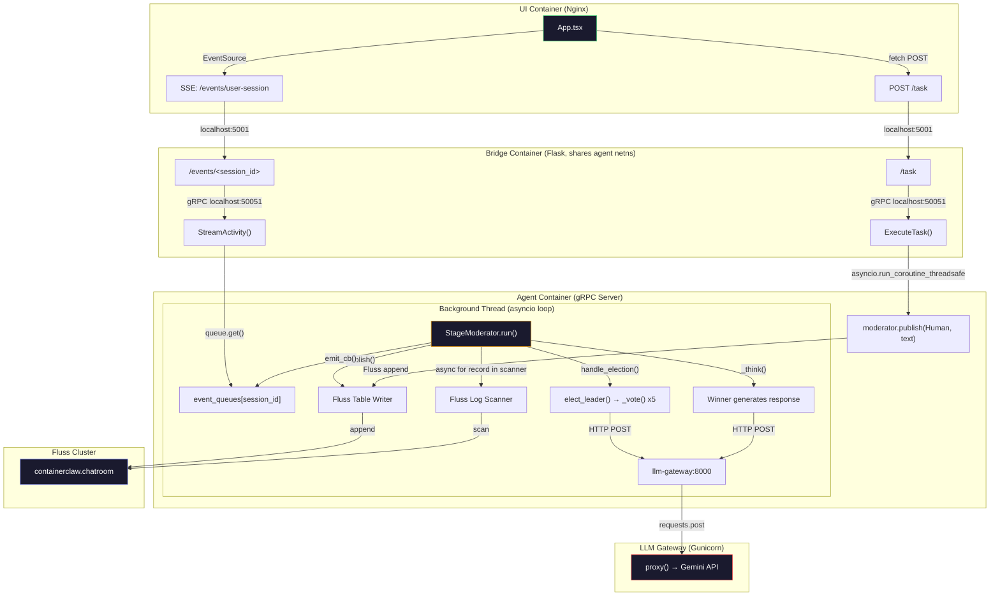
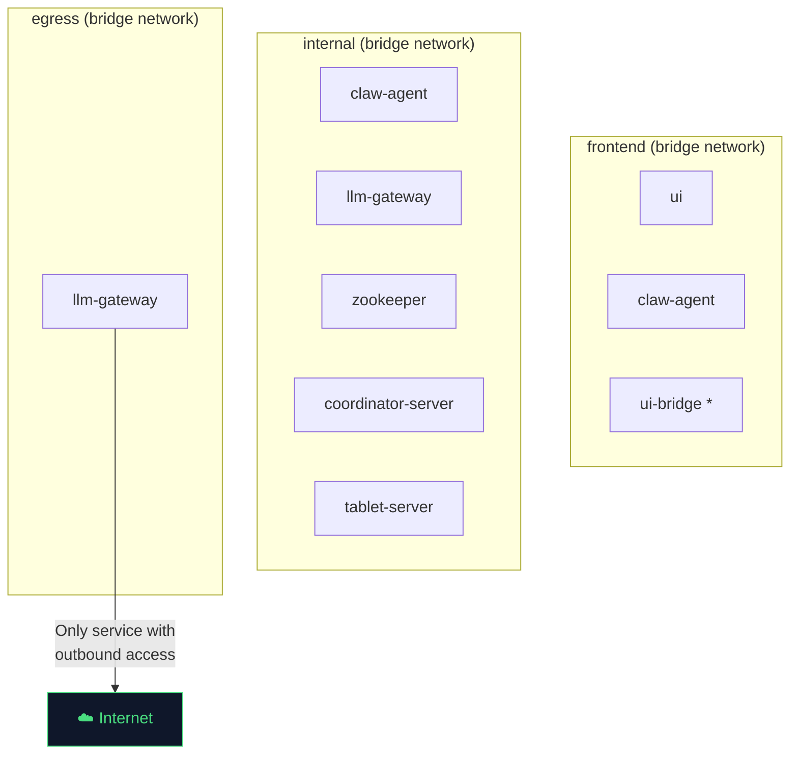

# ContainerClaw — Draft Pt.5: Full System Audit & Migration Roadmap

> **Complementary to:** [draft.md](file:///.../containerclaw/docs/draft.md) through [draft_pt4.md](file:///.../containerclaw/docs/draft_pt4.md)  
> **Focus:** Docker topology deep-dive, inter-service wiring, gap analysis vs. working POC, and a rigorous migration plan  
> **Version:** 0.1.0-draft-pt5  
> **Date:** 2026-03-18  

---

## 1. System Overview: What Exists Today

ContainerClaw is a multi-agent collaboration platform where AI agents (powered by Gemini) communicate through a shared Apache Fluss event stream, orchestrated by a "Stage Moderator" that runs democratic elections to decide who speaks next. The system is fully containerized via Docker Compose.

**There are two implementations of this system:**

| Dimension | Working Notebook POC | Dockerized ContainerClaw |
|---|---|---|
| **Location** | `fluss-notes/multi_agent_stage.ipynb` + `multi_agent_human.ipynb` | `containerclaw/` (7 Docker services) |
| **Status** | ✅ Works end-to-end | ⚠️ Partially migrated, hitting walls |
| **LLM Calls** | Direct to `generativelanguage.googleapis.com` | Proxied through `llm-gateway` |
| **Fluss Scanner** | `create_record_batch_log_scanner()` + `poll_arrow()` | `create_log_scanner()` + `async for` |
| **Autonomous Mode** | ✅ Yes (`autonomous_steps` param, -1 for infinite) | ❌ Missing — only triggers on Human input |
| **Human Input** | Separate notebook writes to Fluss directly | UI → Bridge (HTTP) → Agent (gRPC) → Fluss |
| **Job Completion** | ✅ `is_done` consensus terminates loop | ⚠️ Partial — logic exists but no loop to break |
| **Election Logging** | Full election log returned as 3-tuple | Simplified — no log string returned |

The goal is to make the Dockerized webapp produce **the exact same interactive experience** as running the two notebooks side by side.

---

## 2. Docker Compose: The Full Topology

### 2.1 Service Map

The `docker-compose.yml` defines **7 services** across **3 isolated Docker networks**, plus a `shared-tmpfs` volume and 3 Docker secrets.



### 2.2 Service-by-Service Breakdown

#### 2.2.1 `claw-agent` — The Brain

| Property | Value | Why |
|---|---|---|
| **Image** | Custom build from `agent/Dockerfile` | Compiles `fluss-rust` Python bindings from source via Maturin |
| **Ports** | `50051` (gRPC), `5001` (used by bridge) | gRPC serves `AgentService`; port 5001 is exposed because Bridge shares this network stack |
| **Networks** | `internal`, `frontend` | `internal` for Fluss + Gateway access; `frontend` for Bridge/UI access |
| **Volumes** | `./workspace:/workspace`, `./.claw_state:/state` | Persistent project files and agent state |
| **Secrets** | `gemini_api_key` | Agent reads this directly for `moderator.py` (bypasses gateway for Moderator's own API key) |
| **Key Env Vars** | `LLM_GATEWAY_URL`, `FLUSS_BOOTSTRAP_SERVERS` | Connection strings for downstream services |
| **Security** | `read_only`, `no-new-privileges`, `cap_drop: ALL` + `NET_BIND_SERVICE` | Hardened sandbox — agent can't modify its own filesystem |
| **Depends On** | `coordinator-server`, `llm-gateway` | Won't start until Fluss coordinator and LLM proxy are up |

**What it does at boot:**
1. `main.py:serve()` runs `init_infrastructure()` synchronously — connects to Fluss, creates `containerclaw.chatroom` table
2. Starts a gRPC server on port `50051`
3. `AgentService.__init__()` spawns a **background thread** that runs the `StageModerator.run()` async event loop
4. The moderator loop starts scanning the Fluss chatroom log and waits for events

#### 2.2.2 `llm-gateway` — Credential Isolation Proxy

| Property | Value | Why |
|---|---|---|
| **Image** | Custom build from `llm-gateway/Dockerfile` | Minimal Flask app |
| **Port** | `8000` | HTTP endpoint for agent API calls |
| **Networks** | `internal`, `egress` | `internal` so agents can reach it; `egress` so it can hit the public internet |
| **Secrets** | `gemini_api_key`, `anthropic_api_key`, `openai_api_key` | All LLM credentials stored here only |
| **Command** | `gunicorn -w 4 --timeout 120 --bind 0.0.0.0:8000 src.main:app` | 4 workers, 120s timeout for LLM calls |

**What it does:** Receives a JSON payload from the agent at `/v1/chat/completions`, wraps it in the Google `generateContent` format, forwards to `generativelanguage.googleapis.com`, and returns the raw response. It's a **transparent proxy** — it does NOT interpret the response.

> **Critical detail:** The gateway wraps `system_instruction` as `{"parts": [{"text": ...}]}`, which means the agent must send `system_instruction` as a **raw string**, not pre-wrapped. This is how `moderator.py` currently sends it.

#### 2.2.3 `ui-bridge` — Protocol Translator

| Property | Value | Why |
|---|---|---|
| **Image** | Custom build from `bridge/Dockerfile` | Flask app with gRPC client |
| **network_mode** | `service:claw-agent` | **Shares the claw-agent's entire network stack** |
| **Ports** | None exposed directly | It inherits port `5001` from `claw-agent`'s port mapping |
| **Depends On** | `claw-agent` | Must wait for agent to be up |

**The `network_mode: "service:claw-agent"` trick is the key mystery.** Here's what it means:



- The bridge process **runs inside the agent's network namespace**. From the bridge's perspective, `localhost:50051` IS the agent — because they share the same `localhost`.
- From the outside (e.g., the UI container), port `5001` on the agent's IP reaches the bridge, not the agent. This is why `claw-agent` exposes `5001:5001` in its port mapping: it's actually for the bridge.
- This is a tight-coupling optimization: zero network hops between bridge ↔ agent. The gRPC call from bridge to agent is a loopback call.

**What it does:**
1. **`GET /events/<session_id>`** → Opens a gRPC `StreamActivity` call to the agent, converts each `ActivityEvent` into SSE format (`text/event-stream`), and streams them to the UI
2. **`POST /task`** → Takes JSON `{prompt, session_id}`, calls gRPC `ExecuteTask` on the agent, returns status
3. **`GET /workspace/<session_id>`** → Currently stubbed out (returns empty list)

#### 2.2.4 `ui` — The Frontend

| Property | Value | Why |
|---|---|---|
| **Image** | Node build → Nginx static serve | React app built at image-build time |
| **Port** | `3000:80` | Nginx serves static assets |
| **Networks** | `frontend` | Can only reach `ui-bridge` (via `claw-agent` network) |
| **Depends On** | `ui-bridge` | Must wait for bridge to be up |

**What it does:** `App.tsx` connects to `http://localhost:5001` (the bridge) via:
- `EventSource` (SSE) for real-time event streaming from agents
- `fetch POST` for submitting user tasks
- All events are rendered in a terminal-style UI

#### 2.2.5 Fluss Cluster: `zookeeper` + `coordinator-server` + `tablet-server`



The Fluss cluster uses dual listeners:
- **INTERNAL** (`:9122`): Inter-node communication (coordinator ↔ tablet)
- **CLIENT** (`:9123`): External client connections (agent → Fluss)

The `advertised.listeners` use Docker DNS hostnames (`coordinator-server`, `tablet-server`) — this only works within the `internal` network where DNS resolution maps these hostnames to container IPs.

The `shared-tmpfs` volume at `/tmp/fluss` is used by the tablet server for data storage.

---

## 3. The Complete Data Flow

### 3.1 User Sends a Message (Happy Path)



### 3.2 How the Pieces Wire Together (Internal Detail)



---

## 4. Gap Analysis: Notebook POC vs. Dockerized Agent

This section exhaustively catalogs every behavioral difference between the working POC and the Dockerized version. Each gap must be closed to achieve feature parity.

### 4.1 Critical Gaps (Broken Behavior)

#### Gap 1: Scanner API Mismatch

| | Notebook POC | Dockerized Agent |
|---|---|---|
| **Scanner creation** | `create_record_batch_log_scanner()` | `create_log_scanner()` |
| **Subscription** | `scanner.subscribe(bucket_id=0, start_offset=0)` | `scanner.subscribe_buckets({0: 0})` |
| **Polling** | `scanner.poll_arrow(timeout_ms=500)` in a `while True` loop | `async for record in scanner` (blocks forever) |

**Impact:** The notebook's `poll_arrow()` returns a `RecordBatch` that can have 0+ rows, allowing the moderator to intermix polling with autonomous-turn logic. The Dockerized `async for` blocks until a record arrives — it **cannot drive autonomous turns** because it never yields control between agent responses.

**Fix:** Switch the Dockerized moderator to use `create_record_batch_log_scanner()` with `poll_arrow()`, matching the notebook exactly.

#### Gap 2: No Autonomous Mode

The notebook's `StageModerator.run()` accepts `autonomous_steps` (default 0, -1 for infinite). After a human message or an agent response, it can **continue running elections** without waiting for new human input.

The Dockerized `StageModerator.run()` only triggers elections when `row['actor_id'] == "Human"`. After one agent responds, the loop waits for the **next** Fluss record — which will be the agent's own response. But since agent responses (non-Human `actor_id`) don't trigger elections, the system **stops after one round**.

**Fix:** Port the autonomous mode logic from the notebook, including:
- The `autonomous_steps` parameter
- The `current_steps` counter with human-interrupt reset
- The control flow that triggers elections on autonomous turns

#### Gap 3: Duplicate `_vote` Method

`moderator.py` lines 49–65 and lines 67–81 define `_vote` **twice**. The second definition overwrites the first. This is likely a copy-paste artifact from iterating in the notebook. The second version drops the Markdown-backtick stripping logic.

**Fix:** Remove the first `_vote` definition (lines 49–65) and keep the second one (lines 67–81), which is the more refined version.

#### Gap 4: Missing `random` Import

`moderator.py` line 144 and line 176 call `random.choice(winners)` but `random` is never imported.

**Fix:** Add `import random` at the top of `moderator.py`.

#### Gap 5: Duplicate Election Logic

`StageModerator` has both `elect_leader()` (lines 117–144) and `handle_election()` (lines 146–189). They implement the same 3-round election with slightly different structures. `handle_election()` is the one actually called. `elect_leader()` is dead code.

**Fix:** Remove `elect_leader()` and unify into the notebook's version of `elect_leader()` which returns a proper 3-tuple `(winner, election_log, is_job_done)`.

### 4.2 Functional Gaps (Missing Features)

#### Gap 6: No Election Log in History

The notebook publishes a full election summary to `all_messages` (in-memory, NOT Fluss):
```python
self.all_messages.append({"actor_id": "Moderator", "content": f"Election Summary:\n{election_log}"})
```

The Dockerized version calls `emit_cb()` for each round's tally but does NOT add election context to the message history. This means agents lose visibility into **why** a particular agent was chosen — degrading the quality of subsequent conversations.

**Fix:** After each election, append the election summary to `all_messages` (not Fluss — matching the notebook pattern).

#### Gap 7: No `is_done` Termination Consensus

The notebook's `elect_leader()` returns `is_job_done` and the `run()` loop calls `break` on consensus. The Dockerized version has partial code for `is_done` in individual votes but never aggregates them into a `done_count == len(agents)` check that terminates the loop.

**Fix:** Port the `is_done` consensus logic from the notebook's `elect_leader()`.

#### Gap 8: Writer Lifecycle

The notebook creates **one writer** in `__init__` and reuses it:
```python
self.writer = table.new_append().create_writer()
```

The Dockerized version creates a **new writer per publish**:
```python
writer = self.table.new_append().create_writer()
```

This is potentially inefficient and may cause connection churn, but it's functionally correct. Not a breaking issue, but worth aligning.

#### Gap 9: Gateway URL Construction

`GeminiAgent.__init__` in `moderator.py` sets:
```python
self.gateway_url = os.getenv("LLM_GATEWAY_URL", "http://llm-gateway:8000/v1/chat/completions")
```

But the `_call_gateway()` method posts directly to `self.gateway_url`. If the env var `LLM_GATEWAY_URL` is set to just `http://llm-gateway:8000` (as in `docker-compose.yml`), the path `/v1/chat/completions` is missing.

**Fix:** Ensure the URL construction always includes the path:
```python
url = f"{os.getenv('LLM_GATEWAY_URL', 'http://llm-gateway:8000')}/v1/chat/completions"
```

### 4.3 UI/UX Gaps

#### Gap 10: Event Type Mapping

The UI recognizes event types: `thought`, `action`, `error`, `finish`, `user`, `system`.
The moderator emits: `thought` (election info) and `output` (agent messages).

The `output` type is NOT handled by the UI's status logic — it won't change status from "Thinking..." to "Idle" because nothing emits `finish`.

**Fix:** The moderator should emit a `finish` event after each election cycle completes, so the UI can reset its status indicator.

#### Gap 11: No Per-Agent Visual Identity

The notebook prints `[Alice]`, `[Bob]`, etc. with clear attribution. The UI's terminal view shows `[OUTPUT]` for everything with the content `[Alice] ...` embedded in the string. There's no color-coding or agent avatar system.

**Fix (future):** Extend the `ActivityEvent` proto with an `actor_id` field and update the UI to render agent-specific colors/badges.

---

## 5. Migration Roadmap: Notebook → Dockerized Parity

### Phase 1: Fix the Core Loop (Critical — Must Do First)

These changes fix the fundamental event loop so the system can actually run multi-turn conversations.

#### Step 1.1: Align `moderator.py` with the Notebook's `StageModerator`

**File:** [moderator.py](file:///.../containerclaw/agent/src/moderator.py)

**Defense:** The notebook POC works. The Dockerized moderator deviates from it in 7+ ways. The safest migration strategy is to port the notebook's classes **wholesale**, adapting only the LLM call path (gateway vs. direct API).

Changes required:
1. Add `import random` (fixes crash on tie-breaking)
2. Remove duplicate `_vote` method (lines 49–65)
3. Replace `_call_gateway` to properly construct URL from env var
4. Replace `StageModerator.run()` with the notebook's version, adapted for:
   - `create_record_batch_log_scanner()` + `poll_arrow()` instead of `async for`
   - `autonomous_steps` parameter
   - `current_steps` counter with human-interrupt reset
5. Replace `handle_election()` / `elect_leader()` with the notebook's unified `elect_leader()` that returns `(winner, election_log, is_job_done)`
6. Add election summary to `all_messages` history
7. Add `is_done` consensus check
8. Keep the `emit_cb` integration for UI streaming

#### Step 1.2: Update `main.py` to Pass Through Autonomous Config

**File:** [main.py](file:///.../containerclaw/agent/src/main.py)

Changes:
1. Add `AUTONOMOUS_STEPS` env var (defaulting to `-1` for infinite)
2. Pass it to `moderator.run(agents, autonomous_steps=...)` instead of just `moderator.run()`
3. Reuse the Fluss table writer (create once in `AgentService.__init__`, pass to moderator)

#### Step 1.3: Fix Gateway URL Construction

**File:** [moderator.py](file:///.../containerclaw/agent/src/moderator.py)

Change `GeminiAgent.__init__`:
```python
self.gateway_url = f"{os.getenv('LLM_GATEWAY_URL', 'http://llm-gateway:8000')}/v1/chat/completions"
```

This ensures the full path is always present regardless of the env var value.

### Phase 2: UI Parity (Usability)

#### Step 2.1: Add `finish` Events

After each election cycle completes (agent responds OR consensus is "done"), emit:
```python
self.emit_cb("Moderator", "Cycle complete.", "finish")
```

This resets the UI status from "Thinking..." back to "Idle".

#### Step 2.2: Enrich the Event Stream

Currently `_bridge_to_ui` formats content as `[{actor_id}] {content}`. To enable per-agent styling in the future, consider adding `actor_id` as a separate field in the proto:

```protobuf
message ActivityEvent {
  string timestamp = 1;
  string type = 2;
  string content = 3;
  float risk_score = 4;
  string actor_id = 5;  // NEW: enables per-agent UI rendering
}
```

### Phase 3: Docker Compose Adjustments (If Needed)

#### Step 3.1: Add Autonomous Mode Env Var

```yaml
claw-agent:
  environment:
    - AUTONOMOUS_STEPS=${AUTONOMOUS_STEPS:--1}
```

#### Step 3.2: Verify Fluss Listener Config

The current listener configuration uses both `INTERNAL` and `CLIENT` listeners with Docker DNS hostnames. This is correct for intra-cluster communication. However, if you ever need to connect from **outside Docker** (e.g., for debugging), you'll need an additional `EXTERNAL` listener.

---

## 6. File-Level Change Summary

| File | Change | Rationale |
|---|---|---|
| `agent/src/moderator.py` | Major rewrite — port notebook's `StageModerator` and `GeminiAgent` | Core loop is fundamentally broken without `poll_arrow()` + autonomous mode |
| `agent/src/main.py` | Add `AUTONOMOUS_STEPS` env var, pass to moderator | Enable configurable autonomous behavior |
| `docker-compose.yml` | Add `AUTONOMOUS_STEPS` env var | Externalize configuration |
| `proto/agent.proto` | Add `actor_id` to `ActivityEvent` (Phase 2) | Enable rich UI rendering |
| `bridge/src/bridge.py` | Forward new `actor_id` field (Phase 2) | Propagate new proto field |
| `ui/src/App.tsx` | Add per-agent styling (Phase 2) | Visual parity with notebook output |
| `ui/src/api.ts` | Add `actor_id` to `ActivityEvent` interface (Phase 2) | TypeScript type alignment |

---

## 7. Verification Plan

### 7.1 Smoke Test
1. `docker compose down -v && docker compose up --build`
2. Wait for `🚀 Agent gRPC Server Online on port 50051` in logs
3. Open `http://localhost:3000`
4. Type "make a tic tac toe game"
5. **Expected:** Election logs appear as `[THOUGHT]` events, then an agent response appears as `[OUTPUT]`, followed by autonomous continuation without further human input

### 7.2 Autonomous Turn Validation
1. After the first agent responds, verify the system continues with another election cycle **without** typing anything
2. The terminal should show at least 3 autonomous turns (Alice → Bob → Carol, etc.)
3. Verify election tally logs are visible in the UI

### 7.3 Human Interrupt Test
1. During autonomous operation, type a follow-up message
2. **Expected:** The autonomous step counter resets, the system processes the human message, then resumes autonomous turns

### 7.4 Job Completion Test
1. Issue a simple task and let it run autonomously
2. **Expected:** Eventually all agents vote `is_done: true`, the loop terminates, and a `[FINISH]` event appears in the UI

---

## 8. Appendix: Network Topology Deep Dive

### 8.1 Why Three Networks?



*\* `ui-bridge` has no network of its own — it inherits `claw-agent`'s stack via `network_mode: service:claw-agent`*

**Security rationale:**
- **`frontend`**: Only the UI and agent are here. The UI cannot directly reach Fluss, ZooKeeper, or the LLM Gateway
- **`internal`**: All backend services communicate here. No internet access
- **`egress`**: **Only** the LLM Gateway gets internet access. The agent container itself is air-gapped from the internet — all LLM calls must go through the gateway proxy

This is a defense-in-depth model: even if an agent prompt-injection attack crafts a malicious HTTP request, the agent container **has no route to the internet**. The gateway acts as an application-layer firewall.

### 8.2 The Bridge Network Trick (Explained Simply)

Normally in Docker, each container gets its own IP address and network namespace. When you set `network_mode: "service:claw-agent"` on the bridge, Docker says:

> "Don't give ui-bridge its own IP. Instead, let it share claw-agent's IP address and ports."

So if `claw-agent` has IP `172.18.0.5`:
- `claw-agent` listens on `172.18.0.5:50051` (gRPC)
- `ui-bridge` listens on `172.18.0.5:5001` (HTTP/SSE)
- From the bridge's code, `localhost:50051` reaches the agent (same machine, same IP)
- From the UI's perspective, both ports appear on the same host

This means:
- **Zero network overhead** for bridge ↔ agent communication
- The bridge is **tightly coupled** to the agent — if the agent container restarts, the bridge restarts too
- Port `5001` in `claw-agent`'s `ports:` section is actually the bridge's Flask server, not anything in the agent code
