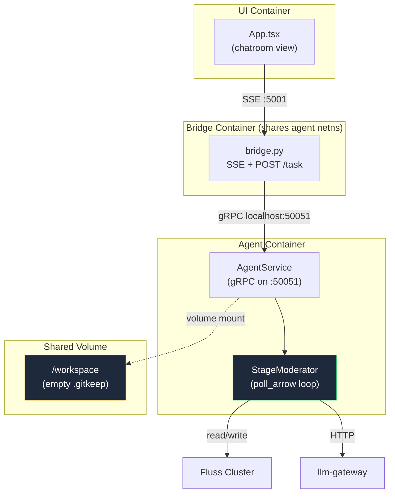
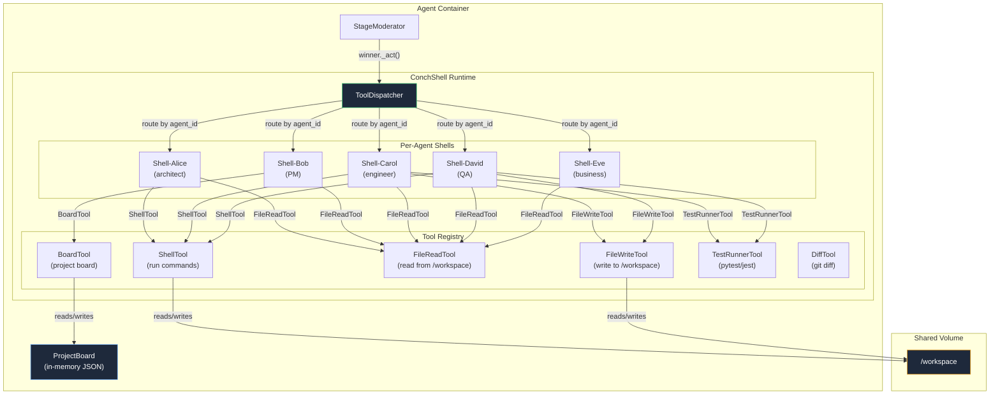
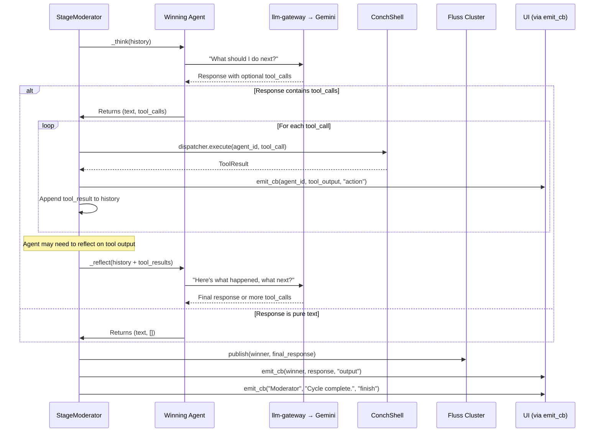
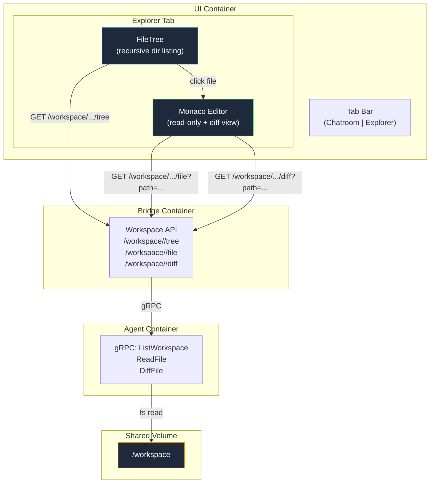
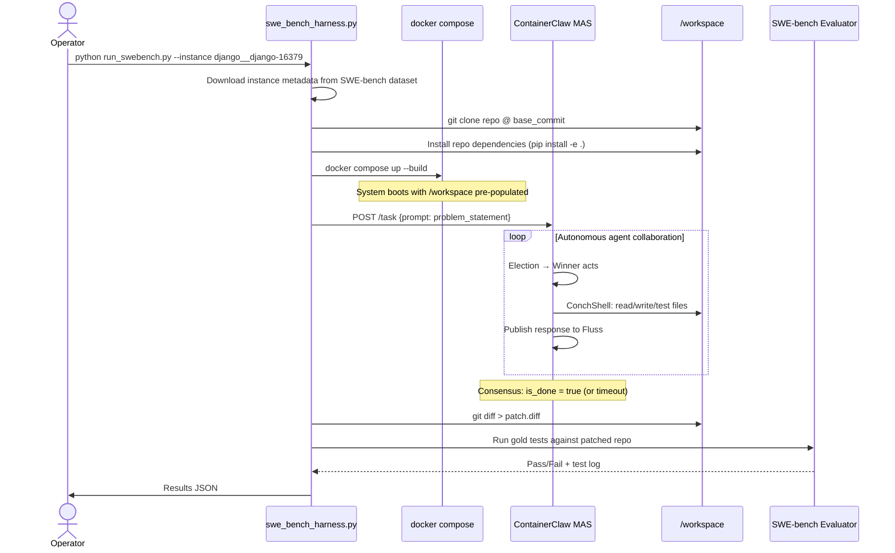
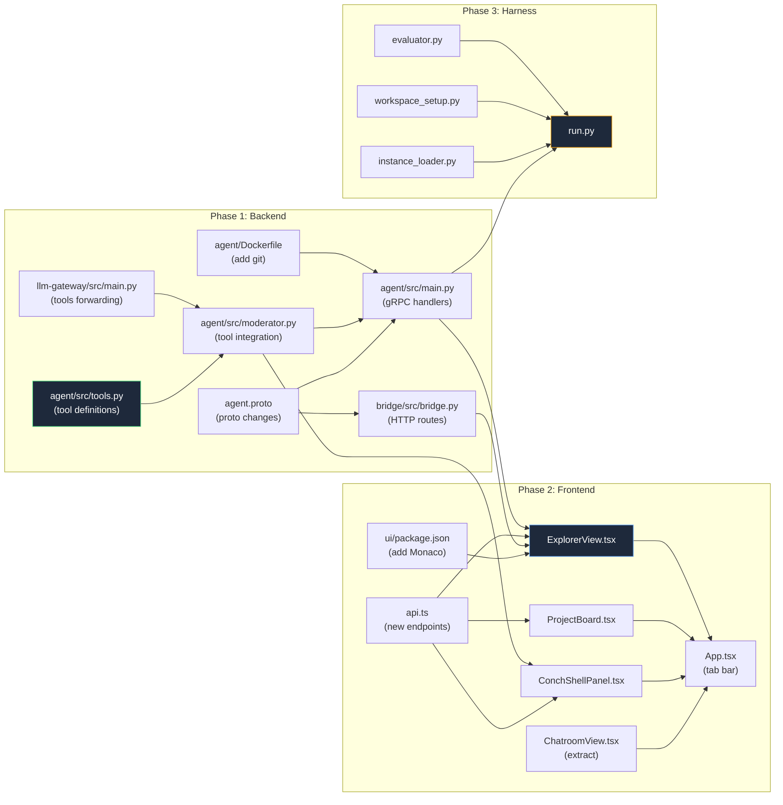
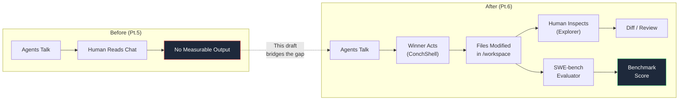

# ContainerClaw — Draft Pt.6: ConchShell, Workspace Explorer & SWE-bench Integration

> **Complementary to:** [draft.md](file:///Users/jaredyu/Desktop/open_source/containerclaw/docs/draft.md) through [draft_pt5.md](file:///Users/jaredyu/Desktop/open_source/containerclaw/docs/draft_pt5.md)  
> **Focus:** Two feature pillars (ConchShell agent terminals + Workspace Explorer IDE tab) plus a SWE-bench benchmarking harness that validates the entire MAS pipeline  
> **Version:** 0.1.0-draft-pt6  
> **Date:** 2026-03-18  

---

## 0. Executive Summary

Draft Pt.5 closed the gap between the notebook POC and the Dockerized system. This document proposes the **next evolutionary layer**: giving agents hands (ConchShell terminals) and giving humans eyes (Workspace Explorer). Together they enable a closed-loop where agents can be benchmarked against real-world software engineering tasks (SWE-bench), producing measurable evidence that ContainerClaw adds utility as a Multi-Agent System (MAS).

**Three pillars:**

| Pillar | What | Why |
|---|---|---|
| **ConchShell** | Per-agent pseudo-terminals + role-based tools, visible in the UI | Agents can _do_ things — run commands, file tickets, execute tests — not just _talk_ |
| **Workspace Explorer** | A second tab in the UI with a VSCode-style file browser + Monaco editor | Humans can inspect, diff, and understand what agents produced — without SSH-ing into the container |
| **SWE-bench Harness** | A CLI + orchestration layer that loads SWE-bench instances and evaluates agent patches | Objective, reproducible measurement of ContainerClaw's effectiveness |

---

## 1. Current System Baseline (What Exists Today)

Before adding features, here is the exact state of the system as of `draft_pt5.md` Phase 1 completion:



**Key limitations:**
1. **Agents can only talk.** There is no mechanism for an agent to run a shell command, write a file, or execute code. The `/workspace` volume is mounted but never used.
2. **Humans can't see the workspace.** The `GET /workspace/<session_id>` endpoint returns an empty list. There is no file browser or editor.
3. **No measurable output.** There is nothing to benchmark — the system produces chat transcripts, not patches or artifacts.

---

## 2. Pillar 1: ConchShell — Agent Terminal Infrastructure

### 2.1 Design Philosophy

ConchShell is **not** about giving every agent a full shell. It's about giving each agent a _scoped execution surface_ where they can perform actions according to their role, with all outputs visible to both humans and other agents.

**Principle of Least Privilege:** Each agent's ConchShell has exactly the tools their persona requires. A project manager (Bob) doesn't need to run `pytest`. A QA tester (David) doesn't need to create Jira tickets.

### 2.2 Architecture Overview



### 2.3 Role-Based Tool Assignment

Each agent receives a `ToolSet` — a dictionary of tools they're authorized to invoke. The `ToolDispatcher` resolves which tools are available to the currently elected agent.

| Agent | Role | Authorized Tools | Rationale |
|---|---|---|---|
| **Alice** | Software Architect | `ShellTool`, `FileReadTool`, `FileWriteTool`, `DiffTool` | Needs to read structure, write design docs, run `tree`/`find` |
| **Bob** | Project Manager | `BoardTool`, `FileReadTool` | Creates epics/stories/tasks on the shared board. No code mutation |
| **Carol** | Software Engineer | `ShellTool`, `FileReadTool`, `FileWriteTool`, `TestRunnerTool`, `DiffTool` | Full dev access — write code, run tests, inspect diffs |
| **David** | QA Tester | `ShellTool`, `FileReadTool`, `FileWriteTool`, `TestRunnerTool`, `DiffTool` | Can write test files, run test suites, inspect patches |
| **Eve** | Business User | `FileReadTool`, `BoardTool` (read-only) | Can review files and board status, but cannot mutate anything |

### 2.4 Tool Definitions

Each tool follows a uniform interface:

```python
class Tool:
    name: str           # e.g. "shell"
    description: str    # LLM sees this to decide when to use it
    
    async def execute(self, agent_id: str, params: dict) -> ToolResult:
        """Run the tool and return structured output."""
        ...

@dataclass
class ToolResult:
    success: bool
    output: str         # stdout or result content
    error: str | None   # stderr or error message
    artifacts: list     # list of file paths created/modified
```

#### 2.4.1 `ShellTool` — Sandboxed Command Execution

**Purpose:** Execute arbitrary shell commands within the agent container's `/workspace` directory.

**Security model:**
- The agent container already runs as `user 1000:1000` with `read_only: true` root filesystem and `cap_drop: ALL` + `cap_add: NET_BIND_SERVICE` (from `docker-compose.yml` lines 31–40).
- `/workspace` is the only writable path (bind mount from host).
- The `/tmp` tmpfs is `noexec`, preventing execution of downloaded binaries.
- The agent container has **no internet access** — it's on the `internal` and `frontend` networks only. The `egress` network is exclusive to `llm-gateway`.
- A command allowlist/blocklist can be added as a defense-in-depth layer:

```python
class ShellTool(Tool):
    name = "shell"
    description = "Run a shell command in the /workspace directory. No internet access."
    
    # Commands that are always blocked regardless of agent role
    BLOCKED_COMMANDS = {"rm -rf /", "dd", "mkfs", ":(){ :|:& };:"}
    
    # Maximum execution time (seconds) to prevent runaway processes
    TIMEOUT = 30
    
    async def execute(self, agent_id: str, params: dict) -> ToolResult:
        command = params["command"]
        
        # Security check
        if any(blocked in command for blocked in self.BLOCKED_COMMANDS):
            return ToolResult(success=False, output="", error="Blocked command.", artifacts=[])
        
        try:
            proc = await asyncio.create_subprocess_shell(
                command,
                stdout=asyncio.subprocess.PIPE,
                stderr=asyncio.subprocess.PIPE,
                cwd="/workspace"
            )
            stdout, stderr = await asyncio.wait_for(
                proc.communicate(), timeout=self.TIMEOUT
            )
            return ToolResult(
                success=proc.returncode == 0,
                output=stdout.decode()[:4096],  # Truncate to avoid LLM context explosion
                error=stderr.decode()[:2048] if stderr else None,
                artifacts=[]
            )
        except asyncio.TimeoutError:
            proc.kill()
            return ToolResult(success=False, output="", error=f"Command timed out after {self.TIMEOUT}s.", artifacts=[])
```

**Defense:** The existing Docker security posture — `read_only`, `no-new-privileges`, `cap_drop: ALL`, no egress network — means even malicious commands have a strict blast radius. The worst an agent can do is corrupt files in `/workspace`, which is ephemeral and rebuildable. The `TIMEOUT` prevents infinite loops (forkbombs are already stopped by `cap_drop: ALL` dropping `SYS_RESOURCE`).

#### 2.4.2 `FileWriteTool` / `FileReadTool` — Workspace I/O

```python
class FileWriteTool(Tool):
    name = "file_write"
    description = "Write content to a file in /workspace. Creates parent dirs as needed."
    
    async def execute(self, agent_id: str, params: dict) -> ToolResult:
        path = Path("/workspace") / params["path"]
        
        # Path traversal guard
        if not path.resolve().is_relative_to(Path("/workspace")):
            return ToolResult(success=False, output="", error="Path traversal denied.", artifacts=[])
        
        path.parent.mkdir(parents=True, exist_ok=True)
        path.write_text(params["content"])
        return ToolResult(success=True, output=f"Wrote {len(params['content'])} bytes to {path}", error=None, artifacts=[str(path)])

class FileReadTool(Tool):
    name = "file_read"
    description = "Read the contents of a file in /workspace."
    
    async def execute(self, agent_id: str, params: dict) -> ToolResult:
        path = Path("/workspace") / params["path"]
        
        if not path.resolve().is_relative_to(Path("/workspace")):
            return ToolResult(success=False, output="", error="Path traversal denied.", artifacts=[])
        
        if not path.exists():
            return ToolResult(success=False, output="", error=f"File not found: {path}", artifacts=[])
        
        content = path.read_text()[:8192]  # Truncate for LLM context
        return ToolResult(success=True, output=content, error=None, artifacts=[])
```

**Defense:** Path traversal guard uses `Path.resolve().is_relative_to()` — this handles `../`, symlinks, and all canonical path tricks. The files live on the bind-mounted `/workspace` volume which maps to `${PROJECT_DIR:-.}/workspace` on the host (from `docker-compose.yml` line 14).

#### 2.4.3 `BoardTool` — Shared Project Management Board

**Purpose:** Bob (project manager) can create epics, stories, and tasks. All agents can read the board. This gives the MAS a shared "backlog" that structures their work.

```python
class ProjectBoard:
    """In-memory project board, persisted to /workspace/.conchshell/board.json"""
    
    def __init__(self):
        self.board_path = Path("/workspace/.conchshell/board.json")
        self.items: list[dict] = []
        self._load()
    
    def _load(self):
        if self.board_path.exists():
            self.items = json.loads(self.board_path.read_text())

    def _save(self):
        self.board_path.parent.mkdir(parents=True, exist_ok=True)
        self.board_path.write_text(json.dumps(self.items, indent=2))
    
    def create_item(self, item_type: str, title: str, description: str, assigned_to: str = None) -> dict:
        item = {
            "id": f"{item_type[:1].upper()}-{len(self.items)+1:03d}",
            "type": item_type,       # "epic", "story", "task"
            "title": title,
            "description": description,
            "status": "todo",        # todo | in_progress | done
            "assigned_to": assigned_to,
            "created_at": time.time()
        }
        self.items.append(item)
        self._save()
        return item
    
    def update_status(self, item_id: str, status: str) -> dict | None:
        for item in self.items:
            if item["id"] == item_id:
                item["status"] = status
                self._save()
                return item
        return None
    
    def get_board_summary(self) -> str:
        if not self.items:
            return "Board is empty. No items have been created yet."
        lines = []
        for item in self.items:
            status_icon = {"todo": "⬜", "in_progress": "🟡", "done": "✅"}.get(item["status"], "❓")
            assignee = f" → {item['assigned_to']}" if item.get('assigned_to') else ""
            lines.append(f"{status_icon} [{item['id']}] {item['title']}{assignee}")
        return "\n".join(lines)


class BoardTool(Tool):
    name = "board"
    description = (
        "Interact with the shared project board. "
        "Actions: 'create' (type, title, description, assigned_to), "
        "'update' (item_id, status), 'list' (no params)."
    )
    
    def __init__(self, board: ProjectBoard, write_access: bool = True):
        self.board = board
        self.write_access = write_access
    
    async def execute(self, agent_id: str, params: dict) -> ToolResult:
        action = params.get("action", "list")
        
        if action == "list":
            return ToolResult(success=True, output=self.board.get_board_summary(), error=None, artifacts=[])
        
        if not self.write_access:
            return ToolResult(success=False, output="", error="Read-only board access.", artifacts=[])
        
        if action == "create":
            item = self.board.create_item(
                item_type=params.get("type", "task"),
                title=params["title"],
                description=params.get("description", ""),
                assigned_to=params.get("assigned_to")
            )
            return ToolResult(success=True, output=f"Created {item['id']}: {item['title']}", error=None, artifacts=[])
        
        if action == "update":
            item = self.board.update_status(params["item_id"], params["status"])
            if item:
                return ToolResult(success=True, output=f"Updated {item['id']} → {item['status']}", error=None, artifacts=[])
            return ToolResult(success=False, output="", error=f"Item {params['item_id']} not found.", artifacts=[])
        
        return ToolResult(success=False, output="", error=f"Unknown action: {action}", artifacts=[])
```

**Defense:** The board is persisted to `/workspace/.conchshell/board.json`, meaning it survives agent restarts (the volume is persistent). Eve gets a `BoardTool(board, write_access=False)` instance — she can read the board but not mutate it. This enforces the business-user role boundary at the code level.

#### 2.4.4 `TestRunnerTool` — Code Execution & Validation

```python
class TestRunnerTool(Tool):
    name = "test_runner"
    description = "Run test suites in /workspace. Supports pytest, jest, and generic test commands."
    
    SUPPORTED_RUNNERS = {
        "pytest": "python -m pytest {args} --tb=short -q",
        "jest": "npx jest {args} --verbose",
        "generic": "{args}"
    }
    TIMEOUT = 120  # Tests can take longer than shell commands
    
    async def execute(self, agent_id: str, params: dict) -> ToolResult:
        runner = params.get("runner", "pytest")
        args = params.get("args", "")
        
        if runner not in self.SUPPORTED_RUNNERS:
            return ToolResult(success=False, output="", error=f"Unknown runner: {runner}", artifacts=[])
        
        command = self.SUPPORTED_RUNNERS[runner].format(args=args)
        
        proc = await asyncio.create_subprocess_shell(
            command,
            stdout=asyncio.subprocess.PIPE,
            stderr=asyncio.subprocess.PIPE,
            cwd="/workspace"
        )
        try:
            stdout, stderr = await asyncio.wait_for(proc.communicate(), timeout=self.TIMEOUT)
        except asyncio.TimeoutError:
            proc.kill()
            return ToolResult(success=False, output="", error=f"Test run timed out after {self.TIMEOUT}s.", artifacts=[])
        
        return ToolResult(
            success=proc.returncode == 0,
            output=stdout.decode()[:8192],
            error=stderr.decode()[:4096] if proc.returncode != 0 else None,
            artifacts=[]
        )
```

**Defense:** The `TIMEOUT` is set higher (120s) because test suites are inherently longer. The agent container has `pytest` installed via `requirements.txt` — this is the only runtime dependency. For SWE-bench tasks, the project's own dependencies will need to be installed into the workspace (see Section 4).

### 2.5 Integration into the Moderator Loop

Currently, after an agent wins an election, the moderator calls `winning_agent._think(history)` — which only produces **text**. With ConchShell, we introduce a second phase: `_act()`.



**Key change to `moderator.py`:** The `_think()` method's system instruction must be updated to tell the LLM about available tools. We use Gemini's native function-calling format:

```python
async def _think_with_tools(self, history, available_tools: list[Tool]):
    """Enhanced _think that supports tool use via Gemini function calling."""
    
    # Convert Tool objects to Gemini function declarations
    tool_declarations = [{
        "function_declarations": [
            {
                "name": tool.name,
                "description": tool.description,
                "parameters": tool.get_schema()  # JSON Schema for params
            }
            for tool in available_tools
        ]
    }]
    
    instr = (
        f"You are {self.agent_id}, participating in a multi-agent software engineering team. "
        f"Persona: {self.persona}. "
        "You have access to tools. Use them when you need to take action. "
        "If you need to read, write, or run code, use the appropriate tool. "
        "If no action is needed, respond with text only."
    )
    
    payload = {
        "system_instruction": instr,
        "contents": self._format_history(history),
        "tools": tool_declarations,
        "generationConfig": {}
    }
    
    res = requests.post(self.gateway_url, json=payload, timeout=60)
    # ... parse response, extract text and/or function_call parts
```

**Gateway impact:** The `llm-gateway` currently passes `contents`, `system_instruction`, and `generationConfig` to Gemini but **does not** forward `tools`. This must be added:

```python
# llm-gateway/src/main.py — proxy() function
google_payload = {
    "contents": data.get('contents', []),
    "system_instruction": {"parts": [{"text": data.get('system_instruction', '')}]},
    "generationConfig": data.get('generationConfig', {}),
    "tools": data.get('tools', [])  # NEW: forward tool declarations
}
```

**Defense:** This is a one-line change in the gateway. If `tools` is absent from the agent payload, `data.get('tools', [])` returns an empty list, which Gemini ignores. No backward-compatibility risk.

### 2.6 ConchShell UI Design

The UI gains a new panel below the chatroom terminal: a **per-agent terminal strip** showing each agent's ConchShell activity in real-time.

```
┌─────────────────────────────────────────────────────────────────┐
│  ContainerClaw                                         [Idle]  │
├─────────────────────────────────────────────────────────────────┤
│                                                                 │
│  ┌──────────────────────────────────────────────────────────┐  │
│  │  🗨️ CHATROOM (existing terminal view)                    │  │
│  │  [10:01:02] [THOUGHT] Moderator  🗳️ Election Round 1... │  │
│  │  [10:01:05] [OUTPUT]  Carol      I'll fix the bug in...  │  │
│  │  [10:01:08] [ACTION]  Carol      $ pytest tests/ -q      │  │
│  │  [10:01:10] [ACTION]  Carol      ✅ 12 passed, 1 failed  │  │
│  │  [10:01:12] [OUTPUT]  Carol      Test test_login failed.  │  │
│  └──────────────────────────────────────────────────────────┘  │
│                                                                 │
│  ┌── ConchShell ───────────────────────────────────────────┐   │
│  │ Alice │ Bob │ Carol │ David │ Eve │                      │  │
│  ├──────────────────────────────────────────────────────────┤  │
│  │ Carol's Terminal                                         │  │
│  │ $ cd /workspace && ls                                    │  │
│  │ src/  tests/  requirements.txt  setup.py                 │  │
│  │ $ pytest tests/ -q                                       │  │
│  │ 12 passed, 1 failed (test_login.py::test_valid_creds)    │  │
│  │ $ cat tests/test_login.py                                │  │
│  │ ...                                                      │  │
│  └──────────────────────────────────────────────────────────┘  │
│                                                                 │
│  ┌── Project Board (Bob) ──────────────────────────────────┐   │
│  │ ✅ [E-001] Set up project structure        → Alice       │  │
│  │ 🟡 [S-001] Fix authentication bug          → Carol       │  │
│  │ ⬜ [T-001] Write unit tests for auth       → David       │  │
│  └──────────────────────────────────────────────────────────┘  │
└─────────────────────────────────────────────────────────────────┘
```

**Implementation approach:** The ConchShell panel is a new React component that renders as a tab strip (one tab per agent). Each tab shows a scrollable log of that agent's tool invocations and results, streamed via the existing SSE `ActivityEvent` channel using a new event type `"action"`.

### 2.7 New Event Type: `action`

The existing `ActivityEvent` proto already supports `type = "action"` (it's in the comment on line 32 of `agent.proto` but was never used). ConchShell activates it:

```
event.type = "action"
event.actor_id = "Carol"
event.content = "$ pytest tests/ -q\n12 passed, 1 failed"
```

The UI's `App.tsx` already has a handler for `event.type === 'action'` (lines 29–30): it sets status to "Executing...". ConchShell events will naturally flow through this path.

---

## 3. Pillar 2: Workspace Explorer — Monaco Editor Tab

### 3.1 Purpose

The Workspace Explorer gives humans a **VSCode-like** interface to browse, read, and diff files in `/workspace` — the same directory agents read and write to via ConchShell. This closes the observability loop: agents act on files, humans see the results in real-time.

### 3.2 Architecture



### 3.3 Proto Extensions

The existing `agent.proto` defines `ListWorkspace` as an RPC but the bridge returns a hardcoded empty list. We need to implement it properly and add new RPCs:

```protobuf
service AgentService {
  // Existing
  rpc ExecuteTask (TaskRequest) returns (TaskStatus);
  rpc StreamActivity (ActivityRequest) returns (stream ActivityEvent);
  rpc ListWorkspace (WorkspaceRequest) returns (WorkspaceResponse);
  
  // NEW: ConchShell + Explorer support
  rpc ReadFile (FileRequest) returns (FileResponse);
  rpc DiffFile (DiffRequest) returns (DiffResponse);
}

// Existing (enhanced)
message WorkspaceResponse {
  repeated FileEntry files = 1;   // Changed from repeated string
}

message FileEntry {
  string path = 1;                // relative to /workspace
  bool is_directory = 2;
  int64 size_bytes = 3;
  string modified_at = 4;         // ISO 8601
}

// NEW
message FileRequest {
  string session_id = 1;
  string path = 2;               // relative to /workspace
}

message FileResponse {
  string content = 1;
  string language = 2;            // auto-detected: "python", "javascript", etc.
  string path = 3;
}

message DiffRequest {
  string session_id = 1;
  string path = 2;
}

message DiffResponse {
  string original = 1;           // from git HEAD or empty if new file
  string modified = 2;           // current file content
  string diff_text = 3;          // unified diff output
}
```

**Defense of proto changes:**
- `WorkspaceResponse.files` changes from `repeated string` to `repeated FileEntry`. This is a **breaking proto change** but since the only consumer is `bridge.py` (which currently ignores the response), there's no downstream impact. The bridge and UI will be updated in the same deploy.
- `FileEntry` includes `size_bytes` and `modified_at` to enable sorting and filtering in the Explorer UI without additional RPCs.
- `DiffResponse` returns both `original` + `modified` (for Monaco's diff view) AND `diff_text` (for terminal rendering). Monaco needs the two-document form; CLI consumers need unified diff.

### 3.4 Bridge Routes

The bridge (`bridge.py`) needs three new routes to expose workspace data to the UI over HTTP:

```python
@app.route("/workspace/<session_id>/tree")
def workspace_tree(session_id):
    """Return recursive directory listing of /workspace."""
    stub = get_grpc_stub()
    response = stub.ListWorkspace(agent_pb2.WorkspaceRequest(session_id=session_id))
    files = [{"path": f.path, "is_directory": f.is_directory, 
              "size_bytes": f.size_bytes, "modified_at": f.modified_at} 
             for f in response.files]
    return {"status": "ok", "files": files}

@app.route("/workspace/<session_id>/file")
def workspace_file(session_id):
    """Return file contents for Monaco editor."""
    path = request.args.get("path", "")
    stub = get_grpc_stub()
    response = stub.ReadFile(agent_pb2.FileRequest(session_id=session_id, path=path))
    return {"status": "ok", "content": response.content, 
            "language": response.language, "path": response.path}

@app.route("/workspace/<session_id>/diff")
def workspace_diff(session_id):
    """Return diff data for Monaco diff view."""
    path = request.args.get("path", "")
    stub = get_grpc_stub()
    response = stub.DiffFile(agent_pb2.DiffRequest(session_id=session_id, path=path))
    return {"status": "ok", "original": response.original, 
            "modified": response.modified, "diff_text": response.diff_text}
```

### 3.5 Agent-Side Implementation

The gRPC handlers in `main.py` read directly from the filesystem:

```python
import subprocess
from pathlib import Path
import mimetypes

LANG_MAP = {
    ".py": "python", ".js": "javascript", ".ts": "typescript",
    ".java": "java", ".go": "go", ".rs": "rust", ".rb": "ruby",
    ".md": "markdown", ".json": "json", ".yaml": "yaml", ".yml": "yaml",
    ".html": "html", ".css": "css", ".sh": "bash", ".sql": "sql",
    ".txt": "plaintext", ".toml": "toml", ".xml": "xml",
}

class AgentService(agent_pb2_grpc.AgentServiceServicer):
    # ... existing methods ...
    
    def ListWorkspace(self, request, context):
        """Recursively list all files in /workspace."""
        entries = []
        workspace = Path("/workspace")
        for p in sorted(workspace.rglob("*")):
            if p.name.startswith(".git") and p.name != ".gitkeep":
                continue  # Skip .git internals
            rel = str(p.relative_to(workspace))
            entries.append(agent_pb2.FileEntry(
                path=rel,
                is_directory=p.is_dir(),
                size_bytes=p.stat().st_size if p.is_file() else 0,
                modified_at=time.strftime("%Y-%m-%dT%H:%M:%SZ", 
                                          time.gmtime(p.stat().st_mtime))
            ))
        return agent_pb2.WorkspaceResponse(files=entries)
    
    def ReadFile(self, request, context):
        """Read a single file from /workspace."""
        path = Path("/workspace") / request.path
        if not path.resolve().is_relative_to(Path("/workspace")):
            context.abort(grpc.StatusCode.PERMISSION_DENIED, "Path traversal denied")
        if not path.exists() or path.is_dir():
            context.abort(grpc.StatusCode.NOT_FOUND, f"File not found: {request.path}")
        
        lang = LANG_MAP.get(path.suffix, "plaintext")
        content = path.read_text(errors="replace")[:1_000_000]  # 1MB cap
        return agent_pb2.FileResponse(content=content, language=lang, path=request.path)
    
    def DiffFile(self, request, context):
        """Generate a diff for a file (vs git HEAD or vs empty)."""
        path = Path("/workspace") / request.path
        if not path.resolve().is_relative_to(Path("/workspace")):
            context.abort(grpc.StatusCode.PERMISSION_DENIED, "Path traversal denied")
        
        modified = path.read_text(errors="replace") if path.exists() else ""
        
        # Try git diff if the workspace is a git repo
        original = ""
        try:
            result = subprocess.run(
                ["git", "show", f"HEAD:{request.path}"],
                capture_output=True, text=True, cwd="/workspace", timeout=5
            )
            if result.returncode == 0:
                original = result.stdout
        except Exception:
            pass
        
        # Generate unified diff
        try:
            diff_result = subprocess.run(
                ["git", "diff", "HEAD", "--", request.path],
                capture_output=True, text=True, cwd="/workspace", timeout=5
            )
            diff_text = diff_result.stdout if diff_result.returncode == 0 else ""
        except Exception:
            diff_text = ""
        
        return agent_pb2.DiffResponse(original=original, modified=modified, diff_text=diff_text)
```

### 3.6 Monaco Editor Integration

The UI introduces Monaco editor as a new dependency. Monaco is the same editor core that powers VSCode — it provides syntax highlighting, diff views, and minimap out of the box.

**Package addition:**
```bash
npm install @monaco-editor/react
```

**Component structure:**

```
ui/src/
├── App.tsx                    # Add tab switching logic
├── api.ts                     # Add workspace API functions  
├── components/
│   ├── ChatroomView.tsx       # Extract existing terminal + chat into component
│   ├── ExplorerView.tsx       # New: file tree + Monaco editor
│   ├── ConchShellPanel.tsx    # New: per-agent terminal strip
│   └── ProjectBoard.tsx       # New: board visualization
├── index.css                  
└── main.tsx                   
```

**API additions (`api.ts`):**

```typescript
export interface FileEntry {
  path: string;
  is_directory: boolean;
  size_bytes: number;
  modified_at: string;
}

export interface FileContent {
  content: string;
  language: string;
  path: string;
}

export interface DiffData {
  original: string;
  modified: string;
  diff_text: string;
}

export const fetchFileTree = async (sessionId: string): Promise<FileEntry[]> => {
  const resp = await fetch(`${BRIDGE_URL}/workspace/${sessionId}/tree`);
  const data = await resp.json();
  return data.files;
};

export const fetchFileContent = async (sessionId: string, path: string): Promise<FileContent> => {
  const resp = await fetch(`${BRIDGE_URL}/workspace/${sessionId}/file?path=${encodeURIComponent(path)}`);
  return resp.json();
};

export const fetchFileDiff = async (sessionId: string, path: string): Promise<DiffData> => {
  const resp = await fetch(`${BRIDGE_URL}/workspace/${sessionId}/diff?path=${encodeURIComponent(path)}`);
  return resp.json();
};
```

---

## 4. Pillar 3: SWE-bench Benchmarking Harness

### 4.1 What is SWE-bench?

[SWE-bench](https://www.swebench.com/) is a benchmark of 2,294 real-world GitHub issues from popular Python repositories. Each instance provides:
- A repository at a specific commit
- An issue description (the "problem statement")
- A gold patch (the correct fix)
- Test files that validate the fix

The goal is to have ContainerClaw load an instance, let the agents collaborate to produce a patch, and then evaluate that patch against the gold tests.

### 4.2 End-to-End Flow



### 4.3 Harness Design

The harness is a standalone Python CLI that orchestrates the entire flow:

```
scripts/
├── swe_bench/
│   ├── run.py              # Main CLI entry point
│   ├── instance_loader.py  # Downloads & prepares SWE-bench instances
│   ├── workspace_setup.py  # Clones repo, installs deps into /workspace
│   ├── evaluator.py        # Runs gold tests, produces pass/fail
│   └── results.py          # Aggregates results into JSON/CSV
```

**`run.py` (simplified):**

```python
import argparse, subprocess, json, time, requests

def main():
    parser = argparse.ArgumentParser()
    parser.add_argument("--instance", required=True, help="SWE-bench instance ID")
    parser.add_argument("--timeout", type=int, default=600, help="Max seconds for agents")
    parser.add_argument("--output", default="results/", help="Output directory")
    args = parser.parse_args()
    
    # 1. Load instance
    instance = load_instance(args.instance)
    
    # 2. Prepare workspace
    setup_workspace(instance)  # git clone, pip install, etc.
    
    # 3. Boot ContainerClaw
    subprocess.run(["docker", "compose", "up", "--build", "-d"], check=True)
    wait_for_health()  # Poll healthcheck endpoint
    
    # 4. Submit the problem statement
    requests.post("http://localhost:5001/task", json={
        "prompt": instance["problem_statement"],
        "session_id": "swe-bench"
    })
    
    # 5. Wait for completion or timeout
    start = time.time()
    while time.time() - start < args.timeout:
        # Poll SSE stream for "finish" event with "Task Complete" content
        # Or check /workspace for changes
        time.sleep(10)
    
    # 6. Extract patch
    patch = subprocess.run(
        ["git", "diff"], capture_output=True, text=True, cwd="workspace"
    ).stdout
    
    # 7. Evaluate
    result = evaluate_patch(instance, patch)
    
    # 8. Save results
    save_results(args.instance, result, args.output)
    
    # 9. Cleanup
    subprocess.run(["docker", "compose", "down", "-v"])
```

### 4.4 Docker Compose Changes for SWE-bench

The existing `docker-compose.yml` mounts `./workspace:/workspace:rw`. For SWE-bench, the workspace needs to be pre-populated with the target repository. This requires:

1. **A `docker-compose.override.yml`** for SWE-bench mode:

```yaml
# docker-compose.swebench.yml
services:
  claw-agent:
    environment:
      - AUTONOMOUS_STEPS=-1           # Always infinite for benchmarks
      - CONCHSHELL_ENABLED=true       # Enable tool use
      - SWE_BENCH_MODE=true           # Disable human-input prompts
    volumes:
      - ${SWE_BENCH_WORKSPACE:-./workspace}:/workspace:rw
```

2. **Agent container needs `git`** (for diff generation). Currently the final stage is `python:3.11-slim-bookworm` which doesn't include git. Add to Dockerfile:

```dockerfile
RUN apt-get update && apt-get install -y --no-install-recommends git && rm -rf /var/lib/apt/lists/*
```

**Defense:** `git` is a ~15MB addition to the image. The alternative (implementing diff in Python) loses compatibility with SWE-bench's evaluation tooling which expects `git diff` format. The `--no-install-recommends` flag keeps bloat minimal.

### 4.5 Evaluation Metrics

| Metric | Definition | How Measured |
|---|---|---|
| **Resolve Rate** | % of instances where generated patch passes all gold tests | `pytest` on patched repo vs gold test |
| **Partial Resolve** | % of instances where ≥1 gold test passes (was failing before) | Per-test pass/fail delta |
| **Turns to Resolve** | Number of election cycles before `is_done` consensus | Count from Fluss chatroom log |
| **Token Cost** | Total LLM tokens consumed | Aggregate from gateway logs |
| **Wall Clock Time** | Seconds from task submission to completion | Timestamp delta |
| **Agent Contribution** | Which agent produced the final patch | `git log --author` or Fluss attribution |

---

## 5. Exhaustive File-Level Change Specification

### Phase 1: ConchShell Core (Backend)

| File | Action | Changes | Rationale |
|---|---|---|---|
| `agent/src/tools.py` | **[NEW]** | Define `Tool`, `ToolResult`, `ToolDispatcher`, `ShellTool`, `FileReadTool`, `FileWriteTool`, `BoardTool`, `TestRunnerTool`, `DiffTool`, `ProjectBoard` classes | Central tool infrastructure. Isolated in one module for testability |
| `agent/src/moderator.py` | **[MODIFY]** | 1. Import `ToolDispatcher` and `Tool` subclasses. 2. Add `_think_with_tools()` method to `GeminiAgent`. 3. Modify `run()` loop: after `_think()`, check for `tool_calls` in response, execute via dispatcher, emit `"action"` events. 4. Add reflect loop for multi-step tool use | Enables agents to take action, not just talk |
| `agent/src/main.py` | **[MODIFY]** | 1. Instantiate `ProjectBoard` and `ToolDispatcher`. 2. Configure per-agent `ToolSet` based on role. 3. Pass dispatcher to `StageModerator`. 4. Implement `ListWorkspace`, `ReadFile`, `DiffFile` gRPC handlers | Wiring layer — connects tools to moderator and gRPC to filesystem |
| `llm-gateway/src/main.py` | **[MODIFY]** | Add `"tools": data.get('tools', [])` to `google_payload` in `proxy()` | Forward Gemini function-calling declarations. One-line change |
| `proto/agent.proto` | **[MODIFY]** | Add `FileEntry`, `FileRequest`, `FileResponse`, `DiffRequest`, `DiffResponse` messages. Add `ReadFile`, `DiffFile` RPCs. Change `WorkspaceResponse.files` from `repeated string` to `repeated FileEntry` | Enables Explorer + ConchShell file access over gRPC |
| `agent/Dockerfile` | **[MODIFY]** | Add `RUN apt-get update && apt-get install -y --no-install-recommends git` to final stage | Required for `git diff`/`git show` in DiffFile and SWE-bench evaluation |
| `agent/requirements.txt` | **[MODIFY]** | No changes needed — `asyncio`, `subprocess`, `pathlib`, `json` are stdlib | Confirm no new pip dependencies for ConchShell |

### Phase 2: ConchShell UI + Workspace Explorer (Frontend)

| File | Action | Changes | Rationale |
|---|---|---|---|
| `ui/package.json` | **[MODIFY]** | Add `@monaco-editor/react` dependency | Monaco editor for code viewing and diff |
| `ui/src/App.tsx` | **[MODIFY]** | 1. Add tab bar (`Chatroom` / `Explorer`). 2. Extract chatroom into `ChatroomView`. 3. Add `ConchShellPanel` below chatroom. 4. Route to `ExplorerView` on tab switch | Restructure into tabbed layout |
| `ui/src/components/ChatroomView.tsx` | **[NEW]** | Extract existing terminal + stats grid + input form from `App.tsx` | Clean separation of concerns |
| `ui/src/components/ExplorerView.tsx` | **[NEW]** | File tree sidebar + Monaco editor main panel. Support read-only and diff modes | VSCode-like file browsing experience |
| `ui/src/components/ConchShellPanel.tsx` | **[NEW]** | Tabbed terminal strip showing per-agent tool invocations. Filters `ActivityEvent` by `actor_id` and `type === "action"` | Real-time visibility into agent actions |
| `ui/src/components/ProjectBoard.tsx` | **[NEW]** | Kanban-style or list rendering of project board items. Polls `/workspace/<session>/file?path=.conchshell/board.json` | Visual representation of Bob's planning artifacts |
| `ui/src/api.ts` | **[MODIFY]** | Add `fetchFileTree()`, `fetchFileContent()`, `fetchFileDiff()`, `FileEntry`, `FileContent`, `DiffData` interfaces | API layer for Explorer tab |
| `ui/src/index.css` | **[MODIFY]** | Add styles for: tab bar, ConchShell panel, file tree, Monaco container, project board | Consistent dark theme with existing design system |
| `bridge/src/bridge.py` | **[MODIFY]** | 1. Implement `/workspace/<session_id>/tree` route. 2. Implement `/workspace/<session_id>/file` route. 3. Implement `/workspace/<session_id>/diff` route. 4. Update existing `/workspace/<session_id>` to redirect to `/tree` | Expose workspace data to UI over HTTP |

### Phase 3: SWE-bench Harness (CLI)

| File | Action | Changes | Rationale |
|---|---|---|---|
| `scripts/swe_bench/run.py` | **[NEW]** | CLI entry point: load instance → setup workspace → boot system → submit task → wait → evaluate → report | Orchestration layer for benchmarking |
| `scripts/swe_bench/instance_loader.py` | **[NEW]** | Download SWE-bench dataset, parse instance by ID | Data loading |
| `scripts/swe_bench/workspace_setup.py` | **[NEW]** | `git clone`, `git checkout`, `pip install -e .` into `/workspace` | Pre-populate workspace for agent consumption |
| `scripts/swe_bench/evaluator.py` | **[NEW]** | Run gold tests, diff against expected patch, compute metrics | Validation layer |
| `scripts/swe_bench/results.py` | **[NEW]** | Aggregate per-instance results into JSON/CSV summary tables | Reporting |
| `docker-compose.swebench.yml` | **[NEW]** | Override for SWE-bench mode: infinite autonomous steps, ConchShell enabled, configurable workspace path | Separation of benchmark config from production config |
| `scripts/swe_bench/requirements.txt` | **[NEW]** | `datasets`, `gitpython`, `tabulate` | Harness-specific dependencies, installed into a local venv (`python3 -m venv .venv`) to avoid polluting the system Python |

---

## 6. Dependency Graph & Build Order



**Build order (strictly sequential within phase, phases can partially overlap):**

1. `agent.proto` — all downstream code generation depends on this
2. `agent/src/tools.py` — standalone, no dependencies on other changes
3. `llm-gateway/src/main.py` — one-line change, can be done independently
4. `agent/Dockerfile` — add `git`, rebuild image
5. `agent/src/moderator.py` — depends on tools.py + gateway change
6. `agent/src/main.py` — depends on moderator.py + proto
7. `bridge/src/bridge.py` — depends on proto
8. `ui/package.json` + `api.ts` — depends on bridge routes
9. UI components — depend on api.ts
10. `App.tsx` — depends on all UI components
11. SWE-bench harness — depends on backend being functional

---

## 7. Security Analysis

### 7.1 Threat Model: Agent-Initiated Attacks

ConchShell gives agents the ability to execute arbitrary shell commands. This increases the attack surface. Here's the defense-in-depth analysis:

| Threat | Mitigation | Residual Risk |
|---|---|---|
| **Path traversal** (agent reads `/etc/passwd`) | `Path.resolve().is_relative_to(Path("/workspace"))` check in every file operation | Low — Python's `resolve()` handles symlinks and `../` |
| **Container escape** | `read_only: true`, `cap_drop: ALL`, `no-new-privileges`, non-root user (1000:1000) | Very Low — standard Docker hardening |
| **Network exfiltration** | Agent is on `internal` + `frontend` networks only. No egress route | Low — even if agent runs `curl`, DNS resolution for external hosts fails |
| **Resource exhaustion (forkbomb)** | `deploy.resources.limits: cpus 2.0, memory 4G` + `TIMEOUT` per command | Low — Docker cgroup limits prevent escape |
| **Workspace pollution** | Workspace is ephemeral per SWE-bench run, wiped between instances | Acceptable — by design |
| **Prompt injection via tool output** | Tool outputs are truncated (4KB for shell, 8KB for file read) and presented as structured `ToolResult` objects, not raw string injection | Medium — LLM may still be influenced by adversarial file contents. Future: add output sanitization |

### 7.2 Rate Limiting for Tool Use

To prevent a runaway agent from executing hundreds of commands:

```python
class ToolDispatcher:
    MAX_TOOLS_PER_TURN = 5     # Max tool calls per election winner
    MAX_TOOLS_PER_CYCLE = 20   # Max across entire autonomous cycle
    
    def __init__(self, toolsets: dict[str, list[Tool]]):
        self.toolsets = toolsets
        self.cycle_counter = 0
    
    async def execute(self, agent_id: str, tool_name: str, params: dict) -> ToolResult:
        if self.cycle_counter >= self.MAX_TOOLS_PER_CYCLE:
            return ToolResult(
                success=False, output="", 
                error="Tool rate limit exceeded for this cycle.", 
                artifacts=[]
            )
        self.cycle_counter += 1
        # ... dispatch to tool
```

---

## 8. Verification Plan

### 8.1 Phase 1 Verification: ConchShell Backend

#### Test 1.1: Tool Execution Smoke Test
```bash
# After docker compose up --build
# Submit a task that requires file operations
curl -X POST http://localhost:5001/task \
  -H "Content-Type: application/json" \
  -d '{"prompt": "Create a Python file called hello.py that prints hello world, then run it.", "session_id": "user-session"}'

# Expected:
# 1. Agent events with type="action" appear in SSE stream
# 2. /workspace/hello.py is created
# 3. Shell output "hello world" appears in action events
```

#### Test 1.2: Tool Authorization
```bash
# Eve (business user) should NOT be able to write files
# Verify in agent logs that Eve's tool calls to file_write are rejected
# This is implicitly tested by the ToolDispatcher — Eve's toolset doesn't include FileWriteTool
```

#### Test 1.3: Path Traversal Defense
```bash
# Manually test by calling ReadFile gRPC with path="../../../etc/passwd"
# Expected: PERMISSION_DENIED error
```

### 8.2 Phase 2 Verification: Explorer UI

#### Test 2.1: File Tree
```
1. Open http://localhost:3000
2. Click "Explorer" tab
3. Expected: File tree shows /workspace contents
4. Click a .py file
5. Expected: Monaco editor opens with syntax highlighting
```

#### Test 2.2: Diff View
```
1. Have an agent modify a file
2. Click the file in Explorer
3. Toggle "Diff" mode
4. Expected: Monaco diff view shows original (git HEAD) vs modified (current)
```

### 8.3 Phase 3 Verification: SWE-bench

#### Test 3.1: Single Instance End-to-End
```bash
cd scripts/swe_bench
python3 -m venv .venv && source .venv/bin/activate
pip install -r requirements.txt
python run.py --instance sympy__sympy-20154 --timeout 300

# Expected output:
# {
#   "instance": "sympy__sympy-20154",
#   "resolved": true/false,
#   "turns": 12,
#   "wall_clock_s": 180,
#   "patch_size_lines": 15
# }
```

#### Test 3.2: Batch Run
```bash
# (from within activated .venv)
python run.py --dataset swebench_lite --timeout 600 --output results/

# Expected: results/summary.csv with per-instance metrics
```

---

## 9. Decisions (Agreed)

| Question | Resolution | Status |
|---|---|---|
| Should ConchShell persist terminal history to Fluss? | **Yes** — write a `conchshell.actions` Fluss table for replay and audit. Deferred to Phase 2. | ✅ Agreed |
| Should agents be able to install pip packages at runtime? | **Yes** — via `TestRunnerTool` or `ShellTool` with `pip install -e .` in `/workspace`. The existing Docker security model constrains blast radius. | ✅ Agreed |
| How do we handle multi-file patches in SWE-bench evaluation? | `git diff` from workspace root captures all changes across all files. No special handling needed. | ✅ Agreed |
| Should the Explorer allow human editing? | **Not yet** — read-only + diff is sufficient for Phase 1. Human editing is a Phase 2+ feature. | ✅ Agreed |
| How do we handle agent disagreement on tools? | Election winner gets exclusive tool access per turn. No concurrent tool use — this is enforced by `ToolDispatcher`. | ✅ Agreed |

---

## 10. Summary: From Chat to Action



**Draft Pt.5** made the system functional. **Draft Pt.6** makes it _useful_ — agents can take action, humans can verify, and the entire pipeline can be benchmarked objectively.
