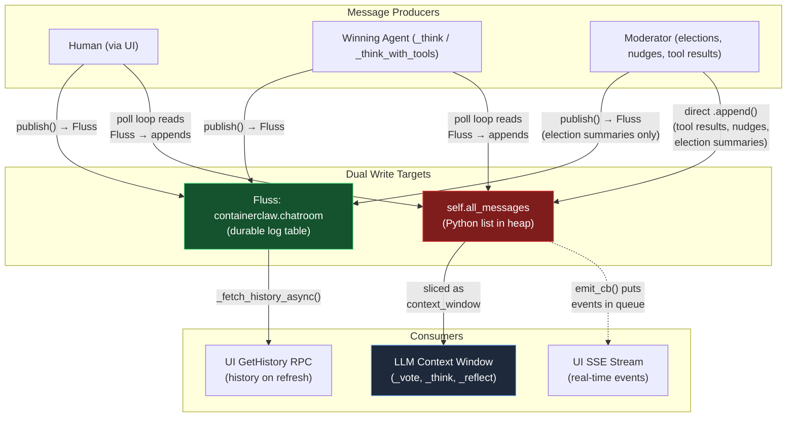
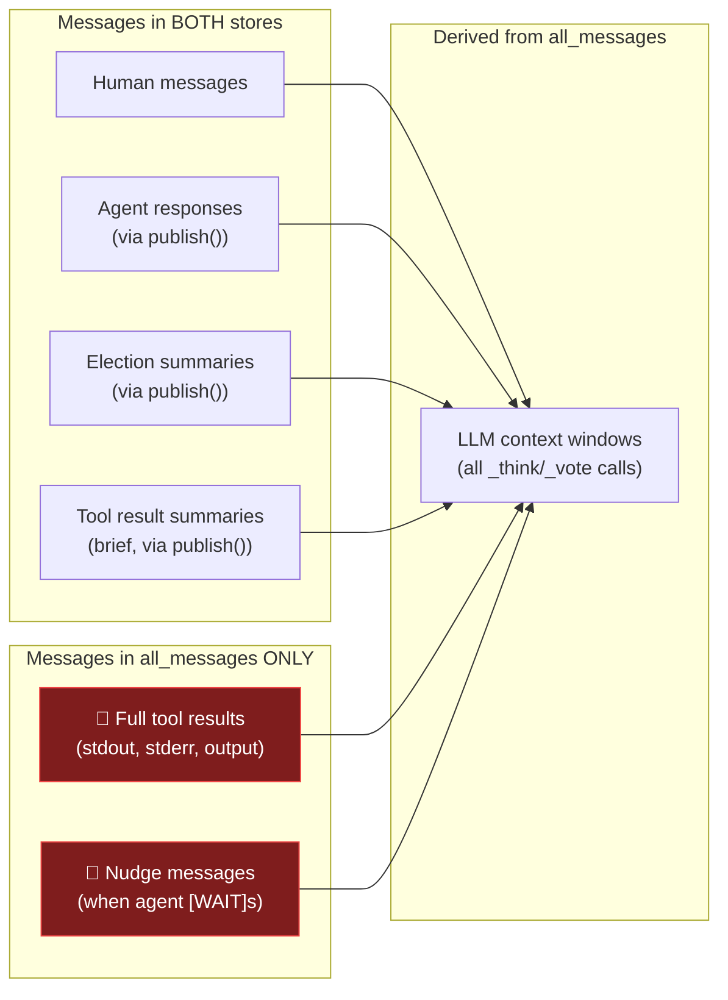
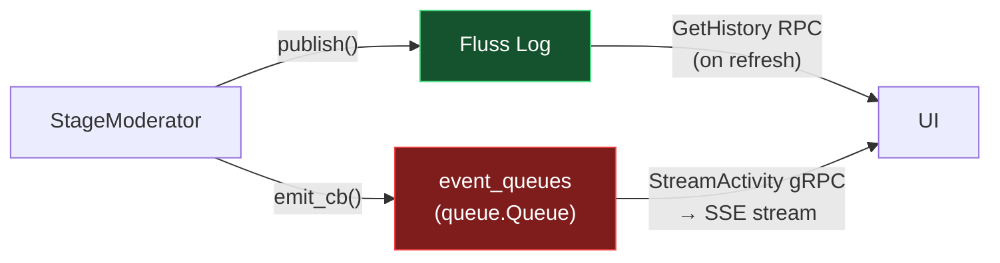
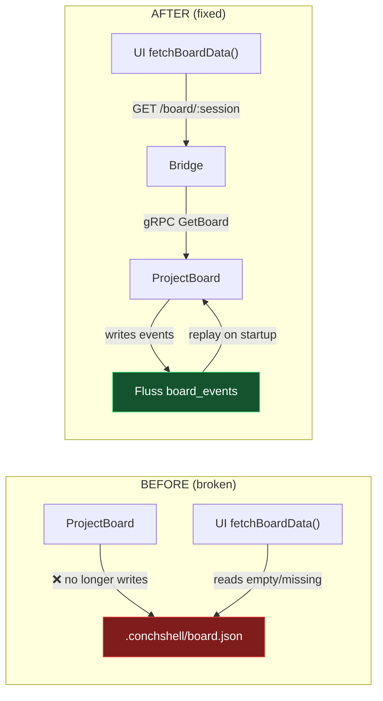
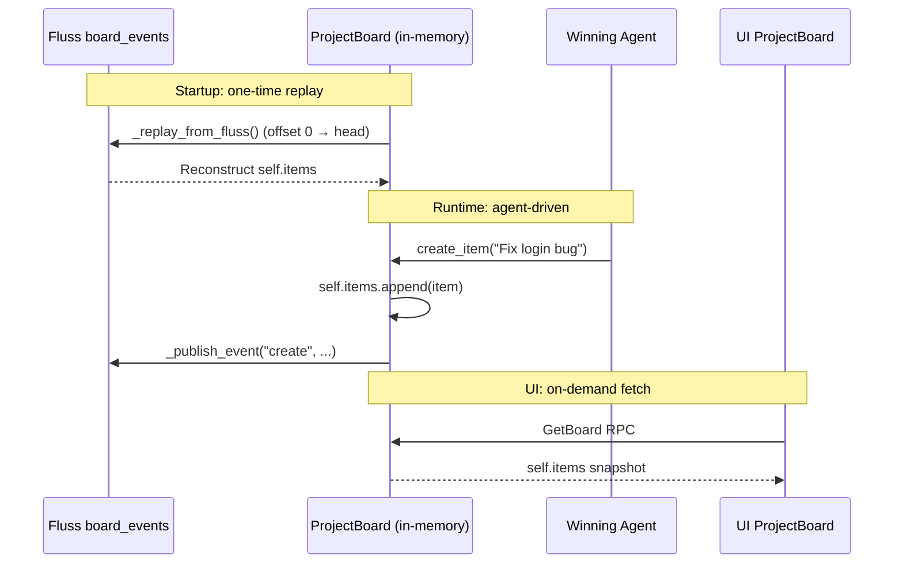
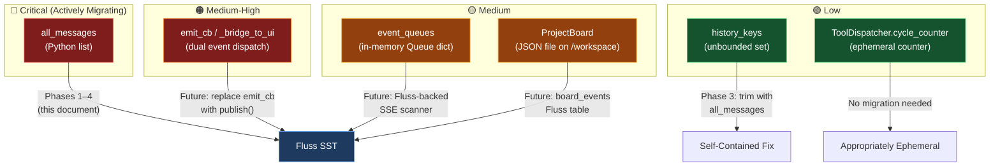
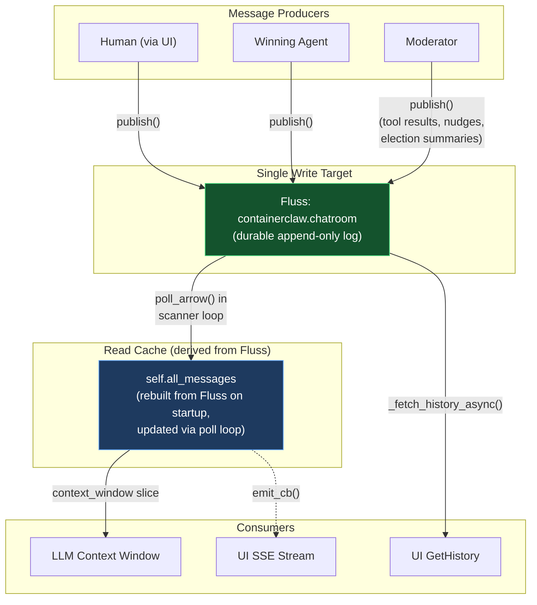
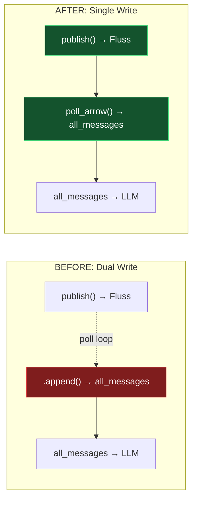
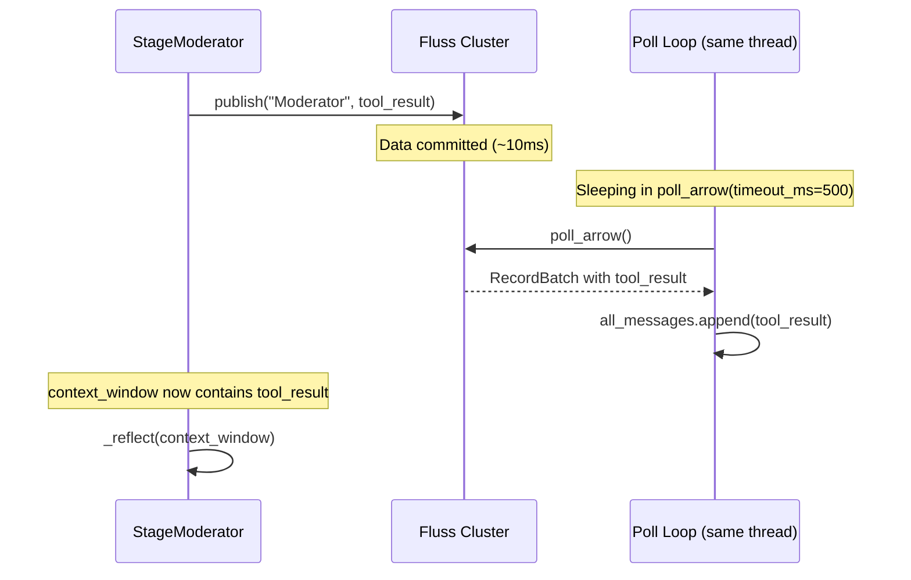
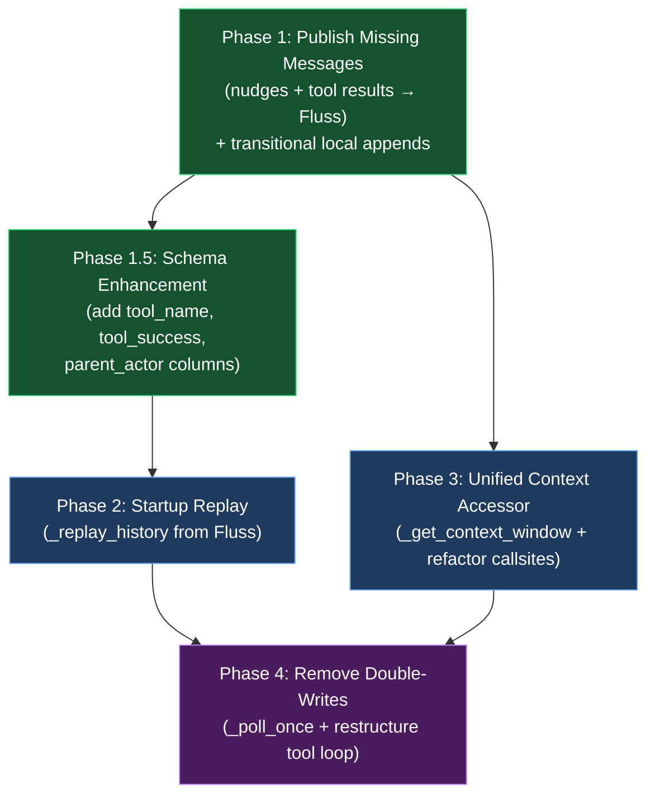

# ContainerClaw — Draft Pt.7: Eliminating `all_messages` — Full Fluss Migration

> **Complementary to:** [draft_pt5.md](file:///Users/jaredyu/Desktop/open_source/containerclaw/docs/draft_pt5.md), [draft_pt6.md](file:///Users/jaredyu/Desktop/open_source/containerclaw/docs/draft_pt6.md)  
> **Focus:** Architectural audit of the in-memory `all_messages` list, why it doesn't scale, and a rigorous migration plan to make Fluss the single source of truth  
> **Version:** 0.1.0-draft-pt7  
> **Date:** 2026-03-19  

---

## 0. Executive Summary

The `StageModerator` in [moderator.py](file:///Users/jaredyu/Desktop/open_source/containerclaw/agent/src/moderator.py) maintains **two parallel representations of conversation history**:

1. **`self.all_messages`** — a Python `list[dict]` living in the agent process's heap memory
2. **Fluss `containerclaw.chatroom`** — a durable, append-only log table in the Apache Fluss cluster

Today, `all_messages` is the **de facto source of truth** for the LLM context window: every `_think()`, `_vote()`, `_reflect()`, and `_think_with_tools()` call slices its context from `self.all_messages[-MAX_HISTORY_MESSAGES:]`. Fluss is used only as a **transport** (for Human ingestion and UI history replay), not as the authoritative record.

This architecture has three critical consequences:

| Problem | Impact |
|---|---|
| **Data loss on restart** | If the agent container restarts, `all_messages = []` resets — all tool results, nudges, and election logs vanish. Fluss retains data but the moderator never re-reads it on startup. |
| **Invisible messages** | Tool results (line 378) and nudge messages (line 304) are appended to `all_messages` but **never published to Fluss**, making them invisible to the `GetHistory` RPC and the UI's history-on-refresh path. |
| **Unbounded memory** | The truncation guard (`len > 1000 → slice to last 200`) is a band-aid. In infinite autonomous mode (`AUTONOMOUS_STEPS=-1`), the list grows continuously between truncation boundaries, bounded only by heap size. |

This document proposes a phased migration to eliminate `all_messages` entirely, making Fluss the single source of truth for all conversation state.

---

## 1. Architectural Audit: Current State

### 1.1 The Dual-Write Architecture

Every message in the system flows through one of two paths — and some flow through **both**, while others flow through **only one**, creating a split-brain problem.



### 1.2 Exhaustive Inventory of `all_messages` Usage

There are **12 references** to `all_messages` across `moderator.py`. Every single one must be accounted for in the migration. Here is the complete categorization:

#### Category A: Initialization

| Line | Code | What It Does |
|---|---|---|
| **204** | `self.all_messages = []` | Initializes the in-memory history as empty. On restart, all prior context is lost. |

#### Category B: Writes via Poll Loop (Fluss-backed)

These writes are **safe** — they mirror data already in Fluss, read back through the scanner.

| Line | Code | What It Does |
|---|---|---|
| **243** | `self.all_messages.append(msg_obj)` | Appends Human/Agent messages polled from Fluss. This is the read-side of the Fluss write. Moderator's own published messages also arrive here. |

#### Category C: Direct Writes (NOT in Fluss)

These are the **dangerous** ones — data that only exists in heap memory.

| Line | Code | What It Does | Fluss? |
|---|---|---|---|
| **304** | `self.all_messages.append({"actor_id": "Moderator", "content": nudge_text})` | Nudge message when winner chooses `[WAIT]` | ❌ Not published |
| **378–386** | `self.all_messages.append({"actor_id": "Moderator", "content": f"[Tool Result for {agent.agent_id}] ..."})` | Tool execution results — the output of ConchShell commands, file reads, test runs | ❌ Only a brief summary published (line 388), not the actual output |

#### Category D: Reads (Context Construction)

These lines **consume** `all_messages` to build LLM context. Every one of these must be migrated to read from Fluss instead.

| Line | Code | Consumer |
|---|---|---|
| **261–262** | `if len(self.all_messages) > 1000: self.all_messages = self.all_messages[-MAX*2:]` | Truncation guard |
| **272** | `context_window = self.all_messages[-config.MAX_HISTORY_MESSAGES:]` | Main loop context for `elect_leader()` |
| **305** | `nudge_context = self.all_messages[-config.MAX_HISTORY_MESSAGES:]` | Nudge context for `_think()` fallback |
| **329** | `updated_context = self.all_messages[-config.MAX_HISTORY_MESSAGES:]` | `_execute_with_tools()` initial context |
| **390** | `updated_context = self.all_messages[-config.MAX_HISTORY_MESSAGES:]` | `_execute_with_tools()` post-tool-round context |
| **396** | `updated_context = self.all_messages[-config.MAX_HISTORY_MESSAGES:]` | `_execute_text_only()` context |

#### Category E: Deduplication Guard

| Line | Code | What It Does |
|---|---|---|
| **205** | `self.history_keys = set()` | Tracks `{ts}-{actor_id}` keys to prevent double-appending from Fluss poll |

### 1.3 The Split-Brain Problem Visualized

The following diagram shows which messages exist in which store. The red zone is the data loss risk.



**The consequence:** When a user refreshes the UI and `GetHistory` reads from Fluss, they see a **different history** than what the LLM agents are seeing. Tool results and nudges are absent from the Fluss record. If the container restarts, the agents lose all tool output context and resume as if no tools were ever used.

### 1.4 Why This Matters at Scale

| Scenario | Current Behavior | Desired Behavior |
|---|---|---|
| **Container restart** | `all_messages = []`, agents forget everything. Fluss has partial history (no tool results). | Moderator replays Fluss log on startup, full context restored. |
| **Long-running session** | List grows unbounded → truncation discards early messages. No way to recover them. | Fluss retains all messages. Context window reads from Fluss with offset-based pagination. |
| **Multi-instance scaling** | Impossible — each moderator has its own `all_messages`. | Multiple moderators could read the same Fluss log (future: leader election for active moderator). |
| **Debugging / Auditing** | Tool results only visible in Docker logs (stdout). Lost when container is removed. | All tool results persisted in Fluss, queryable via `GetHistory` RPC. |
| **UI history on refresh** | `GetHistory` shows incomplete history (no tool results, no nudges). | `GetHistory` shows exactly what agents saw. |

### 1.5 Broader Audit: Other Non-Scalable Patterns

The `all_messages` list is the most critical scalability problem, but it is not the only one. This section catalogs **every** in-memory or non-durable state pattern in the codebase, assesses their severity, and recommends whether they should be migrated to Fluss.

#### Weakness W-1: `event_queues` — In-Memory SSE Dispatch

**File:** [main.py](file:///Users/jaredyu/Desktop/open_source/containerclaw/agent/src/main.py) lines 39, 108–112

```python
self.event_queues = {}   # dict[str, queue.Queue]

def _get_queue(self, session_id):
    if session_id not in self.event_queues:
        self.event_queues[session_id] = queue.Queue()
    return self.event_queues[session_id]
```

**What it does:** `_bridge_to_ui()` puts `ActivityEvent` objects into a per-session `queue.Queue`. The `StreamActivity` gRPC handler yields events from this queue to the bridge, which converts them to SSE for the UI.

**Why it doesn't scale:**
- The queue is **entirely in-memory**. If the agent restarts, queued events are lost. The UI must reconnect and has no way to replay missed events.
- There is **one queue per session**, but since `CLAW_SESSION_ID` is hardcoded to `"default-session"`, only one queue ever exists.
- If the UI disconnects and reconnects, events emitted during the gap are **lost forever** — there is no replay mechanism for SSE events.

**Relationship to Fluss:** This is a **parallel dispatch path** that duplicates Fluss's role. The moderator writes to Fluss AND calls `emit_cb()` — two separate channels carrying the same information:



**Severity: 🟡 Medium** — The `GetHistory` RPC already provides crash-recovery for the UI (it reads from Fluss on page load). The real-time SSE stream via `event_queues` is a UX convenience, not a correctness requirement. But the dual-path architecture is needlessly complex.

**Migration recommendation:** Replace the `emit_cb` → `queue.Queue` → `StreamActivity` path with a Fluss-backed scanner. The bridge would subscribe to the Fluss log via a dedicated scanner (similar to how the moderator poll loop works) and stream events to the UI in real-time. This eliminates the queue entirely and makes the SSE stream a simple Fluss reader.

---

#### Weakness W-2: `ProjectBoard` — JSON File Persistence

**File:** [tools.py](file:///Users/jaredyu/Desktop/open_source/containerclaw/agent/src/tools.py) lines 286–340

```python
class ProjectBoard:
    def __init__(self):
        self.board_path = Path("/workspace/.conchshell/board.json")
        self.items: list[dict] = []
        self._load()

    def _save(self):
        self.board_path.parent.mkdir(parents=True, exist_ok=True)
        self.board_path.write_text(json.dumps(self.items, indent=2))
```

**What it does:** The `ProjectBoard` persists task/story/epic items to a JSON file on the `/workspace` volume. Bob (project manager) creates items via `BoardTool`; all agents can read them.

**Why it doesn't scale:**
- **Single-writer assumption:** If two agents concurrently called `board.create_item()`, the last write wins (no locking). Currently mitigated by the election system (only one agent acts at a time), but this is a fragile invariant.
- **No change history:** The JSON file is overwritten on every mutation. There's no audit trail of who changed what and when. In a MAS context, knowing which agent created or updated a task is important provenance.
- **Coupled to filesystem:** The board is stored in `/workspace`, mixing project management data with the SWE-bench workspace files. A `git clean -fd` in the workspace could accidentally delete the board.

**Severity: 🟡 Medium** — The single-writer invariant is currently upheld by the election system, so there's no immediate correctness bug. But the lack of an audit trail is a genuine gap for agent governance.

**Migration recommendation:** Create a second Fluss table `containerclaw.board_events` as an append-only log of board mutations (create, update_status). The `ProjectBoard` class would then reconstruct its state by replaying this log on startup, and the UI could subscribe to board changes in real-time via a scanner. The JSON file becomes unnecessary.

---

#### W-2 Post-Migration: UI Board Breakage & Fix

> [!CAUTION]
> After migrating `ProjectBoard` to Fluss (creating the `containerclaw.board_events` table and switching persistence), the **project board panel in the UI stopped populating**. This section documents the root cause and fix.

**Root cause:** The UI's `fetchBoardData()` in [api.ts](file:///Users/jaredyu/Desktop/open_source/containerclaw/ui/src/api.ts) was still reading board data by fetching the old JSON file at `.conchshell/board.json` via the workspace file endpoint. But the migrated `ProjectBoard` only writes to Fluss when `board_table` is available — it no longer calls `_save()` to write `board.json`. The JSON file simply doesn't exist anymore.



**Fix applied:**

1. **Proto:** Added `GetBoard` RPC, `BoardItem` and `BoardResponse` messages to [agent.proto](file:///Users/jaredyu/Desktop/open_source/containerclaw/proto/agent.proto)
2. **Agent:** Added `GetBoard` handler in [main.py](file:///Users/jaredyu/Desktop/open_source/containerclaw/agent/src/main.py) that reads from the in-memory `ProjectBoard.items` list
3. **Bridge:** Added `/board/<session_id>` endpoint in [bridge.py](file:///Users/jaredyu/Desktop/open_source/containerclaw/bridge/src/bridge.py) that proxies the gRPC call
4. **UI:** Updated `fetchBoardData()` in [api.ts](file:///Users/jaredyu/Desktop/open_source/containerclaw/ui/src/api.ts) to call `/board/<session_id>` instead of reading the JSON file

**How the board updates — lifecycle clarification:**

The board does **not** poll Fluss regularly. Its update mechanism is:

1. **Startup (crash recovery):** `ProjectBoard.__init__()` calls `_replay_from_fluss()`, which creates a one-time Fluss scanner, reads all `board_events` from offset 0, and reconstructs `self.items` by replaying create/update_status events. After replay, the scanner is discarded.

2. **Runtime (agent-driven):** When an agent wins an election and calls `BoardTool.execute()` (e.g., `board create task "Fix login bug"`), the `ProjectBoard.create_item()` or `update_status()` method:
   - Updates `self.items` in-memory **immediately**
   - Publishes the mutation event to Fluss via `_publish_event()`

3. **UI reads:** The UI calls `GetBoard` (via the bridge), which reads `self.items` — a point-in-time snapshot of the in-memory list. The UI triggers a refresh on `finish` events (when an election cycle completes).



---

#### Weakness W-3: `emit_cb` / `_bridge_to_ui` — Dual Event Dispatch

**File:** [main.py](file:///Users/jaredyu/Desktop/open_source/containerclaw/agent/src/main.py) lines 99–106, [moderator.py](file:///Users/jaredyu/Desktop/open_source/containerclaw/agent/src/moderator.py) (18 callsites)

```python
def _bridge_to_ui(self, actor_id, content, e_type):
    q = self._get_queue(self.session_id)
    q.put(agent_pb2.ActivityEvent(
        timestamp=time.strftime("%Y-%m-%dT%H:%M:%SZ", time.gmtime()),
        type=e_type, content=content, actor_id=actor_id
    ))
```

**What it does:** This is the callback that the moderator uses to push events to the UI in real-time. It's called for elections (`"thought"`), agent responses (`"output"`), tool actions (`"action"`), and cycle completion (`"finish"`).

**Why it's a problem:**
- `emit_cb` events carry **different information** than what's published to Fluss. For example, `emit_cb("Moderator", "🏆 Winner: Carol", "thought")` is never written to Fluss at all — it only goes to the SSE stream. If the UI reconnects, this event is gone.
- The 18 `emit_cb` callsites in `moderator.py` are **not synchronized** with the `publish()` calls. Some events go to both channels (agent responses), some go only to `emit_cb` (election round tallies, winner announcements), and some go only to Fluss (election summary). This creates a confusing parity matrix.

**Severity: 🟠 Medium-High** — This is architecturally the same problem as `all_messages` but on the output side. The dual-dispatch creates inconsistency between what the UI shows in real-time vs. what it shows after a page refresh.

**Migration recommendation:** This is directly addressed by W-1's fix. Once the SSE stream reads from Fluss, all `emit_cb` calls can be replaced with `publish()` calls. The `emit_cb` callback, `_bridge_to_ui`, and `event_queues` can all be removed.

---

#### Weakness W-4: `history_keys` — Unbounded Deduplication Set

**File:** [moderator.py](file:///Users/jaredyu/Desktop/open_source/containerclaw/agent/src/moderator.py) line 205

```python
self.history_keys = set()  # {"{ts}-{actor_id}", ...}
```

**What it does:** Prevents the poll loop from double-appending messages to `all_messages` when the same record is polled twice.

**Why it doesn't scale:**
- The set grows **forever** — every message ever polled adds one entry. In an infinite autonomous session, this is unbounded memory growth.
- The key format `{ts}-{actor_id}` is **not collision-resistant**. If two messages from the same actor arrive in the same millisecond (e.g., two fast `publish()` calls), they'd have the same key and the second would be silently dropped.

**Severity: 🟢 Low** — The memory grow rate is ~50 bytes per message (a short string + set overhead). At 1000 messages/hour, this is ~50KB/hour — negligible. The key collision is theoretical and hasn't been observed.

**Migration recommendation:** When Phase 3's truncation guard trims `all_messages`, also trim `history_keys` by rebuilding it from the remaining messages. This caps memory. For the collision issue, add a monotonic counter or use the Fluss record offset as the key.

---

#### Weakness W-5: `ToolDispatcher.cycle_counter` — Ephemeral Rate Limit

**File:** [tools.py](file:///Users/jaredyu/Desktop/open_source/containerclaw/agent/src/tools.py) lines 461, 475, 488

```python
self.cycle_counter = 0
# ...
if self.cycle_counter >= self.MAX_TOOLS_PER_CYCLE:
    return ToolResult(success=False, ..., error="Tool rate limit exceeded ...")
self.cycle_counter += 1
```

**What it does:** Limits total tool calls per election cycle to `MAX_TOOLS_PER_CYCLE` (20). Reset via `reset_cycle()` at the end of each moderation cycle.

**Why it doesn't scale:** If the container restarts mid-cycle, the counter resets to 0, effectively giving agents a fresh budget. Not a correctness issue — just a defense-in-depth gap.

**Severity: 🟢 Low** — This is intentionally ephemeral. The rate limit is a safety guard, not a business rule. Resetting on restart is acceptable and arguably desirable.

**Migration recommendation:** None needed. This is appropriately ephemeral.

---

#### Summary of All Non-Scalable Patterns



| ID | Pattern | Location | Severity | Migration Target |
|---|---|---|---|---|
| **W-0** | `all_messages` | `moderator.py` | 🔴 Critical | Fluss (Phases 1–4) |
| **W-1** | `event_queues` | `main.py` | 🟡 Medium | Fluss scanner → SSE |
| **W-2** | `ProjectBoard` | `tools.py` | 🟡 Medium | `containerclaw.board_events` Fluss table |
| **W-3** | `emit_cb` / `_bridge_to_ui` | `main.py` + `moderator.py` | 🟠 Medium-High | Eliminated when W-1 is fixed |
| **W-4** | `history_keys` | `moderator.py` | 🟢 Low | Trim alongside `all_messages` |
| **W-5** | `cycle_counter` | `tools.py` | 🟢 Low | None needed |

> [!NOTE]
> W-1 and W-3 are **coupled** — fixing W-1 (replacing `event_queues` with a Fluss scanner) automatically eliminates W-3 (the `emit_cb` dual-dispatch). Together, they represent the largest remaining migration after `all_messages`.

---

## 2. Target Architecture: Fluss as Single Source of Truth

### 2.1 Design Principles

1. **Every message published to `all_messages` must go through Fluss.** No direct `.append()` to the list — all writes go through `publish()`, and the poll loop reads them back.
2. **`all_messages` becomes a read cache**, not a write target. It is populated exclusively by the Fluss scanner poll loop.
3. **On startup, the moderator replays the Fluss log** to rebuild `all_messages` before entering the main loop. This provides crash recovery.
4. **The Fluss schema is enriched** to carry the full content of tool results, not just summaries.

### 2.2 Target Data Flow



### 2.3 Contrast: Before vs. After



---

## 3. Migration Plan

### 3.1 Phase 1: Publish All Missing Messages to Fluss

**Goal:** Every message that currently uses a direct `.append()` to `all_messages` must instead go through `publish()` so it reaches Fluss. The poll loop will then read it back into `all_messages` naturally.

**Estimated effort:** ~30 minutes of code changes, 0 new dependencies.

---

#### 3.1.1 [MODIFY] [moderator.py](file:///Users/jaredyu/Desktop/open_source/containerclaw/agent/src/moderator.py) — Nudge Messages

**Current (line 304):**
```python
self.all_messages.append({"actor_id": "Moderator", "content": nudge_text})
```

**Problem:** The nudge message only exists in heap memory. If the container restarts, it's gone. The `GetHistory` RPC will never return it. If another moderator instance existed, it wouldn't see it.

**Proposed:**
```python
await self.publish("Moderator", nudge_text, "system")
```

**Defense:**
- `publish()` writes to Fluss via the existing `self.writer`, which is already initialized and proven functional (every election summary, every agent response goes through it successfully).
- The poll loop on the next iteration will read this message back from Fluss and call `self.all_messages.append(msg_obj)` at line 243. This means the nudge will appear in `all_messages` one poll cycle later (~500ms).
- The nudge context construction at line 305 (`nudge_context = self.all_messages[-MAX:]`) must tolerate this latency. We can either:
  - **(Option A)** Insert a `await asyncio.sleep(0.6)` after the publish to ensure the poll loop picks it up before constructing context. **Simple but adds latency.**
  - **(Option B)** After calling `publish()`, immediately append a local copy to `all_messages` as well (temporary double-write). The dedup guard (`self.history_keys`) will prevent the poll loop from adding a duplicate. **Recommended** — this preserves the current timing semantics while ensuring Fluss durability.

**Recommended change:**
```python
# Instead of just direct append:
await self.publish("Moderator", nudge_text, "system")
# Local copy for immediate context availability (dedup guard prevents double-add from poll loop)
self.all_messages.append({"actor_id": "Moderator", "content": nudge_text})
```

This is a transitional pattern — in Phase 3, we replace the read side entirely.

---

#### 3.1.2 [MODIFY] [moderator.py](file:///Users/jaredyu/Desktop/open_source/containerclaw/agent/src/moderator.py) — Tool Results

**Current (lines 378–386):**
```python
self.all_messages.append({
    "actor_id": "Moderator",
    "content": (
        f"[Tool Result for {agent.agent_id}] {tool_name}: "
        f"{'SUCCESS' if result.success else 'FAILED'}\n"
        f"{result.output[:1000]}"
        f"{(' | Error: ' + result.error) if result.error else ''}"
    ),
})
```

**And separately (line 388):**
```python
await self.publish("Moderator", f"Tool Result ({agent.agent_id}): {tool_name}", "system")
```

**Problem:** There are TWO writes here — a rich one to `all_messages` (with full output up to 1000 chars) and a terse one to Fluss (just the tool name, no output). The LLM sees the full output; the UI history and Fluss record only see the summary. This is the core split-brain.

**Proposed:**
```python
tool_result_content = (
    f"[Tool Result for {agent.agent_id}] {tool_name}: "
    f"{'SUCCESS' if result.success else 'FAILED'}\n"
    f"{result.output[:1000]}"
    f"{(' | Error: ' + result.error) if result.error else ''}"
)
await self.publish("Moderator", tool_result_content, "action")
# Local copy for immediate context (transitional)
self.all_messages.append({"actor_id": "Moderator", "content": tool_result_content})
```

**Defense:**
- This publishes the **full** tool result content to Fluss, not just the name. The Fluss record now matches what the LLM sees.
- The content is capped at `result.output[:1000]`, so Fluss message sizes remain bounded (the `content` column is a string, no schema change needed).
- The `type` field changes from `"system"` to `"action"` — this is semantically correct (tool results are actions) and lets the UI filter them appropriately.
- The local `.append()` remains as a transitional pattern for immediate context availability.

**Schema impact:** None. The Fluss schema already has `content` as `pa.string()` with no length constraint. A 1000-character tool result is well within normal bounds.

---

#### 3.1.3 [MODIFY] [moderator.py](file:///Users/jaredyu/Desktop/open_source/containerclaw/agent/src/moderator.py) — Poll Loop Moderator Echoes

**Current (lines 255–258):**
```python
elif row['actor_id'] == "Moderator":
    # We hear our own system messages back from the log
    # This maintains the chronological order in all_messages
    pass
```

**Problem:** Moderator messages read back from Fluss are **silently discarded** in the poll loop. They are NOT appended to `all_messages`. This means published election summaries DO reach Fluss but are never read back into the in-memory history from the poll loop — they only appear through the direct `.append()` at the publish site.

Currently this works by accident because the `publish()` callsite for election summaries is followed by the poll loop eventually picking them up — but the `pass` here means the poll loop doesn't process them. The messages get into `all_messages` through the specific `self.all_messages.append(msg_obj)` on line 243 which runs for all actor_ids, including "Moderator". Wait — let me re-read the code flow:

Actually, looking more carefully at lines 238–258: the for-loop iterates over ALL rows, and line 243 `self.all_messages.append(msg_obj)` runs for every row that passes the dedup check — *including* Moderator rows. The `if/elif/elif` block starting at line 245 is purely for **side effects** (logging, `emit_cb()`), not for controlling the append. The `pass` on line 258 just means "no special side effect for Moderator messages."

**Correction:** Moderator messages ARE being appended to `all_messages` via the poll loop. The `pass` is not a bug — it just means no logging/emit side effect for Moderator echoes. The current flow is actually:

1. `publish("Moderator", content)` writes to Fluss
2. Next poll cycle, `poll_arrow()` returns this row
3. Line 243 appends it to `all_messages` (regardless of actor_id)
4. Lines 245–258 handle actor-specific side effects — Moderator messages get `pass` (no logging)

**This means:** Once we convert nudges and tool results to go through `publish()`, they will naturally arrive in `all_messages` via the poll loop. However, the **latency** between publish and poll pickup (~500ms) means we still need the local `.append()` as a transitional pattern for immediate availability.

**No code change needed here** — the poll loop already handles Moderator messages correctly.

---

### 3.2 Phase 1.5: Fluss Schema Enhancement

**Goal:** Enrich the Fluss `containerclaw.chatroom` schema with structured columns for tool metadata, enabling first-class filtering and aggregation of tool results without parsing free-form `content` strings.

**Rationale for inclusion:** This is a fully local Docker sandbox — there is no production table to worry about. A `docker compose down -v` wipes the Fluss data directory entirely, so there is zero migration risk. We drop-and-recreate on every clean start.

**Estimated effort:** ~30 lines across 2 files.

---

#### 3.2.1 Schema Definition

**Current schema (4 columns):**
```python
pa.schema([
    pa.field("ts", pa.int64()),
    pa.field("actor_id", pa.string()),
    pa.field("content", pa.string()),
    pa.field("type", pa.string()),
])
```

**Enhanced schema (7 columns):**
```python
pa.schema([
    pa.field("ts", pa.int64()),
    pa.field("actor_id", pa.string()),
    pa.field("content", pa.string()),
    pa.field("type", pa.string()),
    pa.field("tool_name", pa.string()),     # Name of tool invoked (empty for non-tool messages)
    pa.field("tool_success", pa.bool_()),   # Whether the tool call succeeded
    pa.field("parent_actor", pa.string()),  # Which agent triggered the tool call
])
```

**New columns explained:**

| Column | Type | Populated When | Example Values |
|---|---|---|---|
| `tool_name` | `string` | Tool result published | `"shell"`, `"file_write"`, `"test_runner"` |
| `tool_success` | `bool` | Tool result published | `true`, `false` |
| `parent_actor` | `string` | Tool result published | `"Carol"`, `"David"` |

For non-tool messages (Human, Agent responses, Election summaries, Nudges), these columns will be set to empty string / `false` / empty string respectively.

---

#### 3.2.2 [MODIFY] [main.py](file:///Users/jaredyu/Desktop/open_source/containerclaw/agent/src/main.py) — Table Creation Schema

**Current (lines 325–330):**
```python
schema = pa.schema([
    pa.field("ts", pa.int64()),
    pa.field("actor_id", pa.string()),
    pa.field("content", pa.string()),
    pa.field("type", pa.string())
])
```

**Proposed:**
```python
schema = pa.schema([
    pa.field("ts", pa.int64()),
    pa.field("actor_id", pa.string()),
    pa.field("content", pa.string()),
    pa.field("type", pa.string()),
    pa.field("tool_name", pa.string()),
    pa.field("tool_success", pa.bool_()),
    pa.field("parent_actor", pa.string()),
])
```

**Defense:** The table is created with `ignore_if_exists=True`. For existing tables with the old schema, the system requires a `docker compose down -v` to wipe the old table and recreate with the new schema. The existing column count check (lines 359–365) will warn if the schema is stale.

---

#### 3.2.3 [MODIFY] [moderator.py](file:///Users/jaredyu/Desktop/open_source/containerclaw/agent/src/moderator.py) — Writer Schema + `publish()`

**Current `pa_schema` (lines 207–212):**
```python
self.pa_schema = pa.schema([
    pa.field("ts", pa.int64()),
    pa.field("actor_id", pa.string()),
    pa.field("content", pa.string()),
    pa.field("type", pa.string())
])
```

**Proposed:**
```python
self.pa_schema = pa.schema([
    pa.field("ts", pa.int64()),
    pa.field("actor_id", pa.string()),
    pa.field("content", pa.string()),
    pa.field("type", pa.string()),
    pa.field("tool_name", pa.string()),
    pa.field("tool_success", pa.bool_()),
    pa.field("parent_actor", pa.string()),
])
```

**Current `publish()` (lines 477–491):**
```python
async def publish(self, actor_id, content, m_type="output"):
    batch = pa.RecordBatch.from_arrays([
        pa.array([int(time.time() * 1000)], type=pa.int64()),
        pa.array([actor_id], type=pa.string()),
        pa.array([content], type=pa.string()),
        pa.array([m_type], type=pa.string())
    ], schema=self.pa_schema)
```

**Proposed — add optional kwargs for tool metadata:**
```python
async def publish(self, actor_id, content, m_type="output",
                  tool_name="", tool_success=False, parent_actor=""):
    batch = pa.RecordBatch.from_arrays([
        pa.array([int(time.time() * 1000)], type=pa.int64()),
        pa.array([actor_id], type=pa.string()),
        pa.array([content], type=pa.string()),
        pa.array([m_type], type=pa.string()),
        pa.array([tool_name], type=pa.string()),
        pa.array([tool_success], type=pa.bool_()),
        pa.array([parent_actor], type=pa.string()),
    ], schema=self.pa_schema)
```

**Defense:**
- The new kwargs default to empty/false, so **all existing `publish()` callsites remain unchanged** — they will publish rows with empty tool metadata. Zero risk to existing behavior.
- Only the tool result `publish()` call (modified in Phase 1) needs to pass the new kwargs:
  ```python
  await self.publish(
      "Moderator", tool_result_content, "action",
      tool_name=tool_name,
      tool_success=result.success,
      parent_actor=agent.agent_id,
  )
  ```

---

#### 3.2.4 [MODIFY] [main.py](file:///Users/jaredyu/Desktop/open_source/containerclaw/agent/src/main.py) — Update Schema Column Count Check

**Current (lines 362–365):**
```python
if column_count < 4:
    print(f"⚠️ [Infrastructure] Fluss table has an OLD schema ({column_count} columns).")
```

**Proposed:**
```python
if column_count < 7:
    print(f"⚠️ [Infrastructure] Fluss table has an OLD schema ({column_count} columns, expected 7).")
```

---

### 3.3 Phase 2: Startup Replay — Crash Recovery

**Goal:** When the moderator starts (or restarts), replay the Fluss log from offset 0 to rebuild `all_messages` before entering the main loop.

**Estimated effort:** ~20 lines of new code.

---

#### 3.2.1 [MODIFY] [moderator.py](file:///Users/jaredyu/Desktop/open_source/containerclaw/agent/src/moderator.py) — Add `_replay_history()` method

**New method on `StageModerator`:**
```python
async def _replay_history(self):
    """Replay the Fluss log from offset 0 to rebuild all_messages.

    This provides crash recovery: if the agent container restarts,
    the moderator will reconstruct its full conversation history
    from the durable Fluss log before entering the main loop.
    """
    print("📜 [Moderator] Replaying Fluss history...")
    replay_scanner = await self.table.new_scan().create_record_batch_log_scanner()
    replay_scanner.subscribe(bucket_id=0, start_offset=0)

    total_replayed = 0
    while True:
        poll = await asyncio.to_thread(replay_scanner.poll_arrow, timeout_ms=500)
        if poll.num_rows == 0:
            break  # Caught up to head of log

        df = poll.to_pandas()
        for _, row in df.iterrows():
            key = f"{row['ts']}-{row['actor_id']}"
            if key not in self.history_keys:
                self.history_keys.add(key)
                self.all_messages.append({
                    "actor_id": row["actor_id"],
                    "content": row["content"],
                })
                total_replayed += 1

    print(f"✅ [Moderator] Replayed {total_replayed} messages from Fluss.")
```

**Call site — add to `run()` before the main loop (line 220):**
```python
async def run(self, autonomous_steps=0):
    # Replay history from Fluss for crash recovery
    await self._replay_history()

    scanner = await self.table.new_scan().create_record_batch_log_scanner()
    scanner.subscribe(bucket_id=0, start_offset=0)
    # ... rest of the main loop
```

**Defense:**
- **Idempotency:** The `history_keys` dedup guard ensures that if the replay scanner and the main scanner both read the same messages, they won't be double-counted. The key format `{ts}-{actor_id}` is the same used in the main loop (line 239).
- **Performance:** Replaying is bounded by the size of the Fluss log. For a typical SWE-bench session (~200 messages), this completes in <1 second. For very long sessions (>10,000 messages), the `poll_arrow(timeout_ms=500)` loop with batch processing keeps it efficient.
- **Scanner lifecycle:** The `replay_scanner` is a separate scanner from the main loop's scanner. After replay, it is no longer referenced and will be garbage collected. The main scanner starts fresh from offset 0, but all replayed messages are already in `history_keys`, so they won't be re-appended.
- **Caveat — double reads:** The main scanner also starts at `start_offset=0`, which means it will re-read all the messages the replay scanner already processed. The dedup guard handles this, but it's wasteful. In Phase 3, we optimize this by starting the main scanner at the last replayed offset.

---

#### 3.2.2 [MODIFY] [moderator.py](file:///Users/jaredyu/Desktop/open_source/containerclaw/agent/src/moderator.py) — Track Last Offset for Efficient Resume

To avoid the "double read" caveat above, track the highest offset seen during replay:

**New instance variable (line 206):**
```python
self.last_replayed_offset = 0
```

**Update `_replay_history()` to track offset:**
```python
# After the replay loop:
self.last_replayed_offset = total_replayed  # Approximate — exact offset tracking requires Fluss SDK support
```

**Update main loop scanner subscription (currently line 221):**
```python
# Instead of: scanner.subscribe(bucket_id=0, start_offset=0)
scanner.subscribe(bucket_id=0, start_offset=self.last_replayed_offset)
```

**Defense:** This is an optimization, not a correctness fix. Even without it, the dedup guard prevents double-processing. But for sessions with thousands of messages, skipping the re-read saves meaningful I/O.

---

### 3.4 Phase 3: Replace Direct Reads — Fluss-Backed Context Window

**Goal:** Replace `self.all_messages[-MAX:]` context window construction with a method that can serve context either from the local cache (for low-latency) or directly from Fluss (for correctness guarantees).

**Estimated effort:** New `_get_context_window()` method + update all 6 callsites.

---

#### 3.3.1 [MODIFY] [moderator.py](file:///Users/jaredyu/Desktop/open_source/containerclaw/agent/src/moderator.py) — Unified Context Accessor

**New method:**
```python
def _get_context_window(self, size: int | None = None) -> list[dict]:
    """Return the most recent messages for LLM context.

    Reads from self.all_messages (which is populated exclusively
    by the Fluss poll loop after Phase 1+2 migration).

    Args:
        size: Number of recent messages to include. Defaults to
              config.MAX_HISTORY_MESSAGES.

    Returns:
        List of message dicts with 'actor_id' and 'content' keys.
    """
    n = size or config.MAX_HISTORY_MESSAGES
    return self.all_messages[-n:]
```

**Update all 6 callsites:**

| Line | Current | Proposed |
|---|---|---|
| 272 | `context_window = self.all_messages[-config.MAX_HISTORY_MESSAGES:]` | `context_window = self._get_context_window()` |
| 305 | `nudge_context = self.all_messages[-config.MAX_HISTORY_MESSAGES:]` | `nudge_context = self._get_context_window()` |
| 329 | `updated_context = self.all_messages[-config.MAX_HISTORY_MESSAGES:]` | `updated_context = self._get_context_window()` |
| 390 | `updated_context = self.all_messages[-config.MAX_HISTORY_MESSAGES:]` | `updated_context = self._get_context_window()` |
| 396 | `updated_context = self.all_messages[-config.MAX_HISTORY_MESSAGES:]` | `updated_context = self._get_context_window()` |

**Defense:**
- This is a **pure refactor** — the accessor returns the exact same data as the direct slice. No behavioral change.
- The value is in **indirection**: once all reads go through `_get_context_window()`, we can swap the implementation in the future (e.g., directly query Fluss for the last N messages) without touching any callsites.
- The `size` parameter allows future callers to request different context sizes without hardcoding `config.MAX_HISTORY_MESSAGES`.

---

#### 3.3.2 [MODIFY] [moderator.py](file:///Users/jaredyu/Desktop/open_source/containerclaw/agent/src/moderator.py) — Remove Truncation Guard

**Current (lines 261–262):**
```python
if len(self.all_messages) > 1000:
    self.all_messages = self.all_messages[-config.MAX_HISTORY_MESSAGES*2:]
```

**Problem:** This is a blunt instrument. It discards early messages permanently from memory. With Fluss as the durable store, we no longer need this — the `_get_context_window()` already returns only the last N messages regardless of total list size.

However, we DO need memory management for extremely long sessions. The fix is to replace the arbitrary threshold with a more principled approach:

**Proposed:**
```python
# Memory management: keep at most 2x context window in memory.
# Older messages are still in Fluss — _replay_history() can reconstruct if needed.
MAX_IN_MEMORY = config.MAX_HISTORY_MESSAGES * 3
if len(self.all_messages) > MAX_IN_MEMORY:
    self.all_messages = self.all_messages[-config.MAX_HISTORY_MESSAGES * 2:]
    print(f"🧹 [Moderator] Trimmed in-memory history to {len(self.all_messages)} messages.")
```

**Defense:**
- The multiplier `3x` for the trigger and `2x` for the trim target provides a comfortable buffer above the context window size (1x). This means we trim infrequently (every `MAX_HISTORY_MESSAGES` new messages) and always retain enough context for the LLM.
- Unlike the current code, we can now justify this truncation because Fluss is the durable record. Trimmed messages are NOT lost — they're recoverable via `_fetch_history_async()` or a future `_replay_history()` call.

---

### 3.5 Phase 4: Remove Transitional Double-Writes

**Goal:** Once Phases 1–3 are validated, remove the local `.append()` calls added in Phase 1, making the poll loop the **sole** populator of `all_messages`.

**Prerequisite:** Phase 2 (startup replay) must be implemented and validated. Without it, removing local appends would cause tool results and nudges to be missing from context until the next poll cycle (~500ms latency).

---

#### 3.4.1 Timing Analysis: Is 500ms Acceptable?

The poll loop runs with `timeout_ms=500` (line 233). After `publish()` writes to Fluss, the data becomes available to the scanner within one commit interval. The poll cycle then picks it up:



**The question:** Between `publish()` and the next `_reflect()` call, does the code read from `all_messages`?

Looking at `_execute_with_tools()` (lines 322–392):

```python
for round_num in range(config.MAX_TOOL_ROUNDS):
    # ... execute tool ...
    self.all_messages.append({...})  # ← Phase 1 transitional write
    await self.publish(...)           # ← Fluss write

    updated_context = self.all_messages[-config.MAX_HISTORY_MESSAGES:]  # ← Read
    # Next iteration: _reflect(updated_context)
```

The read at line 390 happens **immediately** after the append at line 378 and publish at line 388. Without the local append, the read would NOT include the tool result — because the poll loop hasn't run yet (we're in the same `await` chain, and `poll_arrow` only runs in the main `while True` loop at line 233).

**Conclusion:** Removing the transitional doubles writes requires restructuring the tool execution loop to interleave poll reads. This is Phase 4 work.

---

#### 3.4.2 [MODIFY] [moderator.py](file:///Users/jaredyu/Desktop/open_source/containerclaw/agent/src/moderator.py) — Interleaved Poll in Tool Loop

**Current `_execute_with_tools()` structure:**
```
for round in range(MAX_TOOL_ROUNDS):
    think_with_tools() / reflect()
    for call in fn_calls:
        execute tool
        append tool result to all_messages  ← REMOVE THIS
        publish tool result to Fluss
    updated_context = all_messages[-MAX:]   ← READ
```

**Proposed restructured `_execute_with_tools()`:**
```python
async def _execute_with_tools(self, agent: GeminiAgent) -> str | None:
    available_tools = self.tool_dispatcher.get_tools_for_agent(agent.agent_id)
    final_text = None

    for round_num in range(config.MAX_TOOL_ROUNDS):
        updated_context = self._get_context_window()

        if round_num == 0:
            text, fn_calls = await agent._think_with_tools(updated_context, available_tools)
        else:
            text = await agent._reflect(updated_context)
            fn_calls = []

        if text:
            final_text = text

        if not fn_calls:
            break

        turn_tool_count = 0
        for call in fn_calls:
            if turn_tool_count >= self.tool_dispatcher.MAX_TOOLS_PER_TURN:
                break
            turn_tool_count += 1

            tool_name = call["name"]
            tool_args = call["args"]

            self.emit_cb(agent.agent_id, f"$ {tool_name} {json.dumps(tool_args)[:200]}", "action")
            result = await self.tool_dispatcher.execute(agent.agent_id, tool_name, tool_args)
            
            result_summary = result.output[:500] if result.success else f"ERROR: {result.error}"
            self.emit_cb(agent.agent_id, f"{'✅' if result.success else '❌'} {result_summary[:500]}", "action")

            # Publish full tool result to Fluss (single write target)
            tool_result_content = (
                f"[Tool Result for {agent.agent_id}] {tool_name}: "
                f"{'SUCCESS' if result.success else 'FAILED'}\n"
                f"{result.output[:1000]}"
                f"{(' | Error: ' + result.error) if result.error else ''}"
            )
            await self.publish("Moderator", tool_result_content, "action")

        # After all tools in this round, poll Fluss to pick up our writes
        await self._poll_once()

    return final_text
```

**New helper `_poll_once()` — explicitly drain the scanner between tool rounds:**
```python
async def _poll_once(self):
    """Poll the Fluss scanner once to pick up recently published messages.
    
    This is used inside _execute_with_tools to ensure tool results
    published to Fluss are available in all_messages before the next
    reflection round.
    """
    poll = await asyncio.to_thread(self.scanner.poll_arrow, timeout_ms=600)
    if poll.num_rows > 0:
        df = poll.to_pandas()
        for _, row in df.iterrows():
            key = f"{row['ts']}-{row['actor_id']}"
            if key not in self.history_keys:
                self.history_keys.add(key)
                self.all_messages.append({
                    "actor_id": row["actor_id"],
                    "content": row["content"],
                })
```

**Defense:**
- This requires exposing the main loop's `scanner` as `self.scanner` (currently it's a local variable in `run()`). This is a minor refactor — promote `scanner` to an instance variable.
- The `_poll_once()` call adds ~600ms of latency per tool round (worst case). In practice, since we just wrote to Fluss, the data is available almost immediately, and `poll_arrow` will return quickly.
- The benefit is **complete elimination of direct appends** — `all_messages` is now populated only through the Fluss scanner, achieving the single-source-of-truth goal.

---

#### 3.4.3 [MODIFY] [moderator.py](file:///Users/jaredyu/Desktop/open_source/containerclaw/agent/src/moderator.py) — Promote Scanner to Instance Variable

**Current (line 220 in `run()`):**
```python
scanner = await self.table.new_scan().create_record_batch_log_scanner()
scanner.subscribe(bucket_id=0, start_offset=0)
```

**Proposed:**
```python
self.scanner = await self.table.new_scan().create_record_batch_log_scanner()
self.scanner.subscribe(bucket_id=0, start_offset=self.last_replayed_offset)
```

**And update the main loop to use `self.scanner`:**
```python
# Line 233: poll = await asyncio.to_thread(scanner.poll_arrow, timeout_ms=500)
poll = await asyncio.to_thread(self.scanner.poll_arrow, timeout_ms=500)
```

**Defense:** The scanner is already long-lived (it persists for the entire `run()` coroutine). Making it an instance variable just makes it accessible from `_poll_once()` and `_execute_with_tools()`. No ownership or lifecycle change.

---

### 3.6 Phase Summary & Dependency Graph



| Phase | Can Be Done Independently? | Risk Level | Lines Changed |
|---|---|---|---|
| **Phase 1** | ✅ Yes — purely additive | Low — adds Fluss writes alongside existing behavior | ~10 lines |
| **Phase 1.5** | ✅ Yes — requires `docker compose down -v` to apply | Low — additive schema + backward-compatible kwargs | ~30 lines |
| **Phase 2** | ✅ Yes — purely additive | Low — new method, called before main loop | ~25 lines |
| **Phase 3** | ✅ Yes — pure refactor | Minimal — accessor returns same data | ~15 lines |
| **Phase 4** | ❌ Requires Phase 1+1.5+2+3 | Medium — changes control flow in tool execution loop | ~40 lines |

---

## 4. Verification Plan

### 4.1 Phase 1 Verification: Fluss Completeness

1. **Start system:** `docker compose down -v && docker compose up --build`
2. **Send a task:** "Create a Python hello world script"
3. **Let autonomous mode run** through at least one tool execution cycle
4. **Verify in Docker logs:**
   - `📝 [Moderator] Published to Fluss: Moderator (action)` appears for tool results
   - `📝 [Moderator] Published to Fluss: Moderator (system)` appears for nudges
5. **Refresh the UI** and verify `GetHistory` shows:
   - Tool results with full output (not just tool name)
   - Nudge messages
6. **Compare:** The UI history (from Fluss) should now match the agent's LLM context

### 4.2 Phase 2 Verification: Crash Recovery

1. **Run a multi-turn session** with several tool executions
2. **Force-restart the agent:** `docker restart containerclaw-claw-agent-1`
3. **Check agent startup logs:**
   - `📜 [Moderator] Replaying Fluss history...`
   - `✅ [Moderator] Replayed N messages from Fluss.` (N > 0)
4. **Send a follow-up message** — verify agents respond with awareness of prior context
5. **Negative test:** Without Phase 2, after restart, agents should have no memory of prior tool results

### 4.3 Phase 3 Verification: Behavioral Equivalence

1. Run the existing test suite (if any)
2. Manual verification: send a task, let agents execute tools, verify:
   - Election context is correct (agents reference prior votes)
   - Tool reflection references prior tool outputs
   - Nudge context includes the nudge text

### 4.4 Phase 4 Verification: Single-Source-of-Truth

1. **Audit `all_messages` writes:** After Phase 4, `grep -n 'all_messages.append' moderator.py` should return results ONLY inside the poll loop (line 243) and `_poll_once()`.
2. **End-to-end test:** Same as 4.1 + 4.2, with the additional check that removing the transitional appends doesn't break context availability.
3. **Latency test:** Measure time between `publish()` and the tool result appearing in `_get_context_window()`. Should be <1s.

---

## 5. File-Level Change Summary

| File | Phase | Change | Lines |
|---|---|---|---|
| [moderator.py](file:///Users/jaredyu/Desktop/open_source/containerclaw/agent/src/moderator.py) | 1 | Add `await self.publish()` for nudge (line 304) and tool results (line 378–388) | ~10 |
| [moderator.py](file:///Users/jaredyu/Desktop/open_source/containerclaw/agent/src/moderator.py) | 1.5 | Expand `pa_schema` to 7 columns, add kwargs to `publish()` | ~15 |
| [main.py](file:///Users/jaredyu/Desktop/open_source/containerclaw/agent/src/main.py) | 1.5 | Expand table creation schema to 7 columns, update column count check | ~15 |
| [moderator.py](file:///Users/jaredyu/Desktop/open_source/containerclaw/agent/src/moderator.py) | 2 | Add `_replay_history()` method, call in `run()` before main loop | ~25 |
| [moderator.py](file:///Users/jaredyu/Desktop/open_source/containerclaw/agent/src/moderator.py) | 3 | Add `_get_context_window()`, update 6 callsites, revise truncation guard | ~15 |
| [moderator.py](file:///Users/jaredyu/Desktop/open_source/containerclaw/agent/src/moderator.py) | 4 | Add `_poll_once()`, restructure `_execute_with_tools()`, promote scanner to instance var, remove transitional appends | ~40 |

**Total lines changed:** ~120 lines across 5 phases, primarily in `moderator.py` with schema changes in `main.py`.

The `GetHistory` RPC in `main.py` already reads from Fluss — it will automatically benefit from richer data once Phase 1 is deployed.

---

## 6. Future Considerations (Out of Scope)

### 6.1 Multi-Instance Moderator

With Fluss as the single source of truth, it becomes theoretically possible to run multiple moderator instances reading the same log. This could enable:
- **Hot standby:** A backup moderator that takes over on primary crash
- **Sharding:** Different moderators handling different message types

This is a significant architectural change beyond the scope of this document.

### 6.3 Fluss Compaction / Retention

The `containerclaw.chatroom` table is an append-only log with no compaction policy. For very long sessions (>100k messages), this could consume significant storage. A retention policy (e.g., "keep last 7 days") could be configured at the Fluss level. Deferred because current usage patterns don't approach this scale.
