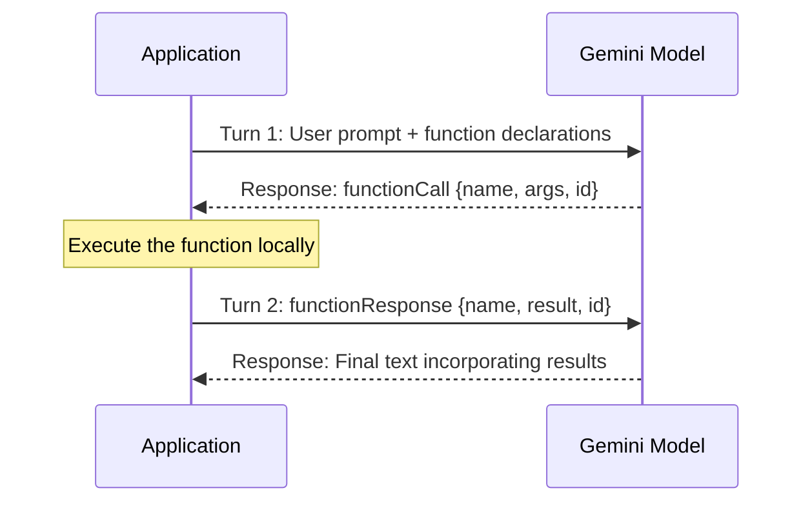
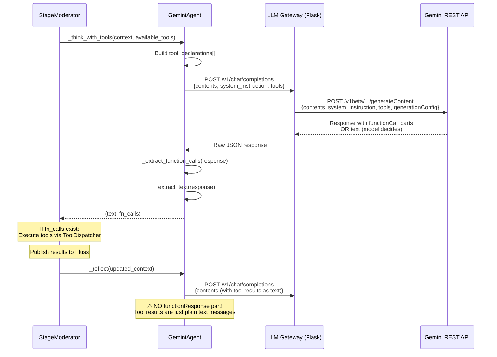
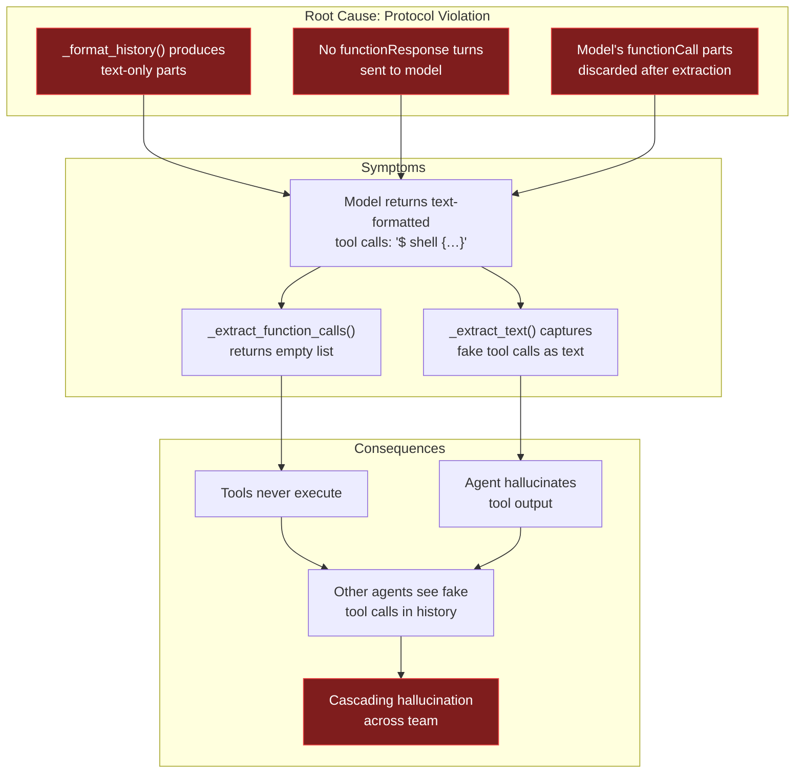
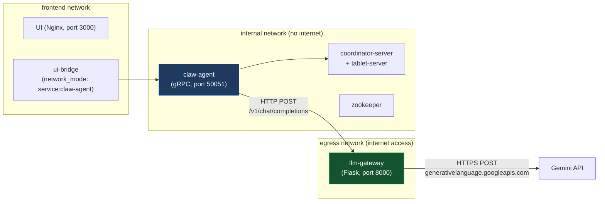
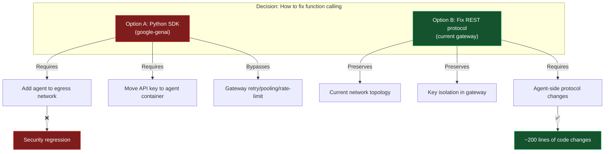
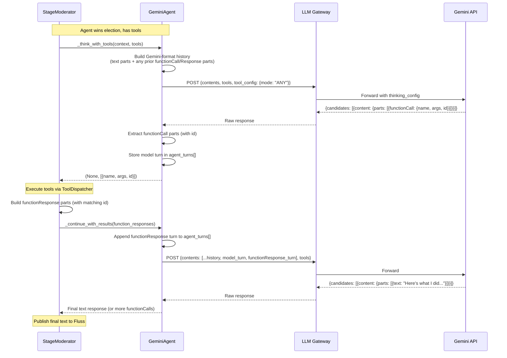
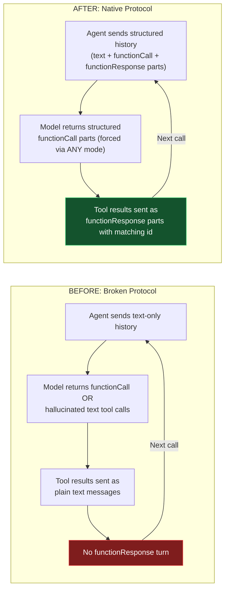
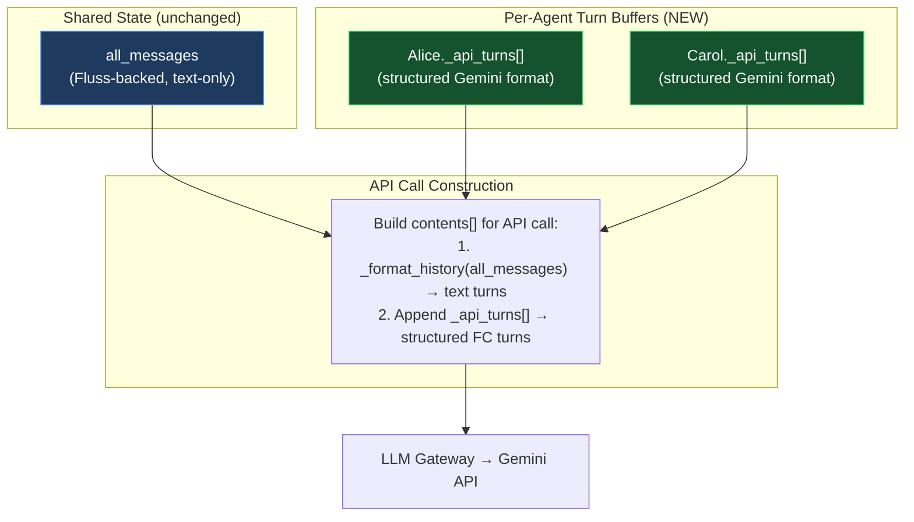
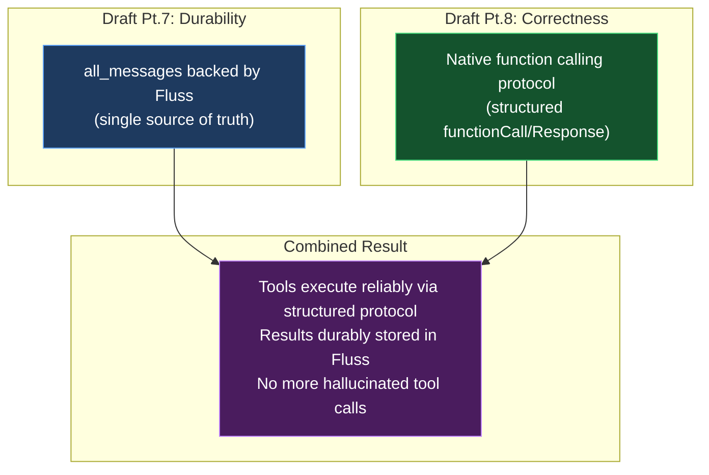

# ContainerClaw — Draft Pt.8: Tool Call Hallucination — Adopting Native Gemini Function Calling

> **Complementary to:** [draft_pt5.md](file:///Users/jaredyu/Desktop/open_source/containerclaw/docs/draft_pt5.md), [draft_pt6.md](file:///Users/jaredyu/Desktop/open_source/containerclaw/docs/draft_pt6.md), [draft_pt7.md](file:///Users/jaredyu/Desktop/open_source/containerclaw/docs/draft_pt7.md)  
> **Focus:** Diagnosing why agents hallucinate tool calls as plain text instead of emitting structured `functionCall` parts, and a rigorous migration to Gemini's native function calling protocol  
> **Version:** 0.1.0-draft-pt8  
> **Date:** 2026-03-20  

---

## 0. Executive Summary

Agents in ContainerClaw frequently **output text representations of tool calls** rather than invoking tools through structured function calling:

```
👂 [Heard] [Alice]: I will restore the architecture files and update our Agile board.

$ board {"action": "list"}
$ shell {"command": "mkdir -p src/model src/view src/controller ..."}
$ shell {"command": "cat <<EOF > src...pass\nEOF"}
$ board {"action": "update", "id": 0, "status": "Done"}
```

The agent writes out what *looks like* tool calls — `$ board`, `$ shell` — as **plain text in its response**. These are not structured `functionCall` parts in the Gemini API response. They are never parsed, never executed, and never produce results. The agent then proceeds as if the tools ran successfully, describing outputs it never received.

**This is not a prompt engineering problem.** It is an **architectural deficiency** in how ContainerClaw integrates with the Gemini API's function calling protocol. The system sends tool declarations but never completes the multi-turn function calling handshake, causing the model to fall back to text-based tool imitation.

This document:
1. Performs a root cause analysis tracing the failure through every layer of the stack
2. Proposes a solution using Gemini's native function calling protocol via REST
3. Defends every code change with architectural reasoning
4. Evaluates REST vs. Python SDK for this project's constraints

---

## 1. Root Cause Analysis

### 1.1 The Function Calling Protocol (What Should Happen)

Gemini's function calling is a **multi-turn protocol** with four steps:



**Critical insight:** The model returns a `functionCall` part (structured JSON, not text) when it wants to invoke a tool. The application **must execute the function** and send back a `functionResponse` part in a subsequent turn. Only then does the model produce a final text response that incorporates the tool's actual output.

If the application **never sends `functionResponse` turns**, the model has no mechanism to receive real tool output. Over successive calls, it learns (through its conversation history) that tool calls never produce results — so it **degrades to simulating tool calls as plain text**, hallucinating both the invocations and their results.

### 1.2 What ContainerClaw Actually Does (The Broken Flow)

Let's trace a single agent turn through the full stack:



#### 1.2.1 The Protocol Violation

The violation occurs in **three compounding failures**:

**Failure 1: No `functionResponse` turn.** After the moderator executes tools via `ToolDispatcher.execute()`, it publishes results to Fluss as plain text messages (e.g., `"[Tool Result for Carol] shell: SUCCESS\n..."`) and appends them to `all_messages`. When `_reflect()` is called, these results arrive in the conversation history as ordinary `user`-role text messages — NOT as `functionResponse` parts. The model never receives the structured signal that its function call was executed.

**Failure 2: No model turn echoed back.** The Gemini function calling protocol requires that after receiving a `functionCall` response, the application appends **both** the model's turn (containing the `functionCall`) AND the user's `functionResponse` turn to the conversation history before making the next API call. ContainerClaw discards the raw API response and reconstructs the conversation entirely from `all_messages` text, losing the structured `functionCall` parts.

**Failure 3: History format mismatch.** `_format_history()` converts all messages into simple `{"role": "user"/"model", "parts": [{"text": "..."}]}` turns. There is no representation for `functionCall` or `functionResponse` parts in this format. Even if the model's previous response contained a proper `functionCall`, it would be converted to text on the next call.

#### 1.2.2 The Degradation Pattern

The model behaves rationally given these constraints:

1. **First few turns:** Model returns proper `functionCall` parts. `_extract_function_calls()` parses them. Tools execute. Results appear in history as text.
2. **Model observes:** Its `functionCall` outputs never come back as `functionResponse` turns. Instead, tool results appear as disconnected text messages from "Moderator".
3. **Model adapts:** Since the structured protocol doesn't work (from the model's perspective), it starts **embedding tool calls as text** in its response — essentially "showing its work" inline. This is the model's fallback for when function calling isn't properly configured.
4. **Cascading failure:** These text-embedded "tool calls" are extracted as `text` by `_extract_text()`, not by `_extract_function_calls()`. No tools execute. The model hallucinates results.

### 1.3 Evidence from the Code

#### Source 1: `GeminiAgent._think_with_tools()` — [moderator.py:135–180](file:///Users/jaredyu/Desktop/open_source/containerclaw/agent/src/moderator.py#L135-L180)

```python
async def _think_with_tools(self, history, available_tools):
    # ... builds tool_declarations ...
    raw_response = await self._call_gateway(
        instr, history, tools=tool_declarations
    )
    text = self._extract_text(raw_response)
    fn_calls = self._extract_function_calls(raw_response)
    # Returns BOTH — but only ONE can be used per turn.
    # The model is supposed to return EITHER text OR functionCall,
    # but with thinking enabled, it can return both.
    return text, calls
```

**Problem:** The method correctly extracts `functionCall` parts from the response. But no `functionResponse` is ever sent back. The model's `functionCall` parts are discarded after extraction — they are never preserved in the conversation history for the next API call.

#### Source 2: `GeminiAgent._format_history()` — [moderator.py:24–43](file:///Users/jaredyu/Desktop/open_source/containerclaw/agent/src/moderator.py#L24-L43)

```python
def _format_history(self, raw_messages):
    formatted = []
    for msg in raw_messages:
        actor = msg['actor_id']
        content = msg['content']
        role = "model" if actor == self.agent_id else "user"
        # ...
        formatted.append({"role": role, "parts": [{"text": text}]})
    return formatted
```

**Problem:** Every message is converted to a text-only part. There is **no code path** that produces `{"functionCall": {...}}` or `{"functionResponse": {...}}` parts. The Gemini API never receives the structured function calling protocol messages.

#### Source 3: LLM Gateway — [llm-gateway/src/main.py:74–78](file:///Users/jaredyu/Desktop/open_source/containerclaw/llm-gateway/src/main.py#L74-L78)

```python
google_payload = {
    "contents": data.get('contents', []),
    "system_instruction": {"parts": [{"text": data.get('system_instruction', '')}]},
    "generationConfig": gen_config,
    "tools": data.get('tools', [])
}
```

**The gateway is actually correct** — it faithfully forwards the `tools` array to the Gemini API. The issue is upstream (agent doesn't send proper history) and downstream (agent doesn't process `functionCall` responses correctly).

#### Source 4: Thinking Configuration — [llm-gateway/src/main.py:66–72](file:///Users/jaredyu/Desktop/open_source/containerclaw/llm-gateway/src/main.py#L66-L72)

```python
if 'gemini-3' in model:
    if 'thinking_config' not in gen_config:
        gen_config['thinking_config'] = {'thinking_level': 'HIGH'}
    gen_config.setdefault('max_output_tokens', 8192)
```

**Compounding factor:** With thinking at `HIGH`, the model produces extensive internal reasoning. When function calling isn't properly configured, the model's thinking process may include "what I would do with these tools" — and then emit that reasoning as its actual response, complete with text-formatted tool calls.

### 1.4 The Complete Failure Cascade



---

## 2. Decision: REST vs. Python SDK

### 2.1 Architecture Constraints

ContainerClaw runs in a Docker Compose environment with a **three-network topology**:



**Key constraint:** The `claw-agent` container is on the `internal` network with **no internet access**. It can reach the `llm-gateway` via HTTP, but cannot call `generativelanguage.googleapis.com` directly. API keys are stored as Docker secrets, accessible to the gateway container.

### 2.2 Option A: Python SDK (`google-genai`)

| Aspect | Assessment |
|---|---|
| **Automatic function calling** | ✅ SDK handles the multi-turn loop automatically |
| **Thought signatures** | ✅ SDK manages Gemini 3 thought signatures transparently |
| **Function ID mapping** | ✅ SDK maps `functionResponse.id` to `functionCall.id` automatically |
| **Network access** | ❌ SDK calls `generativelanguage.googleapis.com` directly — requires egress from agent container |
| **Key management** | ❌ API key must be available inside the agent container, not just the gateway |
| **Network topology change** | ❌ Would require adding `claw-agent` to the `egress` network, breaking the security boundary |
| **Gateway bypassed** | ❌ The `llm-gateway`'s connection pooling, retry logic, and rate limiting would be circumvented |
| **Thinking config** | ❌ The gateway's centralized thinking/output token configuration would need to be replicated in agent code |

**Verdict: ❌ Not viable without redesigning the network security model.** The entire point of the `llm-gateway` is that the agent container has no internet access. Using the Python SDK would require either:
- Moving the agent to the `egress` network (security regression)
- Running a local proxy that the SDK targets (unnecessary complexity over REST)

### 2.3 Option B: REST via LLM Gateway (Current Approach, Fixed)

| Aspect | Assessment |
|---|---|
| **Network topology** | ✅ No changes — agent calls gateway, gateway calls Gemini |
| **Key management** | ✅ Keys stay in Docker secrets, only accessible to gateway |
| **Connection pooling** | ✅ Gateway's `requests.Session` with retry strategy preserved |
| **Thinking config** | ✅ Centralized in gateway |
| **Function calling protocol** | ⚠️ Must be implemented manually — agent must construct proper `functionCall`/`functionResponse` parts in the REST payload |
| **Thought signatures** | ⚠️ Must be handled manually (Gemini 3 returns `thought_signature` on parts that must be echoed back) |
| **Function ID mapping** | ⚠️ Must be implemented manually — extract `id` from `functionCall`, include in `functionResponse` |

**Verdict: ✅ The right choice.** The REST approach preserves the security architecture and requires only changes to the agent's conversation history management — no infrastructure changes.

### 2.4 Decision Matrix



**Decision: Stick with REST via the LLM Gateway. Fix the agent-side protocol handling.**

---

## 3. Target Architecture: Native Function Calling Over REST

### 3.1 Design Principles

1. **Per-agent conversation turns** — The Gemini API conversation history for function calling must preserve the exact structure of `functionCall` and `functionResponse` parts. This is a per-agent concern, separate from the shared `all_messages` Fluss log.
2. **Shared history remains text** — The `all_messages` list (backed by Fluss) continues to store text representations of what happened. It is the source of truth for cross-agent context. But individual agent API calls use a richer format.
3. **The gateway remains a transparent proxy** — No changes to the gateway. It already forwards `tools` and returns raw Gemini responses.
4. **Forced function calling mode (`ANY`)** — When tools are available, use `tool_config.function_calling_config.mode = "ANY"` to force the model to emit `functionCall` parts instead of text. This eliminates the ambiguity that causes text-formatted tool calls.
5. **Function ID tracking** — Every `functionCall` returned by Gemini 3 includes an `id`. The `functionResponse` must echo this `id` back so the model can map results to calls.

### 3.2 New Data Flow



### 3.3 Contrast: Before vs. After



### 3.4 Per-Agent Turn Buffer Architecture

The key architectural change is introducing a **per-agent turn buffer** that maintains the structured Gemini conversation format alongside the flat `all_messages` text history.



**Why a separate buffer?** The `all_messages` list is a shared, cross-agent resource that represents the "public" conversation. It stores text-only messages published to Fluss. But the Gemini function calling protocol requires structured `functionCall` and `functionResponse` parts that are specific to a single agent's API interaction. These parts:
- Should not be broadcast to other agents (they would confuse agents who didn't make the call)
- Must preserve exact Gemini API format including `thought_signature` fields
- Are ephemeral to a single tool execution turn — once the cycle completes and the agent produces a final text response, the structured parts are no longer needed

---

## 4. Proposed Changes

### 4.1 Phase 1: Agent-Side Protocol Fix

**Goal:** Implement the complete Gemini function calling multi-turn protocol in `GeminiAgent`, using `ANY` mode when tools are available, and properly constructing `functionResponse` turns.

**Estimated effort:** ~150 lines changed across `moderator.py`.

---

#### 4.1.1 [MODIFY] [moderator.py](file:///Users/jaredyu/Desktop/open_source/containerclaw/agent/src/moderator.py) — Add Per-Agent Turn Buffer

**New instance variable on `GeminiAgent.__init__()` (line 20):**

```python
def __init__(self, agent_id, persona, api_key):
    self.agent_id = agent_id
    self.persona = persona
    self.api_key = api_key
    self.gateway_url = f"{config.LLM_GATEWAY_URL}/v1/chat/completions"
    self.model = config.DEFAULT_MODEL
    self._api_turns = []  # Structured turns for Gemini function calling protocol
```

**Defense:**
- `_api_turns` stores the structured model response and `functionResponse` turns for the **current tool execution cycle only**. It is cleared after each election cycle completes.
- It is a `list[dict]` where each dict is a Gemini `Content` object (with `role` and `parts` — including `functionCall` and `functionResponse` parts).
- This is intentionally ephemeral — it is NOT persisted to Fluss. The public record of tool execution is the text published to `all_messages`. The structured parts are an implementation detail of the Gemini API protocol.

---

#### 4.1.2 [MODIFY] [moderator.py](file:///Users/jaredyu/Desktop/open_source/containerclaw/agent/src/moderator.py) — Update `_call_gateway()` to support tool config

**Current (lines 45–64):**
```python
async def _call_gateway(self, sys_instr, history, is_json=False, tools=None):
    payload = {
        "system_instruction": sys_instr,
        "contents": self._format_history(history),
        "generationConfig": {"response_mime_type": "application/json"} if is_json else {}
    }
    if tools:
        payload["tools"] = tools
```

**Proposed:**
```python
async def _call_gateway(self, sys_instr, history, is_json=False, 
                         tools=None, tool_config=None, 
                         extra_turns=None):
    contents = self._format_history(history)
    # Append structured API turns (functionCall/functionResponse) if present
    if extra_turns:
        contents.extend(extra_turns)

    payload = {
        "system_instruction": sys_instr,
        "contents": contents,
        "generationConfig": {"response_mime_type": "application/json"} if is_json else {}
    }
    if tools:
        payload["tools"] = tools
    if tool_config:
        payload["tool_config"] = tool_config
```

**Defense:**
- `extra_turns` allows appending structured `functionCall`/`functionResponse` turns after the text-formatted history. This preserves the existing history format while adding the protocol-required structured parts.
- `tool_config` enables passing `function_calling_config.mode` to the API (needed for `ANY` mode).
- **Zero impact on existing callers** — `_vote()`, `_think()`, and `_reflect()` all call `_call_gateway()` without these new kwargs, so they continue to work unchanged.

---

#### 4.1.3 [MODIFY] [moderator.py](file:///Users/jaredyu/Desktop/open_source/containerclaw/agent/src/moderator.py) — Rewrite `_think_with_tools()` with Proper Protocol

**Current (lines 135–180):** Sends tools, extracts `functionCall` parts, but never sends `functionResponse` back.

**Proposed:**
```python
async def _think_with_tools(self, history, available_tools):
    """Enhanced thinking with Gemini native function calling protocol.

    Uses mode=ANY to force structured functionCall output when tools
    are available. Returns (text, function_calls) where function_calls
    include the 'id' field required for functionResponse mapping.
    """
    tool_names = ", ".join(t.name for t in available_tools)
    instr = (
        f"You are {self.agent_id}, participating in a multi-agent software engineering team. "
        f"Persona: {self.persona}. "
        f"You have access to tools: [{tool_names}]. "
        "Use them when you need to take action — read files, write code, run commands, "
        "manage the project board, or run tests. "
        "If no action is needed, respond with text explaining why.\n\n"
        "CRITICAL: If the Moderator just announced you won the election, you SHOULD contribute. "
        "Do not skip your turn if you were specifically chosen to speak."
    )

    # Build Gemini function declarations
    tool_declarations = [{
        "function_declarations": [
            {
                "name": tool.name,
                "description": tool.description,
                "parameters": tool.get_schema(),
            }
            for tool in available_tools
        ]
    }]

    # Force function calling mode to ANY — model MUST emit functionCall parts
    # or structured text, never text-formatted tool imitations
    tool_config = {
        "function_calling_config": {
            "mode": "ANY"
        }
    }

    raw_response = await self._call_gateway(
        instr, history, 
        tools=tool_declarations,
        tool_config=tool_config,
        extra_turns=self._api_turns,
    )

    text = self._extract_text(raw_response)
    fn_calls = self._extract_function_calls(raw_response)

    # Preserve the model's response turn for the function calling protocol.
    # This includes thought_signature fields that Gemini 3 requires to be
    # echoed back in subsequent turns.
    if raw_response and fn_calls:
        try:
            model_turn = raw_response['candidates'][0]['content']
            self._api_turns.append(model_turn)
        except (KeyError, IndexError):
            pass

    # Normalize function calls — preserve 'id' for functionResponse mapping
    calls = []
    for fc in fn_calls:
        calls.append({
            "name": fc.get("name", ""),
            "args": fc.get("args", {}),
            "id": fc.get("id", ""),  # Gemini 3 always returns an id
        })

    return text, calls
```

**Defense:**
- **`mode: "ANY"`** — Per the [Gemini function calling docs](file:///Users/jaredyu/Desktop/open_source/containerclaw/docs/gemini_funcion_call.md), `ANY` mode constrains the model to **always predict a function call** and guarantees function schema adherence. This eliminates the ambiguity where the model might choose to output text-formatted tool calls instead of structured `functionCall` parts.
- **`extra_turns=self._api_turns`** — This appends any prior `functionCall`/`functionResponse` turns from this tool execution cycle. On the first call, `_api_turns` is empty. On subsequent calls (after tool results are fed back), it contains the full structured exchange.
- **`self._api_turns.append(model_turn)`** — The model's response content (including `thought_signature` on parts) is preserved verbatim. The Gemini 3 docs explicitly state: *"Always send the thought_signature back to the model inside its original Part"* and *"Always include the exact id from the function_call in your function_response."*
- **`"id": fc.get("id", "")`** — Gemini 3 models always return a unique `id` with every `functionCall`. This must be included in the corresponding `functionResponse` so the model can map results to calls.

> [!NOTE]
> The `[WAIT]` handling changes here. With `mode: "ANY"`, the model cannot return `[WAIT]` as text — it must return a function call. If the agent truly has nothing to do, it won't match any tool call criteria and the model's behavior depends on the declarations. We address this in the `_execute_with_tools()` restructuring (§4.1.5) by falling back to `_think()` (text-only, no tools) if the agent needs to decline action.

---

#### 4.1.4 [NEW METHOD] [moderator.py](file:///Users/jaredyu/Desktop/open_source/containerclaw/agent/src/moderator.py) — `_send_function_responses()`

**New method on `GeminiAgent`:**

```python
async def _send_function_responses(self, history, function_responses, 
                                    available_tools):
    """Send function execution results back to the model.

    Implements Step 4 of the Gemini function calling protocol:
    append functionResponse parts and request the model's next action.

    Args:
        history: The shared all_messages context (text format).
        function_responses: List of dicts with keys:
            'name' (str), 'response' (dict), 'id' (str)
        available_tools: List of Tool objects (for continued tool use).

    Returns:
        tuple: (text_response, function_calls) — same shape as _think_with_tools().
    """
    # Build the functionResponse turn
    response_parts = []
    for fr in function_responses:
        response_parts.append({
            "functionResponse": {
                "name": fr["name"],
                "response": fr["response"],
                "id": fr["id"],
            }
        })

    # Append the functionResponse turn to the per-agent buffer
    self._api_turns.append({
        "role": "user",
        "parts": response_parts,
    })

    instr = (
        f"You are {self.agent_id}. Persona: {self.persona}. "
        "You executed tools and the results are provided. "
        "Based on these results, decide your next action: "
        "call more tools if needed, or provide a text summary of what you accomplished."
    )

    tool_declarations = [{
        "function_declarations": [
            {
                "name": tool.name,
                "description": tool.description,
                "parameters": tool.get_schema(),
            }
            for tool in available_tools
        ]
    }]

    # Use AUTO mode for follow-up — model can choose text OR more tool calls
    tool_config = {
        "function_calling_config": {
            "mode": "AUTO"
        }
    }

    raw_response = await self._call_gateway(
        instr, history,
        tools=tool_declarations,
        tool_config=tool_config,
        extra_turns=self._api_turns,
    )

    text = self._extract_text(raw_response)
    fn_calls = self._extract_function_calls(raw_response)

    # If more function calls, preserve this turn too
    if raw_response and fn_calls:
        try:
            model_turn = raw_response['candidates'][0]['content']
            self._api_turns.append(model_turn)
        except (KeyError, IndexError):
            pass

    calls = []
    for fc in fn_calls:
        calls.append({
            "name": fc.get("name", ""),
            "args": fc.get("args", {}),
            "id": fc.get("id", ""),
        })

    return text, calls
```

**Defense:**
- **`functionResponse` part structure** — Per the REST API docs: the `functionResponse` must include `name`, `response` (a dict), and `id` (matching the `functionCall.id`). This is constructed exactly per the API specification.
- **`role: "user"`** — Function responses are always sent as `user` role, per the Gemini API protocol.
- **`mode: "AUTO"`** — After receiving function results, the model should be free to either produce a text summary or request more tool calls. `AUTO` mode allows this flexibility, while `ANY` was needed for the initial call to prevent text-formatted tool imitation.
- **`self._api_turns` accumulates** — Each round of function calling adds two entries: the model's `functionCall` turn and the user's `functionResponse` turn. This builds up the full structured conversation for the API, enabling compositional (sequential) function calling.

---

#### 4.1.5 [MODIFY] [moderator.py](file:///Users/jaredyu/Desktop/open_source/containerclaw/agent/src/moderator.py) — Restructure `_execute_with_tools()`

**Current (lines 397–470):** Calls `_think_with_tools()`, executes tools, publishes results as text, calls `_reflect()`. No `functionResponse` protocol.

**Proposed:**

```python
async def _execute_with_tools(self, agent: GeminiAgent) -> str | None:
    """Execute the winning agent's turn with ConchShell tool support.

    Implements the full Gemini function calling protocol:
    1. _think_with_tools() → model returns functionCall parts (forced via ANY mode)
    2. Execute tools via ToolDispatcher
    3. _send_function_responses() → model receives results, may request more tools
    4. Loop until model returns text (final response) or max rounds exceeded

    Returns the agent's final text response (or None).
    """
    available_tools = self.tool_dispatcher.get_tools_for_agent(agent.agent_id)
    shared_context = self._get_context_window()

    # Clear the per-agent turn buffer for this execution cycle
    agent._api_turns = []

    final_text = None

    for round_num in range(config.MAX_TOOL_ROUNDS):
        if round_num == 0:
            text, fn_calls = await agent._think_with_tools(
                shared_context, available_tools
            )
        else:
            # Build functionResponse parts from the last round's results
            function_responses = []
            for call_result in last_round_results:
                function_responses.append({
                    "name": call_result["name"],
                    "response": {
                        "result": call_result["output"],
                        "success": call_result["success"],
                        "error": call_result.get("error"),
                    },
                    "id": call_result["id"],
                })

            text, fn_calls = await agent._send_function_responses(
                shared_context, function_responses, available_tools
            )

        if text:
            final_text = text

        if not fn_calls:
            # Model chose text response — done with tools
            break

        # Execute each tool call
        last_round_results = []
        turn_tool_count = 0

        for call in fn_calls:
            if turn_tool_count >= self.tool_dispatcher.MAX_TOOLS_PER_TURN:
                print(f"⚠️ [{agent.agent_id}] Hit per-turn tool limit")
                break
            turn_tool_count += 1

            tool_name = call["name"]
            tool_args = call["args"]
            call_id = call["id"]  # Gemini 3 function call ID

            print(f"🔧 [{agent.agent_id}] Tool call: {tool_name}({json.dumps(tool_args)[:200]})")
            await self.publish(
                agent.agent_id,
                f"$ {tool_name} {json.dumps(tool_args)[:200]}",
                "action",
            )

            result = await self.tool_dispatcher.execute(
                agent.agent_id, tool_name, tool_args
            )

            # Log tool result
            result_summary = result.output[:500] if result.success else f"ERROR: {result.error}"
            print(f"  → {'✅' if result.success else '❌'} {result_summary[:200]}")
            await self.publish(
                agent.agent_id,
                f"{'✅' if result.success else '❌'} {result_summary[:500]}",
                "action",
            )

            # Publish full tool result to Fluss
            tool_result_content = (
                f"[Tool Result for {agent.agent_id}] {tool_name}: "
                f"{'SUCCESS' if result.success else 'FAILED'}\n"
                f"{result.output[:1000]}"
                f"{(' | Error: ' + result.error) if result.error else ''}"
            )
            await self.publish(
                "Moderator", tool_result_content, "action",
                tool_name=tool_name,
                tool_success=result.success,
                parent_actor=agent.agent_id,
            )

            # Accumulate results for functionResponse construction
            last_round_results.append({
                "name": tool_name,
                "id": call_id,
                "output": result.output[:2000],
                "success": result.success,
                "error": result.error,
            })

        # Poll Fluss to pick up published messages
        await self._poll_once()
        shared_context = self._get_context_window()

    # Clear the per-agent turn buffer — cycle complete
    agent._api_turns = []

    return final_text
```

**Defense:**
- **`agent._api_turns = []` at start** — Ensures a clean protocol state for each election cycle. Previous cycles' structured turns are irrelevant (their content was published to Fluss as text).
- **`last_round_results` accumulation** — Collects tool outputs with their `id` fields for constructing the `functionResponse` turn on the next iteration. This is the critical missing piece: tool results are now sent back to the model as structured `functionResponse` parts, not as disconnected text messages.
- **`round_num == 0` uses `_think_with_tools()`, subsequent rounds use `_send_function_responses()`** — The first call initiates the tool interaction; subsequent calls continue the multi-turn protocol by feeding results back.
- **Fluss publishing is preserved** — Tool results are still published to Fluss for the public record and UI history. The `functionResponse` protocol is a parallel, agent-private channel.
- **`agent._api_turns = []` at end** — Prevents the structured turns from leaking into the next election cycle's context.

---

#### 4.1.6 [MODIFY] [moderator.py](file:///Users/jaredyu/Desktop/open_source/containerclaw/agent/src/moderator.py) — Handle `ANY` mode and `[WAIT]`

With `mode: "ANY"` on the first `_think_with_tools()` call, the model **must** return a function call — it cannot return text (including `[WAIT]`). This requires adjusting the winner handling logic:

**Current (lines 359–388):**
```python
if winner:
    winning_agent = next(a for a in self.agents if a.agent_id == winner)
    if self.tool_dispatcher:
        resp = await self._execute_with_tools(winning_agent)
    else:
        resp = await self._execute_text_only(winning_agent)
    
    if resp and "[WAIT]" not in resp:
        await self.publish(winner, resp, "output")
    else:
        # Nudge logic...
```

**No change needed here.** The `_execute_with_tools()` restructuring handles this naturally:
- If the model wants to act, it returns `functionCall` parts → tools execute → model gets results → final text response.
- If the model decides nothing is needed after seeing tool results, it returns text (since follow-up calls use `AUTO` mode).
- The `final_text` is whatever the model ultimately produces, which can be `[WAIT]` if the model decides after tool results that no further action is needed.
- The only edge case is if the model's first forced function call is a "no-op" call. We mitigate this by not having a "no-op" tool in the declarations — if the model has nothing to do, it will make a benign tool call (like `board list`) which is harmless.

---

### 4.2 Phase 2: Thought Signature Handling for Gemini 3

**Goal:** Ensure `thought_signature` fields on Gemini 3 response parts are preserved and echoed back in subsequent turns.

**Estimated effort:** ~10 lines.

---

#### 4.2.1 [VERIFY] Existing Behavior

The proposed `_think_with_tools()` already preserves the raw model turn:
```python
model_turn = raw_response['candidates'][0]['content']
self._api_turns.append(model_turn)
```

Since `model_turn` is the verbatim content from the API response, any `thought_signature` fields on individual parts are automatically preserved. When this turn is sent back in `extra_turns`, the gateway forwards it to the API unchanged.

**Per the Gemini 3 docs:** *"Always send the thought_signature back to the model inside its original Part. Don't merge a Part containing a signature with one that does not."*

Our approach satisfies this because we never modify the model's response parts — we store and echo them verbatim.

**No additional code changes needed** — the design inherently handles thought signatures correctly by preserving raw API response content.

---

### 4.3 Phase 3: Gateway Enhancement (Optional, Recommended)

**Goal:** Add a `tool_config` passthrough and validate function calling responses in the gateway.

**Estimated effort:** ~15 lines.

---

#### 4.3.1 [MODIFY] [main.py](file:///Users/jaredyu/Desktop/open_source/containerclaw/llm-gateway/src/main.py) — Forward `tool_config`

**Current (lines 74–78):**
```python
google_payload = {
    "contents": data.get('contents', []),
    "system_instruction": {"parts": [{"text": data.get('system_instruction', '')}]},
    "generationConfig": gen_config,
    "tools": data.get('tools', [])
}
```

**Proposed:**
```python
google_payload = {
    "contents": data.get('contents', []),
    "system_instruction": {"parts": [{"text": data.get('system_instruction', '')}]},
    "generationConfig": gen_config,
    "tools": data.get('tools', []),
}
# Forward tool_config if present (function calling mode: ANY/AUTO/NONE/VALIDATED)
if data.get('tool_config'):
    google_payload["tool_config"] = data['tool_config']
```

**Defense:**
- The gateway currently forwards `tools` but not `tool_config`. Without this change, the `mode: "ANY"` setting from the agent would be silently dropped, and the API would default to `AUTO` mode — which is exactly the current broken behavior.
- This is a **transparent passthrough** — the gateway doesn't interpret `tool_config`, just forwards it. No new logic.

---

## 5. Migration Safety: What Doesn't Change

| Component | Impact |
|---|---|
| **LLM Gateway** | ~5 lines: add `tool_config` passthrough. No logic changes. |
| **Fluss schema** | No changes — tool results continue to be published as text to `containerclaw.chatroom`. |
| **`all_messages`** | No changes — the shared history remains text-only. |
| **`_vote()`** | No changes — voting doesn't use tools. |
| **`_think()`** | No changes — pure text thinking for nudge fallback. |
| **`_reflect()`** | **Replaced** by the `_send_function_responses()` protocol in the tool loop. Still available for non-tool reflection. |
| **`ToolDispatcher`** | No changes — tool execution is unchanged. |
| **UI / Bridge** | No changes — they consume Fluss events which are still text. |
| **`_format_history()`** | No changes — it continues to produce text-only turns for the base context. The structured `functionCall`/`functionResponse` turns are appended separately via `extra_turns`. |

---

## 6. Verification Plan

### 6.1 Functional Verification

1. **Start system:** `docker compose down -v && docker compose up --build`
2. **Send a task:** "Create a Python hello world script and run it"
3. **Observe Docker logs for:**
   - `🔧 [Carol] Tool call: file_write(...)` — confirming structured `functionCall` was extracted
   - `✅ Wrote 42 bytes to hello.py` — confirming tool executed
   - `📝 [Moderator] Published to Fluss: Moderator (action)` — confirming result published
   - The agent's final response references actual tool output (not hallucinated)
4. **Negative check:** Search logs for `$ shell`, `$ board`, `$ file_write` as agent text — these patterns should NOT appear in agent responses (they indicate text-formatted tool imitation)

### 6.2 Protocol Verification

1. **Add debug logging** to `_think_with_tools()` and `_send_function_responses()`:
   ```python
   print(f"🔗 [{self.agent_id}] API turns buffer: {len(self._api_turns)} entries")
   print(f"🔗 [{self.agent_id}] Function calls in response: {len(fn_calls)}")
   ```
2. **Verify multi-round tool use:** Send a task requiring multiple tool calls (e.g., "Read the README.md, then create a test file based on it"). Confirm:
   - Round 1: `_think_with_tools()` returns `functionCall` for `file_read`
   - Round 2: `_send_function_responses()` receives file content, returns `functionCall` for `file_write`
   - Round 3: `_send_function_responses()` receives write confirmation, returns text summary

### 6.3 Regression Verification

1. **Election system:** Confirm voting still works (uses `_vote()` which is unchanged)
2. **Nudge handling:** Confirm `[WAIT]` nudge flow still works (uses `_think()` which is unchanged)
3. **UI history:** Refresh UI and confirm `GetHistory` shows tool results with full output
4. **Crash recovery:** Restart agent, confirm Fluss replay works (tool results are in Fluss as text)

### 6.4 `ANY` Mode Edge Cases

1. **Model with nothing to do:** If the winning agent has no meaningful action, `ANY` mode forces a function call. Verify the model calls a benign tool (e.g., `board list`) rather than failing.
2. **Invalid tool call:** If the model generates a malformed function call, verify `ToolDispatcher.execute()` returns an error result that gets fed back as a `functionResponse`.

---

## 7. File-Level Change Summary

| File | Phase | Change | Lines |
|---|---|---|---|
| [moderator.py](file:///Users/jaredyu/Desktop/open_source/containerclaw/agent/src/moderator.py) | 1 | Add `_api_turns` to `GeminiAgent.__init__()` | ~3 |
| [moderator.py](file:///Users/jaredyu/Desktop/open_source/containerclaw/agent/src/moderator.py) | 1 | Update `_call_gateway()` with `extra_turns`, `tool_config` params | ~10 |
| [moderator.py](file:///Users/jaredyu/Desktop/open_source/containerclaw/agent/src/moderator.py) | 1 | Rewrite `_think_with_tools()` with `ANY` mode + turn buffering | ~50 |
| [moderator.py](file:///Users/jaredyu/Desktop/open_source/containerclaw/agent/src/moderator.py) | 1 | New `_send_function_responses()` method | ~55 |
| [moderator.py](file:///Users/jaredyu/Desktop/open_source/containerclaw/agent/src/moderator.py) | 1 | Restructure `_execute_with_tools()` for multi-turn protocol | ~70 |
| [main.py](file:///Users/jaredyu/Desktop/open_source/containerclaw/llm-gateway/src/main.py) | 3 | Add `tool_config` passthrough | ~5 |

**Total lines changed:** ~193 lines across 2 files, primarily in `moderator.py`.

---

## 8. Relationship to Previous Drafts

### From Draft Pt.7: Fluss Migration Compatibility

The changes in this document are **fully compatible** with the Fluss migration (Pt.7). Specifically:

- **Tool results continue to be published to Fluss** — the `await self.publish("Moderator", tool_result_content, "action", ...)` calls remain unchanged. The Fluss record is the public history.
- **`_poll_once()` is still called** after tool execution to pick up published messages.
- **`_get_context_window()` still provides the shared context** — the function calling protocol's structured turns are a parallel, per-agent overlay.

The two changes address **orthogonal problems**:
- **Pt.7:** Where tool results are stored (memory vs. Fluss) — the **durability** question
- **Pt.8:** How tool calls are communicated to the LLM (text vs. structured protocol) — the **correctness** question



---

## 9. Future Considerations (Out of Scope)

### 9.1 Parallel Function Calling

The Gemini API supports returning **multiple** `functionCall` parts in a single response (parallel function calling). The current implementation already handles this — `_extract_function_calls()` returns all `functionCall` parts, and the tool execution loop processes them sequentially. The `functionResponse` turn can include multiple response parts, and the `id` field ensures correct mapping.

However, the tools could be executed **in parallel** using `asyncio.gather()` for significant speedup. Deferred because sequential execution is simpler and the rate limiting is easier to reason about.

### 9.2 Compositional Function Calling

Gemini supports **compositional** (sequential) function calling where the model chains multiple function calls across turns, using the output of one as input to the next. The proposed architecture supports this natively — the `_api_turns` buffer accumulates across rounds, and the model sees all prior `functionCall`/`functionResponse` pairs in context.

### 9.3 `VALIDATED` Mode

Gemini offers a `VALIDATED` mode (Preview) that constrains the model to either function calls or natural language while ensuring schema adherence. This could replace the `ANY` → `AUTO` mode transition, allowing the model to choose text on the first call without risking text-formatted tool imitation. Not yet GA; revisit when stable.
