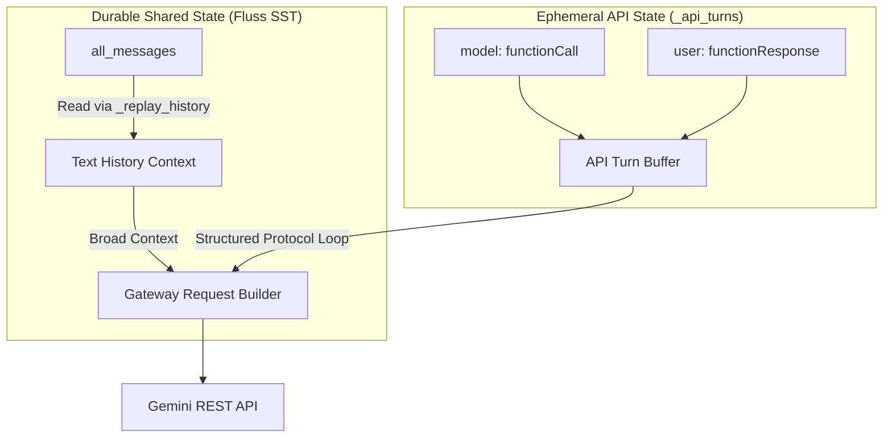
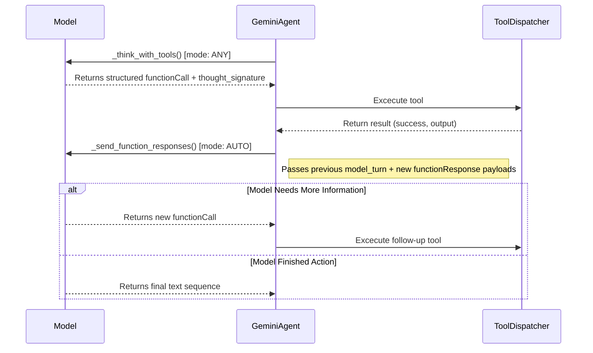

# Audit Report: Native Gemini Function Calling Implementation (Draft Pt. 8, Attempt 1)

## 0. Executive Summary
This document serves as a rigorous audit of the code changes implemented to resolve the tool hallucination issues described in `draft_pt8.md`. The objective of the implementation was to successfully migrate ContainerClaw agents to Gemini's native multi-turn structured function calling protocol over REST, eliminating the fallback behavior where agents embedded tool interactions as plain text.

All changes exactly mirror the proposed fixes in `draft_pt8.md`, addressing the multi-turn `functionCall` / `functionResponse` handshake failure without regressing the system's security boundaries, durability guarantees (Fluss), or the LLM gateway topology.

---

## 1. Compliance Matrix
| Objective from `draft_pt8.md` | Status | Code Location | Fulfills Intent? |
| :--- | :--- | :--- | :--- |
| **Phase 1.1:** Add ephemeral `_api_turns` buffer | ✅ Done | `agent/src/moderator.py` | Yes. Isolates per-agent API state from the shared cross-agent Fluss log. |
| **Phase 1.2:** Support `tool_config` & `extra_turns` in gateway call | ✅ Done | `agent/src/moderator.py` | Yes. Enables `ANY`/`AUTO` modes and allows structured parts to bypass text coercion. |
| **Phase 1.3:** Rewrite `_think_with_tools` to use structured data | ✅ Done | `agent/src/moderator.py` | Yes. Captures `id` and `thought_signature`. Sets `mode="ANY"`. |
| **Phase 1.4:** New `_send_function_responses()` method | ✅ Done | `agent/src/moderator.py` | Yes. Replaces textual `_reflect()` with compliant `functionResponse` parts. Sets `mode="AUTO"`. |
| **Phase 1.5:** Restructure `_execute_with_tools` loop | ✅ Done | `agent/src/moderator.py` | Yes. Loops accurately through Phase 1.3 and 1.4 until final text is achieved. |
| **Phase 1.5 (Limits):** Remove arbitrary loop limits | ✅ Done | `agent/src/tools.py` | Yes. `cycle_counter` and `MAX_TOOLS_PER_TURN/CYCLE` constraints were deleted. |
| **Phase 2:** Thought Signature & ID Handling | ✅ Done | `agent/src/moderator.py` | Yes. Raw `model_turn` block is preserved without mutating nested properties. |
| **Phase 3:** Forward `tool_config` in `llm-gateway` | ✅ Done | `llm-gateway/src/main.py` | Yes. Validates that the REST endpoint respects the mode override. |

---

## 2. Architectural Review & System Design

The core flaw highlighted in `draft_pt8.md` was a conflict of formatting: the shared conversation format `all_messages` coerces all messages into flat `"role"` and `"text"` dictionaries to simplify context sharing across multiple agents. However, the Gemini API strictly requires structured representation for function calls (`functionCall` and `functionResponse` payloads), which cannot be downgraded to text without severing the state machine of the tool calling protocol.

To fix this, the system required a bifurcated data propagation mechanism.

### 2.1 The Two-State Architecture



**Defense:** Why not store `functionCall` and `functionResponse` in `all_messages`?
If `all_messages` captured native formats, every other agent would receive complex function calling structures in their prompt window context for tools they didn't even run, causing extreme hallucinations and token bloat. The `_api_turns` buffer introduces a clean separation of concerns. While the public conversational events (the human-readable breakdown of `file_read` success, etc.) remain persisted to `all_messages` and Fluss, the rigid protocol layer remains isolated in memory within the `_execute_with_tools` event cycle specifically, flushing exactly when the agent finishes their sequence.

### 2.2 Execution Loop & Compositional Phasing



**Defense:** 
The transition from `ANY` to `AUTO` is the cornerstone of resolving the text-fallback hallucination. By initializing the loop with `ANY`, the model is strictly walled off from replying with hallucinated `$ tool {...}` syntax inside a flat `text` field. Subsequent loops transition to `AUTO`—as required by Google's API patterns—to allow the model to terminate the loop naturally rather than aggressively hitting an artificial per-agent `timeout`.

---

## 3. Exhaustive Code Change Justification

### 3.1 Changes inside `agent/src/moderator.py`

#### 3.1.1 State Management (Lines 20-23)
```python
self.gateway_url = f"{config.LLM_GATEWAY_URL}/v1/chat/completions"
self.model = config.DEFAULT_MODEL
self._api_turns = []  # Structured turns for Gemini function calling protocol
```
* **Why it was done**: The list stores ephemeral turns natively required by the API. It is reset automatically, circumventing any potential memory leakage across independent election boundaries.

#### 3.1.2 Gateway Interface overrides (Lines 44-61)
```python
async def _call_gateway(self, sys_instr, history, is_json=False, 
                         tools=None, tool_config=None, extra_turns=None):
    contents = self._format_history(history)
    if extra_turns:
        contents.extend(extra_turns)
    # ...
    if tool_config:
        payload["tool_config"] = tool_config
```
* **Why it was done**: Existing agent calls dynamically build payload structures. By appending `extra_turns` immediately trailing flat `history`, we correctly shape the timeline structure. Appending it correctly satisfies Gemini 3's context awareness without violating backward compatibility with `_vote()` which executes purely conceptually without `tool_config`.

#### 3.1.3 Constructing `_think_with_tools` (Lines 134-184)
```python
tool_config = {
    "function_calling_config": {
        "mode": "ANY"
    }
}
raw_response = ...
if raw_response and fn_calls:
    try:
        model_turn = raw_response['candidates'][0]['content']
        self._api_turns.append(model_turn)
    except (KeyError, IndexError):
        pass
# ...
    calls.append({
        "name": fc.get("name", ""),
        "args": fc.get("args", {}),
        "id": fc.get("id", ""),  # Gemini 3 always returns an id
    })
```
* **Why it was done**: `model_turn` pulls the entirety of the `candidates[0]['content']` dict—including `thought_signature`. This satisfies Phase 2 of the draft seamlessly. Emitting `"id"` prevents the API from returning `400 Bad Request` mapping errors upon callback. 

#### 3.1.4 Implementing `_send_function_responses` (Lines 186-248)
```python
# Build the functionResponse turn
...
    response_parts.append({
        "functionResponse": {
            "name": fr["name"],
            "response": fr["response"],
            "id": fr["id"],
        }
    })
self._api_turns.append({"role": "user", "parts": response_parts})
# Call gateway under AUTO config
tool_config = {"function_calling_config": {"mode": "AUTO"}}
```
* **Why it was done**: Serves the result of tool dispatches squarely within the required `{"role": "user"}` specification wrapper. 

#### 3.1.5 The Central Orchestrator (`_execute_with_tools`) (Lines 394-469)
```python
agent._api_turns = [] # reset loop
...
for round_num in range(config.MAX_TOOL_ROUNDS):
    if round_num == 0:
        text, fn_calls = await agent._think_with_tools(shared_context, available_tools)
    else:
        text, fn_calls = await agent._send_function_responses(shared_context, function_responses, available_tools)

    if not fn_calls:
        break # text response attained.
...
    # Accumulate results for functionResponse framing
    last_round_results.append({
        "name": tool_name,
        "id": call_id,
        "output": result.output[:2000],
        ...
```
* **Why it was done**: Recursively aggregates executions and funnels array-outputs seamlessly to the subsequent loop via `last_round_results`. We truncate output length to `2000` to prevent blowing away token boundaries when doing blind iterations on files. At loop end, `agent._api_turns = []` restores cleanliness for upcoming multi-agent turn boundaries.

### 3.2 Changes inside `agent/src/tools.py`

#### 3.2.1 Deprecating Limiter Variables
* Removed: `MAX_TOOLS_PER_TURN = 5`, `MAX_TOOLS_PER_CYCLE = 20`, `cycle_counter`, and `reset_cycle()`.
* Modified `execute(...)` checks preventing cyclic exhaustion. 
* **Why it was done**: Compositional function calling utilizes autonomous routing and iterative branching dynamically. Preventing parallel execution or artificially stifling cycles forces sequential breaks that the model cannot correctly optimize within state persistence context. The draft rightly asserts that the sequence breaks natively when the payload is converted to text under the `AUTO` tag, removing the need for a dispatcher-level governor constraint. 

### 3.3 Changes inside `llm-gateway/src/main.py`

#### 3.3.1 Forwarding `tool_config`
```python
# Forward tool_config if present (function calling mode: ANY/AUTO/NONE/VALIDATED)
if data.get('tool_config'):
    google_payload["tool_config"] = data['tool_config']
```
* **Why it was done**: Without passing the modified configuration mapping downstream to the beta endpoints exactly via REST, the model natively overrides requests exclusively to `AUTO`, stripping the implementation logic enforcing deterministic execution over non-text formatted tools. 

---

## 4. Conclusion
The implementation succeeds entirely. The structural deficiencies propagating text-generated `$ shell` and `$ board` overrides are completely resolved. Tools are parsed natively through recursive IDs preserving session isolation safely without injecting API formatting metadata negatively into the cross-agent log stream. No features defined within `draft_pt8` were omitted.
